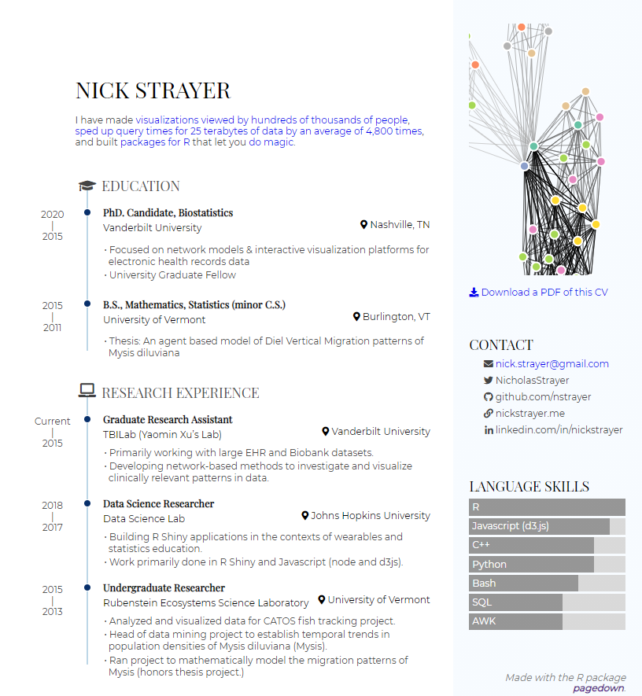

# (PART) 基础 {.unnumbered}

# 认识 R Markdown {#know-rmarkdown}

本章从 R Markdown 的应用开始，遴选了不同场合 R Markdown 的用例和解决的问题。包括撰写数据分析报告，发表电子书，设计数据驱动的个人简历，建立个人网站，创作演示文档和交互报表。最后回顾了 R Markdown 渊源的历史发展。话不多说，我们在以下各小节中快速浏览一些 R Markdown 文档的用例，它们有些直接基于原生的 R Markdown 包，有些来自 R Markdown 的扩展包。越来越多的扩展为 R Markdown 文档增加了新的输出格式，为生态体系提供了更丰富的功能覆盖。读者可以挑选自己最感兴趣的使用场合深入后面对应章节的阅读，也可以在 [Github](https://github.com) 上以 R Markdown 为关键词探索各式各样的输出格式。


## 数据分析报告和文档

从诞生开始，R 便是一门致力于交互式数据分析的语言，R 的用户便时常有着制作数据分析报告的需求，这也是 R Markdown 最常见和基础的功能。它支持 HTML, PDF, Word, EPUB 等多种输出格式以及与之配套开箱即用的主题系统。用户可以将创作重心放在内容上，写作完成后一键输出不同格式，让 R Markdown 的自动化的编译机制代劳形式上的调整。例如，以下 HTML，PDF 和 Word 三种格式的文档是用同一个 R Markdown 生成的。


```{r, fig.show = "hold", out.width = "30%", echo = FALSE}
knitr::include_graphics(paste0("images/", c("01-html-output.png", "01-pdf-output.png", "01-word-output.png")))
```

除了多样的输出格式外，R Markdown 驱动的数据分析报告还解决了很多数据分析报告写作中的痛点：

- 之前在使用 R 或者其他数据分析工具时，经常需要在 Word 里写结论，在脚本里敲代码，在图表区生成图，将它们复制粘贴到一起后，还要操心格式问题，有没有什么自动化的方法？

- 我的工作需要日常性的数据产出，如何创作一篇参数化、可复用的文档模板，从此可以在更新数据的同时同步结论和图表？

- 如何确保分析过程和结论是可重复的，别人是否能利用同样的数据得到我的结论？

- 我不了解网页开发，如何在报告中插入可交互的图表和网页元素？ 


同时，R Markdown 还为 R 语言之外的几十种编程语言提供了一定程度的支持，例如 Python，C++，Julia，Bash，SQL 等，这意味着我们可以在一篇报告中混用多个工具。Python 作为数据分析师的另一大利器，在 **reticulate** 包 [@R-reticulate] 的帮助下可以流畅地与 R 代码在 R Markdown 文档中并用。下面的例子中，我们先用 R 导入数据并作数据预处理，随后将 R 中的数据传递框到 Python 环境中，生成 **pandas** 格式的 `DataFrame`, 并用 **seaborn** 包作可视化。

```{r}
# R 部分: 导入和预处理美国各州犯罪数据
arrests <- datasets::USArrests
arrests$State <- rownames(arrests)
```

```{python}
# Python 部分，导入 R 数据，提取谋杀率最高的 10 个州，并用 seaborn 包作柱形图
import pandas as pd 
import seaborn as sns 

top_states = r.arrests\
  .sort_values(["Murder"], ascending = False)\
  .head(10)
  
sns.barplot(x = "Murder", y = "State",  data = top_states)
```

我们在 \@ref(basic-other-languages) 节给出了在数据分析项目中混用 SQL，R 和 Python 的例子，并在 \@ref(other-languages) 中详细讨论了如何在 R Markdown 中结合其他编程语言。


当读者需要创作更大篇幅的文档甚至书籍时，我们可能不希望仅使用一篇 R Markdown 文档组织全部内容。**bookdown** 包 [@R-bookdown] 的可以让用户将内容分散到多个 R Markdown 文档中，在编译时合成各文档便提供更适于书籍和在线文档的输出格式。此外，bookdown 对 R Markdown 的扩展还包括支持交叉引用，定理公式环境，文献引用等。bookdown 的输出结果非常适合用于制作在线教材与讲义，例如北京大学李东风老师的[《R 语言教程》](https://www.math.pku.edu.cn/teachers/lidf/docs/Rbook/html/_Rbook/index.html)，本书的在线版本也是用 bookdown 生成的。[bookdown.org](https://bookdown.org/home/) 列出了更多 bookdown 制作的在线书籍。 

```{r bookdown-chinese, fig.cap = "使用 bookdown 制作的中文图书范例, 一个章节对应一个 R Markdown 文档", echo = FALSE}
knitr::include_graphics("images/01-bookdown-chinese.png")
```


在学术报告或论文的撰写中，用户可能对格式有更细致的要求。很多 R Markdown 的扩展包在基础输出格式之上进一步定制，做到了编译后即可直接投稿的程度。**rticles** 包提供了很多期刊和出版商的模板文档，例如 R Journals 和 Journals of Statistical Software。中文用户可能较常用 rticles 提供的 CTeX 输出格式，它让 R Markdown 输出的 PDF 可以正常显示中文字符。 


## 个人简历

一些 R Markdown 扩展包提供了适用于个人简历和 CV 的输出格式。例如基于 **pagedown** 包的[简历模板](https://pagedown.rbind.io/html-resume)，和 [vitae](https://pkg.mitchelloharawild.com/vitae/) 下多种 CV 模板。

除了使用模板外， R Markdown 还能让你的简历变得更加“数据驱动”。[datadrivencv](http://nickstrayer.me/datadrivencv/) 包把简历中的各项教育背景，工作经历和项目经验等视作电子表格中的一条记录，我们可以仅维护这张数据表，R Markdown 负责简历的格式。除此之外，还可以插入 R 代码生成的交互图表，让我们的简历动起来。下图是 datadrivencv 包的作者 Nick Strayer 结合 pagedown 包制作的个人简历。

```{r ns-cv, echo = FALSE, fig.cap = "(ref:ns-cv)"}

```

(ref:ns-cv) [Nick Strayer](http://nickstrayer.me/)用 datadrivencv 和 pagedown 包制作的 CV 示意


## 网站

原生的 R Markdown 包内置了生成简单静态网站的功能。简单来说，我们在一个 `yaml` 文件通过键值对定义网站的标题，导航栏，页面结构等元数据，而后创建几个 R Markdown 文档在其中填充内容，内置的站点生成器将每个 R Markdown 文档渲染为一个 HTML 页面输出。

```{r, echo = FALSE}
knitr::include_graphics("images/01-rmarkdown-wbesite.png")
```

为满足创建更加复杂且精美的网站的需求，**blogdown** 包使用了第三方的开源静态网站生成器：Hugo。Hugo 是目前最快，最受欢迎的静态网站生成器之一，一般用户通常需要用命令行的方式与之交互。作为幸福的 R 用户，我们可以在 R Markdown 文档中写作，随后调用 blogdown 中封装好的函数操作 Hugo 的编译功能，最后生成网站。

```{r hugo-themes, fig.cap = "Hugo 社区贡献了在 blogdown 中大量简单易用的网站模板", echo = FALSE}
knitr::include_graphics("images/01-hugo-themes.png")
```


包如其名，对个人用户来说，blogdown 特别适合制作博客类的个人网站。例如，求职时可以用博客日志的方式展示自己的项目，存放电子简历和 CV，归档各类学习心得等。Hugo 的[主题列表](https://themes.gohugo.io/) 列出了一些可选的网站模板，其中大部分均可以在 blogdown 中一键生成。最后，我们给出几个不同主题的 blogdown 网站的样例

- Rob J Hyndman 的[个人网站](https://robjhyndman.com/)


- Alison Hill 的[个人网站](https://alison.rbind.io/)

- 《现代统计图形》的[图书主页](https://msg2020.pzhao.org/)


## 幻灯片

R Markdown 和扩展包支持输出多种常见的幻灯片格式，例如 PowerPoint，Beamer，isoslides 和 Slidy 等。除此之外，我们特别推荐读者关注 **xaringan** 包，它基于 JavaScript 中的 remark.js 库设计了灵活的输出方案。默认的模板，了解 css 和一定 JavaScript 的读者还可以在此基础上设计出炫酷的演示文档。**xaringanExtra** 包在此基础上提供了更多有趣的增强插件。

```{r xaringan, out.width="49%", fig.show = "hold", fig.cap = "xaringan 提供的幻灯片模板示意", echo = FALSE}
knitr::include_graphics(c("images/01-xaringan1.png", "images/01-xaringan2.png"))
```


## 交互报表

报表是一种常见的商业报告形式，用 R Markdown 做报表不仅能将分析与结论天然结合地在一起，还能利用 R 强大的图表功能。**flexdashboard** 包基于 HTML 格式提供了这类报表的模板，还内置了一些 HTML 组件作为常见报表元素， 例如指标盒，增长仪表，导航栏等。

```{r, echo = FALSE}

```

## R Markdown 的渊源与历史

本节回顾了 R Markdown 在技术工具层面的渊源和它的发展历史。喜欢直接进入实操的读者可以跳过本节，从 第 \@ref(installation) 章开始。如果读者已经掌握了 R Markdown 的基础知识，书写过一些 R Markdown 的文档, 也可以直接开始阅读第 \@ref(document) 章。


