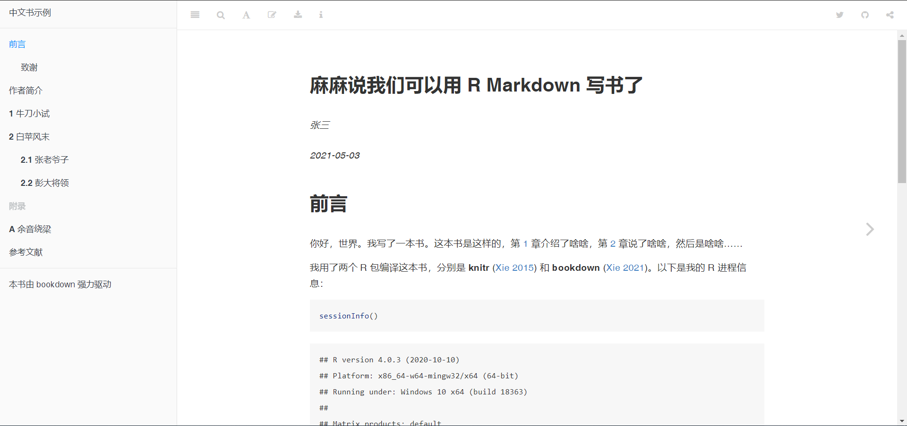
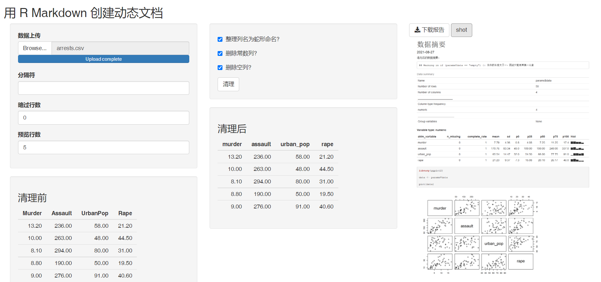

\mainmatter

# (PART) 初识 R Markdown {.unnumbered}

# R Markdown概述 {#rmarkdown-intro}

## R Markdown 的渊源 {#rmarkdown-source}

在过去的十多年间，R 语言发展的十分迅猛，这其中就包括了 R Markdown。这段往事可能要追溯到 2007 年。那时候，还在中国人民大学上学的谢益辉开始使用 Sweave，并沉迷于此无法自拔。不仅自己在写作业的时候尽可能的使用 Sweave，还持之以恒地向同学们兜售。Sweave 的命名是 S + weave，前者指的是 S 语言，这是 R 语言的前身，后者含义即“编织”。Sweave 之所以受到谢同学的追捧，正是因为它可以将某些东西编织起来——代码和代码执行后的结果。直到今天，Sweave 仍然是 RStudio 中从 Rnw 文档生成 PDF 的重要工具之一。

不过，因为 Sweave 中存在某些非常不好用的特性，所以对 Sweave 的痴迷也让谢益辉“深受其害”。这种痛苦和挣扎成为促使他开发 **knitr** [@R-knitr] 的源动力[^knitr-in-the-beginning]。显而易见，**knitr** 的编写从一开始就受 Sweave 影响，甚至命名的逻辑都是一样的。knitr 是 knit + R，前者的意思仍然是“编织”，后者则是 R 语言。而且 knitr 的读音听起来就跟另一个单词“neater”是一样的，给人一种更加灵巧的感觉！

[^knitr-in-the-beginning]: 谢益辉曾经说过自己“受过几年 Sweave 折磨，最后才揭竿而起。”

时至今日，**knitr** 是 CRAN 中依赖最多的包之一（<https://blog.csdn.net/qq_18055167/article/details/104374971>），与另外的 4600 多个包存在依赖、被依赖、建议安装等关系。**rmarkdown** 排第四，与 CRAN 中的其它软件包有超过 3600 种各类联系。

虽然 **knitr** 的编写受到 Sweave 影响，但模块化程度更高，扩展方便，支持文档类型也更多（Sweave 主要用于 LaTeX 文档）。与此同时，Sweave 中的一些优良特性也被 **knitr** 继承了下来，例如行内代码。从这个意义上说，Sweave 是 **knitr** 的“爸爸”。而 knitr 也其它一些包的“爸爸”，其中的一个就是 **rmarkdown** [@R-rmarkdown]。**knitr** 包和 **rmarkdown** 包，以及其它一些扩展 R Markdown 功能的软件包，都是实现 R Markdown 功能的基础设施。最终，这些包一起成就了 R Markdown 的庞大生态系统。

回过头来看，当年谢益辉写 **knitr** 包只是为了更方便地完成自己的作业，而 **knitr** 可以写作业，也可以用来写数据分析报告，碰巧做数据分析的人都要写报告。在 **knitr** 之前有 Sweave，他用了好几年，刚开始觉得很兴奋，用着用着就到了四处碰壁的状态，觉得**一个绝妙的想法**不幸得到了一个蹩脚的实现。直到后来决定推倒重写算了。

在谈到开发经验时，他谈到：

> 不用看远方，就看你自身能感受到的非常痛苦的问题。如果你能解决自己的一个非常痛而且频繁出现的痛点，那么有相当大的概率你也会造福别人，从而产生重大影响。
>
> 解决的问题越基础越好，比如大家常用工作流程中必经的一步，这一步也许已经有现成解决方案了，但每个月总有那么三十来天让你对这个解决方案感到不满。越基础的问题，影响的人群就越广。
>
>   —— 谢益辉（2018）

2021 年，在巴西举行的 R-Day 会议上，谢益辉曾经官方解释过这段历史，感兴趣的读者不妨去看一下“Knitr 亲述历史”：<https://slides.yihui.org/2021-Brazilian-R-Day.html>。


### R Markdown 与文学化编程 {#r-markdown-literate-programming}

初学者可能会认为 **rmarkdown** 软件包就是 R Markdown 的全部，但是事实并非如此。R Markdown 是文学化编程的一种实现方式，她包含了一系列目的各异又相互联系的工具和软件包，而本书只能介绍其中有限的几个。文学化编程就是前面刚刚提及的**一个绝妙的想法**，那就是高德纳（Knuth, Donald E.）在 1984 年提出的编程方法，旨在取代结构化编程范型。文学编程范型让程序员用自己思维内在的逻辑和流程所要求的顺序开发程序，而且用人类日常使用的语言写出来，就好像一篇文章一样。

文学化编程本来是为了编程和写文档两个目的而生的，想法看起来很好，但同时完成这两件事情绝非易事。编程通常就是代码加注释，大家都熟悉这个套路，没有人在代码之间长篇大论写文档来解释这里的代码在干什么；文档通常也是相对独立于代码的。嵌入了代码的文档或嵌入了文档的代码对于一般读者来说都不易读。这么看来，文学化编程并非一个很好的点子。

然而，文学化编程范式却无意间影响了可重复的科学研究。它不适合单纯写代码，但非常适合写数据分析报告。虽然数据分析的过程往往是一团糟，但结果经常是图文并茂，这也就是文学化编程可以充分发挥实力的地方。代码嵌入文档中的目的并非为了单纯的编译，而是更好的展示分析结果（合理使用文字与图表等）。代码和文档结合之后，也便于动态的调整输出结果[^literate-programming]。

[^literate-programming]: 上述两段文字摘自谢益辉博客 2014 年 1 月 3 日的一篇文章，有删改。原文见：<https://yihui.org/cn/2014/01/literate-programming/>。

## 以案例形式初识 R Markdown {#rmarkdown-example}

**rmarkdown** [@R-rmarkdown] 一个是 R 语言的扩展包，提供了以 `.Rmd` 文件格式为中心的数据科学写作框架。它的核心思想是创作包含文本和代码的动态文档，让数据与叙事并进，最终提供易重复，易共享的数据分析环境。

本章从 R Markdown 的应用开始，遴选了不同场合 R Markdown 的用例和解决的问题。包括：

- 撰写数据分析报告

- 用交互笔记本记录学习过程

- 发表电子书和长篇文档

- 设计数据驱动的个人简历

- 建立个人网站和博客

- 创作演示文档和交互报表。

- 用动态文档自动化报告发布

最后，本书回顾了 R Markdown 的技术渊源和发展。

### 数据分析报告 {#example-report}

从诞生开始，R 便是一门致力于交互式统计与数据分析的语言。而 R 用户的需求也自然而然地着重于数据分析与分析报告的生成，这也是 R Markdown 最常见的用途。

R Markdown 支持 HTML, PDF, Word, EPUB 等多种输出格式，以及与各种输出格式配套且开箱即用的主题系统。用户可以将工作重心放在内容创作上，即在写作完成后只需一键输出，让 R Markdown 的自动化的编译机制代劳形式上的调整。例如，只需要几行代码，同一个 R Markdown 文档就可以生成图 \@ref(fig:three-output-demo) 中 HTML，PDF 和 Word 三种格式的文档。

```{r three-output-demo, fig.show = "hold", fig.align='default', out.width = "33%", echo = FALSE, fig.cap = "同一个 R Markdown 文档可以生成多种格式的输出"}
knitr::include_graphics(paste0("examples/", c("three-output-html.png", "three-output-pdf.png", "three-output-word.png")))
```

除了多样的输出格式外，R Markdown 驱动的数据分析报告还解决了很多数据分析报告写作中的痛点：

- 之前在使用 R 或者其他数据分析工具时，经常需要在 Word 里写结论，在脚本里敲代码，在图表区生成图，将它们复制粘贴到一起后，还要操心格式问题，有没有什么自动化的解决方案？

- 我的日常工作包含大量重复性高的数据分析与产出，如何创作一篇参数化、可复用的文档模板，从此可以在更新数据后系统性的产出结论与图表？

- 如何确保分析过程和结论是可复现的，即别人是否能利用同样的数据得到相同的结论？

- 我不了解网页开发，如何在报告中插入可交互的图表和网页元素？

同时，R Markdown 还为 R 语言之外的几十种编程语言提供了一定程度的支持，例如 Python，C++，Julia，Bash，SQL 等，这意味着用户可以在一篇报告中混用多种编程语言。例如，Python 是数据分析的另一大利器，在 **reticulate** 包 [@R-reticulate] 的帮助下，用户可以在 R Markdown 文档中流畅地并用 Python 和 R[^knitr-python-install]。在下面的例子中，本书先用 R 导入数据并作数据预处理，随后将 R 中的数据传递到 Python 环境中，生成 **pandas** 格式的 `DataFrame`, 并用 **seaborn** 包进行可视化。

[^knitr-python-install]: 用户在安装好 **reticulate** 包后需使用 `py_install("package")` 样式的代码来安装需要使用的 Python 程序包。如 `py_install("pandas")` 代码会安装 pandas 程序包。本章的例子还额外使用了 **pandas** 和 **seaborn** 两个 Python 的第三方包，可以通过 `pip` 或者 `conda` 等工具安装。

```{r}
# R 部分: 导入和预处理美国各州犯罪数据
arrests <- datasets::USArrests
arrests$State <- rownames(arrests)
```


```{python, eval = FALSE}
# Python 部分，导入 R 数据，提取谋杀率最高的 10 个州，并用 seaborn 包作柱形图
import pandas as pd
import seaborn as sns

top_states = r.arrests\
  .sort_values(["Murder"], ascending = False)\
  .head(10)

sns.barplot(x = "Murder", y = "State",  data = top_states)
```

本书第 \@ref(other-language) 节详细讨论了如何在 R Markdown 中结合其他编程语言。

创作更大篇幅的文档或书籍时，仅用一个 R Markdown 文件组织全部内容难以维护。**bookdown** 包提供了更适于长篇文档和书籍的输出格式，用户可以用多个 R Markdown 文档创作一本书的不同章节。此外，**bookdown** 包还提供了交叉引用，定理和公式环境，文献引用等扩展功能。**bookdown** 的输出结果非常适合用于制作在线教材与讲义，例如北京大学李东风老师的[《R 语言教程》](https://www.math.pku.edu.cn/teachers/lidf/docs/Rbook/html/_Rbook/index.html)，本书的在线版本也是用 **bookdown** 生成的。[bookdown.org](https://bookdown.org/home/) 汇集了更多 **bookdown** 制作的在线书籍。

```{r bookdown-chinese-demo, fig.cap = "使用 bookdown 制作的中文图书范例, 一个章节对应一个 R Markdown 文档", echo = FALSE}

```

在学术报告或论文的撰写中，用户可能对格式有更细致的要求。越来越多的包提供了易用的 R Markdown 模板，为用户免去了繁杂的手动格式调整，编译后即可直接投稿。**rticles** 包 [@R-rticles] 提供了很多期刊和出版商的模板文档，例如 R Journals 和 Journals of Statistical Software。中文用户可能较常用 **rticles** 包提供的 CTeX 输出格式，它让 R Markdown 输出的 PDF 可以正常显示中文字符。


### 交互笔记本 {#example-note}

**rmarkdown** 和 **bookdown** 等包支持运行代码，插入图片，公式，交叉引用和参考文献等常见元素，还可以组合长篇文档。因此、统计，数据科学、计算机科学乃至社会科学等领域的学生，研究人员和爱好者们时常使用 R Markdown 为首选的笔记本格式。

```{r notebook-preview, echo = FALSE, fig.cap = "RStudio 支持实时预览 R Markdown 笔记本格式"}
knitr::include_graphics("images/01-notebook-preview.png")
```

如图 \@ref(fig:notebook-preview) 所示，R Markdown 笔记本支持运行代码，插入运行结果，添加文本样式和批注等功能。R Markdown 的交互特性让学习记录变得十分自然：用户通常添加一段代码，运行后得到预料之中/之外的可视化结果，随后在下面的多个代码块中反复调整某个参数，直至得到想要的结果。在此过程中用户常常会发现更多相关的包或代码，写下对不同代码的总结，并链接网络上他人的用例，甚至开始撰写自动化脚本。最后，用户可以一键生成包含了这一系列思考和学习过程的 HTML 或 PDF 精美文档。图 \@ref(fig:notebook-preview) 是一个 PDF 笔记文档示例。

```{r notebook-preview2, echo = FALSE, fig.cap = "用 R Markdown 生成 PDF 学习笔记"}
knitr::include_graphics("images/01-notebook-preview2.png")
```

即便用户的工作不涉及数据分析或代码运行，使用 R Markdown 作为笔记软件也有许多好处。用户可以流畅地使用版本控制工具，管理笔记依赖的数据，图片的资源等。用户可以将长篇笔记拆分为多个源文档，用纯文本文件管理输出设置，形成清晰的项目结构。[RPubs](https://rpubs.com/) 和 [bookdown](https://bookdown.org/) 等平台提供了免费的 R Markdown 文档发布服务，以此来发布自己的笔记与心得，便利他人和未来的自己。

### 个人简历 {#example-cv}

一些 R Markdown 扩展包提供了适用于个人简历（resume, CV）的输出格式。例如基于 **pagedown** 包 [@R-pagedown] 的[简历模板](https://pagedown.rbind.io/html-resume)，和 [vitae](https://pkg.mitchelloharawild.com/vitae/) 提供的 CV 模板。

除了提供模板外， R Markdown 还能使简历变得更加以“数据驱动 (Data driven)”。[**datadrivencv**](http://nickstrayer.me/datadrivencv/) 包把简历中的各项教育背景，工作经历和项目经验等视作电子表格中的一条记录，用户仅需维护这张数据表，并由 R Markdown 来负责简历的格式。用户还可以插入 R 代码生成的交互图表，使简历可以“动”起来。图 \@ref(fig:ns-cv) 是 **datadrivencv** 包的作者 [Nick Strayer] (http://nickstrayer.me/) 结合 **pagedown** 包制作的个人简历。

```{r ns-cv, echo = FALSE, fig.cap = "Nick Strayer 用 datadrivencv 和 pagedown 包制作的 CV 示意。"}
knitr::include_graphics("images/01-resume.png")
```


### 网站 {#example-resume}

**rmarkdown** 包支持生成简单的静态网页。用户通过 YAML 配置文件定义网站的标题，导航栏，页面结构等元数据，而后创建数个 R Markdown 文档组成网站的不同 HTML 页面。

```{r, echo = FALSE, fig.cap = "用 R Markdown 创建网站"}
knitr::include_graphics("images/01-rmarkdown-wbesite.png")
```

**rmarkdown** 包内置的网站功能较为简单。**blogdown** 包 [@R-blogdown] 提供了更复杂的网站功能，它使用了开源的网站工具：Hugo。Hugo 是目前速度最快，最受欢迎的静态网站生成器之一。一般用户通常需要在命令行调用 Hugo，不过作为幸福的 R 用户，读者可以照常写作 R Markdown 文档，随后调用 **blogdown** 包中封装好的函数间接地使用 Hugo，最后生成网站。

```{r hugo-themes, fig.cap = "blogdown 包可以使用 Hugo 主题", echo = FALSE}
knitr::include_graphics("images/01-hugo-themes.png")
```

包如其名，对个人用户来说，**blogdown** 特别适合制作博客类的个人网站。读者可以展示个人项目，存放简历，归档学习笔记和心得，求职时为自己添加一份切实的筹码。[rbind](https://support.rbind.io/about/) 还提供了免费的域名服务。除此之外，用户还可以用 blogdown 制作其他类型的网站，例如软件文档，课程主页等。Hugo 的[主题列表](https://themes.gohugo.io/) 列出了丰富的网站模板，其中大部分可以在 blogdown 中一键生成。最后，本书提供几个不同主题的 blogdown 网站样例以供读者参考：

- Rob J Hyndman 的[个人网站](https://robjhyndman.com/)

- Alison Hill 的[个人网站](https://alison.rbind.io/)

- 《现代统计图形》的[图书主页](https://msg2020.pzhao.org/)

### 幻灯片 {#example-ppt}

R Markdown 和扩展包支持输出多种常见的幻灯片格式，例如 PowerPoint，Beamer，isoslides 和 Slidy 等。除此之外，本书还特别推荐 **xaringan** [@R-xaringan] 包。**xaringan** 基于 JavaScript 中的 remark.js 库设计了灵活的输出方案。对 CSS 和 JavaScript 语法有一定了解的读者还可以基于默认模板自定义出复杂的演示文档。**xaringanExtra** 包为 **xaringan** 幻灯片提供了更多有趣的增强插件。读者可以在 <https://slides.yihui.org/xaringan/#1> 和 <https://pkg.garrickadenbuie.com/xaringanExtra/#/> 看到更多示例。

```{r xaringan, out.width="49%", fig.show = "hold", fig.cap = "xaringan 提供的幻灯片模板示意", echo = FALSE, fig.align="default"}
knitr::include_graphics(c("images/01-xaringan1.png", "images/01-xaringan2.png"))
```

### 交互报表 {#example-forms}

报表是一种常见的商业报告形式，用 R Markdown 开发报表不仅可以将数据分析过程与商业结论结合地在一起，还能帮助用户充分发挥 R 语言强大的可视化功能。基于 HTML 格式的 **flexdashboard**[@R-flexdashboard] 包提供了这类报表的模板，还内置了一些常用报表元素的 HTML 组件， 例如指标盒，增长仪表，导航栏等。

```{r flexdashboard, echo = FALSE, fig.cap = "用 flexdashboard 包制作的仪表板"}
knitr::include_graphics("images/01-flexdashboard.png")
```

除去开发上的便捷易用外，R Markdown 生态还提供了丰富的测试，部署，自动化和持续集成功能，加速并确保用户的数据产品投入生产的效率。


### 动态文档 {#example-dynamic}

除了直接使用编辑器写作外，用户还可以调用编程 API `rmarkdown::render()` 生成文档，并动态地设置文档使用的各项参数。这让用户可以自动化、参数化地批量生成文档。一个典型场景是：数据库每日更新全国销售数据，而数据分析师用自动化脚本控制 R Markdown 来根据不同地区与职务来生成多个更有针对性的报表。这样的动态文档是通过参数实现的，也就是说用户在源文档中使用参数的名字，而不是具体的数据来进行定义。随后在脚本中通过 `rmarkdown::render()` 动态来传入当日的数据。


```{r dynamic-document, fig.cap = "根据 Shiny 输入动态生成 R Markdown 文档", echo = FALSE}

```

图 \@ref(fig:dynamic-document) 是一个结合 Shiny 包动态生成 R Markdown 输出文档的例子。R Markdown 允许用户上传某个数据集，挑选需要数据清理的维度，随后把清理结果动态地传递给 `rmarkdonw::render()`，从而生成右侧截图所示的输出文档。
