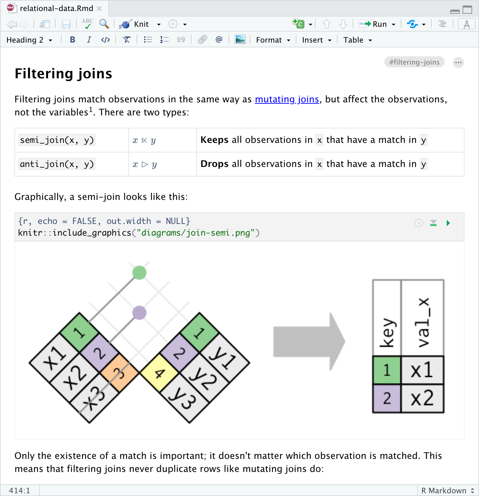

# R Markdown 的基础知识 {#rmarkdown-base}

本节首先介绍 R Markdown 相关的软件配置，并带领读者编译第一个 R Markdown 源文档，生成 HTML 和 PDF 两种格式。随后探讨了 R Markdown 的编译机制。最后介绍了各类通用的文档元素。

## 安装 RStudio  {#rstudio-config}

本书推荐读者使用 RStudio 编辑器作为开发环境。RStudio 编辑器是 R 社区中最流行的编辑器之一，并集成了许多便利 R Markdown 文档书写的功能，例如简单的图形化按钮，在线预览，视觉编辑器等。RStudio 编辑器的免费开源版本可从 <https://www.rstudio.com/products/rstudio/> 下载，英文名称为 RStudio Desktop Open Source Edition。

安装完成后，打开 RStudio 编辑器，基本界面如下图所示。

```{r, fig.cap = "RStudio 编辑器的基本界面", echo = FALSE}
knitr::include_graphics("images/02-rstudio.png")
```

RStudio 编辑器默认将工作区域分为三个面板，其中左侧为为 R 的控制台 (console)，用于交互式的代码输入和输出；中间为编辑器 (editor)。右上包括当前 R 进程的环境，历史和连接等信息，右下包括文件浏览器，图和帮助文档等。读者可以通过菜单栏中的 Tools -\> Global Options -\> Pane Layout 调整面板的排列。


## 安装 rmarkdown 包 {#install-rmarkdown}

R Markdown 文档的编译依赖于同名的 `rmarkdown` R 包，在控制台中输入如下命令安装：[^02-base-1]

[^02-base-1]: 如果下载速度较慢，可以在 RStudio 的 Tools -\> Global Options -\> Packages 将 Primary Cran Repository 更改为距离自己更近的镜像源。也可以在 `install.packages` 中设置 `repos` 参数。

```{r, eval = FALSE}
install.packages("rmarkdown")
```

安装完成后，在 RStudio 的菜单栏中选择 File -\> New File -\> R Markdown，点击 OK 后， 即可创建一个新的 R Markdown 文档模版，如下图所示

```{r, fig.show = "hold", out.width = "45%", echo = FALSE, fig.align= "left", fig.cap = "(ref:create-rmd)"}
knitr::include_graphics("images/02-create-rmd.png")
knitr::include_graphics("images/02-create-rmd2.png")
```

(ref:create-rmd) 在 RStudio 中创建 R Markdown 文档

随后，RStudio 创建了一个 `untitled.Rmd` 文件，展示如下：

```{r, echo = FALSE, fig.cap = "RStudio 的 中 R Markdown 编辑器"}
knitr::include_graphics("images/02-create-rmd3.png")
```

`.Rmd` 文件是 R Markdown 的源文档，是撰写 R Markdown 文档的主要工作区域，一个文档的内容、格式、标题等都在这里定义，本书后续章节对文本和代码的编辑均是围绕类似这样的源文档展开的。

为了验证 rmarkdown 包及 RStudio 配置成功，可以在 RStudio 中打开 `untitled.Rmd` 文件，然后点击右上角的 Knit 按钮，即可在 RStudio 中看到编译后的文档，如下图所示。

```{r knit-button, echo = FALSE, fig.cap = "源文档上方的编译按钮"}
knitr::include_graphics("images/02-knit-button.png")
```

```{r first-rmarkdown, echo = FALSE, fig.cap = "untitled.Rmd 文件输出的 HTML 文档"}
import_example_result("first-rmd.Rmd")
```

`untitled.html` 文件是 `untitled.Rmd` 源文档的编译结果，称为输出文档。HTML 是 R Markdown 文档的默认输出格式，后续章节介绍了其他输出格式的使用方法。

除了 RStudio 中的 Knit 按钮，读者还可以在 RStudio 的控制台中输入如下命令，对 R Markdown 文档进行编译：

```{r, eval = FALSE}
rmarkdown::render("untitled.Rmd")
```

`rmarkdown::render()` 函数是编译 R Markdown 文档的重要工具，也是 Knit 按钮背后调用的函数。读者可以为 `render()` 提供各类参数自定义各项输出设置，将在后续章节中介绍。

### 安装 Tinytex {#install-tinytex}

要想使用 R Markdown 输出 PDF 格式的文档，必须事先安装 LaTeX。LaTeX 有很多发行版，如 MiKTex，MacTeX， TeX Live 等，建议 R Markdown 的用户使用 TinyTeX。

TinyTeX 是一个瘦身版的 TeX Live，去掉了 TeX Live 中对普通用户毫无用处的源代码和文档。通过命令行模式，它的安装要简单的多。

```{r fig.cap="TinyTex 是一个瘦身版的 TeX Live", echo = FALSE}
knitr::include_graphics("images/logo-tinytex.png", dpi = NA)
```

要安装 TinyTeX，只需要在 R 语言终端输入两条命令即可[^02-base-2]。

[^02-base-2]: TinyTeX 与 **tinytex** 并不是一个东西。前者是一个 LaTeX 发行版，后者是一个用来安装和维护前者的 R 语言软件包。

```{r eval=FALSE}
# 安装 tinytex
install.packages("tinytex")

# 安装 TinyTex 套件
tinytex::install_tinytex()
```

如果 TinyTeX 本身的下载安装就很慢，或在 R 里面下载不完整，那么可以用浏览器或其它下载工具直接下载：<https://github.com/yihui/tinytex-releases/releases> 然后把下载的文件路径传给安装函数，比如：

```{r eval=FALSE}
# 假设下载文件所在的位置是 ~/Downloads/TinyTeX-v2021.01.zip
tinytex:::install_prebuilt("~/Downloads/TinyTeX-v2021.01.zip")
```

安装完成后，在 RStudio 中打开之前保存的 R Markdown 源文档，将第三行 `output_format: html_document` 更改为 `output_format: pdf_document`。点击 Knit 后，生成如下两页 PDF 文档，说明安装成功。

```{r, fig.align='default', out.width = "49%", fig.show="hold", echo = FALSE}
knitr::include_graphics(rep(c("images/02-first-rmd-pdf1.png", "images/02-first-rmd-pdf2.png"), 1))
```

#### 安装 LaTeX 组件 {#install-latex-package}

**rmarkdown** 包从版本 1.9 开始，编译 R Markdown 为 PDF 时会调用 TinyTeX。因此，对 R Markdown 用户来说，编译 PDF 是出错的头号原因可能在于缺失某些 LaTeX 包。

LaTeX 包（也被称为"package"）是 LaTeX 的组件，数目非常多，可以用来扩展 LaTeX 的功能。`tinytex::install_tinytex()` 默认只安装了必须的一些组件，在实际使用过程中经常会出现缺少组件的错误。

如果知道包的名称，那么可以直接使用下面的命令安装。这里值得注意的是，对于国内的用户来说，通常需要设定一下 LaTeX 软件仓库的位置。下面的例子中，使用了清华大学的 TeX Live 镜像。

```{r, install-latex-packages, eval=FALSE}
# 安装需要的 LaTeX 组件
tinytex::tlmgr_repo(url = "https://mirrors.tuna.tsinghua.edu.cn/CTAN/systems/texlive/tlnet")
tinytex::tlmgr_install(c("pgf", "preview", "xcolor"))
```

如果不知道包的名称也没有关系，**tinytex** 也提供了相应的函数来帮助用户从报错信息中找到解决方法。`tinytex::parse_install()` 提供两种方法，第一种是通过准确的错误提示，第二种是通过分析 log 文件。如果嫌 log 太长或者找不到具体提示信息，还可以使用第二种办法。

```{r install-latex-package-by-errormsg, eval=FALSE}
# 假如有相关报错信息 "! LaTeX Error: File `preview.sty' not found."
tinytex::parse_install(text = "! LaTeX Error: File `preview.sty' not found.")


# 假如错误 log 名为 tex.log
tinytex::parse_install(log = "tex.log")
```

### 安装 Git (\*) {#install-git}

Git 是一个分布式版本控制软件，最初由 Linus Torvalds 开发[^02-base-3]，于 2005 年以 GPL 协议发布。Git 软件可以在其官方网站下载（<https://git-scm.com/downloads>）。为了与 Git 配合使用，通常还需要注册一个支持 Git 软件仓库托管的配套网站，比较流行网站服务包括 GitHub（<https://github.com>），Gitee（<https://gitee.com/>）等。在这里以 GitHub 为例进行说明。

[^02-base-3]: Linus Torvalds (1969年12月28日－) 生于芬兰赫尔辛基市，拥有美国国籍，Linux 内核的最早作者，随后发起了这个开源项目，担任 Linux 内核的首要架构师与项目协调者，是当今世界最著名的电脑程序员、黑客之一。他 2005 年发布了 Git，是 Git 的主要开发者。

```{r fig.cap="使用 Git 和 GitHub 可以提高团队协作的效率", echo=FALSE}
knitr::include_graphics("images/git-github.png", dpi = NA)
```

#### 配置 Git 和 GitHub {#git-config}

在 Windows 下面[^02-base-4]，安装完 Git 客户端之后，鼠标右键菜单中会多出来两个命令："Git GUI Here"和"Git Bash Here"。前者打开一个图形界面，后者打开一个终端，通过这两个命令都可以进入 Git。

[^02-base-4]: 命令行对于 Linux/Mac 用户应该并不陌生，此处和以下不再另行介绍。

首先需要配置 Git 的用户信息。

``` bash
# 全局配置
$ git config --global user.name "your name"
$ git config --global user.email "xxx@xxx.xxx"
# 本地配置
$ git config user.name "your name"
# 查看配置
$ git config --list
# 查看指定项
$ git config user.name
```

为了能够使用 GitHub 提供的服务，需要先注册一个账号（<https://github.com/signup>）。

#### 使用 Git {#git-usage}

Git 常用的命令有下面几个：

-   `git init sample`

    在当前目录新建一个"sample"目录，在目录中启用 Git 版本控制系统。

-   `git clone https://github.com/cosname/rmarkdown-guide.git`

    从 GitHub 克隆一个软件仓库到当前目录。这将在当前目录新建一个"rmarkdown-guide"文件夹，其中包含所有文件和版本历史。

-   `git status`

    显示当前 Git 仓库的状态。如果有修改，新建，删除等操作，将会自动列举出来。

-   `git add newfile.Rmd`

    `newfile.Rmd` 是一个新建的文件，其中有一些新增的代码。该命令将其加入 Git 追踪的文件清单中。

-   `git commit` 或者 `git commit -a`

    这个命令将执行一次 Commit 操作，系统会打开默认的文本编辑器，以填写本次 Commit 操作涉及的工作内容。

-   `git push`

    将本地仓库的修改推送到远程仓库中去。要执行该命令，本地仓库需要关联一个远程仓库，并且用户对该远程仓库具有修改权限（使用 `git remote -v` 查看本地仓库关联的远程仓库地址）。

-   `git pull`

    将本地仓库的内容与远程仓库同步（这是远程仓库的文件比本地仓库的文件版本新）。

#### 配置 Git 远程仓库的 SSH 认证 {#git-ssh}

SSH 密钥是成对的，包括公钥和私钥；公钥登记到 GitHub 网站，私钥存储在本地计算机（私有）。密钥在本地生成。点击鼠标右键，选择"Git Bash Here"，输入下列命令将生成一对 SSH 密钥。 默认情况下，私钥保存在"`~/.ssh/id_rsa`"文件中，公钥保存在"\~/.ssh/id_rsa.pub"文件中 （在 Windows 系统中的 Git bash 终端下，`~` 代表用户的家目录）。

``` bash
ssh-keygen
cat ./.ssh/id_rsa.pub
```

复制这个公钥的全部内容，进入"GitHub - Setting - SSH and GPG keys"，选择"New SSH key"，将公钥粘贴进去，点击"Add SSH key"，即可完成公钥添加。

这样，以后就调用 "Git Bash Here" 时，便会自动提供私钥认证，不需要输入用户名和密码了。

#### 使用 GitHub {#github-usage}

在 GitHub 网站中，通常主要进行下列操作：

-   创建一个新的软件仓库；

    点击 GitHub 右上角的"+"，选择"Create a new repository"，按照提示操作即可。这步操作其实相当于在 GitHub 服务器上新建了一个目录。目录名称是 `Repository Name`。目录的路径就是 `<username>/<repository_name>`。对应的网址（绝对路径）是 `https://github.com/<username>/<repository_name>`。对应的 Git 地址是 `git://git@github.com/<username>/<repository_name>.git`。对应的 SSH 地址是 `ssh://git@github.com/<username>/<repository_name>.git`。

-   从其他用户的软件仓库中新建一个分支，即 Fork；

    在 GitHub 项目网页中，点击"Fork"即可。

-   为其他用户的软件仓库中贡献代码，即 Pull Request；

    因为自己不具备其他用户拥有的软件仓库的编辑权限，所以无法直接通过 `push` 的方法提交修改。在这种情况下，用户可以首先在 GitHub 上 Fork 其他用户的软件仓库，并在自己的 Fork 中做相应修改后，通过 Pull Request 的方法提交给其他用户，经过管理员审核后，即可合并到对方的软件仓库中去。这也是团队协作共同维护一个项目时的常规操作。

第 \@ref(github-actions) 节还将介绍使用 GitHub Actions 实现自动化完成持续性集成（**C**ontinuous **I**ntegration，CI）的功能。

## R Markdown 的基本元素 {#rmarkdown-element}

第 \@ref(install-rmarkdown) 节中，读者创建了 `untitled.Rmd` 源文件，内容如下：

````{verbatim}
---
title: "Untitled"
output: html_document
---

```{r setup, include=FALSE}
knitr::opts_chunk$set(echo = TRUE)
```

## R Markdown

This is an R Markdown document. Markdown is a simple formatting syntax for authoring HTML, PDF, and MS Word documents. For more details on using R Markdown see <http://rmarkdown.rstudio.com>.

When you click the **Knit** button a document will be generated that includes both content as well as the output of any embedded R code chunks within the document. You can embed an R code chunk like this:

```{r cars}
summary(cars)
```

## Including Plots

You can also embed plots, for example:

```{r pressure, echo=FALSE}
plot(pressure)
```

Note that the `echo = FALSE` parameter was added to the code chunk to prevent printing of the R code that generated the plot.
````


这个文件中包含了 R Markdown 文档中的三个基本元素，从上到下包括：

-   YAML 元数据: 由一对三个减号 (`---`) 包围成的键值对，在 `untitled.Rmd` 中为

````{verbatim}
---
title: "Untitled"
output: html_document
---
````


元数据用 YAML 语法以 `key: value` 的形式指定了源文档的各类输出设置，不涉及具体的正文内容。这里 `untitled.Rmd` 的元数据做了两项设置，`title: "Untitled"` 设定了文档标题，而 `output: html_document` 设定了输出格式为 HTML。

-   代码块：第二个 `---` 后进入文档的正式内容。首先，是由一对三个反引号 (` ``` `) 所包围的代码块 这个代码块的内容是：

```r
knitr::opts_chunk$set(echo = TRUE)
```

这是一个 R 代码块，因为` ```{ ` 后是 `r`，读者还可以将其替换为 ` ```{python `， ` ```{bash ` 等以指定代码块的语言类型。语言名称的后面还可以附上代码块选项。代码块选项与代码块的关系就如同 YAML 元数据之于整个文档一样，用于指定该代码块的运行和输出设置。这里，`setup` 是代码块的标签，`include=FALSE` 指定了这个代码段的内容不会显示在输出中，即隐藏 `knitr::opts_chunk$set(echo = TRUE)` 这一行，第 \@ref(code-block-and-inline) 节解释了它的含义。

-   Markdown 文本：代码块之后是一段文字内容，如下所示

```markdown
## R Markdown

This is an R Markdown document. Markdown is a simple formatting syntax for authoring HTML, PDF, and MS Word documents. For more details on using R Markdown see <http://rmarkdown.rstudio.com>.

When you click the **Knit** button a document will be generated that includes both content as well as the output of any embedded R code chunks within the document. You can embed an R code chunk like this:
```

这段内容使用了 Markdown 语法，在第 \@ref(markdown-syntax) 节详细介绍。简而言之，为了方便作者在文档中插入各种格式的内容，Markdown 语法提供了一系列简单的标记符号，如 `#`，`*`，`-` 等，这些符号可以用来标记文本的标题、列表、引用等。R Markdown 在遇到这些符号时会将相关的文本转换成对应的格式。这里 `## R Markdown` 是一个二级标题，`**Knit**` 是一个加粗的文本，`<http://rmarkdown.rstudio.com>` 是一个链接。

这段 Markdown 文本下面是另外一个 R 代码块

````{verbatim}
```{r cars}
summary(cars)
```
````

这个 R 代码块的标签是 `cars`，内容是 `summary(cars)`。编译过程中，R Markdown 会运行这段代码内容，并将生成的结果插入到该段代码的下方，这个结果可以是文本，也可以是图片，表格等，例如第三个代码块 `plot(pressure)` 就生成了图片。

`untitle.Rmd` 的剩余内容是类似的 Markdown 文本和代码块。

## R Markdown 的编译过程 {#rmarkdown-compile}

点击 `Knit` 按钮或调用 `rmarkdown::render()` 函数后，R 会启动一个新的进程，将源文档转换为输出文档。 之前提到过，`Knit` 按钮本质上就是对 rmarkdown 包中 `render()` 函数的封装。因此，理解 R Markdown 的编译过程就是理解 `render()` 调用了什么方法和工具完成了怎样的文档转换。

首先，`render()` 函数会读取 YAML 元数据，并根据它们设置的选项来调整输出文档的配置。

YAML 元数据读取完毕后，进入文档的正文部分。R Markdown 首先提取正文中的所有代码块，按顺序运行其中的代码，将运行结果插入到代码块的下方。代码的执行过程在底层由 **knitr** [@R-knitr] 包控制，它将代码的运行结果置于合适的位置。之前笼统说的 "R Markdown 运行代码" 实质上就是 knitr 的工作。这一步结束后，knitr 生成了临时性的 `.md` 文件。包含了 Markdown 文本和代码运行结果。例如，`untitled.Rmd` 被转换为 `untitled.md`，包含的内容为：

````{verbatim}
---
title: "Untitled"
output:
  html_document:
    keep_md: true
---


## R Markdown

This is an R Markdown document. Markdown is a simple formatting syntax for authoring HTML, PDF, and MS Word documents. For more details on using R Markdown see <http://rmarkdown.rstudio.com>.

When you click the **Knit** button a document will be generated that includes both content as well as the output of any embedded R code chunks within the document. You can embed an R code chunk like this:


```r
summary(cars)
```

```
##      speed           dist
##  Min.   : 4.0   Min.   :  2
##  1st Qu.:12.0   1st Qu.: 26
##  Median :15.0   Median : 36
##  Mean   :15.4   Mean   : 43
##  3rd Qu.:19.0   3rd Qu.: 56
##  Max.   :25.0   Max.   :120
```

## Including Plots

You can also embed plots, for example:

<!-- -->

Note that the `echo = FALSE` parameter was added to the code chunk to prevent printing of the R code that generated the plot.
````

这里的 `.md` 文档是一个纯文本文件，在内容上已经和最后的输出文档一致，但还需要进行最后的格式转换。接下来，R Markdown 会调用 **Pandoc** 软件负责下一步的转换。Pandoc 是一个开源的命令行程序，可以完成多种文档格式之间的互相转换，已经随 RStudio 下载安装好。这里，Pandoc 将 `.md` 文件 转换为 YAML 头部中 `output` 对应的输出格式。Pandoc 还读取了其他 YAML 头部中的设定，一些被插入文档内容 (如 `title`)，另一些选项则作为命令行参数，对转换过程做特定的控制。用以下代码验证 Pandoc 的安装版本：

```{r, collapse = TRUE}
rmarkdown::pandoc_available()
rmarkdown::pandoc_version()
```

作为总结，对于 HTML 格式，`rmarkdown::render` = `knitr + Pandoc`。 PDF 输出格式还有额外的一步： tinytex 包或其他 LaTeX 发行版编译 Pandoc 生成的 `.tex` 文件，生成 PDF 文档。

本节对编译过程的简介意在让读者对 knitr 和 Pandoc 工具有基础认识。实际写作中较少需要在底层与 knitr 或 Pandoc 做直接交互，但理解它们在 R Markdown 编译中的角色有利于在编译失败时更好地排错，同时为掌握更进阶的排版技巧打好基础。

图 \@ref(fig:knit-process) 概括了 R Markdown 完成以上工作的流程。

```{r knit-process, echo = FALSE, fig.cap = "R Markdown 的编译过程 https://bookdown.org/yihui/rmarkdown-cookbook/rmarkdown-process.html"}
knitr::include_graphics("images/02-knit-process.png")
```

## R Markdown 的组成

了解完 R Markdown 的编译过程后，下面的几节深入介绍了 R Markdown 源文档中的三种元素：YAML 头部，Markdown 文本和代码块。

### YAML 头部 {#yaml}

YAML 元数据中的每一个域 (field) 都定义了输出的一个方面，其中最重要的一个域是 `output` 所指定的输出格式，`output` 选项的值可以是 `html_document`、`pdf_document`、`word_document` 等，这些值对应了不同的输出格式，实质上都是 rmarkdown 包中的函数，例如 `html_document` 对应的函数时 `rmarkdown::html_document`。下面是所有 rmarkdown 包中定义的输出格式

`r knitr::combine_words(grep('^[^_]+_(document|presentation)$', ls(asNamespace('rmarkdown')), value = TRUE), sep = '\n', and = '', before = '- \x60', after = '\x60')`

作者还可以进一步设置某个输出格式的二级选项，例如：

```markdown
---
output:
  html_document:
    toc: true
    toc_float: true
    theme: united
---
```

可用的二级选项可以在对应的输出函数中找到，使用 `?rmarkdown::html_document` 可以查看 `html_document()` 的文档，其中的每一个参数都是可在 YAML 头部中设置的二级选项。

`output` 选项的值还可以是一个列表，这样就可以同时生成多个文档。例如，下面的代码会同时生成 PDF、Word 和 HTML 文档。

```markdown
output:

```yaml
output:
  html_document:
    toc: true
    toc_float: true
    code_folding: hide
  pdf_document:
    toc: true
    number_sections: true
    keep_tex: true
    latex_engine: xelatex
  tufte::tufte_handout: default
```

上面的文档有三种可选的输出格式，`html_document`，`pdf_document` 和 `tufte_html`。

在 `html_document` 格式中，`toc: true` 指定自动生成目录, `toc_float: true` 设置目录的显示方式为浮动侧边栏 (默认标题会固定在正式文字内容之前), `code_folding: hide` 可以折叠所有代码块，但读者可以在每个代码块右上角的选项卡展开内容，这是一个 HTML 输出格式特有的选项。^[注意，YAML 中的布尔变量 `true` 和 `false` 均是小写]

`pdf_document` 格式同样设置了生成目录，`number_sections: true` 自动生成章节编号，`keep_tex: true` 保留 Pandoc 生成的 `.tex` 文件。`latex_engine: xelatex` 设置编译引擎为 XeLaTeX (默认为 pdflatex), 引擎设置对正确显示中文字体非常重要。

`tufte::tufte_handout` 是 rmarkdown 包之外的一个扩展输出格式：用户可以根据自己的需求定制输出格式，不限于 rmarkdown 提供的选择。`tufte::tufte_handout` 是 `tufte` 包中的一个函数，模仿了统计学家 Edward Tufte 以及物理学家费曼的教科书的风格。举一反三，如果需要使用 `foo` 包中的输出格式 `bar`，它定义在 `bar_document` 中，那么 `output` 应该设置为 `output: foo::bar_document`，这里的 `default` 关键字表示使用默认的二级设置。使用多个输出格式时，没有二级选项的输出格式需要使用 `default`。下面的 YAML 元数据是不合法的：

```markdown
---
output:
  pdf_document:
    toc: true
  html_document # 这里需要 default 关键字
---
```

除了 `output` 之外，常见的 YAML 域包括 `title` (标题)、`author` (作者)、`date` (日期)、`subtitle` (副标题) 和 `abstract` (摘要) 等，它们的用法很简单，在 `:` 指定对应的值即可，参见下面的源文档：

`r import_example("examples/yaml-review.Rmd")`

这里，`>` 可以让多行的字符串在输出中按一行输出，起到相反作用的是 `|` 号，它保留字符串中的换行符。`fontsize`, `papersize`, `geometry`, `biblio-title`, `bibliography`,`link-citations`, `documentclass` 等是生成 PDF 文档的通用选项，所以它们不是写在某个输出格式下面 (`pdf_document` 只是能生成 PDF 文档的格式之一)，而是顶层的元数据。类似这样的选项还有很多，读者可以在需要时自行搜索他们的用法。非 PDF 输出格式则会无视它们。

输出结果如 \@ref(fig:yaml-review) 所示。

```{r yaml-review, echo = FALSE, fig.cap = "YAML 元数据对应的 PDF 输出"}
knitr::include_graphics("images/02-yaml-test.png")
```


### Markdown 语法 {#markdown-syntax}

Markdown 标记语言由 John Gruber 于 2004 年创建，以易读，可移植，跨平台等优势成为最受欢迎的技术写作工具之一。借助 Markdown，作者可以在纯文本文档中用特殊的标记符号表示格式，例如用井号 `#` 表示标题，用 `*` 星号表示加粗等。这样的统一中介使作者不必逐个为特定输出格式设置排版方案。

### 简单段内格式

Markdown 提供了很多简单的段内格式化 (inline formatting) 方法，一些基础的格式列举如下：

- 粗体: 前后各添加两个星号 `**`。如 `**加粗**` 在输出文档中变为 **加粗**

- 斜体：前后各添加一个星号 `*`。如 `*斜体*` 变为 *斜体*

- 代码样式: 前后各添加一个反引号 `` ` ``。如 `` `代码` `` 变为 `代码`。如果内容本身有反引号，可以在两边添加同等数量的反引号，如 ``` ``x`` ``` 变为 `` `x` ``

用 `<链接地址>` 插入一个可点击的链接，如 `<https://example.com>` 显示为 <https://example.com>。带文字的超链接格式为：

```
[显示文字](网页链接)
```

例如，`[R Markdown 权威指南](https://bookdown.org/yihui/rmarkdown/)` 显示为 [R Markdown 权威指南](https://bookdown.org/yihui/rmarkdown/)。

### 换行

要在 Markdown 中换行，需在上一段的末尾添加两个或以上空格 (仅一个回车键不能换行)。例如：

```
R is a free software environment for statistical computing and graphics.
It compiles and runs on a wide variety of UNIX platforms, Windows and MacOS.
```

生成:

R is a free software environment for statistical computing and graphics.
It compiles and runs on a wide variety of UNIX platforms, Windows and MacOS.

更简单的办法是在两行间添加一个空行：

```
R is a free software environment for statistical computing and graphics.

It compiles and runs on a wide variety of UNIX platforms, Windows and MacOS.
```

### 段落格式

段落级别 (block-level) 的格式用于创建具有特定格式的整个段落。除了常规文本外，常见的段落元素包括标题，列表，块引用，代码块等。

#### 标题

用引号 `#` 创建不同层级的标题，引号的数量表示标题的层级。如 `# 一级标题` 创建一级标题，`## 二级标题` 创建二级标题，`### 三级标题` 创建三级标题等。注意在井号和标题文字之间要保留一个空格。如果 YAML 元数据中的 `number_sections` 选项设置为 `true`，则章节会自动编号。如果想为某些章节取消标号，可以在标题后添加 `{-}` 或 `{.unnumbered}`, 例子如下：

:::::: {.cols data-latex=""}

::: {.col data-latex="{0.55\textwidth}" style="width: 100%"}

````{verbatim}
---
output:
  html_document:
    number_sections: true
---

# 前言 {-}

# 简介

# 方法

## 方法 1

## 方法 2

# 总结

# 附录 {-}
````

:::

::: {.col data-latex="{0.05\textwidth}"}

:::

::: {.col data-latex="{0.4\textwidth}"}


```{r, echo = FALSE}
import_example_result("examples/markdown-headings.Rmd")
```

:::

::::::


#### 列表

在列表项之前添加减号 `-` 或星号 `*` 以创建列表，同样注意文字前的空格。缩进一个或多个列表项可创建嵌套列表。

```
- First
- Second
- Third
    - Indented
    - Indented
- Fourth item
```

显示为：

- First
- Second
- Third
    - Indented
    - Indented
- Fourth item

还可以用数字编号创建有序列表，与上面的无序列表结合使用，如：

```
1. 第一
2. 第二
  - 首先
  - 其次
3. 第三
```

显示为

1. 第一
2. 第二
  - 首先
  - 其次
3. 第三

#### 块引用

用大于号 `>` 创建一个块引用 (blockquote)

```
> 生活是很枯燥的。我的一生就是力求不要在平庸中虚度光阴。这些小小的案件让我遂了心愿。
```

在输出文档中渲染为：

> 生活是很枯燥的。我的一生就是力求不要在平庸中虚度光阴。这些小小的案件让我遂了心愿。

### 代码块 {#markdown-code}

> 注意: 这里的代码块只是有特殊格式的文字块，不同于可运行的代码，我们也无法在输出文档中得到它们的运行结果。

在文字前后各添加三个反引号 ` ``` ` 可以创建一个代码块，如：

````
```
x <- list(a = 1:10,
          beta = exp(-3:3),
          logic = c(TRUE,FALSE,FALSE,TRUE))

# 计算每个列表元素的均值
lapply(x, mean)
```
````

显示为：

```
x <- list(a = 1:10,
          beta = exp(-3:3),
          logic = c(TRUE,FALSE,FALSE,TRUE))

# 计算每个列表元素的均值
lapply(x, mean)
```

可以在反引号后注明代码块的语言，在输出文档中提供更好的代码高亮支持，以相同的代码块为例：


````
```r
x <- list(a = 1:10,
          beta = exp(-3:3),
          logic = c(TRUE,FALSE,FALSE,TRUE))

# 计算每个列表元素的均值
lapply(x, mean)
```
````

显示为：

```r
x <- list(a = 1:10,
          beta = exp(-3:3),
          logic = c(TRUE,FALSE,FALSE,TRUE))

# 计算每个列表元素的均值
lapply(x, mean)
```

### 图片 {#markdown-figure}

插入图片的语法与超链接类似，只需要在前面多添加一个感叹号, 格式如下^[Markdown 不要求为图片添加替代文字，例如 `` 也可以正常显示图片。但是替代文字可以提供许多好处，例如代替图片加载，增强可达性，帮助搜索引擎优化等。]

```

```

例如, 用 `` 插入以下图片：

::: {.center-container}

:::

### 表格 {#markdown-table}

Markdown 还支持插入表格，语法如下

```
| 元素 | Markdown |
| - | - |
| 块引用 | `> some quotes` |
| 代码块 | ``` some code  ```  |
```

渲染为

| 元素 | Markdown |
| - | - |
| 块引用 | `> some quotes` |
| 代码块 | ``` some code  ```  |


### 总结

表 \@ref(tab:markdown-summary) 总结了常见的 Markdown 语法以及他们的效果。

```{r, echo = FALSE}
library(huxtable)
t <- read.csv("data/markdown.csv", encoding = "UTF-8")
t <- as_huxtable(t)
```

```{r markdown-summary, echo = FALSE}
t <- set_markdown(t, everywhere, everywhere)
set_caption(t, "Markdown 常见语法总结")
```


要显示 Markdown 中的特殊字符时 (#, *, -, ` 等)，可以在前面使用转义符 ``\``

```
\- 这一行不会显示为列表
```

乍一看，Markdown 似乎是一项额外的学习任务，带来了繁多的记忆要求。但如前文所言，Markdown 是对复杂多样格式的简单替代，可以极大地便利写作。在日常的文档书写中，用到的 Markdown 语法也是相对单一和简单的，且 R Markdown 也提供了很多工具降低记忆门槛。

值得一提的是， 虽然 Markdown 本身是一种统一的标准，独立开发者们逐渐添加了不同的功能扩展，一些组织和公司在此基础上加以规范化，形成了不同的 Markdown 变体 (flavor)。 我R Markdown 中使用的是 Pandoc 式的 Markdown，即 Pandoc 支持的 Markdown 语法。一些读者可能还会接触到 ExtraMark Markdown, Github Markdown 等变体。但在大多数情况下，Pandoc Markdown 已经支持了足够多的文本元素，相同元素在不同变体中对应的标记也是一致的。

一些 Markdown 编辑器提供了即时预览功能，方便读者进行交互性的练习。图 \@ref(fig:dillinger) 是一个在线编辑器的例子。

```{r dillinger, echo = FALSE, fig.cap = "支持实时预览的 Markdown 编辑器 https://dillinger.io/"}
knitr::include_graphics("images/03-markdown-editor.png")
```

### 代码块和行内代码 {#code-block-and-inline}

在 R Markdown 中，有两种使用 R 代码的形式: 代码块和行内代码。

R 代码块以 ` ```{r} ` 开始，` ``` ` 结束，作者可以在源文档中插入任意个代码块 ^[虽然 R Markdown 对代码块的长度或个数没有限制，但 最佳实践是让每个代码块自成逻辑，避免把不相关的代码放到同一代码块中。]。与 YAML 元数据控制文档的整体设置类似，可以用代码段选项 (chunk options) 来控制单个代码块的的运行细节。例如生成图片时，可以用 `fig.width` 和 `fig.height` 选项来控制图片的宽度和高度。

````{verbatim}
```{r pressure, fig.width=7, fig.height=5}
plot(cars)
```
````

有时作者只希望展示代码的运行结果，而隐藏具体实现细节，这时可以设置代码段选项 `echo = FALSE`，R Markdown 会照旧运行代码，但仅在输出文档中显示运行结果。如果文档中包含很多代码块，逐个设置选项较为繁琐。这时可以用 knitr 包提供的 `knitr::opts_chunk$set()` 函数为所有代码块统一设置全局选项。例如，在全文档中的第一个代码块中设置：

````{verbatim}
```{r setup, include=FALSE}
knitr::opts_chunk$set(
  echo = FALSE,
  fig.width = 7,
  fig.height = 5,
  fig.align = "center"
)
```

```{r cars}
plot(cars)
```

````

这样，`cars` 及后续的代码块就会继承 `knitr::opts_chunk$set()` 中的选项。通常，全局选项被放置在整个文档的第一个代码块中，且设置该代码块的选项为 `include=FALSE`，这样，这个代码块本身就不会在文档中显示出来了 ^[设置全局 knitr 选项的代码块的标签是约定俗成的 `setup`，使用 RStudio 编辑器时，带有 `setup` 标签的代码块会被第一个执行。]。 如果后续的代码块需要覆盖全局选项，也可以在代码块中重新设置选项。

````{verbatim}
```{r cars, echo=TRUE, fig.width=10}
plot(cars)
```
````

现在 `cars` 代码块的选项为 `echo = TRUE`, `fig.wdith = 10`, `fig.height = 5` 和 `fig.align = "center"`。


一些时候可能不需要单独成段的代码块，而是想在正常 Markdown 文本的同一段嵌入代码的运行结果，这时可以使用行内代码 (inline code)。行内代码位于一对反引号内部，以 `r`  开头，空格后面是 R 的表达式 ^[目前行内代码只支持 R 语言]，例如下面的文本

````{verbatim}
mtcars 数据集共有 `r nrow(mtcars)` 行。
````


在输出文档中变为

```markdown
mtcars 数据集共有 `r nrow(mtcars)` 行。
```

行内代码与定时任务结合使用，可以实现报告文档的自动更新。

行内代码的使用不限于正文，一个常见用法是动态更新文档的编译日期。在 YAML 元数据中可以将 `date` 设置为 R 表达式 `Sys.Date()`，这样每次编译时，R Markdown 都会将日期的值更新为当前编译的日期。

````{verbatim}
---
date: "`r Sys.Date()`"
---
````

### 代码块选项

读者可以在 <https://yihui.org/knitr/options/> 查看所有 knitr 选项和它们的含义，这里列出一些常见选项：

- `eval`: 是否运行该代码块

- `echo`: 是否显示代码块内容

- `results`：如何处理代码块和生成结果

  - `'hide'`: 隐藏代码块的输出结果。`results = 'hide'` 加上 `echo = FALSE` 等价于 `include = FALSE`
  - `'asis'`: 按原样输出结果。默认情况下，knitr 在生成 `.md` 文件时会将代码的文字输出在放在 Markdown 的代码块中
  - `'markup'` 默认设置

- `error`：是否允许代码块包含错误代码。默认情况下，只要一个代码块运行失败，整个 R Markdown 文档就无法编译成功。当想要展示错误的代码写法时，可以用 `error = TRUE` 或 `eval = FALSE`

- `message` 和 `warning`： 是否显示代码块可能输出的提示和警告

- `collapse`: 为 `true` 时，在输出文档中将代码块和结果放到同一个块中

- `fig.width` 和 `fig.height`: 调整代码块生成图形时图形设备 (graphical device)的大小。这是因为 kntir 首先通过图形设备将图片存储为文件 (例如 png, jpg)，随后在输出文档中引用这些文件。默认情况下 `fig.width = 7, fig.height = 5`。个类似的选项是 `out.width` 和 `out.height`, 通常取值为百分比，表示图片占据一页的比例。例如, `out.height = '80%'` 表示图片占据页面高度的 80%。

- `fig.cap`: 代码块生成图片的标题

- `fig.align`: 代码块图片的对齐方式，有三种取值
  - `"left"`: 靠左对齐
  - `"center"` 居中对齐 (本书的设置)
  - `"right"`: 靠右对齐

- `cache`: 是否缓存代码块的运行结果。如果代码块涉及复杂，耗时长的计算，`cache = TRUE` 可以让 knitr 把运行结果保存为 `.rds` 文件，并在下次编译时略过计算过程，直接读取 `.rds` 节省时间。只有代码块的内容发生变化时，knitr 才会重新计算。有时 knitr 的缓存机制会让人难以预测代码是否重新运行，只推荐对确有需要的代码块设置它。


## 页面设置和布局 {#page-layout}

### 控制输出宽度 {#output-width}

### 分页符和分割线 {#page-break}

### 目录 {#catalog}

### 参考文献 {#reference-index}

### 交叉引用


## R Markdown 的文档元素 {#document-element}

### 图片 {#element-plot}

默认情况下，代码块生成的图片在输出文档中被直接插入该代码块的下方。如果一个代码块可以生成多个图片，R Markdown 会把它们拆分成多个代码块，每个代码块生成一个图片，效果如下：

:::::: {.cols data-latex=""}

::: {.col data-latex="{0.55\textwidth}"}

````{verbatim}
如果同一个代码块生成多张图片，结果会被拆分到多个代码块中。

```{r}
plot(cars)
plot(nhtemp)
```
````

:::

::: {.col data-latex="{0.05\textwidth}"}

:::

::: {.col data-latex="{0.4\textwidth}"}


```{r, echo = FALSE}
import_example_result("examples/multi-figure.Rmd")
```

:::

::::::

如果想要把多个图片放在同一个代码块中，可以使用代码块选项 `fig.show = 'hold'`，它告诉 R Markdown 不要拆分代码块，而是运行完全部代码后，把生成的图片依次附在下方。与 `out.width` 选项结合使用，可以将多个图片并排放在同一行中，效果如下：

:::::: {.cols data-latex=""}

::: {.col data-latex="{0.55\textwidth}"}

````{verbatim}
```{r, fig.show = "hold", out.width = "50%"}
plot(cars)
plot(nhtemp)
```
````

:::

::: {.col data-latex="{0.05\textwidth}"}

:::

::: {.col data-latex="{0.4\textwidth}"}


```{r, echo = FALSE}
import_example_result("examples/multi-figure-same-row.Rmd")
```

:::

::::::

### 表格 {#element-table}

不过对于 R Markdown 用户，直接使用 Markdown 表格语法通常是不必要的。knitr 包中的 `kable()` 函数提供了更完善的表格功能，如表 \@ref(tab:kable-example) 所示。

```{r kable-example}
knitr::kable(head(iris), caption = "用 knitr::kable() 创建表格")
```

````{verbatim}
```{r cars-table, fig.cap = "cars 数据集"}
knitr::kable(head(cars))
```
````
生成：

```{r cars-table, fig.cap = "cars 数据集"}
knitr::kable(head(cars))
```


### 公式 {#element-equation}

### 引用 {#element-quote}

### 字体颜色 {#element-textcol}

### 动态交互元件 {#element-dynamic}

### 音频和视频 {#element-video}

### 流程图 {#element-flow}

### 甘特图 {#element-gantt}


## 图形化编辑器

[RStudio 1.4](https://blog.rstudio.com/2021/04/06/rstudio-1-4-a-quick-tour/) 版本及以上为 R Markdown 文档添加了图形编辑模式。打开任意源文档，可以在最右侧发现类似 "A" 的按钮 (图 \@ref(fig:visual-mode-button))，点击可进入可视化编辑器，界面如图 \@ref(fig:visual-editing) 所示。

```{r visual-mode-button, echo = FALSE, fig.cap = "R Markdown 编辑模式切换按钮"}

```

```{r visual-editing, echo = FALSE, fig.cap = "R Markdown 图形编辑模式"}

```

图形化编辑器提供了丰富的菜单栏选项，用于可视化地插入常见文档元素。如图 \@ref(fig:visual-editing-insert-menu) 所示。

```{r visual-editing-insert-menu, fig.cap = "图形化编辑器提供了很多菜单栏选项", echo = FALSE}
knitr::include_graphics("images/04-visual-editing-insert-menu.png")
```

读者可以在 <https://rstudio.github.io/visual-markdown-editing/> 了解更多知识。

