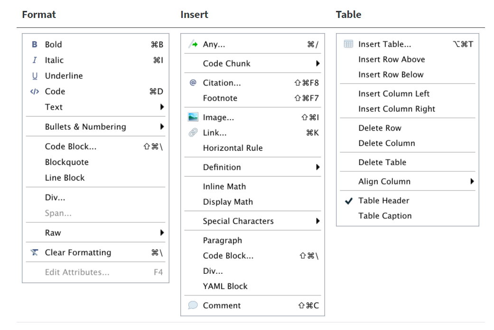

# 基础知识 {#rmarkdown-basics}

```{r, include = FALSE}
source("utils.R")
```


本章介绍使用 R Markdown 写作的必要基础知识。首先，我们简要介绍 R Markdown 的编译过程，了解 Knit 按钮为我们代劳的细节。随后，重点讲述了 R Markdown 文档的三种基本元素，包括：

- 用 YAML 头部设定输出格式和其他文档选项

- 用 Markdown 标记语言为纯文本赋予格式

- 插入并运行不同编程语言的代码块

最后，我们用案例研究展示了如何运用 R Markdown 作为 SQL，Python 和 R 共存的数据分析环境。


## R Markdown 的编译过程

在 \@ref(create-first-rmd) 节中，我们编译了 `first-rmd.Rmd` 源文档，生成了对应的网页输出结果。点击 `Knit` 按钮后，R 启动一个新的进程，依次执行需要运行的代码块，对源文档添加适当的格式，最终生成指定格式的输出文档，这便是 R Markdown 的编译过程。 我们提到，`Knit` 是对 rmarkdown 包中 `render()` 函数的封装。因此，理解 R Markdown 的编译就是理解 `render()` 调用了什么方法和工具完成文档格式的转换。

直接给出答案之前，我们不妨先观察 `first-rmd.Rmd` 和 `first-rmd.html` HTML 文件的差异 (图 \@ref(fig:first-rmarkdown))，看看 `render()` 需要为我们做怎样的转换工作。


首先，我们再次观察源文档 `first-rmd.Rmd` 最顶部由 `---` 包围的部分:

```
---
title: "Untitled"
output: html_document
---
```

这样的部分在 R Markdown 中称为 YAML 头部。YAML 是一种简单的标记语言，用键值对 (key-value pairs) 表示配置文件。读者可能会猜到，YAML 头部以元数据的形式参与到了 R Markdown 的编译中。最直接地，`title` 的对应值 `"Untitled"` 是 `first-rmd.html` 的第一行对应的标题。类似的键包括 `author` (作者), `date` (日期), `subtitle` (副标题), `abstract` (摘要) 等，添加这些键后，R Markdown 会将它们对应的值添加到文档中。

`output` 的对应值 `html_document` 则告诉 R Markdown 我们希望源文档转换至的格式是 HTML。举一反三，如果第二行更改为 `output: pdf_document`，R Markdown 就会生成对应的 PDF 文档。

这样看来，YAML 头部就是设置了一些 R Markdown 编译的全局参数，每一行控制一个编译中的参数设定。


下面，我们观察输出文档中的文本格式。读者可以用任意文本编辑器打开`first-rmd.html`，略过一大段 `script` 脚本引用后，可以发现如下所示的代码片段，即该 HTML 文件的文本主体。由于文件内代码较多，建议直接搜索 `This is an R Markdown document` 定位到相应片段。


```html
<div id="r-markdown" class="section level2">
<h2>R Markdown</h2>
<p>This is an R Markdown document. Markdown is a simple formatting syntax for authoring HTML, PDF, and MS Word documents. For more details on using R Markdown see <a href="http://rmarkdown.rstudio.com" class="uri">http://rmarkdown.rstudio.com</a>.</p>
<p>When you click the <strong>Knit</strong> button a document will be generated that includes both content as well as the output of any embedded R code chunks within the document. You can embed an R code chunk like this:</p>
<pre class="r"><code>summary(cars)</code></pre>
<pre><code>
##      speed           dist       
##  Min.   : 4.0   Min.   :  2.00  
##  1st Qu.:12.0   1st Qu.: 26.00  
##  Median :15.0   Median : 36.00  
##  Mean   :15.4   Mean   : 42.98  
##  3rd Qu.:19.0   3rd Qu.: 56.00  
##  Max.   :25.0   Max.   :120.00
</code></pre>
</div>
<div id="including-plots" class="section level2">
<h2>Including Plots</h2>
<p>You can also embed plots, for example:</p>
<p></p> 
<p>Note that the <code>echo = FALSE</code> parameter was added to the code chunk to prevent printing of the R code that generated the plot.</p>
</div>
```

不难发现，上面的代码块与源文档 `first-rmd.Rmd` 之间存在明确的文本对应关系。例如，在 R Markdown 文档 `## R Markdown` 后的前两个段落中，我们有：

```markdown
This is an R Markdown document. Markdown is a simple formatting syntax for authoring HTML, PDF, and MS Word documents. For more details on using R Markdown see <http://rmarkdown.rstudio.com>.

When you click the **Knit** button a document will be generated that includes both content as well as the output of any embedded R code chunks within the document. You can embed an R code chunk like this:
```

在 HTML 文件中对应的段落为：

```html
<p>This is an R Markdown document. Markdown is a simple formatting syntax for authoring HTML, PDF, and MS Word documents. For more details on using R Markdown see <a href="http://rmarkdown.rstudio.com" class="uri">http://rmarkdown.rstudio.com</a>.</p>
<p>When you click the <strong>Knit</strong> button a document will be generated that includes both content as well as the output of any embedded R code chunks within the document. You can embed an R code chunk like this:</p>
```

我们注意到，HTML 文件中的文本并不是照搬 R Markdown 文件，而是做了相应的替换。最显著的变化是，HTML 文件在两个段落的前后分别添加了 `<p>` 标签，这在 HTML 语法中表示一个单独的段落，而 R Markdown 文件中只在两个段落之间添加了空行，没有做其他额外标识。再例如， R Markdown 中的 `**Knit**` 在 HTML 中变成了 `<strong>Knit</strong>`, `*` 号变为在 HTML 中标识粗体的 `<strong>` 标签。对 PDF 编译感兴趣的读者如果查看输出的 `.tex` 文件，会发现 `**Knit**` 被转换为了 `\textbf{Knit}`，即 TeX 中粗体的表示方法。

这说明，R Markdown 的编译机制中存在某个对纯文本的解析过程，它能将源文档中的特殊符号翻译为输出文档中对应格式的表达方法。正是因为我们可以选择如此多样的输出选择，我们才需要在源文档中使用一个统一格式表达方法作为中介，在源文档中告诉 R Markdown "这里需要一个粗体，这里添加下划线，这里是一段引用"，至于这些格式具体在未知的输出格式中如何表现，就由 R Markdown 在最终的编译中决定了。

最后，我们研究 R Markdown 中代码的运行。以第一段代码 `summary(cars)` 为例，在 R Markdown 源文档中，插入该段代码的语法为：

````
```{r}`r ''`
summary(cars)
```
````

其中，开头的`` ```{r} `` 和末尾的三个 `` ``` `` 反引号是特殊的标识符，让 R Markdown 在编译时能区分哪段是文本，哪段是需要运行的代码。读者可能在源文档中注意到 RStudio 为这样的代码块提供了高亮支持，这说明 ````{r}` 对 R Markdown 而言有特殊意义，不是一般的文本符号。当 R Markdown 发现了这样符号定义的代码之后，编译机制就能在适当时候调用相应编程语言的引擎（例如 R）并保存它们的输出结果，转换为相应的格式，最终在 HTML 中体现为：

```html
<pre><code>
##      speed           dist       
##  Min.   : 4.0   Min.   :  2.00  
##  1st Qu.:12.0   1st Qu.: 26.00  
##  Median :15.0   Median : 36.00  
##  Mean   :15.4   Mean   : 42.98  
##  3rd Qu.:19.0   3rd Qu.: 56.00  
##  Max.   :25.0   Max.   :120.00
</code></pre>
```

同理，当下一个代码块 `plot(pressure)` 的输出结果是图片时，R Markdown 也能自动地运用 HTML 标准中对应的 `` 标签。读者还可能发现该段代码没有出现在 HTML 网页中，只有生成的图片被留了下来。这是因为我们在 `` ```{r} `` 中制定了 `echo = FALSE` 选项，它告诉 R Markdown 仅保留该段代码的输出结果，而隐藏代码本身。本书的后续章节将介绍更多类似的代码块选项，进一步定制 R Markdown 文档的输出。

通过以上观察，我们可以总结出 `rmarkdown::render` 编译中的三个主要工作：

- 读取 YAML 头部，统领编译的全局设定

- 解析源文档中的符号标记，翻译为输出文档中的格式表达方法

- 提取并运行代码块，将代码的运行结果按顺序插入到正常文档流中

图 \@ref(fig:knit-process) 概括了 R Markdown 完成以上工作的流程。

```{r knit-process, echo = FALSE, fig.cap = "R Markdown 的编译过程 https://bookdown.org/yihui/rmarkdown-cookbook/rmarkdown-process.html"}
knitr::include_graphics("images/03-knit-process.png")
```

首先，**knitr** 包 [@R-knitr] 将 `.Rmd` 源文档转换为 `.md` 文件。早在 R Markdown 诞生之前，knitr 包就承担了自动化生成 R 语言报告的功能。在 R Markdown 的编译中，knitr 的最主要工作是提取和运行 `.Rmd` 中的代码，并将返还的文字或图片等结果置于合适的位置。我们之前笼统说的 "R Markdown 运行代码" 实质上就是 knitr 的工作。同时，knitr 还会读取部分 YAML 头部数据，并确保我们在源文档中使用的标记符号适于下一步的格式转换。这一步结束后，knitr 生成了临时性的 `.md` 文件。例如，`first-rmd.Rmd` 被转换为 `first-rmd.md`。`.md` 被称为 Markdown 文件，我们在 `.Rmd` 中的格式标记即是 Markdown 标记语言确定的标准，在 \@ref(markdown-syntax) 中作进一步介绍。

随后，**Pandoc** 软件负责下一步的转换。Pandoc 是一个开源的命令行程序，可以完成多种文档格式之间的互相转换，已经随 RStudio 下载安装好。这里，R Markdown 将 `.md` 文件 转换为 YAML 头部中 `output` 对应的输出格式。Pandoc 还读取了其他 YAML 头部中的设定，一些被插入文档内容 (如 `title`)，另一些选项则作为命令行参数，对转换过程做特定的控制。我们可以验证 Pandoc 的存在和版本：

```{r, collapse = TRUE}
rmarkdown::pandoc_available()
rmarkdown::pandoc_version()
```


作为总结，对于 HTML 格式，`rmarkdown::render` = `knitr + Pandoc`。 PDF 输出格式还有额外的一步： tinytex 包或其他 LaTeX 发行版编译 Pandoc 生成的 `.tex` 文件，生成 PDF 文档。

本节对编译过程的简介意在让读者对 knitr 和 Pandoc 工具有基础认识。实际写作中，我们几乎从不需要在底层与 knitr 或 Pandoc 做直接交互，而是 `.Rmd` 文档中发出这些指令。但理解它们在 R Markdown 编译中的角色有利于在编译失败时排错，和掌握更进阶的排版技巧。

## R Markdown 的基本元素

上一节中，我们接触到 R Markdown 编译过程中的三个主要工作，它们分别对应了 R Markdown 的三个基本元素：

- YAML 头部: 控制 Pandoc 的格式转换参数

- Markdown 文本: 添加排版格式

- 代码: 运行并保存输出结果

我们可以把 R Markdown 文档想象为从上到下的一系列章节，如图 \@ref(fig:document-flow)。YAML 元数据位于头部，确定了文档的输出和元数据。标题之后是正文的各个章节，每个章节包含任意 Markdown 文字和代码块，还可能有类似的子章节。

```{r document-flow, echo = FALSE, fig.cap = "R Markdown 文档示例"}
knitr::include_graphics("images/03-document-flow.png")
```

下面，我们对它们做逐一介绍。


## YAML 头部

YAML 元数据一般位于 R Markdown 文档的开头，前后各用三个减号作为分隔标志。最重要的一个域是 `output` 所指定的输出格式，我们在下一个小节集中介绍相关知识。这里介绍除输出格式之外的三个常见选项，`title`, `author` 和 `date`，它们的值将直接被插入输出为文档。

`title` 设定了输出文档的顶级标题。标题一般不宜过长，更多的描述文字可以考虑放在 `subtitle`, `abstract` 等中。还要注意的是，YAML 不要求为字符串添加引号。但如果字符串中包含空格或特殊字符，就需要放在双引号或单引号中。推荐涉及中文字符时总是使用引号，例如：

```
title: 'bookdown: 用 R Markdown 撰写书籍和技术文档'
```

`author` 设定文档的作者信息。需要插入多个作者时，我们可以使用 YAML 中的复合结构，如：

```yaml 
author:
  - 张三
  - 李四
```

YAML 中，我们用两个空格表示层级关系，`-` 是数组元素的标记。上面的标记表明 `author` 的值是一个有两个元素的数组，分别为"张三"和"李四"。在 R 中可以表示为：

```r
author <- c("张三", "李四")
```

`date`: 设定文档的日期信息。在 \@ref(r-code) 中，我们将学习如何自动更新日期为源文档的编译时间。

```{r, include = FALSE}
library(distill)
```

除了字符串和数组外，YAML 还支持数值型, 布尔 (`true` 和 `false`) 以及更复杂的数据结构。例如，在 **distill** [@R-distill] 包的 `distill_article` 输出格式中，`author` 支持 YAML 里的字典结构，与 R 中的列表类似，可以为作者添加更多个人信息：

```yaml 
author:
  - name: "张三"
    url: https://zhangsan.com
    affiliation: "某大学"
    affiliation_url: https://example.com
  - name: "李四"
    url: https://lisi.com
    affiliation: "某公司"
    affilication_url: https://example.com
```

上面的表达式等价于 R 中的：

```r
author <- c(
  list(
    name = "张三",
    url = "https://zhangsan.com",
    affilication = "某大学",
    affilication_url = "https://example.com"
  ), 
  list(
    name = "李四",
    url = "https://lisi.com",
    affilication = "某公司",
    affilication_url = "https://example.com"
  )
)
```

读者对 YAML 语法不熟悉时，可以安装 [ymlthis](https://github.com/r-lib/ymlthis) 包，它会提供一个在 R Markdown 中插入 YAML 数据的图形化界面，可以在 RStudio 的 `Tools --> Addins --> Browse Addins` 中找到。启动后如图 \@ref(fig:ymlthis) 所示。

```{r ymlthis, echo = FALSE, fig.cap = "ymlthis 包提供图形化输入 YAML 元数据的插件"}

```

### 输出格式

输出格式 `output` 是 YAML 中最重要的元数据之一，它决定了 Pandoc 如何转换 knitr 生成的 `.md` 文档，默认为 `html_document`。我们可以用相同的缩进设置多个输出格式，每个输出格式后还可以继续设置该格式的参数，例如：

```yaml 
output:
  html_document:
    toc: true
    toc_float: true
    code_folding: hide
  pdf_document:
    toc: true
    number_sections: true
    keep_tex: true
    latex_engine: xelatex
  tufte::tufte_handout: default
```

上面的文档有三种可选的输出格式，`html_document`，`pdf_document` 和 `tufte_html`。

在 `html_document` 格式中，我们用 `toc: true` 指定自动生成目录, `toc_float: true` 设置目录的显示方式为浮动侧边栏 (默认标题会固定在正式文字内容之前), `code_folding: hide` 可以折叠所有代码块，但读者可以在每个代码块右上角的选项卡展开内容，这是一个 HTML 输出格式特有的选项。^[注意，YAML 中的布尔变量 `true` 和 `false` 均是小写]

在 `pdf_document` 格式中，我们同样设置了生成目录，`number_sections: true` 自动生成章节编号，`keep_tex: true` 保留 Pandoc 生成的 `.tex` 文件。`latex_engine: xelatex` 设置编译引擎为 XeLaTeX (默认为 pdflatex), 引擎设置对正确显示中文字体非常重要。

第三种格式 `tufte::tufte_handout` 在一般 PDF 输出中定义了更多格式，模仿了统计学家 Edward Tufte 以及物理学家费曼的教科书的风格，它的一个显著特点就是边栏的使用，例如脚注和边栏注解，以及放在边栏里的小型插图。在 `output` 中，它的应用方式与前两种不同。这是因为 `html_document` 和 `pdf_document`是 rmarkdown 包内的输出格式，而 `tufte_html` 是 tufte 包提供的。这样不在 rmarkdown 包的输出格式需要在前面加上 `::` 表明它们的来源。例如我们想使用 bookdown 包提供的 `html_document2` 输出格式，引用方法为 `output: bookdown::html_document2`。`default` 表示该输出格式完全使用默认设置。应用多个输出格式时， 即便没有细节设置也必须有 default 指定。

有多个输出格式时，我们可以点击 Knit 的下拉按钮选择任意一种格式编译 (图 \@ref(fig:multi-outputs))。编译快捷键 `Ctrl+Shift+K` 会使用最近一次编译的输出格式。 

```{r multi-outputs, echo = FALSE, fig.cap = "Knit 选项提供多个输出格式"}
knitr::include_graphics("images/03-multi-outputs.jpg")
```

图 \@ref(fig:tufte-handout) 截取了部分 `tufte::tufte_handout` 的 PDF 输出文档。 

```{r tufte-handout, echo = FALSE, fig.cap = "tufte_handout 输出的 PDF 文档"}
knitr::include_graphics("images/03-tufte.jpg")
```

R Markdown 也支持输出 MS Word 文档，在输出中指定 `output: word_document`即可。读者可以在第 \@ref(word) 章了解更多输出 Word 文档的知识。

目前，rmarkdown 包中的输出格式包含：

`r knitr::combine_words(grep('^[^_]+_(document|presentation)$', ls(asNamespace('rmarkdown')), value = TRUE), sep = '\n', and = '', before = '- \x60', after = '\x60')`


### 总结 

最后，我们再用一个例子总结并扩展 YAML 元数据的相关知识。源文档为

`r import_example("examples/yaml-review.Rmd")`

- `title`, `author`, `date` 是三项基础元数据，建议在任何 R Markdown 文档中都添加它们。`subtitle`, `abstract`, `keywords` (关键字) 等选项在文档中插入对应的文字内容。这里的 `>` 可以让多行的字符穿在输出中按一行输出，起到相反作用的是 `|` 号，它保留字符穿中的换行符。  

- 我们可以用 `-` 使用数组乃至更复杂的 YAML 数据结构。

- `output` 可以接受一个数组指定多种输出格式，rmarkdown 包之外的输出格式需要 `::` 引用。这里我们只有 `rticles::ctex` 一种格式，并进一步设置了它的目录选项 `toc`。

- `fontsize`, `papersize`, `geometry`, `biblio-title`, `bibliography`,`link-citations`, `documentclass` 等是所有涉及 PDF 输出格式的通用选项，所以它们不是写在某个输出格式下面，而是顶级的元数据。类似这样的选项还有很多，读者可以在需要时自行搜索他们的用法。非 PDF 输出格式则会无视它们。


输出结果如 \@ref(fig:yaml-review) 所示。 

```{r yaml-review, echo = FALSE, fig.cap = "YAML 元数据对应的 PDF 输出"}
knitr::include_graphics("images/03-yaml-test.jpg")
```

## Markdown 语法 {#markdown-syntax}

Markdown 由 John Gruber 于 2004 年创建，以易读，可移植，跨平台等优势成为技术写作中最受欢迎的标记语言之一。在 R Markdown 之外，我们能发现 Markdown 更广泛的应用，例如记笔记，撰写技术文档，创作演示文稿，设计网站主题等。

R Markdown 输出文档中的文字排版是通过 Markdown 标记语言实现的。借助 Markdown，我们可以在纯文本文档中用特殊的标记符号表示格式，例如用井号 `#` 表示标题，用 `*` 星号表示加粗等。这样的统一中介使我们不必逐个为特定输出格式设置排版方案。

### 简单段内格式

Markdown 提供了很多简单的段内格式化 (inline formatting) 方法，一些基础的格式列举如下：

- 粗体: 前后各添加两个星号 `**`。如 `**加粗**` 在输出文档中变为 **加粗**

- 斜体：前后各添加一个星号 `*`。如 `*斜体*` 变为 *斜体* 

- 代码样式: 前后各添加一个反引号 `` ` ``。如 `` `代码` `` 变为 `代码`。如果内容本身有反引号，可以在两边添加同等数量的反引号，如 ``` ``x`` ``` 变为 `` `x` ``

### 换行

控制换行经常是 Markdown 中最容易困惑新手的部分。作为纯文本格式，Markdown 并非“所见即所得”的，我们可以在源文档中用回车换行，但无法在输出中看到两个段落。例如：

```
文王拘而演《周易》,
仲尼厄而作《春秋》
```

生成： 

文王拘而演《周易》,
仲尼厄而作《春秋》

要在 Markdown 中换行，需在上一段的末尾添加两个或以上空格。例如：

```
R is a free software environment for statistical computing and graphics.  
It compiles and runs on a wide variety of UNIX platforms, Windows and MacOS. 
```

生成:

R is a free software environment for statistical computing and graphics.  
It compiles and runs on a wide variety of UNIX platforms, Windows and MacOS. 

更简单的办法是在两行间添加一个空行：

```
R is a free software environment for statistical computing and graphics.

It compiles and runs on a wide variety of UNIX platforms, Windows and MacOS. 
```

### 段落格式

段落级别 (block-level) 的格式用于创建具有特定格式的整个段落。除了常规文本外，常见的段落元素包括标题，列表，块引用，代码块等。

#### 标题

用引号 `#` 创建不同层级的标题，引号的数量表示标题的层级。如 `# 一级标题` 创建一级标题，`## 二级标题` 创建二级标题，`### 三级标题` 创建三级标题等。注意在井号和标题文字之间要保留一个空格。

#### 列表

在列表项之前添加减号 `-` 或星号 `*` 以创建列表，同样注意文字前的空格。缩进一个或多个列表项可创建嵌套列表。

```
- First 
- Second
- Third 
    - Indented
    - Indented
- Fourth item
```

显示为：

- First 
- Second 
- Third 
    - Indented
    - Indented 
- Fourth item

我们还可以用数字编号创建有序列表，与上面的无序列表结合使用，如：

```
1. 第一
2. 第二
  - 首先
  - 其次
3. 第三
```

显示为

1. 第一
2. 第二
  - 首先
  - 其次
3. 第三

#### 块引用

用大于号 `>` 创建一个块引用 (blockquote)

```
> 生活是很枯燥的。我的一生就是力求不要在平庸中虚度光阴。这些小小的案件让我遂了心愿。
```

在输出文档中渲染为：

> 生活是很枯燥的。我的一生就是力求不要在平庸中虚度光阴。这些小小的案件让我遂了心愿。

### 代码块

在文字前后各添加三个反引号 ` ``` ` 可以创建一个代码块，如：

````
```
x <- list(a = 1:10, 
          beta = exp(-3:3), 
          logic = c(TRUE,FALSE,FALSE,TRUE))
          
# 计算每个列表元素的均值
lapply(x, mean)
```
````

显示为：

```
x <- list(a = 1:10, 
          beta = exp(-3:3), 
          logic = c(TRUE,FALSE,FALSE,TRUE))
          
# 计算每个列表元素的均值
lapply(x, mean)
```

在一些语法高亮库的支持下，我们可以在反引号后注明代码块的语言，提供更好的代码高亮支持，以相同的代码块为例：


````
```r
x <- list(a = 1:10, 
          beta = exp(-3:3), 
          logic = c(TRUE,FALSE,FALSE,TRUE))
          
# 计算每个列表元素的均值
lapply(x, mean)
```
````

显示为：

```r
x <- list(a = 1:10, 
          beta = exp(-3:3), 
          logic = c(TRUE,FALSE,FALSE,TRUE))
          
# 计算每个列表元素的均值
lapply(x, mean)
```

请注意这里的代码块只是有特殊格式的文字块，不同于 \@ref(r-code) 节中用  ` ```{r} ` 和 ` ``` ` 插入的真正可运行的代码，我们也无法在输出文档中得到它们的运行结果。


### 链接

用 `<链接地址>` 插入一个可点击的链接，如 `<https://example.com>` 显示为 <https://example.com>。

我们还可以创建一个带显示文字的行内链接，方括号内插入描述性文字，圆括号内插入链接目的地，格式为：

```
[显示文字](网页链接)
```

例如，`[R Markdown 权威指南](https://bookdown.org/yihui/rmarkdown/)` 显示为 [R Markdown 权威指南](https://bookdown.org/yihui/rmarkdown/)。


### 图片


插入图片的语法与行内链接近似，只需要在前面多添加一个感叹号, 如^[Markdown 不要求我们添加替代文字，例如 `` 也可以正常显示图片。但是替代文字可以提供许多好处，例如它可以在图片显示错误的时候代替图片显示，增强网页的可达性，帮助搜索引擎优化等。]

```

```

例如, 我们用 `` 插入以下图片：

::: {.center-container}

:::

### 表格

Markdown 还支持插入表格，语法如下

```
| 元素 | Markdown |
| - | - | 
| 块引用 | `> some quotes` |
| 代码块 | ``` some code  ```  |
```

渲染为

| 元素 | Markdown |
| - | - | 
| 块引用 | `> some quotes` |
| 代码块 | ``` some code  ```  |

不过对于 R Markdown 用户，直接使用表格语法通常是不必要的。knitr 中的 `kable()` 函数提供了更完善的表格功能，如表 \@ref(kable-example) 所示。

```{r kable-example, fig.cap = "用 knitr::kable() 创建表格"}
knitr::kable(head(iris))
```


### 总结

表 \@ref(tab:markdown-summary) 总结了常见的 Markdown 语法以及他们的效果。


```{r, echo = FALSE}
library(huxtable)
t <- read.csv("data/markdown.csv", encoding = "UTF-8")
t <- as_huxtable(t)
```

```{r markdown-summary, echo = FALSE}
t <- set_markdown(t, everywhere, everywhere)
set_caption(t, "Markdown 常见语法总结")
```


要显示 Markdown 中的特殊字符时 (#, *, -, ` 等)，可以在前面使用转义符 ``\``

```
\- 这一行不会显示为列表
```

乍一看，Markdown 似乎是一项额外的学习任务，带来了繁多的记忆要求。但如前文所言，Markdown 是对复杂多样格式的简单替代，可以极大地便利我们的写作。在日常的文档书写中，用到的 Markdown 语法也是相对单一和简单的，且 R Markdown 也提供了很多工具降低记忆门槛。

值得一提的是， 虽然 Markdown 本身是一种统一的标准，独立开发者们逐渐添加了不同的功能扩展，一些组织和公司在此基础上加以规范化，形成了不同的 Markdown 变体 (flavor)。 我们在 R Markdown 中使用的是 Pandoc 式的 Markdown，即 Pandoc 支持的 Markdown 语法。一些读者可能还会接触到 ExtraMark Markdown, Github Markdown 等变体。但在大多数情况下，Pandoc Markdown 已经支持了足够多的文本元素，相同元素在不同变体中对应的标记也是一致的。

一些 Markdown 编辑器提供了即时预览功能，方便读者进行交互性的练习。图 \@ref(fig:dillinger) 是一个在线编辑器的例子。

```{r dillinger, echo = FALSE, fig.cap = "支持实时预览的 Markdown 编辑器 https://dillinger.io/"}
knitr::include_graphics("images/03-dillinger.jpg")
```

## 使用 R 代码 {#r-code}

在 R Markdown 中，有两种使用 R 代码的形式: 代码块和行内代码。

代码块是一系列可运行代码形成的段落。例如，在本书创建的第一个 R Markdown 文档 `first-rmd.Rmd` 中，第一个代码块是：

````
```{r setup, include=FALSE}`r ''`
knitr::opts_chunk$set(echo = TRUE)
```
````

我们已经知道 ` ```{r} ` 和 ` ``` ` 是插入 R 代码的格式，但没有解释 `setup` 和 `include=FALSE` 的含义。这里的 `setup` 是设置代码块标签的简写，上面的代码块等价于：


````
```{r, label = "setup", include=FALSE}`r ''`
knitr::opts_chunk$set(echo = TRUE)
```
````

`label` 和 `include` 被称为该代码块的 knitr 选项。knitr 选项可以定制 knitr 包运行代码块时的相关行为。`label` 为代码块设置了唯一的标签，利于后续引用。而 `include = FALSE` 使 knitr 仅在转换过程中运行该段代码，不在输出中显示代码块内容和相关的输出结果。 `include = TRUE` 是所有代码块的默认设置。

读者可以
在 <https://yihui.org/knitr/options/> 查看所有 knitr 选项和它们的含义，这里列出一些常见选项：

- `eval`: 是否运行该代码块

- `echo`: 是否显示代码块内容

- `results`：如何处理代码块和生成结果

  - `'hide'`: 隐藏代码块的输出结果。`results = 'hide'` 加上 `echo = FALSE` 等价于 `include = FALSE`
  - `'asis'`: 按原样输出结果。默认情况下，knitr 在生成 `.md` 文件时会将代码的文字输出在放在 Markdown 的代码块中
  - `'markup'` 默认设置
  
- `error`：是否允许代码块包含错误代码。默认情况下，只要一个代码块运行失败，整个 R Markdown 文档就无法编译成功。当我们想要展示错误的代码写法时，可以用 `error = TRUE` 或 `eval = FALSE`
  
- `message` 和 `warning`： 是否显示代码块可能输出的提示和警告

- `collapse`: 为 `true` 时，在输出文档中将代码块和结果放到同一个块中

- `fig.width` 和 `fig.height`: 调整代码块生成图形时图形设备 (graphical device)的大小。这是因为 kntir 首先通过图形设备将图片存储为文件 (例如 png, jpg)，随后在输出文档中引用这些文件。默认情况下 `fig.width = 7, fig.height = 5`, 我们不需要知道操作图形设备的底层细节，按照需要调整大小即可。两个类似的选项是 `out.width` 和 `out.height`, 通常取值为百分比，表示图片占据一页的比例。例如, `out.height = '80%'` 表示图片占据页面高度的 80%。

- `fig.cap`: 代码块生成图片的标题

- `fig.align`: 代码块图片的对齐方式，有三种取值
  - `"left"`: 靠左对齐
  - `"center"` 居中对齐 (本书的设置)
  - `"right"`: 靠右对齐

- `cache`: 是否缓存代码块的运行结果。如果代码块涉及复杂，耗时长的计算，`cache = TRUE` 可以让 knitr 把运行结果保存为 `.rds` 文件，并在下次编译时略过计算过程，直接读取 `.rds` 节省时间。只有代码块的内容发生变化时，knitr 才会重新计算。有时 knitr 的缓存机制会让人难以预测代码是否重新运行，只推荐对确有需要的代码块设置它。

我们可以用 `knitr::opts_chunk` 对象设置整篇 R Markdown 文档所有代码块的 knitr 选项，如： 

````
---
title: "全局设置 knitr 选项"
---

```{r, include = FALSE}`r ''`
knitr::opts_chunk$set(
  error = TRUE,
  message = TRUE,
  warning = FALSE,
  fig.width = 8,
  out.width = '95%'
)
```

以下的全部代码块继承了上面的全局设置，必要时也可以把它们覆盖掉

```{r}`r ''`
# 应用上面的五个选项
plot(mtcars)
```

```{r, fig.width = 7}`r ''`
# 更改 fig.width 为 7，其他选项不变
plot(mtcars)
```
````

之前的例子没有涉及行内代码 (inline expression)，但它是另外一种插入 R 代码的重要方式。行内代码直接把 R 代码的运行结果插入至文本中，语法是 `` `r ` ``。例如：

```
半径为 5 的圆面积为 `r '\x60r pi*5^2\x60'`
```

显示为: 半径为 5 的圆面积为 `r pi*5^2`。


行内代码通常用于动态地生成报告，节省手动更新文字内容的时间。例如，数据源 `data` 改变时，下面的文档重新编译后能自动得出新的结果： 

````

```{r}`r ''`
mod <- lm(y ~ x, data = data)
```

线性模型的 R^2 值为 `r '\x60r summary(mod)$r.squared\x60'`
````

另一个行内代码经常出现的地方是 YAML 元数据，下面的 YAML 设置可以自动更新文档的日期为最近一次编译的日期。

```
---
title: “自动更新日期”
date: `r '\x60r Sys.Date()\x60'`
---

正常文档内容
...
```

## 在 R Markdown 中使用其他语言 {#basic-other-languages}


R Markdown 脱胎于 R 语言的生态体系，但不熟悉的 R 的读者也不必因此感到束缚。一些包在 R 中提供了对其他语言的接口，我们可以轻松在 R Markdown 种使用其他编程语言。例如, **reticulate** [@R-reticulate] 包提供了 R 对 Python 的接口。首先安装 reticulate 包。

```r
install.packages("reticulate")
```

安装完成后，我们插入一段 Python 代码


````
```{python}`r ''``
print("I'm Python, how R you?")
```
````

输出为

```
## I'm Python, how R you?
```

我们也可以使用任何 Python 的库，例如 seaborn：

```{r, eval = FALSE}
# 用 reticulate 包管理 Python 环境
reticulate::py_install("seaborn")
```


```python
# 用 seaborn 在 R Markdown 中作图
import seaborn as sns
sns.set_theme(style="ticks")

df = sns.load_dataset("penguins")
sns.pairplot(df, hue="species")
```

```{r, echo = FALSE}
knitr::include_graphics("images/03-searborn.png")
```


如上所示，在代码块选项 ` ```{} ` 中用 `python` 代替 `r` 后, 我们就得到了一个 Python 代码块。当然，R 的解释器或者 RStudio 本身没有运行其他语言代码的功能，类似 reticulate 的包把实际的执行工作转交给了对应语言的解释器或编译器。上面的例子中, reticulate 把代码块 `print("I'm Python, how R you?")` 传递给了我们电脑中已有 Python 解释器。这样的传递过程是通过 knitr 提供的"引擎" (engine) 机制实现的。

用户可以用包设计自定义引擎，为 R Markdown 提供更多的语言支持。目前，R Markdown 支持的引擎有 `r length(names(knitr::knit_engines$get()))` 种，如下所示

```{r, echo = FALSE}
names(knitr::knit_engines$get())
```

上面列出的一些引擎不是对某个编程语言的接口，而是提供一些设置了预定格式的文字环境，例如的 `theorem`, `lemma`, `corollary` 等。

## 案例：同时使用 SQL, R 和 Python 做数据分析

本章的最后，我们给出一个简单的 R Markdown 数据分析项目例子。简便起见，对于 R 和 Python 代码块，本节不再写出 ` ```{r} ` 的格式，而是直接运行代码块得出结果 (本书的一章就是一个 R Markdown 文档)。

真实世界的数据分析项目往往是从查询数据库开始的。我们提前在 SQLite 数据库中存储了一张表 `babynames`，它是 **babynames** 包 [@R-babynames] 提供的 1880 - 2017 历年美国新生儿姓名数据。经过简化后，仅包含每年男女中占比最高的 100 个名字。


```{r, include = FALSE}
library(DBI)
raw <- readr::read_csv("data/babynames.csv")

con <- dbConnect(RSQLite::SQLite(), ":memory:")
dbWriteTable(con, "babynames", raw)
``` 

````
```{sql, connection=con, output.var = "babynames"}r''
SELECT year, sex, name, prop 
FROM babynames
WHERE year >= 1900 
```
````

```{sql, connection=con, output.var = 'babynames', include =  FALSE}
SELECT year, sex, name, prop 
FROM babynames
WHERE year >= 1900 
```


上面的 SQL 代码从 SQLite 数据库的 `babynames` 表提取了 `year` (年份), `sex` (性别), `name` (), 限定年份为 1900 年之前，把查询结果存储的 R 变量 `babynames` 中。在你的项目中，数据库可能是 MySQL, PostgreSQL, Hive 等的任意一种，都可以用类似的 SQL 代码块直接查询。

现在，我们可以在 R 环境访问到这个数据：

```{r}
library(dplyr)
glimpse(babynames)
```

一个问题是: 哪些名字是一直流行的？可以从两个方面考虑：

- 进入前 100 名的次数尽可能多

- 进入前 100 名时，平均占比更大

我们可以关注两个统计量，每个名字历年的平均排名 (我们预先截取了每年前 100 名的名字，未出现的名字按最后一名处理) 和平均占比。用 R 中的 **dplyr** [@R-ggplot2] 和 **ggplot2** [@R-ggplot2] 作数据处理和可视化。当然这里的重点不是代码写法，而是展示 R Markdown 中数据分析的流程。

```{r}
library(tidyr)

plot_df <- babynames %>%
  complete(year, sex, name, fill = list(prop = 0)) %>% # 未进入前 10 时把比例赋值为 0
  group_by(year, sex) %>% 
  mutate(prop_rank = min_rank(-prop)) %>% 
  group_by(name, sex) %>% 
  summarise(mean_prop = mean(prop),
            mean_prop_rank = mean(prop_rank))
```

```{r babynames-plot, fig.width = 10, fig.cap = "x: 平均占比；y: 平均排名"}
library(ggplot2)

plot_df %>% 
  ggplot(aes(mean_prop, mean_prop_rank, 
             color = sex)) +
  geom_point(shape = 21, size = 3.5) +
  ggrepel::geom_text_repel(aes(label = name),
                           data = . %>% filter(mean_prop_rank >= 10 | mean_prop >= 0.001)) + 
  facet_wrap(~ sex, scales = "free") + 
  scale_x_log10() +
  theme(legend.position = "none") +
  theme_minimal()
  
```

我们在图 \@ref(fig:babynames-plot) 中标出了男女中平均排名较高 (>= 10) 或平均占比较高 (> 0.1%) 的姓名。

另一个分析角度时研究某个名字的时间序列趋势，以 "Margaret" 为例，我们希望探究该名字的出现比例趋势。我们选择使用 Python 中 pandas 库丰富的时序功能。首先在 R 中获得对应数据，随后利用 reticulate 包在 Python 中提供的 `r` 对象将数据传入 Python 环境。这个过程伴随着数据结构的映射，例如 R 中的 `data.frame` 被转换为 Python 中 pandas 库的 `DataFrame`。得以在 R 和 Python 之间的共享数据意义重大，我们可以充分发挥两个社区各自的优点。

```{r}
# 在 R 中选取 Margaret 对应的全部数据
marg <- babynames::babynames %>%filter(name == "Margaret")
```

```{python}
import pandas as pd 
from pandas.plotting import autocorrelation_plot

# 将 R 获得的数据传入 Python 环境
marg = r.marg

ts = pd.Series(marg["prop"])
ts.index = marg["year"]
ts.plot()
```

我们还可以查看 Margaret 出现比例以 5 年为窗口的移动平均：

```{python, fig.cap = "以 5 年为窗口的移动平均", fig.align = 'left'}
ts.rolling(5).mean().plot()
```

其他语言的运行同样是在 knitr 生成 `.md` 的阶段完成的，这意味着我们同样可以对其他语言的代码块应用某些 knitr 选项。上面的 Python 代码设置了 `fig.cap`, `fig.align = 'left'`。

本节对应的 R Markdown 源文档如下：

`r import_example("examples/multilingual.Rmd")`


## 使用 RStudio 图形化编辑器

[RStudio 1.4](https://blog.rstudio.com/2021/04/06/rstudio-1-4-a-quick-tour/) 版本及以上为 R Markdown 文档添加了图形编辑模式。在源文档的上方最右侧点击类似 "A" 的按钮进入可视化编辑器，如图 \@ref(fig:visual-editing) 所示。 

```{r visual-editing, echo = FALSE, fig.cap = "R Markdown 图形编辑模式"}
knitr::include_graphics("images/04-visual-editing.png")
```

图形化编辑器还提供了丰富的菜单栏选项，用于插入常见文档元素。如图 \@ref(visual-editing-insert-menu) 所示。

```{r visual-editing-insert-menu, fig.cap = "图形化编辑器提供了很多菜单栏选项", echo = FALSE}

```

读者可以在 <https://rstudio.github.io/visual-markdown-editing/> 了解更多知识。
