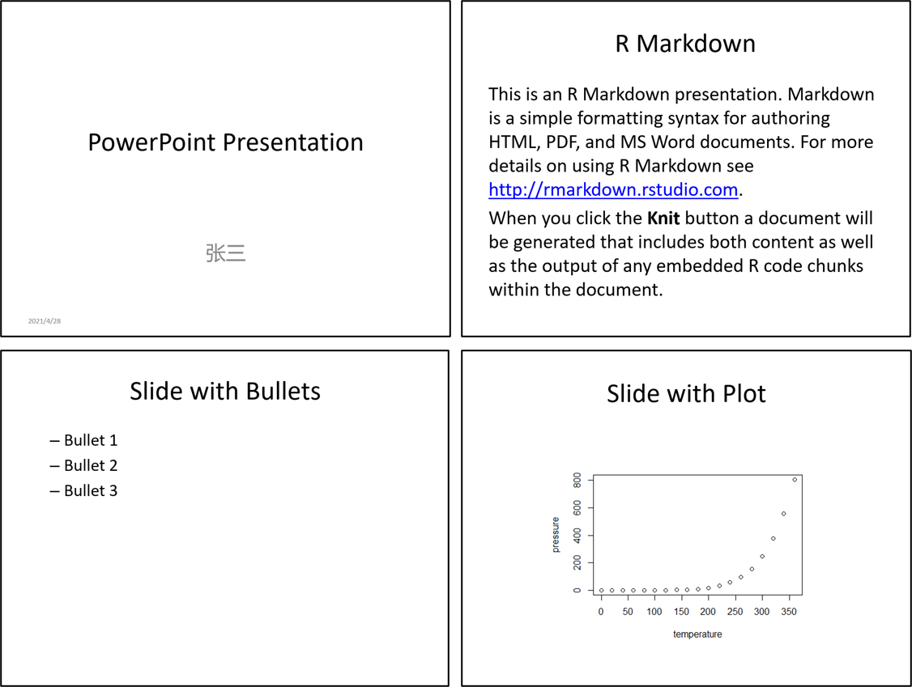
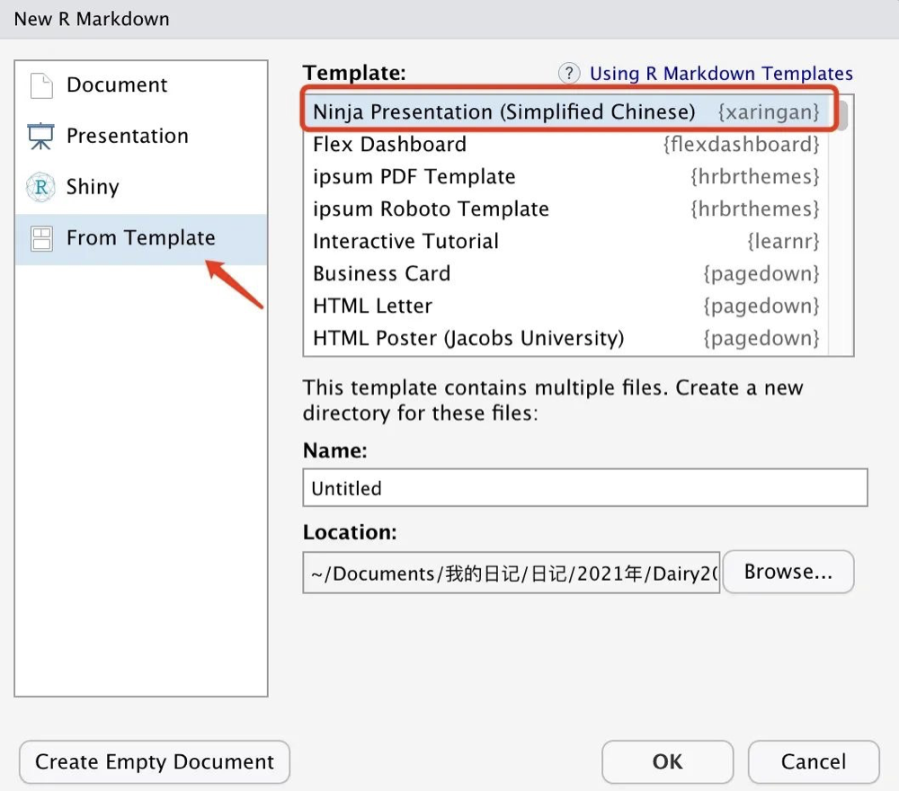
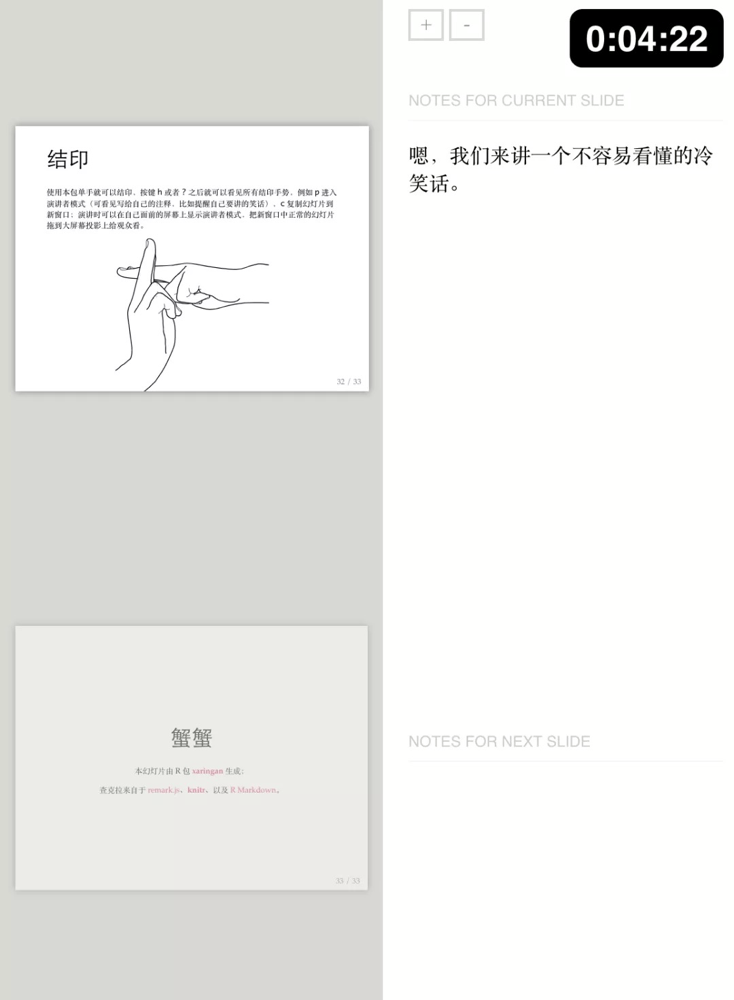
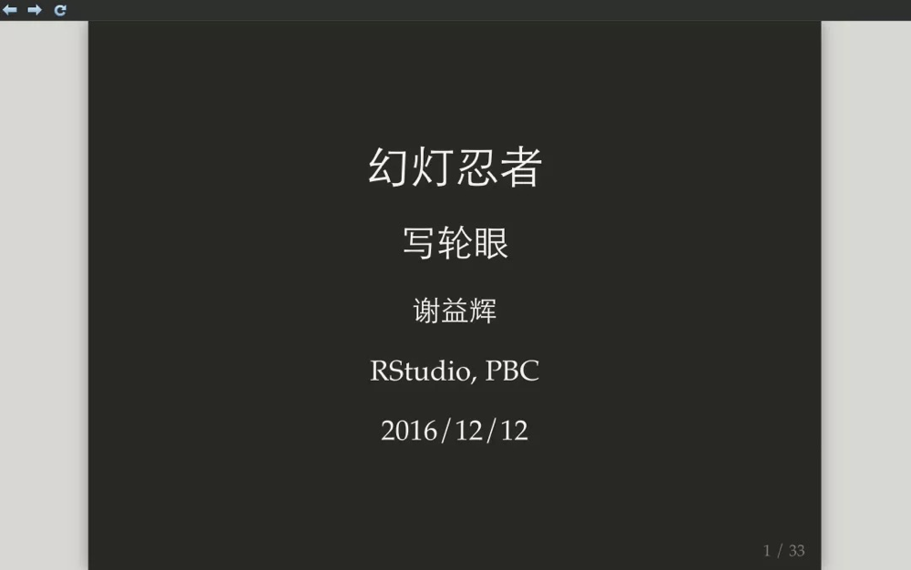
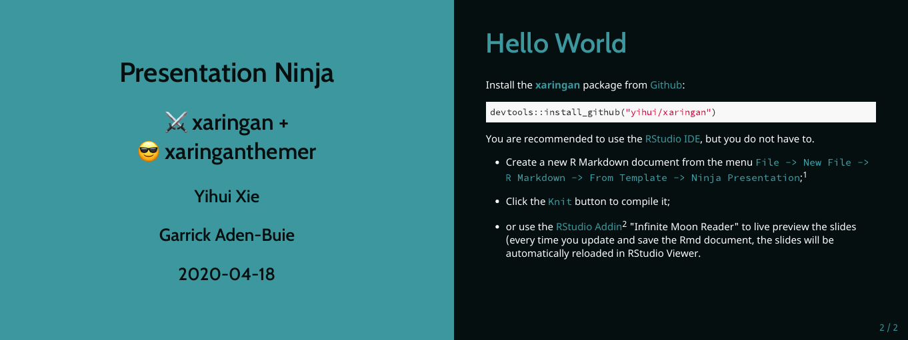
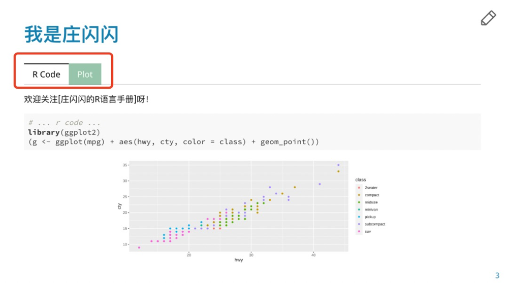

# (PART) 基于R Markdown的应用 {.unnumbered}

```{r echo = FALSE}
source("utils.R")
```

# 使用 R Markdown 创建常用文档 {#rmarkdown-document}

Markdown 在发明之初的主要目的就是简化 HTML 内容的书写方式。例如要表示一个无序列表中的项，用 HTML 来写是 `<ul><li>text</li></ul>`，而用 Markdown 来写则只需要 `- text`；又如要表示一段引用文字，用 HTML 来写是 `<blockquote>text</blockquote>`，用 Markdown 来写则只需要 `> text`。

Pandoc 大大扩展了 Markdown 的语法。更重要的是，Pandoc 使得将 Markdown 文档转换为多种输出格式成为可能。尽管这些文档大体可以按照背后的实现方式，分为 HTML、PDF 和 Microsoft Office 等 3 大类型，但是根据应用场景的差异，会有多种多样的具体样式。

鉴于每种样式通常会通过不同的 R Markdown 扩展软件包来实现，所以其设置和使用方面会有自身的特点。因此，在接下来的一部分内容中将依次介绍常用文档格式的使用方法。而本章则主要介绍将 R Markdown 源文件输出为各种常用文档格式的功能。

简单说来，要论从 R Markdown 到各种文档之间总共分几步？答案是 2 步。

1. R Markdown --> Markdown，由 **knitr** [@R-knitr] 完成；
2. Markdown  --> 不同格式文档，由 Pandoc 完成。

## HTML 文档 {#rmarkdown-html}

HTML 即超文本标记语言（Hyper Text Markup Language），该技术是互联网最重要的基础设施之一，是网上精彩纷呈内容的主要依托。HTML 文档不仅能够展示文字、图片、表格、公式等常规页面元素，而且还可以呈现音乐、视频、交互动画等丰富多样的多媒体内容。而同样的任务则是其它常见的文档格式如 PDF、Microsoft Word 等所不能完成的。因为 Markdown 技术在设计之初的输出格式就是 HTML，所以 HTML 文档不仅仅是最常用 R Markdown 输出格式，同时也拥有最丰富的功能，因此是在学习 R Markdown 技术的过程中首先需要了解这一部分内容。

严格意义上说，采用 R Markdown 和 HTML 技术呈现的网站、幻灯片等也都属于 HTML 格式的文档，不过这些形式的内容通常包含了多个 `.html` 格式的文件，而这里介绍如何通过 R Markdown 源文件生成一份**独立**的 `.html` 格式的文件。

前面提过，R Markdown 生成 HTML 文档的过程有一个中间步骤，就是 Markdown + HTML 模板。HTML 模板包括预定义的文档结构、 CSS 样式表和 JavaScript 动态网页功能等，所以最终渲染得到的 HTML 文档的一些功能可能依赖于特定 HTML 模板才能实现。对于一般用户而言，不了解这方面的知识并不影响正常使用 R Markdown 创建 HTML 文档。但是如果用户对此有所了解，那将有利于了解 HTML 文档的实现途径。

默认情况下，R Markdown 的 HTML 文档使用 `rmarkdown::html_document` 模板。除此之外， **rmarkdown** 之外的其它软件包也提供了各种不同类型的 HTML 模板文件（如 `bookdown::html_document2`，`pagedown::html_paged` 等）。因此，在这一部分将首先从 R Markdown 到 `html_document` 文档开始。

要创建一个 `html_document`，只需要在 R Markdown 的开头加入 YAML 格式的元数据。

``` {.yaml}
---
title: "文档标题"
author: "作者"
date: "创建时间"
output: html_document
---
```

在元数据中，还可以加入各种各样设置，从而改变文档的格式。例如下面的设置将为文档添加一个自动目录。

``` {.yaml}
---
title: "文档标题"
author: "作者"
date: "创建时间"
output: 
  html_document:
  toc: true
---
```

### 目录和标题 {#html-title}

R Markdown 文件中使用的目录都是自动目录，是根据文档的层次结构（一级标题、二级标题等）自动生成的。这一部分介绍如何在 HTML 文档中设置自动目录。

#### 显示目录 {#html-toc}

在开头的元数据中，使用 `toc: true` 可以打开文档的目录。目录会从 HTML 的标题自动生成，目录的层级由 `toc_depth` 的值确定（默认为 3）。例如：

``` {.yaml}
---
title: "标题"
output:
  html_document:
    toc: true
    toc_depth: 2
---
```

在上面的例子中，目录中将包含 HTML 文档中的一级标题和二级标题。

#### 悬停目录 {#html-toc-float}

当把 `toc_float` 设为 `true` 的时候，目录会在侧边栏悬停。这样就可以随时借助目录在一篇比较长的文档中跳转了。

``` {.yaml}
---
title: "标题"
output:
  html_document:
    toc: true
    toc_float: true
---
```

通过改变 `toc_float` 的选项，可以控制侧边栏的折叠和动画。其中：

-   `collapsed` （默认为 `true`）控制文档第一次打开时目录是否被折叠。如果为 `true` 则只显示高级别的标题（二级标题及以上元素）；
-   `smooth_scroll` （默认为 `true`）控制页面滚动时，标题是否会随之变化。

``` {.yaml}
---
title: "标题"
output:
  html_document:
    toc: true
    toc_float:
      collapsed: false
      smooth_scroll: false
---
```

#### 显示标题编号 {#html-number-sections}

使用 `number_sections` 可以在标题开头加上编号。一级标题编号为 "1 一级标题"，二级标题为"1.1 二级标题"。

``` {.yaml}
---
title: "标题"
output:
  html_document:
    toc: true
    number_sections: true
---
```

#### 使用标签页展示小标题的内容 {#html-tabset}

在 HTML 文档中使用标签页非常简单，只需要在标题后附加 `{.tabset}` 标签即可。

``` {.markdown}
## 季度报表（应用 `.tabset` 标签） {.tabset}

### 按产品汇总

（具体的报表内容）

### 按区域汇总

（具体的报表内容）
```

在此基础上，添加相关的额外标签还可以控制标签的样式和行为。其中：

-   `.tabset-fade` 将为标签切换过程加入淡入淡出的动画效果；
-   `.tabset-pills` 将为标签文字加上预设的 `.tabset-pills` 样式（图 \@ref(fig:html-tabset)）。

```{r html-tabset, fig.cap="标签的默认样式及 `.tabset-pills` 样式", echo = FALSE, out.width="70%", fig.align="center"}
import_example_result(xfun::magic_path("tabset-example.Rmd"))
```


### 主题和样式 {#html-theme}

#### 可选的文档主题样式 {#html-theme-list}

```{r echo=FALSE}
theme_link <- function(name = "", base_url = "https://bootswatch.com/3/"){
  glue::glue('[{name}]({base_url}{name})', 
  name = name, 
  base_url = base_url)
}
```

为了满足颜值党的差异化需求，`html_document` 自带了多个不同的主题。这些主题来自于 [Bootswatch](https://bootswatch.com/3/)\index{Bootswatch}。可用的主题名称包括 `r theme_link("default")`，`r theme_link("cerulean")`，`r theme_link("journal")`，`r theme_link("flatly")`，`r theme_link("darkly")`，`r theme_link("readable")`，`r theme_link("spacelab")`，`r theme_link("united")`，`r theme_link("cosmo")`，`r theme_link("lumen")`，`r theme_link("paper")`，`r theme_link("sandstone")`，`r theme_link("simplex")` 和 `r theme_link("yeti")` 等等。

主题使用 `theme` 参数来指定，这里以 `darkly` 作为一个例子，感兴趣的读者可以自行尝试其它样式（图 \@ref(fig:first-rmd-theme-darkly）：

``` {.yaml}
---
title: "标题"
output:
  html_document:
    theme: darkly
---
```

(ref:figcap-first-rmd-theme-darkly) 应用 `r theme_link("darkly")` 主题后的文档样式

```{r first-rmd-theme-darkly, fig.cap="(ref:figcap-first-rmd-theme-darkly)", echo = FALSE}
import_example_result(xfun::magic_path("first-rmd-theme-darkly.Rmd"))
```


如果设置为 `theme: null`，那么将不会应用任何主题，此时可以通过指定自定义的 CSS 样式表来进行格式化。

``` {.yaml}
---
title: "标题"
output:
  html_document:
    theme: null
    css: style.css
---
```

#### 可选的代码高亮样式 {#html-code-highlight}

代码高亮也有可选的多种样式，包括 `default`，`tango`，`pygments`，`kate`，`monchrome`，`espresso`，`zenburn`，`haddock`，`breezedark` 和 `textmate` 等。

在元数据中，使用 `highlight` 参数指定代码高亮样式。下面的示例中将代码高亮设为 `tango`，更多的代码高亮样式见图 \@ref(fig:html-code-highlight-example)。

``` {.yaml}
---
title: "标题"
output:
  html_document:
    highlight: tango
---
```

(ref:figcap-html-code-highlight-example) 可选的代码高亮样式

```{r html-code-highlight-example, fig.cap="(ref:figcap-html-code-highlight-example)", fig.show="hold", out.width="70%"}
code_highlight_examples = list.files("examples/", "code-highlight-example.*\\.Rmd", full.names = TRUE)
success = lapply(code_highlight_examples, import_example_result)
```


跟上面的 `theme` 属性一样，`highlight` 也可以设为 `null`，这样的话代码将不显示高亮。

#### 自定义样式表 {#html-style-css}

不论有没有应用主题和代码高亮，用户都可以使用 `css` 参数指定附加样式表。附加样式表中的定义优先级更高，当被应用到特定元素上去之后，可以改变元素的外观。

``` {.yaml}
---
title: "标题"
output:
  html_document:
    theme: null
    highlight: null
    css: styles.css
---
```

如果在 `styley.css` 中定义了两个名为 `#nextsteps` 和 `.emphasized` 的新样式，分别用于指定 HTML 文档中 `id = "nextsteps"` 和 `class = "emphasized"` 这两种元素的外观。

``` {.css}
#nextsteps {
   color: blue;
}

.emphasized {
   font-size: 1.2em;
}
```

那么，就可以通过在行尾大括号中添加元素 id 和 CSS 类的方法，对某个二级标题（此处为“这里强调一下下一步”）应用这个样式：

``` {.markdown}
## 这里强调一下下一步 {#nextsteps .emphasized}
```


如果要应用多个 CSS 配置文件，可以这样写：

```yaml
output:
  html_document:
    css: ["style-1.css", "style-2.css"]
```

#### 通过 CSS 代码块定义样式 {#html-css-source}

除了像上面那样导入一个预定义的样式表，还可以直接在 R Markdown 中添加新的 CSS 定义。不过这种方法只适合针对个别元素进行个性化设置，如果 CSS 代码有很多行，或者想要在其它 R Markdown 文件中中交叉使用同样的定义，那么将其放在自定义样式表文件中会更加合适（参见 \@ref(html-style-css)）。

`r import_example("chunk-custom.Rmd")`

```{r chunk-border, echo = FALSE, out.width="70%", fig.align="center",  fig.cap = "一个具有浅红色背景和深红色边框的代码块"}
import_example_result("chunk-custom.Rmd", vheight = 300)
```

#### 使用丰富多样的内置 CSS 样式 {#html-css-list}

大多数时候，用户并不需要自己定义 CSS 样式，因为 HTML 内置的主题中已经包含了丰富且高级的内置样式。

默认情况下，R Markdown 输出的 HTML 文档中，已经内嵌了 Bootstrap 框架\index{Bootstrap}[^about-bootstrap]，因此可以使用一系列预定义的 CSS 样式。其中，可用的背景样式就包括 `"bg-primary"`，`"bg-success"`，`"bg-info"`，`"bg-warning"` 和 `"bg-danger"` 等。 

[^about-bootstrap]: Bootstrap是一组用于网站和网络应用程序开发的开源前端框架，包括 HTML、CSS 及 JavaScript 的框架，提供字体排印、窗体、按钮、导航及其他各种组件及 Javascript 扩展，旨在使动态网页和 Web 应用的开发更加容易。

只需要在代码块属性中使用 `class.source` 标签，就可以应用这些预定义的 CSS 样式。

`r import_example("chunk-style.Rmd")`

以上内容生成 HTML 文档后的样子如图 \@ref(fig:chunk-style-example) 所示：

```{r chunk-style-example, echo = FALSE, fig.cap="在代码块上应用内置 CSS 样式", out.width="70%", fig.align="center"}
import_example_result("chunk-style.Rmd", vheight = 400, vwidth = 600)
```

#### 代码折叠 {#html-code-folding}

当 **Knitr** 的代码块参数 `echo = TRUE` 时，R 代码将会输出到最终生成的文档中。
如果不需要显示源代码，可以直接设为 `echo = FALSE`。
如果既想要保留代码但又让其默认不显示，
则可以通过 `code_folding: hide` 参数来实现。 

````markdown
---
title: "代码折叠"
output:
  html_document:
    code_folding: hide
---
````

`code_folding: hide` 将折叠所有的代码块，用户可以通过点击来查看折叠的代码。如果想让部分代码块在一开始就显示，则可以在代码块选项中使用 `class.source = 'fold-show'`（图 \@ref(fig:fold-show)）。

`r import_example("fold-show.Rmd")`

(ref:figcap-fold-show) 代码块的折叠和显示。图中每个代码区块旁边都有一个按钮，可以控制相应代码区块的显示方式；文档的右上角也有一个按钮，可以控制文档中全部代码区块的显示方式。

```{r fold-show, fig.cap="(ref:figcap-fold-show)",out.width="70%",fig.align="center", echo=FALSE}
import_example_result("fold-show.Rmd", vwidth = 800)
```


这种操作也可以反向进行，即默认显示全部的代码区块，然后再将部分代码区块设为折叠。如下配置即可：

````md
---
output:
  html_document:
    code_folding: show
---

```{r}`r ''`
1  # 代码默认是显示的
```

```{r class.source = 'fold-hide'}`r ''`
2  # 这一块代码将被折叠
```
````

如图 \@ref(fig:fold-show) 所示，在页面和每一个代码块的右上方有一个按钮。页面右上方的按钮可以控制全部代码块的显示和隐藏，代码块右上方的按钮则可以控制对应代码块的显示和隐藏。

#### 设置代码块内容可滚动 {#html-code-scroll}

如果想限制代码块的高度，特别是代码执行过程中输出内容的高度，还可以从相应内容的 CSS 样式上着手，即通过 `class-output` 和 `class-source` 来定义内容的高度。

下面是一个限制设定代码区块高度后，再通过滚动查看完整内容的例子：

`r import_example("html-scroll.Rmd")`


因为代码块是位于 `<pre class="sourcecode">` 标签内的，所以 `pre[class]` 操作符将限制代码块的高度为不超过 100 像素。 而将 `class.output ` 设为 `scroll-100` 则限制输出部分的高度为不超过 100 像素。最终效果如图 \@ref(fig:html-scroll-example) 所示。

```{r html-scroll-example, out.width="70%", fig.align="center", fig.cap="可以滚动的代码块",echo=FALSE}
import_example_result('html-scroll.Rmd', vheight = 600, vwidth = 800)
```

### 图片和数据框 {#html-pic}

#### 设置图片的属性 {#html-pic-setting}

下列参数可以调整生成的 HTML 文档中图片的属性：

-   `fig_width`，`fig_height` 指定图片显示时的宽和高（默认为 7 × 5，单位英寸）；
-   `fig_retina` 开启视网膜屏幕优化（默认为 2，设为 `null` 时关闭优化）；
-   `fig_caption` 控制是否渲染图注；
-   `dev` 设置图片输出设备，默认为 `png`。可以设置多个图片输出设备。

``` {.yaml}
---
title: "标题"
output:
  html_document:
    fig_width: 7
    fig_height: 6
    fig_caption: true
    dev: c("png","pdf")
---
```

在代码框属性中，仍然可以通过 `fig.height`，`fig.width`，`fig.asp` 等参数来指定生成图片的高度、宽度和宽高比。

#### 插入外源图片 {#html-include-graphics}

虽然在 R Markdown 中可以使用 Markdown 语法和 HTML 语法插入图片，但是推荐使用 `knitr::include_graphics()` 的方式来完成这一操作。例如：

```` {.md}
```{r}`r ''`
knitr::include_graphics("https://r-project.org/Rlogo.png")
```
````

使用这种方法插入外源图片，可以方便地添加图注（使用 `fig.cap` 参数），以及设置图片的宽高等属性（图 \@ref(fig:include-graphics-example)）。

```{r include-graphics-example, echo = FALSE, fig.cap="插入外源图片的推荐方式"}
knitr::include_graphics("images/Rlogo.png")
```


#### 输出数据框 {#html-df-print}

数据框是常见的数据结构，通过设置 `df_print` 参数，可以调整数据框的输出格式。可用的参数如表 \@ref(tab:df-print) 所示。

表： (\#tab:df-print) `html_document` 可以被设置的 `df_print` 参数及其对应的含义。

| 取值 | 说明         |
|-------|--------------|
|default|调用 `print.data.frame` 的通用方法|
|kable  |使用 `knitr::kable` 函数          |
| tibble| 使用 `tibble::print.tbl_df` 函数 |
| paged | 使用 `rmarkdown::paged_table` 来创建一个分页的表格|

```{r echo=FALSE}
# @TODO: 截图修改完善
template = xfun::magic_path("df-print-example.Rmd")
outfile = xfun::with_ext(template, ".html")
snapshots = lapply(c("default","kable","tibble","paged"), function(x){
  rmarkdown::render(template, 
                    rmarkdown::html_document(df_print = x),
                    params = list(subtitle = x),
                    envir = new.env(),
                    quiet = TRUE)
  html_screenshot(outfile, outfile = xfun::with_ext(template,paste0(x,".png")))
})
unlink(outfile)
knitr::include_graphics(unlist(snapshots))
```


#### 分页打印数据框时的附加参数 {html-df-print-paged}

若把 `df_print` 参数设为 `paged`，数据框将支持行列的分页，效果如图 \@ref(fig:paged) 所示。

````markdown
---
title: "发动机测试和汽车道路测试"
output:
  html_document:
    df_print: paged
---

`r ''````{r}
mtcars
```
````

```{r paged, echo=FALSE, fig.cap='HTML文档中分页显示的数据框', out.width='100%'}
knitr::include_graphics('images/paged.png', dpi = NA)
```

表 \@ref(#tab:paged) 列出了这种情况下可以使用的附加参数。

Table: (\#tab:paged) 分页 HTML 表格的附加可用参数。

| 参数名          | 说明                                           |
|-----------------|-------------------------------------------------------|
| max.print       | 显示的总行数                          |
| rows.print      | 一页显示的行数                        |
| cols.print      | 一页显示的列数                     |
| cols.min.print  | 最少显示几列             |
| pages.print     | 下方显示页面导航链接的数目 |
| paged.print     | 设为 `FALSE` 则不输出分页的表格          |
| rownames.print  | 设为 `FALSE` 时不显示行的名称              |

这些参数可以在代码块中使用。

````markdown
`r ''````{r cols.print=3, rows.print=3}
mtcars
```
````


### 组件和内容 {#html-module}

#### 理解 HTML 文档的依赖关系 {#html-dependency}

R Markdown 输出 HTML 文档时依赖于软件包提供的 HTML 模板。
实际上，HTML 文档的样式和功能很大程度上依赖于一些 CSS 样式和 JavaScript 库的支持。
这里面包括 [Bootstrap](https://getbootstrap.com/)[^about-bootstrap]，[JQuery](https://jquery.com/) 等优秀的开源项目。前者是一个通用的网站开发框架，后者是一个通用的 JavaScript 库。

默认情况下，R Markdown 输出的 HTML 文档是一个单一的 `.html` 文件。这是由 `self_contained: true` 控制的。`.html` 文件中，会使用 `data:` 存储包括 JavaScript、CSS、图片和视频在内的全部资料。这样的一个封装，使得用户可以像分享 PDF 或 Word 文档那样分享文件，同时享受超链接、动态效果等一系列 HTML 特性。

如果指定 `self_contained: false`，那么 HTML 文档将会将自身的依赖文件单独存放。


```yaml
---
title: "标题"
output:
  html_document:
    self_contained: false
---
```

默认情况下，在 `.html` 文件同一目录会生成同名的 `_files` 文件夹，存放相应的依赖文件。下面是默认情况下一份 HTML 文档所包含的依赖文件。

```
+---anchor-sections-1.0
+---bootstrap-3.3.5
|   +---css
|   |   \---fonts
|   +---fonts
|   +---js
|   \---shim
+---header-attrs-2.5
+---highlightjs-9.12.0
+---jquery-1.11.3
\---navigation-1.1
```

存放这些依赖文件的文件夹位置可以由 `lib_dir: xxx` 指定，例如：

```yaml
---
title: "标题"
output:
  html_document:
    self_contained: false
    lib_dir: libs
---
```

依赖文件的内容会随配置变化，例如当在 YAML 配置中加入 `df_print: paged` 之后，依赖文件中会多一个 `pagedtable-1.1` 的子文件夹出来。

显然，存放依赖的子文件夹依据 **库名** + **版本号** 的规则命名。要弄清楚库文件的全部特性，可能要对库本身有相当的理解才行。而 R Markdown 则是把最常用的功能整合提供给了用户。

当文档的内容比较少，同时又有多个类似的文档的时候，库文件所占的存储空间可能比自己编写的内容还要大得多。这种情况下，将库文件统一存储在指定的 `libs` 文件夹，可以实现库文件公用。

另外，有些库文件不常用，或者文件太大，还可以通过库文件的服务器调用。例如下面一节要讲的 MathJax 库。

#### MathJax 库的配置 {#html-mathjax}

HTML 文档需要 [MathJax](https://www.mathjax.org)\index{MathJax} 脚本来渲染 Latex 和 MathML 公式[^about-mathml]，调用 [MathJax](https://www.mathjax.org) 的方式则可以通过 `mathjax` 参数来调整。

[^about-mathml]: MathML，中文翻译为“数学标记语言”，是一种基于 XML 的标准，用来描述数学符号和公式。它的目标是把数学公式集成到互联网和其他文档中。从 2015 年开始，MathML 成为了 HTML5 的一部分和 ISO 标准。 

- `"default"`：默认配置，会通过 HTTPS 链接从 RStudio 的 CDN 网络服务器上调用；

- `"local"`：与 `self_contained: false` 联合使用时，会将 MathJax 库文件保存在本地目录中；

- 还可以将 `mathjax` 的值设置成一个 URL 链接，指向可用的 MathJax 库文件地址；

- `null`：完全不使用 MathJax。

例如，使用 MathJax 的本地拷贝可以如下配置：


```yaml
---
title: "标题"
output:
  html_document:
    mathjax: local
    self_contained: false
---
```

为 MathJax 配置一个新的可用来源。


```yaml
---
title: "标题"
output:
  html_document:
    mathjax: "http://example.com/MathJax.js"
---
```

不使用 MathJax。

```yaml
---
title: "Habits"
output:
  html_document:
    mathjax: null
---
```

#### 是否保留 Markdown {#html-keep-md}

**knitr** 处理 R Markdown 文件时，会先生成一个 Markdown 文件（`*.md`），随后再由 Pandoc 转换成 HTML 文档。如果需要保留这个 Markdown 文件，可以使用 `keep_md` 选项。

```yaml
---
title: "标题"
output:
  html_document:
    keep_md: true
---
```


#### 使用自定义的 HTML 模板 {#html-template}

使用 `template` 选项，可以配置 Pandoc 转换时使用的模板。

```yaml
---
title: "Habits"
output:
  html_document:
    template: another_template.html
---
```

Pandoc 模板遵循特定的格式，有关的进一步信息可以在 [Pandoc 模板](http://pandoc.org/MANUAL.html#templates) 页面获得。

下面是一个 HTML 模板的示例：

```html
<html>
  <head>
    <title>$title$</title>
    $for(css)$
    <link rel="stylesheet" href="$css$" type="text/css" />
    $endfor$
  </head>
  <body>
  $body$
  </body>
</html>
```

这其中包括一些变量，如 `$title$`，`$body$` 等。这些变量由 Pandoc 定义，完整的变量列表可以 [参见 Pandoc 的官方文档](https://pandoc.org/MANUAL.html#templates)\index{Pandoc template}。

这样的 HTML 模板使得高度定制化的输出成为可能。例如，可以在 `<head>` 区域加入任意的 CSS 样式， JavaScript 代码，以及其它的开源库。 另外，还可以定义一些新变量来控制文档的格式化。例如，定义一个布尔值 `draft` 来确定文档是一个草稿还是最终版本。


```html
<head>
<style type="text/css">
.logo {
  float: right;
}
</style>
</head>

<body>
<div class="logo">
$if(draft)$
<!-- use draft.png to show that this is a draft -->

$else$
<!-- insert the formal logo if this is final -->

$endif$
</div>

$body$
</body>
```

`draft` 变量可以通过 YAML 元数据来赋值。这样根据 `draft` 设定的不同值，R Markdown 可以编译出具有不同 LOGO 图像的 HTML 文档，从而可以直观的显示读者目前看到的这份文档是一个草案还是最终版本。

```yaml
---
title: "An Important Report"
draft: true
output: 
  html_document:
    template: my-template.html
---
```

*说明*：**rmarkdown** 软件包默认使用自带的 HTML 模板，一些方面与 Pandoc 默认的模板存在差异。如果有 `template: null` 的话，则 Pandoc 的模板会被使用。 


#### 包含其它文件 {#html-includes}

使用 `includes` 选项，可以在 HTML 文档的不同位置嵌入其它的 HTML 格式内容。可选的位置包括在 HTML 文档的 `header`、`body` 前/后等[^html-includes]。

[^html-includes]: 这样的用法在配置 **bookdown** 创作的图书时非常常见（参见 \@ref(rmarkdown-bookdown)）。

```yaml
---
title: "Habits"
output:
  html_document:
    includes:
      in_header: header.html
      before_body: doc_prefix.html
      after_body: doc_suffix.html
---
```

这种方式可以很方便的为文档加入一些第三方功能和公用的元件。例如在 `in_header` 中导入预定义的 CSS 样式表和 Javascript 脚本，在 `before_body` 中加入导航栏，在 `after_body` 中加入一个底栏等。

下面的例子中，即添加了一个简单的底栏。将其中内容保存到一个 HTML 文件中，放在 `after_body` 后面即可。


```html
<div class="footer">Copyright &copy; R Markdown 指南 2021</div>
```

除了以上几种常用的位置，还可以在任意地方插入 HTML 内容。实现这一功能的途径至少有两种。

一是使用 `htmltools::includeHTML()` 方法：

````md
```{r, echo=FALSE, results='asis'}`r ''`
htmltools::includeHTML('file.html')
```
````

二是使用 `xfun::file_string()` 方法：

````md
```{r, echo=FALSE, results='asis'}`r ''`
xfun::file_string('file.html')
```
````


需要注意的是，导入的 HTML 文件必须是 HTML 片段，而不能是一个完整的 HTML 文档。完整的 HTML 文件中有 `<html>` 标签，解析时会造成错误。比如下面就是一个无效的例子：


```html
<html>
  <head>  </head>

  <body>
  Parent HTML file.
  
  <!-- htmltools::includeHTML() below -->
    <html>
      <head>  </head>
      <body>
      Child HTML file.
      </body>
    </html>
  <!-- included above -->

  </body>
</html>
```

#### 生成 HTML 片段 {#html-fragments}

HTML 片段是一个不完整的 HTML 文件，这种片段适合用于嵌入其它的网页或者内容管理系统（如博客）中。HTML 片段也不自带主题和代码高亮，而通过继承的方式使用其嵌入文件或系统的设置。这样的 HTML 片段，也非常适合用于包含在其它文件中（参见 \@ref(include-html)）。

```yaml
---
output: html_fragment
---
```

下面是一个 HTML 片段的例子：

`r import_example("html-fragment.html")`

将这些内容保存为一个 HTML 文件，导入此处，则效果如下所示：

```{r echo=FALSE, results="asis"}
htmltools::includeHTML("examples/html-fragment.html")
```

*HTML 片段的内容到此结束。*

#### 使用自定义的浏览器图标 {#html-favicon}

通过在 `in_header` 部位导入 HTML 内容，可以为 HTML 文档设定一个自定义的浏览器图标。

将下面的内容保存到一个名为 `header.html` 的文档中。

```html
<link rel="shortcut icon" href="{path to favicon file}" />
```

然后通过 `includes` 导入文件的内容，则可以改变浏览当前文档时的浏览器图标。

```yaml
output:
  html_document:
    includes:
      in_header: header.html
```

#### 共用 YAML 配置文件 {#html-shared-yaml}

当前目录中的 `_output.yml` 文件是一个配置文件，其中的设置可以被目录下所有的 R Markdown 文档公用。需要注意的是，该文件中的内容不需要使用`---` 和 `output` 标签。

如下所示：

```yaml
html_document:
  self_contained: false
  theme: united
  highlight: textmate
```

而不应该写成下面这种样子：

```yaml
---
output:
  html_document:
    self_contained: false
    theme: united
    highlight: textmate
---
```


#### 允许下载源文件 {#html-code-download}


当分享一个 R Markdown 生成的 HTML 文档给他人的时候，对方可能还需要提供 `.Rmd` 源文件。在头文件中配置 `code_download` 参数可以在 HTML 文档中嵌入源文件。

```yaml
output:
  html_document:
    code_download: true
```

打开 `code_download` 选项后，页面中会出现一个下载按钮，点击下载按钮即可获得源文件。

#### 嵌入数据或其它文件 {#html-embed}

嵌入 `.Rmd` 源文件可能还不足以重现 R Markdown 中结果，通常还会需要原始数据等其它内容。要将这些内容嵌入 HTML 文档中，也是很容易实现的。

这一功能通过 **xfun** 软件包[@R-xfun] 实现，依赖于 `htmltools` 和 `mime` 软件包。要使用这一功能，首先确保这两个软件包可用。

```{r, eval=FALSE}
xfun::pkg_load2(c('htmltools', 'mime'))
```

现在，就可以随意嵌入各种文件了。

`r import_example("embed-file.Rmd")`

不仅如此，还可以编程技巧嵌入所需的文件。

```{r eval=FALSE}
# 嵌入当前目录下所有的 Rmd 和 csv 文件
xfun::embed_files(list.files('.', '[.](Rmd|csv)$'))
```

*说明*：当嵌入多个文件时，其工作原理是：首先将这些文件压缩成 Zip 格式，然后将 Zip 文件嵌入到 HTML 文档中。 


## PDF 文档 {#rmarkdown-pdf}


```{r include=FALSE}
# 考虑到中国受众的特点，本章尽可能回避了 LaTeX 代码的出现。
```


这一部分讲述将 R Markdown 输出为 PDF 的功能。PDF 是便携式文档格式（**P**ortable **D**ocument **F**ormat）的缩写，这是一种常见的文档格式，
特别是在文件、学术论文中广泛使用。它具有文件体积小、保真度高和安全的特点。

R Markdown 并不能直接输出 PDF 文档，而是会输出 LaTeX 文件，LaTeX 文件经过处理后生成 PDF。因此，使用 R Markdown 输出 PDF 文件时，可以充分发挥 LaTeX 的优势。在需要的时候，可以直接使用 LaTeX 代码编写内容，应用 LaTeX 的包和模板，添加标题、脚注、子图等。

不过，LaTeX 技术对于大多数人可能都还比较陌生，而在生成 PDF 文档的过程中，很多问题都跟 LaTeX 的配置有关。这几乎是不可避免的，因此在开始正式的内容前，需要确保已经安装了 **TinyTex** 以及一些依赖的 LaTeX 组件。具体的安装步骤和疑难解答请参见前文（\@ref(install-tinytex)），此处不再赘述。


### 从 R Markdown 到 PDF 文档 {#pdf-rmd}

要输出 PDF 文档，只需要在 R Markdown 开头的 YAML 配置中指定
`pdf_document` 即可。

``` yaml
---
output: pdf_document
---
```

只需要这样一个改动，就可以得到一份 PDF 文档。

### 在 PDF 文档中使用中文的注意事项 {#pdf-chinese}

如果这份 PDF 中仅含有英文，那么不需要做额外的设置。
但是对于中文用户而言，可能会出现错误。这是因为，PDF 所依赖的 LaTeX 系统对中文的支持与 HTML 不同，需要做一些合适的设置。包括导入中文语言支持的 LaTeX 模块 **ctex**，以及使用一个对 Unicode 支持更好的 **xelatex** 引擎。

下面就是一份中文 PDF 文档的示例。

```{r}
import_example("examples/PDF-document-in-chinese.Rmd")
```

将这份 R Markdown 编译后，将会生成一份 PDF 文档。

```{r}
import_example_result("examples/PDF-document-in-chinese.Rmd")
```

### 与 HTML 文档中相通的一些设置 {#pdf-general-setting}

下面的这些设置与前文介绍的 HTML 文档中相应配置的用法基本相同（参见 \@ref(rmarkdown-html)）。

#### 显示目录 {#pdf-toc}

使用 `toc` 在 PDF 文档中加入目录，`toc_depth` 控制目录的深度。这点与 HTML 文档的用法一致[^PDF-vs-HTML]。

[^PDF-vs-HTML]: 实际上很多配置的名称都保持一致，但是也有不少会跟文档格式有关。如果发现改变了某个配置却没有效果，可能会跟配置的适用范围有关。

``` yaml
---
title: "五一劳动节加班三倍工资"
author: "张三"
date: "2021年5月1日"
output: 
  pdf_document：
    toc: true
    toc_depth: 2
---
```

如果 `toc_depth` 没有指定，则默认索引到二级标题（在 HTML 文档中默认索引到三级标题）。

使用 `number_sections` 可以在标题前面加入编号。

``` yaml
---
title: "五一劳动节加班三倍工资"
author: "张三"
date: "2021年5月1日"
output: 
  pdf_document：
    toc: true
    toc_depth: 2
    number_sections: true
---
```

#### 图片相关的配置 {#pdf-figure}

- `fig_width` 和 `fig_height` 用于控制图片默认的宽和高（默认为 6.5 x 4.5 英寸）。

- `fig_crop` 控制 `pdfcrop` 的效果，功能是去掉图片边缘的空白（默认为 `true`）。

  `pdfcrop` 是一个 LaTeX 组件，默认并没有被 `tinytex` 安装。推荐用户运行 `tinytex::tlmgr_install("pdfcrop")` 来安装它。同时，`pdfcrop` 依赖于系统中的存在的 `ghostscript`，因此还需要安装 [`ghostscript`](https://www.ghostscript.com/) \index{GhostScript}才能正常使用 `pdfcrop`。
  
- `fig_caption` 控制是否为图片添加图注（默认为 `true`）。

- `dev` 控制用于渲染图片的图像设备（默认为 `pdf`）。


``` yaml
---
title: "五一劳动节加班三倍工资"
author: "张三"
date: "2021年5月1日"
output: 
  pdf_document：
    fig_width: 7
    fig_height: 6
    fig_caption: true
---
```

#### 打印数据框 {#pdf-df-print}

通过配置 `df_print`，可以调整打印数据框的格式（表 \@ref(tab:df-print-pdf)）。

Table: (\#tab:df-print-pdf) 输出 PDF 时 `df_print` 可选的值。


| 配置       | 说明                                      |
|------------|-------------------------------------------|
| default    | 调用 `print.data.frame` 泛型函数 |
| kable      | 使用 `knitr::kable()` 函数 |
| tibble     | 使用 `tibble::print.tbl_df()` 函数 |
| 一个自定义函数 | 使用自定义函数创建一个表格。参见 \@ref(custom-fun-dfprint) |


``` yaml
---
title: "五一劳动节加班三倍工资"
author: "张三"
date: "2021年5月1日"
output: 
  pdf_document：
    df_print: kable
---
```

#### 代码高亮 {#pdf-code-highlight}

与 HTML 文档相同，这里可用 `highlight` 参数配置代码高亮的样式（参见 \@ref(appearance-and-style) 部分内容）。例如：

``` yaml
---
title: "五一劳动节加班三倍工资"
author: "张三"
date: "2021年5月1日"
output: 
  pdf_document：
    highlight: tango
---
```


### LaTeX 选项 {#pdf-latex}

很多 LaTeX 的配置，可以通过头部 YAML 的设定传递给 PDF 文档。

#### 通用文档部件 {#pdf-includes}

一个 LaTeX 文档的结构大概是这样子：


```tex
\documentclass{article}
% preamble
\begin{document}
% body
\end{document}
```

在这个文档中，首先通过 `\documentclass{}` 指定了文档的类，然后在 preamble 部分导入一些 LaTeX 的包（组件）和进行必要的设置，接下来在 `\begin{document}` 后开始文档的主体内容。
一个 R Markdown 文档基本上都是在配置 body 部分的内容。

如果需要在 preamble 部分加入一些内容，则可以使用 `includes` 选项。该选项包括 3 个
部分：`in_header`，`before_body` 和 `after_body`。每一个都支持一个或多个文件路径。
`in_header` 指定文件的内容将会被添加到 preamble 部分，`before_body` 和 `after_body` 指定文件的内容会分别被添加到 `body` 的前面和后面。


举例来说，下面的一个小技巧可以将正文中的链接地址以脚注的形式显示在 PDF 文档中，
这对于打印出来的文本而言，避免了无法看到链接地址的尴尬。将这几行代码保存为 `tex` 文件，
导入到 `preamble` 部分，就可以实现这一功能。

```tex
% you may want to save a copy of \href before redefining it
% \let\oldhref\href
\renewcommand{\href}[2]{#2\footnote{\url{#1}}}
```

如果保存的文件名为 `preamble.tex` 则可以通过下面的形式将其添加到所有的 PDF 页面中。

```yaml
output:
  pdf_document:
    includes:
      in_header: "preamble.tex"
```

不过，Pandoc 默认的 LaTeX 模板中已经内嵌了这一用法，所以实际上可以直接设置 `links-as-notes` 为 `true` 即可。

```yaml
output:
  pdf_document:
    links-as-notes: true
```

在本书的 PDF 版本中，就使用了这种方法来添加页眉、页脚等内容。

#### 选择 LaTeX 模板 {#pdf-template}

通过 `template` 可以指定输出 PDF 文档时采用的 LaTeX 模板。

```yaml
---
output:
  pdf_document:
    template: quarterly-report.tex
---
```

#### 配置 LaTeX 模板的参数  {#pdf-template-setting}

每个 LaTeX 模板会有很多参数，用来指定文档的语言、字体、文字大小、页边距等内容。
表 \@ref(tab:latex-vars) 列示了常见的一些参数，完整的参数则可以在 [Pandoc 手册](https://pandoc.org/MANUAL.html#variables-for-latex) 中查看。

Table: (\#tab:latex-vars) 在 YAML 配置中可用的 LaTeX 变量

| 变量名称      |     说明                                                        |
|-------------  |-----------------------------------------------------------------|
|  lang         | 文档的语言代码                                               |
| fontsize      | 文字大小 （如 `10pt`，`11pt`，`12pt`）                       |
| documentclass | LaTeX 文档类型 （如 `article`）                              |
| classoption   |文档类型的选项（如 `oneside`）                                |
| geometry      |页边距（如 `margin=1in`）                                     |
| mainfont, sansfont, monofont, mathfont |文档的字体（仅在使用 `xelatex` 和 `lualatex` 时可用）|
| linkcolor, urlcolor, citecolor         |内部链接、外部链接和引文链接的颜色                   |


使用这些参数的时候，需要将其写在 YAML 头信息的最顶层，例如：

```yaml
---
title: "这是一个PDF"
output: pdf_document
fontsize: 11pt
geometry: margin=1in
---
```


### 使用 LaTeX 包处理参考文献 {#pdf-latex-citation}

默认情况，文档中的引用使用 `pandoc-citeproc` 来处理，这种方法不限制输出文档的类型，适用性最广。
不过，在 LaTeX 系统中也有非常优秀的引用工具，例如 `natbib` 和 `biblatex`。
如果想使用它们，只需要在 `citation_package` 中指定即可[^warning-latex-citation]。

[^warning-latex-citation]: 除非有使用这些工具的经验，否则不建议这么做。

```yaml
---
output:
  pdf_document:
    citation_package: natbib
---
```

### LaTeX 的渲染引擎 {#pdf-latex-engine}

PDF 文档默认通过 `pdflatex` 渲染。其它可用的引擎还包括 `pdflatex`，`xelatex`和`lualatex`等。
不同的引擎可通过 `latex_engine` 来选择。
一般情况下，使用 `xelatex` 或者 `lualatex` 的主要理由是它们对 Unicode 的支持更加优秀，以及它们更容易使用系统中已有的字体[^select-latex-engine]。

[^select-latex-engine]: 在 https://tex.stackexchange.com/q/3393/9128 和 https://tex.stackexchange.com/q/36/9128 这两个网页中对这一问题有更多的解释。


```yaml
---
output:
  pdf_document:
    latex_engine: xelatex
---
```

### 保留生成的 TeX 中间文件 {#pdf-keep-tex}

R Markdown 首先转化为 TeX 文件，然后才能转化为 PDF 文档。默认情况下，PDF 文档生成后，TeX 文档将会被删除。通过改变 `keep_tex` 的设置，可以保留生成的 TeX 文档（可用于向某些杂志投稿）。

```yaml
---
output:
  pdf_document:
    keep_tex: true
---
```


## PPT 幻灯片 {#rmarkdown-ppt}

本章讲述使用 R Markdown 生成幻灯片（俗称“PPT”）的技巧。

幻灯片可以被看做一个精简的文档，它的基本单位是单独的一页，每页含有标题、内容和其它元素。R Markdown 文档可以直接输出为 HTML 或者 PDF 格式的幻灯片，并且可以通过额外的软件包丰富幻灯片的具体样式。这一部分将首先介绍 R Markdown 基础幻灯片的使用，然后介绍如何使用 **xaringan** 软件包创建更加具有科技感的幻灯片。

使用基础幻灯片不需要安装额外的包。

R Markdown 支持 4 种不同样式的幻灯片，分别是 **ioslides**，**Slidy**，**Beamer** 和 **PowerPoint**。
在 RStudio 中，可以通过菜单中的 “New File -> R Markdown...” 打开如下一个窗口（图 \@ref(fig:rmd-presentation-popup)），然后选择 “OK” 后即可新建一个幻灯片。

以上介绍的 5 种幻灯片格式中（含 **xaringan**），**ioslides**、**Slidy** 和 **xaringan** 都是基于 HTML 技术实现的（文档扩展名为 `.html`），**Beamer** 是基于 LaTeX 实现的（文档扩展名为 `.pdf`），PowerPoint 则是基于微软 Office 的文档格式实现的（文档扩展名为 `.pptx`）。

```{r rmd-presentation-popup, fig.width=6, echo=FALSE, fig.cap="新建 R Markdown 时可选的幻灯片格式",fig.align='center'}
knitr::include_graphics("images/rmd-presentation-popup.png")
```

### ioslides 幻灯片 {#ioslides-presentation}

首先看 ioslides 幻灯片。新建的幻灯片，也是一个 R Markdown 文档，在它的头部 YAML 中，
`output: ioslides_presentation` 设定了其输出格式。

```{r}
import_example("examples/ioslides-presentation.Rmd")
```


这个文档经过编译后，得到的幻灯片如图 \@ref(fig:ioslides-presentation-screenshot) 所示。
由此可见，在 R Markdown 幻灯片中，源文件中的 `##` 代表一张幻灯片的开头和标题，
`##` 后面的内容是这一张幻灯片中的内容。R Markdown 会自动将命令和输出的内容添加到幻灯片中。


```{r ioslides-presentation-screenshot, echo=FALSE, fig.cap="新建文件编译后生成的 ioslides 幻灯片",fig.align='center'}
knitr::include_graphics("examples/ioslides-presentation-screenshot.png")
```

除了 `##`，使用 `---` 也能开始一张新的幻灯片，并最终生成一个不带标题的幻灯片。

另外，还可以通过 “|” 来为幻灯片添加副标题。例如下面的例子：

``` markdown
## Getting up | What I like to do first thing
```

#### 使用快捷键控制显示模式 {#ioslides-shortcut}

ioslides 幻灯片支持以下快捷键更改播放时的模式：

- `'f'`：全屏模式，幻灯片将会占满屏幕。
- `'w'`：宽屏模式，幻灯片将会以宽屏模式显示。
- `'o'`：预览模式，幻灯片将会缩小并同时显示多个。
- `'h'`：启用代码高亮模式，突出显示指定的几行代码。具体使用方法下面介绍。
- `'p'`：显示演讲者备注，演讲者备注需要以指定的方式添加。具体使用方法下面介绍。

按下 `'Esc'` 键将会退出以上所有模式。

#### 依次显示列表中的项目 {#ioslides-incremental}

使用 `incremental` 选项可以控制列表项目依次出现，相当于添加了简单的播放动画。

```{r}
import_example("examples/ioslides-presentation-increment-bullets.Rmd")
```

为所有幻灯片添加这样的效果有时候显得有点过分，所以 R Markdown 还提供了针对个别幻灯片
添加依次呈现效果的方法，即在前面加上一个 `>` 号。

``` markdown
> - Bullet 1
> - Bullet 2
```


####  幻灯片适配宽屏幕显示器 {#ioslides-widescreen}

在配置中使用 `widescreen` 可以将幻灯片样式改为宽屏。

```yaml
---
output:
  ioslides_presentation:
    widescreen: true
---
```

<!--- 
如果需要缩小部分文字，则可以使用下面的方法。

```markdown
## 这个标题将会小一点 {.smaller}
```

这种以大括号的形式在 R Markdown 标题上附加额外属性的方法是一种通用的方法。
其中的 `.smaller` 实际上是预定义的 CSS class。
-->

#### 幻灯片播放速度 {#ioslides-transition}

ioslides 幻灯片翻页时会有淡入淡出的效果，使用 `transition` 可以控制效果的时长。
`transition` 设置为 `"default"`，`"slower"`，`"faster"`，或者一个以秒为单位的数字（如`0.5`）均可。如下所示：

```yaml
---
output:
  ioslides_presentation:
    transition: slower
---
```

#### 依次显示幻灯片元素 {#ioslides-build}

每一张幻灯片的标题都可以加上 `.build` 属性，这样幻灯片的内容在播放的时候将会一块块的依次显示出来。
这一点与 `incremental` 属性有些类似，不过后者针对的是列表中的项目，而前者针对的是
一段话，一整个列表。

``` markdown
## 下面的内容将会依次显示 {.build}

首先显示这一段话，然后才显示下面的列表。

- 这个列表中的项目并不会依次显示
- 而是会作为一个整体出现

接下来的列表，因为使用了 `>` 方法，其中的项目则可以依次出现。

> - 先出现这个
> - 然后才是这个
```

#### 设置幻灯片的背景图像 {#ioslides-background}

幻灯片中可以使用 `data-background` 添加背景图片，并使用其它的相关属性来
配置背景图片的行为，如 `data-background-size`， `data-background-position`，
`data-background-repeat` 等等。

```markdown
## 添加背景图像 {data-background=foo.png data-background-size=cover}
```


这些配置来自于 CSS 中图片的属性，`background`，`background-size`，`background-position`，
以及 `background-repeat` 等。用户可能需要对 CSS 有所了解，才能准确把握这些属性的用途。

#### 使用自定义 CSS {#ioslides-style-css}

因为 ioslides 幻灯片本质上是一个 HTML 文档，所以可以像 HTML 文档一样通过自定义 CSS 来设定幻灯片中不同元素的样式。

要在幻灯片中附加一个自定义样式表，可以使用 `css` 属性。

```yaml
---
output:
  ioslides_presentation:
    css: styles.css
---
```

为某一张幻灯片中添加样式的方式，也是通过大括号语法完成的。

```markdown
## Future Steps {#future-steps .emphasized}

这张幻灯片中的所有元素将会应用 CSS 定义的样式。
```

在 `style.css` 中，添加下列定义。

```css
#future-steps {
  color: blue;
}

.emphasized {
  font-size: 1.2em;
}
```

这种方式并不会影响幻灯片的标题，而是会影响这一张幻灯片中其它内容。
最终，这张幻灯片中所有的文字都会显示为蓝色、120% 的大字号。

#### 突出显示部分代码 {#ioslides-code-outline}

为了强调关键代码的作用，可以使用特定的注释来高亮它们。例如：

```r
### <b>
x <- 10
y <- x * 2
### </b>
```

在播放时，当按下键盘上的快捷键 `'h'` 时，高亮的代码将会突出显示，其它部分的代码则会变淡。


#### 添加 LOGO {#ioslides-logo}

使用 `logo` 可以为幻灯片添加一个 LOGO 图片。默认情况下，这个 LOGO 将会以 85 x 85
像素显示在标题幻灯片上，并且缩小后显示在后面每一张幻灯片的左下角。

```yaml
---
output:
  ioslides_presentation:
    logo: logo.png
---
```

使用自定义的 CSS 可以修改首页 LOGO 的显示效果。例如：


```css
.gdbar img {
  width: 300px !important;
  height: 150px !important;
  margin: 8px 8px;
}

.gdbar {
  width: 400px !important;
  height: 170px !important;
}
```

左下角的 LOGO 显示样式同样可以使用 CSS 定义。例如：

```css
slides > slide:not(.nobackground):before {
  width: 150px;
  height: 75px;
  background-size: 150px 75px;
}
```

#### 幻灯片的布局 {#ioslides-layout}

如果想居中显示幻灯片的内容，可以在标题后面加入 `.flexbox` 和 `.vcenter` 的属性。

```markdown
## 统统居中显示 {.flexbox .vcenter}
```

使用 CSS class 的方法为美化幻灯片非常灵活。但是在标题中应用样式不能精确到一张
幻灯片中的某个具体元素。因此要实现幻灯片的复杂布局，只能使用类似 HTML 的语法。

居中显示某一段文字，可以采用下面的语法。

```html
<div class="centered">
This text is centered.
</div>
```

如果要以左右两栏的形式展示某一张幻灯片中的内容，可以使用下面的语法[^note-column-2]。

```html
<div class="columns-2">
  

  - Bullet 1
  - Bullet 2
  - Bullet 3
</div>
```

[^note-column-2]: 在这里，左边图片的大小要合适，才能把列表项挤到右边去。

#### 文字颜色 {#ioslides-font-color}

使用 HTML 语法还可以修改其它的属性，比如文字的颜色。只需要将颜色以 CSS 类的形式赋值给元素即可。例如：

```html
<div class="red2">
This text is red
</div>
```

可用的颜色包括 `red`，`blue`，`green`，`yellow`，`grey`等，以及它们的变体如
`red2`，`blue3`，`green4`等等


<!--- 不可用
#### 放映模式
----->


#### 打印幻灯片 {#ioslides-print-ppt}

打印幻灯片可以在浏览器中进行，目前保真度最高的浏览器可能是 Google Chrome。
此外，使用 Chrome 中 “另存为 PDF” 的功能，还可以将幻灯片保存为一份 PDF 文档。

在 R 语言终端，使用 `pagedown::chrome_print()` 函数也可以完成这一操作（便于自动化和批处理）。
不过需要事先安装 `pagedown` 软件包[@R-pagedown]。

#### 其它功能 {#ioslides-other-features}

ioslides 幻灯片中，通用的 R Markdown 语法通常可用，包括 HTML 文档输出中的配置，
图片的属性设置，数学公式，数据库的打印，中间文件的保留，外部文档的引入等等。


### Slidy 幻灯片 {#slidy-presentation}

[Slidy](https://www.w3.org/Talks/Tools/Slidy2/) 是 HTML 幻灯片的另一个规范。
要通过 R Markdown 创建一个 Slidy 幻灯片，只需要将文档输出设为 `slidy_presentation` 即可。

```{r}
import_example("examples/slidy-presentation.Rmd")
```


Slidy 幻灯片的内容设置基本与 ioslides 幻灯片相似，不过其默认样式与之有异。
一份 Slidy 幻灯片大体是这样的（图 \@ref(fig:slidy-presentation-screen-shot)）。

```{r slidy-presentation-screen-shot, echo=FALSE,fig.width=6,  fig.cap="Slidy 幻灯片",fig.align='center'}
knitr::include_graphics("examples/slidy-presentation-screenshot.png")
```


#### 使用快捷键控制显示模式 {#slidy-shortcut}

Slidy 中也可以通过快捷键控制显示模式，不过其按键定义与 ioslides 不同。

- `'c'`：显示幻灯片目录。Slidy 会自动生成目录，默认可以通过点击页脚左下角的 “Contents” 访问。
- `'f'`：是否显示页脚的开关。
- `'a'`：显示全部幻灯片的开关。
- `'s'`：缩小字体大小。
- `'b'`：放大字体大小。

<!--- Text Size 部分的功能已经不可用 --->

#### 设置页脚内容 {#slidy-footer}

在 YAML 配置中使用 `footer` 可以为幻灯片设置页脚显示的内容。

```yaml
---
output:
  slidy_presentation:
    footer: "Copyright (c) 2021, Cosname"
---
```

使用 `duration` 还可以方便的在页脚添加一个计时器（单位为分钟）。

```yaml
---
output:
  slidy_presentation:
    duration: 45
---
```

#### 其它功能 {#slidy-other-features}

Slidy 幻灯片继承了 HTML 文档中的多数功能（\@ref(rmarkdown-html)），以及 ioslides 中的列表内容依次显示等功能（参见 \@ref(ioslides-presentation)）。


### Beamer 幻灯片 {#beamer-presentation}

[Beamer](https://www.overleaf.com/learn/latex/beamer) 是一个功能强大且灵活的 LaTeX 类，用于创建美观的幻灯片。

要从 R Markdown 创建 Beamer 幻灯片，只需要在 YAML 头文件中将输出格式设定为 `beamer_presentation` 即可。可以使用一级标题 `#` 和二级标题 `##` 新建幻灯片
（使用 `---` 也可以创建一张新的没有标题的幻灯片）。例如：

```{r}
import_example("examples/beamer-presentation.Rmd")
```

Beamer 幻灯片编译后的文件是一个 PDF 文档，大概像下面这个样子（图 \@ref(fig:beamer-presentation-screenshot)）。

```{r beamer-presentation-screenshot, echo=FALSE,fig.cap="Beamer 幻灯片示例",fig.align='center'}
knitr::include_graphics("examples/beamer-presentation-screenshot.png")
```


#### Beamer 幻灯片的中文支持 {#beamer-chinese}

如果要生成中文的 Beamer 幻灯片，参考 \@ref(pdf-chinese) 中的设置。


#### Beamer 幻灯片的主题 {#beamer-theme}

Beamer 支持多个幻灯片主题，在 R Markdown 中使用 `theme`，`colortheme` 和 `fonttheme` 设定。
例如：

```yaml
---
output:
  beamer_presentation:
    theme: "AnnArbor"
    colortheme: "dolphin"
    fonttheme: "structurebold"
---
```

这样，上面的幻灯片就会变成下面这个样子（图 \@ref(fig:beamer-presentation-theme)）。
这个主题为标题幻灯片添加了页眉和页脚，显示作者、主题、日期和页码等信息。


```{r beamer-presentation-theme,  echo=FALSE,fig.align='center',  fig.cap="应用主题后的 Beamer 幻灯片"}
import_example_result("examples/beamer-presentation-theme.Rmd")
```

Beamer 支持数十个主题和颜色样式，在 [这里](https://hartwork.org/beamer-theme-matrix/) 可以查看可用的选项。

@TODO: (此部分可以扩展)


#### Beamer 幻灯片的边界 {#beamer-boundary}

`slide_level` 参数用来指定一张幻灯片开始的位置。默认情况下，二级标题会被识别为一张幻灯片的开始，但是可以将它改为其它的大纲等级。

```yaml
---
output:
  beamer_presentation:
    slide_level: 2
---
```

#### Beamer 幻灯片的其它功能 {#beamer-other-features}

Beamer 幻灯片从 HTML 文档中继承了目录内容、图片属性、样式、数据框打印、组件、
模板、Pandoc 参数和分享等功能（参加 \@ref(rmarkdown-html)），从 PDF 文档和
ioslides 幻灯片中继承了列表动画、保留 TeX 文件等功能（参见 \@ref(rmarkdown-pdf), \@ref(ioslides-presentation)）。


### PowerPoint 幻灯片 {#powerpoint-presentation}


要制作 **PowerPoint** 幻灯片，只需要将输出格式设置为 `powerpoint_presentation` 即可。
这需要满足 **rmarkdown** 版本 ≥ v1.9，Pandoc 版本 ≥ 2.0.5 的条件[^check-rmarkdown-version]。

[^check-rmarkdown-version]: 分别使用 `packageVersion('rmarkdown')` 和 `rmarkdown::pandoc_version()` 来查看 **rmarkdown** 和 Pandoc 的版本。


```{r}
import_example("examples/powerpoint-presentation.Rmd")
```


R Markdown 生成的 PowerPoint 幻灯片大概长这个样子（图 \@ref(fig:powerpoint-presentation-screenshot)）：

```{r powerpoint-presentation-screenshot,fig.align='center', echo=FALSE, fig.cap="PowerPoint 幻灯片"}

```

PowerPoint 幻灯片采用的幻灯片标记与 Beamer 相同，默认为 3 级标题。使用 `slide_level` 可以控制新建一张幻灯片所需要的大纲等级。此外，使用 `---` 可以新建一张没有标题的幻灯片。另外，R Markdown 中包括的图片和表格都会自动的被放到一张新的幻灯片中。也就是说，除了幻灯片的标题、图片/表格的标注之外，其它所有元素都不能与二者共存。这一点与其它格式幻灯片的行为有明显不同。

一般情况下，PowerPoint 幻灯片中的图片会被自动缩放到适合幻灯片的大小。如果自动缩放无效，那么对于静态图片可以使用 `width` 和 `height` 来分别设置，例如：`{width=40%}`。对于 R 语言生成的动态图形，则可以使用代码块的参数 `fig.width` 和 `fig.height` 来定义宽和高。

PowerPoint 幻灯片中可以使用的 Markdown 标记（参见 \@ref(markdown-syntax)）包括粗体、斜体，脚注，列表，LaTeX 数学表达式，
图片，表格等。


#### 两栏布局 {#powerpoint-layout}

正如 Beamer 幻灯片的高级应用需要借助于 LaTeX 语法一样，
PowerPoint 幻灯片的高级应用需要借助于对 Pandoc 的深入了解。
使用 Pandoc 的语法，可以设置一个多栏的布局（请参见 Pandoc 的用户手册）：

```markdown
:::::: {.columns}
::: {.column}
Content of the left column.
:::

::: {.column}
Content of the right column.
:::
::::::
```

#### 自定义模板 {#powerpoint-reference-doc}

PowerPoint 幻灯片的模板可以用 `reference_doc` 来设置。
模板中的样式将会被应用到 R Markdown 生成的 PowerPoint 幻灯片中。

```yaml
---
title: "使用自己喜欢的 PowerPoint 模板"
output:
  powerpoint_presentation:
    reference_doc: my-styles.pptx
---
```


#### 其它功能 {#powerpoint-other-features}

PowerPoint 幻灯片从 HTML 文档中继承了目录内容、图片属性、样式、数据框打印、组件、
模板、Pandoc 参数和分享等功能（参加 \@ref(rmarkdown-html)）。
目前并不支持播放列表项目时候的动画效果。


### Xaringan 幻灯片 {#ppt-xaringan}

虽然 R Markdown 提供的基础幻灯片已经能够实现了基本的幻灯片功能，而且没有额外的学习成本，
但是，善于制作精良幻灯片的“忍者”通常使用一个额外的包来创建幻灯片，这个包的名字叫做 `xaringan`。


`xaringan` 这个名字来源于火影忍者中的写轮眼 "Sharingan" （图 \@ref(fig:sharingan-icon)）[^name-of-xaringan]。写轮眼有两大能力：

[^name-of-xaringan]: 把 "Sh" 换成了 "x" 是为了更易拼读。

- 洞察眼

- 催眠眼

其实做演示就是将自己的洞见传递给听众；好的演讲通常有催眠效果，因为它可以深度震撼人心[^audience-sleep]。

[^audience-sleep]: 糟糕的演讲也可以催眠听众，但显然这两种催眠完全不同。

```{r sharingan-icon, fig.cap="幻灯忍者：写轮眼", echo=FALSE, fig.width=2, fig.height=2,fig.align='center'}
knitr::include_graphics("images/xaringan-hex.png")
```

与其它工具相比，`xaringan` 创建的幻灯片样式更加精美，功能更加丰富，且具有高度的可定制性（图 \@ref(fig:xaringan-screenshot)）。

```{r xaringan-screenshot, fig.cap="`xaringan` 幻灯片的实例",fig.width=6,fig.align='center', echo=FALSE}
knitr::include_graphics("images/xaringan-scrennshot.png")
```

<!-- 这一小节的下列内容事实上是由庄亮亮完成的 -->

#### Xaringan 的安装和入门 {#xaringan-basic}

要创建“写轮眼”幻灯片，需要先安装 **xaringan** 软件包[@R-xaringan]）。

```{r install-xaringan, message=FALSE}
if (!requireNamespace("xaringan"))
  install.packages("xaringan")
```

安装完成之后，在 RStudio 中新建 R Markdown 文件，并在左侧选择 “From Template”，然后选择 “Ninja Presentation (Simplified Chinese)”。填写必要信息之后，即可创建一个新的“写轮眼”幻灯片（图 \@ref(fig:xaringan-new)）。

```{r xaringan-new, echo=FALSE,fig.width=6,fig.align='center', fig.cap="创建一个新文档"}

```

然后点击 Knit 按钮编译文档，或者点击 RStudio 插件 “Infinite Moon Reader” 在 RStudio 里实时预览幻灯片（每次保存文档的时候，它会自动重新编译）。 

> **原理：** xaringan 将 R Markdown 的查克拉注入了 remark.js。浏览器中的幻灯片是 remark.js 渲染出来的，而它的 Markdown 源文档是从 R Markdown 生成的（实际上主要是 knitr）。

#### Xaringan 幻灯片的自动播放 {#xaringan-autoplay}

1. **播放设置**

`nature` 下面的 `autoplay` 选项可以用来自动播放幻灯片，它的取值是毫秒，例如：每 30 秒播放一张片子：

```markdown
output:  
  xaringan::moon_reader:  
  nature:  
    autoplay: 30000  
```

`nature` 下面的 `countdown` 选项可以为每一页幻灯片添加一个（倒数）计时器，取值同样为毫秒，例如每一页片子都用 60 秒倒计时：

```markdown
output:  
  xaringan::moon_reader:  
    nature:  
      countdown: 60000  
```

#### Xaringan 幻灯片的快捷键 {#xaringan-shortcut}

- 点击按键 `h` 或者 `?` 之后可以看到所有快捷键示意图（图 \@ref(fig:xaringan-help)）


```{r xaringan-help, fig.width=6,fig.align='center',fig.cap="展示所有快捷键"}
knitr::include_graphics("images/xaringan-help.png")
```

- `p` 进入演讲者模式（可以看见自己写的注释，比如：提醒自己要讲的笑话，图 \@ref(fig:xaringan-review)）。


```{r xaringan-review, echo=FALSE,fig.width=6,fig.align='center', fig.cap="进入演讲者模式"}

```

- 点击按键 `c` 可以复制幻灯片到新窗口。演讲时可以在自己面前的屏幕上显示演讲者模式，把新窗口中正常的幻灯片拖到大屏幕投影上给观众看（见图 \@ref(fig:xaringan-new-screan)）。

```{r xaringan-new-screan, fig.width=6,fig.align='center', echo=FALSE,fig.cap="复制幻灯片到新窗口"}

```

<!-- 这里介绍了两个 xaringan 相关的包，但是对 xaringan 自身的介绍尚不完整 -->

### Xaringan 幻灯片的扩展包 {#xaringan-extension}

#### 配置 Xaringan 幻灯片的主题 {#xaringanthemer}

Aden-Buie 写了一个叫做 **xaringanthemer** 包\index{R package-xaringanthemer}[@R-xaringanthemer]的包，可以更改写轮眼幻灯片的主题，使用起来也非常方便，接下来看教程。

可以从 CRAN 或者 Github安装 **xaringanthemer** 包。

```markdown
# 通过 CRAN 安装
install.packages("xaringanthemer")  

# 通过 Github 安装
# install.packages("remotes")  
remotes::install_github("gadenbuie/xaringanthemer") 
```


1. 创建完新文档后，将 `xaringan-themer.css` 文件添加到 xaringan 幻灯片的 YAML 中。

```markdown
output:  
  xaringan::moon_reader:  
    css: xaringan-themer.css  
```    


2. 然后，在 chunck 中加载 **xaringanthemer** 并 [设置主题](https://pkg.garrickadenbuie.com/xaringanthemer/articles/xaringanthemer.html#themes) 即可。下面给出一个简单的例子（图 \@ref(fig:xaringan-themer-sample-view)）， 展示了设置主题后的界面预览。当然该包还给出了很多其他主题，下面给出一些主题模板预览。

```markdown
library(xaringanthemer)  
style_mono_accent(  
  base_color = "#1c5253",  
  header_font_google = google_font("Josefin Sans"),  
  text_font_google   = google_font("Montserrat", "300", "300i"),  
  code_font_google   = google_font("Fira Mono")  
)  
```

```{r xaringan-themer-sample-view, echo=FALSE,fig.width=6,fig.align='center', fig.cap="主题设置后的界面预览"}
knitr::include_graphics("images/xaringan-themer-sample-view.png")
```

> **注意**：在 chunck 头部中设置 `include=FALSE, warning=FALSE` 可以隐藏代码。 

#### Xaringan 幻灯片自动匹配 ggplot 主题 {#xaringanthemer-ggplot}


**xaringanthemer** 包提供了 `theme_xaringan()` 函数，可用于修改 `ggplot2` 生成图片的主题，使图片与幻灯片主题中所配置的颜色和字体保持一致。

另外，**xaringanthemer** 建立在 **showtext** 包 [@R-showtext] 的基础上，可以使用更多的字体（包括系统提供的字体和网上的字体）。有关更多详细信息，可以在 `?scale_xaringan` 和 `vignette(“ggplot2-themes”)`中找到（图 \@ref(fig:xaringan-themer-ggplot)）。

```markdown
library(ggplot2)  
ggplot(diamonds) +  
  aes(cut, fill = cut) +  
  geom_bar(show.legend = FALSE) +  
  labs(  
    x = "Cut",  
    y = "Count",  
    title = "A Fancy diamonds Plot") +  
  theme_xaringan(background_color = "#FFFFFF") +  
  scale_xaringan_fill_discrete()  
```

```{r xaringan-themer-ggplot, echo=FALSE,fig.width=6,fig.align='center', fig.cap="前面例子对应的 ggplot 配色"}
knitr::include_graphics("images/xaringan-themer-ggplot.png")
```

#### Xaringanthemer 的自动补全功能 {#xaringan-autocomplete}

**xaringanthemer** 包对 Tab 键十分友好，该功能可以在查找每个主题中调整模板的函数。对应的 gif 演示可见[官网教程](https://pkg.garrickadenbuie.com/xaringanthemer/articles/xaringanthemer.html)。

```{r xaringanthemr-autocomplet, fig.cap="xaringanthemer 支持自动补全功能"}
if (knitr::is_html_output()){
  knitr::include_graphics("https://raw.githubusercontent.com/gadenbuie/xaringanthemer/assets/example-rstudio-completion.gif")
}
```


#### Xaringanthemer 提供的可选主题 {#xaringanthemer-other-themes}

该包提供各式各样的主题模板，可以根据喜好选择自己想要的主题，在正文开头加入以下代码，就会得到相应的模板了！这里给出 6 个模板函数以及对应的界面预览图，更多模板可见<https://pkg.garrickadenbuie.com/xaringanthemer/articles/themes.html>。

> 记得在使用以下函数前，先加载 **xaringanthemer** 包。

1. `style_mono_light()`

```markdown
style_mono_light(base_color = "#23395b")  
```

```{r xaringan-themer-demo1,fig.width=6,fig.align='center', echo=FALSE, fig.cap="Moon Light 模板"}
knitr::include_graphics("images/xaringan-themer-demo1.png")
```

2. `style_mono_dark()`

```markdown
style_mono_dark(base_color = "#cbf7ed")  
```

```{r xaringan-themer-demo2, fig.width=6,fig.align='center', echo=FALSE, fig.cap="Mono Dark 模板"}
knitr::include_graphics("images/xaringan-themer-demo2.png")
```

3. `style_mono_accent()`  

```markdown
style_mono_accent(base_color = "#43418A")  
```

```{r xaringan-themer-demo3,fig.width=6,fig.align='center', echo=FALSE, fig.cap="Mono Accent 模板"}
knitr::include_graphics("images/xaringan-themer-demo3.png")
```

4. `style_mono_accent_inverse()`

```markdown
style_mono_accent(base_color = "#43418A")  
```

```{r xaringan-themer-demo4, fig.width=6,fig.align='center',echo=FALSE, fig.cap="Mono Accent Inverse 模板"}

```

5. `style_duo()`  

```markdown
style_duo(primary_color = "#1F4257", secondary_color = "#F97B64")  
```

```{r xaringan-themer-demo5,fig.width=6,fig.align='center', echo=FALSE, fig.cap="Duo 模板"}
knitr::include_graphics("images/xaringan-themer-demo5.png")
```

6. `style_solarized_light()`

```markdown
style_solarized_light()  
```

```{r xaringan-themer-demo6,fig.width=6,fig.align='center', echo=FALSE, fig.cap="Solarized Light 模板"}
knitr::include_graphics("images/xaringan-themer-demo6.png")
```


#### 扩展 xaringan 幻灯片的功能 {#xaringanextra}

 **xaringanExtra** 包[@R-xaringanExtra] 扩展了 Xaringan 幻灯片的功能，涵盖了很多写轮眼的并不具备的常用功能，具体如下所示：

- 并列方式展示演示文稿

- 在线编辑演示文稿

- 分享幻灯片样式

- 通过广播向观众实时播放幻灯片

- 在演示幻灯片上进行涂鸦 

- 幻灯片切换时有声音提示 

- 加入幻灯片切换动画 

- 将选项卡面板加入幻灯片中 

- 给幻灯片添加全局 logo 

- 添加搜索框

- 使用 Tachyons CSS 实用程序工具包

- 添加网络摄像头进行实时视频

- 使用剪贴板添加一键式代码复制

- 从幻灯片开始就播放 GIF

- 调整幻灯片的大小以填充浏览器窗口

- 添加额外的 CSS 样式

这里仅仅列出了一些平时使用比较多的功能，在项目的 [官方网站](https://pkg.garrickadenbuie.com/xaringanExtra/#/README\?id=xaringanextra) 另外列出了该软件包更多的特性。


可以从 GitHub 安装最新版本的 `xaringanExtra`。

```markdown
# install.packages("remotes")  
remotes::install_github("gadenbuie/xaringanExtra")  
```

#### 并列方式展示 Xaringan 幻灯片 {#xaringan-tile-view}

**使用方法**：将以下代码块添加到幻灯片 R Markdown 文件中，之后对该 R Markdown 文件进行重新渲染。

````markdown
```{r xaringan-tile-view, echo=FALSE}  `r ''`
xaringanExtra::use_tile_view()  
```  
````


渲染后在幻灯片的放映界面中按 `O` 键（ Overview 的第一个字母）即可得到以下界面，再按 `O` 键即可回到默认形式。

```{r xaringan-extra-1, echo=FALSE,fig.width=6,fig.align='center', fig.cap="并列方式展示演示文稿"}
knitr::include_graphics("images/xaringan-extra-1.png")
```

> 该功能类似 PowerPoint 中的幻灯片浏览模式。黄色的框表示当前所在的位置，可以通过鼠标直接切换到想要的位置。这个功能非常方便实用，而且操作简单，只要加入前面的代码就可以了。


#### 在线编辑 Xaringan 幻灯片 {#xaringan-can-edit}

这个功能无敌！可以在放映的幻灯片上直接书写内容，实时更新。主要是使用 `.can-edit [...]` 实现。

**使用方法**：只需将下面代码加入创建的 rmd 文档中：


````markdown
```{r xaringan-editable, echo = FALSE}  `r ''`
xaringanExtra::use_editable(expires = 1)  
```  
````

使用 `.can-edit[]` 使幻灯片组件可编辑。

```markdown
## .can-edit[You can edit this slide title]  
```

每当将幻灯片重新加载到浏览器中时，`.can-edit` 类的可编辑字段将被重置。如果要存储已编辑并使它们在浏览器会话之间持久存在，请为每个可编辑字段提供一个 `.key-<NAME>` 类。例如：


```markdown
## .can-edit.key-firstSlideTitle[Change this title and then reload the page]  
```

对于更复杂的 HTML 元素，最好仅使一部分文本可编辑，例如

```markdown
Hello, .can-edit[world], and welcome to my talk!  
```

或者使用占位符文本。


```markdown
## A few of my favorite things  
  
.can-edit.key-likes[  
- thing one  
- thing two  
]  
```

官方给出了 gif 的[演示](https://pkg.garrickadenbuie.com/xaringanExtra/#/editable)。在教学的时候非常合适，可以增加与学生，观众的互动。

#### 在 Xaringan 幻灯片上涂鸦 {#xaringan-scribble}

**使用方法**：只需在 rmd 文件中加入下面代码，重新编译即可得到这个效果。

````markdown 
```{r xaringan-scribble, echo=FALSE}  `r ''`
xaringanExtra::use_scribble()  
```  
````

单击铅笔图标或按 `S` 键进行绘图。按 `S` 或启动绘图模式切换涂鸦工具箱。也可以使用橡皮擦来删除线条或单击“清除（trash）”按钮清除当前幻灯片上的所有涂鸦。

> **注意**，当更改幻灯片时，图纸将保持在每张幻灯片上。在绘图模式下不能更改幻灯片。事实上，可以使用 `←` 和` →` 键来撤消或重做您的图纸。

如果想将幻灯片与涂鸦一起保存，最好的方法是从浏览器中打印演示文稿，官方给出了 gif [演示](https://pkg.garrickadenbuie.com/xaringanExtra/#/scribble)。

#### 切换时 Xaringan 幻灯片时播放声音提示 {#xaringan-slide-tone}

**使用方法**：只需在 R Markdown 文件中加入下面代码，重新编译即可得到这个效果。当然，官方也给出了 gif [演示](https://pkg.garrickadenbuie.com/xaringanExtra/#/slide-tone)。

````markdown
```{r xaringan-slide-tone, echo=FALSE}    `r ''`
xaringanExtra::use_slide_tone()  
```  
````


####  Xaringan 幻灯片加入动画 {#xaringan-animate}

**使用方法**：在 R Markdown 文件中加入下面代码

````markdown
```{r xaringan-animate-css, echo=FALSE}  `r ''` 
xaringanExtra::use_animate_css()  
```  
````

然后将 `animated` 类和所需动画添加到对应的幻灯片中。下面给出一个代码的例子：

> 注意：退出动画只应用于退出时的幻灯片。

```markdown
---  
class: animated slideInRight fadeOutLeft  
  
## This slide...  
  
- slides in from the right  
- and fades out to the left on exit  
```

这时，该张幻灯片将从右边滑入。如果想使所有幻灯片使用同一个转化形式，可以使用：`use_animate_all()`，代码如下（建议加到正文前部）。除此之外，官方给出了 gif [演示](https://pkg.garrickadenbuie.com/xaringanExtra/#/animate-css)。

````markdown
```{r xaringan-animate-all, echo=FALSE}  `r ''` 
xaringanExtra::use_animate_all("slide_left")  
```  
````

```{r echo=FALSE, eval=FALSE}
# @TODO: 此处可以加入一个演示动画
if (knitr::is_html_output()){
  knitr::include_graphics("")
}
```


####  在 Xaringan 幻灯片使用选项卡 {#xaringan-panelset}

**使用方法**：在 R Markdown 文件中加入下面代码

````markdown
```{r xaringan-panelset, echo=FALSE}  `r ''`  
xaringanExtra::use_panelset()  
```  
````

然后，创建一个包含若干个 `.panel[]` 的 `.panelset [...]`。每个 `.panel []` 应该具有 `.panel-name []` 和想写的内容，例如：

````markdown
.panel[.panel-name[NAME]  
...content...  
]  
````

下面是演示幻灯片中使用的例子。

````markdown
---  
## 我是庄闪闪  
  
.panelset[  
.panel[.panel-name[R Code]  
  
欢迎关注[庄闪闪的R语言手册]呀！  
```{r panel-chunk,fig.align='center',out.width="60%"}  `r ''`  
library(ggplot2)  
(g <- ggplot(mpg) + aes(hwy, cty, color = class) + geom_point())  
```  
]  
  
.panel[.panel-name[Plot]  
  
<center></center>  
  
]  
]  
````
图 \@ref(fig:xaringan-extra-2) 给出了上面代码的结果。官网给出了 gif [演示](https://pkg.garrickadenbuie.com/xaringanExtra/#/panelset)。


```{r xaringan-extra-2, echo=FALSE,fig.width=6,fig.align='center', fig.cap="将选项卡面板加入幻灯片中"}

```

要定制面板的外观，可以使用直接在幻灯片的 R 块中调用 `style_panelset_tabs()`。将下面代码加到前面的代码块下，这时代码块的颜色发生了变化。

````markdown
```{r echo=FALSE}   `r ''`   
xaringanExtra::style_panelset_tabs(foreground = "honeydew", background = "seagreen")  
```  
````


#### 给 Xaringan 幻灯片添加 LOGO {#xaringan-logo}

**使用方法**：在 R Markdown 文件中加入下面代码

````markdown
```{r xaringan-logo, echo=FALSE}   `r ''`   
xaringanExtra::use_logo(  
  image_url = "https://gitee.com/zhuang_liang_liang0825/other/raw/master/%E6%B8%A9%E5%B7%9E%E5%A4%A7%E5%AD%A6logo.png"  
)  
```  
````

这时，所有幻灯片右上角都加上了对应的 logo 啦！如果想在某几张不显示 logo，可以使用 `hide_logo` 隐藏特定幻灯片的徽标，具体例子如下（图 \@ref(fig:xaringan-extra-3)）：

```{r xaringan-extra-3, echo=FALSE,fig.width=6,fig.align='center', fig.cap="给幻灯片添加全局 logo"}
knitr::include_graphics("images/xaringan-extra-3.png")
```

#### 播放 Xaringan 幻灯片时使用摄像头 {#xaringan-webcam}

**使用方法**：在 R Markdown 文件中加入下面代码，然后重新渲染。

````markdown
```{r xaringan-webcam, include = FALSE}   `r ''`  
xaringanExtra::use_webcam()  
```  
````

之后点击 `w` 键（记得用浏览器打开哦！）就会得到以下界面（图 \@ref(fig:xaringan-extra-4)）。这里镜头的位置可以任意拖动。

```{r xaringan-extra-4, echo=FALSE,fig.width=6,fig.align='center', fig.cap="添加网络摄像头进行实时视频"}
knitr::include_graphics("images/xaringan-extra-4.png")
```

> 当通过视频会议进行陈述时，包括演讲者的视频，或者在录制一节课或讲座时，这个功能真的非常好用！

#### 调整  Xaringan 幻灯片的大小 {#xaringan-fit-screen}

**使用方法**：在 R Markdown 文件中加入下面代码，然后重新渲染。

````markdown
```{r xaringan-fit-screen, echo=FALSE}  `r ''`  
xaringanExtra::use_fit_screen()  
```  
````

使用快捷键 `Alt / Option + F` 使幻灯片适合屏幕，并忽略幻灯片比例（重新加载幻灯片以恢复正常）。官网给出了 gif 的[演示](https://pkg.garrickadenbuie.com/xaringanExtra/#/fit-to-screen)。


```{r echo=FALSE, eval=FALSE}
# @TODO: 此处可以加入一个演示动画
if (knitr::is_html_output()){
  knitr::include_graphics("")
}
```


## Word 文档 {#rmarkdown-word}

要从 R Markdown 生成 Word 文档，可以使用输出格式 `word_document`。如果希望在文档中包含交叉引用，可以考虑输出格式 `bookdown::word_document2`，详细说明可见[这](https://bookdown.org/yihui/rmarkdown-cookbook/cross-ref.html#cross-ref)。

```yaml
---
output:
  word_document: default
  bookdown::word_document2: default  # for cross-references
---
```

关于 Word 输出的最常见问题有：

1. 如何将自定义 Word 模板应用于文档？

2. 如何在原始 R markdown 文件中纳入 Word 中所做的更改？

3. 如何更改单个文档元素的样式？

本章将一一解答以上问题。

### 创建 word 模板  {#word-template}

在 Rstudio 中打开一个新的 R 脚本并选择 Ducument 中的 Word（图 \@ref(fig:word-new1)）。

```{r word-new1, echo=FALSE,fig.width=6,fig.align='center', fig.cap="新建 R Markdown 时可选的 word 格式"}
knitr::include_graphics("images/word-new1.png")
```

这时对应 R Markdown 文档中的 YAML 头所包含的内容为：

```yaml
---
title: "Untitled"
author: "张三"
date: "6/26/2021"
output: word_document
---
```

之后就可以在这个模板下，将正文部分进行修改，并通过 **Knit** 进行编译。之后会跳出编译好的结果，通过系统默认应用打开。这就是基于 word 模板的工作流程。


### 自定义 Word 模板 {#word-custom-template}

可以将 Word 模板\index{template!Word} 文档中定义的样式应用到从 R Markdown 生成的新 Word 文档。 这种模板文档也称为“参考样式文档”。 

> **关键之处**：必须先通过 Pandoc 创建此模板文档，再更改其中的样式定义。 然后将此模板的路径传递给 `word_document`\index{output option!reference\_docx} 的 `reference_docx` 选项，例如：


```yaml
---
output:
  word_document:
    reference_docx: "template.docx"
---
```

`template.docx` 文档必须从 Pandoc 生成。 可以从具有 `word_document` 输出格式的任意 R Markdown 文档创建此模板（该文档的实际内容无关紧要，但它应该包含想要设置样式的元素类型）。 然后打开`.docx` 文件，并编辑样式。

```{r, word-template-1, echo=FALSE,fig.width=6,fig.align='center', fig.cap='查找特定文档元素的样式。'}
knitr::include_graphics('images/word-template-1.png', dpi = NA)
```

图 \@ref(fig:word-template-1) 说明了可以通过 Word 中的“主页”选项卡打开“样式”窗口。当将光标移动到文档中的特定元素时，样式列表中的项目将被突出显示。如果想修改任何类型元素的样式，可以单击突出显示项的下拉菜单，将看到如图 \@ref(fig:word-template-2)  的对话框。


```{r, word-template-2, echo=FALSE, fig.cap=' 修改 Word 文档中元素的样式。', out.width='100%'}
knitr::include_graphics('images/word-template-2.png', dpi = NA)
```

修改完样式后，可以保存文档（使用一个不会被意外覆盖的文件名），并将其作为以后 Word 文档的模板。 当 Pandoc 使用该参考模板，并渲染出新的 Word 文档时，它会读取模板中的样式并将它们应用到新文档中。

> 如果想了解更多关于如何创建自定义样式 Word 模板的详细教程的话。可以观看一段短视频 <https://vimeo.com/110804387>，或者阅读这篇文章 <https://rmarkdown.rstudio.com/articles_docx.html>。

有时，查找元素的样式名称并不简单，可能有多种样式应用于同一个元素，并且只会在样式列表中看到其中一个突出显示。这时，可能需要通过猜测或在线搜索才能确定要修改的实际样式。例如：需要点击“管理样式”按钮 （图\@ref(fig:word-template-1) 中样式列表底部从左到右的第三个按钮）。之后找到对应的样式并进行修改，例如，添加边框 （见图 \@ref(fig:word-table)）。

```{r, word-table, echo=FALSE, fig.cap='修改 Word 文档中的表格样式。',fig.width=6,fig.align='center'}
knitr::include_graphics('images/word-table.png', dpi = NA)
```

### R Markdown 和 Word 之间的双向工作流程 {#word-rmd}

虽然从 R Markdown\index{Word!port to and from Rmd} 生成 Word 文档很容易，但当其他人编辑 Word 文档并且必须手动将更改移植回原始 R Markdown 时，事情会变得特别痛苦。幸运的是，Noam Ross 为这个问题提供了一个非常不错的解决方案。 **redoc** 包\index{R package!redoc} (<https://github.com/noamross/redoc>) 允许生成和修改一个 Word 文档，并将修改后的 Word 文档转换回 R Markdown。 

> 注意，截至撰写本文时（2020 年 6 月），**redoc** 包仍处于测试阶段，并且作者已暂停开发。如果想尝试一下，可以从 GitHub 安装这个包：

```r
remotes::install_github("noamross/redoc")
```

安装包后，在输出格式中加入 `redoc::redoc`:

```yaml
---
output: redoc::redoc
---
```

这种输出格式会生成一个 Word 文档，实际上存储的是原始 Rmd 文档，因此可以将 Word 文档转换回 Rmd。 Word 中的跟踪更改将转换为使用 CriticMarkup 语法\index{CriticMarkup} (http://criticmarkup.com) 编写的文本。 例如，`{++ important ++}` 表示在文本中插入“重要”一词。

可以通过 `redoc::dedoc()` 函数将 `redoc::redoc` 生成的 Word 文档转换为 Rmd，例如 `redoc::dedoc("file.docx")` 会生成 `file.Rmd`。 在此过程中，可以通过“track_changes”参数决定如何处理 Word 中的跟踪更改，例如，可以接受或拒绝更改，或将跟踪更改转换为 CriticMarkup。 建议使用 `track_changes = 'criticmarkup'` 以避免跟踪更改的永久丢失。

在编辑 Word 文档时，应该编辑_不是_由 R Markdown 中的代码块或内联 R 表达式自动生成的部分。 例如，如果表是由代码块中的 `knitr::kable()` 自动生成的，则不能编辑它，因为当通过 `dedoc()` 将 Word 转换为 Rmd 时，此类更改将丢失。为避免意外编辑代码块的自动结果，可以在 `redoc::redoc` 格式中将选项 `highlight_outputs` 设置为 `true`，这意味着自动输出的内容将在 Word 中突出显示（带有背景颜色）。 换句话说，就是告诉的合作者，他们不应触碰 Word 文档中这些突出显示的部分。

> **注意**： **redoc** 包仍处于测试阶段，目前还不清楚它的未来，所以这里的介绍较为简短。如有疑问，建议阅读 GitHub 上的文档。


### 个人风格元素 {#word-style}

由于 Markdown 的简单性，可以将一些全局样式应用到 Word 文档中（参见 \@ref(word-template) 部分），但是对单个元素进行样式设置并不简单，例如：更改单词的颜色、段落居中。

为了在 R 中处理 Office 文档更加容易，David Gohel 于 2018 年开始开发 **officedown** 包\index{R package!officedown} [@R-officedown]，目的是在 R Markdown 中加入一些 **officer**\index{R package!officer} [@R-officer] 特性。 

> 在撰写本文时，该软件包原始版本已在 CRAN 上发布，但仍处于测试阶段。 

可以从 CRAN 或 GitHub 安装它：

```r
# 通过 CRAN 来安装
install.packages("officedown")

# 或者通过 GitHub 安装
remotes::install_github("davidgohel/officedown")
```

安装包后，在 R Markdown 文档中通过以下代码加载它：

````md
```{r, setup, include=FALSE}`r ''`
library("officedown")
```
````

**officedown** 包中输出格式为 `rdocx_document`，默认情况下，是基于 `rmarkdown::word_document` 并具有其他一些功能，例如：样式表和绘图。该包还允许通过 **officer** 包设置特定 Word 元素的样式。 例如，可以通过 `officer::fp_text()` 函数 创建样式，并通过内联 R 表达式 `ftext()` 将样式应用于一段文本：

`r import_example('officer.Rmd')`

除了 **officer** 中的功能，**officedown** 还允许使用一些特殊的 HTML 注释来执行 **officer** 任务。 例如，函数 `officer::block_pour_docx()` 可用于将外部 Word 文档\index{Word!import external} 导入当前文档，或者可以使用 R Markdown 中的 HTML 注释：

```html
<!---BLOCK_POUR_DOCX{file: 'my-file.docx'}--->
```

这相当于内联 R 表达式：

```md
`r knitr::inline_expr("block_pour_docx(file = 'my-file.docx')")`
```

通过使用 **officedown** 和 **officer** 包还可以进行其他操作：

- 插入分页符；

- 将内容放在多列布局中；

- 更改段落设置；

- 插入目录；

- 更改页面方向（横向或纵向）。

如果想了解更多有关 **officedown** 的信息，可以通过以下文档 https://davidgohel.github.io/officedown/ 查阅信息。


## 创建新的文档格式 {#rmarkdown-new}


作为实现 R Markdown 技术最重要的软件包之一，**rmarkdown** 软件包中已经包括了很多
文档和演示文稿的输出格式。这些文档格式的背后，本质上仍然是一些 R 语言的函数。当
在 YAML 区块中指定输出格式的时候，实际上是在调用相应的函数并将函数的参数传递给它。

因此，也可以通过自定义一个新的函数来创建新的文档格式。新文档格式的函数通常需要
整合到新的 R Markdown 文档模板中去（参见第 \@ref(document-templates) 章）。这是因为
文档模板是通过 R 语言软件包创建的，原本就可以加入新的函数。于是，通过 R 语言的软件包，
就实现了文档格式和模板的分发。这也是现有的 R Markdown 文档格式、模板的一贯做法[^rmarkdown-new]。

[^rmarkdown-new]: 这一部分的内容初学者可以安心的选择跳过，不了解这些内容并不会对 R Markdown 的日常使用造成任何困扰。

### 从现有文档格式衍生新格式 {#new-existing}

创建新的文档格式最简单的办法就是基于现有的文档格式衍生出新的文档格式。**rmarkdown**
内嵌的文档格式都是高度可定制的，包含众多可用参数。只需要为这些参数赋值，就可以创建
出一个新的文档格式出来。

下面的例子创建了一个新的文档格式函数 `quarterly_report` 以进行季度报告。
这个函数是基于 **rmarkdown** 的内嵌函数 `html_document` 工作的。

```{r, eval=FALSE, tidy=FALSE}
quarterly_report = function(toc = TRUE) {
  # 查找软件包的安装位置
  pkg_resource = function(...) {
    system.file(..., package = "mypackage")
  }

  # 在软件包的子目录中找到新文档格式依赖的文档模板
  css    = pkg_resource("reports/styles.css")
  header = pkg_resource("reports/quarterly/header.html")

  # 调用 html_document 函数并指定其参数
  rmarkdown::html_document(
    toc = toc, fig_width = 6.5, fig_height = 4,
    theme = NULL, css = css,
    includes = rmarkdown::includes(before_body = header)
  )
}
```

这个新的输出格式实现了下列几项功能：

1. 提供了一个参数 `toc` 来决定是否显示文档目录（参数最后被传递给了 `html_document`）；

2. 指定了图片默认的长度和高度（这可以避免文档中的图片出现大小参差不齐的现象）；

3. 指定了一个新的 CSS 样式表，同时也禁用了默认的 Bootstrap 主题样式表；

4. 在每一份文档中都添加了一个标准的头文件。

值得一提的是，第 3 项和第 4 项功能依赖于软件包提供的外部文件。也就是说，
在 `quarterly_report` 函数中，分别获取了 `"mypackage"` 的软件包中携带的 CSS 文件和
一个 HTML 文档，然后分别将 CSS 定义传递给了 `html_document` 函数的 `css` 和 `includes`
参数。在这里，后者使用了一个 `rmarkdown::includes()` 函数，从而将这个 HTML 文档（片段）
作为文档 `before_body` 的内容嵌入到使用该格式的文档中去。


### 完全的自定义输出格式 {#new-new}

在基于现有格式衍生新输出格式之外，也可以从底层出发创建出一个完全的新格式。
为此需要了解文档格式的底层工作原理，简单来说 R Markdown 的输出格式
由下列几个部分构成：

1. 一系列的参数来确保 **knitr** 将 Rmd 文件正确的编译为 Markdown 格式的文档；

2. 另外的一些参数来指导 Pandoc 将 Markdown 文档转换为其它输出格式（如 HTML）；

3. 其它的一些标记或过滤器（通常用于处理输出格式的支持文件）。

可以使用 **rmarkdown** 软件包中的函数 `output_format()` 来创建一个新的输出格式。
下面是一个例子：

```{r, eval=FALSE, tidy=FALSE}
simple_html_format = function() {
  # 这里使用了完整的引用方式来使用 output_format、knitr_options 和
  # pandoc_options 等 3 个函数。
  rmarkdown::output_format(
    knitr = rmarkdown::knitr_options(opts_chunk = list(dev = 'png')),
    pandoc = rmarkdown::pandoc_options(to = "html"),
    clean_supporting = FALSE
  )
}
```

在这个函数中，**knitr** 和 Pandoc 的参数分别由两个参数指定，其内容可以相当的复杂
（参见 `?rmarkdown::knitr_options` 和 `?rmarkdown::pandoc_options` 了解更多）。
而 `clean_supporting` 则控制是否清理文档编译过程中使用的临时文件。

`output_format()` 函数中还有一个 `base_format` 参数用来指定一个原有的输出格式，
并在此基础上进行配置（相当于衍生格式）。

如果有其它的一些支持文件无法通过 `includes` 参数指定，那么还需要使用 `output_format()`
中的其它参数来帮助处理这些文件（例如，使用 `intermediates_generator` 来讲它们拷贝
到文档的输出目录中去）。

学习创建一个新的文档输出格式最好的方法可能是阅读原有格式的源代码。从 **rmarkdown**
的 `html_document` 和 `pdf_document` 开始是个不错的主意，其源代码的位置在
https://github.com/rstudio/rmarkdown/tree/master/R。如果新格式需要用到 Pandoc
模板，则请参见 \@ref(template-pandoc) 及 Pandoc 的使用手册。

### 使用新的文档输出格式 {#new-using}

新的文档格式在创建完成后，需要安装到用户的本地环境中去（参见 \@ref(template-share)）。
这样新的输出格式便可以通过 YAML 区块来应用。加入一个
名为 **mypackage** 的软件包中的 `quarterly_report` （假设该软件包已经安装成功），那么：

```markdown
---
title: "文档标题"
output:
  mypackage::quarterly_report:
    toc: true
---
```

这里面就设置了新的输出格式，并且将 `toc` 参数传递给了 `quarterly_report()` 函数。

