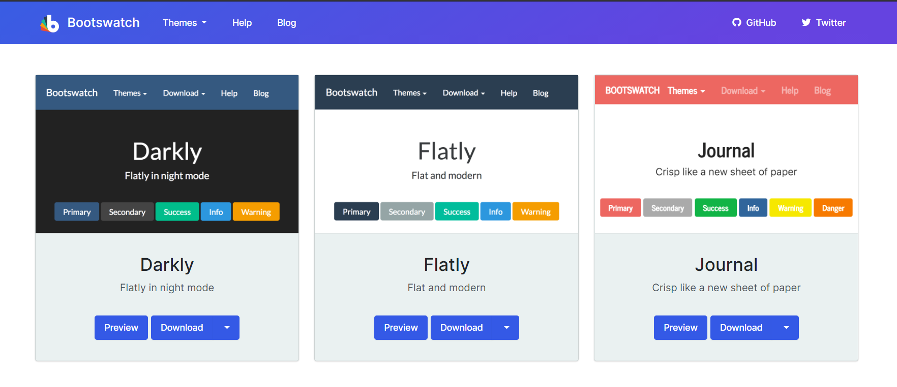

# 文档元素

学习过 R Markdown 的基础知识后，本章进一步介绍如何创建和自定义常见的文档元素，包括

- 处理文档中的图片，表格和数学公式

- 用主题定制输出外观

- 插入目录

- 创建交叉引用

- 设置章节编号

- 插入文献参考和引用

- 创建示意图

- 插入分页符和分割线


## 图片

### 用 knitr 选项操作图片

默认设置下，代码块产生的图片被直接插入到输出文档中该段代码的后面，靠左对齐，没有标题, 尺寸默认大小。我们可以用 `fig.align`, `fig.cap`, `fig.width`, `fig.height`, `out.width`, `out.height` 等 knitr 选项操作图片。例如：

````
```{r, out.width = '70%', fig.align = 'center', fig.cap = 'cars 散点图'}`r ''`
plot(cars)
```
````


生成

```{r, out.width = '70%', fig.align = 'center', fig.cap = 'cars 散点图', echo = FALSE}
plot(cars)
```

`fig.cap` 是图片的重要属性，它不仅为图片设置了标题，还确保图片被置于独立的环境中。对 HTML 输出，图片对应的 `` 标签被放在一个 `.figure` 类 div 容器中。对 PDF 输出，Pandoc 会创建 `\begin{figure}` 环境，而不是仅插入 `\includegraphics{}` 指令。添加标题可以让我们的文档更有组织性，并支持交叉引用 (\@ref(cross-reference))

我们可以把多个图片放置在同一个环境中。knitr 选项 `fig.show = 'hold'` 把同一个代码块生成的多个图片放到同一个图片环境中。我们可以进一步设置 `out.wdith` 使多个图片并排放置。例如，`out.width = '50%'` 可以让一个代码块生成的两张图片位于一行。类似的，如果想并排 3 张图片，可以设置 `out.width = '33%'`。图 \@ref(fig:plots-side-by-side) 是用 `fig.show = "hold"` 和 `out.width = '50%'` 并排两张图片的例子。

```{r plots-side-by-side, fig.cap = "用 fig.show 和 out.width 并排摆放多个图片", fig.show = "hold", out.width = "50%"}
par(mar = c(4, 4, 0.1, 0.1))
plot(pressure, pch = 19, type = "b")
plot(cars, pch = 19)
```

我们在第 \@ref(r-code) 节提到过 `fig.width`, `fig.height` 和 `out.width`, `out.height` 的区别。前两者控制了 R 用图形设备创建图片时的大小，而后两者控制了图片 (按照 `fig.width` 和 `fig.height`生成后) 插入输出文档时的比例。例如，`out.width = '70%'` 时, HTML 输出中的 `` 标签添加了属性 `width = '70%'`，而 PDF 输出设置了 `.7\linewidth`


另一个和图片大小有关的 knitr 选项是 `dpi`。当我们不设置 `out.width` 时，`dpi` 是图片的像素与宽度 (英寸) 之比。 默认情况下。knitr 会自动计算 dpi 值，我们可以用 `include_graphics(dpi = NA)`取消自动计算。


### 插入非代码生成图片


对于已有的，非代码块生成的图片，有两种插入方法

- 使用 `knitr::include_graphics()` 函数，例如 


````
```{r, fig.cap = "加载非代码块生成的图片", out.width = '90%'}`r ''`
# <image-path> 为图片的存储路径
knitr::include_graphics("<image-path>")
```
````

- 使用 Markdown 语法 ``，

我们推荐总是用 `knitr::include_graphics()` 插入图片，它有几点好处

- 提供独立于输出格式的统一图片语法

- 我们可以像控制 R 代码生成的图片那样控制外部图片，`fig.cap`, `out.width`, `dpi`, `fig.show` 等图片相关的 knitr 选项均适用于 `include_graphics` 加载的图片。在后面的章节中，我们会学习如何用钩子函数自动裁剪图片，优化图片体积等，而这一切都要求图片必须在代码段生成。

- 对于 PDF 输出，`include_graphics` 能自动采用质量更高的 PDF 格式图片，例如用 `foo/bar.pdf` 取代 `foo/bar.png`。knitr 选项 `auto_pdf = TRUE` 可以启动这项功能，或设置全局选项 `options(knitr.graphics.auto_pdf = TRUE)。`


`include_graphics` 可以一次插入多个图片，下面的代码块插入了三张图片，并设置 `out.width = '33%'`：

```{r, out.width = "33%"}
knitr::include_graphics(rep("images/knit-logo.png", 3))
```


## 表格


## 公式


## 主题

对于 rmarkdown 包提供的 HTML 输出格式，我们可以用 YAML 元数据中的 `theme` 选项设置输出的外观主题。

```
--- 
output:
  html_document:
    toc: true
    theme: united
---
```

一个主题包含了一系列配色，字体，布局等设置。图 


```{r, echo = FALSE}
import_example_result("examples/theme-united.Rmd")
```


可选的主题包括 `united`, `journal`, `flatly` 等 。这些名字来自 UI 框架 bootstrap 的主题扩展 [bootswatch](https://bootswatch.com/)。R Markdown 的默认 HTML 输出格式基于 bootstrap 库，而 bootswatch 提供了一系列扩展主题。读者可以在 bootswatch 网站上看到每个主题的效果。Andrew Zieffler 在[博客](https://www.datadreaming.org/post/r-markdown-theme-gallery/)中同样列举了所有主题的效果。

```{r boots-theme, fig.cap = "bootswatch 网站", echo = FALSE}

```

除了 `theme` 提供的主题选择之外，读者还可以使用其他包提供的 R Markdown 模板。一个例子是 [prettydoc](https://github.com/yixuan/prettydoc) 包，


```{r, echo = FALSE}
import_example_result("examples/prettydoc.Rmd")
```


一些类似的提供 R Markdow 模板的包包括 [rmdformats](https://github.com/juba/rmdformats)，[tufte](https://github.com/rstudio/tufte)，[rtciles](https://github.com/rstudio/rticles) (PDF) 等。


## 目录

## 交叉引用 {#cross-reference}

交叉引用 (cross-reference) 可以为读者提供锚点链接，便于他们快速浏览文档中相关部分。为了使用交叉引用，我们需要

- 支持交叉引用的格式：交叉引用不是 R Markdown 问世时就具备的功能，rmarkdown 包中的 `html_document`, `pdf_document` 等格式不能支持。我们可以使用 bookdown 包中的"增强版本"：`bookdown::html_document2` 和 `bookdown::pdf_document2` 等。

- 为链接到的锚点设置标签 (label）：对于章节，我们可以使用 Pandoc 生成的标签。对于图片和表格，我们在 \@ref(r-code) 节中谈到可以用 `  ```{r label} ` 和 `  ```{r, label = "label"}` 为代码块设置标签。当该代码块的输出包含图片或表格时，代码块的标签即是引用时用到的标签。我们还需要为图片或表格设置标题。图片可以用`fig.cap` knitr 选项，设置表格标题的方法取决于生成的函数，例如 `knitr::kable` 使用 `caption` 参数

随后，我们可以用 `\@ref(label)` 引用章节，用 `\@ref(fig:label)` 引用图片，用 `\@ref(tab:label)` 表格。下面是一个例子：

`r import_example("examples/cross-reference.Rmd")`


输出结果为

```{r, echo = FALSE}
import_example_result("examples/cross-reference.Rmd")
```


如上所示，我们可以用 `# 标题 {#header}` 为该节添加自定义标签，随后用 `\@ref(header)` 引用该部分。图片和表格的标签即是该代码块的标签，同时需要有 标题属性，交叉引用才能生效。R Markdown 会自动为标题，图片和表格生成顺序编号，我们在引用时只关心它们的标签即可。

读者如果点开生成的 HTML 文档，可以发现设置了标签的元素有对应的`id`属性，这也是交叉引用的跳转基础。对于英文标题，Pandoc 会自动设置一个标签。例如 `# Hello World` 对应的标签为 `hello-world`。对中文标题，我们建议在需要时手动设置一个简洁的英文标签，仅包含英文字母和连字符。

除了 `\@ref(label)` 以外，我们还可以用 Markdown 的链接语法 `[文字](#label)` 设置交叉引用。这种办法的好处是可以添加自定义文字，而 \@ref(label) 仅生成对应编号。


## 章节编号

绝大多数输出格式在 YAML 元数据中支持 `number_sections` 属性，值为 `true` 时，各章节标题按照层级自动编号。

我们可以用 Pandoc 的标题属性 `.unnumbered` 省略某个章节的编号，见 <https://pandoc.org/MANUAL.html#extension-header_attributes>。


`r import_example("examples/pandoc-attributes.Rmd")`


以上文档输出为 


```{r, echo = FALSE}
import_example_result("examples/pandoc-attributes.Rmd")
```

读者还需注意，对没有编号的标题使用交叉引用时，只能用 Markdown 链接 `[文字](#label)`,  而不能用 `\@ref(label)`，后者是基于编号的引用。 


## 文献参考和引用


### 引用 R 包

## 插入示意图

## 插入分页符和分割线


