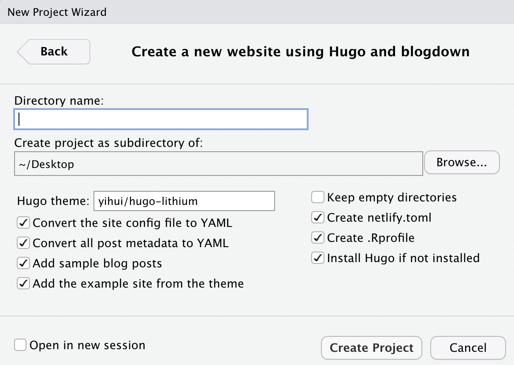
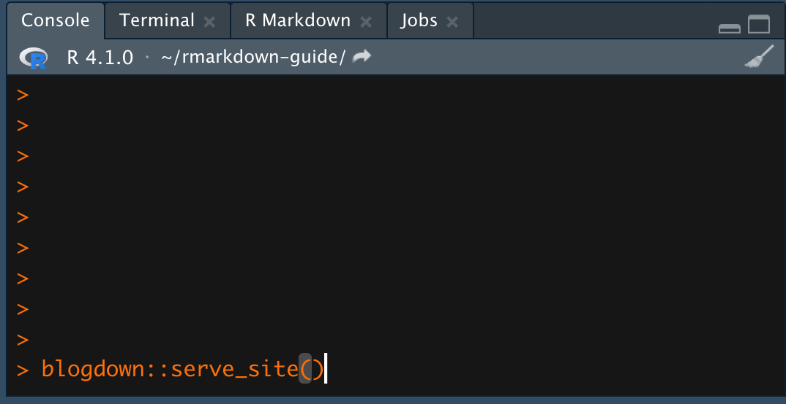
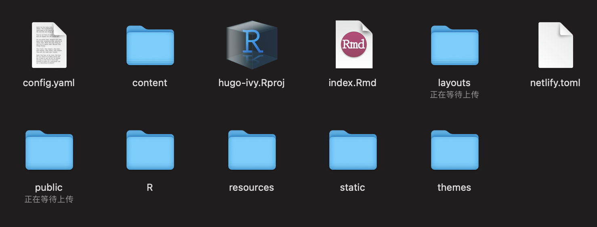

# 基于 R Markdown 工作与学习 {#rmarkdown-working}

## 发邮件：blastula {#rmarkdown-email}

## 制作 R 包：fusen {#rmarkdown-package}

## 制作简历：datadrivencv {#rmarkdown-cv}

## 写书和记学习笔记：bookdown {#rmarkdown-bookdown}

## 制作网站：blogdown {#rmarkdown-blogdown}

### blogdown 简介 {#blogdown-intro}

在当今的互联网时代世界，无论从事什么职业，个人网站几乎成为了一张人手必备的的“电子名片”。谢益辉开发的 blogdown 包提供了一种功能全面，且设置简单快速的个人网站架设途径。

blogdown 是一种基于 Hugo 设计的静态网站。不同于多数现有的网站架设方案，静态网站有着众多好处，如文件体型小，铺设速度快，所以更换服务器时更加省时省力。与此同时，blogdown 依赖 R Markdown 文件为基础来生成网站。而R Markdown 文件本身支持众多强大功能，包括文本的书写，编辑与排版（包括对LaTeX的支持），数据分析，交互性插件（如交互性图表）等。

次书的本小节将通过一个对新手十分友好的案例来手把手的展示如何快速建立一个可满足用户基本需求的网站，以便用户可快速上手 blogdown，并根据自身需求在后期不断建设自己的个人网站。

### 具体操作 {#blogdown-steps}

#### 安装 blogdown {#steps-install}

在开始之前，使用者需要确认个人主机已经安装最新版本的 R 和 RStudio。

首先，通过以下一行命令从 CRAN 安装 blogdown 包：
```{r, eval=FALSE}
# 安装 blogdown
install.packages("blogdown")
```

#### 创建项目 {#steps-project}

一个网站可被视为一个 R 项目。想要创建一个新的网站项目，只需要按照下图提示，在 RStudio 菜单栏依次选择文件，新项目，新目录 （`File -> New Project  -> New Directory`）。完成后，选择用 blogdown 建设网站 （`Website using blogdown`），即可看到一个网站项目的具体设置界面。

```{r fig.cap="在 RStudio 中创建一个新网页项目", out.width="60%", echo = FALSE}
knitr::include_graphics("images/blog1.png")
```


```{r fig.cap="基于 blogdown 创建一个新网页项目", out.width="60%", echo = FALSE}

```

设置好目录名，只需点击创建项目（`Create Project`），RStudio 即会通过 blogdown 包来自动生成一个属于你的网站项目。

#### 网站铺设 {#steps-serve}

用户可以便捷的通过 RStudio 的基础功能在本地浏览自己的网页项目。你既可以直接在控制台 （Console） 键入 `blogdown::serve_site()`，或在 RStudio 上方的插件 （`Addins`） 选项选择铺设网站 （`Serve Site`）。

```{r fig.cap="通过控制台在本地浏览你的网站", out.width="60%", echo = FALSE}

```

```{r fig.cap="通过插件的铺设选项在本地浏览你的网站", out.width="60%", echo = FALSE}
knitr::include_graphics("images/blog4.png")
```

然后你的 RStudio 应显示与下图相似的页面。

```{r fig.cap="在本地铺设网站", out.width="60%", echo = FALSE}
knitr::include_graphics("images/blog5.png")
```

显示本地铺设成功后，你还可以点击在本地浏览器打开（在 RStudio 右上角的 `Show in new window`）来通过你的本地浏览器在本地浏览你的网页。只要网页项目在在本地浏览器中被打开后，任何在源文件上的改动都会自动在浏览器中实时进行加载，所以你不需要在每次改动后重复点击铺设网站。

#### 内容编辑 {#steps-edit}

位于 RStudio 的右下角，用户可以通过进入内容 `content` 文件夹来查看并编辑当下网站项目的所有内容页。作为一个初始例子，我们首先打开 2020 年 12 月 01 日的一个文件 `content/post/2020-12-01-r-rmarkdown/index.Rmd`。 可以注意到，打开的 `Rmarkdown/Rmd` 文件的最上方是含有标题 `title`，作者 `author` 等字眼的代码部分，而这个部分被称为 YAML 代码区 （用于设定网页形态）。 当编辑具体网页内容时，用户只需要在 YAML 下方的空白部分进行编写即可。

接下来，让我们来尝试一下在网页中添加一些代码，你只需添加一个 R 代码块，然后输入以下内容：

```{r, fig.show='hide'}
library(ggplot2)
summary(Orange)

ggplot(Orange, aes(x = age, 
                   y = circumference, 
                   color = Tree)) +
  geom_point() +
  geom_line() +
  guides(color = FALSE) +
  theme_bw()
```

此时，如果你的网站项目已经在本地浏览器中打开，你只需要点击左上角的保存，几秒后你即可在浏览器内看到类似下图的内容。如果此时你没有在本地浏览你的网页，点击编译 `knit`，你的网站便会在本地的 RStudio 自动生成。

```{r fig.cap="给 Rmd 文件添加 R 代码", out.width="60%", echo = FALSE}
knitr::include_graphics("images/blog6.png")
```


#### 网站配置 {#steps-configure}

除了通过编辑 `Rmd` 文件来实现网站内容的编辑外，用户还可以通过修改 `config.yaml` 文件内的设定来自定义自己的网站。

例如，打开 `config.yaml` 文件后，你可能会看到如下内容：

```{r, eval = FALSE}
baseurl: /
title: A Hugo website
theme: hugo-lithium
ignoreFiles:
  - \.Rmd$
  - \.Rmarkdown$
  - _cache$
  - \.knit\.md$
  - \.utf8\.md$
permalinks:
  post: /:year/:month/:day/:slug/
menu:
  main:
    - name: About
      url: /about/
    - name: GitHub
      url: https://github.com/rstudio/blogdown
    - name: Twitter
      url: https://twitter.com/rstudio
```

只需在相应的部分进行编辑，用户就可以根据个人的需求自定义自己的网站，如：

- `title: 我的网站` ：将网站标题修改为“我的网站”
- `name: Weibo` `url: 你的微博url` ：在菜单中添加个人 Weibo 信息页面的链接

#### 小结 {#steps-summary}

目前为止，你已经成功掌握了创建并编辑一个个人化 blogdown 网站的三条基本知识：

1. 通过 RStudio 的铺设 `Serve Site` 功能 或在控制台内键入 `blogdown::serve_site()` 来在本地浏览自己的网站。
2. 通过编辑 `config.yaml` 文件来自定义自己的网站（标题，菜单栏，主题等）。
3. 通过编辑处于目录夹中 `content` 文件夹内的 `Rmd` 文件来编辑具体的网页信息。通过进阶的学习，你还可以通过修改自定义 `Rmd` 文件的位置来改变他们在网站上显示的结构。

#### 部署 {#steps-deploy}

那么下一步是什么？答案有很多，但最重要的自然是通过部署，以便让他人可以通过互联网直接浏览我们的网站。

就像之前简短提到过的，因为静态网站本质上就是一个文件夹，所以静态网站与大多数动态网站相比较的一个重要优点就是部署更加简单且快速。那么我们如何选择用于部署的服务器呢？权衡过上手友好度以及性价比后，Netlify (https://www.netlify.com/) 是一个很不错的选择。

#### Netlify {#steps-netlify}

Netlify提供的免费服务功能多元，足够满足大多数用户的需求，且部署也十分简单。就算用户之前没有部署网站的经验，你只需创建一个 Github 账户，并使用此账户注册并登陆你的 Netlify 账户。登陆成功后，只需将你网站项目目录中由 blogdown 生成的名为公共 `Public/` 的文件夹拖入你的 Netlify 部署页面即可。

```{r fig.cap="在网站项目文件夹中找到名为Public的文件夹", out.width="60%", echo = FALSE}

```

```{r fig.cap="将此文件夹拖拽入部署页面的部署区域即可完成部署", out.width="60%", echo = FALSE}
knitr::include_graphics("images/blog8.png")
```

一般只需几秒钟，你的网站就会被成功部署在 Netlify 的服务器上，并可以通过一个格式为 `random-word-12345.netlify.com` 的域名访问。此域名是 Netlify 自动生成的一个子域名，并支持通过设置修改至自己偏好的字眼。Netlify 提供的一体化部署服务省去了用户在其他服务器上实现自定义设置时往往需要面对的许多麻烦。

不过需要注意的是，每次在本地的 RStudio 编辑完你的个人网站后，你需要在控制台输入以下代码来更新你的公共文件夹  `Public/`。只有在更新完成后，你才可以通过在 Netlify 上次最新版本的 `Public/` 文件夹来部署你改动过后的网站。

```{r, eval=FALSE}
blogdown::build_site()
```

讲通过Git的自动部署

## 制作科技论文的支撑材料 {#rmarkdown-paper}
