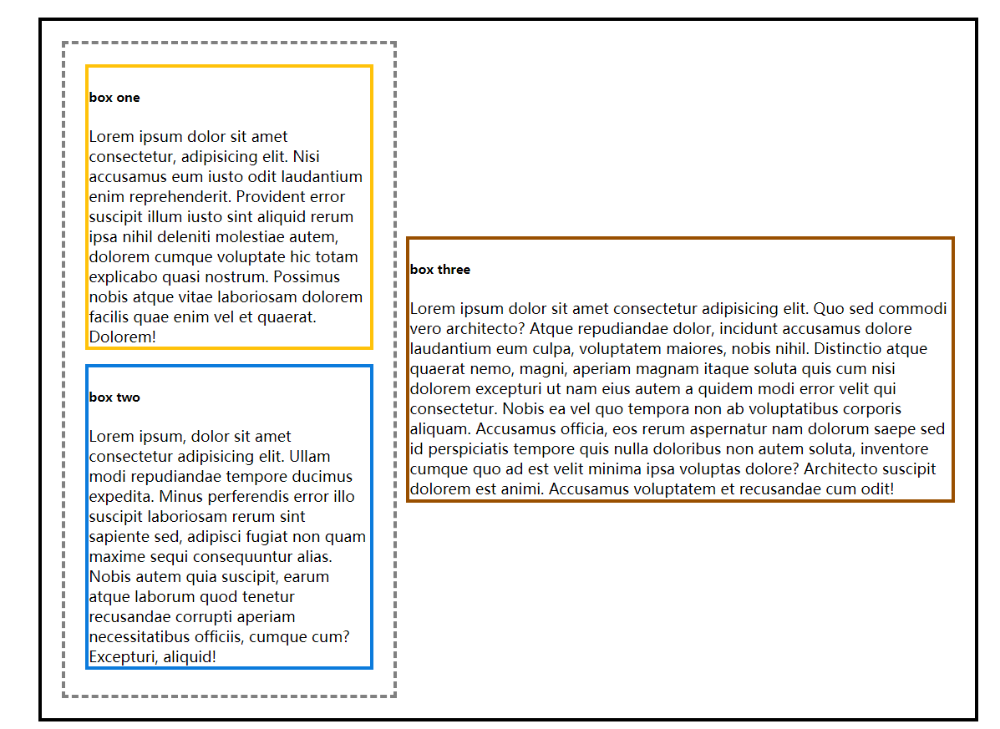

<<<<<<< HEAD

# 排版 {#typesetting}

迄今为止，我们在 R Markdown 中的排版效果都是通过 Markdown 实现的。Markdown 的核心设计原则是用简洁的标记表示必需的格式，让新手也能快速上手。正如 Markdown 的作者 John Gruber 所言：

> 一个 Markdown 文档应该作为纯文本原样发布，而不需要添加各种样式标签和排版指令。

由此见得，Markdown 并不希望成为某个完备的排版解决方案。我们不是想用 `#`, `*`, `-` 等表示可穷尽的样式，而是用简单易记的语法满足最常见的格式需要，仅此而已。这意味着 Markdown 不能满足较为复杂的排版需求，例如：

- 改变某个段落的字体大小

- 设置字体颜色

- 调整段落对齐

- 设置复杂的文字和图片布局

本章介绍了突破 Markdown 排版限制的解决办法。我们首先介绍 HTML 和 PDF 格式下通用的排版解决策略，随后探讨如何应对一些常见的具体问题。但在追求复杂排版效果之前，读者应首先考虑它们是否是必需的，以及达成的效果是否值得花费额外时间。


## 通用方案


### HTML

#### CSS 基础

CSS (层叠样式表) 是一种设置 HTML 网页的布局与样式的语言，以 `.css` 文件存储。一个 CSS 文件包含了针对不同网页元素的排版规则，例如下面的 CSS 样式表

```css
h1 {
    color: red;
    font-size: 5em;
}

p span {
    color: blue;
}
```

上面的 CSS 包含两条规则，每个规则均由一条选择器 (selector) 开头，它定义了规则应用的网页元素。选择器后跟着一对大括号 `{ }`，其中包含了规则的具体内容。我们可以这样解读这两条规则：

```
1. 对所有 <h1> 元素，设置它们的字体颜色为红色 (red)，大小为 5 倍默认字体的大小

2. 对所有 <p> 元素包含的 <span> 元素，设置它们的字体颜色为蓝色 (蓝色)

```


除了颜色，大小，对齐等等简单属性外，CSS 还可用于设计复杂的布局，假设我们有如下网页结构：

```html
<div class="container">
    <div id="sub-container">
        <div id="one">text</div>
        <div id="two">text</div>
    </div>
    <div id="three">
      text
    </div>
</div>
```

添加基础样式 (边框，间距) 后，网页效果如图 \@ref(fig:without-flexbox) 所示，各容器从上到下顺序排列，每个容器单独一行。这也是 Markdown 支持的布局。

```{r without-flexbox, fig.cap = "添加 CSS 布局前", echo = FALSE}
knitr::include_graphics("images/05-without-flexbox.jpg")
```

我们可以用 CSS 调整 `.container` 和 `.sub-container` 中各元素的排布，添加 CSS：

```css
.container {
  display: flex;
  justify-content: space-around;
  align-items: center; 
  row-gap: 20px;
}

.sub-container {
  display: flex;
  flex-direction: column;
  justify-content: space-between;
}
```

`display: flex` 为容器设置了 flexbox 布局, 突破了常规文档流的默认布局限制。`justify-content` 和 `align-items` 等属性进一步自定义了 flexbox 布局的效果，如图 \@ref(fig:flexbox) 所示。


```{r flexbox, fig.cap = "添加 CSS 布局后", echo = FALSE}

```


我们不再深入 CSS 选择器的语法和属性设置。读者可以在 [MDN 文档](https://developer.mozilla.org/zh-CN/docs/Learn/CSS) 学习更多 CSS 知识。

#### 在 R Markdown 中使用 CSS

我们可以在 HTML 输出格式的 YAML 选项中引用根目录下 CSS 文件，例如：

```
---
output:
  html_document:
    css: style.css
  bookdown::gitbook::
    css: ["style.css", "toc.css"]
---
```

随后，我们可以在对应的 CSS 文件中添加规则，这需要知道想控制元素对应的 CSS 选择器，常见文档元素对应的选择器如表 \@ref(tab:selectors) 所示。


```{r selectors, echo = FALSE}
library(huxtable)
t <- readr::read_csv("data/selectors.csv")
t <- as_huxtable(t, caption = "HTML 输出中常见元素对应的 CSS 选择器")
set_markdown(t, everywhere, everywhere)
```

假设我们要设置段落的行高，已经知道段落对应的 CSS 选择器为 `p`。下面在网络上搜索行高对应 CSS 的属性名称，例如 "MDN CSS 行高" 会告诉我们该属性为 `line-height`, 那么可以在 `style.css` 中设置：

```css
p {
  line-height: 120%;
}
```

除了引用 CSS 文件外，我们还可以直接在 R Markdown 中运行 CSS 代码块，改变当前文档的 CSS 样式，例如下面的源文档：

`r import_example("examples/css-chunk.Rmd")`


效果如图 \@ref(fig:css-chunk) 所示。

```{r css-chunk, echo = FALSE, fig.cap = "在 R Markdown 中直接运行 CSS 代码块"}
import_example_result("examples/css-chunk.Rmd")
```

如果仅想设定少量元素的 CSS 属性，可以直接在 R Markdown 源文档中插入 HTML 标签，如 `<span style = "background-color: yellow"><strong>这是一段高亮</strong></span>` 会变为 <span style = "background-color: yellow"><strong>这是一段高亮</strong></span>。

有时我们需要自己创造 CSS 选择器，手动插入大量 HTML 标签稍嫌麻烦，这时可以运用 Pandoc 的 "fenced div" 特性。用前后一对 `:::` 表示一个 div 容器，嵌套 div 时需在外层 div 添加一对 `:`，例如：

```
::: {#special}
这是第一个 div
:::

:::: {.special}
这是第二个 div

::: 
这是第三个 div
:::

::::
```

Pandoc 将以上语法渲染为 HTML 元素：

```html
<div id="special">
    这是一个 div
</div>
<div class="special">
    这是第二个 div
    <div>
        这是第三个 div
    </div>
</div>
```

随后我们可以在 CSS 中使用 `#special`, `.special` 和 `.special div` 等选择器选择以上三个 div 元素。

#### 用 bslib 包自定义 bootstrap 主题


### LaTeX

例如

```
---
output:
  pdf_document:
    keep_tex: true
---
```

此时得到的 `.tex` 文件已经包含了基础 Markdown 格式和代码运行结果，读者可以在此基础上添加 LaTeX 指令得到想要的效果。但这样的二次编辑已经不是使用 R Markdown 的初衷了，同时，我们也假定 R 用户不愿意付出过多时间成本深入 LaTeX。


在 `in_header` 中引入 LaTeX 包并添加几行初始化指令已经能解决绝大部分 R Markdown 用例的排版需要。对更复杂的


## 字体颜色

Markdown 没有提供控制字体颜色的语法。我们需要用 HTML 或 LaTeX 语法改变特定片段的颜色：

- 对 HTML，我们可以用 `style` 属性设置行内 css，如 `<span style="color: red;">文本</span>`

- 对 PDF，可以用 **xcolor** 包提供的 `\textcolor{}` 指令。改包已经包含在 Pandoc 的安装中。

在 PDF 输出格式中设置字体颜色的例子如下：

````
---
title: "用 PDF 输出中设置字体颜色"
documentclass: ctexart
output: rticles::ctex
---

日出江花红胜\textcolor{red}{火}，春来江水绿如\textcolor{blue}{蓝}
````

`\textcolor` 的第一个括号指定颜色， 第二个括号为颜色应用的文字。

然而，上述写法只在我们仅有一种确定输出格式的时候生效。例如，输出格式是 LaTeX，HTML 写法将被忽略，反之亦然。knitr 包提供了 `is_html_output` 和 `is_latex_output` 两个函数判断当前文档的输出格式，由此，我们可以定义一个动态应用颜色语法的函数：

```{r, eval = FALSE}
colorize <- function(x, color) {
  if (knitr::is_latex_output()) {
    sprintf("\\textcolor{%s}{%s}", color, x)
  } else if (knitr::is_html_output()) {
    sprintf("<span style='color: %s;'>%s</span>", color,
      x)
  } else x
}
```

随后，我们可以使用行内 R 代码：

```
Red is `r '\x60r colorize("red", "red")\x60'`, blue is `r '\x60r colorize("blue", "blue")\x60'`
```

我们可以用 Pandoc 的 Lua 过滤器功能实现更进阶的自定义颜色语法。有兴趣的读者可以在 [R Markdown Cookbook](https://bookdown.org/yihui/rmarkdown-cookbook/font-color.html#lua-color) 看到一个例子。


## 缩进

大部分时候，Markdown 会无视文本中的空格。但表示诗歌或地址等信息时，我们可能希望用空格表示缩进。这时可以在行首添加 `|`，Markdown 会保留紧跟在垂直线后的空格和换行符。例如：


```
> | 古今之成大事业、大学问者，必经过三种之境界：
> |   "昨夜西风凋碧树，独上高楼，望尽天涯路。" 此第一境也。
> | "衣带渐宽终不悔，为伊消得人憔悴。" 此第二境也。
> |   "众里寻他千百度，蓦然回首，那人却在，灯火阑珊处。”此第三境也。
```

生成：


> | 古今之成大事业、大学问者，必经过三种之境界：
> |   "昨夜西风凋碧树，独上高楼，望尽天涯路。" 此第一境也。
> | "衣带渐宽终不悔，为伊消得人憔悴。" 此第二境也。
> |   "众里寻他千百度，蓦然回首，那人却在，灯火阑珊处。"此第三境也。
。


## 控制输出宽度

有时 R 代码生成的文字输出宽度过长，容易溢出当前页面宽度。HTML 格式的输出文档会生成水平方向的滚动条，而 PDF 文档则会丢失页面宽度以外的内容。较为通用的解决办法时用 `options()` 中的 `width` 参数控制函数输出的宽度，例如：

`r import_example('examples/result-width.Rmd')`

输出如图 \@ref(fig:options-width) 所示。

```{r options-with, fig.cap = "用 options 控制输出宽度", echo = FALSE}
import_example_result("examples/result-width.Rmd")
```


如果是 HTML 输出格式，我们也可以直接应用 css：

```css
pre code {
  white-space: pre-wrap;
}
```

有些 R 函数可能不会听从 `options` 的安排。我们可用 LaTeX 中的 **listing** 包做补救，在 YAML 中：

```
---
output:
  pdf_document:
    pandoc_args: --listings
    includes:
      in_header: preamble.tex
---
```

其中，`in_header: preamble.tex` 在最终输出文档的头部加载 `preamble.tex` 文件，我们设置了

```
\lstset{
  breaklines=true
}
```

`\lstset{}` 指令用于设定代码输出的格式，例如可以指定字体 `basicstyle=\ttfamily`。最终结果如 图 \@ref(fig:result-listings) 所示。读者可以在 <https://ctan.org/pkg/listings> 了解 listing 包的其他选项。

```{r result-listings, echo = FALSE, fig.cap = "用 listings 包控制输出宽度"}
knitr::include_graphics("images/05-result-with-listings.jpg")
```


## 为代码段添加行号

## 多列布局


=======

# 排版 {#typesetting}

## 字体颜色

Markdown 没有提供控制字体颜色的语法。我们需要用 HTML 或 LaTeX 语法改变特定片段的颜色：

- 对 HTML，我们可以用 `style` 属性设置颜色或 css 类，如 `<span style="color: red;">文本</span>`

- 对 PDF，可以用 **xcolor** 包提供的 `\textcolor{}` 指令。改包已经包含在 Pandoc 的安装中。

在 PDF 输出格式中设置字体颜色的例子如下：

````
---
title: "用 PDF 输出中设置字体颜色"
documentclass: ctexart
output: rticles::ctex
---

日出江花红胜\textcolor{red}{火}，春来江水绿如\textcolor{blue}{蓝}
````

`\textcolor` 的第一个括号指定颜色， 第二个括号为颜色应用的文字。

然而，上述写法只在我们仅有一种确定输出格式的时候生效。例如，输出格式是 LaTeX，HTML 写法将被忽略，反之亦然。knitr 包提供了 `is_html_output` 和 `is_latex_output` 两个函数判断当前文档的输出格式，由此，我们可以定义一个动态应用颜色语法的函数：

```{r, eval = FALSE}
colorize <- function(x, color) {
  if (knitr::is_latex_output()) {
    sprintf("\\textcolor{%s}{%s}", color, x)
  } else if (knitr::is_html_output()) {
    sprintf("<span style='color: %s;'>%s</span>", color,
      x)
  } else x
}
```

随后，我们可以使用行内 R 代码：

```
Red is `r '\x60r colorize("red", "red")\x60'`, blue is `r '\x60r colorize("blue", "blue")\x60'`
```

我们可以用 Pandoc 的 Lua 过滤器功能实现更进阶的自定义颜色语法。有兴趣的读者可以在 [R Markdown Cookbook](https://bookdown.org/yihui/rmarkdown-cookbook/font-color.html#lua-color) 看到一个例子。


## 缩进

大部分时候，Markdown 会无视文本中的空格。但表示诗歌或地址等信息时，我们可能希望用空格表示缩进。这时可以在行首添加 `|`，Markdown 会保留紧跟在垂直线后的空格和换行符。例如：


```
> | 古今之成大事业、大学问者，必经过三种之境界： 
> |   “昨夜西风凋碧树，独上高楼，望尽天涯路。” 此第一境也。 
> | "衣带渐宽终不悔，为伊消得人憔悴。" 此第二境也。 
> |   "众里寻他千百度，蓦然回首，那人却在，灯火阑珊处。”此第三境也。
```

生成：

> | 古今之成大事业、大学问者，必经过三种之境界： 
> |   ”昨夜西风凋碧树，独上高楼，望尽天涯路。“ 此第一境也。 
> | "衣带渐宽终不悔，为伊消得人憔悴。" 此第二境也。 
> |   "众里寻他千百度，蓦然回首，那人却在，灯火阑珊处。”此第三境也。


## 控制输出宽度

有时 R 代码生成的文字输出宽度过长，容易溢出当前页面宽度。HTML 格式的输出文档会生成水平方向的滚动条，而 PDF 文档则会丢失页面宽度以外的内容。较为通用的解决办法时用 `options()` 中的 `width` 参数控制函数输出的宽度，例如：

`r import_example('examples/result-width.Rmd')`

输出如图 \@ref(fig:options-width) 所示。

```{r options-with, fig.cap = "用 options 控制输出宽度", echo = FALSE}
import_example_result("examples/result-width.Rmd")
```


如果是 HTML 输出格式，我们也可以直接应用 css：

```css
pre code {
  white-space: pre-wrap;
}
```

有些 R 函数可能不会听从 `options` 的安排。我们可用 LaTeX 中的 **listing** 包做补救，在 YAML 中：

```
---
output:
  pdf_document:
    pandoc_args: --listings
    includes:
      in_header: preamble.tex
---
```

其中，`in_header: preamble.tex` 在最终输出文档的头部加载 `preamble.tex` 文件，我们设置了

```
\lstset{
  breaklines=true
}
```

`\lstset{}` 指令用于设定代码输出的格式，例如可以指定字体 `basicstyle=\ttfamily`。最终结果如 图 \@ref(fig:result-listings) 所示。读者可以在 <https://ctan.org/pkg/listings> 了解 listing 包的其他选项。

```{r result-listings, echo = FALSE, fig.cap = "用 listings 包控制输出宽度"}
knitr::include_graphics("images/05-result-with-listings.jpg")
```


## 为代码段添加行号

## 多列布局


>>>>>>> master
