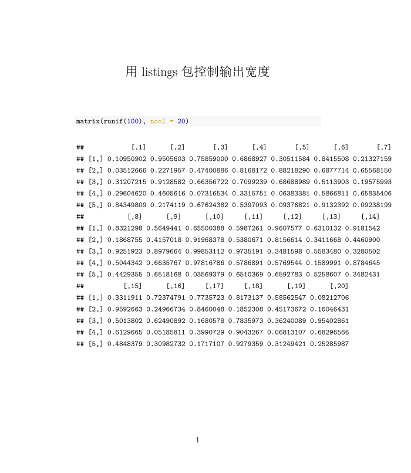

# 排版 {#typesetting}

## 字体颜色

Markdown 没有提供控制字体颜色的语法。我们需要用 HTML 或 LaTeX 语法改变特定片段的颜色：

- 对 HTML，我们可以用 `style` 属性设置颜色或 css 类，如 `<span style="color: red;">文本</span>`

- 对 PDF，可以用 **xcolor** 包提供的 `\textcolor{}` 指令。改包已经包含在 Pandoc 的安装中。

在 PDF 输出格式中设置字体颜色的例子如下：

````
---
title: "用 PDF 输出中设置字体颜色"
documentclass: ctexart
output: rticles::ctex
---

日出江花红胜\textcolor{red}{火}，春来江水绿如\textcolor{blue}{蓝}
````

`\textcolor` 的第一个括号指定颜色， 第二个括号为颜色应用的文字。

然而，上述写法只在我们仅有一种确定输出格式的时候生效。例如，输出格式是 LaTeX，HTML 写法将被忽略，反之亦然。knitr 包提供了 `is_html_output` 和 `is_latex_output` 两个函数判断当前文档的输出格式，由此，我们可以定义一个动态应用颜色语法的函数：

```{r, eval = FALSE}
colorize <- function(x, color) {
  if (knitr::is_latex_output()) {
    sprintf("\\textcolor{%s}{%s}", color, x)
  } else if (knitr::is_html_output()) {
    sprintf("<span style='color: %s;'>%s</span>", color,
      x)
  } else x
}
```

随后，我们可以使用行内 R 代码：

```
Red is `r '\x60r colorize("red", "red")\x60'`, blue is `r '\x60r colorize("blue", "blue")\x60'`
```

我们可以用 Pandoc 的 Lua 过滤器功能实现更进阶的自定义颜色语法。有兴趣的读者可以在 [R Markdown Cookbook](https://bookdown.org/yihui/rmarkdown-cookbook/font-color.html#lua-color) 看到一个例子。


## 缩进

大部分时候，Markdown 会无视文本中的空格。但表示诗歌或地址等信息时，我们可能希望用空格表示缩进。这时可以在行首添加 `|`，Markdown 会保留紧跟在垂直线后的空格和换行符。例如：


```
> | 古今之成大事业、大学问者，必经过三种之境界：
> |   "昨夜西风凋碧树，独上高楼，望尽天涯路。" 此第一境也。
> | "衣带渐宽终不悔，为伊消得人憔悴。" 此第二境也。
> |   "众里寻他千百度，蓦然回首，那人却在，灯火阑珊处。”此第三境也。
```

生成：

> | 古今之成大事业、大学问者，必经过三种之境界：
> |   "昨夜西风凋碧树，独上高楼，望尽天涯路。" 此第一境也。
> | "衣带渐宽终不悔，为伊消得人憔悴。" 此第二境也。
> |   "众里寻他千百度，蓦然回首，那人却在，灯火阑珊处。"此第三境也。


## 控制输出宽度

有时 R 代码生成的文字输出宽度过长，容易溢出当前页面宽度。HTML 格式的输出文档会生成水平方向的滚动条，而 PDF 文档则会丢失页面宽度以外的内容。较为通用的解决办法时用 `options()` 中的 `width` 参数控制函数输出的宽度，例如：

`r import_example('examples/result-width.Rmd')`

输出如图 \@ref(fig:options-width) 所示。

```{r options-with, fig.cap = "用 options 控制输出宽度", echo = FALSE}
import_example_result("examples/result-width.Rmd")
```


如果是 HTML 输出格式，我们也可以直接应用 css：

```css
pre code {
  white-space: pre-wrap;
}
```

有些 R 函数可能不会听从 `options` 的安排。我们可用 LaTeX 中的 **listing** 包做补救，在 YAML 中：

```
---
output:
  pdf_document:
    pandoc_args: --listings
    includes:
      in_header: preamble.tex
---
```

其中，`in_header: preamble.tex` 在最终输出文档的头部加载 `preamble.tex` 文件，我们设置了

```
\lstset{
  breaklines=true
}
```

`\lstset{}` 指令用于设定代码输出的格式，例如可以指定字体 `basicstyle=\ttfamily`。最终结果如 图 \@ref(fig:result-listings) 所示。读者可以在 <https://ctan.org/pkg/listings> 了解 listing 包的其他选项。

```{r result-listings, echo = FALSE, fig.cap = "用 listings 包控制输出宽度"}

```


## 为代码段添加行号

## 多列布局


