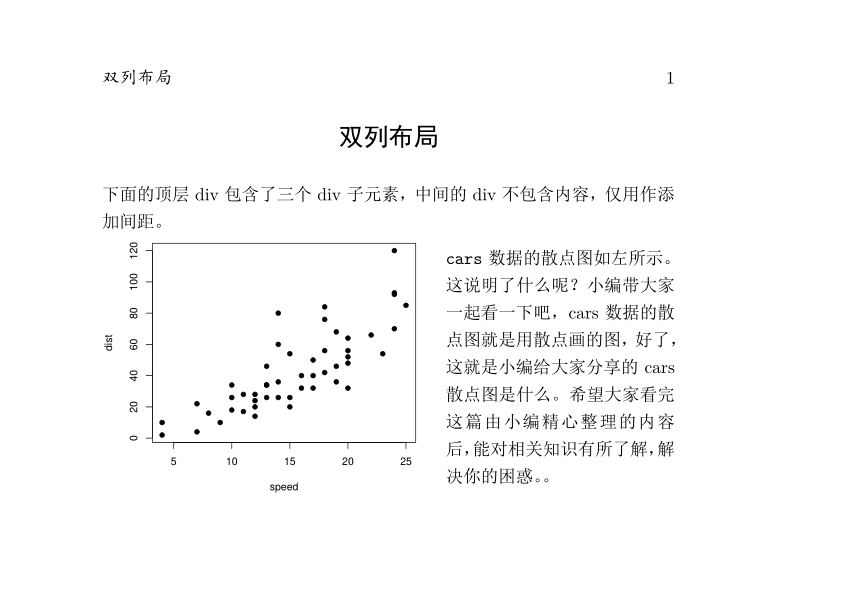

# 排版{#typesetting}

迄今为止，我们在 R Markdown 中的排版效果都是通过 Markdown 实现的。Markdown 的核心设计原则是用简洁的标记表示必需的格式，让新手也能快速上手。正如 Markdown 的作者 John Gruber 所言：

> 一个 Markdown 文档应该作为纯文本原样发布，而不需要添加各种样式标签和排版指令。

由此见得，Markdown 并不希望成为某个完备的排版解决方案。我们不是想用 `#`, `*`, `-` 等表示可穷尽的样式，而是用简单易记的语法满足最常见的格式需要，仅此而已。这意味着 Markdown 不能满足较为复杂的排版需求，例如：

- 设置文字的大小，颜色和段落对齐

- 改变输出图片，表格等的背景，边框样式

- 创建较复杂的布局，如文字环绕和多列结构

本章介绍了突破 Markdown 排版限制的解决办法。我们首先介绍 HTML 和 PDF 格式下通用的排版策略，随后探讨几个解决特定问题的技巧，读者可以按需选择性阅读。但在追求复杂排版效果之前，读者应首先考虑它们是否是必需的，以及达成的效果是否值得花费额外时间。


## HTML {#html-typesetting}

### CSS 基础 {#css-basics}

CSS (层叠样式表) 是一种设置 HTML 网页的布局与样式的语言，以 `.css` 文件存储。一个 CSS 文件包含了针对不同网页元素的排版规则，例如下面的 CSS 样式表：

```css
h1 {
    color: red;
    font-size: 5em;
}

p span {
    color: blue;
}
```

上面的 CSS 包含两条规则，每个规则均由一条选择器 (selector) 开头，它定义了规则应用的网页元素。选择器后跟着一对大括号 `{ }`，其中包含了规则的具体内容。我们可以这样解读这两条规则：

```
1. 对所有 <h1> 元素，设置它们的字体颜色为红色 (red)，大小为 5 倍默认字体的大小

2. 对所有 <p> 元素包含的 <span> 元素，设置它们的字体颜色为蓝色 (blue)
```

上面的 `h1` 和 `p span` 被称为类型选择器 (type selector)，因为它选择了所有同类型的元素。 选择器还可以精确到元素的属性，例如 `<p id = "id"></p>` 可以用 ID 选择器 (ID selector) `p#id`，`<div class = "class"></div>` 可以用类选择器 (class selector) `div.class`。一般，在元素类型是 `div` 时，可省略选择器中的元素类型，例如 `.class`。


除了颜色，大小，对齐等等简单属性外，CSS 还可用于设计复杂的布局，假设有如下网页结构：

```html
<div class="container">
    <div id="sub-container">
        <div id="one">text</div>
        <div id="two">text</div>
    </div>
    <div id="three">
      text
    </div>
</div>
```

添加基础样式 (边框，间距) 后，网页效果如图 \@ref(fig:without-flexbox) 所示，各容器从上到下顺序排列，每个容器单独一行。这也是 Markdown 支持的布局。

```{r without-flexbox, fig.cap = "添加 CSS 布局前", echo = FALSE}
knitr::include_graphics("images/05-without-flexbox.jpg")
```

我们可以用 CSS 调整 `.container` 和 `.sub-container` 中各元素的排布，例如：

```css
.container {
  display: flex;
  justify-content: space-around;
  align-items: center;
  row-gap: 20px;
}

.sub-container {
  display: flex;
  flex-direction: column;
  justify-content: space-between;
}
```

`display: flex` 为容器设置了 flexbox 布局，也称为弹性布局。设置了 `display: flex` 的元素被称为弹性容器，所有弹性容器的子元素默认被放置在同一行，但也可以通过设置`justify-content` 和 `align-items` 等属性在任何方向上创建多行多列的排布，这就突破了常规文档流的默认布局限制， 如图 \@ref(fig:flexbox) 所示。

```{r flexbox, fig.cap = "添加 CSS 布局后", echo = FALSE}
knitr::include_graphics("images/05-flexbox.jpg")
```

在上面的例子中，`container` 是最顶层的弹性容器，子元素 `.sub-container` 和 `#three` 被放在同一行上。而 `.sub-container` 本身也是弹性容器，且设置了 ` flex-direction: column`，故它的两个子元素 `#one` 和 `#two` 被放在同一列。

除了 flexbox 外，还有一种重要的布局是网格布局 (grid)，可以看作是 flexbox 的二维版本。网格布局几乎可以达成任何平面布局效果，如图 \@ref(fig:grid-layout)所示。有兴趣的读者可以参考 <https://developer.mozilla.org/zh-CN/docs/Web/CSS/CSS_Grid_Layout>。

```{r grid-layout, echo = FALSE, fig.cap = "网格布局示例"}

```


我们不再深入 CSS。读者可以在 [MDN 文档](https://developer.mozilla.org/zh-CN/docs/Learn/CSS) 学习更多知识。

### 在 R Markdown 中使用 CSS {#css-rmarkdown}

我们可以在 HTML 输出格式的 YAML 选项中引用根目录下 CSS 文件，例如：

```
---
output:
  html_document:
    css: style.css
  bookdown::gitbook::
    css: ["style.css", "toc.css"]
---
```

随后，我们在对应的 CSS 文件中添加样式规则，这需要知道想控制元素对应的 CSS 选择器，常见文档元素对应的选择器如表 \@ref(tab:selectors) 所示。

```{r selectors, echo = FALSE}
library(huxtable)
t <- readr::read_csv("data/selectors.csv")
t <- as_huxtable(t, caption = "HTML 输出中常见元素对应的 CSS 选择器")
set_markdown(t, everywhere, everywhere)
```

假设我们要设置段落的行高，已经知道段落对应的 CSS 选择器为 `p`。下面在网络上搜索行高对应 CSS 的属性名称，例如 "MDN CSS 行高" 会告诉我们该属性为 `line-height`, 那么可以在 `style.css` 中设置：

```css
p {
  line-height: 120%;
}
```
除了引用 CSS 文件外，我们还可以直接在 R Markdown 中运行 CSS 代码块，改变当前文档的 CSS 样式，例如下面的源文档：

`r import_example("examples/css-chunk.Rmd")`


效果如图 \@ref(fig:css-chunk) 所示。

```{r css-chunk, echo = FALSE, fig.cap = "在 R Markdown 中直接运行 CSS 代码块"}
import_example_result("examples/css-chunk.Rmd")
```

如果仅想设定少量元素的 CSS 属性，可以直接在 R Markdown 源文档中插入 HTML 标签，如 `<span style = "background-color: yellow"><strong>这是一段高亮</strong></span>` 会变为 <span style = "background-color: yellow"><strong>这是一段高亮</strong></span>。

有时我们需要自己创造 CSS 选择器，手动插入大量 HTML 标签稍嫌麻烦，这时可以运用 Pandoc 的 "fenced div" 特性。用前后一对 `:::` 表示一个 div 容器，嵌套 div 时需在外层 div 添加一对 `:`，例如：

```
::: {#special}
这是第一个 div
:::

:::: {.special}
这是第二个 div

:::
这是第三个 div
:::

::::
```

Pandoc 将以上语法渲染为 HTML 元素：

```html
<div id="special">
    这是一个 div
</div>
<div class="special">
    这是第二个 div
    <div>
        这是第三个 div
    </div>
</div>
```

随后我们可以在 CSS 中使用 `#special`, `.special` 和 `.special div` 等选择器选择以上三个 div 元素，应用 CSS 样式。

### 用 bslib 包自定义 bootstrap 主题 {#bslib-customization}

我们在第 \@ref(theme-templates) 节提到 R Markdown 的 HTML 输出基于 bootstrap 框架，采用了 bootstrap 提供的大量 CSS 样式。对于这样的大型前端框架，样式往往是通过 SCSS 变量的方式实现的。SCSS 是 CSS 的一种扩展，增加了变量，嵌套，导入等特性。例如，我们在下面用 SCSS 变量定义了一套配色方案：

```scss
$white:    #fff !default;
$gray-100: #f8f9fa !default;
$gray-200: #e9ecef !default;
...
$gray-900: #212529 !default;
$black:    #000 !default;

$primary:       $blue !default;
$secondary:     $gray-600 !default;
$success:       $green !default;
$info:          $cyan !default;
$warning:       $yellow !default;
$danger:        $red !default;
```

随后，在 CSS/SCSS 中使用 `primary`, `secondary`, `success` 等变量，就可以应用该主题到网页上。如果想要应用另一套配色方案/主题，更改这些变量的值即可。每个基于 bootstrap 生成的网页有类似如下的颜色设置：


```css
selector-1 {
  color: $secondary;
  background-color: $primary；
}
selector-1:hover {
  background-color: $primary;
}

selector-2 {
  border-color: $info;
}
```

因此，我们可以通过改变 bootstrap 的 SCSS 变量值来定义 R Markdown HTML 的输出样式。这些变量不限于颜色，还包括大小，间距，字体等。**bslib** 包 [@R-bslib] 允许直接在 R Markdown 的 YAML 选项中定义 bootstrap 的 SCSS 变量，例如： 

```
---
output:
  html_document:
    theme:
      bg: "#101010"
      fg: "#FDF7F7"
      primary: "#ED79F9"
      base_font:
        google: "Prompt"
      code_font:
        google: "JetBrains Mono"
---
```

效果如图 \@ref(fig:bslib-demo) 所示。注意，bslib 包无法改变 R 生成图片的样式，因为它们在 Pandoc 转换 HTML 之前已经被 knitr 存储为静态文件了。有兴趣的读者还可以用 [thematic](https://rstudio.github.io/thematic/) 包让 R 生成的图片自适应当前主题的配色。

```{r bslib-demo, fig.cap = "用 bslib 定义 bootstrap SASS 变量", echo = FALSE}
import_example_result("examples/bslib-demo.Rmd")
```


我们还可以直接选择 bootswatch 主题：

```
---
output:
  html_document:
    theme:
      bootswatch: minty
---
```

## PDF {#pdf-typesetting}

对基于 LaTeX 的 PDF 输出格式，进阶的排版设置稍复杂些。但大部分问题都可通过 "搜索 + 引入 LaTeX 包" 解决。

例如，默认生成的 PDF 中链接与其他文字颜色相同，不易区分。我们希望自定义各类链接的颜色，在搜索引擎中搜索 "latex href color"，可以在 stackoverflow 上看到问题 <https://tex.stackexchange.com/questions/61015/how-to-use-different-colors-for-different-href-commands>，一个回答给出了 LaTeX 命令：

```tex
\documentclass{article}
\usepackage[colorlinks = true,
            linkcolor = blue,
            urlcolor  = blue,
            citecolor = blue,
            anchorcolor = blue]{hyperref}
\begin{document}
Here is \href{http://www.google.com}{Google} and \href{http://www.yahoo.com}{Yahoo!}.
\end{document}
```

R Markdown 用户需要在上面的答案中截取颜色设置的部分。LaTeX 中，`\documentclass{article}` 定义了文档类型 `\begin{document}` 和 `\end{document}` 中包含正文内容，在 `\begin{document}` 上方引入包和依赖定义样式。前两者 knitr 会在编译后自动生成，我们仅需要颜色设置的部分：

```tex
\usepackage[colorlinks = true,
            linkcolor = blue,
            urlcolor  = blue,
            citecolor = blue,
            anchorcolor = blue]{hyperref}
```

`\usepackage[]{}` 是 LaTeX 中引入包的命令，类似于 R 中的 `library`，其中 `{}` 包含包的名称，`[]`
 中包含该包的初始化指令。上面的设置等价于：
 
```tex
\usepackage{hyperref}
\hypersetup{
    colorlinks=true,
    linkcolor=blue,
    filecolor=blue,      
    urlcolor=blue,
}
 ```

我们下面的任务是把这段代码引入 R Markdown 中，首先用 tinytex 包安装 `hyperref`：

```{r, eval = FALSE}
tinytex::tlmgr_install("hyperref")
```

随后使用 PDF 输出的 `includes` YAML 选项：

```
output:
  bookdown::pdf_document2:
    includes:
      in_header: preamble.tex
```

`in_header` 会把 `preamble.tex` 中的 LaTeX 指令放置在生成的中间 `.tex` 文件的头部，随后 tinytex 就能看到颜色指令。这样，我们只需要在 `preabmle.tex` 中使用从答案中截取的代码。最终效果如图 \@ref(fig:hyperref-demo) 所示。


```{r hyperref-demo, echo = FALSE, fig.cap = "引入 hyperref 包设置 PDF 链接颜色"}
import_example_result("examples/latex-typesetting-hyperref.Rmd")
```


排版问题是没有穷尽的，但希望读者从上面的例子中掌握了解决相似问题的思路。我们首先知道要引入什么 LaTeX 包，做哪些初始化设置，一些包需要用 tinytex 额外安装，然后在 `in_header` 引入写好的 `.tex` 配置文件，让 tinytex 解决剩下的问题。简单的思路足以解决 R Markdown PDF 排版中的绝大部分问题。

此外，对于硬核 LaTeX 用户，可以在 YAML 中设置 `keep_tex` 选项：

```
---
output:
  pdf_document:
    keep_tex: true
---
```

此时得到的 `.tex` 文件已经包含了基础 Markdown 格式和代码运行结果，读者可以在此基础上添加 LaTeX 排版命令，然后用任意 LaTeX 发行版编译。尽管这样的二次编辑未必是使用 R Markdown 的初衷了。


## 字体颜色 {#fnot-color}

Markdown 没有提供控制字体颜色的语法。我们需要用 HTML 或 LaTeX 语法改变特定片段的颜色：

- 对 HTML，我们可以用 `style` 属性设置行内 css，如 `<span style="color: red;">文本</span>`

- 对 PDF，可以用 **xcolor** 包提供的 `\textcolor{}` 指令。改包已经包含在 Pandoc 的安装中。

在 PDF 输出格式中设置字体颜色的例子如下：

````
---
title: "用 PDF 输出中设置字体颜色"
documentclass: ctexart
output: rticles::ctex
---

日出江花红胜\textcolor{red}{火}，春来江水绿如\textcolor{blue}{蓝}
````

`\textcolor` 的第一个括号指定颜色， 第二个括号为颜色应用的文字。

然而，上述写法只在我们仅有一种确定输出格式的时候生效。例如，输出格式是 LaTeX，HTML 写法将被忽略，反之亦然。knitr 包提供了 `is_html_output` 和 `is_latex_output` 两个函数判断当前文档的输出格式，由此，我们可以定义一个动态应用颜色语法的函数：

```{r, eval = FALSE}
colorize <- function(x, color) {
  if (knitr::is_latex_output()) {
    sprintf("\\textcolor{%s}{%s}", color, x)
  } else if (knitr::is_html_output()) {
    sprintf("<span style='color: %s;'>%s</span>", color,
      x)
  } else x
}
```

随后，我们可以使用行内 R 代码：

```
Red is `r '\x60r colorize("red", "red")\x60'`, blue is `r '\x60r colorize("blue", "blue")\x60'`
```

Pandoc 的 Lua 过滤器功能支持更进阶的自定义颜色语法。有兴趣的读者可以在 [R Markdown Cookbook](https://bookdown.org/yihui/rmarkdown-cookbook/font-color.html#lua-color) 看到一个例子。


## 缩进 {#indentation}

大部分时候，Markdown 会无视文本中的空格。但表示诗歌或地址等信息时，我们可能希望用空格表示缩进。这时可以在行首添加 `|`，Markdown 会保留紧跟在垂直线后的空格和换行符。例如：


```
> | 古今之成大事业、大学问者，必经过三种之境界：
> |   "昨夜西风凋碧树，独上高楼，望尽天涯路。" 此第一境也。
> | "衣带渐宽终不悔，为伊消得人憔悴。" 此第二境也。
> |   "众里寻他千百度，蓦然回首，那人却在，灯火阑珊处。”此第三境也。
```

生成：


> | 古今之成大事业、大学问者，必经过三种之境界：
> |   "昨夜西风凋碧树，独上高楼，望尽天涯路。" 此第一境也。
> | "衣带渐宽终不悔，为伊消得人憔悴。" 此第二境也。
> |   "众里寻他千百度，蓦然回首，那人却在，灯火阑珊处。"此第三境也。
。

## 控制输出宽度 {#output-width}

有时 R 代码生成的文字输出宽度过长，容易溢出当前页面宽度。HTML 格式的输出文档会生成水平方向的滚动条，而 PDF 文档则会丢失页面宽度以外的内容。较为通用的解决办法时用 `options()` 中的 `width` 参数控制函数输出的宽度，例如：

`r import_example('examples/result-width.Rmd')`

输出如图 \@ref(fig:options-width) 所示。

```{r options-width, fig.cap = "用 options 控制输出宽度", echo = FALSE}
import_example_result("examples/result-width.Rmd")
```

如果是 HTML 输出格式，我们也可以直接应用 CSS：

```css
pre code {
  white-space: pre-wrap;
}
```

有些 R 函数可能不会听从 `options` 的安排。我们可用 LaTeX 中的 **listing** 包做补救。listings 是 tinytex 自动安装的包，无需额外下载，直接在 YAML 中设置：

```
---
output:
  rticles::ctex:
    pandoc_args: --listings
    includes:
      in_header: listings.tex
---
```

我们在  `listings.tex` 设置了：

```tex
\lstset{
  breaklines=true
}
```

`\lstset{}` 命令用于设定代码输出的格式，例如可以指定字体 `basicstyle=\ttfamily`。这里 `breaklines=true` 让输出会自动适应页面宽度换行。最终结果如图 \@ref(fig:result-listings) 所示。读者可以在 <https://ctan.org/pkg/listings> 了解 listing 包的其他选项。

```{r result-listings, echo = FALSE, fig.cap = "用 listings 包控制输出宽度"}
import_example_result("examples/result-witdth-listings.Rmd")
```

## 多列布局 {#multi-col-layout}

我们可以再次使用 flexbox 布局和 Pandoc 的 "fenced div" 语法在 HTML 输出中实现多列布局：

`r import_example("examples/multicol-html.Rmd")`

最顶层的 `::::` 定义了一个弹性容器，它包含的两个 div 平分父容器的宽度。效果如图 \@ref(fig:html-multicol) 所示。 

```{r html-multicol, echo = FALSE, fig.cap = "用 flexbox 在 HTML 输出中创建多列布局"}
knitr::include_graphics("images/05-html-multicol-layout.jpg")
```

我们可以用 flexbox 实现任意列数的布局，只需在弹性容器中添加更多的子 div 即可，但双列已经能满足大部分文档需求。

如果想同时支持 HTML 和 PDF 格式，需要添加额外的 `.tex` 配置文件，源文档为：

`r import_example("examples/multicol.Rmd")`

PDF 输出效果如图 \@ref(fig:pdf-multicol) 所示。

```{r pdf-multicol, fig.cap = "同时支持 HTML 和 PDF 的双列布局", echo = FALSE}

```

其中, `columns.css` 只需要一行：

```css
.cols {
  display: flex;
}
```

`columns.tex` 则需要定义 `col` 环境，覆盖 Pandoc 默认的一个容器一行的设置：

```tex
\newenvironment{cols}[1][]{}{}

\newenvironment{col}[1]{\begin{minipage}{#1}\ignorespaces}{%
\end{minipage}
\ifhmode\unskip\fi
\aftergroup\useignorespacesandallpars}

\def\useignorespacesandallpars#1\ignorespaces\fi{%
#1\fi\ignorespacesandallpars}

\makeatletter
\def\ignorespacesandallpars{%
  \@ifnextchar\par
    {\expandafter\ignorespacesandallpars\@gobble}%
    {}%
}
\makeatother
```
