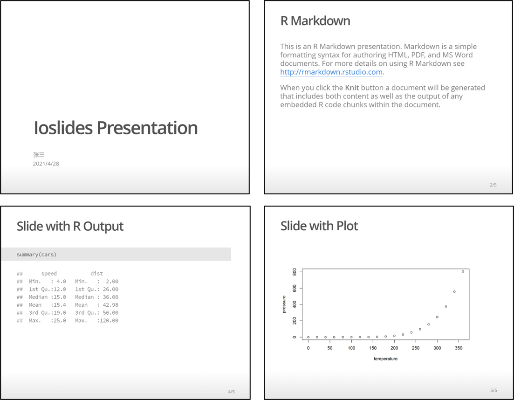
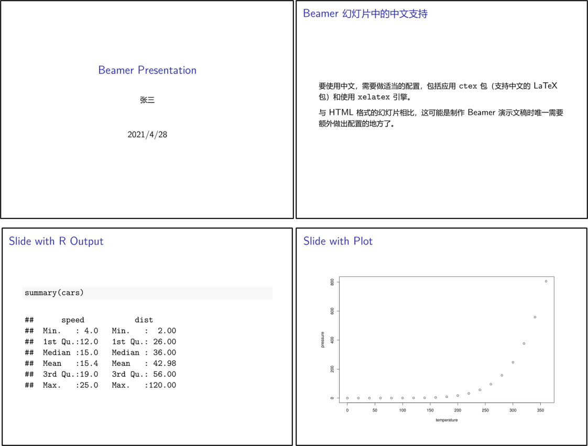

## 演示文稿 {#presentation}

本章讲述使用 R Markdown 生成演示文稿（俗称“PPT”）的技巧。

幻灯片可以被看做一个精简的文档，它的基本单位是单独的一页，每页含有标题、内容和其它元素。
R Markdown 文档可以直接输出为 HTML 或者 PDF 格式的幻灯片，并且可以通过额外的软件包丰富
幻灯片的具体样式。在这一部分，我们首先介绍 R Markdown 基础幻灯片的使用，然后介绍使用
`xaringan` 创建的更加精美的幻灯片。


### R Markdown 基础幻灯片 {#rmarkdown-basic-presentation}

使用基础幻灯片不需要安装额外的包。

R Markdown 支持 4 种不同样式的幻灯片，分别是 `ioslides`，`Slidy`，`Beamer` 和 PowerPoint。
在 RStudio 中，你可以通过菜单中的 “New File -> R Markdown...” 打开如下一个窗口（图 \@ref(fig:rmd-presentation-popup)），然后选择 “OK” 后即可新建一个幻灯片。

```{r rmd-presentation-popup, fig.width=6, fig.cap="新建 R Markdown 时可选的幻灯片格式"}
knitr::include_graphics("images/rmd-presentation-popup.png")
```

#### ioslides 幻灯片 {#ioslides-presentation}

我们首先看 ioslides 幻灯片。新建的幻灯片，也是一个 R Markdown 文档，在它的头部 YAML 中，
`output: ioslides_presentation` 设定了其输出格式。

```{r}
import_example("examples/ioslides-presentation.Rmd")
```


这个文档经过编译后，得到的幻灯片如图 \@ref(fig:ioslides-presentation-screenshot) 所示。
由此可见，在 R Markdown 幻灯片中，源文件中的 `##` 代表一张幻灯片的开头和标题，
`##` 后面的内容是这一张幻灯片中的内容。R Markdown 会自动将命令和输出的内容添加到幻灯片中。


```{r ioslides-presentation-screenshot, fig.cap="新建文件编译后生成的 ioslides 幻灯片"}

```

除了 `##`，使用 `---` 也能开始一张新的幻灯片，并最终生成一个不带标题的幻灯片。

另外，还可以通过 “|” 来为幻灯片添加副标题。例如下面的例子：

``` markdown
## Getting up | What I like to do first thing
```

##### 使用快捷键控制显示模式

ioslides 幻灯片支持以下快捷键更改播放时的模式：

- `'f'`：全屏模式，幻灯片将会占满屏幕。
- `'w'`：宽屏模式，幻灯片将会以宽屏模式显示。
- `'o'`：预览模式，幻灯片将会缩小并同时显示多个。
- `'h'`：启用代码高亮模式，突出显示指定的几行代码。具体使用方法下面介绍。
- `'p'`：显示演讲者备注，演讲者备注需要以指定的方式添加。具体使用方法下面介绍。

按下 `'Esc'` 键将会退出以上所有模式。

##### 依次显示列表中的项目

使用 `incremental` 选项可以控制列表项目依次出现，相当于添加了简单的播放动画。

```{r}
import_example("examples/ioslides-presentation-increment-bullets.Rmd")
```

为所有幻灯片添加这样的效果有时候显得有点过分，所以 R Markdown 还提供了针对个别幻灯片
添加依次呈现效果的方法，即在前面加上一个 `>` 号。

``` markdown
> - Bullet 1
> - Bullet 2
```

##### 可应用的视觉样式

- **幻灯片的大小**

在配置中使用 `widescreen` 可以将幻灯片样式改为宽屏。

```yaml
---
output:
  ioslides_presentation:
    widescreen: true
---
```

<!--- 
如果需要缩小部分文字，则可以使用下面的方法。

```markdown
## 这个标题将会小一点 {.smaller}
```

这种以大括号的形式在 R Markdown 标题上附加额外属性的方法是一种通用的方法。
其中的 `.smaller` 实际上是预定义的 CSS class。
-->

- **幻灯片播放速度**

ioslides 幻灯片翻页时会有淡入淡出的效果，使用 `transition` 可以控制效果的时长。
`transition` 设置为 `"default"`，`"slower"`，`"faster"`，或者一个以秒为单位的数字（如`0.5`）均可。如下所示：

```yaml
---
output:
  ioslides_presentation:
    transition: slower
---
```

- **依次显示幻灯片元素**

每一张幻灯片的标题都可以加上 `.build` 属性，这样幻灯片的内容在播放的时候将会一块块的依次显示出来。
这一点与 `incremental` 属性有些类似，不过后者针对的是列表中的项目，而前者针对的是
一段话，一整个列表。

``` markdown
## 下面的内容将会依次显示 {.build}

首先显示这一段话，然后才显示下面的列表。

- 这个列表中的项目并不会依次显示
- 而是会作为一个整体出现

接下来的列表，因为使用了 `>` 方法，其中的项目则可以依次出现。

> - 先出现这个
> - 然后才是这个
```

- **设置幻灯片的背景图像**

幻灯片中可以使用 `data-background` 添加背景图片，并使用其它的相关属性来
配置背景图片的行为，如 `data-background-size`， `data-background-position`，
`data-background-repeat` 等等。

```markdown
## 添加背景图像 {data-background=foo.png data-background-size=cover}
```


这些配置来自于 CSS 中图片的属性，`background`，`background-size`，`background-position`，
以及 `background-repeat` 等。你可能需要对 CSS 有所了解，才能准确把握这些属性的用途。

##### 自定义 CSS

ioslides 幻灯片本质是一个 HTML 文档，可以通过自定义 CSS 来设定幻灯片中不同元素的样式。

要在幻灯片中附加一个自定义样式表，可以使用 `css` 属性。

```yaml
---
output:
  ioslides_presentation:
    css: styles.css
---
```

为某一张幻灯片中添加样式的方式，也是通过大括号语法完成的。

```markdown
## Future Steps {#future-steps .emphasized}

这张幻灯片中的所有元素将会应用 CSS 定义的样式。
```

在 `style.css` 中，添加下列定义。

```css
#future-steps {
  color: blue;
}

.emphasized {
  font-size: 1.2em;
}
```

这种方式并不会影响幻灯片的标题，而是会影响这一张幻灯片中其它内容。
最终，这张幻灯片中所有的文字都会显示为蓝色、120% 的大字号。

##### 突出显示部分代码

为了强调关键代码的作用，可以使用特定的注释来高亮它们。例如：

```r
### <b>
x <- 10
y <- x * 2
### </b>
```

在播放时，当按下键盘上的快捷键 `'h'` 时，高亮的代码将会突出显示，其它部分的代码则会变淡。


##### 添加 LOGO

使用 `logo` 可以为幻灯片添加一个 LOGO 图片。默认情况下，这个 LOGO 将会以 85 x 85
像素显示在标题幻灯片上，并且缩小后显示在后面每一张幻灯片的左下角。

```yaml
---
output:
  ioslides_presentation:
    logo: logo.png
---
```

使用自定义的 CSS 可以修改首页 LOGO 的显示效果。例如：


```css
.gdbar img {
  width: 300px !important;
  height: 150px !important;
  margin: 8px 8px;
}

.gdbar {
  width: 400px !important;
  height: 170px !important;
}
```

左下角的 LOGO 显示样式同样可以使用 CSS 定义。例如：

```css
slides > slide:not(.nobackground):before {
  width: 150px;
  height: 75px;
  background-size: 150px 75px;
}
```

##### 幻灯片的布局

如果想居中显示幻灯片的内容，可以在标题后面加入 `.flexbox` 和 `.vcenter` 的属性。

```markdown
## 统统居中显示 {.flexbox .vcenter}
```

使用 CSS class 的方法为美化幻灯片非常灵活。但是在标题中应用样式不能精确到一张
幻灯片中的某个具体元素。因此要实现幻灯片的复杂布局，只能使用类似 HTML 的语法。

居中显示某一段文字，可以采用下面的语法。

```html
<div class="centered">
This text is centered.
</div>
```

如果要以左右两栏的形式展示某一张幻灯片中的内容，可以使用下面的语法[^note-column-2]。

```html
<div class="columns-2">
  

  - Bullet 1
  - Bullet 2
  - Bullet 3
</div>
```

[^note-column-2]: 在这里，左边图片的大小要合适，才能把列表项挤到右边去。

##### 文字颜色

使用 HTML 语法还可以修改其它的属性，比如文字的颜色。只需要将颜色以 CSS 类的形式赋值给元素即可。例如：

```html
<div class="red2">
This text is red
</div>
```

可用的颜色包括 `red`，`blue`，`green`，`yellow`，`grey`等，以及它们的变体如
`red2`，`blue3`，`green4`等等


<!--- 不可用
##### 放映模式
----->


##### 打印幻灯片

打印幻灯片可以在浏览器中进行，目前保真度最高的浏览器可能是 Google Chrome。
此外，使用 Chrome 中 “另存为 PDF” 的功能，还可以将幻灯片保存为一份 PDF 文档。

在 R 语言终端，使用 `pagedown::chrome_print()` 函数也可以完成这一操作（便于自动化和批处理）。
不过需要事先安装 **`pagendown`** 软件包[@R-pagedown]。

##### 其它功能

ioslides 幻灯片中，通用的 R Markdown 语法通常可用，包括 HTML 文档输出中的配置，
图片的属性设置，数学公式，数据库的打印，中间文件的保留，外部文档的引入等等。


#### Slidy 幻灯片 {#slidy-presentation}

[Slidy](https://www.w3.org/Talks/Tools/Slidy2/) 是 HTML 幻灯片的另一个规范。
要通过 R Markdown 创建一个 Slidy 幻灯片，只需要将文档输出设为 `slidy_presentation` 即可。

```{r}
import_example("examples/slidy-presentation.Rmd")
```


Slidy 幻灯片的内容设置基本与 ioslides 幻灯片相似，不过其默认样式与之有异。
一份 Slidy 幻灯片大体是这样的（图 \@ref(fig:slidy-presentation-screen-shot)）。

```{r slidy-presentation-screen-shot, fig.cap="Slidy 幻灯片"}
knitr::include_graphics("examples/slidy-presentation-screenshot.png")
```


##### 使用快捷键控制显示模式

Slidy 中也可以通过快捷键控制显示模式，不过其按键定义与 ioslides 不同。

- `'c'`：显示幻灯片目录。Slidy 会自动生成目录，默认可以通过点击页脚左下角的 “Contents” 访问。
- `'f'`：是否显示页脚的开关。
- `'a'`：显示全部幻灯片的开关。
- `'s'`：缩小字体大小。
- `'b'`：放大字体大小。

<!--- Text Size 部分的功能已经不可用 --->

##### 设置页脚内容

在 YAML 配置中使用 `footer` 可以为幻灯片设置页脚显示的内容。

```yaml
---
output:
  slidy_presentation:
    footer: "Copyright (c) 2021, Cosname"
---
```

使用 `duration` 还可以方便的在页脚添加一个计时器（单位为分钟）。

```yaml
---
output:
  slidy_presentation:
    duration: 45
---
```

##### 其它功能

Slidy 幻灯片继承了 HTML 文档中的多数功能，以及 ioslides 中的列表内容依次显示等功能。

<!-- 此处需要添加锚点链接 -->


#### Beamer 演示文稿 {#beamer-presentation}

[Beamer](https://www.overleaf.com/learn/latex/beamer) 是一个功能强大且灵活的 LaTeX 类，用于创建美观的演示文稿。

要从 R Markdown 创建 Beamer 演示文稿，只需要在 YAML 头文件中将输出格式设定为 `beamer_presentation` 即可。你可以使用一级标题 `#` 和二级标题 `##` 新建幻灯片
（使用 `---` 也可以创建一张新的没有标题的幻灯片）。例如：

```{r}
import_example("examples/beamer-presentation.Rmd")
```

Beamer 演示文稿编译后的文件是一个 PDF 文档，大概像下面这个样子（图 \@ref(fig:beamer-presentation-screenshot)）。

```{r beamer-presentation-screenshot, fig.cap="Beamer 演示文稿示例"}

```


##### Beamer 演示文稿的中文支持

如果要生成中文的 Beamer 演示文稿，参考 \@ref(PDF-document) 中的设置。


##### Beamer 演示文稿的主题

Beamer 支持多个幻灯片主题，在 R Markdown 中使用 `theme`，`colortheme` 和 `fonttheme` 设定。
例如：

```yaml
---
output:
  beamer_presentation:
    theme: "AnnArbor"
    colortheme: "dolphin"
    fonttheme: "structurebold"
---
```

这样，上面的幻灯片就会变成下面这个样子（图 \@ref(fig:beamer-presentation-theme)）。
这个主题为标题幻灯片添加了页眉和页脚，显示作者、主题、日期和页码等信息。


```{r beamer-presentation-theme,fig.cap="应用主题后的 Beamer 演示文稿"}
import_example_result("examples/beamer-presentation-theme.Rmd")
```

Beamer 支持数十个主题和颜色样式，在 [这里](https://hartwork.org/beamer-theme-matrix/) 可以查看可用的选项。


##### Beamer 幻灯片的边界

`slide_level` 参数用来指定一张幻灯片开始的位置。默认情况下，二级标题会被识别为一张幻灯片的开始，但是你可以将它改为其它的大纲等级。

```yaml
---
output:
  beamer_presentation:
    slide_level: 2
---
```

##### 其它功能

Beamer 演示文稿从 HTML 文档中继承了目录内容、图片属性、样式、数据框打印、组件、
模板、Pandoc 参数和分享等功能（参加 \@ref(html-document)），从 PDF 文档和
ioslides 演示文稿中继承了列表动画、保留 TeX 文件等功能（参见 \@ref(pdf-document), \@ref(ioslides-presentation)）。


#### PowerPoint 演示文稿 {#powerpoint-presentation}

<!-- 注：为避免混淆，把 presentation 称为“演示文稿”，把 slide 称为“幻灯片”。-->

要制作 PowerPoint 演示文稿，只需要将输出格式设置为 `powerpoint_presentation` 即可。
这需要满足 **rmarkdown** 版本 ≥ v1.9，Pandoc 版本 ≥ 2.0.5 的条件[^check-rmarkdown-version]。

[^check-rmarkdown-version]: 分别使用 `packageVersion('rmarkdown')` 和 `rmarkdown::pandoc_version()` 来查看 **rmarkdown** 和 Pandoc 的版本。


```{r}
import_example("examples/powerpoint-presentation.Rmd")
```


R Markdown 生成的 PowerPoint 演示文稿大概长这个样子（图 \@ref(fig:powerpoint-presentation-screenshot)）：

```{r powerpoint-presentation-screenshot, fig.cap="PowerPoint 演示文稿"}
knitr::include_graphics("examples/powerpoint-presentation.png")
```

PowerPoint 演示文稿采用的幻灯片标记与 Beamer 相同，默认为 3 级标题。
使用 `slide_level` 可以控制新建一张幻灯片所需要的大纲等级。
此外，使用 `---` 可以新建一张没有标题的幻灯片。
另外，R Markdown 中包括的图片和表格都会自动的被 放到一张新的幻灯片中。
也就是说，除了幻灯片的标题、图片/表格的标注之外，其它所有元素都不能与二者共存。
这一点与其它格式演示文稿的行为有明显不同。

一般情况下，PowerPoint 演示文稿中的图片会被自动缩放到适合幻灯片的大小。
如果自动缩放无效，那么对于静态图片可以使用 `width` 和 `height` 来分别设置，
例如：`{width=40%}`。
对于 R 语言生成的动态图形，则可以使用代码块的参数 `fig.width` 和 `fig.height` 来定义宽和高。

PowerPoint 幻灯片中可以使用的 Markdown 标记（参见 \@ref(markdown-syntax)）包括粗体、斜体，脚注，列表，LaTeX 数学表达式，
图片，表格等。


##### 两栏布局

正如 Beamer 演示文稿的高级应用需要借助于 LaTeX 语法一样，
PowerPoint 演示文稿的高级应用需要借助于对 Pandoc 的深入了解。
使用 Pandoc 的语法，可以设置一个多栏的布局（请参见 Pandoc 的用户手册）：

```markdown
:::::: {.columns}
::: {.column}
Content of the left column.
:::

::: {.column}
Content of the right column.
:::
::::::
```

##### 自定义模板

PowerPoint 演示文稿的模板可以用 `reference_doc` 来设置。
模板中的样式将会被应用到 R Markdown 生成的 PowerPoint 演示文稿中。

```yaml
---
title: "使用你喜欢的 PowerPoint 模板"
output:
  powerpoint_presentation:
    reference_doc: my-styles.pptx
---
```


##### 其它功能

PowerPoint 演示文稿从 HTML 文档中继承了目录内容、图片属性、样式、数据框打印、组件、
模板、Pandoc 参数和分享等功能（参加 \@ref(html-document)）。
目前并不支持列表中各个项目的播放效果。


### Xaringan 幻灯片 {#xaringan-presentation}

虽然 R Markdown 提供的基础幻灯片已经能够实现了基本的幻灯片功能，而且没有额外的学习成本，
但是，善于制作精良幻灯片的“忍者”通常使用一个额外的包来创建幻灯片，这个包的名字叫做 `xaringan`。


`xaringan` 这个名字来源于火影忍者中的写轮眼 "Sharingan" （图 \@ref(fig:sharingan-icon)）[^name-of-xaringan]。写轮眼有两大能力：

[^name-of-xaringan]: 把 "Sh" 换成了 "x" 是为了更易拼读。

- 洞察眼

- 催眠眼

其实做演示就是将自己的洞见传递给听众；好的演讲通常有催眠效果，因为它可以深度震撼人心[^audience-sleep]。

[^audience-sleep]: 糟糕的演讲也可以催眠听众，但显然这两种催眠完全不同。

```{r sharingan-icon, fig.cap="幻灯忍者：写轮眼", fig.width=2, fig.height=2}
knitr::include_graphics("images/xaringan-hex.png")
```

与其它工具相比，`xaringan` 创建的幻灯片样式更加精美，功能更加丰富，且具有高度的可定制性（图 \@ref(fig:xaringan-screenshot)）。

```{r xaringan-screenshot, fig.cap="`xaringan` 幻灯片的实例", out.width="49%"}
knitr::include_graphics("images/xaringan-scrennshot.png")
```


要创建“写轮眼”幻灯片，需要先安装 `xaringan` 包[@R-xaringan]）。

```{r install-xaringan, message=FALSE}
if (!requireNamespace("xaringan"))
  install.packages("xaringan")
```

安装完成之后，在 RStudio 中新建文件 R Markdown 文件时，在左侧选择 “From Template”即可。
