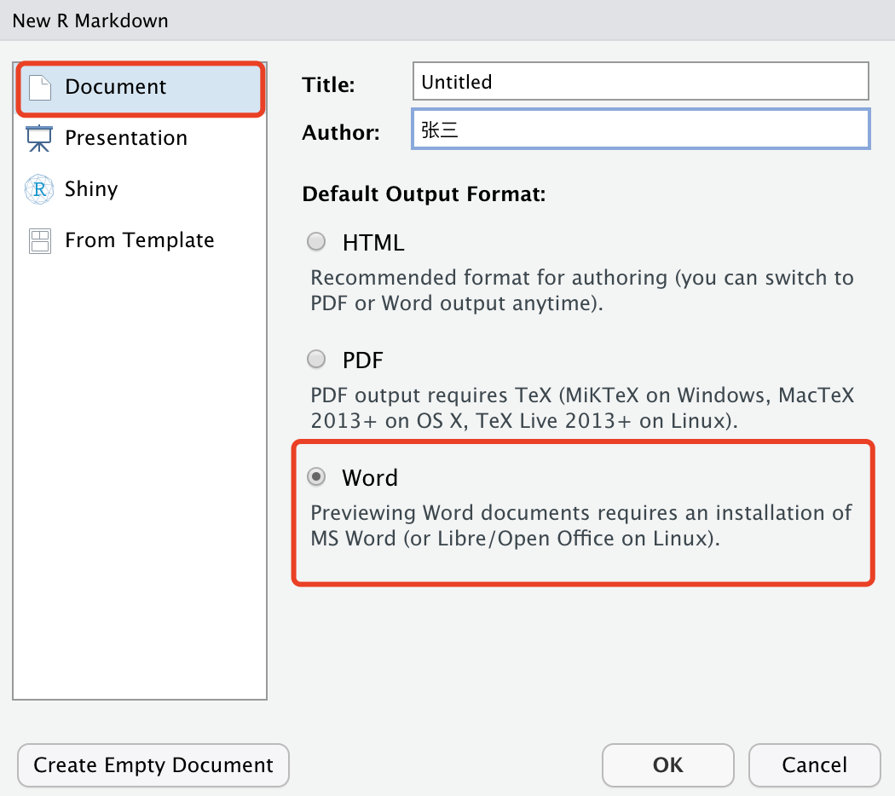

# Word {#word}

要从 R Markdown 生成 Word 文档，可以使用输出格式 `word_document`。如果希望在文档中包含交叉引用，可以考虑输出格式 `bookdown::word_document2`，详细说明可见[这](https://bookdown.org/yihui/rmarkdown-cookbook/cross-ref.html#cross-ref)。


```yaml
---
output:
  word_document: default
  bookdown::word_document2: default  # for cross-references
---
```

从我们的经验来看，关于 Word 输出的最常见问题是：

1. 如何将自定义 Word 模板应用于文档？

2. 如何在原始 R markdown 文件中纳入 Word 中所做的更改？

3. 如何更改单个文档元素的样式？

本章我们将对以上问题进行一一解答。

## 创建 word 模板  {#word-new-template}

在 Rstudio 中打开一个新的 R 脚本并选择 Ducument 中的 Word（图 \@ref(fig:word-new1)）。

```{r word-new1, echo=FALSE,fig.width=6,fig.align='center', fig.cap="新建 R Markdown 时可选的 word 格式"}

```

这时对应的 rmd 文档 YAML 文件为：

```yaml
---
title: "Untitled"
author: "张三"
date: "6/26/2021"
output: word_document
---
```

之后你就可以在这个模板下，将正文部分进行修改，并通过 **Knit** 进行编译。之后会跳出编译好的结果，通过你的系统默认应用打开。这就是基于 word 模板的工作流程。

## 自定义 Word 模板 {#word-template}

你可以将 Word 模板\index{template!Word} 文档中定义的样式应用到从 R Markdown 生成的新 Word 文档。 这种模板文档也称为“参考样式文档”。 

> **关键之处**：你必须先通过 Pandoc 创建此模板文档，再更改其中的样式定义。 然后将此模板的路径传递给 `word_document`\index{output option!reference\_docx} 的 `reference_docx` 选项，例如：


```yaml
---
output:
  word_document:
    reference_docx: "template.docx"
---
```

正如我们刚刚所说的， `template.docx` 文档必须从 Pandoc 生成。 你可以从具有 `word_document` 输出格式的任意 R Markdown 文档创建此模板（该文档的实际内容无关紧要，但它应该包含你想要设置样式的元素类型）。 然后打开`.docx` 文件，并编辑样式。

```{r, word-template-1, echo=FALSE,fig.width=6,fig.align='center', fig.cap='查找特定文档元素的样式。'}
knitr::include_graphics('images/word-template-1.png', dpi = NA)
```

图 \@ref(fig:word-template-1) 说明了你可以通过 Word 中的“主页”选项卡打开“样式”窗口。当你将光标移动到文档中的特定元素时，样式列表中的项目将被突出显示。如果你想修改任何类型元素的样式，可以单击突出显示项的下拉菜单，你将看到如图 \@ref(fig:word-template-2)  的对话框。


```{r, word-template-2, echo=FALSE, fig.cap=' 修改 Word 文档中元素的样式。', out.width='100%'}
knitr::include_graphics('images/word-template-2.png', dpi = NA)
```

修改完样式后，你可以保存文档（使用一个不会被意外覆盖的文件名），并将其作为以后 Word 文档的模板。 当 Pandoc 使用该参考模板，并渲染出新的 Word 文档时，它会读取模板中的样式并将它们应用到新文档中。

> 如果你想了解更多关于如何创建自定义样式 Word 模板的详细教程的话。你可以观看一段短视频 <https://vimeo.com/110804387>，或者阅读这篇文章 <https://rmarkdown.rstudio.com/articles_docx.html>。

有时，查找元素的样式名称并不简单，可能有多种样式应用于同一个元素，并且你只会在样式列表中看到其中一个突出显示。这时，你可能需要通过猜测或在线搜索才能确定你要修改的实际样式。例如：你需要点击“管理样式”按钮 （图\@ref(fig:word-template-1) 中样式列表底部从左到右的第三个按钮）。之后找到对应的样式并进行修改，例如，添加边框 （见图 \@ref(fig:word-table)）。

```{r, word-table, echo=FALSE, fig.cap='修改 Word 文档中的表格样式。',fig.width=6,fig.align='center'}
knitr::include_graphics('images/word-table.png', dpi = NA)
```

## R Markdown 和 Word 之间的双向工作流程 {#word-redoc}

虽然从 R Markdown\index{Word!port to and from Rmd} 生成 Word 文档很容易，但当其他人编辑 Word 文档并且你必须手动将更改移植回原始 R Markdown 时，事情会变得特别痛苦。幸运的是，Noam Ross 为这个问题提供了一个非常不错的解决方案。 **redoc** 包\index{R package!redoc} (https://github.com/noamross/redoc) 允许你生成和修改一个 Word 文档，并将修改后的 Word 文档转换回 R Markdown。 

> 注意，截至撰写本文时（2020 年 6 月），**redoc** 包仍处于测试阶段，并且作者已暂停开发。如果你想尝试一下，可以从 GitHub 安装这个包：

```r
remotes::install_github("noamross/redoc")
```

安装包后，在输出格式中加入 `redoc::redoc`:

```yaml
---
output: redoc::redoc
---
```

这种输出格式会生成一个 Word 文档，实际上存储的是原始 Rmd 文档，因此可以将 Word 文档转换回 Rmd。 Word 中的跟踪更改将转换为使用 CriticMarkup 语法\index{CriticMarkup} (http://criticmarkup.com) 编写的文本。 例如，`{++ important ++}` 表示在文本中插入“重要”一词。

你可以通过 `redoc::dedoc()` 函数将 `redoc::redoc` 生成的 Word 文档转换为 Rmd，例如 `redoc::dedoc("file.docx")` 会生成 `file.Rmd`。 在此过程中，你可以通过“track_changes”参数决定如何处理 Word 中的跟踪更改，例如，你可以接受或拒绝更改，或将跟踪更改转换为 CriticMarkup。 建议你使用 `track_changes = 'criticmarkup'` 以避免跟踪更改的永久丢失。

在编辑 Word 文档时，你应该编辑_不是_由 R Markdown 中的代码块或内联 R 表达式自动生成的部分。 例如，如果表是由代码块中的 `knitr::kable()` 自动生成的，则你不能编辑它，因为当你通过 `dedoc()` 将 Word 转换为 Rmd 时，此类更改将丢失。为避免意外编辑代码块的自动结果，你可以在 `redoc::redoc` 格式中将选项 `highlight_outputs` 设置为 `true`，这意味着自动输出的内容将在 Word 中突出显示（带有背景颜色）。 换句话说，就是告诉你的合作者，他们不应触碰 Word 文档中这些突出显示的部分。

> **注意**： **redoc** 包仍处于测试阶段，目前还不清楚它的未来，所以这里的介绍较为简短。如有疑问，建议你阅读 GitHub 上的文档。

## 个人风格元素 {#word-officedown}

由于 Markdown 的简单性，你可以将一些全局样式应用到 Word 文档中（参见 \@ref(word-template) 部分），但是对单个元素进行样式设置并不简单，例如：更改单词的颜色、段落居中。

为了在 R 中处理 Office 文档更加容易，David Gohel 于 2018 年开始开发 **officedown** 包\index{R package!officedown} [@R-officedown]，目的是在 R Markdown 中加入一些 **officer**\index{R package!officer} [@R-officer] 特性。 

> 在撰写本文时，该软件包原始版本已在 CRAN 上发布，但仍处于测试阶段。 

你可以从 CRAN 或 GitHub 安装它：

```r
# 通过 CRAN 来安装
install.packages("officedown")

# 或者通过 GitHub 安装
remotes::install_github("davidgohel/officedown")
```

安装包后，在 R Markdown 文档中通过以下代码加载它：

````md
```{r, setup, include=FALSE}`r ''`
library(officedown)
```
````

**officedown** 包中输出格式为 `rdocx_document`，默认情况下，是基于 `rmarkdown::word_document` 并具有其他一些功能，例如：样式表和绘图。该包还允许你通过 **officer** 包设置特定 Word 元素的样式。 例如，你可以通过 `officer::fp_text()` 函数 创建样式，并通过内联 R 表达式 `ftext()` 将样式应用于一段文本：

`r import_example('officer.Rmd')`

除了 **officer** 中的功能，**officedown** 还允许你使用一些特殊的 HTML 注释来执行 **officer** 任务。 例如，函数 `officer::block_pour_docx()` 可用于将外部 Word 文档\index{Word!import external} 导入当前文档，或者你可以使用 R Markdown 中的 HTML 注释：

```html
<!---BLOCK_POUR_DOCX{file: 'my-file.docx'}--->
```

这相当于内联 R 表达式：

```md
`r knitr::inline_expr("block_pour_docx(file = 'my-file.docx')")`
```

当然，通过使用 **officedown** 和 **officer** 包，你还可以进行其他操作：

- 插入分页符；

- 将内容放在多列布局中；

- 更改段落设置；

- 插入目录；

- 更改页面方向（横向或纵向）。

如果你想了解更多有关 **officedown** 的信息，可以通过以下文档 https://davidgohel.github.io/officedown/ 查阅信息。


