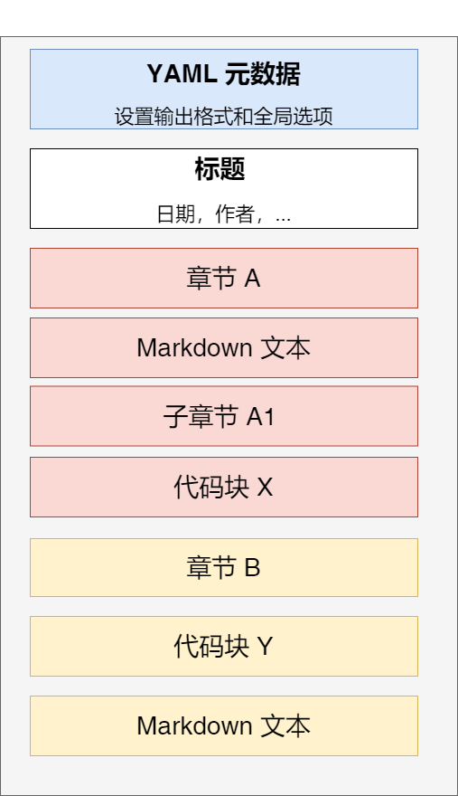
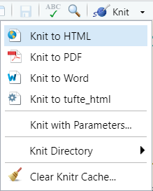
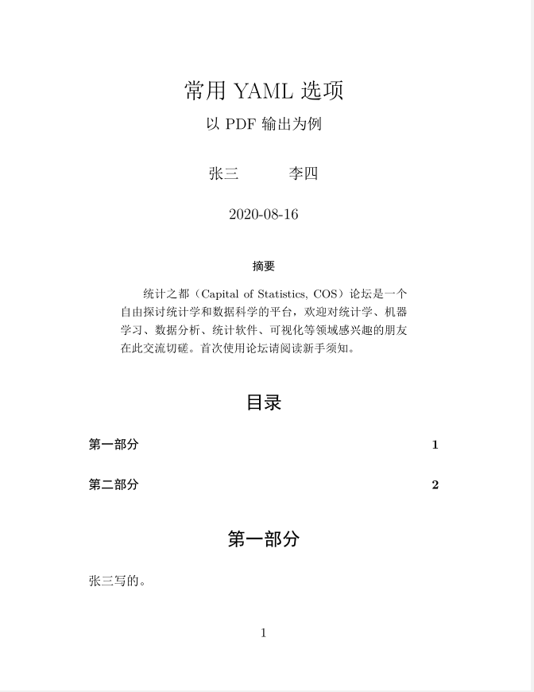
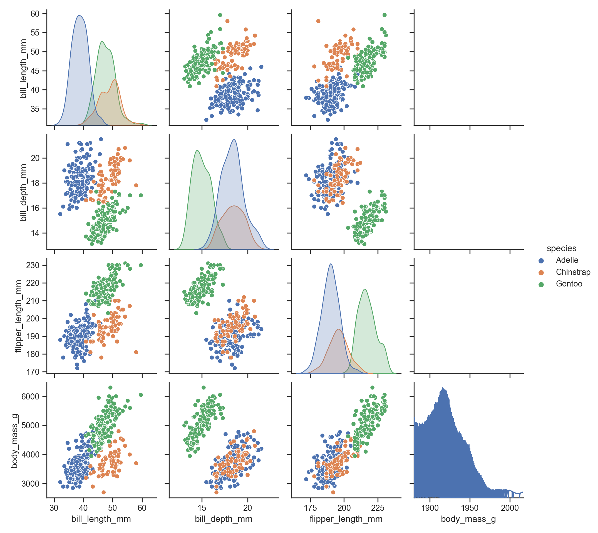
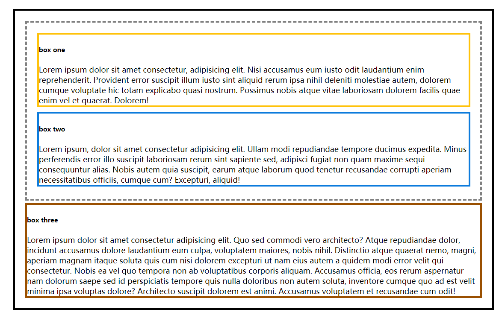
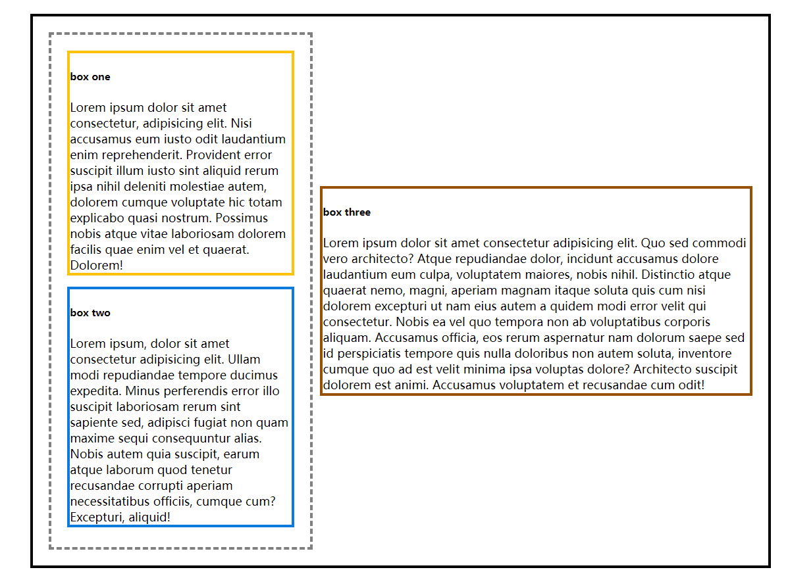
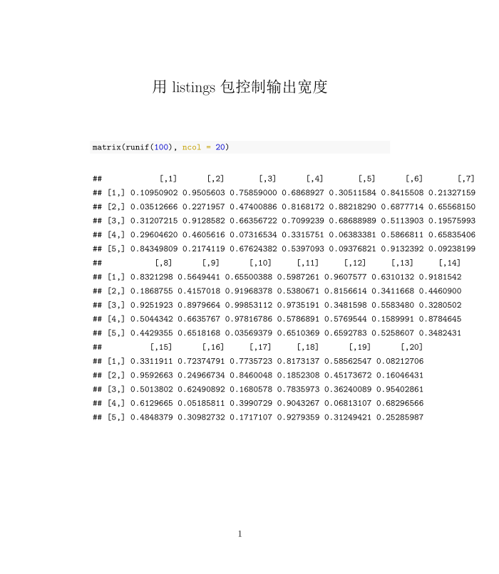
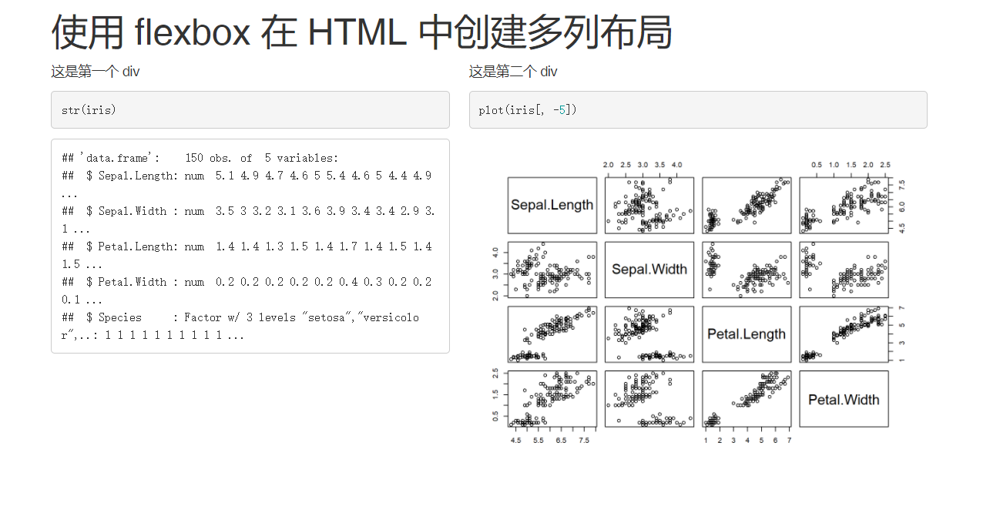
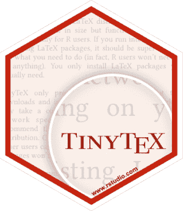
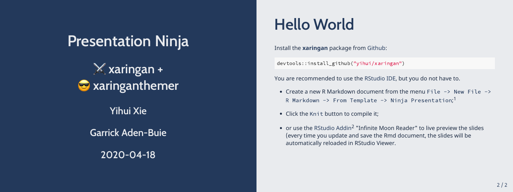

```{r include=FALSE, cache=FALSE}
set.seed(2021)
options(knitr.duplicate.label = "allow")
knitr::opts_chunk$set(
  fig.align = "center",
  warning = FALSE,
  message = FALSE
)
import_example <- function(file, lang = xfun::file_ext(file)) {
  x = xfun::read_utf8(xfun::magic_path(file))
  lang = tolower(lang)
  if (nchar(lang) > 1) {
    lang = sub('^r', '', lang)
    if (lang == 'nw') lang = 'tex'
  }
  knitr::asis_output(paste(c(sprintf("````%s", lang), x, "````"), collapse = '\n'))
}

import_example_result <- function(file, redo = FALSE, vwidth = 700, vheight = 400, ...){
  file <- xfun::magic_path(file)
  out <- rmarkdown::all_output_formats(file)
  if (is.null(out)) out = "html_document"
  if (length(out) == 1){
    webshot <- xfun::with_ext(file, "png")
  }
  if (length(out) > 1){
    webshot = xfun::with_ext(file, paste0(out,".png"))
  }

  if (all(xfun::file_exists(webshot))){ # if all output is exist
    fail <- tryCatch(png::readPNG(file), error = function(x) TRUE)
    outdate <- file.info(file)$mtime > file.info(webshot)$mtime
    if (fail | outdate) redo <- TRUE
  } else {
    redo <- TRUE
  }
  if (redo){
    for (i in 1:length(out)){
      fmt = out[[i]]
      outfile = webshot[[i]]

      if (fmt %in% c("pdf_document","beamer_presentation", "rticles::ctex", "bookdown::pdf_document2"))
        tryCatch(rmd_pdf_screenshot(file, fmt, outfile),
                 error = function(e)paste0("Failed to process ", file))

      if (fmt %in% c("html_document","ioslides_presentation","slidy_presentation", "prettydoc::html_pretty", "bookdown::html_document2"
      ))
        tryCatch(rmd_html_screenshot(file, fmt, outfile, vwidth=vwidth, vheight=vheight),
                 error = function(e)paste0("Failed to process ", file))

    }
  }
  tryCatch(knitr::include_graphics(webshot), error = function(e) paste0("unable to load png: ", webshot))
}

rmd_html_screenshot <- function(file, fmt = "html_document", outfile = xfun::with_ext(file, "png"), ...){
  cmd <- sprintf("rmarkdown::render('%s', '%s', quiet = TRUE)", file, fmt)
  ret <- xfun::Rscript(c("-e", shQuote(cmd)))
  if (ret != 0) stop(simpleError("Knit to HTML failed for document: ", file))
  url = xfun::with_ext(file, "html")
  html_screenshot(url, outfile, ...)
}

html_screenshot <- function(url, outfile = xfun::with_ext(url,"png"), ...){
  webshot::webshot(url, outfile, ...)
  return(outfile)
}

rmd_pdf_screenshot <- function(file, fmt = "pdf_document", outfile = xfun::with_ext(file, "png")){
  cmd <- sprintf("rmarkdown::render('%s', '%s', quiet = TRUE)", file, fmt)
  ret <- xfun::Rscript(c("-e", shQuote(cmd)))
  if (ret != 0) stop(simpleError("Knit to PDF failed for document: ", file))

  pdf = xfun::with_ext(file, "pdf")
  pdf_screenshot(pdf, outfile)

}

pdf_screenshot <- function(pdf, outfile = xfun::with_ext(pdf, "png")){
  content = magick::image_read_pdf(pdf, pages = 1)
  magick::image_write(content, outfile)
  return(outfile)
}

use_examples <- function(names, dir = "exmaples", open_path = NULL) {
  rmd_paths <- paste0("examples", "/", names, ".Rmd")
  text <- "---\ntitle: 'Untitled'\noutput: html_document \n---\n"
  for (p in rmd_paths) {
    writeLines(text, p)
  }
  if (is.null(open_path)) {
    open_path <- rmd_paths[1]
  } else {
    open_path <- paste0("examples/", open_path, ".Rmd")
  }
  if (rstudioapi::isAvailable() && rstudioapi::hasFun("navigateToFile")) {
    rstudioapi::navigateToFile(open_path)
  }
  else {
    utils::file.edit(open_path)
  }
  invisible(open_path)
}
```

# 前言 {-}

```{r, setup, include=FALSE}
if (knitr::is_html_output()) {
  # ignore percentage widths for HTML output, unless they are used for multiple
  # figures side by side
  knitr::opts_hooks$set(out.width = function(options) {
    if (options$fig.show != 'hold' && grepl('%$', options$out.width))
      options$out.width = NULL
    options
  })
}

options(bookdown.post.latex = function(x) {
  # substitute nonbreaking spaces in \texttt{} with normal spaces
  m = gregexpr('\\\\texttt\\{[^}]+}', x)
  regmatches(x, m) = lapply(regmatches(x, m), function(z) {
    gsub('\\\\ ', ' ', z)
  })

  # fix syntax highlighting:
  # \FunctionTok{tufte:}\AttributeTok{:tufte_html: default} ->
  # \FunctionTok{tufte::tufte_html:}\AttributeTok{ default}
  x = gsub('(\\\\AttributeTok\\{[^:]+:)(})(\\\\FunctionTok\\{)(:[^:]+:)', '\\1\\4\\2\\3', x)
  if (length(i <- grep('^\\\\begin\\{longtable\\}', x)) == 0) return(x)
  i1 = bookdown:::next_nearest(i, which(x == '\\toprule'))
  i2 = bookdown:::next_nearest(i, which(x == '\\endfirsthead'))
  x[i1 - 1] = paste0(x[i1 - 1], '\n\\begin{tabular}{', gsub('[^lcr]', '', gsub('.*\\[]', '', x[i])), '}')
  x[i] = '\\begin{table}'
  x[x == '\\end{longtable}'] = '\\end{tabular}\n\\end{table}'
  x[x == '\\endhead'] = ''
  x = x[-unlist(mapply(seq, i1, i2, SIMPLIFY = FALSE))]
  x
})

options(tinytex.verbose = TRUE)
```

<!--chapter:end:index.Rmd-->

```{r include=FALSE, cache=FALSE}
set.seed(2021)
options(knitr.duplicate.label = "allow")
knitr::opts_chunk$set(
  fig.align = "center",
  warning = FALSE,
  message = FALSE
)
import_example <- function(file, lang = xfun::file_ext(file)) {
  x = xfun::read_utf8(xfun::magic_path(file))
  lang = tolower(lang)
  if (nchar(lang) > 1) {
    lang = sub('^r', '', lang)
    if (lang == 'nw') lang = 'tex'
  }
  knitr::asis_output(paste(c(sprintf("````%s", lang), x, "````"), collapse = '\n'))
}

import_example_result <- function(file, redo = FALSE, vwidth = 700, vheight = 400, ...){
  file <- xfun::magic_path(file)
  out <- rmarkdown::all_output_formats(file)
  if (is.null(out)) out = "html_document"
  if (length(out) == 1){
    webshot <- xfun::with_ext(file, "png")
  }
  if (length(out) > 1){
    webshot = xfun::with_ext(file, paste0(out,".png"))
  }

  if (all(xfun::file_exists(webshot))){ # if all output is exist
    fail <- tryCatch(png::readPNG(file), error = function(x) TRUE)
    outdate <- file.info(file)$mtime > file.info(webshot)$mtime
    if (fail | outdate) redo <- TRUE
  } else {
    redo <- TRUE
  }
  if (redo){
    for (i in 1:length(out)){
      fmt = out[[i]]
      outfile = webshot[[i]]

      if (fmt %in% c("pdf_document","beamer_presentation", "rticles::ctex", "bookdown::pdf_document2"))
        tryCatch(rmd_pdf_screenshot(file, fmt, outfile),
                 error = function(e)paste0("Failed to process ", file))

      if (fmt %in% c("html_document","ioslides_presentation","slidy_presentation", "prettydoc::html_pretty", "bookdown::html_document2"
      ))
        tryCatch(rmd_html_screenshot(file, fmt, outfile, vwidth=vwidth, vheight=vheight),
                 error = function(e)paste0("Failed to process ", file))

    }
  }
  tryCatch(knitr::include_graphics(webshot), error = function(e) paste0("unable to load png: ", webshot))
}

rmd_html_screenshot <- function(file, fmt = "html_document", outfile = xfun::with_ext(file, "png"), ...){
  cmd <- sprintf("rmarkdown::render('%s', '%s', quiet = TRUE)", file, fmt)
  ret <- xfun::Rscript(c("-e", shQuote(cmd)))
  if (ret != 0) stop(simpleError("Knit to HTML failed for document: ", file))
  url = xfun::with_ext(file, "html")
  html_screenshot(url, outfile, ...)
}

html_screenshot <- function(url, outfile = xfun::with_ext(url,"png"), ...){
  webshot::webshot(url, outfile, ...)
  return(outfile)
}

rmd_pdf_screenshot <- function(file, fmt = "pdf_document", outfile = xfun::with_ext(file, "png")){
  cmd <- sprintf("rmarkdown::render('%s', '%s', quiet = TRUE)", file, fmt)
  ret <- xfun::Rscript(c("-e", shQuote(cmd)))
  if (ret != 0) stop(simpleError("Knit to PDF failed for document: ", file))

  pdf = xfun::with_ext(file, "pdf")
  pdf_screenshot(pdf, outfile)

}

pdf_screenshot <- function(pdf, outfile = xfun::with_ext(pdf, "png")){
  content = magick::image_read_pdf(pdf, pages = 1)
  magick::image_write(content, outfile)
  return(outfile)
}

use_examples <- function(names, dir = "exmaples", open_path = NULL) {
  rmd_paths <- paste0("examples", "/", names, ".Rmd")
  text <- "---\ntitle: 'Untitled'\noutput: html_document \n---\n"
  for (p in rmd_paths) {
    writeLines(text, p)
  }
  if (is.null(open_path)) {
    open_path <- rmd_paths[1]
  } else {
    open_path <- paste0("examples/", open_path, ".Rmd")
  }
  if (rstudioapi::isAvailable() && rstudioapi::hasFun("navigateToFile")) {
    rstudioapi::navigateToFile(open_path)
  }
  else {
    utils::file.edit(open_path)
  }
  invisible(open_path)
}
```
# (PART) 基础 {.unnumbered}

# 认识 R Markdown {#know-rmarkdown}

**rmarkdown** [@R-rmarkdown] 一个是 R 语言的扩展包，提供了以 `.Rmd` 文件格式为中心的数据科学写作框架。它的核心思想是创作包含文本和代码的动态文档，让数据与叙事并进，最终提供易重复，易共享的数据分析环境。

本章从 R Markdown 的应用开始，遴选了不同场合 R Markdown 的用例和解决的问题。包括撰写数据分析报告，发表电子书，设计数据驱动的个人简历，建立个人网站，创作演示文档和交互报表。最后回顾了 R Markdown 渊源的历史发展。话不多说，我们在以下各小节中快速浏览一些 R Markdown 文档的用例，它们有些直接基于原生的 R Markdown 包，有些来自 R Markdown 的扩展包。越来越多的扩展为 R Markdown 文档增加了新的输出格式，为生态体系提供了更丰富的功能覆盖。读者可以挑选自己最感兴趣的使用场合深入后面对应章节的阅读，也可以在 [Github](https://github.com) 上以 R Markdown 为关键词探索各式各样的输出格式。


## 数据分析报告

从诞生开始，R 便是一门致力于交互式数据分析的语言，R 的用户便时常有着制作数据分析报告的需求，这也是 R Markdown 最常见基础的用途。它支持 HTML, PDF, Word, EPUB 等多种输出格式以及与之配套开箱即用的主题系统。用户可以将创作重心放在内容上，写作完成后一键输出不同格式，让 R Markdown 的自动化的编译机制代劳形式上的调整。例如，以下 HTML，PDF 和 Word 三种格式的文档是用同一个 R Markdown 生成的。


```{r, fig.show = "hold", out.width = "30%", echo = FALSE}
knitr::include_graphics(paste0("images/", c("01-html-output.png", "01-pdf-output.png", "01-word-output.png")))
```

除了多样的输出格式外，R Markdown 驱动的数据分析报告还解决了很多数据分析报告写作中的痛点：

- 之前在使用 R 或者其他数据分析工具时，经常需要在 Word 里写结论，在脚本里敲代码，在图表区生成图，将它们复制粘贴到一起后，还要操心格式问题，有没有什么自动化的方法？

- 我的工作需要日常性的数据产出，如何创作一篇参数化、可复用的文档模板，从此可以在更新数据的同时同步结论和图表？

- 如何确保分析过程和结论是可重复的，别人是否能利用同样的数据得到我的结论？

- 我不了解网页开发，如何在报告中插入可交互的图表和网页元素？

同时，R Markdown 还为 R 语言之外的几十种编程语言提供了一定程度的支持，例如 Python，C++，Julia，Bash，SQL 等，这意味着我们可以在一篇报告中混用多个工具。Python 作为数据分析师的另一大利器，在 **reticulate** 包 [@R-reticulate] 的帮助下可以流畅地与 R 代码在 R Markdown 文档中并用。下面的例子中，我们先用 R 导入数据并作数据预处理，随后将 R 中的数据传递框到 Python 环境中，生成 **pandas** 格式的 `DataFrame`, 并用 **seaborn** 包作可视化。

```{r}
# R 部分: 导入和预处理美国各州犯罪数据
arrests <- datasets::USArrests
arrests$State <- rownames(arrests)
```

```{python}
# Python 部分，导入 R 数据，提取谋杀率最高的 10 个州，并用 seaborn 包作柱形图
import pandas as pd
import seaborn as sns

top_states = r.arrests\
  .sort_values(["Murder"], ascending = False)\
  .head(10)

sns.barplot(x = "Murder", y = "State",  data = top_states)
```

我们在 \@ref(basic-other-languages) 节给出了在数据分析项目中混用 SQL，R 和 Python 的例子，并在 \@ref(other-languages) 中详细讨论了如何在 R Markdown 中结合其他编程语言。

当读者需要创作更大篇幅的文档甚至书籍时，我们可能不希望仅使用一篇 R Markdown 文档组织全部内容。**bookdown** 包 [@R-bookdown] 可以让用户将内容分散到多个 R Markdown 文档中，在编译时合成各文档便提供更适于书籍和在线文档的输出格式。此外，bookdown 对 R Markdown 的扩展还包括支持交叉引用，定理公式环境，文献引用等。bookdown 的输出结果非常适合用于制作在线教材与讲义，例如北京大学李东风老师的[《R 语言教程》](https://www.math.pku.edu.cn/teachers/lidf/docs/Rbook/html/_Rbook/index.html)，本书的在线版本也是用 bookdown 生成的。[bookdown.org](https://bookdown.org/home/) 列出了更多 bookdown 制作的在线书籍。

```{r bookdown-chinese-demo, fig.cap = "使用 bookdown 制作的中文图书范例, 一个章节对应一个 R Markdown 文档", echo = FALSE}
knitr::include_graphics("images/01-bookdown-chinese.png")
```

在学术报告或论文的撰写中，用户可能对格式有更细致的要求。越来越多的包提供了易用的 R Markdown 模板，为我们免去了繁杂的手动格式调整，编译后即可直接投稿。**rticles** 包 [@R-rticles] 提供了很多期刊和出版商的模板文档，例如 R Journals 和 Journals of Statistical Software。中文用户可能较常用 rticles 提供的 CTeX 输出格式，它让 R Markdown 输出的 PDF 可以正常显示中文字符。


## 交互笔记本 {#rmd-notebook}

R Markdown 及 bookdown 文档可运行代码，格式化长篇文本，插入 LaTeX 数学环境，支持交叉引用，特别适合统计，数据科学，计算机科学等领域的学生，研究人员和爱好者们作为首选的笔记本格式。

```{r notebook-preview, echo = FALSE, fig.cap = "RStudio 支持实时预览 R Markdown 笔记本格式"}
knitr::include_graphics("images/01-notebook-preview.png")
```
如图 \@ref(fig:notebook-preview) 所示，R Markdown 笔记本支持插入代码，保存它们的运行结果，添加格式化文本和批注等功能。R Markdown 的交互特性让学习记录变得十分自然：我们添加一段代码，运行后得到预料之中/意想不到的图片，或许随后在下面的多个代码段中反复调整某个参数，直至得到想要的结果。在此过程中我们发现了更多相关的包/模组，写下对不同模组的总结，并链接网络上其他人的用例，甚至开始撰写自动化脚本。最后，我们可以一键生成包含了这一系列思考和学习过程的 HTML，PDF 精美文档。图 \@ref(fig:notebook-preview) 是一个 PDF 笔记文档示例。

```{r notebook-preview2, echo = FALSE, fig.cap = "用 R Markdown 生成 PDF 学习笔记"}
knitr::include_graphics("images/01-notebook-preview2.jpg")
```

即便我们的工作不涉及数据处理或运行代码，使用 R Markdown 作为笔记软件也有许多好处。我们可以流畅的使用版本控制工具，管理笔记依赖的数据，图片的资源。我们可以将长篇笔记拆分为多个源文档，用纯文本文件管理输出设置，形成清晰的项目结构。[RPubs](https://rpubs.com/) 和 [bookdown](https://bookdown.org/) 等平台提供了免费的 R Markdown 文档发布服务，我们可以发布自己的笔记与心得，便利他人和未来的自己。


## 个人简历

一些 R Markdown 扩展包提供了适用于个人简历和 CV 的输出格式。例如基于 **pagedown** 包 [@R-pagedown]  的[简历模板](https://pagedown.rbind.io/html-resume)，和 [vitae](https://pkg.mitchelloharawild.com/vitae/) 下多种 CV 模板。

除了使用模板外， R Markdown 还能让你的简历变得更加“数据驱动”。[datadrivencv](http://nickstrayer.me/datadrivencv/) 包把简历中的各项教育背景，工作经历和项目经验等视作电子表格中的一条记录，我们可以仅维护这张数据表，R Markdown 负责简历的格式。除此之外，还可以插入 R 代码生成的交互图表，让我们的简历动起来。图 \@ref(ns-cv) 是 datadrivencv 包的作者 Nick Strayer 结合 **pagedown** 包 [@R-pagedown] 制作的个人简历。

```{r ns-cv, echo = FALSE, fig.cap = "(ref:ns-cv)"}
knitr::include_graphics("images/01-resume.png")
```

(ref:ns-cv) [Nick Strayer](http://nickstrayer.me/)用 datadrivencv 和 pagedown 包制作的 CV 示意


## 网站

原生的 R Markdown 包内置了生成简单静态网站的功能。简单来说，我们在一个 `yaml` 文件通过键值对定义网站的标题，导航栏，页面结构等元数据，而后创建几个 R Markdown 文档在其中填充内容，内置的站点生成器将每个 R Markdown 文档渲染为一个 HTML 页面输出。

```{r, echo = FALSE, fig.cap = "用 R Markdown 创建网站"}
knitr::include_graphics("images/01-rmarkdown-wbesite.png")
```

为满足创建更加复杂且精美的网站的需求，**blogdown** 包使用了第三方的开源静态网站生成器：Hugo。Hugo 是目前最快，最受欢迎的静态网站生成器之一，一般用户通常需要用命令行的方式与之交互。作为幸福的 R 用户，我们可以在 R Markdown 文档中写作，随后调用 blogdown 中封装好的函数操作 Hugo 的编译功能，最后生成网站。

```{r hugo-themes, fig.cap = "blogdown 包可以使用 Hugo 主题", echo = FALSE}
knitr::include_graphics("images/01-hugo-themes.png")
```

包如其名，对个人用户来说，blogdown 特别适合制作博客类的个人网站。借用免费的域名，读者可以展示个人项目，存放简历和 CV，归档学习笔记和心得，求职时为自己添加一份切实的筹码。除此之外，我们还可以用 blogdown 。Hugo 的[主题列表](https://themes.gohugo.io/) 列出了丰富的网站模板，其中大部分均可以在 blogdown 中一键生成。最后，我们给出几个不同主题的 blogdown 网站的样例

- Rob J Hyndman 的[个人网站](https://robjhyndman.com/)


- Alison Hill 的[个人网站](https://alison.rbind.io/)

- 《现代统计图形》的[图书主页](https://msg2020.pzhao.org/)


## 幻灯片

R Markdown 和扩展包支持输出多种常见的幻灯片格式，例如 PowerPoint，Beamer，isoslides 和 Slidy 等。除此之外，我们特别推荐读者关注 **xaringan** [@R-xaringan] 包，它基于 JavaScript 中的 remark.js 库设计了灵活的输出方案。默认的模板，了解 css 和一定 JavaScript 的读者还可以在此基础上设计出炫酷的演示文档。**xaringanExtra** 包在此基础上提供了更多有趣的增强插件。读者可以在 <https://slides.yihui.org/xaringan/#1> 和 <https://pkg.garrickadenbuie.com/xaringanExtra/#/> 看到更多例子。

```{r xaringan, out.width="49%", fig.show = "hold", fig.cap = "xaringan 提供的幻灯片模板示意", echo = FALSE}
knitr::include_graphics(c("images/01-xaringan1.png", "images/01-xaringan2.png"))
```


## 交互报表

报表是一种常见的商业报告形式，用 R Markdown 开发报表不仅能将分析过程与商业结论天然结合地在一起，还能利用 R 语言强大的图表功能。**flexdashboard** [@R-flexdashboard] 包基于 HTML 格式提供了这类报表的模板，还内置了一些 HTML 组件作为常见报表元素， 例如指标盒，增长仪表，导航栏等。

```{r flexdashboard, echo = FALSE, fig.cap = "用 flexdashboard 包制作的仪表板"}
knitr::include_graphics("images/01-flexdashboard.png")
```

除初次开发上的简便外，R Markdown 生态系统还提供了丰富的测试，部署，自动化和持续集成功能，确保我们的数据产品可以快速投入生产。

## 动态文档

除了直接的界面写作外，我们还可以调用输出 API `rmarkdown::render` 生成结果文档，并可以控制 R Markdown 输出时使用的数据源。这让 R Markdown 的自动化批量生产成为可能。一个典型场景是：数据库每日更新全国销售数据，而数据分析师用自动化脚本控制 R Markdown 分地区，分职务地生成多个针对各负责人的报表。这样的动态文档是通过参数实现的，我们在源文档中使用参数的名字，而不是具体的数据。随后在脚本中用 `rmarkdown::render` 动态传入当日的数据。


```{r dynamic-document, fig.cap = "根据 Shiny 输入动态生成 R Markdown 文档", echo = FALSE}
knitr::include_graphics("images/01-dynamic-document.jpg")
```

图 \@ref(fig:dynamic-document) 是一个结合 Shiny 动态生成 R Markdown 输出文档的例子。我们允许用户上传某个数据集，挑选需要数据清理的维度，随后把清理结果动态地传递给 `rmarkdonw::render`，生成右侧截图所示的输出文档。


## R Markdown 的渊源与历史

本节回顾了 R Markdown 在技术工具层面的渊源和它的发展历史。喜欢直接进入实际操作部分的读者可以跳过本节，从第 \@ref(installation) 章开始。如果读者已经掌握了 R Markdown 的基础知识，书写过一些 R Markdown 的文档, 也可以直接开始阅读第 \@ref(document) 章，了解定制不同输出格式的细节。


<!--chapter:end:01-intro.Rmd-->

```{r include=FALSE, cache=FALSE}
set.seed(2021)
options(knitr.duplicate.label = "allow")
knitr::opts_chunk$set(
  fig.align = "center",
  warning = FALSE,
  message = FALSE
)
import_example <- function(file, lang = xfun::file_ext(file)) {
  x = xfun::read_utf8(xfun::magic_path(file))
  lang = tolower(lang)
  if (nchar(lang) > 1) {
    lang = sub('^r', '', lang)
    if (lang == 'nw') lang = 'tex'
  }
  knitr::asis_output(paste(c(sprintf("````%s", lang), x, "````"), collapse = '\n'))
}

import_example_result <- function(file, redo = FALSE, vwidth = 700, vheight = 400, ...){
  file <- xfun::magic_path(file)
  out <- rmarkdown::all_output_formats(file)
  if (is.null(out)) out = "html_document"
  if (length(out) == 1){
    webshot <- xfun::with_ext(file, "png")
  }
  if (length(out) > 1){
    webshot = xfun::with_ext(file, paste0(out,".png"))
  }

  if (all(xfun::file_exists(webshot))){ # if all output is exist
    fail <- tryCatch(png::readPNG(file), error = function(x) TRUE)
    outdate <- file.info(file)$mtime > file.info(webshot)$mtime
    if (fail | outdate) redo <- TRUE
  } else {
    redo <- TRUE
  }
  if (redo){
    for (i in 1:length(out)){
      fmt = out[[i]]
      outfile = webshot[[i]]

      if (fmt %in% c("pdf_document","beamer_presentation", "rticles::ctex", "bookdown::pdf_document2"))
        tryCatch(rmd_pdf_screenshot(file, fmt, outfile),
                 error = function(e)paste0("Failed to process ", file))

      if (fmt %in% c("html_document","ioslides_presentation","slidy_presentation", "prettydoc::html_pretty", "bookdown::html_document2"
      ))
        tryCatch(rmd_html_screenshot(file, fmt, outfile, vwidth=vwidth, vheight=vheight),
                 error = function(e)paste0("Failed to process ", file))

    }
  }
  tryCatch(knitr::include_graphics(webshot), error = function(e) paste0("unable to load png: ", webshot))
}

rmd_html_screenshot <- function(file, fmt = "html_document", outfile = xfun::with_ext(file, "png"), ...){
  cmd <- sprintf("rmarkdown::render('%s', '%s', quiet = TRUE)", file, fmt)
  ret <- xfun::Rscript(c("-e", shQuote(cmd)))
  if (ret != 0) stop(simpleError("Knit to HTML failed for document: ", file))
  url = xfun::with_ext(file, "html")
  html_screenshot(url, outfile, ...)
}

html_screenshot <- function(url, outfile = xfun::with_ext(url,"png"), ...){
  webshot::webshot(url, outfile, ...)
  return(outfile)
}

rmd_pdf_screenshot <- function(file, fmt = "pdf_document", outfile = xfun::with_ext(file, "png")){
  cmd <- sprintf("rmarkdown::render('%s', '%s', quiet = TRUE)", file, fmt)
  ret <- xfun::Rscript(c("-e", shQuote(cmd)))
  if (ret != 0) stop(simpleError("Knit to PDF failed for document: ", file))

  pdf = xfun::with_ext(file, "pdf")
  pdf_screenshot(pdf, outfile)

}

pdf_screenshot <- function(pdf, outfile = xfun::with_ext(pdf, "png")){
  content = magick::image_read_pdf(pdf, pages = 1)
  magick::image_write(content, outfile)
  return(outfile)
}

use_examples <- function(names, dir = "exmaples", open_path = NULL) {
  rmd_paths <- paste0("examples", "/", names, ".Rmd")
  text <- "---\ntitle: 'Untitled'\noutput: html_document \n---\n"
  for (p in rmd_paths) {
    writeLines(text, p)
  }
  if (is.null(open_path)) {
    open_path <- rmd_paths[1]
  } else {
    open_path <- paste0("examples/", open_path, ".Rmd")
  }
  if (rstudioapi::isAvailable() && rstudioapi::hasFun("navigateToFile")) {
    rstudioapi::navigateToFile(open_path)
  }
  else {
    utils::file.edit(open_path)
  }
  invisible(open_path)
}
```

# 安装 {#installation}


本章介绍安装 R Markdown 相关依赖包的方法，并编译第一个 R Markdown 源文档，输出为 HTML 和 PDF 两种格式。


## 安装 R Markdown

编译 R Markdown 文档需要安装 **rmarkdown** [@R-rmarkdown] 包，在 RStudio 的控制台中运行

```{r, eval = FALSE}
install.packages("rmarkdown")
```

后文经常谈到的 "R Markdown 如何如何" 泛指 rmarkdown 包及一系列相关工具的功能与使用，如果特指 `rmarkdown` 包的功能或函数，则用小写字母。

中国大陆的读者可能有下载速度过慢的问题，这时可以在 RStudio 的 `Tools --> Global Options --> Packages` 将 Primary Cran Repository 更改为国内的镜像。也可以在 `install.packages` 中设置 `repos` 参数。

```{r, eval = FALSE}
install.packages("rmarkdown", repos = <镜像网址>)
```


## 创建第一个 R Markdown 文档 {#create-first-rmd}

安装完成后，我们可以开始创建第一个 R Markdown 文档。在 RStudio 中选择 `File --> New File --> R Markdown`, 弹出图 \@ref(fig:rmd-prompt) 所示的提示框。

```{r rmd-prompt, echo = FALSE, fig.cap = "RStudio 创建 R Markdown 文档时的提示框"}
knitr::include_graphics("images/02-first-rmd-prompt.png")
```

我们在窗口中可以提前设定输出文档的标题，作者和格式。这里，我们保留默认设置，点击 OK 即可。

随后，RStudio 编辑器内生成了如下内容：

`r import_example("first-rmd.Rmd")`

在编辑器内保存该文件，我们可以发现根目录下增加了 `first-rmd.Rmd` 文件，这种后缀为 `.Rmd` 的文件即是 R Markdown 的源文档。在源文件中，我们定义了 R Markdown 输出文件的形式和内容。本书后续章节对文本和代码的编辑以及日常使用均是围绕类似这样的源文档展开的。

点击源文档顶部的 **Knit** 按钮，RStudio 首先提示应保存源文档，读者可以在不更改 `.Rmd` 文件后缀的情况下任意选择保存名称, 但最好不要包含中文。保存后，R Markdown 包开始将源文档编译为输出。几秒后弹出以下界面说明编译成功，同时 R Markdown 包安装无误，可以开始快乐的写作了。

```{r first-rmarkdown, echo = FALSE, fig.cap = "first-rmd.Rmd 文件输出的 HTML 文档"}
import_example_result("first-rmd.Rmd")
```


图 \@ref(fig:first-rmarkdown) 为我们新创建的 `first-rmd.Rmd` 文件的 HTML 格式输出结果。此时，与该 R Markdown 源文件同级目录下也应该出现一个 `first-rmd.html` 文件，读者可以用浏览器打开该 HTML 验证是否与 RStudio 面板中输出的结果一致。

一些读者可能会疑惑，之前点击 Knit 时，为什么我们没有用 `library(rmarkdown)` 导入 `rmarkdown` 包，也没有在源文档中运行相关的函数，编译仍能成功呢？当我们点击 Knit 的时候，RStudio 自行调用了 rmarkdown 包中的 `render()` 函数。

```{r, eval = FALSE}
# 第一个参数为你保存的文件名
rmarkdown::render("first-rmd.Rmd", output_format = "html_document")
```

读者不妨自己在控制台内运行一遍以上代码，看结果与点击 Knit 是否相同。^[在控制台中调用 `render()` 时，R 会在当前进程运行源文档的代码，而 Knit 按钮会新建一个空白的环境完成编译。为了确保当前 R 进程不对 R Markdown 造成干扰，最好清空当前环境或重启 R 后使用 `render()`。]


### 发布

我们在 \@ref(rmd-notebook) 中提到了 RPubs, bookdown 等免费发布 R Markdown 文档的服务。得到 `fist-rmd.html` 后，我们就可以把它上传到这些平台上。以 RPubs 为例，首先需要在 <https://rpubs.com/users/new> 注册账号。


在 RPubs 上创建好账号后，我们重新编译 `first.rmd` 源文档，点击源文档上方的 Knit 按钮，在编译成功后弹出窗口的右上角可以看到 **Publish** 按钮，点击后如图 \@ref(fig:publish-button) 所示。

```{r publish-button, fig.cap = "编译成功后，点击弹出窗口右上角的 Publish 按钮", echo = FALSE}
knitr::include_graphics("images/02-publish-button.jpg")
```

对于 RPubs，我们无需在 RStudio 中额外关联账户，直接点击 Publish Document，随后选择 RPubs，浏览器弹出图 \@ref(fig:rpubs-signin) 所示的登录界面。

```{r rpubs-signin, fig.cap = "点击发布后弹出 RPubs 登录界面", echo = FALSE}
knitr::include_graphics("images/02-rpubs-signin.jpg")
```

确认登陆后，我们可以选择发布文档的标题，描述和网址。随后，RPubs 部署 `first.html` 并生成指定的网址，例如 <https://rpubs.com/Maxine/802744>。以上便是发布 R Markdown 输出文档的全过程，读者可以尝试类比发布到 bookdown 网站上。

除了在输出文档点击 Publish 外，我们还可以用 **rsconnect** 包提供的 API。源文档右上角也有一个发布按钮，如图 \@ref(fig:src-publish) 所示。

```{r src-publish, fig.cap = "源文档中的发布按钮", echo = FALSE}
knitr::include_graphics("images/02-src-publish.png")
```


## 安装 Tinytex

对于需要生成 PDF 文档的读者，还需要安装 **tinytex** 包：

```{r, eval = FALSE}
# 安装 tinytex 包
install.packages("tinytex")
# 安装 TinyTex 套件
tinytex::install_tinytex()
```

安装完成后，在 RStudio 中打开之前保存的 R Markdown 源文档，将第三行 `output_format: html_document` 更改为 `output_format: pdf_document`。点击 Knit 后，生成如下两页 PDF 文档，说明安装成功。

```{r, fig.align='default', out.width = "49%", fig.show="hold", echo = FALSE}
knitr::include_graphics(rep(c("images/02-first-rmd-pdf1.png", "images/02-first-rmd-pdf2.png"), 1))
```

如果 TinyTeX 下载速度较慢或者下载失败，读者可以先在 [Github](https://github.com/yihui/tinytex-releases/releases) 上下载对应的压缩包，然后用 `install_prebuilt` 安装该文件，例如：

```r
tinytex:::install_prebuilt('~/Downloads/TinyTeX-v2021.01.zip')
```

熟悉 LaTeX 的用户可能会好奇 TinyTeX 的工作机制。TinyTeX 是一个基于 TeX Live 的自定义轻量级 LaTeX 套件，特别为 R Markdown 用户设计了许多定制化的 PDF 编译功能。例如，它可以自动安装编译过程中缺少的宏包。大部分情况下，我们不需要直接使用 TinyTeX 包，R Markdown 已经与之高度集成。此外，建议在安装 TinyTeX 之前卸载系统中已有的 LaTeX 套件，例如 Tex Live，MiKTeX，Mac—TeX 等，否则可能产生冲突。更多信息请参照[文档](https://yihui.org/tinytex/cn/)。


## 使用 RStudio 项目文件

最后，我们暂且从 R Markdown 的内容脱离出来，讨论一个学习 R 的 "最佳实践"。它不是必需的，但在大多数情况下可以为我们自己和他人带来更多便利。

读者学习 R Markdown 的过程中，可能会用到许多文件记录学习过程，例如 R Markdown 自己的文档，R 的代码脚本，图片和其他笔记文件等等。我们推荐使用 RStudio 自带的项目功能管理相关的文件。可以通过菜单栏中的 `File --> New Project` 创建新项目，此时 RStudio 会在选定的根目录下生成一个后缀为 `.Rproj` 的文件，我们可以在该目录创建不同的文件夹记录学习过程。下次启动项目时，只需要通过 RStudio 编辑器右上角下拉菜单内的 Open Project 选项加载该 `.Rproj` 文件，或者直接双击该文件并使用 RStudio 打开。一个使用项目文件的好处是，我们可以在一个固定的根目录内使用相对路径引用各种文件资源。例如，我们可能有下面的文件结构：


```
ch1
  - first-rmd.Rmd
  - second-rmd.Rmd
ch2
  - third-rmd.Rmd
scripts
  - utils.R
images
  - my-picture.png
...
learn-rmarkdown.Rproj
```

此时，如果需要在 `ch1` 文件夹中的 `first-rmd.Rmd` 中引用 `images` 文件夹中的 my-picture.png ，可以使用相对路径 `../images/my-picture.png`。无论后续我们在 images 中添加多少文件，都只需要在相对路径中改变图片的名称。同理，读写数据等的 I/O 操作也只需要使用相对于 `.Rproj` 根目录的相对路径。一些读者可能习惯使用 `setwd()` 解决类似的问题，但它往往导致他人难以重复使用的绝对路径。

除易于启动和路径引用上的好处外，RStudio 项目内还有更好的快捷键支持，读者可用 Alt+Shift+K 浏览全部项目快捷键。博客 [Project-oriented workflow](https://www.tidyverse.org/blog/2017/12/workflow-vs-script/)更深入讨论了使用项目或脚本方式的优劣。

<!--chapter:end:02-installation.Rmd-->

```{r include=FALSE, cache=FALSE}
set.seed(2021)
options(knitr.duplicate.label = "allow")
knitr::opts_chunk$set(
  fig.align = "center",
  warning = FALSE,
  message = FALSE
)
import_example <- function(file, lang = xfun::file_ext(file)) {
  x = xfun::read_utf8(xfun::magic_path(file))
  lang = tolower(lang)
  if (nchar(lang) > 1) {
    lang = sub('^r', '', lang)
    if (lang == 'nw') lang = 'tex'
  }
  knitr::asis_output(paste(c(sprintf("````%s", lang), x, "````"), collapse = '\n'))
}

import_example_result <- function(file, redo = FALSE, vwidth = 700, vheight = 400, ...){
  file <- xfun::magic_path(file)
  out <- rmarkdown::all_output_formats(file)
  if (is.null(out)) out = "html_document"
  if (length(out) == 1){
    webshot <- xfun::with_ext(file, "png")
  }
  if (length(out) > 1){
    webshot = xfun::with_ext(file, paste0(out,".png"))
  }

  if (all(xfun::file_exists(webshot))){ # if all output is exist
    fail <- tryCatch(png::readPNG(file), error = function(x) TRUE)
    outdate <- file.info(file)$mtime > file.info(webshot)$mtime
    if (fail | outdate) redo <- TRUE
  } else {
    redo <- TRUE
  }
  if (redo){
    for (i in 1:length(out)){
      fmt = out[[i]]
      outfile = webshot[[i]]

      if (fmt %in% c("pdf_document","beamer_presentation", "rticles::ctex", "bookdown::pdf_document2"))
        tryCatch(rmd_pdf_screenshot(file, fmt, outfile),
                 error = function(e)paste0("Failed to process ", file))

      if (fmt %in% c("html_document","ioslides_presentation","slidy_presentation", "prettydoc::html_pretty", "bookdown::html_document2"
      ))
        tryCatch(rmd_html_screenshot(file, fmt, outfile, vwidth=vwidth, vheight=vheight),
                 error = function(e)paste0("Failed to process ", file))

    }
  }
  tryCatch(knitr::include_graphics(webshot), error = function(e) paste0("unable to load png: ", webshot))
}

rmd_html_screenshot <- function(file, fmt = "html_document", outfile = xfun::with_ext(file, "png"), ...){
  cmd <- sprintf("rmarkdown::render('%s', '%s', quiet = TRUE)", file, fmt)
  ret <- xfun::Rscript(c("-e", shQuote(cmd)))
  if (ret != 0) stop(simpleError("Knit to HTML failed for document: ", file))
  url = xfun::with_ext(file, "html")
  html_screenshot(url, outfile, ...)
}

html_screenshot <- function(url, outfile = xfun::with_ext(url,"png"), ...){
  webshot::webshot(url, outfile, ...)
  return(outfile)
}

rmd_pdf_screenshot <- function(file, fmt = "pdf_document", outfile = xfun::with_ext(file, "png")){
  cmd <- sprintf("rmarkdown::render('%s', '%s', quiet = TRUE)", file, fmt)
  ret <- xfun::Rscript(c("-e", shQuote(cmd)))
  if (ret != 0) stop(simpleError("Knit to PDF failed for document: ", file))

  pdf = xfun::with_ext(file, "pdf")
  pdf_screenshot(pdf, outfile)

}

pdf_screenshot <- function(pdf, outfile = xfun::with_ext(pdf, "png")){
  content = magick::image_read_pdf(pdf, pages = 1)
  magick::image_write(content, outfile)
  return(outfile)
}

use_examples <- function(names, dir = "exmaples", open_path = NULL) {
  rmd_paths <- paste0("examples", "/", names, ".Rmd")
  text <- "---\ntitle: 'Untitled'\noutput: html_document \n---\n"
  for (p in rmd_paths) {
    writeLines(text, p)
  }
  if (is.null(open_path)) {
    open_path <- rmd_paths[1]
  } else {
    open_path <- paste0("examples/", open_path, ".Rmd")
  }
  if (rstudioapi::isAvailable() && rstudioapi::hasFun("navigateToFile")) {
    rstudioapi::navigateToFile(open_path)
  }
  else {
    utils::file.edit(open_path)
  }
  invisible(open_path)
}
```
# 基础知识 {#rmarkdown-basics}

```{r, include = FALSE}
source("utils.R")
```


本章介绍使用 R Markdown 写作的必要基础知识。首先，我们简要介绍 R Markdown 的编译过程，了解 Knit 按钮为我们代劳的细节。随后，重点讲述了 R Markdown 文档的三种基本元素，包括：

- 用 YAML 头部设定输出格式和其他文档选项

- 用 Markdown 标记语言为纯文本赋予格式

- 插入并运行不同编程语言的代码块

最后。我们用案例研究展示了如何运用 R Markdown 作为 SQL，Python 和 R 共存的数据分析环境。


## R Markdown 的编译过程

在 \@ref(create-first-rmd) 节中，我们编译了 `first-rmd.Rmd` 源文档，生成了对应的网页输出结果。点击 `Knit` 按钮后，R 启动一个新的进程，依次执行需要运行的代码块，对源文档添加适当的格式，最终生成指定格式的输出文档，这便是 R Markdown 的编译过程。 我们提到，`Knit` 是对 rmarkdown 包中 `render()` 函数的封装。因此，理解 R Markdown 的编译就是理解 `render()` 调用了什么方法工具完成文档格式的转换。

直接给出答案之前，我们不妨先观察 `first-rmd.Rmd` 和 `first-rmd.html` HTML 文件的差异 (图 \@ref(fig:first-rmarkdown))，看看 `render()` 需要为我们做怎样的转换工作。


首先，我们再次观察源文档 `first-rmd.Rmd` 最顶部由 `---` 包围的部分:

```
---
title: "Untitled"
output: html_document
---
```

这样的部分在 R Markdown 中称为 YAML 头部。YAML 是一种简单的标记语言，可以用键值对 (key-value pairs) 表示配置文件。读者可能会猜到，YAML 头部以元数据的形式参与到了 R Markdown 的编译中。最直接地，`title` 的对应值 `"Untitled"` 是 `first-rmd.html` 的第一行对应的标题。类似的键包括 `author` (作者), `date` (日期), `subtitle` (副标题), `abstract` (摘要) 等，添加这些键后，R Markdown 会将它们对应的值添加到文档中。

`output` 的对应值 `html_document` 则告诉 R Markdown 我们希望源文档转换至的格式是 HTML。举一反三，如果第二行更改为 `output: pdf_document`，R Markdown 就会生成对应的 PDF 文档。

这样看来，YAML 头部就是设置了一些 R Markdown 编译的全局参数，每一行控制一个编译中的参数设定。


下面，我们观察输出文档中的文本格式。读者可以用任意文本编辑器打开`first-rmd.html`，略过一大段 `script` 脚本引用后，可以发现如下所示的代码片段，即该 HTML 文件的文本主体。由于文件内代码较多，建议直接搜索 `This is an R Markdown document` 定位到相应片段。


```html
<div id="r-markdown" class="section level2">
<h2>R Markdown</h2>
<p>This is an R Markdown document. Markdown is a simple formatting syntax for authoring HTML, PDF, and MS Word documents. For more details on using R Markdown see <a href="http://rmarkdown.rstudio.com" class="uri">http://rmarkdown.rstudio.com</a>.</p>
<p>When you click the <strong>Knit</strong> button a document will be generated that includes both content as well as the output of any embedded R code chunks within the document. You can embed an R code chunk like this:</p>
<pre class="r"><code>summary(cars)</code></pre>
<pre><code>
##      speed           dist       
##  Min.   : 4.0   Min.   :  2.00  
##  1st Qu.:12.0   1st Qu.: 26.00  
##  Median :15.0   Median : 36.00  
##  Mean   :15.4   Mean   : 42.98  
##  3rd Qu.:19.0   3rd Qu.: 56.00  
##  Max.   :25.0   Max.   :120.00
</code></pre>
</div>
<div id="including-plots" class="section level2">
<h2>Including Plots</h2>
<p>You can also embed plots, for example:</p>
<p></p> 
<p>Note that the <code>echo = FALSE</code> parameter was added to the code chunk to prevent printing of the R code that generated the plot.</p>
</div>
```

不难发现，上面的代码块与源文档 `first-rmd.Rmd` 之间存在明确的文本对应关系。例如，在 R Markdown 文档 `## R Markdown` 后的前两个段落中，我们有：


```markdown
This is an R Markdown document. Markdown is a simple formatting syntax for authoring HTML, PDF, and MS Word documents. For more details on using R Markdown see <http://rmarkdown.rstudio.com>.

When you click the **Knit** button a document will be generated that includes both content as well as the output of any embedded R code chunks within the document. You can embed an R code chunk like this:
```


在 HTML 文件中对应的段落为：


```html
<p>This is an R Markdown document. Markdown is a simple formatting syntax for authoring HTML, PDF, and MS Word documents. For more details on using R Markdown see <a href="http://rmarkdown.rstudio.com" class="uri">http://rmarkdown.rstudio.com</a>.</p>
<p>When you click the <strong>Knit</strong> button a document will be generated that includes both content as well as the output of any embedded R code chunks within the document. You can embed an R code chunk like this:</p>
```


我们注意到，HTML 文件中的文本并不是照搬 R Markdown 文件，而是做了相应的替换。最显著的变化是，HTML 文件在两个段落的前后分别添加了 `<p>` 标签，这在 HTML 语法中表示一个单独的段落，而 R Markdown 文件中只在两个段落之间添加了空行，没有做其他额外标识。再例如， R Markdown 中的 `**Knit**` 在 HTML 中变成了 `<strong>Knit</strong>`, `*` 号变为在 HTML 中标识粗体的 `<strong>` 标签。对 PDF 编译感兴趣的读者如果查看输出的 `.tex` 文件，会发现 `**Knit**` 被转换为了 `\textbf{Knit}`，即 TeX 中粗体的表示方法。

这说明，R Markdown 的编译机制中存在某个对纯文本的解析过程，它能将源文档中的特殊符号翻译为输出文档中对应格式的表达方法。正是因为我们可以选择如此多样的输出选择，我们才需要在源文档中使用一个统一格式表达方法作为中介，在源文档中告诉 R Markdown "这里需要一个粗体，这里添加下划线，这里是一段引用"，至于这些格式具体在未知的输出格式中如何表现，就由 R Markdown 在最终的编译中决定了。

最后，我们研究 R Markdown 中代码的运行。以第一段代码 `summary(cars)` 为例，在 R Markdown 源文档中，插入该段代码的语法为：

````
```{r}`r ''`
summary(cars)
```
````

其中，开头的`` ```{r} `` 和末尾的三个 `` ``` `` 反引号是特殊的标识符，让 R Markdown 在编译时能区分哪段是文本，哪段是需要运行的代码。读者可能在源文档中注意到 RStudio 为这样的代码块提供了高亮支持，这说明 ````{r}` 对 R Markdown 而言有特殊意义，不是一般的文本符号。当 R Markdown 发现了这样符号定义的代码之后，编译机制就能在适当时候调用相应编程语言的引擎（例如 R）并保存它们的输出结果，转换为相应的格式，最终在 HTML 中体现为：

```html
<pre><code>
##      speed           dist       
##  Min.   : 4.0   Min.   :  2.00  
##  1st Qu.:12.0   1st Qu.: 26.00  
##  Median :15.0   Median : 36.00  
##  Mean   :15.4   Mean   : 42.98  
##  3rd Qu.:19.0   3rd Qu.: 56.00  
##  Max.   :25.0   Max.   :120.00
</code></pre>
```

同理，当下一个代码块 `plot(pressure)` 的输出结果是图片时，R Markdown 也能自动地运用 HTML 标准中对应的 `` 标签。读者还可能发现该段代码没有出现在 HTML 网页中，只有生成的图片被留了下来。这是因为我们在 `` ```{r} `` 中制定了 `echo = FALSE` 选项，它告诉 R Markdown 仅保留该段代码的输出结果，而隐藏代码本身。本书的后续章节将介绍更多类似的代码块选项，进一步定制 R Markdown 文档的输出。

通过以上观察，我们可以总结出 R Markdown 编译中的三个主要工作：

- 读取 YAML 头部，统领编译的全局设定

- 解析源文档中的符号标记，翻译为输出文档中的格式表达方法

- 提取并运行代码块，将代码的运行结果按顺序插入到正常文档流中

图 \@ref(fig:knit-process) 概括了 R Markdown 完成以上工作的流程。

```{r knit-process, echo = FALSE, fig.cap = "R Markdown 的编译过程 https://bookdown.org/yihui/rmarkdown-cookbook/rmarkdown-process.html"}
knitr::include_graphics("images/03-knit-process.png")
```

首先，**knitr** 包 [@R-knitr] 将 `.Rmd` 源文档转换为 `.md` 文件。早在 R Markdown 诞生之前，knitr 包就承担了自动化生成 R 语言报告的功能。在 R Markdown 的编译中，knitr 的最主要工作是提取和运行 `.Rmd` 中的代码，并将返还的文字或图片等结果置于合适的位置。我们之前笼统说的 "R Markdown 运行代码" 实质上就是 knitr 的工作。同时，knitr 还会读取部分 YAML 头部数据，并确保我们在源文档中使用的标记符号适于下一步的格式转换。这一步结束后，knitr 生成了临时性的 `.md` 文件。例如，`first-rmd.Rmd` 被转换为 `first-rmd.md`。`.md` 被称为 Markdown 文件，我们在 `.Rmd` 中的格式标记即是 Markdown 标记语言确定的标准，在 \@ref(markdown-syntax) 中作进一步介绍。

随后，**Pandoc** 软件负责下一步的转换。Pandoc 是一个开源的命令行程序，可以完成多种文档格式之间的互相转换，已经随 RStudio 下载安装好。这里，R Markdown 将 `.md` 文件 转换为 YAML 头部中 `output` 对应的输出格式。Pandoc 还读取了其他 YAML 头部中的设定，一些被插入文档内容 (如 `title`)，另一些选项则作为命令行参数，对转换过程做特定的控制。我们可以验证 Pandoc 的存在和版本：

```{r, collapse = TRUE}
rmarkdown::pandoc_available()
rmarkdown::pandoc_version()
```


作为总结，对于 HTML 格式，`rmarkdown::render` = `knitr + Pandoc`。 PDF 输出格式还有额外的一步： tinytex 包或其他 LaTeX 发行版编译 Pandoc 生成的 `.tex` 文件，生成 PDF 文档。

本节对编译过程的简介意在让读者对 knitr 和 Pandoc 工具有基础认识。实际写作中，我们几乎从不需要在底层与 knitr 或 Pandoc 做直接交互，而是 `.Rmd` 文档中发出这些指令。但理解它们在 R Markdown 编译中的角色有利于在编译失败时排错，和掌握更进阶的排版技巧。

## R Markdown 的基本元素

上一节中，我们接触到 R Markdown 编译过程中的三个主要工作，它们分别对应了 R Markdown 的三个基本元素：

- YAML 头部: 控制 Pandoc 的格式转换参数

- Markdown 文本: 添加排版格式

- 代码: 运行并保存输出结果


我们可以把 R Markdown 文档想象为从上到下的一系列章节，如图 \@ref(fig:document-flow)。YAML 元数据位于头部，确定了文档的输出和元数据。标题之后是正文的各个章节，每个章节包含任意 Markdown 文字和代码块，还可能有类似的子章节。

```{r document-flow, echo = FALSE, fig.cap = "R Markdown 文档示例"}

```


下面，我们对它们做逐一介绍。


## YAML 头部

YAML 元数据一般位于 R Markdown 文档的开头，前后各用三个减号作为分隔标志。最重要的一个域是 `output` 所指定的输出格式，我们在下一个小节集中介绍相关知识。这里介绍除输出格式之外的三个常见选项，`title`, `author` 和 `date`，它们的值将直接被插入输出为文档。


`title` 设定了输出文档的顶级标题。标题一般不宜过长，更多的描述文字可以考虑放在 `subtitle`, `abstract` 等中。还要注意的是，YAML 不要求为字符串添加引号。但如果字符串中包含空格或特殊字符，就需要放在双引号或单引号中。推荐涉及中文字符时总是使用引号，例如：

```
title: 'bookdown: 用 R Markdown 撰写书籍和技术文档'
```


`author` 设定文档的作者信息。需要插入多个作者时，我们可以使用 YAML 中的复合结构，如：

```yaml 
author:
  - 张三
  - 李四
```

YAML 中，我们用两个空格表示层级关系，`-` 是数组元素的标记。上面的标记表明 `author` 的值是一个有两个元素的数组，分别为"张三"和"李四"。在 R 中可以表示为：

```r
author <- c("张三", "李四")
```


`date`: 设定文档的日期信息。在 \@ref(r-code) 中，我们将学习如何自动更新日期为源文档的编译时间。

```{r, include = FALSE}
library(distill)
```


除了字符串和数组外，YAML 还支持数值型, 布尔 (`true` 和 `false`) 以及更复杂的数据结构。例如，在 **distill** [@R-distill] 包的 `distill_article` 输出格式中，`author` 支持 YAML 里的字典结构，与 R 中的列表类似，可以为作者添加更多个人信息：

```yaml 
author:
  - name: "张三"
    url: https://zhangsan.com
    affiliation: "某大学"
    affiliation_url: https://example.com
  - name: "李四"
    url: https://lisi.com
    affiliation: "某公司"
    affilication_url: https://example.com
```

上面的表达式等价于 R 中的：

```r
author <- c(
  list(
    name = "张三",
    url = "https://zhangsan.com",
    affilication = "某大学",
    affilication_url = "https://example.com"
  ), 
  list(
    name = "李四",
    url = "https://lisi.com",
    affilication = "某公司",
    affilication_url = "https://example.com"
  )
)
```


读者对 YAML 语法不熟悉时，可以安装 [ymlthis](https://github.com/r-lib/ymlthis) 包，它会提供一个在 R Markdown 中插入 YAML 数据的图形化界面，可以在 RStudio 的 `Tools --> Addins --> Browse Addins` 中找到。启动后如图 \@ref(fig:ymlthis) 所示。

```{r ymlthis, echo = FALSE, fig.cap = "ymlthis 包提供图形化输入 YAML 元数据的插件"}
knitr::include_graphics("images/03-ymlthis.jpg")
```


### 输出格式

输出格式 `output` 是 YAML 中最重要的元数据之一，它决定了 Pandoc 如何转换 knitr 生成的 `.md` 文档，默认为 `html_document`。我们可以用相同的缩进设置多个输出格式，每个输出格式后还可以继续设置该格式的参数，例如：

```yaml 
output:
  html_document:
    toc: true
    toc_float: true
    code_folding: hide
  pdf_document:
    toc: true
    number_sections: true
    keep_tex: true
    latex_engine: xelatex
  tufte::tufte_handout: default
```

上面的文档有三种可选的输出格式，`html_document`，`pdf_document` 和 `tufte_html`。

在 `html_document` 格式中，我们用 `toc: true` 指定自动生成目录, `toc_float: true` 设置目录的显示方式为浮动侧边栏 (默认标题会固定在正式文字内容之前), `code_folding: hide` 可以折叠所有代码块，但读者可以在每个代码块右上角的选项卡展开内容，这是一个 HTML 输出格式特有的选项。^[注意，YAML 中的布尔变量 `true` 和 `false` 均是小写]

在 `pdf_document` 格式中，我们同样设置了生成目录，`number_sections: true` 自动生成章节编号，`keep_tex: true` 保留 Pandoc 生成的 `.tex` 文件。`latex_engine: xelatex` 设置编译引擎为 XeLaTeX (默认为 pdflatex), 引擎设置对正确显示中文字体非常重要。

第三种格式 `tufte::tufte_handout` 在一般 PDF 输出中定义了更多格式，模仿了统计学家 Edward Tufte 以及物理学家费曼的教科书的风格，它的一个显著特点就是边栏的使用，例如脚注和边栏注解，以及放在边栏里的小型插图。在 `output` 中，它的应用方式与前两种不同。这是因为 `html_document` 和 `pdf_document`是 rmarkdown 包内的输出格式，而 `tufte_html` 是 tufte 包提供的。这样不在 rmarkdown 包的输出格式需要在前面加上 `::` 表明它们的来源。例如我们想使用 bookdown 包提供的 `html_document2` 输出格式，引用方法为 `output: bookdown::html_document2`。`default` 表示该输出格式完全使用默认设置。应用多个输出格式时， 即便没有细节设置也必须有 default 指定。

有多个输出格式时，我们可以点击 Knit 的下拉按钮选择任意一种格式编译 (图 \@ref(fig:multi-outputs))。编译快捷键 `Ctrl+Shift+K` 会使用最近一次编译的输出格式。 

```{r multi-outputs, echo = FALSE, fig.cap = "Knit 选项提供多个输出格式"}

```

图 \@ref(fig:tufte-handout) 截取了部分 `tufte::tufte_handout` 的 PDF 输出文档。 

```{r tufte-handout, echo = FALSE, fig.cap = "tufte_handout 输出的 PDF 文档"}
knitr::include_graphics("images/03-tufte.jpg")
```

R Markdown 也支持输出 MS Word 文档，在输出中指定 `output: word_document`，读者可以在第 \@ref(word) 章了解更多输出 Word 文档的知识。


### 总结 

最后，我们再用一个例子总结并扩展 YAML 元数据的相关知识。源文档为

`r import_example("examples/yaml-review.Rmd")`

- `title`, `author`, `date` 是三项基础元数据，建议在任何 R Markdown 文档中都添加它们。`subtitle`, `abstract`, `keywords` (关键字) 等选项在文档中插入对应的文字内容。这里的 `>` 可以让多行的字符穿在输出中按一行输出，起到相反作用的是 `|` 号，它保留字符穿中的换行符。  

- 我们可以用 `-` 使用数组乃至更复杂的 YAML 数据结构。

- `output` 可以接受一个数组指定多种输出格式，rmarkdown 包之外的输出格式需要 `::` 引用。这里我们只有 `rticles::ctex` 一种格式，并进一步设置了它的目录选项 `toc`。

- `fontsize`, `papersize`, `geometry`, `biblio-title`, `bibliography`,`link-citations`, `documentclass` 等是所有涉及 PDF 输出格式的通用选项，所以它们不是写在某个输出格式下面，而是顶级的元数据。类似这样的选项还有很多，读者可以在需要时自行搜索他们的用法。非 PDF 输出格式则会无视它们。


输出结果如 \@ref(fig:yaml-review) 所示。 

```{r yaml-review, echo = FALSE, fig.cap = "YAML 元数据对应的 PDF 输出"}

```


## Markdown 语法 {#markdown-syntax}

Markdown 由 John Gruber 于 2004 年创建，以易读，可移植，跨平台等优势成为技术写作中最受欢迎的标记语言之一。在 R Markdown 之外，我们能发现 Markdown 更广泛的应用，例如记笔记，撰写技术文档，创作演示文稿，设计网站主题等。

R Markdown 输出文档中的文字排版是通过 Markdown 标记语言实现的。借助 Markdown，我们可以在纯文本文档中用特殊的标记符号表示格式，例如用井号表示标题，用星号表示加粗等。这样的统一中介使我们不必为某一个特定的输出格式设置格式。

### 简单段内格式

Markdown 提供了很多简单的段内格式化 (inline formatting) 方法，一些基础的格式列举如下：

- 粗体: 前后各添加两个星号 `**`。如 `**加粗**` 在输出文档中变为 **加粗**

- 斜体：前后各添加一个星号 `*`。如 `*斜体*` 变为 *斜体* 

- 代码样式: 前后各添加一个反引号 `` ` ``。如 `` `代码` `` 变为 `代码`。如果内容本身有反引号，可以在两边添加同等数量的反引号，如 ``` ``x`` ``` 变为 `` `x` ``

### 换行

控制换行经常是 Markdown 中最容易困惑新手的部分。作为纯文本格式，Markdown 并非“所见即所得”的，我们可以在源文档中用回车换行，但无法在输出中看到两个段落。例如：

```
文王拘而演《周易》,
仲尼厄而作《春秋》
```

生成： 

文王拘而演《周易》,
仲尼厄而作《春秋》

要在 Markdown 中换行，需在上一段的末尾添加两个或以上空格。例如：

```
R is a free software environment for statistical computing and graphics.  
It compiles and runs on a wide variety of UNIX platforms, Windows and MacOS. 
```

生成:

R is a free software environment for statistical computing and graphics.  
It compiles and runs on a wide variety of UNIX platforms, Windows and MacOS. 

更简单的办法是在两行间添加一个空行：

```
R is a free software environment for statistical computing and graphics.

It compiles and runs on a wide variety of UNIX platforms, Windows and MacOS. 
```


### 段落格式

段落级别 (block-level) 的格式用于创建具有特定格式的整个段落。除了常规文本外，常见的段落元素包括标题，列表，块引用，代码块等。

#### 标题

用引号 `#` 创建不同层级的标题，引号的数量表示标题的层级。如 `# 一级标题` 创建一级标题，`## 二级标题` 创建二级标题，`### 三级标题` 创建三级标题等。注意在井号和标题文字之间要保留一个空格。

#### 列表

在列表项之前添加减号 `-` 或星号 `*` 以创建列表，同样注意文字前的空格。缩进一个或多个列表项可创建嵌套列表。

```
- First 
- Second
- Third 
    - Indented
    - Indented
- Fourth item
```

显示为：

- First 
- Second 
- Third 
    - Indented
    - Indented 
- Fourth item

我们还可以用数字编号创建有序列表，与上面的无序列表结合使用，如：

```
1. 第一
2. 第二
  - 首先
  - 其次
3. 第三
```

显示为

1. 第一
2. 第二
  - 首先
  - 其次
3. 第三

#### 块引用

用大于号 `>` 创建一个块引用 (blockquote)

```
> 生活是很枯燥的。我的一生就是力求不要在平庸中虚度光阴。这些小小的案件让我遂了心愿。
```

在输出文档中渲染为：

> 生活是很枯燥的。我的一生就是力求不要在平庸中虚度光阴。这些小小的案件让我遂了心愿。

### 代码块

在文字前后各添加三个反引号 ` ``` ` 可以创建一个代码块，如：

````
```
x <- list(a = 1:10, 
          beta = exp(-3:3), 
          logic = c(TRUE,FALSE,FALSE,TRUE))
          
# 计算每个列表元素的均值
lapply(x, mean)
```
````

显示为：


```
x <- list(a = 1:10, 
          beta = exp(-3:3), 
          logic = c(TRUE,FALSE,FALSE,TRUE))
          
# 计算每个列表元素的均值
lapply(x, mean)
```

在一些语法高亮库的支持下，我们可以在反引号后注明代码块的语言，提供更好的代码高亮支持，以相同的代码块为例：


````
```r
x <- list(a = 1:10, 
          beta = exp(-3:3), 
          logic = c(TRUE,FALSE,FALSE,TRUE))
          
# 计算每个列表元素的均值
lapply(x, mean)
```
````

显示为：

```r
x <- list(a = 1:10, 
          beta = exp(-3:3), 
          logic = c(TRUE,FALSE,FALSE,TRUE))
          
# 计算每个列表元素的均值
lapply(x, mean)
```

请注意这里的代码块只是有特殊格式的文字块，不同于 \@ref(r-code) 节中用  ` ```{r} ` 和 ` ``` ` 插入的真正可运行的代码，我们也无法在输出文档中得到它们的运行结果。


### 链接

用 `<链接地址>` 插入一个可点击的链接，如 `<https://example.com>` 显示为 <https://example.com>。

我们还可以创建一个带显示文字的行内链接，方括号内插入描述性文字，圆括号内插入链接目的地，格式为：

```
[显示文字](网页链接)
```

例如，`[R Markdown 权威指南](https://bookdown.org/yihui/rmarkdown/)` 显示为 [R Markdown 权威指南](https://bookdown.org/yihui/rmarkdown/)。


### 图片


插入图片的语法与行内链接近似，只需要在前面多添加一个感叹号, 如^[Markdown 不要求我们添加替代文字，例如 `` 也可以正常显示图片。但是替代文字可以提供许多好处，例如它可以在图片显示错误的时候代替图片显示，增强网页的可达性，帮助搜索引擎优化等。]

```

```

例如, 我们用 `` 插入以下图片：

::: {.center-container}

:::

### 表格

Markdown 还支持插入表格，语法如下

```
| 元素 | Markdown |
| - | - | 
| 块引用 | `> some quotes` |
| 代码块 | ``` some code  ```  |
```

渲染为

| 元素 | Markdown |
| - | - | 
| 块引用 | `> some quotes` |
| 代码块 | ``` some code  ```  |

不过对于 R Markdown 用户，直接使用表格语法通常是不必要的。knitr 中的 `kable()` 函数提供了更完善的表格功能，如表 \@ref(kable-example) 所示。

```{r kable-example, fig.cap = "用 knitr::kable() 创建表格"}
knitr::kable(head(iris))
```


### 总结

表 \@ref(tab:markdown-summary) 总结了常见的 Markdown 语法以及他们的效果。


```{r, echo = FALSE}
library(huxtable)
t <- read.csv("data/markdown.csv", encoding = "UTF-8")
t <- as_huxtable(t)
```

```{r markdown-summary, echo = FALSE}
t <- set_markdown(t, everywhere, everywhere)
set_caption(t, "Markdown 常见语法总结")
```


要显示 Markdown 中的特殊字符时 (#, *, -, ` 等)，可以在前面使用转义符 ``\``

```
\- 这一行不会显示为列表
```

乍一看，Markdown 似乎是一项额外的学习任务，带来了繁多的记忆要求。但如前文所言，Markdown 是对复杂多样格式的简单替代，可以极大地便利我们的写作。在日常的文档书写中，用到的 Markdown 语法也是相对单一和简单的，且 R Markdown 也提供了很多工具降低记忆门槛。

值得一提的是， 虽然 Markdown 本身是一种统一的标准，独立开发者们逐渐添加了不同的功能扩展，一些组织和公司在此基础上加以规范化，形成了不同的 Markdown 变体 (flavor)。 我们在 R Markdown 中使用的是 Pandoc 式的 Markdown，即 Pandoc 支持的 Markdown 语法。一些读者可能还会接触到 ExtraMark Markdown, Github Markdown 等变体。但在大多数情况下，Pandoc Markdown 已经支持了足够多的文本元素，相同元素在不同变体中对应的标记也是一致的。

一些 Markdown 编辑器提供了即时预览功能，方便读者进行交互性的练习。图 \@ref(fig:dillinger) 是一个在线编辑器的例子。

```{r dillinger, echo = FALSE, fig.cap = "支持实时预览的 Markdown 编辑器 https://dillinger.io/"}
knitr::include_graphics("images/03-dillinger.jpg")
```

## 使用 R 代码 {#r-code}

在 R Markdown 中，有两种使用 R 代码的形式: 代码块和行内代码。

代码块是一系列可运行代码形成的段落。例如，在本书创建的第一个 R Markdown 文档 `first-rmd.Rmd` 中，第一个代码块是：

````
```{r setup, include=FALSE}`r ''`
knitr::opts_chunk$set(echo = TRUE)
```
````

我们已经知道 ` ```{r} ` 和 ` ``` ` 是插入 R 代码的格式，但没有解释 `setup` 和 `include=FALSE` 的含义。这里的 `setup` 是设置代码块标签的简写，上面的代码块等价于：


````
```{r, label = "setup", include=FALSE}`r ''`
knitr::opts_chunk$set(echo = TRUE)
```
````


`label` 和 `include` 被称为该代码块的 knitr 选项。knitr 选项可以定制 knitr 包运行代码块时的相关行为。`label` 为代码块设置了唯一的标签，利于后续引用。而 `include=FALSE` 使 knitr 仅在转换过程中运行该段代码，不在输出中显示代码块内容和相关的输出结果。 `include=TRUE` 是所有代码块的默认设置。

读者可以在 https://yihui.org/knitr/options/ 查看所有 knitr 选项和它们的含义，这里列出一些常见选项：

- `eval`: 是否运行该代码块

- `echo`: 是否显示代码块内容

- `results`：如何处理代码块和生成结果

  - `'hide'`: 隐藏代码块的输出结果。`results='hide'` 加上 `echo=FALSE` 等价于 `include = FALSE`
  - `'asis'`: 按原样输出结果。默认情况下，knitr 在生成 `.md` 文件时会将代码的文字输出在放在 Markdown 的代码块中
  - `'markup'` 默认设置
  
- `error`：是否允许代码块包含错误代码。默认情况下，只要一个代码块运行失败，整个 R Markdown 文档就无法编译成功。当我们想要展示错误的代码写法时，可以用 `error = TRUE` 或 `eval = FALSE`
  
- `message` 和 `warning`： 是否显示代码块可能输出的提示和警告

- `collapse`: 为 `true` 时，在输出文档中将代码块和结果放到同一个块中

- `fig.width` 和 `fig.height`: 调整代码块生成图形时图形设备 (graphical device)的大小。这是因为 kntir 首先通过图形设备将图片存储为文件 (例如 png, jpg)，随后在输出文档中引用这些文件。默认情况下 `fig.width=7, fig.height=5`, 我们不需要知道操作图形设备的底层细节，按照需要调整大小即可。两个类似的选项是 `out.width` 和 `out.height`, 通常取值为百分比，表示图片占据一页的比例。例如, `out.height = '80%'` 表示图片占据页面高度的 80%。

- `fig.cap`: 代码块生成图片的标题

- `fig.align`: 代码块图片的对齐方式，有三种取值
  - `"left"`: 靠左对齐
  - `"center"` 居中对齐 (本书的设置)
  - `"right"`: 靠右对齐

- `cache`: 是否缓存代码块的运行结果。如果代码块涉及复杂，耗时长的计算，`cache = TRUE` 可以让 knitr 把运行结果保存为 `.rds` 文件，并在下次编译时略过计算过程，直接读取 `.rds` 节省时间。只有代码块的内容发生变化时，knitr 才会重新计算。有时 knitr 的缓存机制会让人难以预测代码是否重新运行，只推荐对确有需要的代码块设置它。

我们可以用 `knitr::opts_chunk` 对象设置整篇 R Markdown 文档所有代码块的 knitr 选项，如： 

````
---
title: "全局设置 knitr 选项"
---


```{r, include = FALSE}`r ''`
knitr::opts_chunk$set(
  error = TRUE,
  message = TRUE,
  warning = FALSE,
  fig.width = 8,
  out.width = '95%'
)
```

以下的全部代码块继承了上面的全局设置，必要时也可以把它们覆盖掉

```{r}`r ''`
# 应用上面的五个选项
plot(mtcars)
```


```{r, fig.width = 7}`r ''`
# 更改 fig.width 为 7，其他选项不变
plot(mtcars)
```
````


之前的例子没有涉及行内代码 (inline expression)，但它是另外一种插入 R 代码的重要方式。行内代码直接把 R 代码的运行结果插入至文本中，语法是 `` `r ` ``。例如：

```
半径为 5 的圆面积为 `r '\x60r pi*5^2\x60'`
```

显示为: 半径为 5 的圆面积为 `r pi*5^2`。


行内代码通常用于动态地生成报告，节省手动更新文字内容的时间。例如，数据源 `data` 改变时，下面的文档重新编译后能自动得出新的结果： 

````

```{r}`r ''`
mod <- lm(y ~ x, data = data)
```

线性模型的 R^2 值为 `r '\x60r summary(mod)$r.squared\x60'`
````

另一个行内代码经常出现的地方是 YAML 元数据，下面的 YAML 设置可以自动更新文档的日期为最近一次编译的日期。

```
---
title: “自动更新日期”
date: `r '\x60r Sys.Date()\x60'`
---

正常文档内容
...
```

## 在 R Markdown 中使用其他语言 {#basic-other-languages}


R Markdown 脱胎于 R 语言的生态体系，但不熟悉的 R 的读者也不必因此感到束缚。一些包在 R 中提供了对其他语言的接口，我们可以轻松在 R Markdown 种使用其他编程语言。例如, **reticulate** [@R-reticulate] 包提供了 R 对 Python 的接口。首先安装 reticulate 包。

```r
install.packages("reticulate")
```

安装完成后，我们插入一段 Python 代码


````
```{python}`r ''``
print("I'm Python, how R you?")
```
````

输出为

```
## I'm Python, how R you?
```

我们也可以使用任何 Python 的库，例如 seaborn：

```{r, eval = FALSE}
# 用 reticulate 包管理 Python 环境
reticulate::py_install("seaborn")
```


```python
# 用 seaborn 在 R Markdown 中作图
import seaborn as sns
sns.set_theme(style="ticks")

df = sns.load_dataset("penguins")
sns.pairplot(df, hue="species")
```

```{r, echo = FALSE}

```


如上所示，在代码块选项 ` ```{} ` 中用 `python` 代替 `r` 后, 我们就得到了一个 Python 代码块。当然，R 的解释器或者 RStudio 本身没有运行其他语言代码的功能，类似 reticulate 的包把实际的执行工作转交给了对应语言的解释器或编译器。上面的例子中, reticulate 把代码块 `print("I'm Python, how R you?")` 传递给了我们电脑中已有 Python 解释器。这样的传递过程是通过 knitr 提供的"引擎" (engine) 机制实现的。

用户可以用包设计自定义引擎，为 R Markdown 提供更多的语言支持。目前，R Markdown 支持的引擎有 `r length(names(knitr::knit_engines$get()))` 种，如下所示

```{r, echo = FALSE}
names(knitr::knit_engines$get())
```

上面列出的一些引擎不是对某个编程语言的接口，而是提供一些设置了预定格式的文字环境，例如的 `theorem`, `lemma`, `corollary` 等。

## 案例：同时使用 SQL, R 和 Python 做数据分析

本章的最后，我们给出一个简单的 R Markdown 数据分析项目例子。简便起见，对于 R 和 Python 代码块，本节不再写出 ` ```{r} ` 的格式，而是直接运行代码块得出结果 (本书的一章就是一个 R Markdown 文档)。

真实世界的数据分析项目往往是从查询数据库开始的。我们提前在 SQLite 数据库中存储了一张表 `babynames`，它是 **babynames** 包 [@R-babynames] 提供的 1880 - 2017 历年美国新生儿姓名数据。经过简化后，仅包含每年男女中占比最高的 100 个名字。


```{r, include = FALSE}
library(DBI)
raw <- readr::read_csv("data/babynames.csv")

con <- dbConnect(RSQLite::SQLite(), ":memory:")
dbWriteTable(con, "babynames", raw)
``` 

````
```{sql, connection=con, output.var = "babynames"}r''
SELECT year, sex, name, prop 
FROM babynames
WHERE year >= 1900 
```
````

```{sql, connection=con, output.var = 'babynames', include =  FALSE}
SELECT year, sex, name, prop 
FROM babynames
WHERE year >= 1900 
```


上面的 SQL 代码从 SQLite 数据库的 `babynames` 表提取了 `year` (年份), `sex` (性别), `name` (), 限定年份为 1900 年之前，把查询结果存储的 R 变量 `babynames` 中。在你的项目中，数据库可能是 MySQL, PostgreSQL, Hive 等的任意一种，都可以用类似的 SQL 代码块直接查询。

现在，我们可以在 R 环境访问到这个数据：

```{r}
library(dplyr)
glimpse(babynames)
```

一个问题是: 哪些名字是一直流行的？可以从两个方面考虑：

- 进入前 100 名的次数尽可能多

- 进入前 100 名时，平均占比更大

我们可以关注两个统计量，每个名字历年的平均排名 (我们预先截取了每年前 100 名的名字，未出现的名字按最后一名处理) 和平均占比。用 R 中的 **dplyr** [@R-ggplot2] 和 **ggplot2** [@R-ggplot2] 作数据处理和可视化。当然这里的重点不是代码写法，而是展示 R Markdown 中数据分析的流程。

```{r}
library(tidyr)

plot_df <- babynames %>%
  complete(year, sex, name, fill = list(prop = 0)) %>% # 未进入前 10 时把比例赋值为 0
  group_by(year, sex) %>% 
  mutate(prop_rank = min_rank(-prop)) %>% 
  group_by(name, sex) %>% 
  summarise(mean_prop = mean(prop),
            mean_prop_rank = mean(prop_rank))
```

```{r babynames-plot, fig.width = 10, fig.cap = "x: 平均占比；y: 平均排名"}
library(ggplot2)

plot_df %>% 
  ggplot(aes(mean_prop, mean_prop_rank, 
             color = sex)) +
  geom_point(shape = 21, size = 3.5) +
  ggrepel::geom_text_repel(aes(label = name),
                           data = . %>% filter(mean_prop_rank >= 10 | mean_prop >= 0.001)) + 
  facet_wrap(~ sex, scales = "free") + 
  scale_x_log10() +
  theme(legend.position = "none") +
  theme_minimal()
  
```

我们在图 \@ref(fig:babynames-plot) 中标出了男女中平均排名较高 (>= 10) 或平均占比较高 (> 0.1%) 的姓名。

另一个分析角度时研究某个名字的时间序列趋势，以 "Margaret" 为例，我们希望探究该名字的出现比例趋势。我们选择使用 Python 中 pandas 库丰富的时序功能。首先在 R 中获得对应数据，随后利用 reticulate 包在 Python 中提供的 `r` 对象将数据传入 Python 环境。这个过程伴随着数据结构的映射，例如 R 中的 `data.frame` 被转换为 Python 中 pandas 库的 `DataFrame`。得以在 R 和 Python 之间的共享数据意义重大，我们可以充分发挥两个社区各自的优点。

```{r}
# 在 R 中选取 Margaret 对应的全部数据
marg <- babynames::babynames %>%filter(name == "Margaret")
```

```{python}
import pandas as pd 
from pandas.plotting import autocorrelation_plot

# 将 R 获得的数据传入 Python 环境
marg = r.marg

ts = pd.Series(marg["prop"])
ts.index = marg["year"]
ts.plot()
```

我们还可以查看 Margaret 出现比例以 5 年为窗口的移动平均：

```{python, fig.cap = "以 5 年为窗口的移动平均", fig.align = 'left'}
ts.rolling(5).mean().plot()
```

其他语言的运行同样是在 knitr 生成 `.md` 的阶段完成的，这意味着我们同样可以对其他语言的代码块应用某些 knitr 选项。上面的 Python 代码设置了 `fig.cap`, `fig.align = 'left'`。

本节对应的 R Markdown 源文档如下：

`r import_example("examples/multilingual.Rmd")`


## 使用 RStudio 图形化编辑器

[RStudio 1.4](https://blog.rstudio.com/2021/04/06/rstudio-1-4-a-quick-tour/) 版本及以上为 R Markdown 文档添加了图形编辑模式。在源文档的上方最右侧点击类似 "A" 的按钮进入可视化编辑器，如图 \@ref(fig:visual-editing) 所示。 

```{r visual-editing, echo = FALSE, fig.cap = "R Markdown 图形编辑模式"}
knitr::include_graphics("images/04-visual-editing.png")
```

图形化编辑器还提供了丰富的菜单栏选项，用于插入常见文档元素。如图 \@ref(visual-editing-insert-menu) 所示。

```{r visual-editing-insert-menu, fig.cap = "图形化编辑器提供了很多菜单栏选项", echo = FALSE}
knitr::include_graphics("images/04-visual-editing-insert-menu.png")
```

读者可以在 <https://rstudio.github.io/visual-markdown-editing/> 了解更多知识。

<!--chapter:end:03-basics.Rmd-->

```{r include=FALSE, cache=FALSE}
set.seed(2021)
options(knitr.duplicate.label = "allow")
knitr::opts_chunk$set(
  fig.align = "center",
  warning = FALSE,
  message = FALSE
)
import_example <- function(file, lang = xfun::file_ext(file)) {
  x = xfun::read_utf8(xfun::magic_path(file))
  lang = tolower(lang)
  if (nchar(lang) > 1) {
    lang = sub('^r', '', lang)
    if (lang == 'nw') lang = 'tex'
  }
  knitr::asis_output(paste(c(sprintf("````%s", lang), x, "````"), collapse = '\n'))
}

import_example_result <- function(file, redo = FALSE, vwidth = 700, vheight = 400, ...){
  file <- xfun::magic_path(file)
  out <- rmarkdown::all_output_formats(file)
  if (is.null(out)) out = "html_document"
  if (length(out) == 1){
    webshot <- xfun::with_ext(file, "png")
  }
  if (length(out) > 1){
    webshot = xfun::with_ext(file, paste0(out,".png"))
  }

  if (all(xfun::file_exists(webshot))){ # if all output is exist
    fail <- tryCatch(png::readPNG(file), error = function(x) TRUE)
    outdate <- file.info(file)$mtime > file.info(webshot)$mtime
    if (fail | outdate) redo <- TRUE
  } else {
    redo <- TRUE
  }
  if (redo){
    for (i in 1:length(out)){
      fmt = out[[i]]
      outfile = webshot[[i]]

      if (fmt %in% c("pdf_document","beamer_presentation", "rticles::ctex", "bookdown::pdf_document2"))
        tryCatch(rmd_pdf_screenshot(file, fmt, outfile),
                 error = function(e)paste0("Failed to process ", file))

      if (fmt %in% c("html_document","ioslides_presentation","slidy_presentation", "prettydoc::html_pretty", "bookdown::html_document2"
      ))
        tryCatch(rmd_html_screenshot(file, fmt, outfile, vwidth=vwidth, vheight=vheight),
                 error = function(e)paste0("Failed to process ", file))

    }
  }
  tryCatch(knitr::include_graphics(webshot), error = function(e) paste0("unable to load png: ", webshot))
}

rmd_html_screenshot <- function(file, fmt = "html_document", outfile = xfun::with_ext(file, "png"), ...){
  cmd <- sprintf("rmarkdown::render('%s', '%s', quiet = TRUE)", file, fmt)
  ret <- xfun::Rscript(c("-e", shQuote(cmd)))
  if (ret != 0) stop(simpleError("Knit to HTML failed for document: ", file))
  url = xfun::with_ext(file, "html")
  html_screenshot(url, outfile, ...)
}

html_screenshot <- function(url, outfile = xfun::with_ext(url,"png"), ...){
  webshot::webshot(url, outfile, ...)
  return(outfile)
}

rmd_pdf_screenshot <- function(file, fmt = "pdf_document", outfile = xfun::with_ext(file, "png")){
  cmd <- sprintf("rmarkdown::render('%s', '%s', quiet = TRUE)", file, fmt)
  ret <- xfun::Rscript(c("-e", shQuote(cmd)))
  if (ret != 0) stop(simpleError("Knit to PDF failed for document: ", file))

  pdf = xfun::with_ext(file, "pdf")
  pdf_screenshot(pdf, outfile)

}

pdf_screenshot <- function(pdf, outfile = xfun::with_ext(pdf, "png")){
  content = magick::image_read_pdf(pdf, pages = 1)
  magick::image_write(content, outfile)
  return(outfile)
}

use_examples <- function(names, dir = "exmaples", open_path = NULL) {
  rmd_paths <- paste0("examples", "/", names, ".Rmd")
  text <- "---\ntitle: 'Untitled'\noutput: html_document \n---\n"
  for (p in rmd_paths) {
    writeLines(text, p)
  }
  if (is.null(open_path)) {
    open_path <- rmd_paths[1]
  } else {
    open_path <- paste0("examples/", open_path, ".Rmd")
  }
  if (rstudioapi::isAvailable() && rstudioapi::hasFun("navigateToFile")) {
    rstudioapi::navigateToFile(open_path)
  }
  else {
    utils::file.edit(open_path)
  }
  invisible(open_path)
}
```

# 文档元素 {#document-elements}

学习过 R Markdown 的基础知识后，本章进一步介绍如何创建和自定义常见的文档元素，包括：

- 处理文档中的图片，表格和数学公式

- 用主题和模板定制文档外观

- 插入目录

- 创建交叉引用

- 设置章节编号

- 插入文献参考和引用

- 创作可交互文档

- 创建流程图和网络图

- 插入分页符和分割线


## 图片 {#el-figures}
### 用 knitr 选项操作图片

默认设置下，代码块产生的图片被直接插入到输出文档中该段代码的后面，靠左对齐，没有标题, 尺寸默认大小。我们可以用 `fig.align`, `fig.cap`, `fig.width`, `fig.height`, `out.width`, `out.height` 等 knitr 选项操作图片。例如：

````
```{r, out.width = '70%', fig.align = 'center', fig.cap = 'cars 散点图'}`r ''`
plot(cars)
```
````


生成：

```{r, out.width = '70%', fig.align = 'center', fig.cap = 'cars 散点图', echo = FALSE}
plot(cars)
```

`fig.cap` 是图片的重要属性，它不仅为图片设置了标题，还确保图片被置于独立的环境中。对 HTML 输出，图片对应的 `` 标签被放在一个 `.figure` 类 div 容器中。对 PDF 输出，Pandoc 会创建 `\begin{figure}` 环境，而不是仅插入 `\includegraphics{}` 指令。添加标题可以让我们的文档更有组织性，并支持交叉引用 (见 \@ref(cross-reference) 节)

我们可以把多个图片放置在同一个环境中。knitr 选项 `fig.show = 'hold'` 把同一个代码块生成的多个图片放到同一个图片环境中。我们可以进一步设置 `out.wdith` 使多个图片并排放置。例如，`out.width = '50%'` 可以让一个代码块生成的两张图片位于一行。类似的，如果想并排 3 张图片，可以设置 `out.width = '33%'`。图 \@ref(fig:plots-side-by-side) 是用 `fig.show = "hold"` 和 `out.width = '50%'` 并排两张图片的例子。

```{r plots-side-by-side, fig.cap = "用 fig.show 和 out.width 并排摆放多个图片", fig.show = "hold", out.width = "50%"}
par(mar = c(4, 4, 0.1, 0.1))
plot(pressure, pch = 19, type = "b")
plot(cars, pch = 19)
```

我们在第 \@ref(r-code) 节提到过 `fig.width`, `fig.height` 和 `out.width`, `out.height` 的区别。前两者控制了 R 用图形设备创建图片时的大小，而后两者控制了图片 (按照 `fig.width` 和 `fig.height`生成后) 插入输出文档时的比例。例如，`out.width = '70%'` 时, HTML 输出中的 `` 标签添加了属性 `width = '70%'`，而 PDF 输出设置了 `.7\linewidth`。`fig.dim` 是同时设置 `fig.width` 和 `fig.height` 的快捷选项，如 `fig.dim = c(8, 6)` 等同于 `fig.width = 8` 和 `fig.height = 6`。


另一个和图片大小有关的 knitr 选项是 `dpi`。当我们不设置 `out.width` 时，`dpi` 是图片的像素与宽度 (英寸) 之比。 默认情况下。knitr 会自动计算 dpi 值，我们可以用 `include_graphics(dpi = NA)`取消自动计算。


### 插入非代码生成图片


对于已有的，非代码块生成的图片，有两种插入方法:

- 使用 `knitr::include_graphics()` 函数，例如


````
```{r, fig.cap = "加载非代码块生成的图片", out.width = '90%'}`r ''`
# <image-path> 为图片的存储路径
knitr::include_graphics("<image-path>")
```
````

- 使用 Markdown 语法 ``，

我们推荐总是用 `knitr::include_graphics()` 插入图片，它有几点好处：

- 提供独立于输出格式的统一图片语法

- 我们可以像控制 R 代码生成的图片那样控制外部图片，`fig.cap`, `out.width`, `dpi`, `fig.show` 等图片相关的 knitr 选项均适用于 `include_graphics` 加载的图片。在后面的章节中，我们会学习如何用钩子函数自动裁剪图片，优化图片体积等，而这一切都要求图片必须在代码段生成。

- 对于 PDF 输出，`include_graphics` 能自动采用质量更高的 PDF 格式图片，例如用 `foo/bar.pdf` 取代 `foo/bar.png`。knitr 选项 `auto_pdf = TRUE` 可以启动这项功能，或设置全局选项 `options(knitr.graphics.auto_pdf = TRUE)。`


`include_graphics` 可以一次插入多个图片，下面的代码块插入了三张图片，并设置 `out.width = '30%'` 和 `fig.show = "hold"`：

```{r, out.width = "30%", fig.show = "hold"}
knitr::include_graphics(rep("images/knit-logo.png", 3))
```

用 Markdown 语法插入图片时，也可在图片路径后设置输出宽度，例如：

```
{width=50%}
```


## 表格

使用 `knitr::kable` 是在 R Markdown 中插入表格的最简单方式，它提供了一些修饰表格的参数：

- `caption`: 标题

- `row.names` 和 `col.names`: 覆盖原有的行/列名

- `digits`: 数值类型列的取整小数位

- `booktabs`: 应用 booktabs 样式 (PDF)

- `longtable`: 把较长的表格拆分至多页 (PDF, 需要 LaTeX 包 `longtable`)

```{r}
knitr::kable(head(mtcars[, 1:8], 10),
             caption = "mtcars 数据的前 10 行", booktabs = TRUE)
```

与图片类似，带标题的表格将获得独立的环境。我们可以把多个表格放入同一个环境，如表 \@ref(tab:two-tables-same-env) 所示。

```{r two-tables-same-env}
knitr::kable(
  list(
    head(iris[, 1:2], 3),
    head(mtcars[, 1:3], 5)
  ),
  caption = 'A Tale of Two Tables.', booktabs = TRUE
)
```

[kableExtra](https://github.com/haozhu233/kableExtra) 包 [@R-kableExtra] 在 `knitr::kable` 基础上提供了 `kableExtra::kbl` 函数作为 `kable` 的升级版，带有更多定制表格外观的参数,  。我们可以用很少的代码创作出外形美观，意义丰富的表格。


```{r kableExtra-example}
library(kableExtra)

mtcars[1:8, 1:8] %>%
  kbl() %>%
  kable_paper(full_width = F) %>%
  column_spec(2, color = spec_color(mtcars$mpg[1:8]),
              link = "https://haozhu233.github.io/kableExtra/") %>%
  column_spec(6, color = "white",
              background = spec_color(mtcars$drat[1:8], end = 0.7),
              popover = paste("am:", mtcars$am[1:8]))
```

读者还可以查看 [gt](https://github.com/rstudio/gt)， [huxtable](https://github.com/hughjonesd/huxtable)， [reactable](https://github.com/glin/reactable)。RStudio 举办的[表格创作比赛](https://blog.rstudio.com/2020/12/23/winners-of-the-2020-rstudio-table-contest/) (Table Contest) 有很多优秀的获奖作品。


## 公式

我们可以用一对 `$` 插入行内数学公式，例如 `$f(k) = {n \choose k} p^{k} (1-p)^{n-k}$` 渲染为 $f(k) = {n \choose k} p^{k} (1-p)^{n-k}$。

前后各两个 `$$` 会创建块状公式，例如：

```
$$
f(k) = {n \choose k} p^{k} (1-p)^{n-k}
$$
```

输出为：

$$
f(k) = {n \choose k} p^{k} (1-p)^{n-k}
$$

我们可以使用 LaTeX 默认的数学环境，如：


```
$$\begin{array}{ccc}
x_{11} & x_{12} & x_{13}\\
x_{21} & x_{22} & x_{23}
\end{array}$$
```

$$\begin{array}{ccc}
x_{11} & x_{12} & x_{13}\\
x_{21} & x_{22} & x_{23}
\end{array}$$


```
$$X = \begin{bmatrix}1 & x_{1}\\
1 & x_{2}\\
1 & x_{3}
\end{bmatrix}$$
```

$$X = \begin{bmatrix}1 & x_{1}\\
1 & x_{2}\\
1 & x_{3}
\end{bmatrix}$$

## 主题和模板 {#theme-templates}

对于 rmarkdown 包提供的 HTML 输出格式，我们可以用 YAML 元数据中的 `theme` 选项设置输出的外观主题。

```
---
output:
  html_document:
    toc: true
    theme: united
---
```

一个主题包含了一系列配色，字体，布局等设置。图 \@ref(fig:theme-united) 展示了 united 主题。


```{r theme-united, echo = FALSE,  fig.cap = "使用 html_document 的 united 主题"}
import_example_result("examples/theme-united.Rmd")
```


`html_document` 中 `theme` 的取值包括 `united`, `journal`, `flatly` 等 。这些名字来自 UI 框架 bootstrap 的主题扩展 [bootswatch](https://bootswatch.com/)。rmarkdown 的 HTML 输出格式基于 bootstrap 框架，而 bootswatch 为 bootstrap 提供了一系列扩展主题。读者可以在 bootswatch 网站上看到每个主题的效果。Andrew Zieffler 在[博客](https://www.datadreaming.org/post/r-markdown-theme-gallery/)中同样列举了所有主题的效果。

```{r boots-theme, fig.cap = "bootswatch 网站", echo = FALSE}
knitr::include_graphics("images/04-bootswatch.jpg")
```

除了 `theme` 提供的主题选择外，读者还可以使用其他包提供的 R Markdown 模板。一个例子是 [prettydoc](https://github.com/yixuan/prettydoc) 包 [@R-prettydoc]。prettydoc 为 R Markdown 文档提供了额外的输出格式 `html_pretty`, 我们可以在该格式对应的 `theme` 选项设置主题，例如：

```
---
output:
  prettydoc::html_pretty:
    theme: cayman
---
```


输出效果如图 \@ref(fig:prettydoc-example) 所示。

```{r prettydoc-example, echo = FALSE, fig.cap = "prettydoc 包的 cayman 主题"}
import_example_result("examples/prettydoc.Rmd")
```

`html_pretty` 可选的主题包括：

  - `cayman`: 修改自 [Cayman](https://github.com/jasonlong/cayman-theme) 主题

  - `tactile`: 修改自 [Tactile](https://github.com/jasonlong/tactile-theme) 主题

  - `architect`: 修改自 [Architect](https://github.com/jasonlong/architect-theme) 主题

  - `leonids`: 修改自 [Leonids](https://github.com/renyuanz/leonids) 主题

  - `hpstr`: 修改自 [HPSTR](https://github.com/mmistakes/jekyll-theme-hpstr) 主题

我们还可以提供其他 YAML 选项：


- `highlight`: 高亮方案，取值为 `github` 或 `vignette`

- `math`: LaTeX 数学公式的渲染方式，取值为 `mathjax` 或 `katex`，后者可以在没有网络连接时显示公式

使用 `html_pretty` 格式也有一定限制，它不支持 `toc_float`, `code_folding`, `code_download` 等选项。


一些类似的提供 R Markdown 模板的包包括 [rmdformats](https://github.com/juba/rmdformats)，[tufte](https://github.com/rstudio/tufte)，[rtciles](https://github.com/rstudio/rticles) (PDF) 等。


## 目录

我们可以设置任意输出格式的 `toc: true` 以自动生成目录，`toc_depth` 控制显示深度。如：

```
---
title: "插入目录"
output:
  html_document:
    toc: true
    toc_depth: 2
---
```

此时目录只会显示一级标题和二级标题，略过级别更低的标题。

`html_document` 和 `bookdown::html_document2` 等输出格式支持 `toc_float` 属性，为 `true` 时，目录变为侧边栏，并固定在屏幕左侧。我们可以展开 `toc_float` 为一个字典，包括

- `collapsed` (默认为 `true`)：是否折叠二级标题以下的标题

- `smooth_scroll` (默认为 `true`)：是否在鼠标点击目录时添加平滑滚动

设置样例如下：

```
---
title: "插入目录"
output:
  html_document:
    toc: true
    toc_float:
      collapsed: false
      smooth_scroll: false
---
```


## 交叉引用 {#cross-reference}

交叉引用 (cross-reference) 可以为读者提供锚点链接，便于他们快速浏览文档中相关部分。为了使用这项功能，我们需要使用支持交叉引用的输出格式，并提供跳转部分的标签。

rmarkdown 包提供的 `html_document`, `pdf_document` 等基础格式不支持交叉引用。我们可以转而使用 **bookdown** [@R-bookdown] 包中的"增强版本"：`bookdown::html_document2` 和 `bookdown::pdf_document2` 等格式。

随后，我们需要为链接跳转的锚点设置一个标签，这样引用的时候才有地放矢。我们可以引用章节标题，图片和表格三种元素，元素类型不同，引用方式也稍有差异。

Pandoc 会自动为章节标题设置标签。例如 `# Hello World` 对应的标签为 `hello-world`。随后我们可以用 `\@ref(hello-world)` 引用该标题，它会生成该章节对应的编号。对中文标题，Pandoc 生成的标签相对难以预测。我们可以用 `# 标题 {#header}` 为该节添加自定义标签 `header`，随后用 `\@ref(header)` 引用该节。例如本节标题设置了 `## 交叉引用 {#cross-reference}`，`\@ref(cross-reference)` 生成为 \@ref(cross-reference)。建议总是给中文标题设置一个简介的英文标签，仅包含字母和连词符，例如：


```
---
output: bookdown::pdf_document2
---

# 简介 {#introdcution}

# 方法 {#methods}

我们可以分别用 \@ref(introduction) 和 \@ref(methods) 引用前两章的标题。
```


与章节标题不同，图片和表格的标签是它们所属代码块的标签。我们在第 \@ref(r-code) 节中谈到可以用 `  ```{r label} ` 或 `  ```{r, label = "label"}` 为代码块设置标签。当该代码块的输出包含图片或表格时，这个标签就可用于交叉引用。但仅有该标签还不够，交叉引用需要元素有自己的独立环境。因此，我们还需要为图片和表格设置标题。图片可以用`fig.cap`  选项，设置表格标题的方法取决于生成的函数，例如 `knitr::kable` 使用 `caption` 参数。
随后，我们可以用 `\@ref(fig:label)` 引用图片，用 `\@ref(tab:label)` 引用表格。下面是一个例子：

`r import_example("examples/cross-reference.Rmd")`

输出如图 \@ref(fig:cr-example) 所示。

```{r cr-example, echo = FALSE, fig.cap = "交叉引用图片和表格"}
import_example_result("examples/cross-reference.Rmd")
```


读者如果跟随编译了上述文档，可以点开生成的 HTML 文档，会发现标签元素的容器有对应的 `id` 属性。同理，PDF 输出的 `.tex` 文件会插入对应的 `\label{}` 指令，这也是交叉引用的跳转基础。


## 章节编号

绝大多数输出格式在 YAML 元数据中支持 `number_sections` 属性，值为 `true` 时，各章节标题按照层级自动编号。

我们可以用 Pandoc 的标题属性 `.unnumbered` 省略某个章节的编号，细节见 <https://pandoc.org/MANUAL.html#extension-header_attributes>。例如：


`r import_example("examples/pandoc-attributes.Rmd")`


输出如 \@ref(fig:pandoc-attributes) 所示。


```{r pandoc-attributes, echo = FALSE, fig.cap = "使用 number_sections 和 Pandoc 标题属性控制章节编号"}
import_example_result("examples/pandoc-attributes.Rmd")
```

读者还需注意，对没有编号的标题使用交叉引用时，只能用 Markdown 链接 `[文字](#label)`,  而不能用 `\@ref(label)`，后者是基于编号的引用。


## 参考文献和引用

> TODO：这一部分以后应当结合 Zotero 和 EndNote 等常用文献管理软件做适当扩展。


R Markdown 支持在输出文档末尾自动生成参考文献，并提供了很方便的引用格式。这项功能是通过 Pandoc 实现的，它有两种管理引用和参考文献的方式

1. 默认情况下，Pandoc 会使用 `[pandoc-citeproc](https://github.com/jgm/pandoc-citeproc)` 程序按照 CSL (Citation Style Language) 语言的标准和特定的 CSL 风格文件组织参考文献和引用的格式。

2. 读者还可以使用 [natbib](https://ctan.org/pkg/natbib) 包 (基于 LaTeX 的 `bibtex`包) 或 [biblatex](https://ctan.org/pkg/biblatex) 包提供的格式。此时我们需要参考的数据文件符合 `bibtex` 或 `biblatex` 格式。

我们可以用 YAML 元数据中的 `citation_package` 选项选择 `natlib` 或 `biblatex`：

```
---
output:
  pdf_document:
    citation_package: natbib
  bookdown::pdf_book:
    citation_package: biblatex
---
```

读者需注意，`citation_package` 仅限于 PDF 输出格式。对其他输出格式，我们只能依靠 `pandoc-citeproc`，如果需要保持 PDF 格式和其他格式的一致性，就应该始终使用 `pandoc-citeproc`。

设置好格式后，我们需要知道如何从数据上表达参考文献的各个条目。我们在这里以 BibTeX 数据库的方法为例。一个 BibTeX 数据库是一种用于存储参考文献数据的纯文本文件，后缀为 `bib`，每一个条目都至少包含名称，作者和时间等信息，格式形如：


```
@Manual{R-base,
  title = {R: A Language and Environment for Statistical
    Computing},
  author = {{R Core Team}},
  organization = {R Foundation for Statistical Computing},
  address = {Vienna, Austria},
  year = {2016},
  url = {https://www.R-project.org/},
}
```


一个条目以 `@type{` 开始，`type` 表示该条参考的类型，可以识 `article`, `book`, `manual` 等。在类型之后的是引用标签，如 `R-base`，其他项包含参考的作者，组织，地址，日期和链接等信息。为了使用 `.bib` 文件中的条目，我们需要用 YAML 元数据中的 `bibliography` 加载一个或多个 `.bib` 文件：


```
---
output: pdf_document
bibliography: ["one.bib", "another.bib", "yet-another.bib"]
biblio-style: "apalike"
link-citations: true
---
```

在上面的例子中，我们引入了 `one.bib`，`another.bib`，`yet-another.bib`  三个 `.bib` 文件中的参考数据，`biblio-style: 'apalike'` 设置参考样式为美国心理学学会期刊样式 (American Psychology Association, APA)，`link-cations: true` 为引用添加指向参考文献的跳转链接。

用 `bibliography` 引入 `.bib` 后，我们可以在文档中引用其中包含的任意条目，语法为 `@key` 或 `[@key]`，其中 `key` 为该参考条目类型之后的标签。如 `@R-base` 生成为 @R-base，而 `[@R-base]` 生成 [@R-base]。


对 PDF 输出，Pandoc 会在最后一个章节后额外生成一节放置参考文献。对其他输出格式，我们可以用行内代码自动创建一节参考文献。例如，在源文档的最后插入：

```
`r "\x60r if (knitr::is_html_output()) '# 参考文献 {-}'\x60"`
```

被 `@key` 引用的参考条目会自动出现在最后的参考文献索引中，如果想在最后添加 `.bib` 中的全部条目，不论是否引用，可以设置 YAML 中的 `notice` 属性。例如：


```
---
nocite: '@*'
---
```


### 引用 R 包

参考"文献"还可以包括文章使用的软件包。knitr 提供了 `write_bib` 函数为 R 包生成 `.bib` 格式的参考条目：


```{r}
# 第二个参数可以是任意 .bib 文件
knitr::write_bib(c("base", "knitr"), "", width = 60)
```

不提供第一个参数时。`write_bib` 会导出当前进程加载的全部 R 包的引用数据。我们可以在文档末尾插入如下代码段自动化生成 R 包对应的 `.bib` 文件：


````
---
bibliography: [packages.bib, references.bib]
---


# 总结

最后，...


```{r, include=FALSE}`r ''`
knitr::write_bib(file = 'packages.bib')
```

`r "\x60r if (knitr::is_html_output()) '# References {-}'\x60"`
````

## 交互文档 {#interactive-documents}

使用 HTML 输出格式的优势之一是可交互性。我们可以用两种方式构建交互文档：

- 使用 htmlwidgets 包提供的 HTML 组件框架

- 使用 shiny 包

### HTML 组件

```{r, include = FALSE}
library(htmlwidgets)
```


**htmlwidgets** 包 [@R-htmlwidgets] 实现了一套插入 HTML 组件的框架，让其他开发者可以轻松地在 R
中实现对 JavaScript 库的接口。在此框架上开发的 R 包如 **DT** [@R-DT] (表格)，**leaflet** [@R-leaflet] (地图) 和 ，**dygraphs** [@R-dygraphs] (时间序列图) 为 HTML 输出格式提供了丰富的交互组件。读者可以在 <https://www.htmlwidgets.org> 了解更多使用和开发 HTML 组件的更多细节。


图 \@ref(fig:leaflet-example) 是一个使用 leaflet 包插入交互地图的例子。

```{r leaflet-example, fig.cap = "用 leaflet 包插入交互地图"}
library(leaflet)
leaflet() %>%
  addTiles() %>%
  setView(174.768, -36.852, zoom = 16) %>%
  addPopups(lng = 174.768, lat = -36.852, popup="<b>R</b> 的诞生地")
```


### Shiny 文档

**Shiny** [@R-shiny] 包是一套用 R 语言开发网页应用的框架。在 R Markdown 中应用 Shiny 代码需要 YAML 设置 `runtime: shiny`。例如：


`r import_example("examples/shiny-document.Rmd")`

输出为图 \@ref(fig:shiny-document) 所示的文档。

```{r shiny-document, echo = FALSE, fig.cap = "在 R Markdown 中使用 shiny 运行环境"}

```

读者可以在 \@ref(shiny-started) 了解更多 shiny 文档的知识。

## 插入流程图和网络图 {#diagrams}


Graphviz 和 mermaid 是两个常用于流程和网络图的软件包。[DiagrammeR](https://rich-iannone.github.io/DiagrammeR/) 包让我们可以用 R 代码生成 Graphviz 或 mermaid 图。以 Graphviz 为例，一个图文件包含对图 (graph)，节点 (node) 和边 (edge) 的定义，RStudio 提供了对 Graphviz (`.gv`) 和 mermaid (`.mmd`) 的原生支持，如图 \@ref(fig:rstudio-gv) 所示。

```{r rstudio-gv, echo = FALSE, fig.cap = "RStudio 提供对 Graphviz 和 mermaid 的原生支持"}
knitr::include_graphics("images/04-graphviz-rstudio.png")
```


我们也可以直接使用 Graphviz 格式的字符串，如图 \@ref(fig:gv-diagram) 所示。

```{r gv-diagram, fig.cap = "用 DiagrammeR 创建 Graphviz 流程图"}
library(DiagrammeR)

grViz("digraph {
  graph [layout = dot, rankdir = TB]

  node [shape = rectangle]
  rec1 [label = 'Step 1. 起床']
  rec2 [label = 'Step 2. 写代码']
  rec3 [label =  'Step 3. ???']
  rec4 [label = 'Step 4. 赚钱']

  # edge definitions with the node IDs
  rec1 -> rec2 -> rec3 -> rec4
  }",
  height = 500)
```


我们可以在 `grViz` 函数用 `@@` 插入 R 变量的的值，如图 \@ref(fig:gv-rvar) 所示。


```{r gv-rvar, fig.cap = "在 DiagrammeR::grviz 中使用 R 变量的值"}
DiagrammeR::grViz("
  digraph graph2 {

  graph [layout = dot, rankdir = LR]

  # node definitions with substituted label text
  node [shape = oval]
  a [label = '@@1']
  b [label = '@@2']
  c [label = '@@3']
  d [label = '@@4']

  a -> b -> c -> d
  }

  [1]: names(iris)[1]
  [2]: names(iris)[2]
  [3]: names(iris)[3]
  [4]: names(iris)[4]
  ",
  height = 100)
```


除了流程图外，DiagrammeR 可以创建复杂的网络关系可视化，如图 \@ref(fig:gr-network) 所示。

```{r gr-network, fig.cap = "DiagrammeR 创作的网络可视化图"}
example_graph <-
  create_graph() %>%
  add_pa_graph(
    n = 50, m = 1,
    set_seed = 23
  ) %>%
  add_gnp_graph(
    n = 50, p = 1/100,
    set_seed = 23
  ) %>%
  join_node_attrs(df = get_betweenness(.)) %>%
  join_node_attrs(df = get_degree_total(.)) %>%
  colorize_node_attrs(
    node_attr_from = total_degree,
    node_attr_to = fillcolor,
    palette = "Greens",
    alpha = 90
  ) %>%
  rescale_node_attrs(
    node_attr_from = betweenness,
    to_lower_bound = 0.5,
    to_upper_bound = 1.0,
    node_attr_to = height
  ) %>%
  select_nodes_by_id(nodes = get_articulation_points(.)) %>%
  set_node_attrs_ws(node_attr = peripheries, value = 2) %>%
  set_node_attrs_ws(node_attr = penwidth, value = 3) %>%
  clear_selection() %>%
  set_node_attr_to_display(attr = NULL)

render_graph(example_graph, layout = "nicely")
```


生成网络和流程图的 R 包还有其他选择：[nomnoml](https://github.com/rstudio/nomnoml)，diagram，[dagitty](https://github.com/jtextor/dagitty)，[ggdadg](https://github.com/malcolmbarrett/ggdag) 和 [plantuml](https://github.com/rkrug/plantuml) 等。


## 插入分页符和分割线

我们可以用 `\newpage` 在各类输出文档中插入分页符。这是一个 LaTeX 命令，但 R Markdown 会帮我们翻译为其他格式理解的语法。同时，可以用 Markdown 语法 `___` 插入一条水平分割线。


````
```{r}`r ''`
---
title: 插入分页符和分割线
output:
  pdf_document: default
  word_document: default
  html_document: default
  odt_document: default
---

# The first section

\newpage

___

# The second section
```
````

<!--chapter:end:04-document-elements.Rmd-->

```{r include=FALSE, cache=FALSE}
set.seed(2021)
options(knitr.duplicate.label = "allow")
knitr::opts_chunk$set(
  fig.align = "center",
  warning = FALSE,
  message = FALSE
)
import_example <- function(file, lang = xfun::file_ext(file)) {
  x = xfun::read_utf8(xfun::magic_path(file))
  lang = tolower(lang)
  if (nchar(lang) > 1) {
    lang = sub('^r', '', lang)
    if (lang == 'nw') lang = 'tex'
  }
  knitr::asis_output(paste(c(sprintf("````%s", lang), x, "````"), collapse = '\n'))
}

import_example_result <- function(file, redo = FALSE, vwidth = 700, vheight = 400, ...){
  file <- xfun::magic_path(file)
  out <- rmarkdown::all_output_formats(file)
  if (is.null(out)) out = "html_document"
  if (length(out) == 1){
    webshot <- xfun::with_ext(file, "png")
  }
  if (length(out) > 1){
    webshot = xfun::with_ext(file, paste0(out,".png"))
  }

  if (all(xfun::file_exists(webshot))){ # if all output is exist
    fail <- tryCatch(png::readPNG(file), error = function(x) TRUE)
    outdate <- file.info(file)$mtime > file.info(webshot)$mtime
    if (fail | outdate) redo <- TRUE
  } else {
    redo <- TRUE
  }
  if (redo){
    for (i in 1:length(out)){
      fmt = out[[i]]
      outfile = webshot[[i]]

      if (fmt %in% c("pdf_document","beamer_presentation", "rticles::ctex", "bookdown::pdf_document2"))
        tryCatch(rmd_pdf_screenshot(file, fmt, outfile),
                 error = function(e)paste0("Failed to process ", file))

      if (fmt %in% c("html_document","ioslides_presentation","slidy_presentation", "prettydoc::html_pretty", "bookdown::html_document2"
      ))
        tryCatch(rmd_html_screenshot(file, fmt, outfile, vwidth=vwidth, vheight=vheight),
                 error = function(e)paste0("Failed to process ", file))

    }
  }
  tryCatch(knitr::include_graphics(webshot), error = function(e) paste0("unable to load png: ", webshot))
}

rmd_html_screenshot <- function(file, fmt = "html_document", outfile = xfun::with_ext(file, "png"), ...){
  cmd <- sprintf("rmarkdown::render('%s', '%s', quiet = TRUE)", file, fmt)
  ret <- xfun::Rscript(c("-e", shQuote(cmd)))
  if (ret != 0) stop(simpleError("Knit to HTML failed for document: ", file))
  url = xfun::with_ext(file, "html")
  html_screenshot(url, outfile, ...)
}

html_screenshot <- function(url, outfile = xfun::with_ext(url,"png"), ...){
  webshot::webshot(url, outfile, ...)
  return(outfile)
}

rmd_pdf_screenshot <- function(file, fmt = "pdf_document", outfile = xfun::with_ext(file, "png")){
  cmd <- sprintf("rmarkdown::render('%s', '%s', quiet = TRUE)", file, fmt)
  ret <- xfun::Rscript(c("-e", shQuote(cmd)))
  if (ret != 0) stop(simpleError("Knit to PDF failed for document: ", file))

  pdf = xfun::with_ext(file, "pdf")
  pdf_screenshot(pdf, outfile)

}

pdf_screenshot <- function(pdf, outfile = xfun::with_ext(pdf, "png")){
  content = magick::image_read_pdf(pdf, pages = 1)
  magick::image_write(content, outfile)
  return(outfile)
}

use_examples <- function(names, dir = "exmaples", open_path = NULL) {
  rmd_paths <- paste0("examples", "/", names, ".Rmd")
  text <- "---\ntitle: 'Untitled'\noutput: html_document \n---\n"
  for (p in rmd_paths) {
    writeLines(text, p)
  }
  if (is.null(open_path)) {
    open_path <- rmd_paths[1]
  } else {
    open_path <- paste0("examples/", open_path, ".Rmd")
  }
  if (rstudioapi::isAvailable() && rstudioapi::hasFun("navigateToFile")) {
    rstudioapi::navigateToFile(open_path)
  }
  else {
    utils::file.edit(open_path)
  }
  invisible(open_path)
}
```

# 排版 {#typesetting}

迄今为止，我们在 R Markdown 中的排版效果都是通过 Markdown 实现的。Markdown 的核心设计原则是用简洁的标记表示必需的格式，让新手也能快速上手。正如 Markdown 的作者 John Gruber 所言：

> 一个 Markdown 文档应该作为纯文本原样发布，而不需要添加各种样式标签和排版指令。

由此见得，Markdown 并不希望成为某个完备的排版解决方案。我们不是想用 `#`, `*`, `-` 等表示可穷尽的样式，而是用简单易记的语法满足最常见的格式需要，仅此而已。这意味着 Markdown 不能满足较为复杂的排版需求，例如：

- 改变某个段落的字体大小

- 设置字体颜色

- 调整段落对齐

- 设置复杂的文字和图片布局

本章介绍了突破 Markdown 排版限制的解决办法。我们首先介绍 HTML 和 PDF 格式下通用的排版解决策略，随后探讨如何应对一些常见的具体问题。但在追求复杂排版效果之前，读者应首先考虑它们是否是必需的，以及达成的效果是否值得花费额外时间。


## 通用方案


### HTML

#### CSS 基础

CSS (层叠样式表) 是一种设置 HTML 网页的布局与样式的语言，以 `.css` 文件存储。一个 CSS 文件包含了针对不同网页元素的排版规则，例如下面的 CSS 样式表

```css
h1 {
    color: red;
    font-size: 5em;
}

p span {
    color: blue;
}
```

上面的 CSS 包含两条规则，每个规则均由一条选择器 (selector) 开头，它定义了规则应用的网页元素。选择器后跟着一对大括号 `{ }`，其中包含了规则的具体内容。我们可以这样解读这两条规则：

```
1. 对所有 <h1> 元素，设置它们的字体颜色为红色 (red)，大小为 5 倍默认字体的大小

2. 对所有 <p> 元素包含的 <span> 元素，设置它们的字体颜色为蓝色 (blue)

```


除了颜色，大小，对齐等等简单属性外，CSS 还可用于设计复杂的布局，假设有如下网页结构：

```html
<div class="container">
    <div id="sub-container">
        <div id="one">text</div>
        <div id="two">text</div>
    </div>
    <div id="three">
      text
    </div>
</div>
```

添加基础样式 (边框，间距) 后，网页效果如图 \@ref(fig:without-flexbox) 所示，各容器从上到下顺序排列，每个容器单独一行。这也是 Markdown 支持的布局。

```{r without-flexbox, fig.cap = "添加 CSS 布局前", echo = FALSE}

```

我们可以用 CSS 调整 `.container` 和 `.sub-container` 中各元素的排布，添加 CSS：

```css
.container {
  display: flex;
  justify-content: space-around;
  align-items: center;
  row-gap: 20px;
}

.sub-container {
  display: flex;
  flex-direction: column;
  justify-content: space-between;
}
```

`display: flex` 为容器设置了 flexbox 布局, 突破了常规文档流的默认布局限制。`justify-content` 和 `align-items` 等属性进一步自定义了 flexbox 布局的效果，如图 \@ref(fig:flexbox) 所示。


```{r flexbox, fig.cap = "添加 CSS 布局后", echo = FALSE}

```


我们不再深入 CSS 选择器的语法和属性设置。读者可以在 [MDN 文档](https://developer.mozilla.org/zh-CN/docs/Learn/CSS) 学习更多 CSS 知识。

#### 在 R Markdown 中使用 CSS

我们可以在 HTML 输出格式的 YAML 选项中引用根目录下 CSS 文件，例如：

```
---
output:
  html_document:
    css: style.css
  bookdown::gitbook::
    css: ["style.css", "toc.css"]
---
```

随后，我们可以在对应的 CSS 文件中添加规则，这需要知道想控制元素对应的 CSS 选择器，常见文档元素对应的选择器如表 \@ref(tab:selectors) 所示。


```{r selectors, echo = FALSE}
library(huxtable)
t <- readr::read_csv("data/selectors.csv")
t <- as_huxtable(t, caption = "HTML 输出中常见元素对应的 CSS 选择器")
set_markdown(t, everywhere, everywhere)
```

假设我们要设置段落的行高，已经知道段落对应的 CSS 选择器为 `p`。下面在网络上搜索行高对应 CSS 的属性名称，例如 "MDN CSS 行高" 会告诉我们该属性为 `line-height`, 那么可以在 `style.css` 中设置：

```css
p {
  line-height: 120%;
}
```

除了引用 CSS 文件外，我们还可以直接在 R Markdown 中运行 CSS 代码块，改变当前文档的 CSS 样式，例如下面的源文档：

`r import_example("examples/css-chunk.Rmd")`


效果如图 \@ref(fig:css-chunk) 所示。

```{r css-chunk, echo = FALSE, fig.cap = "在 R Markdown 中直接运行 CSS 代码块"}
import_example_result("examples/css-chunk.Rmd")
```

如果仅想设定少量元素的 CSS 属性，可以直接在 R Markdown 源文档中插入 HTML 标签，如 `<span style = "background-color: yellow"><strong>这是一段高亮</strong></span>` 会变为 <span style = "background-color: yellow"><strong>这是一段高亮</strong></span>。

有时我们需要自己创造 CSS 选择器，手动插入大量 HTML 标签稍嫌麻烦，这时可以运用 Pandoc 的 "fenced div" 特性。用前后一对 `:::` 表示一个 div 容器，嵌套 div 时需在外层 div 添加一对 `:`，例如：

```
::: {#special}
这是第一个 div
:::

:::: {.special}
这是第二个 div

:::
这是第三个 div
:::

::::
```

Pandoc 将以上语法渲染为 HTML 元素：

```html
<div id="special">
    这是一个 div
</div>
<div class="special">
    这是第二个 div
    <div>
        这是第三个 div
    </div>
</div>
```

随后我们可以在 CSS 中使用 `#special`, `.special` 和 `.special div` 等选择器选择以上三个 div 元素，应用 CSS 样式。

#### 用 bslib 包自定义 bootstrap 主题

我们在第 \@ref(theme-templates) 节提到 R Markdown 的 HTML 输出基于 bootstrap 框架，采用了 bootstrap 提供的大量 CSS 样式。对于这样的大型前端框架，样式往往是通过 SCSS 变量的方式实现的。SCSS 是 CSS 的一种扩展，增加了变量，嵌套，导入等特性。例如，我们在下面用 SCSS 变量定义了一套配色方案：

```scss
$white:    #fff !default;
$gray-100: #f8f9fa !default;
$gray-200: #e9ecef !default;
...
$gray-900: #212529 !default;
$black:    #000 !default;

$primary:       $blue !default;
$secondary:     $gray-600 !default;
$success:       $green !default;
$info:          $cyan !default;
$warning:       $yellow !default;
$danger:        $red !default;
```

随后，在 CSS/SCSS 中使用 `primary`, `secondary`, `success` 等变量，就可以应用该主题到网页上。如果想要应用另一套配色方案/主题，更改这些变量的值即可。每个基于 bootstrap 生成的网页由类似如下的颜色设置：


```scss
selector-1 {
  color: $secondary;
  background-color: $primary；
}
selector-1:hover {
  background-color: $primary;
}

selector-2 {
  border-color: $info;
}
```

因此，我们可以通过改变 bootstrap 的 SCSS 变量值来定义 R Markdown HTML 输出的样式。这些变量不限于颜色，还包括大小，间距，字体等。**bslib** 包 [@R-bslib] 允许直接在 R Markdown 的 YAML 选项中定义 bootstrap 变量，例如： 

```
---
output:
  html_document:
    theme:
      bg: "#101010"
      fg: "#FDF7F7"
      primary: "#ED79F9"
      base_font:
        google: "Prompt"
      code_font:
        google: "JetBrains Mono"
---
```

效果如图 \@ref(fig:bslib-demo) 所示。读者还可以用 [thematic](https://rstudio.github.io/thematic/) 包让 R 生成的图片自适应当前主题的配色。

```{r bslib-demo, fig.cap = "用 bslib 定义 bootstrap Sass 变量", echo = FALSE}
import_example_result("examples/bslib-demo.Rmd")
```


我们还可以直接选择 bootswatch 主题：

```
---
output:
  html_document:
    theme:
      bootswatch: minty
---
```

### LaTeX

对基于 LaTeX 的 PDF 输出格式，进阶的排版设置稍复杂些。但大部分问题都可通过 "搜索 + 引入 LaTeX 包" 解决。

例如，默认生成的 PDF 中链接与其他文字颜色相同，不易区分。我们希望自定义各类链接的颜色，在搜索引擎中搜索 "latex href color"，可以在 stackoverflow 上看到问题 <https://tex.stackexchange.com/questions/61015/how-to-use-different-colors-for-different-href-commands>，第一个回答给出了 LaTeX 命令：

```
\documentclass{article}
\usepackage[colorlinks = true,
            linkcolor = blue,
            urlcolor  = blue,
            citecolor = blue,
            anchorcolor = blue]{hyperref}
\begin{document}
Here is \href{http://www.google.com}{Google} and \href{http://www.yahoo.com}{Yahoo!}.
\end{document}
```

R Markdown 用户需要在上面的答案中截取颜色设置的部分。LaTeX 中，`\documentclass{article}` 定义了文档类型 \begin{document}` 和 `\end{document}` 中包含正文内容，在 `\begin{document}` 上方引入包和依赖定义样式。前两者 knitr 会在编译后自动生成，我们仅需要颜色设置的部分：

```
\usepackage[colorlinks = true,
            linkcolor = blue,
            urlcolor  = blue,
            citecolor = blue,
            anchorcolor = blue]{hyperref}
```

`\usepackage[]{}` 是 LaTeX 中引入包的命令，类似于 R 中的 `library`，其中 `{}` 包含包的名称，`[]`
 中包含该包的初始化指令。上面的设置等价于：
 
```
\usepackage{hyperref}
\hypersetup{
    colorlinks=true,
    linkcolor=blue,
    filecolor=blue,      
    urlcolor=blue,
}
 ```

我们下面的任务是把这段代码引入 R Markdown 中，首先用 tinytex 包安装 `hyperref`：

```{r, eval = FALSE}
tinytex::tlmgr_install("hyperref")
```

随后使用 PDF 输出的 `includes` YAML 选项：

```
output:
  bookdown::pdf_document2:
    includes:
      in_header: preamble.tex
```

`in_header` 会把 `preamble.tex` 中的 LaTeX 指令放置在生成的中间 `.tex` 文件的头部，随后 tinytex 就能看到颜色指令。这样，我们只需要在 `preabmle.tex` 中使用从答案中截取的代码。最终效果如图 \@ref(fig:hyperref-demo) 所示。


```{r hyperref-demo, echo = FALSE, fig.cap = "引入 hyperref 包设置 PDF 链接颜色"}
import_example_result("examples/latex-typesetting-hyperref.Rmd")
```


排版问题是没有穷尽的，但希望读者从上面的例子中掌握了解决相似问题的思路。我们首先知道要引入什么 LaTeX 包，做哪些初始化设置，一些包需要用 tinytex 额外安装，然后在 `in_header` 引入写好的 `.tex` 配置文件，让 tinytex 解决剩下的问题。简单的思路足以解决 R Markdown PDF 排版中的绝大部分问题。

此外，对于硬核 LaTeX 用户，可以在 YAML 中设置 `keep_tex` 选项：

```
---
output:
  pdf_document:
    keep_tex: true
---
```

此时得到的 `.tex` 文件已经包含了基础 Markdown 格式和代码运行结果，读者可以在此基础上添加 LaTeX 排版命令，然后用任意 LaTeX 发行版编译。尽管这样的二次编辑未必是使用 R Markdown 的初衷了。


## 字体颜色

Markdown 没有提供控制字体颜色的语法。我们需要用 HTML 或 LaTeX 语法改变特定片段的颜色：

- 对 HTML，我们可以用 `style` 属性设置行内 css，如 `<span style="color: red;">文本</span>`

- 对 PDF，可以用 **xcolor** 包提供的 `\textcolor{}` 指令。改包已经包含在 Pandoc 的安装中。

在 PDF 输出格式中设置字体颜色的例子如下：

````
---
title: "用 PDF 输出中设置字体颜色"
documentclass: ctexart
output: rticles::ctex
---

日出江花红胜\textcolor{red}{火}，春来江水绿如\textcolor{blue}{蓝}
````

`\textcolor` 的第一个括号指定颜色， 第二个括号为颜色应用的文字。

然而，上述写法只在我们仅有一种确定输出格式的时候生效。例如，输出格式是 LaTeX，HTML 写法将被忽略，反之亦然。knitr 包提供了 `is_html_output` 和 `is_latex_output` 两个函数判断当前文档的输出格式，由此，我们可以定义一个动态应用颜色语法的函数：

```{r, eval = FALSE}
colorize <- function(x, color) {
  if (knitr::is_latex_output()) {
    sprintf("\\textcolor{%s}{%s}", color, x)
  } else if (knitr::is_html_output()) {
    sprintf("<span style='color: %s;'>%s</span>", color,
      x)
  } else x
}
```

随后，我们可以使用行内 R 代码：

```
Red is `r '\x60r colorize("red", "red")\x60'`, blue is `r '\x60r colorize("blue", "blue")\x60'`
```

我们可以用 Pandoc 的 Lua 过滤器功能实现更进阶的自定义颜色语法。有兴趣的读者可以在 [R Markdown Cookbook](https://bookdown.org/yihui/rmarkdown-cookbook/font-color.html#lua-color) 看到一个例子。


## 缩进

大部分时候，Markdown 会无视文本中的空格。但表示诗歌或地址等信息时，我们可能希望用空格表示缩进。这时可以在行首添加 `|`，Markdown 会保留紧跟在垂直线后的空格和换行符。例如：


```
> | 古今之成大事业、大学问者，必经过三种之境界：
> |   "昨夜西风凋碧树，独上高楼，望尽天涯路。" 此第一境也。
> | "衣带渐宽终不悔，为伊消得人憔悴。" 此第二境也。
> |   "众里寻他千百度，蓦然回首，那人却在，灯火阑珊处。”此第三境也。
```

生成：


> | 古今之成大事业、大学问者，必经过三种之境界：
> |   "昨夜西风凋碧树，独上高楼，望尽天涯路。" 此第一境也。
> | "衣带渐宽终不悔，为伊消得人憔悴。" 此第二境也。
> |   "众里寻他千百度，蓦然回首，那人却在，灯火阑珊处。"此第三境也。
。


## 控制输出宽度

有时 R 代码生成的文字输出宽度过长，容易溢出当前页面宽度。HTML 格式的输出文档会生成水平方向的滚动条，而 PDF 文档则会丢失页面宽度以外的内容。较为通用的解决办法时用 `options()` 中的 `width` 参数控制函数输出的宽度，例如：

`r import_example('examples/result-width.Rmd')`

输出如图 \@ref(fig:options-width) 所示。

```{r options-width, fig.cap = "用 options 控制输出宽度", echo = FALSE}
import_example_result("examples/result-width.Rmd")
```


如果是 HTML 输出格式，我们也可以直接应用 css：

```css
pre code {
  white-space: pre-wrap;
}
```

有些 R 函数可能不会听从 `options` 的安排。我们可用 LaTeX 中的 **listing** 包做补救，在 YAML 中：

```
---
output:
  pdf_document:
    pandoc_args: --listings
    includes:
      in_header: preamble.tex
---
```

我们在  `preamble.tex` 设置了 

```
\usepackage{listings}
\lstset{
  breaklines=true
}
```

`\lstset{}` 指令用于设定代码输出的格式，例如可以指定字体 `basicstyle=\ttfamily`。最终结果如 图 \@ref(fig:result-listings) 所示。读者可以在 <https://ctan.org/pkg/listings> 了解 listing 包的其他选项。

```{r result-listings, echo = FALSE, fig.cap = "用 listings 包控制输出宽度"}

```


## 多列布局

我们可以再次使用 flexbox 布局和 Pandoc 的 "fenced div" 语法在 HTML 输出中实现多列布局：

````
:::: {style="display: flex;"}

::: {}

这是第一个 div

```{r}
str(iris)
```
:::

::: {style="margin-left:2rem;"}

这是第二个 div

```{r}
plot(iris[, -5])
```
:::

::::
````

最顶层的 `::::` 定义了 flexbox 布局的父容器，它包含的两个 div 平分父容器的宽度。效果如图 \@ref(fig:html-multicol) 所示。 

```{r html-multicol, echo = FALSE, fig.cap = "用 flexbox 在 HTML 输出中创建多列布局"}

```


我们可以 flexbox 实现任意列数的布局，只许在设置了 `display:flex` 的 div 中添加更多的子 div 即可，但双列已经能满足大部分文档需求。

如果想同时支持 HTML 和 PDF 格式，需要添加额外的 `.tex` 配置文件，源文档为：

```
---
documentclass: ctexart
output:
  html_document: 
    css: columns.css
  rticles::ctex: 
    keep_tex: true
    includes:
      in_header: columns.tex
---

# 双列布局

下面的顶层 div 包含了三个 div 子元素，中间的 div 不包含内容，仅用作添加间距。

:::::: {.cols data-latex=""}

::: {.col data-latex="{0.55\textwidth}"}
```{r, echo=FALSE, fig.width=5, fig.height=4}`r ''`
par(mar = c(4, 4, .2, .1))
plot(cars, pch = 19)
```
:::

::: {.col data-latex="{0.05\textwidth}"}
\ 
<!-- 空 div -->
:::

::: {.col data-latex="{0.4\textwidth}"}

`cars` 数据的散点图如左所示。

这说明了什么呢？小编带大家一起看一下吧，cars 数据的散点图就是用散点画的图，好了，这就是小编给大家分享的 cars 散点图是什么。希望大家看完这篇由小编精心整理的内容后，能对相关知识有所了解，解决你的困惑。
:::
::::::
```

PDF 输出效果如图 \@ref(fig:pdf-multicol) 所示。

```{r pdf-multicol, fig.cap = "同时支持 HTML 和 PDF 的双列布局", echo = FALSE}
knitr::include_graphics("images/05-pdf-multicol-layout.png")
```

其中, `columns.css` 只需要一行：

```
.cols {
  display: flex;
}
```

`columns.tex` 则需要定义 `col` 环境，覆盖 Pandoc 默认的一个容器一行的设置：

```
\newenvironment{cols}[1][]{}{}

\newenvironment{col}[1]{\begin{minipage}{#1}\ignorespaces}{%
\end{minipage}
\ifhmode\unskip\fi
\aftergroup\useignorespacesandallpars}

\def\useignorespacesandallpars#1\ignorespaces\fi{%
#1\fi\ignorespacesandallpars}

\makeatletter
\def\ignorespacesandallpars{%
  \@ifnextchar\par
    {\expandafter\ignorespacesandallpars\@gobble}%
    {}%
}
\makeatother
```

<!--chapter:end:05-typesetting.Rmd-->

```{r include=FALSE, cache=FALSE}
set.seed(2021)
options(knitr.duplicate.label = "allow")
knitr::opts_chunk$set(
  fig.align = "center",
  warning = FALSE,
  message = FALSE
)
import_example <- function(file, lang = xfun::file_ext(file)) {
  x = xfun::read_utf8(xfun::magic_path(file))
  lang = tolower(lang)
  if (nchar(lang) > 1) {
    lang = sub('^r', '', lang)
    if (lang == 'nw') lang = 'tex'
  }
  knitr::asis_output(paste(c(sprintf("````%s", lang), x, "````"), collapse = '\n'))
}

import_example_result <- function(file, redo = FALSE, vwidth = 700, vheight = 400, ...){
  file <- xfun::magic_path(file)
  out <- rmarkdown::all_output_formats(file)
  if (is.null(out)) out = "html_document"
  if (length(out) == 1){
    webshot <- xfun::with_ext(file, "png")
  }
  if (length(out) > 1){
    webshot = xfun::with_ext(file, paste0(out,".png"))
  }

  if (all(xfun::file_exists(webshot))){ # if all output is exist
    fail <- tryCatch(png::readPNG(file), error = function(x) TRUE)
    outdate <- file.info(file)$mtime > file.info(webshot)$mtime
    if (fail | outdate) redo <- TRUE
  } else {
    redo <- TRUE
  }
  if (redo){
    for (i in 1:length(out)){
      fmt = out[[i]]
      outfile = webshot[[i]]

      if (fmt %in% c("pdf_document","beamer_presentation", "rticles::ctex", "bookdown::pdf_document2"))
        tryCatch(rmd_pdf_screenshot(file, fmt, outfile),
                 error = function(e)paste0("Failed to process ", file))

      if (fmt %in% c("html_document","ioslides_presentation","slidy_presentation", "prettydoc::html_pretty", "bookdown::html_document2"
      ))
        tryCatch(rmd_html_screenshot(file, fmt, outfile, vwidth=vwidth, vheight=vheight),
                 error = function(e)paste0("Failed to process ", file))

    }
  }
  tryCatch(knitr::include_graphics(webshot), error = function(e) paste0("unable to load png: ", webshot))
}

rmd_html_screenshot <- function(file, fmt = "html_document", outfile = xfun::with_ext(file, "png"), ...){
  cmd <- sprintf("rmarkdown::render('%s', '%s', quiet = TRUE)", file, fmt)
  ret <- xfun::Rscript(c("-e", shQuote(cmd)))
  if (ret != 0) stop(simpleError("Knit to HTML failed for document: ", file))
  url = xfun::with_ext(file, "html")
  html_screenshot(url, outfile, ...)
}

html_screenshot <- function(url, outfile = xfun::with_ext(url,"png"), ...){
  webshot::webshot(url, outfile, ...)
  return(outfile)
}

rmd_pdf_screenshot <- function(file, fmt = "pdf_document", outfile = xfun::with_ext(file, "png")){
  cmd <- sprintf("rmarkdown::render('%s', '%s', quiet = TRUE)", file, fmt)
  ret <- xfun::Rscript(c("-e", shQuote(cmd)))
  if (ret != 0) stop(simpleError("Knit to PDF failed for document: ", file))

  pdf = xfun::with_ext(file, "pdf")
  pdf_screenshot(pdf, outfile)

}

pdf_screenshot <- function(pdf, outfile = xfun::with_ext(pdf, "png")){
  content = magick::image_read_pdf(pdf, pages = 1)
  magick::image_write(content, outfile)
  return(outfile)
}

use_examples <- function(names, dir = "exmaples", open_path = NULL) {
  rmd_paths <- paste0("examples", "/", names, ".Rmd")
  text <- "---\ntitle: 'Untitled'\noutput: html_document \n---\n"
  for (p in rmd_paths) {
    writeLines(text, p)
  }
  if (is.null(open_path)) {
    open_path <- rmd_paths[1]
  } else {
    open_path <- paste0("examples/", open_path, ".Rmd")
  }
  if (rstudioapi::isAvailable() && rstudioapi::hasFun("navigateToFile")) {
    rstudioapi::navigateToFile(open_path)
  }
  else {
    utils::file.edit(open_path)
  }
  invisible(open_path)
}
```
# (PART) 输出"万花筒" {.unnumbered}

```{r echo = FALSE}
source("utils.R")
```

# 常用文档格式 {#document}

Markdown 在发明之初的主要目的就是简化 HTML 内容的书写方式。例如要表示一个无序列表中的项，用 HTML 来写是 `<ul><li>text</li></ul>`，而用 Markdown 来写则只需要 `- text`；又如要表示一段引用文字，用 HTML 来写是 `<blockquote>text</blockquote>`，用 Markdown 来写则只需要 `> text`。

Pandoc 大大扩展了 Markdown 的语法。更重要的是，Pandoc 使得将 Markdown 文档转换为多种输出格式成为可能。在本章中，我们将介绍各种文档输出格式的功能。在接下来的两章中，我们将分别介绍演示文稿格式和其他 R Markdown 扩展。

简单说来，要论从 R Markdown 到各种文档之间总共分几步？答案是 2 步。

1. R Markdown --> Markdown，由 `knitr` 完成；
2. Markdown  --> 不同格式文档，由 Pandoc 完成。

# 从 R Markdown 到 HTML 文档 {#html-document}

因为 Markdown 技术在设计之初的输出格式就是 HTML，所以 HTML 文档不仅仅是最常用 R Markdown 输出格式，同时也拥有最丰富的功能。

前面提过，R Markdown 生成 HTML 文档的过程有一个中间步骤，就是 Markdown + HTML 模板。HTML 模板包括预定义的文档结构、 CSS 样式表和 JavaScript 动态网页功能等，所以最终渲染得到的 HTML 文档的一些功能可能依赖于特定 HTML 模板才能实现。

默认情况下，R Markdown 的 HTML 文档使用 `rmarkdown::html_document` 模板。除此之外， `rmarkdown` 之外的其它软件包也提供了各种不同类型的 HTML 模板文件（如 `bookdown::html_document2`，`pagedown::html_paged` 等）。因此，在这一部分我们先从 R Markdown 到 `html_document` 文档开始。

要创建一个 `html_document`，只需要在 R Markdown 的开头加入 YAML 格式的元数据。

``` {.yaml}
---
title: "文档标题"
author: "作者"
date: "创建时间"
output: html_document
---
```

在元数据中，还可以加入各种各样设置，从而改变文档的格式。

## 目录和标题

### 显示目录

在开头的元数据中，使用 `toc: true` 可以打开文档的目录。目录会从 HTML 的标题自动生成，目录的层级由 `toc_depth` 的值确定（默认为 3）。例如：

``` {.yaml}
---
title: "标题"
output:
  html_document:
    toc: true
    toc_depth: 2
---
```

在上面的例子中，目录中将包含 HTML 文档中的一级标题和二级标题。

### 悬停目录

当把 `toc_float` 设为 `true` 的时候，目录会在侧边栏悬停。这样你就可以随时借助目录在一篇比较长的文档中跳转了。

``` {.yaml}
---
title: "标题"
output:
  html_document:
    toc: true
    toc_float: true
---
```

通过改变 `toc_float` 的选项，可以控制侧边栏的折叠和动画。其中：

-   `collapsed` （默认为 `true`）控制文档第一次打开时目录是否被折叠。如果为 `true` 则只显示高级别的标题（二级标题及以上元素）；
-   `smooth_scroll` （默认为 `true`）控制页面滚动时，标题是否会随之变化。

``` {.yaml}
---
title: "标题"
output:
  html_document:
    toc: true
    toc_float:
      collapsed: false
      smooth_scroll: false
---
```

### 显示标题编号

使用 `number_sections` 可以在标题开头加上编号。一级标题编号为 "1 一级标题"，二级标题为"1.1 二级标题"。

``` {.yaml}
---
title: "标题"
output:
  html_document:
    toc: true
    number_sections: true
---
```

### 使用标签页

在 HTML 文档中使用标签页非常简单，只需要在标题后附加 `{.tabset}` 标签即可。

``` {.markdown}
## Quarterly Results {.tabset}

### By Product

(tab content)

### By Region

(tab content)
```

在此基础上，添加相关的额外标签还可以控制标签的样式和行为。其中：

-   `.tabset-fade` 将为标签切换过程加入淡入淡出的动画效果；
-   `.tabset-pills` 将为标签文字加上预设的 "pill"样式（图 \@ref(fig:html-tabset)）。

```{r html-tabset, fig.cap="标签的默认样式及“pill”样式", echo = FALSE, out.width="70%", fig.align="center"}
knitr::include_graphics(xfun::magic_path("tabset.png"))
```

## 主题和样式  {#appearance-and-style}

### 可选主题

```{r echo=FALSE}
theme_link <- function(name = "", base_url = "https://bootswatch.com/3/"){
  glue::glue('[{name}]({base_url}{name})', 
  name = name, 
  base_url = base_url)
}
```

为了满足颜值党的差异化需求，`html_document` 自带了多个不同的主题。这些主题来自于 [Bootswatch](https://bootswatch.com/3/)。可用的主题名称包括 `r theme_link("default")`，`r theme_link("cerulean")`，`r theme_link("journal")`，`r theme_link("flatly")`，`r theme_link("darkly")`，`r theme_link("readable")`，`r theme_link("spacelab")`，`r theme_link("united")`，`r theme_link("cosmo")`，`r theme_link("lumen")`，`r theme_link("paper")`，`r theme_link("sandstone")`，`r theme_link("simplex")` 和 `r theme_link("yeti")` 等等。

主题使用 `theme` 参数来指定，例如：

``` {.yaml}
---
title: "标题"
output:
  html_document:
    theme: united
---
```

如果设置为 `theme: null`，那么将不会应用任何主题，此时你可以通过指定自定义的 CSS 样式表来进行格式化。

``` {.yaml}
---
title: "标题"
output:
  html_document:
    theme: null
    css: style.css
---
```

### 代码高亮

代码高亮也有可选的多种样式，包括 `default`，`tango`，`pygments`，`kate`，`monchrome`，`espresso`，`zenburn`，`haddock`，`breezedark` 和 `textmate` 等。

在元数据中，使用 `highlight` 参数指定代码高亮样式。

``` {.yaml}
---
title: "标题"
output:
  html_document:
    highlight: tango
---
```

跟上面的 `theme` 属性一样，`highlight` 也可以设为 `null`，这样的话代码将不显示高亮。

### 自定义样式表 {#style-css}

不论有没有应用主题和代码高亮，你都可以使用 `css` 参数指定附加样式表。附加样式表中的定义可以被应用到特定元素上去。

``` {.yaml}
---
title: "标题"
output:
  html_document:
    theme: null
    highlight: null
    css: styles.css
---
```

在 `styley.css` 中，假设我们定义了两个新样式如下：

``` {.css}
#nextsteps {
   color: blue;
}

.emphasized {
   font-size: 1.2em;
}
```

则可以通过下列方式应用这个样式：

``` {.markdown}
## 这里强调一下下一步 {#nextsteps .emphasized}
```


如果要应用多个 CSS 配置文件，可以这样写：

```yaml
output:
  html_document:
    css: ["style-1.css", "style-2.css"]
```

### 通过 CSS 代码块定义样式

除了像上面那样导入一个预定义的样式表，你还可以直接在 R Markdown 中添加新的 CSS 定义。这种方法非常适合于个别定义。如果你的 CSS 代码很多，或者想要在其它 R Markdown 中使用同样的定义，可能放在自定义的样式表文件中更加合适（参见 \@ref(style-css)）。

`r import_example("chunk-custom.Rmd")`

```{r chunk-border, echo = FALSE, out.width="70%", fig.align="center",  fig.cap = "一个具有浅红色背景和深红色边框的代码块"}
import_example_result("chunk-custom.Rmd", vheight = 300)
```

### 使用丰富多样的内置 CSS 样式

大多数时候，你并不需要自己定义 CSS 样式，因为 HTML 内置的主题中已经包含了丰富且高级的内置样式。

默认情况下，R Markdown 输出的 HTML 文档中，已经内嵌了 Bootstrap 框架\index{Bootstrap}，因此可以使用一系列预定义的 CSS 样式。其中，可用的背景样式就包括 `"bg-primary"`，`"bg-success"`，`"bg-info"`，`"bg-warning"` 和 `"bg-danger"` 等。 


只需要像上面那样，在代码块属性中使用 `class.source` 标签，就可以应用这些预定义的 CSS 样式。

`r import_example("chunk-style.Rmd")`

以上内容生成 HTML 文档后的样子如下图所示：

```{r echo = FALSE, fig.cap="在代码块上应用内置 CSS 样式", out.width="70%", fig.align="center"}
import_example_result("chunk-style.Rmd", vheight = 400, vwidth = 600)
```

### 代码折叠

当 **Knitr** 的代码块参数 `echo = TRUE` 时，R 代码将会输出到最终生成的文档中。
如果你不需要显示源代码，可以直接设为 `echo = FALSE`。
如果你既想要保留代码但又让其默认不显示，
则可以通过 `code_folding: hide` 参数来实现。 

````markdown
---
title: "Habits"
output:
  html_document:
    code_folding: hide
---
````

`code_folding: hide` 将折叠所有的代码块，用户可以通过点击来查看折叠的代码。如果想让部分代码块在一开始就显示，则可以在代码块选项中使用 `class.source = 'fold-show'`。

`r import_example("fold-show.Rmd")`

```{r fold-show, fig.cap="代码块的折叠和显示",out.width="70%",fig.align="center", echo=FALSE}
import_example_result("fold-show.Rmd", vwidth = 800)
```


这种操作也可以反向进行，如下配置即可：

````md
---
output:
  html_document:
    code_folding: show
---

```{r}`r ''`
1  # 代码默认是显示的
```

```{r class.source = 'fold-hide'}`r ''`
2  # 这一块代码将被折叠
```
````

如图 \@ref(fig:fold-show) 所示，在页面和每一个代码块的右上方有一个按钮。页面右上方的按钮可以控制全部代码块的显示和隐藏，代码块右上方的按钮则可以控制对应代码块的显示和隐藏。

### 设置代码块内容可滚动 {#html-scroll}

如果你想限制代码块的高度，特别是代码执行过程中输出内容的高度，还可以从相应内容的 CSS 样式上着手，即通过 `class-output` 和 `class-source` 来定义内容的高度。

下面是一个例子：

`r import_example("html-scroll.Rmd")`


因为代码块是位于 `<pre class="sourcecode">` 标签内的，所以 `pre[class]` 操作符将限制代码块的高度为不超过 100 像素。 而将 `class.output ` 设为 `scroll-100` 则限制输出部分的高度为不超过 100 像素。 

最终效果如下图所示：

```{r out.width="70%", fig.align="center", fig.cap="可以滚动的代码块",echo=FALSE}
import_example_result('html-scroll.Rmd', vheight = 600, vwidth = 800)
```
## 图片和数据框

### 设置图片的属性

下列参数可以调整生成的 HTML 文档中图片的属性：

-   `fig_width`，`fig_height` 指定图片显示时的宽和高（默认为 7 × 5，单位英寸）。
-   `fig_retina` 开启视网膜屏幕优化（默认为 2，设为 `null` 时关闭优化）。
-   `fig_caption` 控制是否渲染图注。
-   `dev` 设置图片输出设备，默认为 `png`。你可以设置多个图片输出设备。

``` {.yaml}
---
title: "标题"
output:
  html_document:
    fig_width: 7
    fig_height: 6
    fig_caption: true
    dev: c("png","pdf")
---
```

在代码框属性中，你仍然可以通过 `fig.height`，`fig.width`，`fig.asp` 等参数来指定生成图片的高度、宽度和宽高比。

### 插入外源图片

虽然在 R Markdown 中可以使用 Markdown 语法和 HTML 语法插入图片，但是我们推荐使用 `knitr::include_graphics()` 来插入外源图片。例如：

```` {.md}
```{r}`r ''`
knitr::include_graphics("https://r-project.org/Rlogo.png")
```
````

使用这种方法插入外源图片，可以方便的添加图注（使用 `fig.cap` 参数），以及设置图片的宽高等属性。

```{r echo = FALSE, fig.cap="插入外源图片的推荐方式"}
knitr::include_graphics("images/Rlogo.png")
```


### 输出数据框

通过 `df_print` 参数，你可以调整数据框的输出格式。可用的参数如表 \@ref(tab:df-print) 所示。

Table: (\#tab:df-print) `html_document` 可以被设置的 `df_print` 参数及其对应的含义。

| 取值 | 说明         |
|-------|--------------|
|default|调用 `print.data.frame` 的通用方法|
|kable  |使用 `knitr::kable` 函数          |
| tibble| 使用 `tibble::print.tbl_df` 函数 |
| paged | 使用 `rmarkdown::paged_table` 来创建一个分页的表格|

### 分页打印数据框时的附加参数

若把 `df_print` 参数设为 `paged`，数据框将支持行列的分页，效果如图 \@ref(fig:paged) 所示。

````markdown
---
title: "Motor Trend Car Road Tests"
output:
  html_document:
    df_print: paged
---

`r ''````{r}
mtcars
```
````

```{r paged, echo=FALSE, fig.cap='HTML文档中分页显示的数据框', out.width='100%'}
knitr::include_graphics('images/paged.png', dpi = NA)
```

表 \@ref(tab:paged) 列出了这种情况下可以使用的附加参数。

Table: (\#tab:paged) 分页 HTML 表格的附加可用参数。

| 参数名          | 说明                                           |
|-----------------|-------------------------------------------------------|
| max.print       | 显示的总行数                          |
| rows.print      | 一页显示的行数                        |
| cols.print      | 一页显示的列数                     |
| cols.min.print  | 最少显示几列             |
| pages.print     | 下方显示几个页面导航的链接 |
| paged.print     | 设为 `FALSE` 则不输出分页的表格          |
| rownames.print  | 设为 `FALSE` 时不显示行的名称              |

这些参数可以在代码块中使用。

````markdown
`r ''````{r cols.print=3, rows.print=3}
mtcars
```
````

## 组件和内容

### 理解 HTML 文档的依赖关系

前面已经提过，R Markdown 输出的 HTML 文档时，依赖于软件包提供的 HTML 模板。
实际上，HTML 文档的样式和功能很大程度上依赖于一些 CSS 样式和 JavaScript 库的支持。
这里面包括 [Bootstrap](https://getbootstrap.com/)，[JQuery](https://jquery.com/) 等优秀的开源项目。

默认情况下，R Markdown 输出的 HTML 文档是一个单一的 `.html` 文件。这是由 `self_contained: true` 控制的。`.html` 文件中，会使用 `data:` 存储包括 JavaScript、CSS、图片和视频在内的全部资料。这样的一个封装，使得用户可以像分享 PDF 或 Word 文档那样分享文件，同时享受超链接、动态效果等一系列 HTML 特性。

如果你指定 `self_contained: false`，那么 HTML 文档将会将自身的依赖文件单独存放。


```yaml
---
title: "Habits"
output:
  html_document:
    self_contained: false
---
```

默认情况下，在 `.html` 文件同一目录会生成同名的 `_files` 文件夹，存放相应的依赖文件。下面是默认情况下一份 HTML 文档所包含的依赖文件。

```
+---anchor-sections-1.0
+---bootstrap-3.3.5
|   +---css
|   |   \---fonts
|   +---fonts
|   +---js
|   \---shim
+---header-attrs-2.5
+---highlightjs-9.12.0
+---jquery-1.11.3
\---navigation-1.1
```

库文件夹的位置可以由 `lib_dir: xxx` 指定，例如：

```yaml
---
title: "Habits"
output:
  html_document:
    self_contained: false
    lib_dir: libs
---
```

依赖文件的内容会随配置变化，例如当在 YAML 配置中加入 `df_print: paged` 之后，依赖文件中会多一个 `pagedtable-1.1` 的子文件夹出来。

显然，存放依赖的子文件夹依据 **库名** + **版本号** 的规则命名。要弄清楚库文件的全部特性，可能要对库本身有相当的理解才行。而 R Markdown 则是把最常用的功能整合提供给了我们。

当文档的内容比较少，同时又有多个类似的文档的时候，库文件所占的存储空间可能比你自己编写的内容还要大得多。这种情况下，将库文件统一存储在指定的 `libs` 文件夹，可以实现库文件公用。

另外，有些库文件不常用，或者文件太大，还可以通过库文件的服务器调用。例如下面要讲的 MathJax 库。

### MathJax 库的配置

HTML 文档需要 [MathJax](https://www.mathjax.org)\index{MathJax} 脚本来渲染 Latex 和 MathML 公式，调用  [MathJax](https://www.mathjax.org) 的方式则可以通过 `mathjax` 参数来调整。

- `"default"`：默认配置，会通过 HTTPS 链接从 RStudio 的 CDN 网络服务器上调用；

- `"local"`：与 `self_contained: false` 联合使用时，会将 MathJax 库文件保存在本地目录中；

- 设置一个 URL 链接，指向可用的 MathJax 库文件地址；

- `null`：完全不使用 MathJax。

例如，使用 MathJax 的本地拷贝可以如下配置：


```yaml
---
title: "Habits"
output:
  html_document:
    mathjax: local
    self_contained: false
---
```

为 MathJax 配置一个新的可用来源。


```yaml
---
title: "Habits"
output:
  html_document:
    mathjax: "http://example.com/MathJax.js"
---
```

不使用 MathJax。

```yaml
---
title: "Habits"
output:
  html_document:
    mathjax: null
---
```

### 是否保留 Markdown

**knitr** 处理 R Markdown 文件时，会先生成一个 Markdown 文件（`*.md`），随后再由 Pandoc 转换成 HTML 文档。如果需要保留这个 Markdown 文件，可以使用 `keep_md` 选项。

```yaml
---
title: "Habits"
output:
  html_document:
    keep_md: true
---
```


### 使用自定义的 HTML 模板

使用 `template` 选项，可以配置 Pandoc 转换时使用的模板\index{Pandoc template}。

```yaml
---
title: "Habits"
output:
  html_document:
    template: another_template.html
---
```

Pandoc 模板遵循特定的格式，有关的进一步信息可以在 [Pandoc 模板](http://pandoc.org/MANUAL.html#templates) 页面获得。

下面是一个 HTML 模板的示例：

```html
<html>
  <head>
    <title>$title$</title>
    $for(css)$
    <link rel="stylesheet" href="$css$" type="text/css" />
    $endfor$
  </head>
  <body>
  $body$
  </body>
</html>
```

这其中包括一些变量，如 `$title$`，`$body$` 等。这些变量由 Pandoc 定义，完整的变量列表[参见这里](https://pandoc.org/MANUAL.html#templates)。

这样的 HTML 模板使得高度定制化的输出成为可能。例如，你可以在 `<head>` 区域加入任意的 CSS 样式， JavaScript 代码，以及其它的开源库。 另外，还可以定义一些新变量来控制文档的格式化。例如，定义一个布尔值 `draft` 来确定文档是一个草稿还是最终版本。


```html
<head>
<style type="text/css">
.logo {
  float: right;
}
</style>
</head>

<body>
<div class="logo">
$if(draft)$
<!-- use draft.png to show that this is a draft -->

$else$
<!-- insert the formal logo if this is final -->

$endif$
</div>

$body$
</body>
```

`draft` 在 YAML 元数据中赋值。

```yaml
---
title: "An Important Report"
draft: true
output: 
  html_document:
    template: my-template.html
---
```

*说明*：**rmarkdown** 软件包默认使用自带的 HTML 模板，一些方面与 Pandoc 默认的模板存在差异。如果有 `template: null` 的话，则 Pandoc 的模板会被使用。 


### 包含其它文件 {#include-html}

使用 `includes` 选项，可以在 HTML 文档的不同位置嵌入其它的 HTML 格式内容。可选的位置包括在 HTML 文档的 `header`、`body` 前/后等。

```yaml
---
title: "Habits"
output:
  html_document:
    includes:
      in_header: header.html
      before_body: doc_prefix.html
      after_body: doc_suffix.html
---
```

这种方式可以很方便的为文档加入一些第三方功能和公用的元件。例如在 `in_header` 中导入预定义的 CSS 样式表和 Javascript 脚本，在 `before_body` 中加入导航栏，在 `after_body` 中加入一个底栏等。

下面的例子中，即添加了一个简单的底栏。将其中内容保存到一个 HTML 文件中，放在 `after_body` 后面即可。


```html
<div class="footer">Copyright &copy; R Markdown 指南 2021</div>
```

除了以上几种常用的位置，你还可以在任意地方插入 HTML 内容。实现这一功能的途径至少有两种。

一是使用 `htmltools::includeHTML()` 方法：

````md
```{r, echo=FALSE, results='asis'}`r ''`
htmltools::includeHTML('file.html')
```
````

二是使用 `xfun::file_string()` 方法：

````md
```{r, echo=FALSE, results='asis'}`r ''`
xfun::file_string('file.html')
```
````


需要注意的是，导入的 HTML 文件必须是 HTML 片段，而不能是一个完整的 HTML 文档。完整的 HTML 文件中有 `<html>` 标签，解析时会造成错误。比如下面就是一个无效的例子：


```html
<html>
  <head>  </head>

  <body>
  Parent HTML file.
  
  <!-- htmltools::includeHTML() below -->
    <html>
      <head>  </head>
      <body>
      Child HTML file.
      </body>
    </html>
  <!-- included above -->

  </body>
</html>
```

### 生成 HTML 片段 {#html-fragments}

HTML 片段是一个不完整的 HTML 文件，这种片段适合用于嵌入其它的网页或者内容管理系统（如博客）中。HTML 片段也不自带主题和代码高亮，而通过继承的方式使用其嵌入文件或系统的设置。这样的 HTML 片段，也非常适合用于包含在其它文件中（参见 \@ref(include-html)）。

```yaml
---
output: html_fragment
---
```

下面是一个 HTML 片段的例子：

`r import_example("html-fragment.html")`

将这些内容保存为一个 HTML 文件，导入此处，则效果如下所示：

```{r echo=FALSE, results="asis"}
htmltools::includeHTML("examples/html-fragment.html")
```

*HTML 片段的内容到此结束。*

### 使用自定义的浏览器图标

通过在 `in_header` 部位导入 HTML 内容，可以为 HTML 文档设定一个自定义的浏览器图标。

将下面的内容保存到一个名为 `header.html` 的文档中。

```html
<link rel="shortcut icon" href="{path to favicon file}" />
```

然后通过 `includes` 导入文件的内容，则可以改变浏览当前文档时的浏览器图标。

```yaml
output:
  html_document:
    includes:
      in_header: header.html
```

### 共用 YAML 配置文件

当前目录中的 `_output.yml` 文件是一个配置文件，其中的设置可以被目录下所有的 R Markdown 文档公用。需要注意的是，该文件中的内容不需要使用`---` 和 `output` 标签。

如下所示：

```yaml
html_document:
  self_contained: false
  theme: united
  highlight: textmate
```

而不应该写成下面这种样子：

```yaml
---
output:
  html_document:
    self_contained: false
    theme: united
    highlight: textmate
---
```


### 嵌入 Rmd 源文件


当你分享一个 R Markdown 生成的 HTML 文档给他人的时候，对方可能还想找你索取 `.Rmd` 源文件。在头文件中配置 `code_download` 参数可以在 HTML 文档中嵌入源文件。

```yaml
output:
  html_document:
    code_download: true
```

打开 `code_download` 选项后，页面中会出现一个下载按钮，点击下载按钮即可获得源文件。

### 嵌入其它文件

嵌入 `.Rmd` 源文件可能还不足以重现 R Markdown 中结果，通常还会需要原始数据等其它内容。要将这些内容嵌入 HTML 文档中，也是很容易实现的。

这一功能通过 **xfun** 软件包[@R-xfun] 实现，依赖于 `htmltools` 和 `mime` 软件包。要使用这一功能，首先确保这两个软件包可用。

```{r, eval=FALSE}
xfun::pkg_load2(c('htmltools', 'mime'))
```

现在，就可以随意嵌入各种文件了。

`r import_example("embed-file.Rmd")`

不仅如此，你还可以编程技巧嵌入所需的文件。

```{r eval=FALSE}
# 嵌入当前目录下所有的 Rmd 和 csv 文件
xfun::embed_files(list.files('.', '[.](Rmd|csv)$'))
```

*说明*：当嵌入多个文件时，其工作原理是：首先将这些文件压缩成 Zip 格式，然后将 Zip 文件嵌入到 HTML 文档中。 


<!--chapter:end:06-HTML-document.Rmd-->

```{r include=FALSE, cache=FALSE}
set.seed(2021)
options(knitr.duplicate.label = "allow")
knitr::opts_chunk$set(
  fig.align = "center",
  warning = FALSE,
  message = FALSE
)
import_example <- function(file, lang = xfun::file_ext(file)) {
  x = xfun::read_utf8(xfun::magic_path(file))
  lang = tolower(lang)
  if (nchar(lang) > 1) {
    lang = sub('^r', '', lang)
    if (lang == 'nw') lang = 'tex'
  }
  knitr::asis_output(paste(c(sprintf("````%s", lang), x, "````"), collapse = '\n'))
}

import_example_result <- function(file, redo = FALSE, vwidth = 700, vheight = 400, ...){
  file <- xfun::magic_path(file)
  out <- rmarkdown::all_output_formats(file)
  if (is.null(out)) out = "html_document"
  if (length(out) == 1){
    webshot <- xfun::with_ext(file, "png")
  }
  if (length(out) > 1){
    webshot = xfun::with_ext(file, paste0(out,".png"))
  }

  if (all(xfun::file_exists(webshot))){ # if all output is exist
    fail <- tryCatch(png::readPNG(file), error = function(x) TRUE)
    outdate <- file.info(file)$mtime > file.info(webshot)$mtime
    if (fail | outdate) redo <- TRUE
  } else {
    redo <- TRUE
  }
  if (redo){
    for (i in 1:length(out)){
      fmt = out[[i]]
      outfile = webshot[[i]]

      if (fmt %in% c("pdf_document","beamer_presentation", "rticles::ctex", "bookdown::pdf_document2"))
        tryCatch(rmd_pdf_screenshot(file, fmt, outfile),
                 error = function(e)paste0("Failed to process ", file))

      if (fmt %in% c("html_document","ioslides_presentation","slidy_presentation", "prettydoc::html_pretty", "bookdown::html_document2"
      ))
        tryCatch(rmd_html_screenshot(file, fmt, outfile, vwidth=vwidth, vheight=vheight),
                 error = function(e)paste0("Failed to process ", file))

    }
  }
  tryCatch(knitr::include_graphics(webshot), error = function(e) paste0("unable to load png: ", webshot))
}

rmd_html_screenshot <- function(file, fmt = "html_document", outfile = xfun::with_ext(file, "png"), ...){
  cmd <- sprintf("rmarkdown::render('%s', '%s', quiet = TRUE)", file, fmt)
  ret <- xfun::Rscript(c("-e", shQuote(cmd)))
  if (ret != 0) stop(simpleError("Knit to HTML failed for document: ", file))
  url = xfun::with_ext(file, "html")
  html_screenshot(url, outfile, ...)
}

html_screenshot <- function(url, outfile = xfun::with_ext(url,"png"), ...){
  webshot::webshot(url, outfile, ...)
  return(outfile)
}

rmd_pdf_screenshot <- function(file, fmt = "pdf_document", outfile = xfun::with_ext(file, "png")){
  cmd <- sprintf("rmarkdown::render('%s', '%s', quiet = TRUE)", file, fmt)
  ret <- xfun::Rscript(c("-e", shQuote(cmd)))
  if (ret != 0) stop(simpleError("Knit to PDF failed for document: ", file))

  pdf = xfun::with_ext(file, "pdf")
  pdf_screenshot(pdf, outfile)

}

pdf_screenshot <- function(pdf, outfile = xfun::with_ext(pdf, "png")){
  content = magick::image_read_pdf(pdf, pages = 1)
  magick::image_write(content, outfile)
  return(outfile)
}

use_examples <- function(names, dir = "exmaples", open_path = NULL) {
  rmd_paths <- paste0("examples", "/", names, ".Rmd")
  text <- "---\ntitle: 'Untitled'\noutput: html_document \n---\n"
  for (p in rmd_paths) {
    writeLines(text, p)
  }
  if (is.null(open_path)) {
    open_path <- rmd_paths[1]
  } else {
    open_path <- paste0("examples/", open_path, ".Rmd")
  }
  if (rstudioapi::isAvailable() && rstudioapi::hasFun("navigateToFile")) {
    rstudioapi::navigateToFile(open_path)
  }
  else {
    utils::file.edit(open_path)
  }
  invisible(open_path)
}
```
# PDF 文档 {#PDF-document}

这一章讲述将 rmarkdown 输出为 PDF 的一些技巧。

```{r include=FALSE}
# 考虑到中国受众的特点，本章尽可能回避了 LaTeX 代码的出现。
```


PDF 是便携式文档格式（**P**ortable **D**ocument **F**ormat）的缩写，这是一种常见的文档格式，
特别是在文件、学术论文中广泛使用。它具有文件体积小、保真度高和安全的特点。

R Markdown 并不能直接输出 PDF 文档，而是会输出 LaTeX 文件，LaTeX 文件经过处理后生成 PDF。
因此，使用 R Markdown 输出 PDF 文件时，可以充分发挥 LaTeX 的优势。在需要的时候，可以直接使用 
LaTeX 代码编写内容，应用 LaTeX 的包和模板，添加标题、脚注、子图等。

不过，LaTeX 技术对于大多数人可能都还比较陌生，而在生成 PDF 文档的过程中，很多问题都跟 LaTeX 的
配置有关。这几乎是不可避免的，因此在开始正式的内容前，我们需要来了解一下常见问题的解决方法。

## 安装 `TinyTex`

LaTex 有很多发行版，如 MiKTex，MacTeX， TeX Live 等，我们建议 R Markdown 的用户使用
TinyTeX。TinyTex 的开发者与 R Markdown 都是谢益辉，因而是最佳拍档。它占用空间小，配置灵活。

```{r}

```

要安装 `TinyTex`，只需要在 R 语言终端输入两条命令即可[^TinyTex-vs-tinytex]。

```{r eval=FALSE}
# 安装 tinytex
install.packages("tinytex")
tinytex::install_tinytex()
```


[^TinyTex-vs-tinytex]: `TinyTex` 与 `tinytex` 并不是一个东西。前者是一个 LaTeX 发行版，后者是一个用来安装和维护
前者的 R 语言软件包。


### 安装 LaTeX 组件

LaTex 有非常多的组件，也被称为包（“package”）。`tinytex::install_tinytex()` 只安装了
必须的一些组件，在实际使用过程中经常会出现缺少组件的错误。

如果你知道包的名称，那么可以直接使用下面的命令安装。这里值得注意的是，对于国内的用户来说，
通常需要设定一下 LaTeX 软件仓库的位置。下面的例子中，使用了清华大学的 TeX Live 镜像。

```{r, install-latex-packages, eval=FALSE}
# install required Latex package
tinytex::tlmgr_repo(url = "https://mirrors.tuna.tsinghua.edu.cn/CTAN/systems/texlive/tlnet")
tinytex::tlmgr_install(c('pgf', 'preview', 'xcolor'))
```


如果不知道包的名称也没有关系，`tinytex` 也提供了相应的函数来帮助你从报错信息中找到解决方法。
`tinytex::parse_install()` 提供两种方法，第一种是通过准确的错误提示，第二种是通过分析 log 文件。
如果嫌 log 太长或者找不到具体提示信息，还可以使用第二种办法。

```{r install-latex-package-by-errormsg, eval=FALSE}
# 假如有相关报错信息 "! LaTeX Error: File `preview.sty' not found."
tinytex::parse_install(text = "! LaTeX Error: File `preview.sty' not found.")


# 假如我们有一个错误 log 名为 tex.log 
tinytex::parse_install(log = "tex.log")
```

## 从 R Markdown 到 PDF 文档

接下来我们进入正题。要输出 PDF 文档，只需要在 R Markdown 开头的 YAML 配置中指定
`pdf_document` 即可。

``` yaml
---
output: pdf_document
---
```

只需要这样一个改动，你就可以得到一份 PDF 文档。

## 在 PDF 文档中使用中文的注意事项

如果这份 PDF 中仅含有英文，那么不需要做额外的设置。
但是对于中文用户而言，可能会出现错误。这是因为，PDF 所依赖的 LaTeX 系统对中文的支持与 HTML 不同，需要做一些合适的设置。

下面就是一份中文 PDF 文档的示例。

```{r}
import_example("examples/PDF-document-in-chinese.Rmd")
```

将这份 R Markdown 编译后，将会生成一份 PDF 文档。

```{r}
import_example_result("examples/PDF-document-in-chinese.Rmd")
```


这个配置中的内容将会在后面解释。

### 显示目录

使用 `toc` 在 PDF 文档中加入目录，`toc_depth` 控制目录的深度。这点与 HTML 文档的用法一致[^PDF-vs-HTML]。

[^PDF-vs-HTML]: 实际上很多配置的名称都保持一致，但是也有不少会跟文档格式有关。如果有个配置没有效果，可能会跟配置的适用范围有关。

``` yaml
---
title: "五一劳动节加班三倍工资"
author: "张三"
date: "2021年5月1日"
output: 
  pdf_document：
    toc: true
    toc_depth: 2
---
```

如果 `toc_depth` 没有指定，则默认索引到二级标题（在 HTML 文档中默认索引到三级标题）。

使用 `number_sections` 可以在标题前面加入编号。

``` yaml
---
title: "五一劳动节加班三倍工资"
author: "张三"
date: "2021年5月1日"
output: 
  pdf_document：
    toc: true
    toc_depth: 2
    number_sections: true
---
```

### 图片相关的配置

- `fig_width` 和 `fig_height` 用于控制图片默认的宽和高（默认为 6.5 x 4.5 英寸）。

- `fig_crop` 控制 `pdfcrop` 的效果，功能是帮助我们去掉图片边缘的空白（默认为 `true`）。

  `pdfcrop` 是一个 LaTeX 组件，默认并没有被 `tinytex` 安装。我们推荐用户运行 `tinytex::tlmgr_install("pdfcrop")` 来安装它。同时，`pdfcrop` 依赖于系统中的存在的 `ghostscript`，你还需要安装 [`ghostscript`](https://www.ghostscript.com/) 才能正常使用 `pdfcrop`。
  
- `fig_caption` 控制是否为图片添加图注（默认为 `true`）。

- `dev` 控制用于渲染图片的图像设备（默认为 `pdf`）。


``` yaml
---
title: "五一劳动节加班三倍工资"
author: "张三"
date: "2021年5月1日"
output: 
  pdf_document：
    fig_width: 7
    fig_height: 6
    fig_caption: true
---
```

### 打印数据框

通过配置 `df_print`，可以调整打印数据框的格式（表 \@ref(tab:df-print-pdf)）。

Table: (\#tab:df-print-pdf) 输出 PDF 时 `df_print` 可选的值。


| 配置  | 说明  |
|------------|-------------------------------------------|
| default  | 调用 `print.data.frame` 泛型函数 |
| kable  | 使用 `knitr::kable()` 函数 |
| tibble  | 使用 `tibble::print.tbl_df()` 函数 |
| 一个自定义函数 | 使用自定义函数创建一个表格。参见 \@ref(custom-fun-dfprint) |


``` yaml
---
title: "五一劳动节加班三倍工资"
author: "张三"
date: "2021年5月1日"
output: 
  pdf_document：
    df_print: kable
---
```

### 代码高亮

与 HTML 文档相同，这里可用 `highlight` 参数配置代码高亮的样式（参见 \@ref(appearance-and-style) 部分内容）。例如：

``` yaml
---
title: "五一劳动节加班三倍工资"
author: "张三"
date: "2021年5月1日"
output: 
  pdf_document：
    highlight: tango
---
```


## LaTeX 选项

很多 LaTeX 的配置，可以通过头部 YAML 的设定传递给 PDF 文档。

### 通用文档部件

一个 LaTeX 文档的结构大概是这样子：


```tex
\documentclass{article}
% preamble
\begin{document}
% body
\end{document}
```

在这个文档中，你首先通过 `\documentclass{}` 指定了文档的类，然后在 preamble 部分导入一些 LaTeX 的包（组件）和进行必要的设置，接下来在 `\begin{document}` 后开始文档的主体内容。
一个 Markdown 文档基本上是 body 部分的内容。

如果需要在 preamble 部分加入一些内容，则可以使用 `includes` 选项。该选项包括 3 个
部分：`in_header`，`before_body` 和 `after_body`。每一个都支持一个或多个文件路径。
`in_header` 指定文件的内容将会被添加到 preamble 部分，`before_body` 和 `after_body` 指定文件的内容会分别被添加到 `body` 的前面和后面。


举例来说，下面的一个小技巧可以将正文中的链接地址以脚注的形式显示在 PDF 文档中，
这对于打印出来的文本而言，避免了无法看到链接地址的尴尬。我们将这几行代码保存为 `tex` 文件，
导入到 `preamble` 部分，就可以实现这一功能。

```tex
% you may want to save a copy of \href before redefining it
% \let\oldhref\href
\renewcommand{\href}[2]{#2\footnote{\url{#1}}}
```

如果保存的文件名为 `preamble.tex` 则可以通过下面的形式将其添加到所有的 PDF 页面中。

```yaml
output:
  pdf_document:
    includes:
      in_header: "preamble.tex"
```

不过，Pandoc 默认的 LaTeX 模板中已经内嵌了这一用法，所以实际上你可以直接设置 `links-as-notes` 为 `true` 即可。

```yaml
output:
  pdf_document:
    links-as-notes: true
```

在本书的 PDF 版本中，就使用了这种方法来添加页眉、页脚等内容。

### 选择 LaTeX 模板

通过 `template` 可以指定输出 PDF 文档时采用的 LaTeX 模板。

```yaml
---
output:
  pdf_document:
    template: quarterly-report.tex
---
```

### 配置 LaTeX 模板的参数

每个 LaTeX 模板会有很多参数，用来指定文档的语言、字体、文字大小、页边距等内容。
表 \@ref(tab:latex-vars) 列示了常见的一些参数，完整的参数则可以在 [Pandoc 手册](https://pandoc.org/MANUAL.html#variables-for-latex) 中查看。

Table: (\#tab:latex-vars) 在 YAML 配置中可用的 LaTeX 变量

变量名称|说明
------------------------|--------------------------------------------------------------------
lang|文档的语言代码
fontsize|文字大小 （如 `10pt`，`11pt`，`12pt`）
documentclass|LaTeX 文档类型 （如 `article`）
classoption|文档类型的选项（如 `oneside`）
geometry|页边距（如 `margin=1in`）
mainfont, sansfont, monofont, mathfont|文档的字体（仅在使用 `xelatex` 和 `lualatex` 时可用）
linkcolor, urlcolor, citecolor|内部链接、外部链接和引文链接的颜色


使用这些参数的时候，需要将其写在 YAML 头信息的最顶层，例如：

```yaml
---
title: "这是一个PDF"
output: pdf_document
fontsize: 11pt
geometry: margin=1in
---
```


### 使用 LaTeX 包处理引用

默认情况，文档中的引用使用 `pandoc-citeproc` 来处理，这种方法不限制输出文档的类型，适用性最广。
不过，在 LaTeX 系统中有更加优秀的引用工具，例如 `natbib` 和 `biblatex`。
如果想使用它们，只需要在 `citation_package` 中指定即可。

```yaml
---
output:
  pdf_document:
    citation_package: natbib
---
```

### LaTeX 的渲染引擎

PDF 文档默认通过 `pdflatex` 渲染。其它可用的引擎还包括 `pdflatex`，`xelatex`和`lualatex`等。
不同的引擎可通过 `latex_engine` 来选择。
一般情况下，使用 `xelatex` 或者 `lualatex` 的主要理由是它们对 Unicode 的支持更加优秀，
以及它们更容易使用系统中已有的字体[^select-latex-engine]。

[^select-latex-engine]: 在 https://tex.stackexchange.com/q/3393/9128 和 https://tex.stackexchange.com/q/36/9128 这两个网页中对这一问题有更多的解释。


```yaml
---
output:
  pdf_document:
    latex_engine: xelatex
---
```

### 保留生成的 TeX 中间文件

R Markdown 首先转化为 TeX 文件，然后才能转化为 PDF 文档。默认情况下，PDF 文档生成后，TeX 文档将会被删除。通过改变 `keep_tex` 的设置，可以保留生成的 TeX 文档（可用于向某些杂志投稿）。

```yaml
---
output:
  pdf_document:
    keep_tex: true
---
```

<!--chapter:end:07-PDF-document.Rmd-->

```{r include=FALSE, cache=FALSE}
set.seed(2021)
options(knitr.duplicate.label = "allow")
knitr::opts_chunk$set(
  fig.align = "center",
  warning = FALSE,
  message = FALSE
)
import_example <- function(file, lang = xfun::file_ext(file)) {
  x = xfun::read_utf8(xfun::magic_path(file))
  lang = tolower(lang)
  if (nchar(lang) > 1) {
    lang = sub('^r', '', lang)
    if (lang == 'nw') lang = 'tex'
  }
  knitr::asis_output(paste(c(sprintf("````%s", lang), x, "````"), collapse = '\n'))
}

import_example_result <- function(file, redo = FALSE, vwidth = 700, vheight = 400, ...){
  file <- xfun::magic_path(file)
  out <- rmarkdown::all_output_formats(file)
  if (is.null(out)) out = "html_document"
  if (length(out) == 1){
    webshot <- xfun::with_ext(file, "png")
  }
  if (length(out) > 1){
    webshot = xfun::with_ext(file, paste0(out,".png"))
  }

  if (all(xfun::file_exists(webshot))){ # if all output is exist
    fail <- tryCatch(png::readPNG(file), error = function(x) TRUE)
    outdate <- file.info(file)$mtime > file.info(webshot)$mtime
    if (fail | outdate) redo <- TRUE
  } else {
    redo <- TRUE
  }
  if (redo){
    for (i in 1:length(out)){
      fmt = out[[i]]
      outfile = webshot[[i]]

      if (fmt %in% c("pdf_document","beamer_presentation", "rticles::ctex", "bookdown::pdf_document2"))
        tryCatch(rmd_pdf_screenshot(file, fmt, outfile),
                 error = function(e)paste0("Failed to process ", file))

      if (fmt %in% c("html_document","ioslides_presentation","slidy_presentation", "prettydoc::html_pretty", "bookdown::html_document2"
      ))
        tryCatch(rmd_html_screenshot(file, fmt, outfile, vwidth=vwidth, vheight=vheight),
                 error = function(e)paste0("Failed to process ", file))

    }
  }
  tryCatch(knitr::include_graphics(webshot), error = function(e) paste0("unable to load png: ", webshot))
}

rmd_html_screenshot <- function(file, fmt = "html_document", outfile = xfun::with_ext(file, "png"), ...){
  cmd <- sprintf("rmarkdown::render('%s', '%s', quiet = TRUE)", file, fmt)
  ret <- xfun::Rscript(c("-e", shQuote(cmd)))
  if (ret != 0) stop(simpleError("Knit to HTML failed for document: ", file))
  url = xfun::with_ext(file, "html")
  html_screenshot(url, outfile, ...)
}

html_screenshot <- function(url, outfile = xfun::with_ext(url,"png"), ...){
  webshot::webshot(url, outfile, ...)
  return(outfile)
}

rmd_pdf_screenshot <- function(file, fmt = "pdf_document", outfile = xfun::with_ext(file, "png")){
  cmd <- sprintf("rmarkdown::render('%s', '%s', quiet = TRUE)", file, fmt)
  ret <- xfun::Rscript(c("-e", shQuote(cmd)))
  if (ret != 0) stop(simpleError("Knit to PDF failed for document: ", file))

  pdf = xfun::with_ext(file, "pdf")
  pdf_screenshot(pdf, outfile)

}

pdf_screenshot <- function(pdf, outfile = xfun::with_ext(pdf, "png")){
  content = magick::image_read_pdf(pdf, pages = 1)
  magick::image_write(content, outfile)
  return(outfile)
}

use_examples <- function(names, dir = "exmaples", open_path = NULL) {
  rmd_paths <- paste0("examples", "/", names, ".Rmd")
  text <- "---\ntitle: 'Untitled'\noutput: html_document \n---\n"
  for (p in rmd_paths) {
    writeLines(text, p)
  }
  if (is.null(open_path)) {
    open_path <- rmd_paths[1]
  } else {
    open_path <- paste0("examples/", open_path, ".Rmd")
  }
  if (rstudioapi::isAvailable() && rstudioapi::hasFun("navigateToFile")) {
    rstudioapi::navigateToFile(open_path)
  }
  else {
    utils::file.edit(open_path)
  }
  invisible(open_path)
}
```

# 演示文稿 {#presentation}

本章讲述使用 R Markdown 生成演示文稿（俗称“PPT”）的技巧。

幻灯片可以被看做一个精简的文档，它的基本单位是单独的一页，每页含有标题、内容和其它元素。
R Markdown 文档可以直接输出为 HTML 或者 PDF 格式的幻灯片，并且可以通过额外的软件包丰富
幻灯片的具体样式。在这一部分，我们首先介绍 R Markdown 基础幻灯片的使用，然后介绍使用
`xaringan` 创建的更加精美的幻灯片。

## R Markdown 基础幻灯片 {#rmarkdown-basic-presentation}

使用基础幻灯片不需要安装额外的包。

R Markdown 支持 4 种不同样式的幻灯片，分别是 `ioslides`，`Slidy`，`Beamer` 和 PowerPoint。
在 RStudio 中，你可以通过菜单中的 “New File -> R Markdown...” 打开如下一个窗口（图 \@ref(fig:rmd-presentation-popup)），然后选择 “OK” 后即可新建一个幻灯片。

```{r rmd-presentation-popup, fig.width=6, echo=FALSE, fig.cap="新建 R Markdown 时可选的幻灯片格式",fig.align='center'}
knitr::include_graphics("images/rmd-presentation-popup.png")
```

### ioslides 幻灯片 {#ioslides-presentation}

我们首先看 ioslides 幻灯片。新建的幻灯片，也是一个 R Markdown 文档，在它的头部 YAML 中，
`output: ioslides_presentation` 设定了其输出格式。

```{r}
import_example("examples/ioslides-presentation.Rmd")
```


这个文档经过编译后，得到的幻灯片如图 \@ref(fig:ioslides-presentation-screenshot) 所示。
由此可见，在 R Markdown 幻灯片中，源文件中的 `##` 代表一张幻灯片的开头和标题，
`##` 后面的内容是这一张幻灯片中的内容。R Markdown 会自动将命令和输出的内容添加到幻灯片中。


```{r ioslides-presentation-screenshot, echo=FALSE, fig.cap="新建文件编译后生成的 ioslides 幻灯片",fig.align='center'}
knitr::include_graphics("examples/ioslides-presentation-screenshot.png")
```

除了 `##`，使用 `---` 也能开始一张新的幻灯片，并最终生成一个不带标题的幻灯片。

另外，还可以通过 “|” 来为幻灯片添加副标题。例如下面的例子：

``` markdown
## Getting up | What I like to do first thing
```

#### 使用快捷键控制显示模式

ioslides 幻灯片支持以下快捷键更改播放时的模式：

- `'f'`：全屏模式，幻灯片将会占满屏幕。
- `'w'`：宽屏模式，幻灯片将会以宽屏模式显示。
- `'o'`：预览模式，幻灯片将会缩小并同时显示多个。
- `'h'`：启用代码高亮模式，突出显示指定的几行代码。具体使用方法下面介绍。
- `'p'`：显示演讲者备注，演讲者备注需要以指定的方式添加。具体使用方法下面介绍。

按下 `'Esc'` 键将会退出以上所有模式。

#### 依次显示列表中的项目

使用 `incremental` 选项可以控制列表项目依次出现，相当于添加了简单的播放动画。

```{r}
import_example("examples/ioslides-presentation-increment-bullets.Rmd")
```

为所有幻灯片添加这样的效果有时候显得有点过分，所以 R Markdown 还提供了针对个别幻灯片
添加依次呈现效果的方法，即在前面加上一个 `>` 号。

``` markdown
> - Bullet 1
> - Bullet 2
```


####  幻灯片的大小

在配置中使用 `widescreen` 可以将幻灯片样式改为宽屏。

```yaml
---
output:
  ioslides_presentation:
    widescreen: true
---
```

<!--- 
如果需要缩小部分文字，则可以使用下面的方法。

```markdown
## 这个标题将会小一点 {.smaller}
```

这种以大括号的形式在 R Markdown 标题上附加额外属性的方法是一种通用的方法。
其中的 `.smaller` 实际上是预定义的 CSS class。
-->

#### 幻灯片播放速度

ioslides 幻灯片翻页时会有淡入淡出的效果，使用 `transition` 可以控制效果的时长。
`transition` 设置为 `"default"`，`"slower"`，`"faster"`，或者一个以秒为单位的数字（如`0.5`）均可。如下所示：

```yaml
---
output:
  ioslides_presentation:
    transition: slower
---
```

#### 依次显示幻灯片元素

每一张幻灯片的标题都可以加上 `.build` 属性，这样幻灯片的内容在播放的时候将会一块块的依次显示出来。
这一点与 `incremental` 属性有些类似，不过后者针对的是列表中的项目，而前者针对的是
一段话，一整个列表。

``` markdown
## 下面的内容将会依次显示 {.build}

首先显示这一段话，然后才显示下面的列表。

- 这个列表中的项目并不会依次显示
- 而是会作为一个整体出现

接下来的列表，因为使用了 `>` 方法，其中的项目则可以依次出现。

> - 先出现这个
> - 然后才是这个
```

#### 设置幻灯片的背景图像

幻灯片中可以使用 `data-background` 添加背景图片，并使用其它的相关属性来
配置背景图片的行为，如 `data-background-size`， `data-background-position`，
`data-background-repeat` 等等。

```markdown
## 添加背景图像 {data-background=foo.png data-background-size=cover}
```


这些配置来自于 CSS 中图片的属性，`background`，`background-size`，`background-position`，
以及 `background-repeat` 等。你可能需要对 CSS 有所了解，才能准确把握这些属性的用途。

#### 自定义 CSS

ioslides 幻灯片本质是一个 HTML 文档，可以通过自定义 CSS 来设定幻灯片中不同元素的样式。

要在幻灯片中附加一个自定义样式表，可以使用 `css` 属性。

```yaml
---
output:
  ioslides_presentation:
    css: styles.css
---
```

为某一张幻灯片中添加样式的方式，也是通过大括号语法完成的。

```markdown
## Future Steps {#future-steps .emphasized}

这张幻灯片中的所有元素将会应用 CSS 定义的样式。
```

在 `style.css` 中，添加下列定义。

```css
#future-steps {
  color: blue;
}

.emphasized {
  font-size: 1.2em;
}
```

这种方式并不会影响幻灯片的标题，而是会影响这一张幻灯片中其它内容。
最终，这张幻灯片中所有的文字都会显示为蓝色、120% 的大字号。

#### 突出显示部分代码

为了强调关键代码的作用，可以使用特定的注释来高亮它们。例如：

```r
### <b>
x <- 10
y <- x * 2
### </b>
```

在播放时，当按下键盘上的快捷键 `'h'` 时，高亮的代码将会突出显示，其它部分的代码则会变淡。


#### 添加 LOGO

使用 `logo` 可以为幻灯片添加一个 LOGO 图片。默认情况下，这个 LOGO 将会以 85 x 85
像素显示在标题幻灯片上，并且缩小后显示在后面每一张幻灯片的左下角。

```yaml
---
output:
  ioslides_presentation:
    logo: logo.png
---
```

使用自定义的 CSS 可以修改首页 LOGO 的显示效果。例如：


```css
.gdbar img {
  width: 300px !important;
  height: 150px !important;
  margin: 8px 8px;
}

.gdbar {
  width: 400px !important;
  height: 170px !important;
}
```

左下角的 LOGO 显示样式同样可以使用 CSS 定义。例如：

```css
slides > slide:not(.nobackground):before {
  width: 150px;
  height: 75px;
  background-size: 150px 75px;
}
```

#### 幻灯片的布局

如果想居中显示幻灯片的内容，可以在标题后面加入 `.flexbox` 和 `.vcenter` 的属性。

```markdown
## 统统居中显示 {.flexbox .vcenter}
```

使用 CSS class 的方法为美化幻灯片非常灵活。但是在标题中应用样式不能精确到一张
幻灯片中的某个具体元素。因此要实现幻灯片的复杂布局，只能使用类似 HTML 的语法。

居中显示某一段文字，可以采用下面的语法。

```html
<div class="centered">
This text is centered.
</div>
```

如果要以左右两栏的形式展示某一张幻灯片中的内容，可以使用下面的语法[^note-column-2]。

```html
<div class="columns-2">
  

  - Bullet 1
  - Bullet 2
  - Bullet 3
</div>
```

[^note-column-2]: 在这里，左边图片的大小要合适，才能把列表项挤到右边去。

#### 文字颜色

使用 HTML 语法还可以修改其它的属性，比如文字的颜色。只需要将颜色以 CSS 类的形式赋值给元素即可。例如：

```html
<div class="red2">
This text is red
</div>
```

可用的颜色包括 `red`，`blue`，`green`，`yellow`，`grey`等，以及它们的变体如
`red2`，`blue3`，`green4`等等


<!--- 不可用
#### 放映模式
----->


#### 打印幻灯片

打印幻灯片可以在浏览器中进行，目前保真度最高的浏览器可能是 Google Chrome。
此外，使用 Chrome 中 “另存为 PDF” 的功能，还可以将幻灯片保存为一份 PDF 文档。

在 R 语言终端，使用 `pagedown::chrome_print()` 函数也可以完成这一操作（便于自动化和批处理）。
不过需要事先安装 **`pagendown`** 软件包[@R-pagedown]。

#### 其它功能

ioslides 幻灯片中，通用的 R Markdown 语法通常可用，包括 HTML 文档输出中的配置，
图片的属性设置，数学公式，数据库的打印，中间文件的保留，外部文档的引入等等。


### Slidy 幻灯片 {#slidy-presentation}

[Slidy](https://www.w3.org/Talks/Tools/Slidy2/) 是 HTML 幻灯片的另一个规范。
要通过 R Markdown 创建一个 Slidy 幻灯片，只需要将文档输出设为 `slidy_presentation` 即可。

```{r}
import_example("examples/slidy-presentation.Rmd")
```


Slidy 幻灯片的内容设置基本与 ioslides 幻灯片相似，不过其默认样式与之有异。
一份 Slidy 幻灯片大体是这样的（图 \@ref(fig:slidy-presentation-screen-shot)）。

```{r slidy-presentation-screen-shot, echo=FALSE,fig.width=6,  fig.cap="Slidy 幻灯片",fig.align='center'}
knitr::include_graphics("examples/slidy-presentation-screenshot.png")
```


#### 使用快捷键控制显示模式

Slidy 中也可以通过快捷键控制显示模式，不过其按键定义与 ioslides 不同。

- `'c'`：显示幻灯片目录。Slidy 会自动生成目录，默认可以通过点击页脚左下角的 “Contents” 访问。
- `'f'`：是否显示页脚的开关。
- `'a'`：显示全部幻灯片的开关。
- `'s'`：缩小字体大小。
- `'b'`：放大字体大小。

<!--- Text Size 部分的功能已经不可用 --->

#### 设置页脚内容

在 YAML 配置中使用 `footer` 可以为幻灯片设置页脚显示的内容。

```yaml
---
output:
  slidy_presentation:
    footer: "Copyright (c) 2021, Cosname"
---
```

使用 `duration` 还可以方便的在页脚添加一个计时器（单位为分钟）。

```yaml
---
output:
  slidy_presentation:
    duration: 45
---
```

#### 其它功能

Slidy 幻灯片继承了 HTML 文档中的多数功能，以及 ioslides 中的列表内容依次显示等功能。

<!-- 此处需要添加锚点链接 -->


### Beamer 演示文稿 {#beamer-presentation}

[Beamer](https://www.overleaf.com/learn/latex/beamer) 是一个功能强大且灵活的 LaTeX 类，用于创建美观的演示文稿。

要从 R Markdown 创建 Beamer 演示文稿，只需要在 YAML 头文件中将输出格式设定为 `beamer_presentation` 即可。你可以使用一级标题 `#` 和二级标题 `##` 新建幻灯片
（使用 `---` 也可以创建一张新的没有标题的幻灯片）。例如：

```{r}
import_example("examples/beamer-presentation.Rmd")
```

Beamer 演示文稿编译后的文件是一个 PDF 文档，大概像下面这个样子（图 \@ref(fig:beamer-presentation-screenshot)）。

```{r beamer-presentation-screenshot, echo=FALSE,fig.cap="Beamer 演示文稿示例",fig.align='center'}
knitr::include_graphics("examples/beamer-presentation-screenshot.png")
```


#### Beamer 演示文稿的中文支持

如果要生成中文的 Beamer 演示文稿，参考 \@ref(PDF-document) 中的设置。


#### Beamer 演示文稿的主题

Beamer 支持多个幻灯片主题，在 R Markdown 中使用 `theme`，`colortheme` 和 `fonttheme` 设定。
例如：

```yaml
---
output:
  beamer_presentation:
    theme: "AnnArbor"
    colortheme: "dolphin"
    fonttheme: "structurebold"
---
```

这样，上面的幻灯片就会变成下面这个样子（图 \@ref(fig:beamer-presentation-theme)）。
这个主题为标题幻灯片添加了页眉和页脚，显示作者、主题、日期和页码等信息。


```{r beamer-presentation-theme,  echo=FALSE,fig.align='center',  fig.cap="应用主题后的 Beamer 演示文稿"}
import_example_result("examples/beamer-presentation-theme.Rmd")
```

Beamer 支持数十个主题和颜色样式，在 [这里](https://hartwork.org/beamer-theme-matrix/) 可以查看可用的选项。


#### Beamer 幻灯片的边界

`slide_level` 参数用来指定一张幻灯片开始的位置。默认情况下，二级标题会被识别为一张幻灯片的开始，但是你可以将它改为其它的大纲等级。

```yaml
---
output:
  beamer_presentation:
    slide_level: 2
---
```

#### 其它功能

Beamer 演示文稿从 HTML 文档中继承了目录内容、图片属性、样式、数据框打印、组件、
模板、Pandoc 参数和分享等功能（参加 \@ref(html-document)），从 PDF 文档和
ioslides 演示文稿中继承了列表动画、保留 TeX 文件等功能（参见 \@ref(pdf-document), \@ref(ioslides-presentation)）。


### PowerPoint 演示文稿 {#powerpoint-presentation}

<!-- 注：为避免混淆，把 presentation 称为“演示文稿”，把 slide 称为“幻灯片”。-->

要制作 PowerPoint 演示文稿，只需要将输出格式设置为 `powerpoint_presentation` 即可。
这需要满足 **rmarkdown** 版本 ≥ v1.9，Pandoc 版本 ≥ 2.0.5 的条件[^check-rmarkdown-version]。

[^check-rmarkdown-version]: 分别使用 `packageVersion('rmarkdown')` 和 `rmarkdown::pandoc_version()` 来查看 **rmarkdown** 和 Pandoc 的版本。


```{r}
import_example("examples/powerpoint-presentation.Rmd")
```


R Markdown 生成的 PowerPoint 演示文稿大概长这个样子（图 \@ref(fig:powerpoint-presentation-screenshot)）：

```{r powerpoint-presentation-screenshot,fig.align='center', echo=FALSE, fig.cap="PowerPoint 演示文稿"}
knitr::include_graphics("examples/powerpoint-presentation-screenshot.png")
```

PowerPoint 演示文稿采用的幻灯片标记与 Beamer 相同，默认为 3 级标题。
使用 `slide_level` 可以控制新建一张幻灯片所需要的大纲等级。
此外，使用 `---` 可以新建一张没有标题的幻灯片。
另外，R Markdown 中包括的图片和表格都会自动的被 放到一张新的幻灯片中。
也就是说，除了幻灯片的标题、图片/表格的标注之外，其它所有元素都不能与二者共存。
这一点与其它格式演示文稿的行为有明显不同。

一般情况下，PowerPoint 演示文稿中的图片会被自动缩放到适合幻灯片的大小。
如果自动缩放无效，那么对于静态图片可以使用 `width` 和 `height` 来分别设置，
例如：`{width=40%}`。
对于 R 语言生成的动态图形，则可以使用代码块的参数 `fig.width` 和 `fig.height` 来定义宽和高。

PowerPoint 幻灯片中可以使用的 Markdown 标记（参见 \@ref(markdown-syntax)）包括粗体、斜体，脚注，列表，LaTeX 数学表达式，
图片，表格等。


#### 两栏布局

正如 Beamer 演示文稿的高级应用需要借助于 LaTeX 语法一样，
PowerPoint 演示文稿的高级应用需要借助于对 Pandoc 的深入了解。
使用 Pandoc 的语法，可以设置一个多栏的布局（请参见 Pandoc 的用户手册）：

```markdown
:::::: {.columns}
::: {.column}
Content of the left column.
:::

::: {.column}
Content of the right column.
:::
::::::
```

#### 自定义模板

PowerPoint 演示文稿的模板可以用 `reference_doc` 来设置。
模板中的样式将会被应用到 R Markdown 生成的 PowerPoint 演示文稿中。

```yaml
---
title: "使用你喜欢的 PowerPoint 模板"
output:
  powerpoint_presentation:
    reference_doc: my-styles.pptx
---
```


#### 其它功能

PowerPoint 演示文稿从 HTML 文档中继承了目录内容、图片属性、样式、数据框打印、组件、
模板、Pandoc 参数和分享等功能（参加 \@ref(html-document)）。
目前并不支持列表中各个项目的播放效果。


## Xaringan 幻灯片 {#xaringan-presentation}

### 简介

虽然 R Markdown 提供的基础幻灯片已经能够实现了基本的幻灯片功能，而且没有额外的学习成本，
但是，善于制作精良幻灯片的“忍者”通常使用一个额外的包来创建幻灯片，这个包的名字叫做 `xaringan`。


`xaringan` 这个名字来源于火影忍者中的写轮眼 "Sharingan" （图 \@ref(fig:sharingan-icon)）[^name-of-xaringan]。写轮眼有两大能力：

[^name-of-xaringan]: 把 "Sh" 换成了 "x" 是为了更易拼读。

- 洞察眼

- 催眠眼

其实做演示就是将自己的洞见传递给听众；好的演讲通常有催眠效果，因为它可以深度震撼人心[^audience-sleep]。

[^audience-sleep]: 糟糕的演讲也可以催眠听众，但显然这两种催眠完全不同。

```{r sharingan-icon, fig.cap="幻灯忍者：写轮眼", echo=FALSE, fig.width=2, fig.height=2,fig.align='center'}
knitr::include_graphics("images/xaringan-hex.png")
```

与其它工具相比，`xaringan` 创建的幻灯片样式更加精美，功能更加丰富，且具有高度的可定制性（图 \@ref(fig:xaringan-screenshot)）。

```{r xaringan-screenshot, fig.cap="`xaringan` 幻灯片的实例",fig.width=6,fig.align='center', echo=FALSE}
knitr::include_graphics("images/xaringan-scrennshot.png")
```

### 入门

要创建“写轮眼”幻灯片，需要先安装 `xaringan` 包[@R-xaringan]）。

```{r install-xaringan, message=FALSE}
if (!requireNamespace("xaringan"))
  install.packages("xaringan")
```

安装完成之后，在 RStudio 中新建 R Markdown 文件，并在左侧选择 “From Template”，然后选择 Ninja Presentation (Simplified Chinese)。填写必要信息之后，即可创建一个新的“写轮眼”幻灯片模板（图 \@ref(fig:xaringan-new)）。

```{r xaringan-new, echo=FALSE,fig.width=6,fig.align='center', fig.cap="创建一个新文档"}
knitr::include_graphics("images/xaringan-new.png")
```

然后点击 Knit 按钮编译文档，或者点击 RStudio 插件 “Infinite Moon Reader” 在 RStudio 里实时预览幻灯片（每次你保存文档的时候，它会自动重新编译）。 

> **原理：** xaringan 将 R Markdown 的查克拉注入了 remark.js。浏览器中的幻灯片是 remark.js 渲染出来的，而它的 Markdown 源文档是从 R Markdown 生成的（实际上主要是 knitr）。

#### 一些技巧

1. 播放设置

`nature` 下面的 `autoplay` 选项可以用来自动播放幻灯片，它的取值是毫秒，例如：每 30 秒播放一张片子：

```markdown
output:  
  xaringan::moon_reader:  
  nature:  
    autoplay: 30000  
```

`nature` 下面的 `countdown` 选项可以为每一页幻灯片添加一个（倒数）计时器，取值同样为毫秒，例如每一页片子都用 60 秒倒计时：

```markdown
output:  
  xaringan::moon_reader:  
    nature:  
      countdown: 60000  
```

2. 快捷键

- 点击按键 `h` 或者 `?` 之后可以看到所有快捷键示意图（图 \@ref(fig:xaringan-help)）


```{r xaringan-help, fig.width=6,fig.align='center',fig.cap="展示所有快捷键"}
knitr::include_graphics("images/xaringan-help.png")
```

- `p` 进入演讲者模式（可以看见自己写的注释，比如：提醒自己要讲的笑话，图 \@ref(fig:xaringan-review)）。


```{r xaringan-review, echo=FALSE,fig.width=6,fig.align='center', fig.cap="进入演讲者模式"}
knitr::include_graphics("images/xaringan-review.png")
```

- 点击按键 `c` 可以复制幻灯片到新窗口。演讲时可以在自己面前的屏幕上显示演讲者模式，把新窗口中正常的幻灯片拖到大屏幕投影上给观众看（见图 \@ref(fig:xaringan-new-screan)）。

```{r xaringan-new-screan, fig.width=6,fig.align='center', echo=FALSE,fig.cap="复制幻灯片到新窗口"}
knitr::include_graphics("images/xaringan-new-screan.png")
```

### 使用其他主题

Aden-Buie 写了一个叫做 **xaringanthemer** 包\index{R package!xaringanthemer}[@R-xaringanthemer]的包，可以更改写轮眼的主题，使用起来也非常方便，接下来看教程。

#### 安装

你可以从 CRAN 或者 Github安装 **xaringanthemer** 包。

```markdown
# 通过 CRAN 安装
install.packages("xaringanthemer")  

# 通过 Github 安装
# install.packages("remotes")  
remotes::install_github("gadenbuie/xaringanthemer") 
```

#### 快速入门

1. 创建完新文档后，我们将 `xaringan-themer.css` 文件添加到 xaringan 幻灯片的 YAML 中。

```markdown
output:  
  xaringan::moon_reader:  
    css: xaringan-themer.css  
```    


2. 然后，在 chunck 中加载 **xaringanthemer** 并[设置主题](https://pkg.garrickadenbuie.com/xaringanthemer/articles/xaringanthemer.html#themes)。下面给出一个简单的例子，图 （\@ref(fig:xaringan-themer-sample-view)） 展示了设置主题后的界面预览。当然该包还给出了很多其他主题，我们将在下面给出一些主题模板预览。

```markdown
library(xaringanthemer)  
style_mono_accent(  
  base_color = "#1c5253",  
  header_font_google = google_font("Josefin Sans"),  
  text_font_google   = google_font("Montserrat", "300", "300i"),  
  code_font_google   = google_font("Fira Mono")  
)  
```

```{r xaringan-themer-sample-view, echo=FALSE,fig.width=6,fig.align='center', fig.cap="主题设置后的界面预览"}
knitr::include_graphics("images/xaringan-themer-sample-view.png")
```

> **注意**：在 chunck 头部中设置 `include=FALSE, warning=FALSE` 可以隐藏代码。 

#### 使用技巧

1. 匹配 ggplot 主题

**xaringanthemer** 包甚至提供带有 `theme_xaringan（）` 的 `ggplot2` 主题，可以直接使用幻灯片主题中的颜色和字体。建立在 **showtext** 包 [@R-showtext] 的基础上，旨在与 Google 字体无缝协作。有关更多详细信息，请参见 `?scale_xaringan` 和 `vignette(“ggplot2-themes”)`中找到（图 \@ref(fig:xaringan-themer-ggplot)）。

```markdown
library(ggplot2)  
ggplot(diamonds) +  
  aes(cut, fill = cut) +  
  geom_bar(show.legend = FALSE) +  
  labs(  
    x = "Cut",  
    y = "Count",  
    title = "A Fancy diamonds Plot") +  
  theme_xaringan(background_color = "#FFFFFF") +  
  scale_xaringan_fill_discrete()  
```

```{r xaringan-themer-ggplot, echo=FALSE,fig.width=6,fig.align='center', fig.cap="前面例子对应的 ggplot 配色"}
knitr::include_graphics("images/xaringan-themer-ggplot.png")
```

2. 自补全功能

**xaringanthemer** 包对 Tab 键十分友好，该功能可以在查找每个主题中调整模板的函数。对应的 gif 演示可见[官网教程](https://pkg.garrickadenbuie.com/xaringanthemer/articles/xaringanthemer.html)。

<!-- #### 在 RStudio 中打开该模板 -->

<!-- 你也可以跳过上述内容，仅从 RStudio 中的“新建 Rmarkdwon 文档”菜单创建一个“Ninja Themed Presentation”（图 \@ref(fig:xaringan-themer-new1)）。 -->


<!-- ```{r xaringan-themer-new1, echo=FALSE,fig.width=6,fig.align='center', fig.cap="创建模板的另一种选择"} -->
<!--  -->
<!-- ``` -->

#### 其他主题设置

该包提供各式各样的主题模板，你可以根据喜好选择自己想要的主题，在正文开头加入以下代码，就会得到相应的模板了！这里给出 6 个模板函数以及对应的界面预览图，更多模板可见<https://pkg.garrickadenbuie.com/xaringanthemer/articles/themes.html>。

> 记得在使用以下函数前，先加载 **xaringanthemer** 包。

1. style_mono_light()

```markdown
style_mono_light(base_color = "#23395b")  
```

```{r xaringan-themer-demo1,fig.width=6,fig.align='center', echo=FALSE, fig.cap="模板1"}

```

2. style_mono_dark()  

```markdown
style_mono_dark(base_color = "#cbf7ed")  
```

```{r xaringan-themer-demo2, fig.width=6,fig.align='center', echo=FALSE, fig.cap="模板2"}
knitr::include_graphics("images/xaringan-themer-demo2.png")
```

3. style_mono_accent()  

```markdown
style_mono_accent(base_color = "#43418A")  
```

```{r xaringan-themer-demo3,fig.width=6,fig.align='center', echo=FALSE, fig.cap="模板3"}
knitr::include_graphics("images/xaringan-themer-demo3.png")
```

4. style_mono_accent_inverse()

```markdown
style_mono_accent(base_color = "#43418A")  
```

```{r xaringan-themer-demo4, fig.width=6,fig.align='center',echo=FALSE, fig.cap="模板4"}
knitr::include_graphics("images/xaringan-themer-demo4.png")
```

5. style_duo()  

```markdown
style_duo(primary_color = "#1F4257", secondary_color = "#F97B64")  
```

```{r xaringan-themer-demo5,fig.width=6,fig.align='center', echo=FALSE, fig.cap="模板5"}
knitr::include_graphics("images/xaringan-themer-demo5.png")
```

6. style_solarized_light()

```markdown
style_solarized_light()  
```

```{r xaringan-themer-demo6,fig.width=6,fig.align='center', echo=FALSE, fig.cap="模板6"}
knitr::include_graphics("images/xaringan-themer-demo6.png")
```


### 提升 xaringan 幻灯片的 B 格

如果你想提升 xaringan 幻灯片的 B 格，那你需要了解下与 xaringan 幻灯片息息有关的包： **xaringanExtra** 包[@R-xaringanExtra]。

这个包涵盖了很多写轮眼的拓展功能，具体如下所示：

- 并列方式展示演示文稿 ⭐
- 在线编辑演示文稿 ⭐
- 分享幻灯片样式
- 通过广播向观众实时播放幻灯片
- 在演示幻灯片上进行涂鸦 ⭐️
- 幻灯片切换时有声音提示 ⭐️
- 加入幻灯片切换动画 ⭐️
- 将选项卡面板加入幻灯片中 ⭐️
- 给幻灯片添加全局 logo ⭐️
- 添加搜索框
- 使用 Tachyons CSS 实用程序工具包
- 添加网络摄像头进行实时视频 ⭐️
- 使用剪贴板添加一键式代码复制
- 从幻灯片开始就播放 GIF
- 调整幻灯片的大小以填充浏览器窗口 ⭐️
- 添加额外的 CSS 样式

这里，作者不会对所有的拓展功能都介绍一遍。主要对一些平常我使用比较多的功能进行介绍（上面标 ⭐️的）。如果大家对其他没提到的功能感兴趣的话。可以看[官方的网站](https://pkg.garrickadenbuie.com/xaringanExtra/#/README\?id=xaringanextra)


你可以从 GitHub 安装当前版本的 `xaringanExtra`，如果安装存在问题，可以尝试通过本地安装，这篇[教程](https://mp.weixin.qq.com/s/NMxhX-7SZEw4KRn8Jr9dVw)可供大家参考。

```markdown
# install.packages("devtools")  
devtools::install_github("gadenbuie/xaringanExtra")  
```

安装好包后，我们可以 **xaringan** 或者 **xaringanthemer** 创建一个写轮眼模板(记得先安装！)。

#### 并列方式展示演示文稿

**使用方法**：将以下代码块添加到幻灯片 R Markdown 文件中，之后对该 rmd 文件进行重新渲染。

````markdown
```{r xaringan-tile-view, echo=FALSE}  `r ''`
xaringanExtra::use_tile_view()  
```  
````

> 位置随意，建议放在 YAML 的后面吧。

渲染后，在演示的界面中（默认 Rstudio 的右下角跳出）按 `O` 键（ Overview 的第一个字母）即可得到以下界面，再按 `O` 键即可回到默认形式。

```{r xaringan-extra-1, echo=FALSE,fig.width=6,fig.align='center', fig.cap="并列方式展示演示文稿"}
knitr::include_graphics("images/xaringan-extra-1.png")
```

> 该功能类似 ppt 中的幻灯片浏览模式。黄色的框表示你当前所在的位置，你可以通过鼠标直接切换到你想要的位置。这个功能非常方便实用，而且操作简单，只要加入前面的代码就可以了。


#### 在线编辑演示文稿

这个功能无敌！你可以在放映的幻灯片上直接书写内容，实时更新。主要是使用 `.can-edit [...]` 实现。

**使用方法**：你只需将下面代码加入你创建的 rmd 文档中：


````markdown
```{r xaringan-editable, echo = FALSE}  `r ''`
xaringanExtra::use_editable(expires = 1)  
```  
````

使用 `.can-edit[]` 使幻灯片组件可编辑。

```markdown
##.can-edit[You can edit this slide title]  
```

每当将幻灯片重新加载到浏览器中时，`.can-edit` 类的可编辑字段将被重置。如果要存储已编辑并使它们在浏览器会话之间持久存在，请为每个可编辑字段提供一个 `.key- <NAME>` 类。例如：


```markdown
## .can-edit.key-firstSlideTitle[Change this title and then reload the page]  
```

对于更复杂的 HTML 元素，最好仅使一部分文本可编辑，例如

```markdown
Hello, .can-edit[world], and welcome to my talk!  
```

或者使用占位符文本。


```markdown
## A few of my favorite things  
  
.can-edit.key-likes[  
- thing one  
- thing two  
]  
```

官方给出了 gif 的[演示](https://pkg.garrickadenbuie.com/xaringanExtra/#/editable)。在教学的时候非常合适，可以增加与学生，观众的互动。

#### 在演示幻灯片上进行涂鸦

**使用方法**：只需在 rmd 文件中加入下面代码，重新编译即可得到这个效果。

````markdown 
```{r xaringan-scribble, echo=FALSE}  `r ''`
xaringanExtra::use_scribble()  
```  
````

单击铅笔图标或按 `S` 键进行绘图。按 `S` 或启动绘图模式切换涂鸦工具箱。你也可以使用橡皮擦来删除线条或单击“清除（trash）”按钮清除当前幻灯片上的所有涂鸦。

> **注意**，当你更改幻灯片时，图纸将保持在每张幻灯片上。在绘图模式下不能更改幻灯片。事实上，你可以使用 `←` 和` →` 键来撤消或重做您的图纸。

如果想将幻灯片与涂鸦一起保存，最好的方法是从浏览器中打印演示文稿，官方给出了 gif [演示](https://pkg.garrickadenbuie.com/xaringanExtra/#/scribble)。

#### 幻灯片切换时有声音提示

**使用方法**：只需在 rmd 文件中加入下面代码，重新编译即可得到这个效果。当然，官方也给出了 gif [演示](https://pkg.garrickadenbuie.com/xaringanExtra/#/slide-tone)。

````markdown
```{r xaringan-slide-tone, echo=FALSE}    `r ''`
xaringanExtra::use_slide_tone()  
```  
````


#### 加入幻灯片切换动画

**使用方法**：在 rmd 文件中加入下面代码

````markdown
```{r xaringan-animate-css, echo=FALSE}  `r ''` 
xaringanExtra::use_animate_css()  
```  
````

然后将 `animated` 类和所需动画添加到对应的幻灯片中。下面给出一个代码的例子：

> 注意：退出动画只应用于退出时的幻灯片。

```markdown
---  
class: animated slideInRight fadeOutLeft  
  
## This slide...  
  
- slides in from the right  
- and fades out to the left on exit  
```

这时，该张幻灯片将从右边滑入。如果你想使所有幻灯片使用同一个转化形式，可以使用：`use_animate_all()`，代码如下（建议加到正文前部）。除此之外，官方给出了 gif [演示](https://pkg.garrickadenbuie.com/xaringanExtra/#/animate-css)。

````markdown
```{r xaringan-animate-all, echo=FALSE}  `r ''` 
xaringanExtra::use_animate_all("slide_left")  
```  
````

#### 将选项卡面板加入幻灯片中

**使用方法**：在 rmd 文件中加入下面代码

````markdown
```{r xaringan-panelset, echo=FALSE}  `r ''`  
xaringanExtra::use_panelset()  
```  
````

然后，创建一个包含若干个 `.panel[]` 的 `.panelset [...]`。每个 `.panel []` 应该具有 `.panel-name []` 和想写的内容，例如：

````markdown
.panel[.panel-name[NAME]  
...content...  
]  
````

下面是演示幻灯片中使用的例子。

````markdown
---  
## 我是庄闪闪  
  
.panelset[  
.panel[.panel-name[R Code]  
  
欢迎关注[庄闪闪的R语言手册]呀！  
```{r panel-chunk,fig.align='center',out.width="60%"}  `r ''`  
library(ggplot2)  
(g <- ggplot(mpg) + aes(hwy, cty, color = class) + geom_point())  
```  
]  
  
.panel[.panel-name[Plot]  
  
<center></center>  
  
]  
]  
````
图 \@ref(fig:xaringan-extra-2) 给出了上面代码的结果。官网给出了 gif [演示](https://pkg.garrickadenbuie.com/xaringanExtra/#/panelset)。


```{r xaringan-extra-2, echo=FALSE,fig.width=6,fig.align='center', fig.cap="将选项卡面板加入幻灯片中"}
knitr::include_graphics("images/xaringan-extra-2.png")
```

要定制面板的外观，可以使用直接在幻灯片的 R 块中调用 `style_panelset_tabs()`。将下面代码加到前面的代码块下，这时代码块的颜色发生了变化。

````markdown
```{r echo=FALSE}   `r ''`   
xaringanExtra::style_panelset_tabs(foreground = "honeydew", background = "seagreen")  
```  
````


#### 给幻灯片添加全局 logo

**使用方法**：在 rmd 文件中加入下面代码

````markdown
```{r xaringan-logo, echo=FALSE}   `r ''`   
xaringanExtra::use_logo(  
  image_url = "https://gitee.com/zhuang_liang_liang0825/other/raw/master/%E6%B8%A9%E5%B7%9E%E5%A4%A7%E5%AD%A6logo.png"  
)  
```  
````

这时，所有幻灯片右上角都加上了对应的 logo 啦！如果想在某几张不显示 logo，可以使用 `hide_logo` 隐藏特定幻灯片的徽标，具体例子如下（图 \@ref(fig:xaringan-extra-3)）：
```{r xaringan-extra-3, echo=FALSE,fig.width=6,fig.align='center', fig.cap="给幻灯片添加全局 logo"}
knitr::include_graphics("images/xaringan-extra-3.png")
```

#### 添加网络摄像头进行实时视频

**使用方法**：在 rmd 文件中加入下面代码，然后重新渲染。

````markdown
```{r xaringan-webcam, include = FALSE}   `r ''`  
xaringanExtra::use_webcam()  
```  
````

之后点击 `w` 键（记得用浏览器打开哦！）就会得到一下的界面了（写的有点晚，献丑了，懒得打码了，作者无精打采 ing）当然镜头的位置你可以手动任意拖拉（图 \@ref(fig:xaringan-extra-4)）！

```{r xaringan-extra-4, echo=FALSE,fig.width=6,fig.align='center', fig.cap="添加网络摄像头进行实时视频"}
knitr::include_graphics("images/xaringan-extra-3.png")
```

> 当你通过视频会议进行陈述时，包括你的视频，或者当你在录制一节课或讲座时，这个真的非常好用！

#### 调整幻灯片的大小以填充浏览器窗口

**使用方法**：在 rmd 文件中加入下面代码，然后重新渲染。

````markdown
```{r xaringan-fit-screen, echo=FALSE}  `r ''`  
xaringanExtra::use_fit_screen()  
```  
````

使用快捷键 `Alt / Option + F` 使幻灯片适合屏幕，并忽略幻灯片比例（重新加载幻灯片以恢复正常）。官网给出了 gif 的[演示](https://pkg.garrickadenbuie.com/xaringanExtra/#/fit-to-screen)。


<!--chapter:end:08-presentations.Rmd-->

```{r include=FALSE, cache=FALSE}
set.seed(2021)
options(knitr.duplicate.label = "allow")
knitr::opts_chunk$set(
  fig.align = "center",
  warning = FALSE,
  message = FALSE
)
import_example <- function(file, lang = xfun::file_ext(file)) {
  x = xfun::read_utf8(xfun::magic_path(file))
  lang = tolower(lang)
  if (nchar(lang) > 1) {
    lang = sub('^r', '', lang)
    if (lang == 'nw') lang = 'tex'
  }
  knitr::asis_output(paste(c(sprintf("````%s", lang), x, "````"), collapse = '\n'))
}

import_example_result <- function(file, redo = FALSE, vwidth = 700, vheight = 400, ...){
  file <- xfun::magic_path(file)
  out <- rmarkdown::all_output_formats(file)
  if (is.null(out)) out = "html_document"
  if (length(out) == 1){
    webshot <- xfun::with_ext(file, "png")
  }
  if (length(out) > 1){
    webshot = xfun::with_ext(file, paste0(out,".png"))
  }

  if (all(xfun::file_exists(webshot))){ # if all output is exist
    fail <- tryCatch(png::readPNG(file), error = function(x) TRUE)
    outdate <- file.info(file)$mtime > file.info(webshot)$mtime
    if (fail | outdate) redo <- TRUE
  } else {
    redo <- TRUE
  }
  if (redo){
    for (i in 1:length(out)){
      fmt = out[[i]]
      outfile = webshot[[i]]

      if (fmt %in% c("pdf_document","beamer_presentation", "rticles::ctex", "bookdown::pdf_document2"))
        tryCatch(rmd_pdf_screenshot(file, fmt, outfile),
                 error = function(e)paste0("Failed to process ", file))

      if (fmt %in% c("html_document","ioslides_presentation","slidy_presentation", "prettydoc::html_pretty", "bookdown::html_document2"
      ))
        tryCatch(rmd_html_screenshot(file, fmt, outfile, vwidth=vwidth, vheight=vheight),
                 error = function(e)paste0("Failed to process ", file))

    }
  }
  tryCatch(knitr::include_graphics(webshot), error = function(e) paste0("unable to load png: ", webshot))
}

rmd_html_screenshot <- function(file, fmt = "html_document", outfile = xfun::with_ext(file, "png"), ...){
  cmd <- sprintf("rmarkdown::render('%s', '%s', quiet = TRUE)", file, fmt)
  ret <- xfun::Rscript(c("-e", shQuote(cmd)))
  if (ret != 0) stop(simpleError("Knit to HTML failed for document: ", file))
  url = xfun::with_ext(file, "html")
  html_screenshot(url, outfile, ...)
}

html_screenshot <- function(url, outfile = xfun::with_ext(url,"png"), ...){
  webshot::webshot(url, outfile, ...)
  return(outfile)
}

rmd_pdf_screenshot <- function(file, fmt = "pdf_document", outfile = xfun::with_ext(file, "png")){
  cmd <- sprintf("rmarkdown::render('%s', '%s', quiet = TRUE)", file, fmt)
  ret <- xfun::Rscript(c("-e", shQuote(cmd)))
  if (ret != 0) stop(simpleError("Knit to PDF failed for document: ", file))

  pdf = xfun::with_ext(file, "pdf")
  pdf_screenshot(pdf, outfile)

}

pdf_screenshot <- function(pdf, outfile = xfun::with_ext(pdf, "png")){
  content = magick::image_read_pdf(pdf, pages = 1)
  magick::image_write(content, outfile)
  return(outfile)
}

use_examples <- function(names, dir = "exmaples", open_path = NULL) {
  rmd_paths <- paste0("examples", "/", names, ".Rmd")
  text <- "---\ntitle: 'Untitled'\noutput: html_document \n---\n"
  for (p in rmd_paths) {
    writeLines(text, p)
  }
  if (is.null(open_path)) {
    open_path <- rmd_paths[1]
  } else {
    open_path <- paste0("examples/", open_path, ".Rmd")
  }
  if (rstudioapi::isAvailable() && rstudioapi::hasFun("navigateToFile")) {
    rstudioapi::navigateToFile(open_path)
  }
  else {
    utils::file.edit(open_path)
  }
  invisible(open_path)
}
```
# Word {#word}

要从 R Markdown 生成 Word 文档，可以使用输出格式 `word_document`。如果希望在文档中包含交叉引用，可以考虑输出格式 `bookdown::word_document2`，详细说明可见[这](https://bookdown.org/yihui/rmarkdown-cookbook/cross-ref.html#cross-ref)。


```yaml
---
output:
  word_document: default
  bookdown::word_document2: default  # for cross-references
---
```

从我们的经验来看，关于 Word 输出的最常见问题是：

1. 如何将自定义 Word 模板应用于文档？

2. 如何在原始 R markdown 文件中纳入 Word 中所做的更改？

3. 如何更改单个文档元素的样式？

本章我们将对以上问题进行一一解答。

## 创建 word 模板  {#word-new-template}

在 Rstudio 中打开一个新的 R 脚本并选择 Ducument 中的 Word（图 \@ref(fig:word-new1)）。

```{r word-new1, echo=FALSE,fig.width=6,fig.align='center', fig.cap="新建 R Markdown 时可选的 word 格式"}
knitr::include_graphics("images/word-new1.png")
```

这时对应的 rmd 文档 YAML 文件为：

```yaml
---
title: "Untitled"
author: "张三"
date: "6/26/2021"
output: word_document
---
```

之后你就可以在这个模板下，将正文部分进行修改，并通过 **Knit** 进行编译。之后会跳出编译好的结果，通过你的系统默认应用打开。这就是基于 word 模板的工作流程。

## 自定义 Word 模板 {#word-template}

你可以将 Word 模板\index{template!Word} 文档中定义的样式应用到从 R Markdown 生成的新 Word 文档。 这种模板文档也称为“参考样式文档”。 

> **关键之处**：你必须先通过 Pandoc 创建此模板文档，再更改其中的样式定义。 然后将此模板的路径传递给 `word_document`\index{output option!reference\_docx} 的 `reference_docx` 选项，例如：


```yaml
---
output:
  word_document:
    reference_docx: "template.docx"
---
```

正如我们刚刚所说的， `template.docx` 文档必须从 Pandoc 生成。 你可以从具有 `word_document` 输出格式的任意 R Markdown 文档创建此模板（该文档的实际内容无关紧要，但它应该包含你想要设置样式的元素类型）。 然后打开`.docx` 文件，并编辑样式。

```{r, word-template-1, echo=FALSE,fig.width=6,fig.align='center', fig.cap='查找特定文档元素的样式。'}
knitr::include_graphics('images/word-template-1.png', dpi = NA)
```

图 \@ref(fig:word-template-1) 说明了你可以通过 Word 中的“主页”选项卡打开“样式”窗口。当你将光标移动到文档中的特定元素时，样式列表中的项目将被突出显示。如果你想修改任何类型元素的样式，可以单击突出显示项的下拉菜单，你将看到如图 \@ref(fig:word-template-2)  的对话框。


```{r, word-template-2, echo=FALSE, fig.cap=' 修改 Word 文档中元素的样式。', out.width='100%'}
knitr::include_graphics('images/word-template-2.png', dpi = NA)
```

修改完样式后，你可以保存文档（使用一个不会被意外覆盖的文件名），并将其作为以后 Word 文档的模板。 当 Pandoc 使用该参考模板，并渲染出新的 Word 文档时，它会读取模板中的样式并将它们应用到新文档中。

> 如果你想了解更多关于如何创建自定义样式 Word 模板的详细教程的话。你可以观看一段短视频 <https://vimeo.com/110804387>，或者阅读这篇文章 <https://rmarkdown.rstudio.com/articles_docx.html>。

有时，查找元素的样式名称并不简单，可能有多种样式应用于同一个元素，并且你只会在样式列表中看到其中一个突出显示。这时，你可能需要通过猜测或在线搜索才能确定你要修改的实际样式。例如：你需要点击“管理样式”按钮 （图\@ref(fig:word-template-1) 中样式列表底部从左到右的第三个按钮）。之后找到对应的样式并进行修改，例如，添加边框 （见图 \@ref(fig:word-table)）。

```{r, word-table, echo=FALSE, fig.cap='修改 Word 文档中的表格样式。',fig.width=6,fig.align='center'}
knitr::include_graphics('images/word-table.png', dpi = NA)
```

## R Markdown 和 Word 之间的双向工作流程 {#word-redoc}

虽然从 R Markdown\index{Word!port to and from Rmd} 生成 Word 文档很容易，但当其他人编辑 Word 文档并且你必须手动将更改移植回原始 R Markdown 时，事情会变得特别痛苦。幸运的是，Noam Ross 为这个问题提供了一个非常不错的解决方案。 **redoc** 包\index{R package!redoc} (https://github.com/noamross/redoc) 允许你生成和修改一个 Word 文档，并将修改后的 Word 文档转换回 R Markdown。 

> 注意，截至撰写本文时（2020 年 6 月），**redoc** 包仍处于测试阶段，并且作者已暂停开发。如果你想尝试一下，可以从 GitHub 安装这个包：

```r
remotes::install_github("noamross/redoc")
```

安装包后，在输出格式中加入 `redoc::redoc`:

```yaml
---
output: redoc::redoc
---
```

这种输出格式会生成一个 Word 文档，实际上存储的是原始 Rmd 文档，因此可以将 Word 文档转换回 Rmd。 Word 中的跟踪更改将转换为使用 CriticMarkup 语法\index{CriticMarkup} (http://criticmarkup.com) 编写的文本。 例如，`{++ important ++}` 表示在文本中插入“重要”一词。

你可以通过 `redoc::dedoc()` 函数将 `redoc::redoc` 生成的 Word 文档转换为 Rmd，例如 `redoc::dedoc("file.docx")` 会生成 `file.Rmd`。 在此过程中，你可以通过“track_changes”参数决定如何处理 Word 中的跟踪更改，例如，你可以接受或拒绝更改，或将跟踪更改转换为 CriticMarkup。 建议你使用 `track_changes = 'criticmarkup'` 以避免跟踪更改的永久丢失。

在编辑 Word 文档时，你应该编辑_不是_由 R Markdown 中的代码块或内联 R 表达式自动生成的部分。 例如，如果表是由代码块中的 `knitr::kable()` 自动生成的，则你不能编辑它，因为当你通过 `dedoc()` 将 Word 转换为 Rmd 时，此类更改将丢失。为避免意外编辑代码块的自动结果，你可以在 `redoc::redoc` 格式中将选项 `highlight_outputs` 设置为 `true`，这意味着自动输出的内容将在 Word 中突出显示（带有背景颜色）。 换句话说，就是告诉你的合作者，他们不应触碰 Word 文档中这些突出显示的部分。

> **注意**： **redoc** 包仍处于测试阶段，目前还不清楚它的未来，所以这里的介绍较为简短。如有疑问，建议你阅读 GitHub 上的文档。

## 个人风格元素 {#word-officedown}

由于 Markdown 的简单性，你可以将一些全局样式应用到 Word 文档中（参见 \@ref(word-template) 部分），但是对单个元素进行样式设置并不简单，例如：更改单词的颜色、段落居中。

为了在 R 中处理 Office 文档更加容易，David Gohel 于 2018 年开始开发 **officedown** 包\index{R package!officedown} [@R-officedown]，目的是在 R Markdown 中加入一些 **officer**\index{R package!officer} [@R-officer] 特性。 

> 在撰写本文时，该软件包原始版本已在 CRAN 上发布，但仍处于测试阶段。 

你可以从 CRAN 或 GitHub 安装它：

```r
# 通过 CRAN 来安装
install.packages("officedown")

# 或者通过 GitHub 安装
remotes::install_github("davidgohel/officedown")
```

安装包后，在 R Markdown 文档中通过以下代码加载它：

````md
```{r, setup, include=FALSE}`r ''`
library(officedown)
```
````

**officedown** 包中输出格式为 `rdocx_document`，默认情况下，是基于 `rmarkdown::word_document` 并具有其他一些功能，例如：样式表和绘图。该包还允许你通过 **officer** 包设置特定 Word 元素的样式。 例如，你可以通过 `officer::fp_text()` 函数 创建样式，并通过内联 R 表达式 `ftext()` 将样式应用于一段文本：

`r import_example('officer.Rmd')`

除了 **officer** 中的功能，**officedown** 还允许你使用一些特殊的 HTML 注释来执行 **officer** 任务。 例如，函数 `officer::block_pour_docx()` 可用于将外部 Word 文档\index{Word!import external} 导入当前文档，或者你可以使用 R Markdown 中的 HTML 注释：

```html
<!---BLOCK_POUR_DOCX{file: 'my-file.docx'}--->
```

这相当于内联 R 表达式：

```md
`r knitr::inline_expr("block_pour_docx(file = 'my-file.docx')")`
```

当然，通过使用 **officedown** 和 **officer** 包，你还可以进行其他操作：

- 插入分页符；

- 将内容放在多列布局中；

- 更改段落设置；

- 插入目录；

- 更改页面方向（横向或纵向）。

如果你想了解更多有关 **officedown** 的信息，可以通过以下文档 https://davidgohel.github.io/officedown/ 查阅信息。


<!--chapter:end:09-Word-document.Rmd-->

```{r include=FALSE, cache=FALSE}
set.seed(2021)
options(knitr.duplicate.label = "allow")
knitr::opts_chunk$set(
  fig.align = "center",
  warning = FALSE,
  message = FALSE
)
import_example <- function(file, lang = xfun::file_ext(file)) {
  x = xfun::read_utf8(xfun::magic_path(file))
  lang = tolower(lang)
  if (nchar(lang) > 1) {
    lang = sub('^r', '', lang)
    if (lang == 'nw') lang = 'tex'
  }
  knitr::asis_output(paste(c(sprintf("````%s", lang), x, "````"), collapse = '\n'))
}

import_example_result <- function(file, redo = FALSE, vwidth = 700, vheight = 400, ...){
  file <- xfun::magic_path(file)
  out <- rmarkdown::all_output_formats(file)
  if (is.null(out)) out = "html_document"
  if (length(out) == 1){
    webshot <- xfun::with_ext(file, "png")
  }
  if (length(out) > 1){
    webshot = xfun::with_ext(file, paste0(out,".png"))
  }

  if (all(xfun::file_exists(webshot))){ # if all output is exist
    fail <- tryCatch(png::readPNG(file), error = function(x) TRUE)
    outdate <- file.info(file)$mtime > file.info(webshot)$mtime
    if (fail | outdate) redo <- TRUE
  } else {
    redo <- TRUE
  }
  if (redo){
    for (i in 1:length(out)){
      fmt = out[[i]]
      outfile = webshot[[i]]

      if (fmt %in% c("pdf_document","beamer_presentation", "rticles::ctex", "bookdown::pdf_document2"))
        tryCatch(rmd_pdf_screenshot(file, fmt, outfile),
                 error = function(e)paste0("Failed to process ", file))

      if (fmt %in% c("html_document","ioslides_presentation","slidy_presentation", "prettydoc::html_pretty", "bookdown::html_document2"
      ))
        tryCatch(rmd_html_screenshot(file, fmt, outfile, vwidth=vwidth, vheight=vheight),
                 error = function(e)paste0("Failed to process ", file))

    }
  }
  tryCatch(knitr::include_graphics(webshot), error = function(e) paste0("unable to load png: ", webshot))
}

rmd_html_screenshot <- function(file, fmt = "html_document", outfile = xfun::with_ext(file, "png"), ...){
  cmd <- sprintf("rmarkdown::render('%s', '%s', quiet = TRUE)", file, fmt)
  ret <- xfun::Rscript(c("-e", shQuote(cmd)))
  if (ret != 0) stop(simpleError("Knit to HTML failed for document: ", file))
  url = xfun::with_ext(file, "html")
  html_screenshot(url, outfile, ...)
}

html_screenshot <- function(url, outfile = xfun::with_ext(url,"png"), ...){
  webshot::webshot(url, outfile, ...)
  return(outfile)
}

rmd_pdf_screenshot <- function(file, fmt = "pdf_document", outfile = xfun::with_ext(file, "png")){
  cmd <- sprintf("rmarkdown::render('%s', '%s', quiet = TRUE)", file, fmt)
  ret <- xfun::Rscript(c("-e", shQuote(cmd)))
  if (ret != 0) stop(simpleError("Knit to PDF failed for document: ", file))

  pdf = xfun::with_ext(file, "pdf")
  pdf_screenshot(pdf, outfile)

}

pdf_screenshot <- function(pdf, outfile = xfun::with_ext(pdf, "png")){
  content = magick::image_read_pdf(pdf, pages = 1)
  magick::image_write(content, outfile)
  return(outfile)
}

use_examples <- function(names, dir = "exmaples", open_path = NULL) {
  rmd_paths <- paste0("examples", "/", names, ".Rmd")
  text <- "---\ntitle: 'Untitled'\noutput: html_document \n---\n"
  for (p in rmd_paths) {
    writeLines(text, p)
  }
  if (is.null(open_path)) {
    open_path <- rmd_paths[1]
  } else {
    open_path <- paste0("examples/", open_path, ".Rmd")
  }
  if (rstudioapi::isAvailable() && rstudioapi::hasFun("navigateToFile")) {
    rstudioapi::navigateToFile(open_path)
  }
  else {
    utils::file.edit(open_path)
  }
  invisible(open_path)
}
```

<!--chapter:end:10-other-output.Rmd-->

```{r include=FALSE, cache=FALSE}
set.seed(2021)
options(knitr.duplicate.label = "allow")
knitr::opts_chunk$set(
  fig.align = "center",
  warning = FALSE,
  message = FALSE
)
import_example <- function(file, lang = xfun::file_ext(file)) {
  x = xfun::read_utf8(xfun::magic_path(file))
  lang = tolower(lang)
  if (nchar(lang) > 1) {
    lang = sub('^r', '', lang)
    if (lang == 'nw') lang = 'tex'
  }
  knitr::asis_output(paste(c(sprintf("````%s", lang), x, "````"), collapse = '\n'))
}

import_example_result <- function(file, redo = FALSE, vwidth = 700, vheight = 400, ...){
  file <- xfun::magic_path(file)
  out <- rmarkdown::all_output_formats(file)
  if (is.null(out)) out = "html_document"
  if (length(out) == 1){
    webshot <- xfun::with_ext(file, "png")
  }
  if (length(out) > 1){
    webshot = xfun::with_ext(file, paste0(out,".png"))
  }

  if (all(xfun::file_exists(webshot))){ # if all output is exist
    fail <- tryCatch(png::readPNG(file), error = function(x) TRUE)
    outdate <- file.info(file)$mtime > file.info(webshot)$mtime
    if (fail | outdate) redo <- TRUE
  } else {
    redo <- TRUE
  }
  if (redo){
    for (i in 1:length(out)){
      fmt = out[[i]]
      outfile = webshot[[i]]

      if (fmt %in% c("pdf_document","beamer_presentation", "rticles::ctex", "bookdown::pdf_document2"))
        tryCatch(rmd_pdf_screenshot(file, fmt, outfile),
                 error = function(e)paste0("Failed to process ", file))

      if (fmt %in% c("html_document","ioslides_presentation","slidy_presentation", "prettydoc::html_pretty", "bookdown::html_document2"
      ))
        tryCatch(rmd_html_screenshot(file, fmt, outfile, vwidth=vwidth, vheight=vheight),
                 error = function(e)paste0("Failed to process ", file))

    }
  }
  tryCatch(knitr::include_graphics(webshot), error = function(e) paste0("unable to load png: ", webshot))
}

rmd_html_screenshot <- function(file, fmt = "html_document", outfile = xfun::with_ext(file, "png"), ...){
  cmd <- sprintf("rmarkdown::render('%s', '%s', quiet = TRUE)", file, fmt)
  ret <- xfun::Rscript(c("-e", shQuote(cmd)))
  if (ret != 0) stop(simpleError("Knit to HTML failed for document: ", file))
  url = xfun::with_ext(file, "html")
  html_screenshot(url, outfile, ...)
}

html_screenshot <- function(url, outfile = xfun::with_ext(url,"png"), ...){
  webshot::webshot(url, outfile, ...)
  return(outfile)
}

rmd_pdf_screenshot <- function(file, fmt = "pdf_document", outfile = xfun::with_ext(file, "png")){
  cmd <- sprintf("rmarkdown::render('%s', '%s', quiet = TRUE)", file, fmt)
  ret <- xfun::Rscript(c("-e", shQuote(cmd)))
  if (ret != 0) stop(simpleError("Knit to PDF failed for document: ", file))

  pdf = xfun::with_ext(file, "pdf")
  pdf_screenshot(pdf, outfile)

}

pdf_screenshot <- function(pdf, outfile = xfun::with_ext(pdf, "png")){
  content = magick::image_read_pdf(pdf, pages = 1)
  magick::image_write(content, outfile)
  return(outfile)
}

use_examples <- function(names, dir = "exmaples", open_path = NULL) {
  rmd_paths <- paste0("examples", "/", names, ".Rmd")
  text <- "---\ntitle: 'Untitled'\noutput: html_document \n---\n"
  for (p in rmd_paths) {
    writeLines(text, p)
  }
  if (is.null(open_path)) {
    open_path <- rmd_paths[1]
  } else {
    open_path <- paste0("examples/", open_path, ".Rmd")
  }
  if (rstudioapi::isAvailable() && rstudioapi::hasFun("navigateToFile")) {
    rstudioapi::navigateToFile(open_path)
  }
  else {
    utils::file.edit(open_path)
  }
  invisible(open_path)
}
```
# (PART) 操作技巧 {-}

```{r echo=FALSE}
library(formatR)
library(tikzDevice)
```

# 表格操作 {#table}

在日常报告中，表格是我们展示结果的主要方式之一。为了满足你的特定需求，你可能经常需要调整各个表格的外观。在本章中，我们将介绍如何个性化制作表格。本章主要目的如下:

- 展现表格生成函数 `knitr::kable()` 的所有特征；

- 使用 **kableExtra** 包 [@R-kableExtra] 来展现更高级的个性化制作方法；

- 提供其它生成表格的R包。

## 表格生成函数 `knitr::kable()` {#kable}

在 **knitr** 中，函数 `kable()`\index{knitr!kable()} 是一个非常简单的表格生成器，并且设计简单。它仅为严格的“矩形数据”（如矩阵和数据框）生成表格，不能自由地设计单元格或合并单元格。然而，这个函数有大量的参数供你自定义表格的外观:


```{r code=formatR::usage(knitr::kable, output=FALSE), tidy=TRUE, tidy.opts=list(width.cutoff=45), eval=FALSE}
```

### 已支持的表的格式 {#kable-formats}

在大多数情况下，如果你只需要数据对象 `x` 的一个简单表格，`knitr::kable(x)` 就足够了，`format` 参数会根据 **knitr** 源文档自动设置。它可能的取值是 `pipe` （列与列之间由短的竖线分隔的表），`simple` （Pandoc 的简单表格），`latex` （LaTex 表格），`html` （HTML 表格），和 `rst` （reStructuredText 表格）。对于 R Markdown 文档，`kable()` 默认使用' `pipe` 格式的表格，如下所示:

```{r, echo=FALSE}
# 以文本而非实际表格的形式打印 kable() 结果 
kat = function(x, ...) {
  if (length(x) > 0) x[1] = gsub('^\n+', '', x[1])
  x = gsub('\n\n+', '\n', x)
  cat(x, sep = '\n')
}
```
```{r comment='', render=kat, class.output='md'}
knitr::kable(head(mtcars[, 1:4]), 'pipe')
```

你也可以生成基于 Pandoc 的简单表格，或 HMTL、LaTex以及 reStructuredText 格式的表格：

```{r comment='', render=kat, class.output='md'}
knitr::kable(head(mtcars[, 1:4]), 'simple')
```
```{r comment='', render=kat, class.output='html'}
knitr::kable(mtcars[1:2, 1:2], 'html')
```
```{r comment='', render=kat, class.output='tex'}
knitr::kable(head(mtcars[, 1:4]), 'latex')
```
```{r comment='', render=kat, class.output='rst'}
knitr::kable(head(mtcars[, 1:4]), 'rst')
```

需要注意的是，只有 `pipe` 和 `simple` 格式是可移植的，也就是说，它们适用于任何输出文档的格式，而其他格式则只适用于特定的输出格式，例如，`format = 'latex'` 只适用于 LaTex 输出文档。使用特定的表格格式可以带给你更多的自主控制能力，但代价是牺牲了可移植性。

如果你只需要一种非默认的表格格式，你可以直接设置全局的 R 选项 `knitr.table.format`，例如,

```{r, eval=FALSE}
options(knitr.table.format = 'latex')
```

这一选项也可以是一个返回格式字符串或 `NULL` 的函数，在 `NULL` 的情况下，**knitr** 将自动决定适当的格式。例如，我们只能在输出格式为 LaTeX 时使用 `latex` 格式:

```{r, eval=FALSE}
options(knitr.table.format = function() {
  if (knitr::is_latex_output()) 'latex' else 'pipe'
})
```

### 修改列名

<!-- https://stackoverflow.com/questions/51432502/replace-column-names-in-kable-r-markdown/51444998#51444998 -->

数据框中我们定义的列的名称可能与我们想要显示给读者的内容不同，在 R 中，数据的列名通常不使用空格来分隔单词，而是使用点、下划线以及大小写来进行分隔。而当我们在制作表格时，这样子的变量名会显得有些不自然。在这种情况下，我们可以使用 `col.names` 参数将列名替换为一个包含新名称的向量。例如，我们可以在 `iris` 数据的列名中用空格代替点:

```{r}
iris2 = head(iris)
knitr::kable(iris2, col.names = gsub('[.]', ' ', names(iris)))
```

`col.names` 参数可以接受任意字符向量（不一定是通过 `gsub()` 等函数修改的列名），只要向量的长度等于数据对象的列数即可，例如：

```{r, eval=FALSE, tidy=FALSE}
knitr::kable(
  iris,
  col.names = c('We', 'Need', 'Five', 'Names', 'Here')
)
```

### 指定列的对齐方式

要改变表格中列的对齐方式，可以使用由字符 `l` （左对齐）、`c` （居中）以及 `r` （右对齐）组成的值向量或一个多字符的字符串来进行对齐，例如可以将 `kable(..., align = c('c', 'l'))` 缩写为 `kable(..., align = 'cl')` 。在默认情况下，数字列是右对齐的，其他列是左对齐的。下面是一个例子:

```{r}
# 左对齐，居中，居中，右对齐，右对齐
knitr::kable(iris2, align = 'lccrr')
```


### 添加表格标题 {#kable-caption}

你可以通过 `caption` 参数来给表格添加一个标题，如表\@ref(tab:kable-cap)：

```{r kable-cap}
knitr::kable(iris2, caption = '一个简单的标题')
```

正如我们在本书\@ref(cross-ref)节所提到的那样，当一个表格有标题并且以 **bookdown** 来输出格式时，它可以被交叉引用。

### 调整数字格式

你可以通过`digits`参数（会被传递给`round()`函数）来设置最大的小数位数，以及通过`format.args`（会被传递给R中的`format()`函数）来设置其他格式化参数。首先，我们展示了几个简单的`round()`和`format()`的例子，从而帮助你在之后的`kable()`中理解这些参数是如何工作的:

```{r, collapse=TRUE}
round(1.234567, 0)
round(1.234567, digits = 1)
round(1.234567, digits = 3)
format(1000, scientific = TRUE)
format(10000.123, big.mark = ',')
```

然后我们将数字四舍五入并格式化成表格：

```{r, R.options=list(digits = 7)}
d = cbind(X1 = runif(3), X2 = 10^c(3, 5, 7), X3 = rnorm(3, 0, 1000))
# 保留最多四位小数
knitr::kable(d, digits = 4)
# 每列分别设置
knitr::kable(d, digits = c(5, 0, 2))
# 不使用科学计数法
knitr::kable(d, digits = 3, format.args = list(scientific = FALSE))
# 给 big numbers 添加逗号
knitr::kable(d, digits = 3, format.args = list(big.mark = ',', scientific = FALSE))
```

### 显示缺失值

在默认情况下，缺失值（如`NA`）在表格中显示为字符串`NA`，你可以使用其他的值来替换它们，或者通过使用全局R选项 `knitr.kable.NA`来选择不显示任何东西（例如使`NA`对应的单元格为空），。例如，我们将在下面第二个表中的`NA`单元格设为空，然后在第三个表中显示`**`；

```{r}
d[rbind(c(1, 1), c(2, 3), c(3, 2))] = NA
knitr::kable(d)  # 默认显示 NA
# 用空值代替 NA
opts = options(knitr.kable.NA = '')
knitr::kable(d)
# 用指定字符（**） 代替 NA
options(knitr.kable.NA = '**')
knitr::kable(d)
options(opts)  # 恢复全局 R 选项
```

### 特殊字符的转义

对于HTML或者LaTex，对应的编程语言之中包含了一些特殊的字符。为了使结果能够正常输出，`kable()`将默认通过参数`escape = TRUE`来转义这些特殊字符，这意味着所有的字符将逐字生成，特殊字符将失去其特殊含义。例如对于HTML格式的表格，`>`将被替换为`&gt;`；而对于LaTex格式的表格，`_`将转义为`\_`。如果你接触过这些字符，并且知道如何正确使用它们，那么可以通过`escape = FALSE`来禁用这个参数。在下面的第二个表中，我们介绍了一些包含特殊字符（`$`、`\`以及`_`）的LaTex数学表达式：

```{r}
m = lm(dist ~ speed, data = cars)
d = coef(summary(m))
knitr::kable(d)
# 在行名和列名中添加数学表达式
rownames(d) = c('$\\beta_0$', '$\\beta_1$')
colnames(d)[4] = '$P(T > |t|)$'
knitr::kable(d, escape = FALSE)
```

如果没有`escape = FALSE`，特殊字符将被转义或替换。例如，`$`会被转义为`\$`、`_`被转义为`\_`以及`\` '被替换为`\textbackslash{}`:

```{r, render=kat, comment='', class.output='tex'}
knitr::kable(d, format = 'latex', escape = TRUE)
```

其他LaTex中常见的特殊字符包括`#`、`%`、`&`、`{`以及 `}`；HTML中常见的特殊字符包括`&`、`<`、 `>`以及`"`。在生成带有`escape = FALSE`的表格时，需要格外小心并确保正确地使用了特殊字符。一个常见的错误是在使用`escape = FALSE`时，在LaTeX表格的列名或标题中包含`%`或`_`等字符，而没有意识到它们是特殊的字符。

如果你不确定如何正确地转义特殊字符，在**knitr**中有两个内部辅助函数。下面是一些例子：\index{knitr!escape\_latex()}\index{knitr!escape\_html()}

```{r}
knitr:::escape_latex(c('100%', '# a comment', 'column_name'))
knitr:::escape_html(c('<address>', 'x = "character"', 'a & b'))
```

### 多张表格并排

你可以通过将数据框或矩阵的列表传递给`kable()`来并排生成很多张表。例如，表\@ref(tab:two-tables) 包含以下代码生成的两个表:


```{r, two-tables, tidy=FALSE}
d1 <- head(cars, 3)
d2 <- head(mtcars[, 1:3], 5)
knitr::kable(
  list(d1, d2),
  caption = '两张表并排放置',
  booktabs = TRUE, valign = 't'
)
```

需要注意的是，此功能仅适用于HTML和PDF格式的输出。

如果你想在将每个表并排放置时能够分别自定义它们，你可以使用`kables()`\index{knitr!kables()}函数（`kable()`的复数形式），并将一个对象为`kable()`的列表传递给它。例如，在表 \@ref(tab:kables) 中，我们更改左表中的列名，并将右表中的小数点位数设置为零：

```{r, kables, tidy=FALSE}
# 数据对象 d1 和 d2 由之前的代码块生成
knitr::kables(
  list(
    # 第一个 kable()：修改列名
    knitr::kable(
      d1, col.names = c('SPEED', 'DISTANCE'), valign = 't'
    ),
    # 第二个 kable()：设置 digits 选项
    knitr::kable(d2, digits = 0, valign = 't')
  ),
  caption = '由 knitr::kables() 生成的两张表'
)
```

### 利用`for`循环生成多个表 (\*)

对于`kable()`，有一个常见的错误认识是它不能在`for`循环中工作。这个问题并不特定于`kable()`，同时也存在于许多其他的R包中。其背后原因有点复杂，如果你对技术细节感兴趣，可以在博文["The Ghost Printer behind Top-level R Expressions."](https://yihui.org/en/2017/06/top-level-r-expressions/) 中进行进一步的了解。

你可能期望下面的代码块可以生成三个表，但事实上它并不会：

````md
```{r}`r ''`
for (i in 1:3) {
  knitr::kable(head(iris))
}
```
````

你必须显式打印`kable()`结果，并应用chunk选项`results = 'asis'`\index{chunk option!results}，例如：

````md
```{r, results='asis'}`r ''`
for (i in 1:3) {
  print(knitr::kable(head(iris)))
}
```
````
通常情况下，当你从`for`循环中输出结果时，我们建议你添加一些换行符（`\n`）或HTML注释（`<!-- -->`），以便清晰地分隔所有输出的元素，例如:

````md
```{r, results='asis'}`r ''`
for (i in 1:3) {
  print(knitr::kable(head(iris), caption = 'A caption.'))
  cat('\n\n<!-- -->\n\n')
}
```
````

如果没有这些分隔符，Pandoc可能无法检测到单个元素。例如，当一个图片之后面紧跟着一个表格时，这个表格不会被识别：

```md

                      mpg   cyl   disp    hp
------------------  -----  ----  -----  ----
Mazda RX4            21.0     6    160   110
Mazda RX4 Wag        21.0     6    160   110
```

但如果像这样有一个清晰的分隔（注意，我们在图像下面添加了一个空行），它将变成：


```md


                      mpg   cyl   disp    hp
------------------  -----  ----  -----  ----
Mazda RX4            21.0     6    160   110
Mazda RX4 Wag        21.0     6    160   110
```

或者

```md


<!-- -->

                      mpg   cyl   disp    hp
------------------  -----  ----  -----  ----
Mazda RX4            21.0     6    160   110
Mazda RX4 Wag        21.0     6    160   110
```

### 自定义 LaTex 表格 (\*)

如果你只需要LaTex的输出格式，则可以在`kable()`中使用一些额外的选项。注意在其他类型的输出中（如HTML），这些选项将被忽略。除非你已经设置了全局的表格格式选项（见本书\@ref(kable-formats)节），否则必须像本节的例子那样使用`kable()`的`format`参数，例如：


```{r, eval=FALSE}
knitr::kable(iris2, format = 'latex', booktabs = TRUE)
```

当你给一个表格分配一个标题时（见本书\@ref(kable-caption)节）， `kable()`将使用`table`环境来纳入这个表，即：

```latex
\begin{table}
% 表格 (通常为 tabular 环境)
\end{table}
```
你可以通过`table.envir`参数来改变这个环境，即：

```{r, render=kat, comment='', class.output='tex'}
knitr::kable(cars[1:2, ], format = 'latex', table.envir = 'figure')
```

表格的位置由参数`position`来控制。例如，我们可以通过`position = "!b"`来强制将表格固定到页面的底部：

```{r, render=kat, comment='', class.output='tex'}
knitr::kable(cars[1:2, ], format = 'latex', table.envir = 'table', position = '!b')
```

当一个表格有一个标题时，你也可以通过`caption.short`参数给它分配一个短的标题，例如：

```{r, eval=FALSE}
knitr::kable(iris2, caption = '一个很长很长的标题！', caption.short = '短标题')
```

短标题进入LaTeX中的`\caption[]{}`命令的方括号中，经常在PDF输出文档的表格目录中使用（如果不提供短标题，那里则会显示完整的标题）。

如果你熟悉用于生成可供发布的表格的LaTeX包[**booktabs**](https://ctan.org/pkg/booktabs){LaTeX package!booktabs}，您可以设置`booktabs = TRUE`，例如：

```{r, render=if (!knitr::is_latex_output()) kat, comment='', class.output='tex'}
iris3 = head(iris, 10)
knitr::kable(iris3, format = 'latex', booktabs = TRUE)
```

需要注意的是，当你在R Markdown文档中需要额外的LaTeX包时（如**booktabs**），你必须在YAML中声明这些包（请参阅\@ref(latex-extra)一节了解如何声明）。

参数`booktabs`取`TRUE`或`FALSE`(默认值)时，表的外观是不同的。对于`booktabs = FALSE`：

- 表的列由垂直线分隔。你可以通过`vline`参数来删除垂直线，例如`knitr::kable(iris, vline = "")` （默认值是`vline = "|"`）。你可以将这个选项设置为一个全局的R选项，这样你就不需要为每个表设置它，例如，`options(knitr.table.vline = "")`。

- 水平线可以通过参数`toprule`、`midrule`、`linesep`以及 `bottomrule`来定义，它们的默认值都是`\hline`。

对于 `booktabs = TRUE`：

- 表格中没有垂直线，但可以通过`vline`参数来添加。

- 表格的只有标题和底部行有水平线。默认参数值是`toprule = "\\toprule"`、`midrule = "\\midrule"`以及`bottomrule = "\\bottomrule"`。默认情况下，每5行加一个行间距（`\addlinespace`），这是由参数`linesep`控制的，默认值为`c("", "", "", "", "\\addlinespace")`。如果你想每3行加一个`\addlinespace`，你可以这样做:

  ```{r, render=if (!knitr::is_latex_output()) kat, comment='', class.output='tex'}
  knitr::kable(iris3, format = 'latex', linesep = c('', '', '\\addlinespace'), booktabs = TRUE)
  ```

如果你想删除所有的行间距，你可以使用`linesep = ''`。

有的时候，表可能比一页还长。在本例中，你可以使用参数`longtable = TRUE`，该参数使用LaTeX包[**longtable**](https://ctan.org/pkg/longtable)将表跨到多个页面。

当表格被包含在`table`环境中时（例如，当表有标题时），表格默认居中对齐。如果你不想让表格居中，可以使用参数`centering = FALSE`。


### 自定义 HTML 表格 (\*)

<!-- https://stackoverflow.com/questions/24254552/knitr-style-table-with-css -->

如果你想自定义通过`knitr::kable(format = "html")`生成的表，除了前面提到的常见参数外，只有一个额外的参数需要注意：`table.attr`。这个参数允许你向`<table>`标签添加任意属性。例如：

```{r, render=kat, comment='', class.output='html'}
knitr::kable(mtcars[1:2, 1:2], table.attr = 'class="striped"', format = "html")
```

我们向表格中添加了一个类`striped`。然而，类名不足以改变表的外观。你必须定义CSS\index{CSS!striped table}类的规则。例如，要制作奇数行和偶数行有不同颜色的条纹表，您可以为偶数行或奇数行添加浅灰色背景:

```css
.striped tr:nth-child(even) { background: #eee; }
```

上面的CSS规则意味着所有`striped`类的元素的子元素，且具有偶数行号（`:nth-child(even)`）的行（即`<tr>`标签），将它们的背景颜色设置为`#eee`。

使用一点CSS可以使一个普通的HTML表看起来好看很多。图 \@ref(fig:striped-table)是一个HTML表格的截图，其中应用了以下CSS规则：

```css
table {
  margin: auto;
  border-top: 1px solid #666;
  border-bottom: 1px solid #666;
}
table thead th { border-bottom: 1px solid #ddd; }
th, td { padding: 5px; }
thead, tfoot, tr:nth-child(even) { background: #eee; }
```

```{r, striped-table, fig.cap='A striped table created with HTML and CSS.', echo=FALSE, fig.align='center', out.width='70%'}
knitr::include_graphics('images/striped-table.png', dpi = NA)
```

## **kableExtra** 包 {#kableextra}

**kableExtra** 包 [@R-kableExtra]\index{R package!kableExtra} 设计的目的为扩展`knitr::kable()`生成表格的基本功能（见\@ref(kable)节）。由于`knitr::kable()`的设计很简单，就像很多其他的R包一样，它肯定有很多缺失的功能，而**kableExtra**完美地填补了空白。最令人惊讶的是，**kableExtra**的大多数表格的特性都适用于HTML和PDF格式，例如，绘制如图\@ref(fig:striped-table)的条纹表。

一般情况下，**kableExtra** 包可以通过CRAN安装，你也可以尝试GitHub上的开发版本 (https://github.com/haozhu233/kableExtra):

```{r, eval=FALSE}
# install from CRAN
install.packages("kableExtra")
# install the development version
remotes::install_github("haozhu233/kableExtra")
```

https://haozhu233.github.io/kableExtra/ 提供了大量的文档，介绍了很多关于如何自定义`kable()`的HTML或LaTex输出结果的例子。本节只提供几个示例，如有兴趣我们建议您详细阅读该文档。

**kableExtra**包支持使用管道操作符`%>%`，你可以将`kable()`的输出结果连到**kableExtra**的样式函数上，例如

```{r, results='hide', tidy=FALSE, warning=F}
library(knitr)
library(kableExtra)
kable(iris) %>%
  kable_styling(latex_options = "striped")
```

### 设定字体尺寸

**kableExtra**\index{kableExtra!kable\_styling()}包中的`kable_styling()`函数允许你对整个表进行样式化。例如，你可以指定页面上表格的对齐方式、表格的宽度和字体大小。下面是一个使用小字体的例子:

```{r, tidy=FALSE}
kable(head(iris, 5), booktabs = TRUE) %>%
  kable_styling(font_size = 8)
```

### 特定的行或列的样式

函数`row_spec()`\index{kableExtra!row\_spec()}和`column_spec()`\index{kableExtra!column\_spec()}可分别用于样式化单独的行和列。在下面的示例中，我们将第一行文字加粗并设为斜体，将第二行和第三行添加黑色背景，同时更改字体颜色为白色，给第四行文字加下划线并更改其字体，旋转第五行文字，并给第五列加删除线：

```{r, tidy=FALSE}
kable(head(iris, 5), align = 'c', booktabs = TRUE) %>%
  row_spec(1, bold = TRUE, italic = TRUE) %>% 
  row_spec(2:3, color = 'white', background = 'black') %>%
  row_spec(4, underline = TRUE, monospace = TRUE) %>% 
  row_spec(5, angle = 45) %>% 
  column_spec(5, strikeout = TRUE)
```

类似地，你可以使用`cell_spec()`函数\index{kableExtra!cell\_spec()}来给单个单元格设定样式。

### 给行或列分组

行和列可以分别通过函数`pack_rows()`\index{kableExtra!pack\_rows()}和`add_header_above()`\index{kableExtra!add\_header\_above()}来进行分组。你也可以通过`collapse_rows()`\index{kableExtra!collapse\_rows()}来折叠行，这样一个单元格可以跨越多个行。下面是一个例子，展示了一个给标题列分组后的表格：

```{r, tidy=FALSE}
iris2 <- iris[1:5, c(1, 3, 2, 4, 5)]
names(iris2) <- gsub('[.].+', '', names(iris2))
kable(iris2, booktabs = TRUE) %>%
  add_header_above(c("Length" = 2, "Width" = 2, " " = 1)) %>% 
  add_header_above(c("Measurements" = 4, "More attributes" = 1))
```

对于`add_header_above()`中的命名向量，其名称是显示在表头中的文本，向量的整数值表示一个名称应该跨越多少列，例如，`"Length" = 2`表示`Length`应该跨越两列。

下面是`pack_rows()`的示例，其中`index`参数的含义类似于我们之前解释过的`add_header_above()`参数。

```{r, tidy=FALSE}
iris3 <- iris[c(1:2, 51:54, 101:103), ]
kable(iris3[, 1:4], booktabs = TRUE) %>% pack_rows(
  index = c("setosa" = 2, "versicolor" = 4, "virginica" = 3)
)
```

### 按比例缩小LaTex中的表格

有一些特性是HTML或LaTeX输出格式特有的。例如，横向打印格式只在LaTeX中有意义，所以**kableExtra**中的'`landscape()`函数\index{kableExtra!landscape()}只对LaTeX格式的输出有效。下面的例子中，我们将表格按比例缩小以适应页面的宽度（否则该表格会太宽）:

```{r, tidy=FALSE}
tab <- kable(tail(mtcars, 5), booktabs = TRUE)
tab  # 原始表格 (太宽)
tab %>%
  kable_styling(latex_options = "scale_down")
```

注意如果你在浏览HTML版本的话，上面两个表格是没有差异的。

## 其它生成表格的包 {#table-other}

还有很多其他的R包可以用来生成表格\index{R package!table packages}。我们引入`kable()` （见\@ref(kable)节）和**kableExtra** （见\@ref(kableextra)节）的主要原因不是它们比其他包更好，而是因为我们只熟悉它们。接下来将列出一些我们知道但不太熟悉的软件包。你可以自己看看，然后去决定哪一个最适合你。

- **flextable** [@R-flextable] 和 **huxtable** [@R-huxtable]：如果您正在寻找一个支持最多种表格输出格式的包，**flextable**和**huxtable**可能是两个最好的选择。它们都支持HTML、LaTeX以及Office格式，并且包含最常见的表格特性（例如条件格式化）。更多关于**flextable**的信息可参见：https://davidgohel.github.io/flextable/，**huxtable**的说明文档则在：https://hughjonesd.github.io/huxtable/。

- **gt** [@R-gt]：这个R包允许你将表格的不同部分组合在一起，例如表头（标题和副标题）、列标签、表格主体、行组标签以及表格的脚注，从而组成一个完整的表格，其中有些部分是可选择性添加的。你还可以格式化数字，并为单元格添加背景阴影。目前**gt**主要支持HTML输出。^[如果你需要支持其他输出格式，如LaTeX和Word，**gtsummary**包[@R-gtsummary]已经做了一些基于**gt**的扩展：https://github.com/ddsjoberg/gtsummary.]更多关于**gt**的信息可参见：https://gt.rstudio.com。

- **formattable** [@R-formattable]：这个R包提供了一些格式化数字的工具函数（如`percent()`和`accounting()`），以及对列进行样式化的函数（如格式化文本，用背景阴影或颜色条注释数字，或在单元格中添加图标等等）。和**gt**相同，**formattable**包也主要支持HTML格式。更多信息可参见GitHub项目：https://github.com/renkun-ken/formattable/。

- **DT** [@R-DT]：本书的作者之一（谢益辉）为这个包的作者，但我们没有单独介绍它，因为它只支持HTML格式。**DT**构建在JavaScript库**DataTables**之上，它可以将静态表转换为HTML页面上的交互式表。你可以对表进行排序、搜索和分页。**DT**还支持格式化单元格，与Shiny一起构建交互式应用程序，并包含了大量的**DataTables**扩展（例如，你可以将表格导出到Excel，或交互式重新排列表格的列）。更多信息可参见：https://github.com/rstudio/DT/。

- **reactable** [@R-reactable]：与**DT**类似，这个包也基于JavaScript库创建交互式表。坦率地说，在我们看来，它在某些方面比**DT**更好（比如行分组和聚合操作，以及嵌入HTML小部件）。如果2015年有了**reactable**，我（谢益辉）可能就不会开发**DT**了。也就是说，**reactable**并不包含**DT**全部的特性，所以你可以阅读它的文档，看看哪个更适合你：https://glin.github.io/reactable/。

- **rhandsontable**[@R-rhandsontable]：这个包也类似于**DT**，并且和Excel比较像（例如，你可以直接在表中编辑数据），更多信息可参见：https://jrowen.github.io/rhandsontable/。

- **pixiedust** [@R-pixiedust]：这个包通过**broom**包[@R-broom]来为为模型结果（如线性模型）创建表格，它支持Markdown、HTML以及LaTeX输出格式。更多信息可参见：https://github.com/nutterb/pixiedust/。

- **stargazer** [@R-stargazer]：格式化回归模型和汇总统计表。更多信息可参见：https://cran.r-project.org/package=stargazer/。

- **xtable** [@R-xtable]；这个包可能是最早的创建表格的包，其第一次发布是在2000年。它同时支持LaTeX和HTML格式。该软件包可在CRAN上访问：https://cran.r-project.org/package=xtable/。

还有一些其它生成表格的包，我们不打算再进一步介绍，只是在这里列出它们，以供感兴趣者参考：**tables** [@R-tables]、**pander** [@R-pander]、**tangram** [@R-tangram]、**ztable** [@R-ztable]以及**condformat** [@R-condformat]。

<!--chapter:end:12-table-operation.Rmd-->

```{r include=FALSE, cache=FALSE}
set.seed(2021)
options(knitr.duplicate.label = "allow")
knitr::opts_chunk$set(
  fig.align = "center",
  warning = FALSE,
  message = FALSE
)
import_example <- function(file, lang = xfun::file_ext(file)) {
  x = xfun::read_utf8(xfun::magic_path(file))
  lang = tolower(lang)
  if (nchar(lang) > 1) {
    lang = sub('^r', '', lang)
    if (lang == 'nw') lang = 'tex'
  }
  knitr::asis_output(paste(c(sprintf("````%s", lang), x, "````"), collapse = '\n'))
}

import_example_result <- function(file, redo = FALSE, vwidth = 700, vheight = 400, ...){
  file <- xfun::magic_path(file)
  out <- rmarkdown::all_output_formats(file)
  if (is.null(out)) out = "html_document"
  if (length(out) == 1){
    webshot <- xfun::with_ext(file, "png")
  }
  if (length(out) > 1){
    webshot = xfun::with_ext(file, paste0(out,".png"))
  }

  if (all(xfun::file_exists(webshot))){ # if all output is exist
    fail <- tryCatch(png::readPNG(file), error = function(x) TRUE)
    outdate <- file.info(file)$mtime > file.info(webshot)$mtime
    if (fail | outdate) redo <- TRUE
  } else {
    redo <- TRUE
  }
  if (redo){
    for (i in 1:length(out)){
      fmt = out[[i]]
      outfile = webshot[[i]]

      if (fmt %in% c("pdf_document","beamer_presentation", "rticles::ctex", "bookdown::pdf_document2"))
        tryCatch(rmd_pdf_screenshot(file, fmt, outfile),
                 error = function(e)paste0("Failed to process ", file))

      if (fmt %in% c("html_document","ioslides_presentation","slidy_presentation", "prettydoc::html_pretty", "bookdown::html_document2"
      ))
        tryCatch(rmd_html_screenshot(file, fmt, outfile, vwidth=vwidth, vheight=vheight),
                 error = function(e)paste0("Failed to process ", file))

    }
  }
  tryCatch(knitr::include_graphics(webshot), error = function(e) paste0("unable to load png: ", webshot))
}

rmd_html_screenshot <- function(file, fmt = "html_document", outfile = xfun::with_ext(file, "png"), ...){
  cmd <- sprintf("rmarkdown::render('%s', '%s', quiet = TRUE)", file, fmt)
  ret <- xfun::Rscript(c("-e", shQuote(cmd)))
  if (ret != 0) stop(simpleError("Knit to HTML failed for document: ", file))
  url = xfun::with_ext(file, "html")
  html_screenshot(url, outfile, ...)
}

html_screenshot <- function(url, outfile = xfun::with_ext(url,"png"), ...){
  webshot::webshot(url, outfile, ...)
  return(outfile)
}

rmd_pdf_screenshot <- function(file, fmt = "pdf_document", outfile = xfun::with_ext(file, "png")){
  cmd <- sprintf("rmarkdown::render('%s', '%s', quiet = TRUE)", file, fmt)
  ret <- xfun::Rscript(c("-e", shQuote(cmd)))
  if (ret != 0) stop(simpleError("Knit to PDF failed for document: ", file))

  pdf = xfun::with_ext(file, "pdf")
  pdf_screenshot(pdf, outfile)

}

pdf_screenshot <- function(pdf, outfile = xfun::with_ext(pdf, "png")){
  content = magick::image_read_pdf(pdf, pages = 1)
  magick::image_write(content, outfile)
  return(outfile)
}

use_examples <- function(names, dir = "exmaples", open_path = NULL) {
  rmd_paths <- paste0("examples", "/", names, ".Rmd")
  text <- "---\ntitle: 'Untitled'\noutput: html_document \n---\n"
  for (p in rmd_paths) {
    writeLines(text, p)
  }
  if (is.null(open_path)) {
    open_path <- rmd_paths[1]
  } else {
    open_path <- paste0("examples/", open_path, ".Rmd")
  }
  if (rstudioapi::isAvailable() && rstudioapi::hasFun("navigateToFile")) {
    rstudioapi::navigateToFile(open_path)
  }
  else {
    utils::file.edit(open_path)
  }
  invisible(open_path)
}
```
# 块选项 {#chunk-options}

正如图\@ref(fig:rmdworkflow)所展示的那样，R包**knitr**在R Markdown中起着关键的作用。在本章和接下来的两章中，我们将展示一些与**knitr**相关的编程技巧。

事实上，R Markdown的代码块中，有超过50个选项\index{chunk option}可以用来微调**knitr**处理基于R代码块的方式，选项的完整列表请参阅在线文档<https://yihui.org/knitr/options/>`r if (knitr::is_latex_output()) '，或本书附录\\@ref(full-options)'`。

在接下来的几节中，我们只展示了将块选项应用到单个代码块的示例。然而需要注意的是，任何块选项也可以进行全局设置，应用于整个文档，不必在每个代码块中重复这些选项。如果要设置全局的块选项，需要在代码块（通常为文档中的第一个代码块）中调用`knitr::opts_chunk$set()`\index{chunk option!set globally}，例如：

````md
```{r, include=FALSE}`r ''`
knitr::opts_chunk$set(
  comment = "#>", echo = FALSE, fig.width = 6
)
```
````

## 在块选项中使用变量 {#chunk-variable}

通常情况下，块选项中会使用常数（如：`fig.width = 6`），但实际上可以使用任意的R表达式，无论简单或复杂。一个特殊的情况是变量\index{chunk option!variable values}传递给一个块选项（注意变量本身也是一个R表达式）。例如，你可以在文档开始的部分定义图像宽度，然后在其他代码块中使用它，从而更方便地更改图像宽度：

````md
```{r}`r ''`
my_width <- 7
```

```{r, fig.width=my_width}`r ''`
plot(cars)
```
````

块选项中也可以使用`if-else`语句\index{chunk option!with if else logic}，例如：


````md
```{r}`r ''`
fig_small <- FALSE  # change to TRUE for larger figures
width_small <- 4
width_large <- 8
```

```{r, fig.width=if (fig_small) width_small else width_large}`r ''`
plot(cars)
```
````

不仅如此，我们还可以只在所需要的包可使用时才运行一个代码块：

````md
```{r, eval=require('leaflet')}`r ''`
library(leaflet)
leaflet() %>% addTiles()
```
````

需要注意的是，`require('package')` 只有当这个包已安装且可使用时才会返回`TRUE`，否则会返回`FALSE`。

## 如何在遇到 error 的时候继续编译 {#opts-error}

有时你可能想要故意显示错误（例如，在关于R的教程中），然而，在默认情况下，R Markdown文档中代码块中的错误将使程序终止。如果你想在不终止R程序的情况下显示错误，你可以使用块选项`error = TRUE`\index{chunk option!error}，例如：

````md
```{r, error=TRUE}`r ''`
1 + "a"
```
````
这样在编译R Markdown文档后，你将在输出文档中看到如下的错误消息：

```{r, error=TRUE, echo=FALSE, comment=''}
1 + "a"
```

需要注意的是，在R Markdown中，默认设定为`error = FALSE`，这也导致了R在运行代码块时，出现错误就会终止。


## 同一张图的多种图像输出格式 {#dev-vector}

在大多数情况下，你可能只需要一种图像格式，例如`png`或`pdf`。图像格式由块选项`dev`\index{chunk option!dev}\index{figure!graphical device}控制，即渲染图像的图像设备，这个选项的取值可以为多种设备名（即输出格式）的向量，例如：

````md
```{r, dev=c('png', 'pdf', 'svg', 'tiff')}`r ''`
plot(cars)
```
````

输出文档中只会呈现第一种格式的图像，但也其它格式的图像也会被生成，当你需要另外提交不同格式的图像时（例如，你在报告中显示一个`png`格式的图像，但同时也需要`tiff`格式的图像），会起到很大的帮助。

需要注意的是，在默认情况下，图像文件在输出文档呈现后即被删除，如要保存这些文件，请参见\@ref(keep-files)节。


## 缓存耗时的代码块 {#cache}

当一个代码块运行起来很费时间时，你可以考虑通过块选项`cache = TRUE`\index{chunk option!cache}\index{caching}来缓存它。当启用缓存时，如果一个代码块之前被执行过且之后没有任何变化时，**knitr**将跳过这个代码块的执行。当你修改代码块时（如修改代码或块选项），之前的缓存将自动失效，并且**knitr**将再次运行并缓存该代码块。

对于一个被缓存了的代码块，它的输出以及变量对象将从上一次的运行中自动加载，就像该代码块再次执行了一样。当加载结果比计算结果快得多时，缓存操作通常是有用的。然而，天下没有免费的午餐，有的时候**knitr**经常会令缓存失效或是部分失效，为此你可能需要了解更多关于如何缓存，特别是缓存失效的相关知识：https://yihui.org/en/2018/06/cache-invalidation/。

一个典型的缓存用例是保存和重新加载那些需要很长时间才能在代码块中计算的R对象。需要注意的是，代码需要没有任何副作用，否则我们建议您不要进行缓存（例如`options()`更改全局R选项，这样的更改不会被缓存）。

正如我们前面简要提到的，缓存依赖于块选项。如果你改变了任何块选项（除了`include`选项），缓存将会失效。此特性可用于解决一个常见的问题，即当你读取外部数据文件时，你可能希望在更新数据文件时使缓存失效，这样的话像下面这样简单地使用`cache = TRUE`是不够的：

````md
```{r import-data, cache=TRUE}`r ''`
d <- read.csv('my-precious.csv')
```
````

你必须要让**knitr**知道数据文件是否已被更改。一种方法是添加另一个块选项`cache.extra = file.mtime('my-precious.csv')`\index{chunk option!cache.extra}，或者更严格的方式：`cache.extra = tools::md5sum('my-precious.csv')`。前者意味着如果文件的修改时间发生了变化，我们就需要使缓存失效；而后者的意思是，如果文件的内容被修改，我们就更新缓存。需要注意的是，`cache.extra`不是一个内置的**knitr** 代码选项，你可以为该选项使用任何其他名称，只要它不与内置选项名称冲突。

类似地，你可以将缓存与其他信息相关联，比如R的版本（`cache.extra = getRversion()`）、时间（`cache.extra = Sys.Date()`）或是你的操作系统（`cache.extra = Sys.info()[['sysname']]`）， 当这些条件改变时，可以使缓存正确地失效。

我们不建议在文档中设置全局块选项`cache = TRUE`，因为缓存可能相当棘手。相反的，我们建议您只在个别耗时很久的代码块上启用缓存，这样并不会产生副作用。

如果你对**knitr**的缓存设计不满意，当然你可以选择自己缓存对象，下面是一个简单的例子：

```{r, eval=FALSE}
if (file.exists('results.rds')) {
  res = readRDS('results.rds')
} else {
  res = compute_it()  # 一个很耗时的函数
  saveRDS(res, 'results.rds')
}
```

在这一例子中，使缓存失效的唯一（也是简单的）方法就是删除文件`results.rds`。如果你喜欢这个简单的缓存机制，可以使用在\@ref(cache-rds)节中介绍的函数`xfun::cache_rds()`\index{xfun!cache\_rds()}。

## 为多种输出格式缓存代码块 {#cache-path}

当通过块选项`cache = TRUE`\index{chunk option!cache}\index{caching}启用缓存时，**knitr**将把在代码块中生成的R对象写入缓存数据库，以便下次重新加载它们。缓存数据库的路径由块选项`cache.path`\index{chunk option!cache.path}决定。默认情况下，R Markdown对不同的输出格式会使用不同的缓存路径，这意味着对于每种输出格式都将完全执行一次这个（耗时的）代码块。这可能很不方便，但这种默认的行为是有原因的，即代码块的输出可能依赖于特定的输出格式。例如，当你生成一个图像时，当输出格式为`word_document`时，图像的输出可能是像 ``这样的标记代码，而或者当输出格式为`html_document`时，输出的HTML代码则类似``。

当代码块没有任何副产物（如图像）时，对所有输出格式使用相同的缓存数据库是安全的，这可以节省你的时间。例如，当你读取一个大型数据对象或运行一个比较耗时的模型时，若结果不依赖于输出格式，你就可以使用相同的缓存数据库。你可以通过块选项`cache.path`指定数据库的路径，例如：

````md
```{r important-computing, cache=TRUE, cache.path="cache/"}`r ''`
```
````

在R Markdown中，`cache.path`的默认设置为`cache.path = "INPUT_cache/FORMAT/"`，其中`INPUT`代表输入的文件名，`FORMAT`为输出格式（如`html`、`latex`或`docx`）。

## 缓存大型的对象 {#cache-lazy}

当设定块选项`cache = TRUE`时，缓存的对象将被延迟加载到R中，这意味着对象将不会从缓存数据库中读取，直到它在代码\index{caching}中被实际使用。当不是所有对象都在文档中稍后被使用时，这一操作可以节省一些内存。例如，如果你读取了一个大型的数据对象，但在后续的分析中只使用了其中的一个子集，那么原始的数据对象将不会从缓存数据库中加载：

````md
```{r, read-data, cache=TRUE}`r ''`
full <- read.csv("HUGE.csv")
rows <- subset(full, price > 100)
# 之后我们只用 `rows`
```

```{r}`r ''`
plot(rows)
```
````

然而，当一个对象太大时，你可能会遇到这样的报错：

```r
Error in lazyLoadDBinsertVariable(vars[i], ... 
  long vectors not supported yet: ...
Execution halted
```

如果出现这个问题，你可以尝试通过块选项`cache.lazy = FALSE`\index{chunk option!cache.lazy}来关闭延迟加载，这样该代码块中的所有对象都将立即被加载到内存中。


## 隐藏源代码、message、warning、文本输出或图像输出 {#hide-one}

默认情况下，**knitr**会显示代码块的所有可能输出，包括源代码、message、warning、文本输出和图像输出，你可以使用相应的块选项来单独隐藏它们。

`r import_example('knitr-hide.Rmd')`

关于**knitr**的一个常见问题是如何隐藏包的加载消息。例如，当你使用`library(tidyverse)`或`library(ggplot2)`时，你可能会看到一些正在加载的message。这类message也可以通过块选项`message = FALSE`来抑制。

还可以通过索引来有选择地显示或隐藏这些元素。在下面的示例中，我们只输出了源代码的第四个和第五个表达式（注意，一个注释会被算作一个表达式）、前两个message以及第二个和第三个warning：

````md
```{r, echo=c(4, 5), message=c(1, 2), warning=2:3}`r ''`
# 一种生成服从N(0,1)分布的随机数的方法（连续随机变量的分布函数服从U(0,1)分布）
x <- qnorm(runif(10))
# 在实践中我们还可以使用
x <- rnorm(10)
x

for (i in 1:5) message('Here is the message ', i)

for (i in 1:5) warning('Here is the warning ', i)
```
````

你还可以使用负索引，例如，`echo = -2`\index{chunk option!echo}表示在输出中排除源代码的第二个表达式。

类似地，你可以通过使用`fig.keep`选项\index{chunk option!fig.keep}来选择显示或隐藏哪些图。例如，`fig.keep = 1:2`意味着保留前两幅图。这个选项有一些快捷的方式，如`fig.keep = "first"`将只保留第一幅图、`fig.keep = "last"`只保留最后的图以及`fig.keep = "none"`将丢弃所有的图。注意`fig.keep = "none"`和`fig.show = "hide"`这两个选项是不同的，后者将生成图像文件，但只隐藏它们，而前者根本不会生成图像文件。

对于`html_document`输出中的源代码块，如果你不想完全省略它们（`echo = FALSE`），你可以参考\@ref(fold-show)节，来学习如何在页面上折叠它们，并允许用户通过单击展开按钮来展开它们。

## 隐藏代码块的所有输出 {#hide-all}

有的时候，我们可能想要执行一个代码块而根本不显示任何输出。与使用\@ref(hide-one)节中提到的单独选项不同，我们可以使用一个选项'include = FALSE`\index{chunk option!include}来隐藏代码块所有的输出，例如：

````md
```{r, include=FALSE}`r ''`
# 任意的R代码
```
````

使用`include=FALSE`，代码块将被运行（除非`eval=FALSE`），但输出将被完全隐藏，你将看不到任何的源代码、message、warning、文本输出或图像输出。


## 将文本输出压缩到源代码块中 {#opts-collapse}

如果你觉得输出结果中的文本输出部分和源代码部分之间有太多的间隔，你可以考虑使用块选项`collapse = TRUE`\index{chunk option!collapse}将文本输出压缩到源代码块中。`collapse = TRUE`时的输出如下所示：

```{r, test-collapse, collapse=TRUE}
1 + 1
1:10
```

若没有设定`collapse = TRUE`（默认为`FALSE`），则会变成：

```{r, test-collapse}
```

## 重新格式化源代码 {#opts-tidy}

当你设置块选项`tidy = TRUE`\index{chunk option!tidy}时， R的源代码将被**formatR**包\index{R package!formatR} [@R-formatR]的`tidy_source()`函数重新格式化。`tidy_source()`可以在几个方面重新格式化代码，比如在大多数操作符周围添加空格、适当缩进代码以及用`<-`替换赋值操作符`=` 。块选项`tidy.opts`\index{chunk option!tidy.opts}可以是传递给`formatR::tidy_source()`的一个参数列表，例如：

`r import_example('tidy-opts.Rmd')`

输出结果为：

```{r, child='examples/tidy-opts.Rmd', results='hide'}
```

在\@ref(text-width)节中，我们提到了如何控制文本输出的宽度。如果你想控制源代码的宽度，你可以在设置`tidy = TRUE`时使用`width.cutoff`参数，例如：

`r import_example('tidy-width.Rmd')`

输出结果为：

```{r, child='examples/tidy-width.Rmd', results='hide'}
```

更多可能的参数可以参见帮助页`?formatR::tidy_source`，也可以浏览 https://yihui.org/formatR/ 来了解这个函数的示例和局限性。

另外，如果你设定块选项`tidy = 'styler'`，你也可以使用**styler**包[@R-styler]来重新格式化你的R代码\index{R package!styler}，其中的格式化函数为`styler::style_text()`。**styler**包比**formatR**具有更丰富的特性。例如，它可以对齐函数参数并使用管道操作符'`%>%`。块选项`tidy.opts`\index{chunk option!tidy.opts}同样可以用于将附加参数传递给`styler::style_text()`，例如：

````md
```{r, tidy='styler', tidy.opts=list(strict=FALSE)}`r ''`
# 对齐赋值操作符
a   <- 1#一个变量
abc <- 2#另一个变量
```
````

在默认情况下，`tidy = FALSE`并且你的R代码不会被重新格式化。

## 将输出文本作为原始的Markdown的内容 (\*) {#results-asis}

默认情况下，代码块的文本输出将逐字输出，并添加两个前导符号`##`（见\@ref(opts-comment)节）。由于**knitr**将文本放在隔离的代码块中，所以文本是逐字的。例如，对于代码`1:5`，**knitr**的原始输出为：


````md
```
## [1] 1 2 3 4 5
```
````

有时你可能不希望逐字输出文本，而是将文本输出视为Markdown的内容。例如，你可能想写一个类似`cat('# 这是一个标题')`的节标题，但原始的输出是：


````md
```
## # 这是一个标题
```
````

你不希望文本位于隔离的代码块（或开头的`##`）中，也就是说，你希望原始输出与传递给`cat()`的字符串完全一致：

````md
# 这是一个标题
````

这个问题的解决方案是块选项'`results = 'asis'`\index{chunk option!results}。这个选项告诉**knitr**不要将文本输出逐字包装成代码块，而是“原样”对待它。当你想要从R代码动态生成内容时，这一点特别有用。例如，你可以使用选项`results = 'asis'`从以下代码块生成`iris`数据的列名列表:


```{r, iris-asis, results='asis'}
cat(paste0('- `', names(iris), '`'), sep = '\n')
```

连字符（`-`）是Markdown中用于生成无序列表的语法，其中反引号是可选的。若没有设置`results = 'asis'`选项，则上述代码块的输出为：


```{r, iris-asis, comment=''}
```

下面是一个完整的例子，展示了如何在`for`循环中为`mtcars`数据的所有列生成节标题、段落和图：


`r import_example('generate-content.Rmd')`

需要注意的是，我们在代码中添加了过多的换行符（`\n`），这是因为我们希望不同的元素在Markdown的内容中清晰地分开。在不同的元素之间使用过多的换行符是无害的，但是如果换行符不够，就会产生问题。例如，下面的Markdown文本就会产生很多的歧义：


```md
# 这是一个标题吗？
这是一个段落还是标题的一部分呢？

# 这行又是什么？
```

如果产生了更多的空行（可以由`cat('\n')`生成），则歧义就会消失：


```md
# 这是一个标题！

这绝对是个段落。


# 这是另一个标题
```

`cat()`函数不是唯一可以生成文本输出的函数，另一个常用的函数是`print()`。需要注意的是，`print()`经常被 _隐式_ 调用来打印对象，这就是为什么你在R控制台（console）中输入一个对象或值后会看到输出。例如，当你在R控制台中输入`1:5`并按下`Enter`键时，你会看到输出，因为R实际上隐式地调用了`print(1:5)`。经常令人感到困惑的是，你不能在表达式（例如`for`循环）中直接生成输出，而如果在R控制台上输入对象或值，它们将被正确打印出来。这个主题非常技术性，具体细节可以参看博文["The Ghost Printer behind Top-level R Expressions"](https://yihui.org/en/2017/06/top-level-r-expressions/)。如果你对技术细节不感兴趣，只要记住这条规则即可：如果你没有看到`for`循环的输出，那么你可能应该使用`print()`函数来显式地打印对象。

## 删除文本输出中的前导符号 {#opts-comment}

<!-- https://stackoverflow.com/questions/15081212/remove-hashes-in-r-output-from-r-markdown-and-knitr -->

默认情况下，R代码输出将在文本输出的前面插入两个符号`##`。我们可以通过块选项`comment`\index{chunk option!comment} 来改变这种输出。如果要删除`##`，可以使用空字符串，例如:

````md
```{r, comment=""}`r ''`
1:100
```
````

当然，你可以使用任何其他的字符值，例如，`comment = "#>"`。那么为什么`comment`选项默认为`##`呢？这是因为`#`表示R中的注释，当文本输出被注释掉时，从报告中的代码块中一次性复制所有代码并自己运行它将更容易，不需要担心运行文本输出（并非R代码）会报错。例如，在下面的代码块中，你可以复制所有四行文本，并将它们作为R代码正确地运行：

```{r, comment-hash, collapse=TRUE}
1 + 1
2 + 2
```

而如果你通过`comment = ""`删除`##`，你通常会无法直接运行所有的代码。如下面的例子所展示的，如果你直接复制这四行，你将不得不手动删除第二和第四行：


```{r, comment-hash, comment="", collapse=TRUE}
```

设置`comment = ""`的一个理由是，使用R控制台（console）的用户对其更为熟悉。在R控制台中，你不会在文本输出前面看到`##`。如果你想真正模仿R控制台的行为，你可以将`comment = ""`和`prompt = TRUE`\index{chunk option!prompt}结合在一起使用，例如：

````md
```{r, comment="", prompt=TRUE}`r ''`
1 + 1
if (TRUE) {
  2 + 2
}
```
````

如果你曾经在R控制台中输入并运行过代码，那么输出结果看起来应该相当熟悉，因为源代码中包含提示字符（prompt character）`>`和延续字符（continuation character）`+`：

```{r, comment="", prompt=TRUE, collapse=TRUE}
1 + 1
if (TRUE) {
  2 + 2
}
```

## 为文本输出块添加属性 (\*) {#attr-output}

在\@ref(chunk-styling)节中，我们展示了一些基于块选项`class.source`\index{chunk option!class.source}和`class.output`\index{chunk option!class.output}样式化代码块和文本输出块的示例。实际上，在**knitr**中有更多类似的选项，如`class.message`\index{chunk option!class.message}、`class.warning`\index{chunk option!class.warning}以及`class.error`\index{chunk option!class.error}。这些选项可以用于将类名添加到相应的文本输出块中，例如`error = TRUE`\index{chunk option!error}（见\@ref(opts-error)节）。这些选项最常见的应用可能是使用根据类名定义的CSS规则\index{CSS}对输出块进行样式化，就像在\@ref(chunk-styling)节中演示的那样。

通常情况下，文本输出块本质上是一个单独的代码块，它的Markdown源代码如下所示：

````md
```{.className}
输出行
```
````

当输出格式为HTML时，通常会转换为^[也可以转换为`<div class="className"></div>`，可以查看HTML输出文档的源代码来确定]:

````html
<pre class="className">
<code>输出行</code>
</pre>
````

`class.*`选项控制了`<pre>`元素中的`class`属性，而`<pre>`是我们上面提到的文本输出块的“容器”。

事实上，这个类只是HTML中`<pre>`元素可能的属性之一。一个HTML元素可以有许多其他属性，比如宽度、高度和样式等。块选项`attr.*`,包括`attr.source`\index{chunk option!attr.source}、`attr.output`\index{chunk option!attr.output}、`attr.message`\index{chunk option!attr.message}、`attr.warning`\index{chunk option!attr.warning}以及`attr.error`\index{chunk option!attr.error}，允许你向文本输出块添加任意属性。例如，使用`attr.source = 'style="background: pink;"'`，你可以将源代码块的背景颜色更改为粉红色，相应的代码块将是

````md
```{style="background: pink;"}
...
```
````

以及HTML输出会是：

````html
<pre style="background: pink;">
...
</pre>
````

更多的例子可以参见\@ref(number-lines)节和\@ref(hook-scroll)节。

作为一个技术说明，块选项`class.*`只是`attr.*`的特殊情况，例如，`class.source = 'numberLines'`等价于`attr.source = '.numberLines'`（注意这里的前导点），但`attr.source`可以取任意的属性值，例如`attr.source = c('.numberLines', 'startFrom="11"')`。

这些选项对HTML输出非常有用。在某些情况下，这些属性可能对其他输出格式也有用，但这种情况相对较少。这些属性需要被Pandoc或第三方的包支持。例如Pandoc中，`.numberLines`属性适用于HTML和LaTeX输出；第三方的包则通常需要通过一个Lua过滤器，详情请参见\@ref(lua-filters)节。

## 图像的后期加工 (\*) {#fig-process}

代码块生成图像后，你可以通过块选项`fig.process`\index{chunk option!fig.process}\index{figure!post-processing}对图像文件进行后期加工。处理过程应该是一个输入文件路径，返回已处理图像文件路径的函数。该函数可以有第二个可选参数`options`，代表一个由当前块选项组成的列表。

下面我们展示了一个使用功能强大的**magick**包 [@R-magick]\index{R package!magick}来在图像中添加R logo的例子。如果你不熟悉这个包，可以阅读它的在线文档或包简介，其中包含许多示例。首先，我们定义一个函数`add_logo()`：

```{r, eval = FALSE}
install.packages("magick")
```

```{r}
add_logo = function(path, options) {
  # 代码块中创建的图像
  img = magick::image_read(path)
  # R logo
  logo = file.path(R.home("doc"), "html", "logo.jpg")
  logo = magick::image_read(logo)
  # 默认的重力方向为西北，用户可以通过代码块来改变它
  # option magick.gravity
  if (is.null(g <- options$magick.gravity)) g = 'northwest'
  # 在图像中添加 logo
  img = magick::image_composite(img, logo, gravity = g)
  # 写入新的图像中 
  magick::image_write(img, path)
  path
}
```

该函数会读取图像的路径，添加R logo，并将新图像保存到原路径。在默认情况下，logo会被添加到图像的左上角（西北方向），但用户可以通过自定义块选项`magick.gravity`（这个选项名可以是任意的）来自定义位置。

现在我们将上面的处理函数应用到下面的代码块上，并使用块选项`fig.process = add_logo` 和 `magick.gravity = "northeast"`，所以logo会被添加到右上角。实际输出见图 \@ref(fig:magick-logo)。

```{r, magick-logo, dev='png', fig.retina=1, fig.process=add_logo, magick.gravity = 'northeast', fig.cap='通过块选项 fig.process 来给一幅图添加 R logo。'}
par(mar = c(4, 4, .1, .1))
hist(faithful$eruptions, breaks = 30, main = '', col = 'gray', border = 'white')
```

在你对**magick**包更加熟悉后，你就可以通过更有创意和有用的想法来后期加工你的图像。

最后，我们展示了`fig.process`选项的另一个应用。下例中的`pdf2png()`函数可以将PDF图像转换成PNG格式。在\@ref(graphical-device)节中，我们有一个使用`tikz`图像设备来生成图的例子。但问题是，该设备生成的PDF图不适用于非LaTeX的输出文档。在设置块选项`dev = "tikz"` 和 `fig.process = pdf2png`后，我们可以显示PNG版本的图 \@ref(fig:dev-tikz)。

```{r}
pdf2png = function(path) {
  # 只对非LaTeX的输出进行转换
  if (knitr::is_latex_output()) return(path)
  path2 = xfun::with_ext(path, "png")
  img = magick::image_read_pdf(path)
  magick::image_write(img, path2, format = "png")
  path2
}
```

## 高质量的图像 (\*) {#graphical-device}

**rmarkdown**包为不同的输出格式设置了合理的默认图像设备。例如，HTML输出格式使用`png()`设备，所以**knitr**将生成png绘图文件；而PDF输出格式则使用`pdf()`设备。如果你对默认图像设备的输出质量不满意，你可以通过块选项`dev`\index{chunk option!dev}来更改它们。**knitr**支持的设备为：`r knitr::combine_words(names(knitr:::auto_exts), before = '\x60"', after = '"\x60', sep = "，", and = "以及")`。

通常情况下，图像设备名也是函数名。更多关于设备\index{figure!device}的信息请参阅R的帮助页面。例如，你可以在R的控制台中输入`?svg`来了解关于`svg`设备的细节，它包含在R的基础包中，所以不需要额外安装。需要注意的是，`quartz_XXX`设备是基于`quartz()`函数的，并且它们仅在macOS上可用；`CairoXXX`设备来自附加的R包**cairoDevice**[@R-cairoDevice]；`svglite`设备来自**svglite** 包 [@R-svglite]；`tikz`设备在**tikzDevice** 包 [@R-tikzDevice]中。如果你想使用附加包中的设备，你必须先安装这个包。\index{R package!graphics devices}

通常，矢量图比位图质量更高，并且你可以在不损失质量的情况下缩放矢量图。对于HTML输出，你可以使用`dev = "svg"`或`dev = "svglite"`来绘制SVG（可缩放矢量图，Scalable Vector Graphics）。需要注意的是，默认情况下`png`设备生成的图像为位图。

对于PDF输出，如果你对图像中的字体非常挑剔，可以使用`dev = "tikz"`，因为它提供了对LaTeX的原生支持，这意味着图像中的所有元素，包括文本和符号，都可以通过LaTeX以高质量呈现。图 \@ref(fig:dev-tikz)展示了一个在R图像中用块选项'`dev = "tikz"`添加LaTeX数学表达式的例子。

```{r, eval=FALSE}
par(mar = c(4, 4, 2, .1))
curve(dnorm, -3, 3, xlab = '$x$', ylab = '$\\phi(x)$',
      main = 'The density function of $N(0, 1)$')
text(-1, .2, cex = 3, col = 'blue',
  '$\\phi(x)=\\frac{1}{\\sqrt{2\\pi}}e^{\\frac{-x^2}{2}}$')
```

```{r, dev-tikz, echo=FALSE, tidy=FALSE, fig.cap='通过 tikz  设备呈现的图像。', fig.dim=c(6, 4), fig.align='center', cache=TRUE}
knitr::include_graphics('images/tikz-latex.png', dpi = NA)
```

需要注意的是，R的基础包实际上支持数学表达式，但它们不是通过LaTeX呈现的（具体细节可参见`?plotmath`）。此外，有几个高级选项可以调整`tikz`设备的排版细节（参见`?tikzDevice::tikz`）。例如，如果你的图像中包含多字节字符，你可以设置选项：

```{r, eval=FALSE}
options(tikzDefaultEngine = 'xetex')
```

这是因为在处理LaTeX文档中的多字节字符时，`xetex`通常比默认引擎`pdftex`要好。

`tikz`设备主要有两个缺点。首先，它需要安装LaTeX，但这其实并不会很麻烦（见\@ref(install-latex)节），你还需要几个LaTeX包，这些包可以通过TinyTeX很方便地安装：

```{r, eval=FALSE}
tinytex::tlmgr_install(c('pgf', 'preview', 'xcolor'))
```

其次，`tikz`设备渲染图的速度通常要慢得多，因为这个设备会生成LaTeX文件，并且必须将其编译成PDF。如果你觉得代码块很耗时，你可以通过块选项`cache = TRUE`来启用缓存（见\@ref(cache)节）。

对于图 \@ref(fig:dev-tikz)，我们也使用了块选项`fig.process = pdf2png`\index{chunk option!fig.process}，其中当输出格式不是LaTeX时，`pdf2png`函数可以将PDF图转换为PNG，其定义见 \@ref(fig-process)节。如果没有这一转换，你可能无法在web浏览器中查看该书在线版本中的PDF图。

## 带有低级绘图功能的逐步绘图 (\*) {#low-plots}

在R中，有两种类型的绘图函数可以用来画图：高级的绘图函数用于创建新图，以及低级的绘图函数用于在现有的图中添加元素，更多信息请参见R手册《[_An Introduction to R_](https://cran.r-project.org/doc/manuals/r-release/R-intro.html)》的第12章（“Graphical procedures”）。

在默认的情况下，当使用一系列低级的绘图函数\index{figure!intermediate plots}来修改以前的图像时，**knitr**不显示中间的图，只显示所有函数执行后的最后一个图。

然而有的时候，尤其是在教学过程中，展示中间的图像是很有用的。为此，你可以设置块选项`fig.keep = 'low'`\index{chunk option!fig.keep}来保留各低级函数更改后的图。例如，图\@ref(fig:low-plots-1)和图\@ref(fig:low-plots-2)来自一个带有块选项`fig.keep = 'low'`的单个代码块，尽管它们很像两个代码块的输出结果。不仅如此，我们还通过块选项`fig.cap=c('cars ...', '在现有的...')`\index{chunk option!fig.cap}给它们分配了不同的标题。


```{r, low-plots, fig.cap=c('cars 数据的点图', '在现有的点图中添加一条回归线'), fig.keep='low'}
par(mar = c(4, 4, .1, .1))
plot(cars)
fit = lm(dist ~ speed, data = cars)
abline(fit)
```

如果你想在*不同的*代码块中继续修改这张图，请参阅\@ref(global-device)节。


## 在代码块中自定义对象的打印格式 (\*) {#opts-render}

在默认的情况下，代码块中的对象通过`knitr::knit_print()`\index{knitr!knit\_print()}函数来打印，基本上就是R中的`print()`。`knit_print()`函数是一个S3通用函数，这意味着你可以通过在其上注册S3方法来拓展输出方式。下面的例子展示了如何通过`knitr::kable()`来自动将数据框打印成表格：

`r import_example('print-method.Rmd')`

更多关于`knit_print()`函数的信息可参见**knitr**包的\index{R package!knitr}简介：

```{r, eval=FALSE}
vignette('knit_print', package = 'knitr')
```

**printr**包\index{R package!printr} [@R-printr]提供了一些S3方法来自动将R对象打印为表格。你只需要在R代码块中输入`library(printr)`，这一所有的方法都将自动注册。

如果你觉得这个技术对你来说太高级了，一些R Markdown输出格式，如`html_document`'和`pdf_document`也提供了一个选项`df_print`，它允许你自定义数据框的打印行为。例如，如果你想通过`knitr::kable()`来将数据框打印为表格，你可以设置选项：

```yaml
---
output:
  html_document:
    df_print: kable
---
```

有关输出格式的更多细节可参阅输出格式的帮助页（如`?rmarkdown::html_document`），可以帮助你了解`df_print`选项支持哪些输出格式，以及对应的值是什么。

事实上，你可以通过块选项`render`来完全代替打印函数`knit_print()`，`render`可以使用任何函数来打印对象。例如，如果你想使用**pander**包\index{R package!pander}来打印对象，你可以设置块选项`render`为函数`pander::pander()`：


````md
```{r, render=pander::pander}`r ''`
iris
```
````

`render`选项给了你完全的自由来打印你的R对象。


## 选项钩子 (\*) {#option-hooks}

有时候，你可能想要更具其他块选项的值，来动态地改变某个块选项\index{chunk option!option hooks}\index{option hooks} ，你可以使用对象`opts_hooks`来设置一个*选项钩子*（option hook）来实现这个功能。选项钩子是一个与该选项相关的函数，会在对应的块选项不是`NULL`时自动执行。这个函数将当前代码块的选项列表作为输入参数，并且会返回一个（可能是修改过的）列表。例如，我们可以调整`fig.width`选项，使它总是不小于`fig.height`：


```{r, eval=FALSE}
knitr::opts_hooks$set(fig.width = function(options) {
  if (options$fig.width < options$fig.height) {
    options$fig.width = options$fig.height
  }
  options
})
```

因为`fig.width`永远不会是`NULL`，所以这个钩子函数总是在代码块之前执行，以更新它的块选项。对于下面的代码块，如果设置了上述的选项钩子，则`fig.width`的实际值将是6而不是最初的5：

````md
```{r fig.width = 5, fig.height = 6}`r ''`
plot(1:10)
```
````

作为另一个例子，我们重写了\@ref(opts-comment)节中的最后一个例子，这样我们就可以使用一个单独的块选项`console = TRUE`来代表`comment = ""`和`prompt = TRUE`。需要注意的是，`console`不是一个内置的**knitr** 块选项，而是一个自定义的任意的选项名，它的默认值是`NULL`。下面是一个完整的例子：

````md
```{r, include=FALSE}`r ''`
knitr::opts_hooks$set(console = function(options) {
  if (isTRUE(options$console)) {
    options$comment <- ''; options$prompt <- TRUE
  }
  options
})
```

默认输出为：

```{r}`r ''`
1 + 1
if (TRUE) {
  2 + 2
}
```

设置 `console = TRUE` 时的输出为：

```{r, console=TRUE}`r ''`
1 + 1
if (TRUE) {
  2 + 2
}
```
````

第三个例子介绍了如何自动向输出块添加行号，输出块可以包括源代码块、文本输出、message、warning以及报错。我们在\@ref(number-lines)节中已经提到了如何使用块选项，如`attr.source` 和 `attr.output`来添加行号，这里我们想使用单个的块选项（本例中为`numberLines`）来控制我们想要添加行号的输出块。


```{r, eval=FALSE, tidy=FALSE}
knitr::opts_hooks$set(
  numberLines = function(options) {
    attrs <- paste0("attr.", options$numberLines)
    options[attrs] <- lapply(options[attrs], c, ".numberLines")
    options
  }
)

knitr::opts_chunk$set(
  numberLines = c(
    "source", "output", "message", "warning", "error"
  )
)
```

基本上，选项挂钩`numberLines`将属性`.numberLines`附加到输出块上，并且通过`opts_chunk$set()`来设置块选项`numberLines`，从而确保选项挂钩会被执行。

通过以上设置，你可以在代码块上使用选项`numberLines`来决定它的哪些输出块将具有行号，例如`numberLines = c('source', 'output')`；而设定`numberLines = NULL`则将完全删除行号。

你可能想知道这种方法与直接设置块选项有何不同，例如，就像在\@ref(number-lines)节那样，我们可以仅设置`knitr::opts_chunk$set(attr.source = '.numberLines')`。本节介绍的选项钩子的优点是，它们只在块选项中*附加*属性`.numberLines`，这意味着它们不会*覆盖*现有的块选项值，例如，下面代码块中的源代码块将被编号（使用上面的设置），并且编号会从第二行开始:


````md
```{r, attr.source='startFrom="2"'}`r ''`
# 这行注释不会被编号
1 + 1
```
````

这等价于：

````md
```{r, attr.source=c('startFrom="2"', '.numberLines'}`r ''`
# 这行注释不会被编号
1 + 1
```
````

<!--chapter:end:13-chunk-options.Rmd-->

```{r include=FALSE, cache=FALSE}
set.seed(2021)
options(knitr.duplicate.label = "allow")
knitr::opts_chunk$set(
  fig.align = "center",
  warning = FALSE,
  message = FALSE
)
import_example <- function(file, lang = xfun::file_ext(file)) {
  x = xfun::read_utf8(xfun::magic_path(file))
  lang = tolower(lang)
  if (nchar(lang) > 1) {
    lang = sub('^r', '', lang)
    if (lang == 'nw') lang = 'tex'
  }
  knitr::asis_output(paste(c(sprintf("````%s", lang), x, "````"), collapse = '\n'))
}

import_example_result <- function(file, redo = FALSE, vwidth = 700, vheight = 400, ...){
  file <- xfun::magic_path(file)
  out <- rmarkdown::all_output_formats(file)
  if (is.null(out)) out = "html_document"
  if (length(out) == 1){
    webshot <- xfun::with_ext(file, "png")
  }
  if (length(out) > 1){
    webshot = xfun::with_ext(file, paste0(out,".png"))
  }

  if (all(xfun::file_exists(webshot))){ # if all output is exist
    fail <- tryCatch(png::readPNG(file), error = function(x) TRUE)
    outdate <- file.info(file)$mtime > file.info(webshot)$mtime
    if (fail | outdate) redo <- TRUE
  } else {
    redo <- TRUE
  }
  if (redo){
    for (i in 1:length(out)){
      fmt = out[[i]]
      outfile = webshot[[i]]

      if (fmt %in% c("pdf_document","beamer_presentation", "rticles::ctex", "bookdown::pdf_document2"))
        tryCatch(rmd_pdf_screenshot(file, fmt, outfile),
                 error = function(e)paste0("Failed to process ", file))

      if (fmt %in% c("html_document","ioslides_presentation","slidy_presentation", "prettydoc::html_pretty", "bookdown::html_document2"
      ))
        tryCatch(rmd_html_screenshot(file, fmt, outfile, vwidth=vwidth, vheight=vheight),
                 error = function(e)paste0("Failed to process ", file))

    }
  }
  tryCatch(knitr::include_graphics(webshot), error = function(e) paste0("unable to load png: ", webshot))
}

rmd_html_screenshot <- function(file, fmt = "html_document", outfile = xfun::with_ext(file, "png"), ...){
  cmd <- sprintf("rmarkdown::render('%s', '%s', quiet = TRUE)", file, fmt)
  ret <- xfun::Rscript(c("-e", shQuote(cmd)))
  if (ret != 0) stop(simpleError("Knit to HTML failed for document: ", file))
  url = xfun::with_ext(file, "html")
  html_screenshot(url, outfile, ...)
}

html_screenshot <- function(url, outfile = xfun::with_ext(url,"png"), ...){
  webshot::webshot(url, outfile, ...)
  return(outfile)
}

rmd_pdf_screenshot <- function(file, fmt = "pdf_document", outfile = xfun::with_ext(file, "png")){
  cmd <- sprintf("rmarkdown::render('%s', '%s', quiet = TRUE)", file, fmt)
  ret <- xfun::Rscript(c("-e", shQuote(cmd)))
  if (ret != 0) stop(simpleError("Knit to PDF failed for document: ", file))

  pdf = xfun::with_ext(file, "pdf")
  pdf_screenshot(pdf, outfile)

}

pdf_screenshot <- function(pdf, outfile = xfun::with_ext(pdf, "png")){
  content = magick::image_read_pdf(pdf, pages = 1)
  magick::image_write(content, outfile)
  return(outfile)
}

use_examples <- function(names, dir = "exmaples", open_path = NULL) {
  rmd_paths <- paste0("examples", "/", names, ".Rmd")
  text <- "---\ntitle: 'Untitled'\noutput: html_document \n---\n"
  for (p in rmd_paths) {
    writeLines(text, p)
  }
  if (is.null(open_path)) {
    open_path <- rmd_paths[1]
  } else {
    open_path <- paste0("examples/", open_path, ".Rmd")
  }
  if (rstudioapi::isAvailable() && rstudioapi::hasFun("navigateToFile")) {
    rstudioapi::navigateToFile(open_path)
  }
  else {
    utils::file.edit(open_path)
  }
  invisible(open_path)
}
```
# 输出钩子 (\*) {#output-hooks}

通过使用**knitr**包，您可以控制代码块的每一段输出，如源代码、文本输出、图像输出以及message等，这一控制是通过“输出钩子”（Output Hook\index{output hooks}）实现的。输出钩子是一系列函数，它们的输入为一段输出（通常是一个字符向量），并返回一个要写入输出文档的字符向量。到目前为止这个说法可能不容易理解，但希望你可以通过下面的一个例子来更清楚地理解这个想法，这个小例子解释了一个简单代码块的输出是如何通过**knitr**的输出钩子呈现的，这里我们考虑一个由一行代码组成的代码块：

````md
```{r}`r ''`
1 + 1
```
````

在**knitr**对代码块进行处理后，它会得到两个输出元素，它们都存储为字符串：源代码`"1 + 1"`和文本输出`"[1] 2"`。这些字符串将由块挂钩（chunk hooks）进一步处理，以获得所需的输出格式。例如，对于Markdown文档，**knitr**将把源代码包装在带有编程语言名称的代码块中。这是通过`source`钩子完成的，它看起来像这个函数：


```{r, eval=FALSE}
# 对于上面的例子， `x` 为字符串 "1 + 1"
function(x, options) {
  # 小写的 "r" 在这里表示编程语言的名称
  paste(c('```r', x, '```'), collapse = '\n')
}
```

类似的，由输出钩子处理的文本输出类似于下面这个函数；

```{r, eval=FALSE}
function(x, options) {
  paste(c('```', x, '```'), collapse = '\n')
}
```

所以上述代码块的最终输出为：

````md
```r
1 + 1
```

```
[1] 2
```
````

实际的钩子比上面的两个函数更复杂，但背后的思想是一样的。你可以通过`get()`方法从`knit_hooks`\index{knitr!knit\_hooks}获得实际的钩子，例如：

```{r, eval=FALSE}
# 为了得到有意义的输出，以下代码应在一个 knitr 文档的代码块内部执行 
knitr::knit_hooks$get('source')
knitr::knit_hooks$get('output')
# 或者 knitr::knit_hooks$get(c('source', 'output'))
```

除非你真的有兴趣为**knitr**包做贡献，否则我们不建议你阅读这些内置钩子的源代码。如果你感兴趣，可以在 https://github.com/yihui/knitr/tree/master/R 里以`hooks-*.R`形式命名的脚本中找到这些代码（例如，`hooks-md.R`包含R Markdown文档的钩子）。作为**knitr**用户，如果你知道如何利用内置钩子创建自定义输出钩子，通常就足够了。你将在本章的几个例子中学习到这一点，我们将在下面展示基本的思想。

一个自定义的输出钩子是通过`knit_hooks`的`set()`方法注册的。由于该方法将覆盖现有的默认钩子，我们建议先保存默认钩子的副本，以自己的方式处理输出元素，并将结果传递给默认钩子。常见的语法为：

```{r, eval=FALSE}
# 在这里使用 local() 是可选的，我们只是想避免创建不必要的全局变量，如 `hook_old`）
local({
  hook_old = knitr::knit_hooks$get('NAME')  # 保存现有的钩子
  knitr::knit_hooks$set(NAME = function(x, options) {
    # 现在可以对 x 做任何处理，并将 x 传递给现有的钩子
    hook_old(x, options)
  })
})
```

这里，`NAME`是钩子的名称，它可以是以下值之一：

- `source`： 处理源代码；

- `output`： 处理文本输出；

- `warning`： 处理 warning （通常来自 `warning()`）；

- `message`： 处理 message （通常来自 `message()`）；

- `error`： 处理 error message （通常来自 `stop()`）；

- `plot`： 处理图像输出路径；

- `inline`： 处理行内 R 表达式的输出；

- `chunk`： 处理整个块的输出；

- `document`： 处理整个文档的输出。

钩子函数中的参数`x`的含义在上面的列表中解释。对于钩子的`options` 参数，它表示当前代码块的块选项（以列表形式给出）。例如，如果你在一个块上设置`foo = TRUE`，你可以通过钩子中的`options$foo`获取它的值。但需要注意的是，参数`options`对`inline`和`document` 钩子不可用。

输出钩子可以让你能够最终控制块和文档输出的每个单独部分。与块选项（通常具有预定义的用途）相比，输出钩子可能要强大得多，因为它们是用户自定义的函数，而且你可以在函数中做任何你想做的事情。

## 编辑源代码 {#hook-hide}

有时我们可能不希望在报告中完全展示我们的源代码。例如，你可能在某一行代码中需要写一个密码（如爬虫代码等）。我们在\@ref(hide-one)节中提到，你可以使用块选项`echo`来选择显示哪个表达式（例如，通过`echo = 2`可以显示第二个表达式）。在本节中，我们提供了一种更加灵活的方法，它不需要指定表达式的位置或索引。

它的基本思想是在代码中添加一个特殊的注释（例如，`# SECRET!!`）。当在代码中检测到该注释时，将自动忽略该行。下面是使用`source`钩子的完整示例:

`r import_example('hook-secret.Rmd')`

上述`source`钩子的关键部分为下面这一行，它会通过`grepl()`来匹配源代码向量`x`中末尾处包含注释`# SECRET!!`的代码行，并隐藏（排除）它们：

```{r, eval=FALSE}
x <- x[!grepl('# SECRET!!$', x)]
```

准确地说，上述的钩子将隐藏（排除）所有末尾处包含注释`# SECRET!!`的 *表达式*，而非单独的行，因为`x` 实际上是一个由R中表达式组成的向量。例如，对于下面的代码块：

```{r, source-hook-x, eval=FALSE}
1 + 1
if (TRUE) { # SECRET!!
  1:10
}
```

在`source`钩子中，`x`的值为：

```{r, eval=FALSE}
c("1 + 1", "if (TRUE) { # SECRET!!\n  1:10\n}")
```

如果你想隐藏某些特定行而非R代码中完整的表达式，你必须将`x`分割成单独的行。你可以考虑使用函数`xfun::split_lines()`\index{xfun!split\_lines()}，这样的话钩子函数会变成：

```{r, eval=FALSE}
x <- xfun::split_lines(x)  # 分为单独的行
x <- x[!grepl('# SECRET!!$', x)]
x <- paste(x, collapse = '\n')  # 组合成单个字符串
hook_source(x, options)
```

这个示例向你展示了如何操作源代码字符串，而`grepl()`当然不是字符串操作的唯一选择。在\@ref(hook-number)节中，我们将展示其它可能的选择。

## 向源代码中添加行号 {#hook-number}

在本节中，我们将展示一个定义`source`钩子的例子，该钩子会将行号作为注释添加到源代码中。例如，对于下面这个代码块：

````md
```{r}`r ''`
if (TRUE) {
  x <- 1:10
  x + 1
}
```
````

我们想要得到如下的输出：

```{r, eval=FALSE, tidy=FALSE}
if (TRUE) {    # 1
  x <- 1:10    # 2
  x + 1        # 3
}              # 4
```

完整的例子如下：

`r import_example('hook-number.Rmd')`

上面这个例子中使用的主要技巧是确定每行注释之前需要的空格数，以便注释可以在右边对齐。该空格数取决于每行代码的宽度，我们将钩子函数中的代码留给读者来理解。需要注意的是，函数`knitr:::v_spaces()`\index{knitr!v\_spaces()}用于生成指定长度的空格，例如：

```{r}
knitr:::v_spaces(c(1, 3, 6, 0))
```

在实际中，如果想要在源代码中添加行号的话，\@ref(number-lines)节中介绍的方法更好，它的语法更简洁，并且适用于源代码和文本输出块。本节中介绍`source`钩子的主要目的是展示一种使用自定义函数操作源代码的可能性。

## 可滚动的文本输出 {#hook-scroll}

在\@ref(html-scroll)节中，我们展示了如何通过CSS来限制代码块和文本输出块的高度。实际上，有一个更简单的方法，可以使用块选项的`attr.source`和`attr.output`来将`style`属性添加到Markdown输出中的分离代码块中（有关这些选项的更多信息，请参阅\@ref(attr-output)节）。例如，对于这个带有`attr.output`选项的代码块：

````md
```{r, attr.output='style="max-height: 100px;"'}`r ''`
1:300
```
````

它的Markdown输出为：

````md
```r
1:300
```

```{style="max-height: 100px;"}
##   [1]   1   2   3   4   5   6   7   8   9  10
##  [11]  11  12  13  14  15  16  17  18  19  20
##  ... ...
```
````
随后文本输出块将被Pandoc转换为HTML：

```html
<pre style="max-height: 100px;">
<code>##   [1]   1   2   3   4   5   6   7   8   9  10
##  [11]  11  12  13  14  15  16  17  18  19  20
##  ... ...</code>
</pre>
```

更多有关Pandoc中分离代码块的信息，可参阅其阅读手册：https://pandoc.org/MANUAL.html#fenced-code-blocks.

`attr.source`和`attr.output`选项使我们能够指定每个代码块的最大高度，但是对应的语法有点笨拙，需要我们更好地理解CSS和Pandoc的Markdown语法。下面我们展示了一个使用自定义块选项`max.height`来自定义输出钩子的例子，这样你只需要设置块选项，如`max.height = "100px"`而非`attr.output = 'style="max-height: 100px;"'`。在本例中，我们只操作`options`参数，而不操作`x`参数：

`r import_example('hook-scroll.Rmd')`

图\@ref(fig:hook-scroll)展示了代码的输出结果。需要注意的是，在最后一个代码块中使用块选项`attr.output`时，该选项将不会被`max.height`覆盖，因为我们将现有的属性与`max.height`生成的`style`属性组合在了一起：

```{r, eval=FALSE, tidy=FALSE}
options$attr.output <- c(
  options$attr.output,
  sprintf('style="max-height: %s;"', options$max.height)
)
```

```{r, hook-scroll, echo=FALSE, fig.cap='一个可滚动文本输出的例子，其高度通过块选项`max.height`来给定'}
knitr::include_graphics('images/hook-scroll.png', dpi = NA)
```

同样地，`source` 钩子中也可以使用相似的技巧来限制源代码块的高度。

## 截断文本输出 {#hook-truncate}

当代码块的文本输出很长时，你可能希望只显示前几行。例如，当输出一个几千行数据框时，显示完整的数据可能没有什么帮助，仅显示前几行可能就足够了。下面我们会重新定义输出钩子，以便我们可以通过自定义块选项`out.lines`来控制最大行数：

```{r}
# 保存内置的 output 钩子
hook_output = knitr::knit_hooks$get("output")

# 设置一个新的 output 钩子来截断文本输出
knitr::knit_hooks$set(output = function(x, options) {
  if (!is.null(n <- options$out.lines)) {
    x = xfun::split_lines(x)
    if (length(x) > n) {
      # 截断文本输出
      x = c(head(x, n), '....\n')
    }
    x = paste(x, collapse = '\n')
  }
  hook_output(x, options)
})
```

上述钩子函数的基本思想是，如果文本输出的行数大于块选项`out.lines`\index{chunk option!out.lines}设置的阈值（存储在变量`n`中），我们只保留前`n`行，并添加省略号（`....`）来表示输出被截断。

现在我们可以通过设置块选项`out.lines = 4`来测试新的输出钩子，你将看到四行输出：

```{r, out.lines=4}
print(cars)
```

由于我们已经将原始的输出钩子存储在`output`中，我们可以通过再次调用`set()`来恢复它\index{knitr!knit\_hooks}：

```{r}
knitr::knit_hooks$set(output = hook_output)
```

作为进一步的练习，你可以尝试以不同的方式截断输出：给定块选项' `out.lines`\index{chunk option!out.lines}来确定最大行数，你能在中间而不是末尾截断输出吗？例如，如果设定`out.lines = 10`，提取前5行和后5行，并在中间添加`....`的输出是这样的：

As an exercise for readers, you may try to truncate the output in a different way: given the chunk option `out.lines`\index{chunk option!out.lines} to determine the maximum number of lines, can you truncate the output in the middle instead of the end? For example, if `out.lines = 10`, you extract the first and last five lines, and add `....` in the middle like this:

```text
##    speed dist
## 1      4    2
## 2      4   10
## 3      7    4
## 4      7   22
....
## 46    24   70
## 47    24   92
## 48    24   93
## 49    24  120
## 50    25   85
```

需要注意的是，输出的最后一行（即钩子函数的参数`x`）可能是空行，所以可能需要设定`c(head(x, n/2), '....', tail(x, n/2 + 1))`，其中`+ 1`将最后的空行也纳入考虑。

## 以HTML5格式输出图像 {#hook-html5}

默认情况下，R Markdown的HTML输出中的图包含在标签`<p>`或`<div>`下的``中。下面的例子展示了如何使用HTML5的标签`<figure>`\index{HTML!figure tag}\index{figure!HTML tag}来显示图像。

`r import_example('hook-html5.Rmd')`

图像的输出如图figure \@ref(fig:hook-html5)所示。注意，在这个例子中我们实际上覆盖了默认的`plot`钩子，而本章的大多数其他例子都是在默认钩子的基础上构建自定义钩子。只有当你确定要忽略默认钩子的一些内置特性时，你才应该完全覆盖默认钩子。例如，在本例中，`plot`钩子函数没有考虑像`out.width = '100%'`或`fig.show = 'animate'`这样的块选项。

```{r hook-html5, echo=FALSE, fig.cap="一个在HTML5 `figure` 标签中的图像"}
knitr::include_graphics("images/hook-html5.png", dpi = NA)
```

上例展示了在`plot`钩子\index{output hook!plot}中使用图像文件路径`x`可以进行的操作。如果你所需要的只是自定义图像的样式，则不必使用HTML5标签。通常情况下，默认的`plot`钩子会以如下的HTML代码输出图像：

```html
<div class="figure">
  
  <p class="caption">CAPTION</p>
</div>
```

所以你可以仅为`div.figure`和`p.caption`定义css规则。

<!--chapter:end:14-output-hooks.Rmd-->

```{r include=FALSE, cache=FALSE}
set.seed(2021)
options(knitr.duplicate.label = "allow")
knitr::opts_chunk$set(
  fig.align = "center",
  warning = FALSE,
  message = FALSE
)
import_example <- function(file, lang = xfun::file_ext(file)) {
  x = xfun::read_utf8(xfun::magic_path(file))
  lang = tolower(lang)
  if (nchar(lang) > 1) {
    lang = sub('^r', '', lang)
    if (lang == 'nw') lang = 'tex'
  }
  knitr::asis_output(paste(c(sprintf("````%s", lang), x, "````"), collapse = '\n'))
}

import_example_result <- function(file, redo = FALSE, vwidth = 700, vheight = 400, ...){
  file <- xfun::magic_path(file)
  out <- rmarkdown::all_output_formats(file)
  if (is.null(out)) out = "html_document"
  if (length(out) == 1){
    webshot <- xfun::with_ext(file, "png")
  }
  if (length(out) > 1){
    webshot = xfun::with_ext(file, paste0(out,".png"))
  }

  if (all(xfun::file_exists(webshot))){ # if all output is exist
    fail <- tryCatch(png::readPNG(file), error = function(x) TRUE)
    outdate <- file.info(file)$mtime > file.info(webshot)$mtime
    if (fail | outdate) redo <- TRUE
  } else {
    redo <- TRUE
  }
  if (redo){
    for (i in 1:length(out)){
      fmt = out[[i]]
      outfile = webshot[[i]]

      if (fmt %in% c("pdf_document","beamer_presentation", "rticles::ctex", "bookdown::pdf_document2"))
        tryCatch(rmd_pdf_screenshot(file, fmt, outfile),
                 error = function(e)paste0("Failed to process ", file))

      if (fmt %in% c("html_document","ioslides_presentation","slidy_presentation", "prettydoc::html_pretty", "bookdown::html_document2"
      ))
        tryCatch(rmd_html_screenshot(file, fmt, outfile, vwidth=vwidth, vheight=vheight),
                 error = function(e)paste0("Failed to process ", file))

    }
  }
  tryCatch(knitr::include_graphics(webshot), error = function(e) paste0("unable to load png: ", webshot))
}

rmd_html_screenshot <- function(file, fmt = "html_document", outfile = xfun::with_ext(file, "png"), ...){
  cmd <- sprintf("rmarkdown::render('%s', '%s', quiet = TRUE)", file, fmt)
  ret <- xfun::Rscript(c("-e", shQuote(cmd)))
  if (ret != 0) stop(simpleError("Knit to HTML failed for document: ", file))
  url = xfun::with_ext(file, "html")
  html_screenshot(url, outfile, ...)
}

html_screenshot <- function(url, outfile = xfun::with_ext(url,"png"), ...){
  webshot::webshot(url, outfile, ...)
  return(outfile)
}

rmd_pdf_screenshot <- function(file, fmt = "pdf_document", outfile = xfun::with_ext(file, "png")){
  cmd <- sprintf("rmarkdown::render('%s', '%s', quiet = TRUE)", file, fmt)
  ret <- xfun::Rscript(c("-e", shQuote(cmd)))
  if (ret != 0) stop(simpleError("Knit to PDF failed for document: ", file))

  pdf = xfun::with_ext(file, "pdf")
  pdf_screenshot(pdf, outfile)

}

pdf_screenshot <- function(pdf, outfile = xfun::with_ext(pdf, "png")){
  content = magick::image_read_pdf(pdf, pages = 1)
  magick::image_write(content, outfile)
  return(outfile)
}

use_examples <- function(names, dir = "exmaples", open_path = NULL) {
  rmd_paths <- paste0("examples", "/", names, ".Rmd")
  text <- "---\ntitle: 'Untitled'\noutput: html_document \n---\n"
  for (p in rmd_paths) {
    writeLines(text, p)
  }
  if (is.null(open_path)) {
    open_path <- rmd_paths[1]
  } else {
    open_path <- paste0("examples/", open_path, ".Rmd")
  }
  if (rstudioapi::isAvailable() && rstudioapi::hasFun("navigateToFile")) {
    rstudioapi::navigateToFile(open_path)
  }
  else {
    utils::file.edit(open_path)
  }
  invisible(open_path)
}
```
# 其它使用 knitr 的小技巧 {#knitr-misc}

除了块选项（参见第\@ref(chunk-options)章）、输出钩子（参见第\@ref(output-hooks)章）和块钩子（参见第\@ref(chunk-hooks)章）之外，在**knitr**\index{knitr}中还有很多有用的函数和技巧。我们将在本章中介绍这些技巧，例如重复使用代码块、提前退出编译、在自定义位置显示图像等等。

## 重复使用代码块 {#reuse-chunks}

哪怕不用复制黏贴，也可以在源文档中自由地重复使用代码块\index{code chunk}。这其中的关键点在于标记代码块，从而在其它地方用标签的形式引用它们。本节将介绍三种重复使用代码块的方法\index{code chunk!reuse}。

### 将一个块嵌入到另一个块中 (\*) {#embed-chunk}

将代码块的标签用`<<>>`括起来，则可以将该代码块嵌入到另一个代码块中\index{code chunk!embed}\index{code chunk!<<>>}。之后**knitr**将自动将其在实际代码中扩展为`<<label>>`。例如，可以这样创建一个R函数：


````md
我们定义了一个函数，可以将华氏度转为摄氏度。

```{r, f2c}`r ''`
F2C <- function(x) {
  <<check-arg>>
  <<convert>>
}
```

首先，检查输入值是否为数字：

```{r, check-arg, eval=FALSE}`r ''`
  if (!is.numeric(x)) stop("The input must be numeric!")
```

然后进行转换：

```{r, convert, eval=FALSE}`r ''`
  (x - 32) * 5/ 9
```
````

这是基于唐纳德·克努特（Donald Knuth）提出的[文学编程](https://en.wikipedia.org/wiki/Literate_programming)的主要思想之一。这种技术的优点在于，你可以将（复杂的）代码分割成更小的部分，将每个部分写入单独的代码块中，并使用文字叙述来解释它们。所有的部分都可以被放入要执行的主代码块中。

在上面的例子中，第一个代码块（标签为`f2c`）将变成：

````md
```{r, f2c}`r ''`
F2C <- function(x) {
  if (!is.numeric(x)) stop("The input must be numeric!")
  (x - 32) * 5/ 9
}
```
````

一个代码块中可以嵌入任意数量的其他代码块，并且嵌入也可以是递归的。例如，可以将块A嵌入到块B中，将块B嵌入到块C中，这样块C将借由块B包含块A中的代码。

另外，标记符`<<label>>`不必单独写成一行，它可以嵌入到代码块的任何地方。

### 在另一个块中使用相同的块标签 {#same-label}

如果你想要重复多次使用完全相同的代码块，则可以用一个标签来定义块，并使用相同的标签创建更多的代码块，但需要保留块的内容为空，例如：

````md

下面是一个没有被运行的代码块：

```{r, chunk-one, eval=FALSE}`r ''`
1 + 1
2 + 2
```

现在我们运行该代码块：

```{r, chunk-one, eval=TRUE}`r ''`
```
````

在上面的例子中，我们使用了两次块标签`chunk-one`，第二个块只是重复使用了第一个块的代码。

我们建议你不要使用此方法多次（多于一次）运行代码块来生成图像或其他文件，因为从后面的块创建的图像文件可能会覆盖前一个块创建的文件。如果只有一个块使用块选项`eval = TRUE`，而所有其他块使用`eval = FALSE`的话是可以的。

### 使用引用标签 (\*) {#ref-label}

块选项`ref.label`\index{chunk option!ref.label}利用一个由块标签组成的向量来检索这些块的内容。例如在下例中，标签为`chunk-a`的代码块是`chunk-c`和`chunk-b`的组合:

````md
```{r chunk-a, ref.label=c('chunk-c', 'chunk-b')}`r ''`
```

```{r chunk-b}`r ''`
# 这是块 b
1 + 1
```

```{r chunk-c}`r ''`
# 这是块 c
2 + 2
```
````

换句话说，`chunk-a`实际上是这样的：

````md
```{r chunk-a}`r ''`
# 这是块 c
2 + 2
# 这是块 b
1 + 1
```
````

块选项`ref.label`提供了一种非常灵活的方式，可以在文档中重新组织代码块，而无需采用剪切粘贴的方式。需要注意的是，被引用的代码块在使用`ref.label`的代码块之前还是之后并不重要，前面的代码块可以引用后面的代码块。

这个块选项的相关应用可参见\@ref(code-appendix)节。


## 在创建对象之前使用它 (\*) {#load-cache}

一个**knitr**文档中的所有代码，包括代码块和行内R表达式中的代码，从开始到结束都是按先后顺序执行的。从理论上讲，在给变量赋值之前不能使用它。但是，在某些情况下，我们可能想在文档前面提到一个变量的值。例如，通常在文章的摘要中需要显示结果，但结果实际上是在文档的后面计算的。下面的例子说明了这个想法，但无法编译：

````md
---
题目：一个重要的报告
摘要： >
  在本文的分析中，`x` 的平均值是 `r knitr::inline_expr('mx')`...
---

我们在下面的块中创建对象`mx`：

```{r}`r ''`
x <- 1:100
mx <- mean(x)
```
````

要解决这个问题，对象的值必须先保存在某个地方，并在下一次编译文档时加载。需要注意的是，这一操作意味着文档至少需要被编译两次。下面的例子介绍了一章可能的解决方案，即使用`saveRDS()`函数：


````md
```{r, include=FALSE}`r ''`
mx <- if (file.exists('mean.rds')) {
  readRDS('mean.rds')
} else {
  "The value of `mx` is not available yet"
}
```

---
题目：一个重要的报告
摘要： >
  在本文的分析中，`x` 的平均值是
  `r knitr::inline_expr('mx')`...
---

我们在下面的块中创建对象`mx`：

```{r}`r ''`
x <- 1:100
mx <- mean(x)
saveRDS(mx, 'mean.rds')
```
````

第一次编译本文档时，你将在摘要中看到短语 “The value of `mx` is not available yet”。之后当你再次编译它时，你将会看到`mx`的值。

函数`knitr::load_cache()`\index{knitr!load\_cache()}是一个替代的解决方案，它允许你在特定的代码块已经被缓存了\index{caching}之后从该代码块加载对象的值。这个想法与上面的例子类似，但它将减少手动保存和加载对象的工作，因为对象会自动保存到缓存数据库，只需要通过`load_cache()`加载它即可。下面是简化的例子：

````md
---
题目：一个重要的报告
摘要： >
  在本文的分析中，`x` 的平均值是
  `r knitr::inline_expr("knitr::load_cache('mean-x', 'mx')")`.
---

我们在下面的块中创建对象`mx`：

```{r mean-x, cache=TRUE}`r ''`
x <- 1:100
mx <- mean(x)
```
````

在这个例子中，我们给R代码块添加了一个块标签`mean-x`（被传递给`load_cache()`函数），并使用块选项`cache = TRUE`\index{chunk option!cache}来缓存它。此代码块中的所有对象都将被保存到缓存数据库中。同样的，你必须至少编译该文档两次，这样才能正确地从缓存数据库加载对象`mx`。如果`mx`的值今后不会被更改，则不需要再次编译该文档。

如果在`load_cache()`的第二个参数中没有指定对象名，整个缓存数据库将被加载到当前环境中。然后，你可以从缓存数据库中调用这些本应在后续的文档中被创建的对象，例如：

```{r, eval=FALSE}
knitr::load_cache('mean-x')
x   # 对象 `x`
mx  # 对象 `mx`
```

## 提前退出编译 {#knit-exit}

有时，我们可能希望提前退出编译，而不是在文档的末尾退出。例如，我们可能正在进行一些分析，并且只希望分享结果的前半部分，或者可能文档末尾的一些代码尚未完成。在这些情况下，我们可以考虑在一个代码块中使用`knit_exit()`\index{knitr!knit\_exit()}函数，它将在该代码块之后结束编译过程。

下面是一个简单的例子，我们有一个非常简单的块，并紧跟着有一个更耗时的块：

````md
```{r}`r ''`
1 + 1
knitr::knit_exit()
```

在输出中你将只会看到上面的内容。

```{r}`r ''`
Sys.sleep(100)
```
````

一般情况下，你需要等待100秒来编译整个文档，但由于我们调用了`knit_exit()`，文档的剩余部分将不会被编译。

## 生成一个图像并在其他地方显示 {#fig-chunk}

通常情况下，由代码块中生成的图像会显示在代码块下面，但其实可以选择在其他地方显示它们，还可以在代码块中隐藏它们，例如：

````md
我们在这个代码块中生成了一个图像，但是没有显示出来：

```{r cars-plot, dev='png', fig.show='hide'}`r ''`
plot(cars)
```

在另一段之后，我们介绍了该图像：

")`)
````

在代码块中，我们使用了块选项`fig.show='hide'`\index{chunk option!fig.show}来把图像暂时隐藏起来。然后在另一段中，我们调用函数`knitr::fig_chunk()`\index{knitr!fig\_chunk()}来检索得到绘图文件的路径，例如`test_files/figure-html/cars-plot-1.png`。你需要将块标签和图像设备名称传递给`fig_chunk()`，以便它更好地得到图像文件路径。

在https://stackoverflow.com/a/46305297/559676上可以看到`fig_chunk()`在一个**blogdown**网站的应用。这个函数适用于任何R Markdown的输出格式，并且它对于在幻灯片上显示图像特别有用，因为幻灯片页上的屏幕空间通常是有限的，可以在一张幻灯片上展示代码，然后在另一张幻灯片上展示图像。

## 修改前一个代码块中的图像 {#global-device}

在默认情况的下，**knitr**会打开一个新的图像设备来记录每个新代码块产生的图像。这就带来了一个问题：不能轻易地修改之前代码块产生的图像，因为之前的图像设备已经关闭了。这对于基础的R图形通常是有问题的（但不会影响从**ggplot2** [@R-ggplot2]创建的网格图像，因为其可以被保存为R对象）。例如，如果我们在一个代码块中绘制一个图，并在后面的代码块中添加一条线，R将发出一个错误信号，表示还没有创建这个图，因此不能添加线。

如果想让图像设备对所有代码块均保持打开的状态，可以在文档的开头设置一个**knitr**包的选项\index{knitr!opts\_knit}\index{knitr!global.device}\index{figure!global}：

```{r, eval=FALSE}
knitr::opts_knit$set(global.device = TRUE)
```

需要注意的是，这里使用的是`opts_knit`而非更常用的`opts_chunk`。相关例子可参见Stack Overflow的帖子https://stackoverflow.com/q/17502050。而当你不再需要这个全局的图像设备时，可以将该选项设置为`FALSE`。下面是一个完整的例子：

`r import_example('global-device.Rmd')`

## 保存一组块选项并重复使用它们 (\*) {#opts-template}

如果你经常需要使用一些块选项，不妨把它们保存为一个组\index{chunk option!options template}\index{template!chunk options}，然后只使用组的名称来重复使用它们。这可以通过`knitr::opts_template$set(name = list(options))`\index{knitr!opts\_template}来实现，之后可以使用`opts.label`\index{chunk option!opts.label}来引用组名，从而实现重复使用。例如：

````md
```{r, setup, include=FALSE}`r ''`
knitr::opts_template$set(fullwidth = list(
  fig.width = 10, fig.height = 6,
  fig.retina = 2, out.width = '100%'
))
```

```{r, opts.label='fullwidth'}`r ''`
plot(cars)
```
````

在设定`opts.label = 'fullwidth'`时， **knitr**将从`knitr::opts_template`中读取块选项，并将它们应用到当前的块中，这样可以节省一些打字的工作量。如果一个块选项要在文档中全局使用，则应该考虑全局地设置它（参见第\@ref(chunk-options)章）。

你还可以覆盖从`opts.label`中读取的选项，例如，如果你在下面的块中设置`fig.height = 7`，则实际的`fig.height`将变为`7`而非`6`，从而可以对单个块进行调整。

````md
```{r, opts.label='fullwidth', fig.height=7}`r ''`
plot(cars)
```
````

事实上，你可以保存任意数量的分组选项，例如`knitr::opts_template$set(group1 = list(...), group2 = list(...))`。

## 使用 `knitr::knit_expand()` 来生成 Rmd 源代码 {#knit-expand}

函数`knitr::knit_expand()`\index{knitr!knit\_expand()}可以将`{{ }}`中的表达式“扩展”为它的值（默认），例如，

```{r, tidy=FALSE, collapse=TRUE}
knitr::knit_expand(text = "The value of `pi` is {{pi}}.")
knitr::knit_expand(
  text = "The value of `a` is {{a}}, so `a + 1` is {{a+1}}.",
  a = round(rnorm(1), 4)
)
```

这意味着，如果你有一个Rmd文档，其中包含了`{{ }}`中的一些动态部分，那么可以在该文档上应用`knit_expand()`，然后调用`knit()`来编译它。例如，下面是一个名为`template.Rmd`的模板文档：

````md
# 在 {{i}} 上进行回归

```{r lm-{{i}}}`r ''`
lm(mpg ~ {{i}}, data = mtcars)
```
````

我们可以用`mpg`来对`mtcars`数据集中的所有其他变量逐个建立线性回归模型：

````md
```{r, echo=FALSE, results='asis'}`r ''`
src = lapply(setdiff(names(mtcars), 'mpg'), function(i) {
  knitr::knit_expand('template.Rmd')
})
res = knitr::knit_child(text = unlist(src), quiet = TRUE)
cat(res, sep = '\n')
```
````

如果理解这个例子有难度，可参阅\@ref(results-asis)节，以了解块选项`results = 'asis'`\index{chunk option!results}，以及\@ref(child-document)节来了解`knitr::knit_child()`\index{knitr!knit\_child()}的用法。

## 允许代码块中的标签重复 Allow duplicate labels in code chunks (\*) {#duplicate-label}

<!-- https://stackoverflow.com/questions/36868287/purl-within-knit-duplicate-label-error/47065392#47065392 -->

默认情况下，**knitr**不允许在文档中重复代码块标签。在编译文档时，重复的标签将导致错误。这种情况常见于在文档中复制和粘贴代码块的时候，会产生这样的错误信息：

```text
processing file: myfile.Rmd
Error in parse_block(g[-1], g[1], params.src, markdown_mode) :
  Duplicate chunk label 'cars'
Calls: <Anonymous> ... process_file -> split_file -> lapply ->
  FUN -> parse_block
Execution halted
```

然而，在某些情况下，我们希望允许标签可以重复。例如，如果我们有一个母文档`parent.Rmd`，在其中我们会多次编译子文档，下面的代码会运行失败：

```{r, eval = FALSE}
# 设置
settings = list(...)

# 第一次运行
knit_child('useful_analysis.Rmd')

# 重新设置
settings = list(...)

# 再次运行
knit_child('useful_analysis.Rmd')
```

在这个场景中，我们可以通过在编译子文档之前在R中设置这个全局选项来允许标签可重复\index{knitr!knitr.duplicate.label}：

```{r, eval = FALSE}
options(knitr.duplicate.label = 'allow')
```

如果你想在母文档而不是子文档中允许标签可重复，则必须在`knitr::knit()`被调用之前设置这个选项。一种可能的方法是在`~/.Rprofile`中设置这个选项（更多信息可参见帮助页面`?Rprofile`）。

设置此选项时需要很谨慎，与大多数的报错一样，它们的存在是有原因的。允许重复的块可能会在图像和交叉引用方面产生静默问题（silent problem）。例如，理论上，如果两个代码块具有相同的标签，并且两个代码块都生成图像，那么它们的图像文件将互相覆盖（并不会产生错误或警告消息），因为图像的文件名是由块标签决定的。使用选项`knitr.duplicate.label = "allow"`时， **knitr**将通过添加数字后缀来静默地改变重复标签。例如，对于两个代码块：

````md
```{r, test}`r ''`
plot(1:10)
```

```{r, test}`r ''`
plot(10:1)
```
````

第二个标签将被静默地更改为`test-1`，这将避免覆盖由标签`test`的块产生的图像，但这也使得块标签不可被预知，所以在交叉引用\index{crossreference}图像时可能会产生困难（参见 \@ref(cross-ref)节），因为交叉引用也是基于块标签的。

## 一个更透明的缓存机制 {#cache-rds}

如果你觉得在\@ref(cache)节中介绍的**knitr**的缓存机过于复杂（确实如此!），可以考虑使用基于函数`xfun::cache_rds()`\index{xfun!cache\_rds()}的一个更简单的缓存机制\index{caching}，例如：

```{r, eval=FALSE}
xfun::cache_rds({
  # 在这里编写你的耗时代码
})
```

关于**knitr**缓存，其棘手之处在于如何决定何时使缓存失效，而使用`xfun::cache_rds()`则要清楚得多：第一次将R表达式传递给这个函数时，它会计算表达式并将结果保存到`.rds`文件中；下次再次运行`cache_rds()`时，它会读取`.rds`的文件，并立即返回结果，而不再次计算表达式。使缓存无效的最明显的方法是删除`.rds`的文件。如果不想手动删除它，则可以用参数`rerun = TRUE`来调用`xfun::cache_rds()`。

当`xfun::cache_rds()` 在**knitr**源文档的一个代码块中被调用时，`.rds`文件的路径由块选项`cache.path`\index{chunk option!cache.path}和块标签决定。例如，对于在Rmd文档`input.Rmd`中带有块标签`foo`的代码块：


````md
```{r, foo}`r ''`
res <- xfun::cache_rds({
  Sys.sleep(3)
  1:10
})
```
````

`.rds`文件的路径格式为`input_cache/FORMAT/foo_HASH.rds`，其中`FORMAT`是Pandoc输出格式名称（例如`html`或`latex`）， `HASH`是一个MD5哈希，包含了32个十六进制数字（a-f[^1]和0-9），例如`input_cache/html/foo_7a3f22c4309d400eff95de0e8bddac71.rds`。

[^1]: 原文为a-z。

如帮助页面`?xfun::cache_rds`所述，通常在两种的情况下可能想要使缓存失效：1）待求值表达式中的代码发生了变化；2）代码使用了一个外部变量，并且该变量的值已经改变。接下来，我们将解释这两种情况下缓存是如何失效的，以及如何将缓存的多个副本保存到对应于不同版本的代码中。

### 通过更改表达式中的代码使缓存失效

当你改变`cache_rds()`中的代码时（例如，从`cache_rds({x + 1})`改为`cache_rds({x + 2})`），缓存将自动失效，表达式将被重新计算。但是，需要注意的是，空格或注释的变化并不重要，或者一般来说，只要更改不影响已解析的表达式，缓存就不会失效。例如，下面传递给`cache_rds()`的两个表达式在本质上是相同的：

```r
res <- xfun::cache_rds({
  Sys.sleep(3);
  x<-1:10;  # 分号不影响
  x+1;
})

res <- xfun::cache_rds({
  Sys.sleep(3)
  x <- 1:10  # 一个注释
  x +
    1  # 可以随意修改空格部分
})
```

因此，如果对第一个表达式执行`cache_rds()`，那么第二个表达式将能够调用缓存的结果。这一特性非常有用，因为其允许在代码中进行修饰性更改，而不会使缓存失效。

如果不确定两个版本的代码是否相等，则可以尝试下面的`parse_code()`函数：

```{r, tidy=FALSE}
parse_code <- function(expr) {
  deparse(substitute(expr))
}
# 空格或分号不影响
parse_code({x+1})
parse_code({ x   +    1; })
# 左箭头和右箭头是等价的
identical(parse_code({x <- 1}), parse_code({1 -> x}))
```

### 通过更改全局变量使缓存失效

通常情况下，表达式中有两种类型的变量：全局变量和局部变量。全局变量是在表达式外部创建的，局部变量则是在表达式内部创建的。如果表达式中全局变量的值发生了变化，那么缓存的结果和再次运行的结果之间可能会产生差异。例如，在下面的表达式中，如果`y`发生了变化，你可能想要使缓存失效并重新运行表达式，否则你仍然会得到根据`y`之前的值计算得到的结果：

```r
y <- 2

res <- xfun::cache_rds({
  x <- 1:10
  x + y
})
```

如果要使缓存\index{caching!invalidation}当`y`发生变化时失效，你可以则需要通过`hash`参数，让`cache_rds()`在决定缓存是否应该失效时知道需要考虑`y`：

```r
res <- xfun::cache_rds({
  x <- 1:10
  x + y
}, hash = list(y))
```

当`hash`参数的值改变时，缓存文件名中的32位哈希值（如前所述）会相应地改变，导致缓存失效。这提供了一种方法来指定缓存与其他R对象的依赖关系。例如，如果想要使缓存依赖于R的版本，可以这样指定依赖：

```r
res <- xfun::cache_rds({
  x <- 1:10
  x + y
}, hash = list(y, getRversion()))
```

或者，如果你想让缓存依赖于数据文件最后一次修改的时间，则可这样做：

```r
res <- xfun::cache_rds({
  x <- read.csv("data.csv")
  x[[1]] + y
}, hash = list(y, file.mtime("data.csv")))
```

如果你不想为`hash`参数提供全局变量的列表，则可以尝试`hash = "auto"`，它将使`cache_rds()`自动找出所有的全局变量，并将它们作为`hash`参数的值，例如：

```r
res <- xfun::cache_rds({
  x <- 1:10
  x + y + z  # y 和 z 是全局变量
}, hash = "auto")
```

这等价于：

```r
res <- xfun::cache_rds({
  x <- 1:10
  x + y + z  # y and z are global variables
}, hash = list(y = y, z = z))
```

当`hash = "auto"`时，全局变量由`codetools::findGlobals()`识别，这可能不是完全可靠的，所以如果你想要完全确定哪些变量可以使缓存失效，我们建议你在`hash`参数中亲自给定变量列表。

### 保留缓存的多个副本

由于缓存通常用于非常耗时的代码，在使其失效时应保守一些。你可能会因过早地或主动地使缓存失效而后悔，因为如果你再次需要一个旧版本的缓存，则将不得不等待很长的时间才能重新完成计算。

若将`cache_rds()`中的`clean`参数设置为`FALSE`\index{caching!clean}，则其将允许你保留旧的缓存副本。你也可以设置全局R选项`options(xfun.cache_rds.clean = FALSE)`来使其成为文档的默认行为。在默认情况下，`clean = TRUE`和`cache_rds()`每次都会尝试删除旧的缓存。如果你还在进行代码测试，那么设置`clean = FALSE`会很有用。例如，可以缓存一个线性模型的两个版本：

```{r, eval=FALSE}
model <- xfun::cache_rds({
  lm(dist ~ speed, data = cars)
}, clean = FALSE)

model <- xfun::cache_rds({
  lm(dist ~ speed + I(speed^2), data = cars)
}, clean = FALSE)
```

在决定使用哪个模型之后，你可以再次设置`clean = TRUE`，或者删除`clean`参数（默认为`TRUE`）。

### 与**knitr**的缓存比较

你可能想知道什么时候使用**knitr**的缓存（例如，设置块选项`cache = TRUE`），什么时候在**knitr**源文档中使用`xfun::cache_rds()`。后者最大的缺点是它不缓存副产物（而只缓存表达式的值），而**knitr**却可以。一些副产物可能是有用的，例如打印的输出或图像。例如，在下面的代码中，当使用`cache_rds()`加载缓存时，文本输出和图像将会丢失，只会返回`1:10`：

```{r, eval=FALSE}
xfun::cache_rds({
  print("Hello world!")
  plot(cars)
  1:10
})
```

相比之下，对于设定选项为`cache = TRUE`的代码块，所有的内容都将被缓存：

````md
```{r, cache=TRUE}`r ''`
print("Hello world!")
plot(cars)
1:10
```
````

**knitr**的缓存最大的缺点（同时也是用户最常抱怨的）是缓存可能会在不经意间失效，因为缓存由太多的因素所决定。例如，任何块选项的改变都会使缓存失效[^2]，但有些块选项可能与计算无关。在下面的代码块中，改变块选项`fig.width = 6`到`fig.width = 10`不应该使缓存失效，但事实上它会：

[^2]: 这是默认的行为，你也可以进行调整。如果想了解如何使缓存更精细，而非所有块选项都会影响缓存，请参阅https://yihui.org/knitr/demo/cache/。

````md
```{r, cache=TRUE, fig.width=6}`r ''`
# 这个块没有生成图像
x <- rnorm(1000)
mean(x)
```
````

实际上，**knitr**的缓存非常强大且灵活，它的行为可以通过多种方式进行调整。它的作者也经常怀疑是否值得介绍这些不太为人所知的特性，因为可能会导致使用者花更多的时间来学习和理解缓存如何工作，而非运行实际的代码。

在不清楚用哪个的情况下，`xfun::cache_rds()`是缓存计算结果的通用方法，它可以在任何地方使用，而**knitr**的缓存只能在**knitr**文档中使用。


<!--chapter:end:15.5-knitr-misc.Rmd-->

```{r include=FALSE, cache=FALSE}
set.seed(2021)
options(knitr.duplicate.label = "allow")
knitr::opts_chunk$set(
  fig.align = "center",
  warning = FALSE,
  message = FALSE
)
import_example <- function(file, lang = xfun::file_ext(file)) {
  x = xfun::read_utf8(xfun::magic_path(file))
  lang = tolower(lang)
  if (nchar(lang) > 1) {
    lang = sub('^r', '', lang)
    if (lang == 'nw') lang = 'tex'
  }
  knitr::asis_output(paste(c(sprintf("````%s", lang), x, "````"), collapse = '\n'))
}

import_example_result <- function(file, redo = FALSE, vwidth = 700, vheight = 400, ...){
  file <- xfun::magic_path(file)
  out <- rmarkdown::all_output_formats(file)
  if (is.null(out)) out = "html_document"
  if (length(out) == 1){
    webshot <- xfun::with_ext(file, "png")
  }
  if (length(out) > 1){
    webshot = xfun::with_ext(file, paste0(out,".png"))
  }

  if (all(xfun::file_exists(webshot))){ # if all output is exist
    fail <- tryCatch(png::readPNG(file), error = function(x) TRUE)
    outdate <- file.info(file)$mtime > file.info(webshot)$mtime
    if (fail | outdate) redo <- TRUE
  } else {
    redo <- TRUE
  }
  if (redo){
    for (i in 1:length(out)){
      fmt = out[[i]]
      outfile = webshot[[i]]

      if (fmt %in% c("pdf_document","beamer_presentation", "rticles::ctex", "bookdown::pdf_document2"))
        tryCatch(rmd_pdf_screenshot(file, fmt, outfile),
                 error = function(e)paste0("Failed to process ", file))

      if (fmt %in% c("html_document","ioslides_presentation","slidy_presentation", "prettydoc::html_pretty", "bookdown::html_document2"
      ))
        tryCatch(rmd_html_screenshot(file, fmt, outfile, vwidth=vwidth, vheight=vheight),
                 error = function(e)paste0("Failed to process ", file))

    }
  }
  tryCatch(knitr::include_graphics(webshot), error = function(e) paste0("unable to load png: ", webshot))
}

rmd_html_screenshot <- function(file, fmt = "html_document", outfile = xfun::with_ext(file, "png"), ...){
  cmd <- sprintf("rmarkdown::render('%s', '%s', quiet = TRUE)", file, fmt)
  ret <- xfun::Rscript(c("-e", shQuote(cmd)))
  if (ret != 0) stop(simpleError("Knit to HTML failed for document: ", file))
  url = xfun::with_ext(file, "html")
  html_screenshot(url, outfile, ...)
}

html_screenshot <- function(url, outfile = xfun::with_ext(url,"png"), ...){
  webshot::webshot(url, outfile, ...)
  return(outfile)
}

rmd_pdf_screenshot <- function(file, fmt = "pdf_document", outfile = xfun::with_ext(file, "png")){
  cmd <- sprintf("rmarkdown::render('%s', '%s', quiet = TRUE)", file, fmt)
  ret <- xfun::Rscript(c("-e", shQuote(cmd)))
  if (ret != 0) stop(simpleError("Knit to PDF failed for document: ", file))

  pdf = xfun::with_ext(file, "pdf")
  pdf_screenshot(pdf, outfile)

}

pdf_screenshot <- function(pdf, outfile = xfun::with_ext(pdf, "png")){
  content = magick::image_read_pdf(pdf, pages = 1)
  magick::image_write(content, outfile)
  return(outfile)
}

use_examples <- function(names, dir = "exmaples", open_path = NULL) {
  rmd_paths <- paste0("examples", "/", names, ".Rmd")
  text <- "---\ntitle: 'Untitled'\noutput: html_document \n---\n"
  for (p in rmd_paths) {
    writeLines(text, p)
  }
  if (is.null(open_path)) {
    open_path <- rmd_paths[1]
  } else {
    open_path <- paste0("examples/", open_path, ".Rmd")
  }
  if (rstudioapi::isAvailable() && rstudioapi::hasFun("navigateToFile")) {
    rstudioapi::navigateToFile(open_path)
  }
  else {
    utils::file.edit(open_path)
  }
  invisible(open_path)
}
```

# (PART) 进阶操作 {.unnumbered}

```{r echo = FALSE}
source("utils.R")
```

# 与其他语言的结合 {#other-languages}

除 R 语言外， **knitr** 软件包在 R Markdown 中还支持许多其他的语言。在三个反引号后的花括号中的第一个单词表示语言名称。 例如， ```` ```{r}```` 中的小 `r` 表示该代码块为 R 代码块，而  ```` ```{python}```` 是指该代码块为 Python 代码块。本章我们会介绍一些你可能不熟悉的语言。

在 knitr 中，每种语言都通过**语言引擎**得到支持。语言引擎本质上是一些函数，它们以源代码和块的选项作为输入，最后输出一个字符串。并通过 `knitr::knit_engines` 进行管理。你可以使用以下方式检查现有引擎：
```{r, eval=FALSE}
names(knitr::knit_engines$get())
```
```{r, echo=FALSE}
# remove engines registered by bookdown
engs = names(knitr::knit_engines$get())
i = match('theorem', engs)
if (!is.na(i)) engs = head(engs, i - 1)
engs
```

目前，大多数非 R 语言的代码块都是独立执行的。例如，同一文档中的所有 `bash` 代码块都在各自的会话中单独执行，因此后面的 `bash` 代码块不能使用在先前 `bash` 代码块中创建的变量，更改后的工作目录(通过 `cd` )不会跨不同的 bash 块持久存在。只有 R、Python 和 Julia 代码块在同一个会话中执行。请注意，所有的R代码块都在同一个 R 会话中执行，所有的 Python 代码块都在同一个 Python 会话中执行，等等。R 会话和 Python 会话是两个不同的会话，但是可以从另一个会话访问或操作一个会话的对象(参见[15.2](https://bookdown.org/yihui/rmarkdown-cookbook/eng-python.html#eng-python)节)。

*R Markdown权威指南* ([Xie, Allaire, and Grolemund 2018](https://bookdown.org/yihui/rmarkdown-cookbook/other-languages.html#ref-rmarkdown2018)) 的[2.7节](https://bookdown.org/yihui/rmarkdown/language-engines.html) 展示了如何在 R Markdown 中使用 Python, Shell, SQL, Rcpp, Stan, JavaScript, CSS, Julia, C，和 Fortran 代码。在本章中，我们将展示更多的语言引擎，你可以在下面的库中找到更多的例子： https://github.com/yihui/knitr-examples （查找包含单词引擎的文件名）。

首先，让我们通过注册一个自定义语言引擎来揭示语言引擎是如何工作的。

## 注册自定义语言引擎（\*） {#custom-engine}

你可以通过使用 `knitr::knit engines$set()` 方法注册一个自定义语言引擎。它接受一个函数作为输入，例如：

```{r echo=FALSE}
knitr::knit_engines$set(foo = function(options) {
  # 源代码在optio ns$code
  # 你想怎么做就怎么做
})
```

这样就已经注册了 `foo` 引擎，现在你可以使用以 ```` ```{foo}```` 开头的代码块了。

这个引擎函数中有一个 `options` 参数，它是代码块的块选项列表。你可以在 `options$code` 中以字符向量的形式访问块的源代码。例如，对于代码块：

````md
```{foo}`r ''`
1 + 1
2 + 2
```
````

`options` 的代码元素是一个字符向量 `c('1 + 1', '2 + 2')`。语言引擎实际上不必处理计算机语言，但可以处理代码块中的任何文本。首先，我们展示一个简单的引擎示例，该引擎将代码块的内容转换为大写：

```{r}
knitr::knit_engines$set(upper = function(options) {
  code <- paste(options$code, collapse = '\n')
  if (options$eval) toupper(code) else code
})
```

关键是我们将 `toupper` 函数应用于代码，并以单个字符串的形式返回结果(通过`\n`连接所有代码行)。注意 `toupper()` 仅在 chunk 选项 `eval = TRUE`\index{chunk option!eval} 时才应用，否则返回原始字符串。这向您展示了如何在引擎函数中使用 `eval` 之类的块选项。类似地，你可以考虑在函数体中添加 `if (options$results == 'hide') return()` 来隐藏 chunk 选项时的输出 `results = 'hide'`\index{chunk option!results} 。下面是一个使用 `upper` 引擎及其输出的示例块

> ````md
> ```{upper}`r ''`
> Hello, **knitr** engines!
> ```
> ````
> 
> ```{upper}
> Hello, **knitr** engines!
> ```

接下来，我们展示一个名为 `py` 的另一种 `python` 引擎的示例^[实际上，你应该改用内置的 python 引擎，该引擎基于 **reticulate** 软件包，并且更好地支持 Python 代码块]。这个引擎是通过 R 函数 `system2()` 调用 `python` 命令来实现的：

```{r, tidy=FALSE}
knitr::knit_engines$set(py = function(options) {
  code <- paste(options$code, collapse = '\n')
  out  <- system2(
    'python', c('-c', shQuote(code)), stdout = TRUE
  )
  knitr::engine_output(options, code, out)
})
```

为了充分理解以上引擎的功能，你需要了解以下内容：

1. 给定 Python 代码作为字符串（上述函数中的代码），我们可以通过命令行调用 `python -c 'code'` 执行代码。 那就是 `system2()` 所做的。 我们通过在  `system2()` 中指定 `stdout = TRUE` 来收集（文本）输出。

1. 你可以将块选项、源代码和文本输出传递给函数 `knitr::engine_output()`\index{knitr!engine\_output()} 以生成最终输出。这个函数处理常见的块选项，比如 `echo = FALSE` 和 `results = 'hide'`，所以你不需要注意这些情况。

**knitr** 中的许多语言引擎都是这样定义的(例如，使用 `system2()` 来执行与语言对应的命令)。如果你对技术细节感兴趣，你可以在这里的R源代码中查看大多数语言引擎的源代码
 https://github.com/yihui/knitr/blob/master/R/engine.R。

现在我们可以使用新的引擎 `py`，例如：

> ````md
> ```{py}`r ''`
> print(1 + 1)
> ```
> ````
> 
> ```{py, echo=FALSE}
> print(1 + 1)
> ```

如果你觉得你的版本比现有的更好你甚至可以通过 `knitr::knit_engines$set()` 重写现有的语言引擎。但是，通常我们不建议你这样做，因为这可能会让熟悉现有引擎的用户感到惊讶，但我们无论如何都想让你意识到这种可能性。


## 运行 Python 代码并与 Python 交互 {#eng-python}

我们知道你喜欢 Python，所以让我们把它说清楚： R Markdown 和 **knitr** 确实支持 Python\index{language engine!python}\index{Python}。


要将 Python 代码块添加到 R Markdown 文档中，可以在块的头部变为```` ```{python}````，例如：

````md
```{python}`r ''`
print("Hello Python!")
```
````

你可以像往常一样在 chunk 头中添加 chunk 选项，比如 `echo = FALSE` 或 `eval = FALSE` ，并且也支持使用 Python 中的 **matplotlib** 包绘图。

R Markdown 和 **knitr** 中的 Python 支持是 **reticulate** 包\index{R package!reticulate} [@R-reticulate]，这个包的一个重要特性是它允许 Python 和 R 之间的双向通信。例如，你可以在 R 会话中通过**reticulate**包中的 py 对象访问或创建 Python 变量：

`r import_example('python.Rmd')`

有关 **reticulate** 的更多信息，您可以在下面查看它的文档
 https://rstudio.github.io/reticulate/。

## 通过 `asis` 引擎有条件地执行内容 {#eng-asis}

正如其名， `asis` 引擎\index{language engine!asis}按原样写出块内容。使用此引擎的优点是，你可以有条件地包含一些内容，块内容的显示由块选项 `echo` 决定。当 `echo = FALSE` 时，数据块将被隐藏。下面是一个简单的例子：

````md
```{r}`r ''`
getRandomNumber <- function() {
  sample(1:6, 1)
}
```

```{asis, echo = getRandomNumber() == 4}`r ''`
根据 https://xkcd.com/221/,  我们刚生成的是一个**真**随机数!
```
````

只有当条件 `getRandomNumber() == 4` (随机)为真时， `asis` 块中的文本才会显示。

## 执行 Shell 脚本 {#eng-bash}

你可以根据你的喜好，使用 `bash`、 `sh` 或 `zsh` 任何一种引擎\index{language engine!bash}\index{language engine!sh}\index{language engine!zsh}运行 Shell 脚本。下面是一个带有 chunk 头 ```` ```{bash}```` 的 bash 示例：

```{bash eval=FALSE}
ls *.Rmd | head -n 5
```

```{r echo = FALSE}
head(list.files(pattern = "*.Rmd"), n=5)
```

注意，bash是用 R 函数 `system2()` 调用的。它将忽略配置文件，例如 `~/.bash_profile` 和 `~/.bash_login`，其中可能定义了命令别名或修改过的环境变量(如 `PATH` 变量)。如果你想要这些配置文件像你使用终端时一样被执行，你可以通过引擎将参数 `-l` 传递给 `bash`。例如：

````md
```{bash, engine.opts='-l'}`r ''`
echo $PATH
```
````

如果你想对所有 `bash` 块全局启用 `-l` 参数，你可以在文档开头的 global chunk 选项中设置为：

```{r, eval=FALSE}
knitr::opts_chunk$set(engine.opts = list(bash = '-l'))
```

还可以将其他参数作为字符向量提供给 chunk 选项`engine.opts`\index{chunk option!engine.opts}，从而传递给 `bash`。


## 用 D3 可视化{#d3}

**r2d3**包 [@R-r2d3]\index{R package!r2d3} (Luraschi和Allaire 2018)是 D3 可视化的接口。这个包可以用于 R Markdown 文档以及其他应用程序(如 Shiny)。要在 R Markdown 中使用它，你可以在代码块中调用它的函数 `r2d3()`，或者使用它的 `d3` 引擎\index{language engine!D3}\index{D3}\index{figure!D3}。后者要求你理解 D3 库和 JavaScript，这超出了本书的范围，我们将把它们留给读者去学习。下面是一个使用 `d3` 引擎绘制柱状图的例子：

`r import_example('d3.Rmd')`

## 通过 `cat` 引擎将块内容写入文件 {#eng-cat}

有时将代码块的内容写入外部文件，然后在其他代码块中使用此文件可能会很有用。当然，你可以通过 `writeLines()` 等 R 函数来实现这一点，但问题是，当内容相对较长或包含特殊字符时，传递给 `writeLines()` 的字符串可能看起来很笨拙。下面是将长字符串写入文件 `my-file.txt` 的示例：

```{r, eval=FALSE}
writeLines("This is a long character string.
It has multiple lines. Remember to escape
double quotes \"\", but 'single quotes' are OK.
I hope you not to lose your sanity when thinking
about how many backslashes you need, e.g., is it
'\t' or '\\t' or '\\\\t'?",
con = "my-file.txt")
```

自 R 4.0.0 以来，这个问题已经大大缓解了，因为 R 开始支持 `r"( )"` 中的原始字符串(参见帮助页面 `?Quotes`)，而且你不需要记住所有关于特殊字符的规则。即使使用原始字符串，在代码块中显式地将长字符串写入文件仍然会让读者分心。

**knitr** 中的 `cat` 引擎\index{language engine!cat}为你提供了一种在代码块中呈现文本内容或将其写入外部文件的方法，而无需考虑有关 R 字符串的所有规则（例如，当需要字面上的反斜杠时，你需要双反斜杠）。

要将块内容写入文件，请在块选项 `engine.opts`\index{chunk option!engine.opts} 中指定文件路径，例如 `engine.opts = list(file = 'path/to/file')`。在引擎盖下，在 `engine.opts`\index{chunk option!engine.opts} 中指定的值列表将传递给该函数

在引擎盖之下，`engine.opts` 中指定的值列表将传递给函数`base::cat()` 并且 `file` 是 `base::cat()` 的参数之一。

接下来，我们将提供三个示例来说明 `cat` 引擎的用法。


### 写入 CSS 文件

<!-- \@ref(chunk-styling) -->

第一种方法是你可以在 Rmd 文档中嵌入一个 `css` 代码块，以使用 CSS\index{CSS}\index{language engine!css} 样式化元素。另一种方法是通过一些 R Markdown 输出格式(如，`html_document`)的 CSS 选项为 Pandoc 提供一个定制的 CSS 文件。 `cat` 引擎可以用来从 Rmd 编写这个 CSS 文件。

下面的例子展示了如何从文档中的块生成 `custom.css` 文件，并将文件路径传递给 `html_document` 格式的 `css` 选项。

`r import_example("cat-css.Rmd")`

 `css` 代码块方法与此方法之间的唯一区别是，前一种方法将 CSS 代码写在输出文档的 `<body>` 标记内的位置（即，在代码块的位置），并且将 CSS 代码写在输出文档的 `<body>` 标记内。 后一种方法将 CSS 写入输出文档的 `<body>` 区域。输出文档中不会有任何实际的视觉差异。


### 在序言中包含 LaTeX 代码

<!-- \@ref(latex-preamble) -->
在6.1节中，我们介绍了如何将 LaTeX 代码添加到序言中，这需要一个外部 `.tex`  文件。也可以从 Rmd 生成此文件，这是一个示例：

`r import_example("cat-latex.Rmd")`

在上面的 `cat` 代码块中的 LaTeX 代码中，我们定义了 PDF 文档的页眉和页脚。如果我们还想在页脚中显示作者姓名，我们可以用选项`engine.opts = list(file = 'preamble.tex', append = TRUE)` 和 `code = sprintf('\\fancyfoot[LO,RE]{%s}', rmarkdown::metadata$author)`将作者信息附加到另一个 `cat` 代码块中的 `preamble.tex` 中。要理解这是如何工作的，请回忆一下我们在本节前面提到的：`engine.opts` 被传递给 `base::cat()`。(因此 `append = TRUE` 被传递给 `cat()`)，你可以通过阅读 16.2 节来理解 chunk 选项代码。
<!-- \@ref(option-code) -->


### 将 YAML 数据写入文件并显示它

默认情况下，`cat` 代码块的内容不会显示在输出文档中。如果还想在写出它之后显示它，则将块选项 `class.source` 设置为语言名称。语言名称用于语法高亮显示。在下面的例子中，我们指定为 `yaml` 语言：

````md
```{cat, engine.opts=list(file='demo.yml'), class.source='yaml'}`r ''`
a:
  aa: "something"
  bb: 1
b:
  aa: "something else"
  bb: 2
```
````

其输出显示在下面，并且还生成了一个文件 `demo.yml`。

```{cat, engine.opts=list(file='demo.yml'), class.source='yaml'}
a:
  aa: "something"
  bb: 1
b:
  aa: "something else"
  bb: 2
```

为了显示文件 `demo.yml` 确实已经生成，我们可以尝试使用 **yaml** 包 [@R-yaml] 将其读入 R。

```{r}
xfun::tree(yaml::read_yaml('demo.yml'))
```

```{r, include=FALSE}
unlink('demo.yml')
```

## 运行 SAS 代码 {#eng-sas}

你可以使用 `sas`  引擎\index{language engine!SAS}运行 SAS (https://www.sas.com) 代码。你需要确保 SAS 可执行文件在你的环境变量 `PATH` 中，或者(如果你不知道 `PATH` 是什么意思)通过 chunk 选项 `engine.path`\index{chunk option!engine.path} 来提供 SAS 可执行文件的完整路径，例如：`engine.path = "C:\\Program Files\\SASHome\\x86\\SASFoundation\\9.3\\sas.exe"`。下面是一个输出 "Hello World" 的示例：

````md
```{sas}`r ''`
data _null_;
put 'Hello, world!';
run;
```
````

## 运行 Stata 代码 {#eng-stata}

如果你安装了 Stata，你可以通过 `stata` 引擎\index{language engine!stata} Stata (https://www.stata.com) 来运行 Stata (https://www.stata.com) 代码。除非可以通过环境变量 `PATH` 找到 `stata` 可执行文件，否则你需要通过 chunk 选项 `engine.path`\index{chunk option!engine.path} 指定到可执行文件的完整路径，例如：`engine.path = "C:/Program Files (x86)/Stata15/StataSE-64.exe"`。下面给出一个例子：

````md
```{stata}`r ''`
sysuse auto
summarize
```
````

在 **knitr** 中的 `stata` 引擎是相当有限的。Doug Hemken 已经通过 **Statamarkdown** 包 \index{R package!Statamarkdown} 中对其进行了实质性的扩展，该包可以通过Github中获得，地址为： https://github.com/Hemken/Statamarkdown。通过在线搜索 "Stata R Markdown"，你可以找到关于这个包的教程。


## 用渐近线 Asymptote 创建图形 {#eng-asy}

```{r include = FALSE}
eval_asy <- function() {
	check_not_windows <- Sys.info()['sysname'] != 'Windows'
	check_has_asymptote <- nzchar(Sys.which("asy"))
	check_not_ci <- is.na(Sys.getenv('CI', NA))
	eval_asy <- check_not_windows & check_has_asymptote & check_not_ci
	if (!eval_asy) 
		warning("System set-up not compatible with Asymptote, so chunks with asy engine will be skipped.")
	eval_asy
}
```

渐近线 Asymptote (https://asymptote.sourceforge.io) 是矢量图形的强大语言。如果你已经安装了 Asymptote，那么可以使用 `asy` 引擎\index{Asymptote}\index{language engine!asy}在 R Markdown 中编写并运行 Asymptote 代码(有关安装的说明，请参阅其网站)。下面是从仓库 https://github.com/vectorgraphics/asymptote 中复制的示例，其输出如图  \@ref(fig:elevation) 所示：

```{asy, elevation, fig.cap=' 用渐近线制作的 3D 图形。', cache=TRUE, fig.retina=1, fig.width=6,fig.align='center',eval=eval_asy()}
import graph3;
import grid3;
import palette;
settings.prc = false;

currentprojection=orthographic(0.8,1,2);
size(500,400,IgnoreAspect);

real f(pair z) {return cos(2*pi*z.x)*sin(2*pi*z.y);}

surface s=surface(f,(-1/2,-1/2),(1/2,1/2),50,Spline);

surface S=planeproject(unitsquare3)*s;
S.colors(palette(s.map(zpart),Rainbow()));
draw(S,nolight);
draw(s,lightgray+opacity(0.7));

grid3(XYZgrid);
```

注意，对于 PDF 输出，可能需要一些额外的 LaTeX 包，否则可能会出现如下错误：


```
! LaTeX Error: File `ocgbase.sty' not found.
```
<!-- \@ref(install-latex-pkgs) -->
如果出现这种错误，请参见 1.3 章节了解如何安装丢失的 LaTeX 包。

在上面的 `asy` 块中，我们使用了 `settings.prc = false` 的设置。如果没有此设置，当输出格式为 PDF 时，渐近线将生成交互式 3D 图形。但是，交互图形只能在 Acrobat Reader 中查看。如果使用 Acrobat Reader，则可以与图形交互。例如，你可以用鼠标旋转图 \@ref(fig:elevation) 中的 3D 表面。


### 在 R 中生成数据并通过 Asymptote 读取

现在我们展示一个示例，其中我们首先将在 R 中生成的数据保存到 CSV 文件中(下面是一个 R 代码块)：

```{r}
x = seq(0, 5, l = 100)
y = sin(x)
writeLines(paste(x, y, sep = ','), 'sine.csv')
```

然后通过 Asymptote 读取，并根据图 \@ref(fig:sine-curve) 所示的数据绘制图表(下面是一个 `asy` 的代码块)：

```{asy, sine-curve, fig.cap='将数据从 R 传递到渐近线以绘制图形', cache=TRUE, fig.width=6,fig.align='center',fig.retina=1, eval=eval_asy()}
import graph;
size(400,300,IgnoreAspect);
settings.prc = false;

// import data from csv file
file in=input("sine.csv").line().csv();
real[][] a=in.dimension(0,0);
a=transpose(a);

// generate a path
path rpath = graph(a[0],a[1]);
path lpath = (1,0)--(5,1);

// find intersection
pair pA=intersectionpoint(rpath,lpath);

// draw all
draw(rpath,red);
draw(lpath,dashed + blue);
dot("$\delta$",pA,NE);
xaxis("$x$",BottomTop,LeftTicks);
yaxis("$y$",LeftRight,RightTicks);
```

```{r, include=FALSE}
unlink('sine.csv')
```

## 使用 Sass/SCSS 构建 HTML 页面风格 {#eng-sass}

Sass (https://sass-lang.com) 是一种 CSS 扩展语言，它允许你以比普通 CSS 更灵活的方式创建 CSS 规则\index{CSS!Sass}\index{Sass}。如果你有兴趣学习它，请查看它的官方文档。

**sass** [@R-sass] \index{R package!sass} (Cheng et al. 2020)包可以用来编译 Sass 到 CSS。基于 **sass** 包，**knitr** 包含两个语言引擎： `sass`\index{language engine!sass}和 `scss`\index{language engine!scss} (分别对应于 Sass 和 SCSS 语法)，将代码块编译为 CSS。下面是一个 `scss` 代码块，头部块为```` ```{scss}````：

```{scss}
$font-stack: "Comic Sans MS", cursive, sans-serif;
$primary-color: #00FF00;

.book.font-family-1 {
  font: 100% $font-stack;
  color: $primary-color;
}
```

你还可以使用 `sass` 引擎，并且 Sass 语法与 SCSS 语法略有不同，例如:

````md
```{sass}`r ''`
$font-stack: "Comic Sans MS", cursive, sans-serif
$primary-color: #00FF00

.book.font-family-1
  font: 100% $font-stack
  color: $primary-color
```
````

如果你正在阅读[本节的HTML版本](https://bookdown.org/yihui/rmarkdown-cookbook/eng-sass.html)，你会注意到该页的字体已被更改为 Comic Sans，这可能会令人吃惊，但请不要恐慌，[你并没有中风](https://twitter.com/andrewheiss/status/1250438044542361600))。


`sass`/`scss` 代码块是通过`sass::sass()`函数编译而成的。目前，你可以通过chunk选项 `engine.opts` 定制 CSS 代码的输出样式，例如：`engine.opts = list(style = "expanded")`。默认的样式是 "compressed"。如果你不确定这意味着什么，请参阅帮助页面 `?sass::sass_options`并寻找 `output_style` 对应的参数。


<!--chapter:end:16-with-other-language.Rmd-->

```{r include=FALSE, cache=FALSE}
set.seed(2021)
options(knitr.duplicate.label = "allow")
knitr::opts_chunk$set(
  fig.align = "center",
  warning = FALSE,
  message = FALSE
)
import_example <- function(file, lang = xfun::file_ext(file)) {
  x = xfun::read_utf8(xfun::magic_path(file))
  lang = tolower(lang)
  if (nchar(lang) > 1) {
    lang = sub('^r', '', lang)
    if (lang == 'nw') lang = 'tex'
  }
  knitr::asis_output(paste(c(sprintf("````%s", lang), x, "````"), collapse = '\n'))
}

import_example_result <- function(file, redo = FALSE, vwidth = 700, vheight = 400, ...){
  file <- xfun::magic_path(file)
  out <- rmarkdown::all_output_formats(file)
  if (is.null(out)) out = "html_document"
  if (length(out) == 1){
    webshot <- xfun::with_ext(file, "png")
  }
  if (length(out) > 1){
    webshot = xfun::with_ext(file, paste0(out,".png"))
  }

  if (all(xfun::file_exists(webshot))){ # if all output is exist
    fail <- tryCatch(png::readPNG(file), error = function(x) TRUE)
    outdate <- file.info(file)$mtime > file.info(webshot)$mtime
    if (fail | outdate) redo <- TRUE
  } else {
    redo <- TRUE
  }
  if (redo){
    for (i in 1:length(out)){
      fmt = out[[i]]
      outfile = webshot[[i]]

      if (fmt %in% c("pdf_document","beamer_presentation", "rticles::ctex", "bookdown::pdf_document2"))
        tryCatch(rmd_pdf_screenshot(file, fmt, outfile),
                 error = function(e)paste0("Failed to process ", file))

      if (fmt %in% c("html_document","ioslides_presentation","slidy_presentation", "prettydoc::html_pretty", "bookdown::html_document2"
      ))
        tryCatch(rmd_html_screenshot(file, fmt, outfile, vwidth=vwidth, vheight=vheight),
                 error = function(e)paste0("Failed to process ", file))

    }
  }
  tryCatch(knitr::include_graphics(webshot), error = function(e) paste0("unable to load png: ", webshot))
}

rmd_html_screenshot <- function(file, fmt = "html_document", outfile = xfun::with_ext(file, "png"), ...){
  cmd <- sprintf("rmarkdown::render('%s', '%s', quiet = TRUE)", file, fmt)
  ret <- xfun::Rscript(c("-e", shQuote(cmd)))
  if (ret != 0) stop(simpleError("Knit to HTML failed for document: ", file))
  url = xfun::with_ext(file, "html")
  html_screenshot(url, outfile, ...)
}

html_screenshot <- function(url, outfile = xfun::with_ext(url,"png"), ...){
  webshot::webshot(url, outfile, ...)
  return(outfile)
}

rmd_pdf_screenshot <- function(file, fmt = "pdf_document", outfile = xfun::with_ext(file, "png")){
  cmd <- sprintf("rmarkdown::render('%s', '%s', quiet = TRUE)", file, fmt)
  ret <- xfun::Rscript(c("-e", shQuote(cmd)))
  if (ret != 0) stop(simpleError("Knit to PDF failed for document: ", file))

  pdf = xfun::with_ext(file, "pdf")
  pdf_screenshot(pdf, outfile)

}

pdf_screenshot <- function(pdf, outfile = xfun::with_ext(pdf, "png")){
  content = magick::image_read_pdf(pdf, pages = 1)
  magick::image_write(content, outfile)
  return(outfile)
}

use_examples <- function(names, dir = "exmaples", open_path = NULL) {
  rmd_paths <- paste0("examples", "/", names, ".Rmd")
  text <- "---\ntitle: 'Untitled'\noutput: html_document \n---\n"
  for (p in rmd_paths) {
    writeLines(text, p)
  }
  if (is.null(open_path)) {
    open_path <- rmd_paths[1]
  } else {
    open_path <- paste0("examples/", open_path, ".Rmd")
  }
  if (rstudioapi::isAvailable() && rstudioapi::hasFun("navigateToFile")) {
    rstudioapi::navigateToFile(open_path)
  }
  else {
    utils::file.edit(open_path)
  }
  invisible(open_path)
}
```

# Dashboards {#Dashboards}

在本章中，我们将介绍基于 **flexdashboard** 包 [@R-flexdashboard] 的仪表盘\index{dashboard}设计。

仪表盘在业务风格的报告中特别常见。它们可以用来展示报告的概要和关键内容。仪表盘的布局通常是基于网格搭建的，各个组件排列在各种大小的“盒子”中。

使用 **flexdashboard** 包，你可以

- 使用 R Markdown 将一组相关数据可视化作为指示盘进行发布。

- 嵌入各种各样的组件，包括 HTML 小部件、R 图形、表格数据和文本注释等内容。

- 可以指定按行或列进行布局(各组件会自动调整大小以填满浏览器，并且在移动设备上也十分适配)。

- 可以创建故事板来呈现可视化图形和相关注释。

- 使用 Shiny 驱动动态可视化图表。

## 入门

首先，安装 `flexdashboard` 包：

```
install.packages("flexdashboard")
```

其次，通过点击  `File -> New File -> R Markdown` 对话框在 RStudio 中创建文档，并选择 "Flex Dashboard" 模板。这是我们就已经创建了一个新的 dashboard 文件了。操作界面如图 \@ref(fig:dashboard-new) 所示：

```{r dashboard-new, echo=FALSE,fig.width=6,fig.align='center', fig.cap='创建新的dashboard文件。'}
knitr::include_graphics('images/dashboard-new.png', dpi = NA)
```


> **注**：如果你并没有使用 RStudio 进行操作，那么你也可以从 R 控制台创建一个新的 `flexdashboard` 的 R Markdown 文件，具体操作如下：

```r
rmarkdown::draft(
  "dashboard.Rmd", template = "flex_dashboard",
  package = "flexdashboard"
)
```

本章只介绍一些基本特性和用法。如果你想更进一步了解 **flexdashboard**，可以查看它的完整文档： https://rmarkdown.rstudio.com/flexdashboard/ 。

仪表盘有许多与 HTML 文档相同的特性(Section \@ref(html-document))，比如图形选项
(Section \@ref(figure-options))，外观和风格\@ref(appearance-and-style))，MathJax 公式 \@ref(mathjax-equations))，头部和正文前后内容 (Section \@ref(includes)) 和 Pandoc 参数(Section \@ref(pandoc-arguments))，等等。建议大家有时间的话，把前面提到的几节内容也看一下。除此之外，我们也建议你浏览 R 帮助页面 `?flexdashboard::flex_dashboard` 来了解更多 `flexdashboard` 选项和其特性。

当然Rstudio官网也给出了该包的[视频介绍](https://www.bing.com/search?q=flexdashboard&qs=n&form=QBLHCN&sp=-1&pq=flexdashboard&sc=9-13&sk=&cvid=B285D5FEF77A401AAE80C9FCB1E4DDDE)以及一些案例，你可以通过学习案例对应的代码实现快速入门。

## 排版

关于仪表盘布局的总体规则是：

- 一级标题：生成页面；

- 二级标题：生成列（或行）；

- 三级标题：生成框（包含一个或多个仪表盘组件）。

下面给出一个简单的例子：


````markdown
`r xfun::file_string('examples/dashboard/01-start.Rmd')`
````

请注意，第一行文本（Coluumn 1）下的一系列破折号是第二级标题的另一种 Markdown 语法形式，即：

```markdown
Column 1
--------------------------------------------------
```

等同于

```markdown
## Column 1
```

> 我们使用了一系列的破折号，只是为了让第二节在源文档中更为显眼罢了。

默认情况下，二级标题在仪表板上生成列，三级标题在列中垂直堆叠。所以在默认情况下，你不必在仪表盘上设置列，因为它默认会一列一列的垂直堆放显示。

> **注**：二级标题的内容将不会显示在输出中。二级标题仅用于布局（例如，例子中的Column 1不会现实在输出中），因此标题的实际内容一点都不重要。相比之下，一级标题和三级标题更加重要。

图 \@ref(fig:dashboard-start) 显示了上述示例的结果，一共是两列，第一列为 “Chart A”，第二列为 “Chart B” 和 “Chart C”。

> **注**：在这个例子中，我们没有在代码块中加入任何 R 代码，所以所有的框都是空的。当然在实际使用中，你可以编写任意的 R 代码来生成 R 图、HTML 小部件或 \@ref(dashboard-components) 节中介绍的各种其他组件，并将其加入到这些“盒子”中。


```{r dashboard-start, echo=FALSE,fig.width=6,fig.align='center', fig.cap='简单仪表盘布局示例。'}
knitr::include_graphics('images/dashboard-start.png', dpi = NA)
```

### 基于行的布局

通过修改 `orientation` 选项将默认以列导向的布局改为以行导向的布局，例如：

```yaml
output:
  flexdashboard::flex_dashboard:
    orientation: rows
```

这时二级结构中将会按照行进行排列，三级结构中会按照行中的列进行堆叠。我们将上述例子修改后，输出结果如图 \@ref(fig:dashboard-rows) 所示：

```{r dashboard-rows, echo=FALSE,fig.width=6,fig.align='center', fig.cap='基于行布局的结果。'}
knitr::include_graphics('images/dashboard-rows.png', dpi = NA)
```

### 节属性

二级结构头部还可以加入一些属性，例如：设置列宽度为350：

```markdown
A narrow column {data-width=350}
--------------------------------
```

在基于行布局的情况下，可以为行设置 `data-height` 属性。而基于列布局的情况下，可以使用 `{.tabset}` 使得三级结构以制表符的形式排列，例如：


```markdown
Two tabs {.tabset}
------------------

### Tab A

### Tab B
```

所得结果如图 \@ref(fig:dashboard-tab) 所示：

```{r dashboard-tab, echo=FALSE,fig.width=6,fig.align='center', fig.cap='以制表符的形式排列所得到的结果。', out.width='100%'}
knitr::include_graphics('images/dashboard-tab.png', dpi = NA)
```


### 多页

如果 rmd 文档中有多个一级结构的内容时，这时仪表盘会将每个一节结构分别显示为单独页面。下面给出一个简单的例子：


````markdown
`r xfun::file_string('examples/dashboard/02-pages.Rmd')`
````

```{r dashboard-pages, echo=FALSE,fig.width=6,fig.align='center', fig.cap='仪表盘上的多个页面情况。'}
knitr::include_graphics('images/dashboard-pages.png', dpi = NA)
```

> **注**：一系列等号是一级标题的另一种 Markdown 语法（也可以使用单个井号 `#`表示）。

从图 \@ref(fig:dashboard-pages) 我们可以看到：
页面标题显示在仪表盘顶部的导航菜单中。一级结构单独构成一个页面。

本例中，我们还做了一个小拓展，通过 `data-icon` 属性将图标应用于页面标题中。当然，你可以从该网址 https://fontawesome.com 找到其他可用的图标。


### 故事板

除了基于列或行布局外，你还可以通过故事板（"storyboard"）进行布局，呈现一些可视化图形或其他说明。下面给出一个简单的例子：

````markdown
`r xfun::file_string('examples/dashboard/03-storyboard.Rmd')`
````

```{r dashboard-story, echo=FALSE,fig.width=6,fig.align='center', fig.cap='基于故事板布局的结果。'}
knitr::include_graphics('images/dashboard-story.png', dpi = NA)
```

如图 \@ref(fig:dashboard-story) 所示，你可以通过顶部的左右导航按钮来浏览所有故事板内容。


## 组件 {#dashboard-components}

仪表盘布局中可以包含各种各样的组件，包括：

1. 基于 HTML 小部件的交互式 JavaScript 数据可视化图形。

1. R 图形，包括基础、栅栏和网格图形；

1. 表格（可选选项包括：排序，过滤和分页等）；

1. 数值框（展示重要数据）；

1. 仪表盘；

1. 文本注释；

1. 导航栏（提供与仪表盘相关的更多链接）。

> **注**：无论输出格式如何，前三个组件在大多数 R Markdown 文档中均可使用。 而后四个组件是仪表盘特有的，本节我们主要介绍后四个组件。

### 数值框

如果你希望在仪表盘中包含一个或多个数值，那么你可以使用 **flexdashboard** 包中的 `valueBox()` 函数来实现这个需求。下面给出一个简单的例子：


````markdown
`r xfun::file_string('examples/dashboard/04-valueboxes.Rmd')`
````

```{r dashboard-valueboxes, echo=FALSE,fig.width=6,fig.align='center', fig.cap='仪表盘上并排的三个值。'}
knitr::include_graphics('images/dashboard-valueboxes.png', dpi = NA)
```

图 \@ref(fig:dashboard-valueboxes) 展示了三个并排的仪表，每个仪表都显示了一个数值和标题。这里我们重点解释下第三个代码块（`### Spam per Day`）。这里的 `valueBox()` 函数定义了一个值( `spam` )和一个图标( `icon = "fa-trash"` )。并使用 `color` 设置参数框的颜色。内部使用了一个 `ifelse()` 语句，使得不同值表示不同的颜色。当然，可用的颜色还包括： `"info"`, `"success"` 和 `"danger"`（默认值为： `"primary"`）。你也可以指定任何有效的 CSS 颜色（例如：`"#ffffff"`， `"rgb(100, 100, 100)"` 等）。


### 仪表

仪表：在指定数值范围内显示仪表上的数值。例如，下面展示了三个仪表并排的结果（见图 \@ref(fig:dashboard-gauges)）

````markdown
`r xfun::file_string('examples/dashboard/05-gauges.Rmd')`
````

```{r dashboard-gauges, echo=FALSE,fig.width=6,fig.align='center', fig.cap='三个仪表并排放在仪表盘上。'}
knitr::include_graphics('images/dashboard-gauges.png', dpi = NA)
```

这个示例需要解释以下几点：

1. 通过 `gauge()` 函数设置一个仪表盘。其内部三个参数需要确定：`value`， `min` 和 `max` （可以是任何数值）。

1. 可以指定一个可选的符号（`symbol`）和值一起显示(在示例中， "`%`" 用来表示百分比)。

1. 可以使用 `gaugeSectors()` 函数指定一组自定义的颜色扇区，默认颜色为绿色。扇区选项（`sectors`）可以指定三个值的范围(`success`, `warning` 和 `danger`) 使得仪表盘的颜色根据它的值变化而变化。


### 文本注释

你可以通过以下方式在仪表盘中包含额外的叙述说明：

1. 在页面顶部加入相应文本内容。

1. 定义不包含图表，而是仅包含任意内容(文本、图像和方程等)的指示板。

如图 \@ref(fig:dashboard-text) 所示，顶部包含了一些内容说明和右下角包含了一个只有内容的指示板：

````markdown
`r xfun::file_string('examples/dashboard/06-text.Rmd')`
````

```{r dashboard-text, echo=FALSE,fig.width=6,fig.align='center', fig.cap='仪表盘上的文本注释。'}
knitr::include_graphics('images/dashboard-text.png', dpi = NA)
```

> **注**：仪表盘中的每个组件都可以包括标题和注释部分。三级结构 (`###`) 后面的文本为标题；`>` 开头的文本是注释。

<!-- 通过将 `.no-title` 属性应用于一个节标题，你可以完全排除该标题。 -->

### 导航栏

默认情况下，仪表盘的导航栏包括：标题（`title`）、作者（`author`）和日期（`date`）。当仪表盘有多个页面时(第\@ref(multiple-pages)节)，导航条左侧还包含指向各个页面的链接。当然，你也在可以仪表盘上添加社交链接。

除此之外，使用 `navbar` 选项可以在导航栏中添加自定义链接。例如，在导航栏中添加 "About" 链接：


```yaml
---
title: "Navigation Bar"
output:
  flexdashboard::flex_dashboard:
    navbar:
      - { title: "About", href: "https://example.com/about" }
---
```

这时得到的界面如图 \@ref(fig:dashboard-about) 所示：

```{r dashboard-about, echo=FALSE,fig.width=6,fig.align='center', fig.cap='导航栏中添加自定义链接。'}
knitr::include_graphics('images/dashboard-about.png', dpi = NA)
```


> **注**：导航栏必须包括标题或图标(或两者都包含)。你还可以使用 `href` 作为导航目标。如果想调整文本对齐方式，可以使用 `align` 参数 (默认情况下为右对齐)。

除此之外，你可以通过 `social` 选项添加社交链接。例如，下面的仪表盘包括了 Twitter 和 Facebook 链接，以及一个包含更多服务的下拉菜单：

```yaml
---
title: "Social Links"
output:
  flexdashboard::flex_dashboard:
    social: [ "twitter", "facebook", "menu" ]
---
```

这时得到的界面如图\@ref(fig:dashboard-social)下所示：

```{r dashboard-social, echo=FALSE,fig.width=6,fig.align='center', fig.cap='导航栏中添加社交选项。'}
knitr::include_graphics('images/dashboard-social.png', dpi = NA)
```


社交链接选项还包括：`"facebook"`, `"twitter"`, `"google-plus"`, `"linkedin"` 和 `"pinterest"`。


## Shiny

在仪表盘中添加 Shiny\index{Shiny}，可以利用 viewers 更改参数，并显示实时结果。或者当仪表盘的数据发生变化时，让仪表盘进行实时更新(请参阅 **shiny** 包中的 `reactiveFileReader()` 和 `reactivePoll()` 函数)。这是通过将 `runtime: shiny` 添加到标准仪表盘文档来实现的，然后添加一个或多个输入控件或响应式表达式来动态驱动仪表板内组件的外观。

在 **flexdashboard** 中使用 Shiny 可以将一个静态的 R Markdown 报告变成一个交互式文档。需要注意的是，交互式文档需要部署到 Shiny 的服务器上，以便广泛共享(而静态 R Markdown 文档是可以附加到电子邮件或从任何标准 web 服务器提供的独立 web 页面)。

注意， [**shinydashboard**](https://rstudio.github.io/shinydashboard/) 包提供了用 Shiny 创建仪表板的另一种方法。


### 入门指南

在仪表盘中添加 Shiny 组件的步骤如下：

1. 在文档顶部 YAML 元数据中添加 `runtime: shiny`。

1. 在仪表盘第一列添加 `{.sidebar}` 属性，使其成为 Shiny 控件输入的控制台（**注**：这一步不是必须的，但这是基于 Shiny 仪表盘的经典布局）。

1. 根据需求，添加 Shiny 的输入和输出。

1. 当代码中包含绘图函数时（例如：`hist()`），得将它们封装在 `renderPlot()` 中。这有利于界面在布局更改时，自动调整尺寸大小。

###  Shiny 仪表盘的一个示例

图 \@ref(fig:dashboard-shiny) 给出了 Shiny 仪表盘的一个示例：

````markdown
`r xfun::file_string('examples/dashboard/07-shiny.Rmd')`
````

```{r dashboard-shiny, echo=FALSE, fig.width=6,fig.align='center',fig.cap='基于 Shiny 的交互式仪表盘。'}
knitr::include_graphics('images/dashboard-shiny.png', dpi = NA)
```

其中，仪表盘的第一列包含了 `{.sidebar}` 属性和两个 Shiny 的输入控件；第二列包含了绘制图表的 Shiny 代码。

> **注**：文档顶部标记为 `global` 的 R 代码块在全局环境中都可以被调用。这将为用户带来更好的启动性能，强烈推荐大家使用。

### 输入栏

通过添加 `{.sidebar}` 属性设置一个默认布局为左对齐，250像素宽度的左侧边栏。

在搭建多个页面的仪表盘时，如果你想创建一个应用于所有页面的工具条。这时，你可以使用一级结构来定义侧边栏。


### 拓展

下面给出一些学习 Shiny 和创建交互式文档的资源：

1.  Shiny 官方网站( http://shiny.rstudio.com) ：包含大量的文章、教程和示例。


1. Shiny 网站上的文章“[Introduction to Interactive Documents](http://shiny.rstudio.com/articles/interactive-docs.html)”，这是一个很好的入门指南。


1. 关于部署交互式文档，你可以使用 Shiny Server 或 RStudio Connect：https://www.rstudio.com/products/shiny/shiny-server/。

<!--chapter:end:17-dashboards.Rmd-->

```{r include=FALSE, cache=FALSE}
set.seed(2021)
options(knitr.duplicate.label = "allow")
knitr::opts_chunk$set(
  fig.align = "center",
  warning = FALSE,
  message = FALSE
)
import_example <- function(file, lang = xfun::file_ext(file)) {
  x = xfun::read_utf8(xfun::magic_path(file))
  lang = tolower(lang)
  if (nchar(lang) > 1) {
    lang = sub('^r', '', lang)
    if (lang == 'nw') lang = 'tex'
  }
  knitr::asis_output(paste(c(sprintf("````%s", lang), x, "````"), collapse = '\n'))
}

import_example_result <- function(file, redo = FALSE, vwidth = 700, vheight = 400, ...){
  file <- xfun::magic_path(file)
  out <- rmarkdown::all_output_formats(file)
  if (is.null(out)) out = "html_document"
  if (length(out) == 1){
    webshot <- xfun::with_ext(file, "png")
  }
  if (length(out) > 1){
    webshot = xfun::with_ext(file, paste0(out,".png"))
  }

  if (all(xfun::file_exists(webshot))){ # if all output is exist
    fail <- tryCatch(png::readPNG(file), error = function(x) TRUE)
    outdate <- file.info(file)$mtime > file.info(webshot)$mtime
    if (fail | outdate) redo <- TRUE
  } else {
    redo <- TRUE
  }
  if (redo){
    for (i in 1:length(out)){
      fmt = out[[i]]
      outfile = webshot[[i]]

      if (fmt %in% c("pdf_document","beamer_presentation", "rticles::ctex", "bookdown::pdf_document2"))
        tryCatch(rmd_pdf_screenshot(file, fmt, outfile),
                 error = function(e)paste0("Failed to process ", file))

      if (fmt %in% c("html_document","ioslides_presentation","slidy_presentation", "prettydoc::html_pretty", "bookdown::html_document2"
      ))
        tryCatch(rmd_html_screenshot(file, fmt, outfile, vwidth=vwidth, vheight=vheight),
                 error = function(e)paste0("Failed to process ", file))

    }
  }
  tryCatch(knitr::include_graphics(webshot), error = function(e) paste0("unable to load png: ", webshot))
}

rmd_html_screenshot <- function(file, fmt = "html_document", outfile = xfun::with_ext(file, "png"), ...){
  cmd <- sprintf("rmarkdown::render('%s', '%s', quiet = TRUE)", file, fmt)
  ret <- xfun::Rscript(c("-e", shQuote(cmd)))
  if (ret != 0) stop(simpleError("Knit to HTML failed for document: ", file))
  url = xfun::with_ext(file, "html")
  html_screenshot(url, outfile, ...)
}

html_screenshot <- function(url, outfile = xfun::with_ext(url,"png"), ...){
  webshot::webshot(url, outfile, ...)
  return(outfile)
}

rmd_pdf_screenshot <- function(file, fmt = "pdf_document", outfile = xfun::with_ext(file, "png")){
  cmd <- sprintf("rmarkdown::render('%s', '%s', quiet = TRUE)", file, fmt)
  ret <- xfun::Rscript(c("-e", shQuote(cmd)))
  if (ret != 0) stop(simpleError("Knit to PDF failed for document: ", file))

  pdf = xfun::with_ext(file, "pdf")
  pdf_screenshot(pdf, outfile)

}

pdf_screenshot <- function(pdf, outfile = xfun::with_ext(pdf, "png")){
  content = magick::image_read_pdf(pdf, pages = 1)
  magick::image_write(content, outfile)
  return(outfile)
}

use_examples <- function(names, dir = "exmaples", open_path = NULL) {
  rmd_paths <- paste0("examples", "/", names, ".Rmd")
  text <- "---\ntitle: 'Untitled'\noutput: html_document \n---\n"
  for (p in rmd_paths) {
    writeLines(text, p)
  }
  if (is.null(open_path)) {
    open_path <- rmd_paths[1]
  } else {
    open_path <- paste0("examples/", open_path, ".Rmd")
  }
  if (rstudioapi::isAvailable() && rstudioapi::hasFun("navigateToFile")) {
    rstudioapi::navigateToFile(open_path)
  }
  else {
    utils::file.edit(open_path)
  }
  invisible(open_path)
}
```
# Shiny {#shiny-started}

Shiny 包（Chang等，2021年）构建了由 R 驱动的交互式 Web 应用程序。要从 R Markdown 文档中调用 Shiny 代码，在 YAML 元数据添加 `runtime: shiny` 即可。Shiny 是用于构建基于 R 的 Web 应用程序的功能非常强大的框架。本书不全面介绍 Shiny（这是一个太大的话题），超出了本书的范围。 我们建议不熟悉 Shiny 的读者在阅读本章之前，先从 https://shiny.rstudio.com 网站了解有关它的更多信息。

与创建静态报告的传统工作流不同，你可以创建允许读者更改分析基础参数的文档，并在 Shiny 的 R Markdown 文档中立即看到结果。
<!-- 如图 \@ref(fig:shiny)所示，柱状图将自动更新，以反映bin数量的变化。 -->

一张图片胜过千言万语，当你与它互动时，一份 Shiny 文档可能会向你展示上千张图片。读者不再被报告中固定的分析和结论所束缚。他们可能会自己探索其他可能性，可能会有新的发现或得出不同的结论。


## 入门指南 {#shiny-start}

你可以通过在 YAML 元数据中加入 `runtime: shiny`，这样就可以把任何面向 html 的 R Markdown 文档变成 Shiny 文档了，例如：

```yaml
---
title: "Shiny Document"
output: html_document
runtime: shiny
---
```

注意，R Markdown 文档的输出格式必须是 HTML 格式。也就是说，文档最后生成的是一个 web 页面（`*.html` 文件）。

> **注意：** 非 html 格式，如 `pdf_document` 和 `word_document` 将不能与 Shiny 同时运行。另外，一些演示格式也是 HTML 格式，比如`ioslides_presentation` 和 `slidy_presentation`。

你也通过 RStudio 构建一个新的 Shiny 文档。步骤如下：File -> new File -> R Markdown 并选择 Shiny，具体见图 \@ref(fig:shiny-new-document)。

```{r shiny-new-document, echo=FALSE, fig.width=6,fig.align='center',fig.cap=' 在 RStudio 中创建一个新的 Shiny 文档。'}
knitr::include_graphics('images/shiny-new-document.png', dpi = NA)
```

要在 RStudio 中运行 Shiny 文档，你需要单击编辑器工具栏上的 "Run Document" 按钮(当 RStudio 检测到这是 Shiny 文档时，它会自动将 Knit 按钮替换为 run document)。如果你没使用 RStudio，或者想在 R 控制台运行文档进行故障排除，你可以调用函数 `rmarkdown::run()` 并将文件名传递给它。

你可以在文档中嵌入 Shiny 的输入和输出。输入发生变化时，输出将自动更新。在下面的示例中，我们创建一个名称为 `rows` 的数字输入( `numericInput` )，然后在生成输出时通过 `input$rows` 引用其值：

````markdown
```{r, echo=FALSE}`r ''`
numericInput("rows", "How many cars?", 5)

renderTable({
  head(cars, input$rows)
})
```
````

```{r shiny-table, echo=FALSE, fig.width=6,fig.align='center',fig.cap='增加 Shiny 文档中表中的行数。'}
knitr::include_graphics('images/shiny-table.png', dpi = NA)
```

在上面的示例中，输出代码包装在对 `renderTable()` 的调用中。 Shiny 中还有许多其他渲染功能可用于绘图、打印的 R 输出等。 本示例使用 `renderPlot()` 创建动态绘图输出：

````markdown
```{r, echo=FALSE} `r ''`
sliderInput("bins", "Number of bins:", 30, min = 1, max = 50)

renderPlot({
  x    = faithful[, 2]  # Old Faithful Geyser data
  bins = seq(min(x), max(x), length.out = input$bins + 1)

  # draw the histogram with the specified number of bins
  hist(x, breaks = bins, col = 'darkgray', border = 'white')
})
```
````

```{r shiny-plot, echo=FALSE,fig.width=6,fig.align='center', fig.cap='改变一个 Shiny 文档的直方图的箱子数。'}
knitr::include_graphics('images/shiny-plot.png', dpi = NA)
```

## 部署 {#shiny-deploy}

Shiny 文档必须由后台实时 R 会话支持。当你在本地运行一个 Shiny 文档时，它会使用你的本地 R 会话。通常只有你才能看到文档并与之交互。如果你希望与没有安装 R 的用户共享文档，或者不希望在本地运行文档，则必须将文档部署到服务器上，并共享文档的 URL。那么其他人只需要一个 web 浏览器就可以访问你的文档。

有两种方法可以部署 Shiny 文档。你可以使用 RStudio 提供的托管服务，也可以设置自己的服务器。

第一种方法从技术上来说比较容易，但是有时你可能不被允许使用外部托管服务，因此莫必须在自己的服务器上安装必需的软件（Shiny Server 或 RStudio Connect）\index{Shiny Server}\index{RStudio Connect} 才能部署 Shiny 文档。


### ShinyApps.io

你可以把 Shiny 文档发布到 ShinyApps (https://shinyapps.io) 进行托管服务。

要做到这一点，就应该确保你有：


1. 在 ShinyApps 上注册一个账号(使用注册表单申请一个账号)。

2. 最新版本的 **rsconnect** 包。你可以按照如下方式安装它

```r
install.packages("rsconnect")
```

然后，从包含文档的工作目录中执行：

```r
rsconnect::deployApp()
```

如果你使用的是 RStudio，那么在运行一个 Shiny 文档时，还可以使用窗口右上角的 `Publish` 按钮(图 \@ref(fig:shiny-deploy))。

```{r shiny-deploy, echo=FALSE, fig.width=6,fig.align='center',fig.cap='部署一个 Shiny 文档到 ShinyApps.io.。'}
knitr::include_graphics('images/shiny-deploy.png', dpi = NA)
```

如果目录中有一个名为 `index.Rmd` 的文件，它将用作该目录的默认文档，否则，如果要访问此 Rmd 文档，则应在 URL 中指定 Rmd 文件的显式路径。

例如，部署到 ShinyApps 的 `index.Rmd` 的 URL 可以采用以下形式 `https://example.shinyapps.io/appName/`，并且 `test.Rmd` 的 URL 可以采用以下形式 `https://example.shinyapps.io/appName/test.Rmd`。

### Shiny Server / RStudio Connect

Shiny Server (https://www.rstudio.com/products/shiny/shiny-server/) 和 RStudio Connect(https://www.rstudio.com/products/connect/) 都可以发布 Shiny 文档。 但是他们需要有关 Linux 的知识，如果你不熟悉 Linux 或没有特权，则安装和配置它们通常应该是系统管理员的任务。

## 嵌入 Shiny 应用程序 {#shiny-embedded}

除了在 R Markdown 中嵌入单个 Shiny 的输入和输出外，还可以在文档中嵌入一个独立的 Shiny 应用程序。有两种方法可以做到这一点：

1. 使用 `shinyApp()` 函数内联定义应用程序;

2. 使用 `shinyApp()` 函数引用外部应用程序目录。

这两个函数在 **shiny** 包中都是可用的(不是 **rmarkdown**)，当在 YAML 元数据指定 `runtime: shiny` 时，它们会被自动加载。因此，你不必调用 `library(shiny)` 来加载 shiny。


### 内联应用程序 {#shiny-embed-inline}

这个例子使用了内联定义：

````markdown
```{r, echo=FALSE} `r ''`
shinyApp(

  ui = fluidPage(
    selectInput("region", "Region:",
                choices = colnames(WorldPhones)),
    plotOutput("phonePlot")
  ),

  server = function(input, output) {
    output$phonePlot = renderPlot({
      barplot(WorldPhones[,input$region]*1000,
              ylab = "Number of Telephones", xlab = "Year")
    })
  },

  options = list(height = 500)
)
```
````

注意，使用 `height` 参数来确定嵌入式应用程序应该占用多少垂直空间。

### 外联应用程序

这个示例嵌入了一个定义在另一个目录中的 Shiny 应用程序。

````markdown
```{r, echo = FALSE} `r ''`
shinyAppDir(
  system.file("examples/06_tabsets", package="shiny"),
  options = list(width = "100%", height = 700)
)
```
````

注意，在上面的所有代码块中，都使用了 `echo = FALSE` 的选项。这是为了防止块中的 R 代码与 Shiny 组件一起呈现到输出文档中。

## Shiny 小部件 {#shiny-widgets}

Shiny 小部件\index{Shiny widget}使你能够使用一个函数调用创建包含在 R Markdown 文档中的可重复使用的 Shiny 组件。还可以直接从控制台调用 Shiny 小部件(在创作过程中很有用)，并在 RStudio Viewer 窗格或外部 web 浏览器中显示它们的输出。


### `shinyApp()` 函数

Shiny 窗口小部件的核心是使用 `shinyApp()` 函数创建的微型应用程序。 你无需像经典的 Shiny 应用程序那样创建 `ui.R` 和 `server.R`（或 `app.R`），而是将 UI 和服务器定义作为参数传递给  `shinyApp()` 函数。 我们在第 \@ref(shiny-embed-inline) 节中给出了一个示例。

最简单的 Shiny 小部件类型只是一个返回 `shinyApp()` 的 R 函数。

### 例子：k - means 聚类

**rmdexamples** 包 (https://github.com/rstudio/rmdexamples) 包括一个以上面所诉形式实现的 Shiny 小部件示例。 `kmeans_cluster()` 函数接受单个数据集（`dataset`）参数，并返回一个小部件来显示 k-Means 聚类的结果。你可以像这样在 R Markdown 文档中使用它：


````markdown
```{r, echo = FALSE} `r ''`
library(rmdexamples)
kmeans_cluster(iris)
```
````

图 \@ref(fig:shiny-widget-kmeans)  显示了在运行文档时小部件的样子。


```{r shiny-widget-kmeans, echo=FALSE,fig.width=6,fig.align='center', fig.cap=' 一个在数据集上应用 k-Means 聚类的 Shiny 小部件。'}
knitr::include_graphics('images/shiny-widget-kmeans.png', dpi = NA)
```

下面是 `kmeans_cluster()` 函数的源代码：

```r
kmeans_cluster = function(dataset) {

  library(shiny)  
  vars = names(dataset)

  shinyApp(
    ui = fluidPage(
      fluidRow(style = "padding-bottom: 20px;",
        column(4, selectInput('xcol', 'X Variable', vars)),
        column(4, selectInput('ycol', 'Y Variable', vars,
                              selected = vars[2])),
        column(4, numericInput('clusters', 'Cluster count', 3,
                               min = 1, max = 9))
      ),
      fluidRow(
        plotOutput('kmeans', height = "400px")  
      )
    ),
    server = function(input, output, session) {
      #  将选定的变量组合到一个新的数据框中
      selectedData = reactive({
        dataset[, c(input$xcol, input$ycol)]
      })
      clusters = reactive({
        kmeans(selectedData(), input$clusters)
      })
      output$kmeans = renderPlot(height = 400, {
        res = clusters()
        par(mar = c(5.1, 4.1, 0, 1))
        plot(selectedData(),
             col = res$cluster, pch = 20, cex = 3)
        points(res$centers, pch = 4, cex = 4, lwd = 4)
      })
    },
    options = list(height = 500)
  )
}
```

### 小部件的大小和布局

Shiny 小部件可以嵌入在不同的地方，包括标准的全宽页面、页面内的小列，甚至在 HTML5 幻灯片中。为了让小部件的大小和布局在所有这些上下文中都能很好地工作，我们建议小部件的总高度不大于 500 像素。这并不是一个硬性的规则，但是在 HTML5 幻灯片中，通常只能显示低于 500px 的内容，所以如果你想让你的小部件在演示中可用，这是一个很好的建议。当然，你还可以在创建小部件的函数中添加一个显式的 height 参数（默认值为500）。


## 多页 {#shiny-multiple}

你可以使用 Markdown 链接语法并指定文档的*相对*路径，链接到其他 Shiny 文档上，例如： `[另一个Shiny文档]（another.Rmd）`。如果在一个页面上单击指向另一个 Rmd 文档的链接，该 Rmd 文档将作为当前交互式闪亮文档启动。 

目前，一次只能激活一个文档，因此尽管可以通过 R 脚本 `global.R` 进行一些原始的全局共享，但文档无法轻易共享状态（请参阅帮助页面 `?rmarkdown::run`）。

默认情况下，只能链接到调用 `rmarkdown::run()` 的文件所在目录子树中的 R Markdown 文件(例如，你无法连接到 `../foo.Rmd`)。 但是，你可以使用 `rmarkdown::run()` 的 `dir` 参数来定义根目录。


## 延迟渲染 {#shiny-delay}

一个 Shiny 文档通常在每次显示时都被呈现，并且在呈现完成之前不会显示给用户。因此，较大或包含昂贵计算的文档可能需要一些时间来加载。

如果你的文档包含不需要立即渲染的交互式 Shiny 组件，你可以在 `rmarkdown::render_delayed()` 函数中封装 Shiny 代码。这个函数保存它的参数，直到文档呈现完成并显示给用户，然后计算它，并在计算完成时将其注入输出文档。

下面我们将演示 `render_delayed()` 是如何工作的。 `render_delayed()` 调用中包含的代码只有在加载了文档并显示给用户之后才会执行

````markdown
```{r, echo = FALSE} `r ''`
numericInput("rows", "How many cars?", 5)

rmarkdown::render_delayed({
  renderTable({
    head(cars, input$rows)
  })
})
```
````

## 渲染函数的输出参数 {#shiny-args}

在一个典型的 Shiny 应用程序中，你可以使用 `plotOutput()` 和 `verbatimTextOutput()` 等函数在 UI 中指定输出元素，并使用 `renderPlot()` 和 `renderPrint()` 等函数呈现其内容。

相比之下，在一个 Shiny 文档中，UI 元素通常是在调用 `renderXXX()` 函数时隐式和自动创建的。例如，你可能希望使用 `renderPlot()` 函数，而预先没有创建对应的 `plotOutput()`。在这种情况下，Shiny 将相应的输出对象与每个 `renderXXX()` 函数关联起来，让你可以在一个完整的 Shiny 应用程序之外使用 Shiny 代码。但是，在这个过程中可能会丢失一些功能。特别地，`plotOutput()` 可以接受一些可选参数来设置宽度和高度等内容，或者允许你单击或刷过绘图(并存储该信息)。

要将选项从 `renderXXX()` 传递到 `xxxOutput()`，可以使用 `outputArgs` 参数（如果特定的 `renderXXX()` 函数可用）。 例如：假设你要绘制一张宽度为 200px，高度为 100px 的图形时。 你可以设定为如下形式：

````markdown
```{r, echo = FALSE} `r ''`
renderPlot({
  plot(yourData)
}, outputArgs = list(width = "200px", height = "100px")
)
```
````

无论你想设置多少个输出参数，`outputArgs` 总是设定为一个列表(默认是一个空列表，它不设置输出参数)。如果你试图传入一个不存在的参数，那么将得到以下的错误提示信息(在本例中，你试图设置一个名为 `not_an_argument` 的参数)：

```markdown
**Error**: Unused argument: in `outputArgs`, `not_an_argument`
is not an valid argument for the output function
```

要查看运行中的 `outputArgs`，请运行下面的 R Markdown 文档或访问在线版 <https://gallery.shinyapps.io/output-args/>。文档是交互式的：在图像上刷新一下，看到 `xmin`,  `xmax`,  `ymin` 和 `ymax` 值的变化(正好印在图片下方)。

````markdown
`r xfun::file_string('examples/shiny-output-args.Rmd')`
````

### 附加说明

我们要强调的是，你只能在一个 Shiny 的 R Markdown 文档中使用这个功能(也就是说，你必须在 YAML 元数据中设置 `runtime: shiny` )。但即使是这样，这也只适用于在 UI 中没有相应的显式输出元素的情况下呈现输出的 Shiny 代码片段。如果你在你的文档中嵌入一个完整的 Shiny 的应用程序，并尝试使用 `outputArgs` ，这时它将被忽略，并将以下警告打印到 R Markdown 控制台中(在这种情况下，你的 `ui` 函数将类似于 `ui = plotOutput("plot")` )：

```markdown
Warning in `output$plot`(...) :
Unused argument: outputArgs. The argument outputArgs is only
meant to be used when embedding snippets of Shiny code in an
R Markdown code chunk (using runtime: shiny). When running a
full Shiny app, please set the output arguments directly in
the corresponding output function of your UI code.
```

如果你尝试在其他任何上下文中使用 `outputArgs`，例如：在常用的（即非嵌入式）Shiny 应用程序内部使用 `outputArgs`，也会发生同样的情况。 基本原理解释如下：如果你已经在所有输出对象都明确指定的情况下指定了 `ui`  函数，则应在此处直接设置其参数，而不要采用这种绕行方式。


<!--chapter:end:18-shiny.Rmd-->

```{r include=FALSE, cache=FALSE}
set.seed(2021)
options(knitr.duplicate.label = "allow")
knitr::opts_chunk$set(
  fig.align = "center",
  warning = FALSE,
  message = FALSE
)
import_example <- function(file, lang = xfun::file_ext(file)) {
  x = xfun::read_utf8(xfun::magic_path(file))
  lang = tolower(lang)
  if (nchar(lang) > 1) {
    lang = sub('^r', '', lang)
    if (lang == 'nw') lang = 'tex'
  }
  knitr::asis_output(paste(c(sprintf("````%s", lang), x, "````"), collapse = '\n'))
}

import_example_result <- function(file, redo = FALSE, vwidth = 700, vheight = 400, ...){
  file <- xfun::magic_path(file)
  out <- rmarkdown::all_output_formats(file)
  if (is.null(out)) out = "html_document"
  if (length(out) == 1){
    webshot <- xfun::with_ext(file, "png")
  }
  if (length(out) > 1){
    webshot = xfun::with_ext(file, paste0(out,".png"))
  }

  if (all(xfun::file_exists(webshot))){ # if all output is exist
    fail <- tryCatch(png::readPNG(file), error = function(x) TRUE)
    outdate <- file.info(file)$mtime > file.info(webshot)$mtime
    if (fail | outdate) redo <- TRUE
  } else {
    redo <- TRUE
  }
  if (redo){
    for (i in 1:length(out)){
      fmt = out[[i]]
      outfile = webshot[[i]]

      if (fmt %in% c("pdf_document","beamer_presentation", "rticles::ctex", "bookdown::pdf_document2"))
        tryCatch(rmd_pdf_screenshot(file, fmt, outfile),
                 error = function(e)paste0("Failed to process ", file))

      if (fmt %in% c("html_document","ioslides_presentation","slidy_presentation", "prettydoc::html_pretty", "bookdown::html_document2"
      ))
        tryCatch(rmd_html_screenshot(file, fmt, outfile, vwidth=vwidth, vheight=vheight),
                 error = function(e)paste0("Failed to process ", file))

    }
  }
  tryCatch(knitr::include_graphics(webshot), error = function(e) paste0("unable to load png: ", webshot))
}

rmd_html_screenshot <- function(file, fmt = "html_document", outfile = xfun::with_ext(file, "png"), ...){
  cmd <- sprintf("rmarkdown::render('%s', '%s', quiet = TRUE)", file, fmt)
  ret <- xfun::Rscript(c("-e", shQuote(cmd)))
  if (ret != 0) stop(simpleError("Knit to HTML failed for document: ", file))
  url = xfun::with_ext(file, "html")
  html_screenshot(url, outfile, ...)
}

html_screenshot <- function(url, outfile = xfun::with_ext(url,"png"), ...){
  webshot::webshot(url, outfile, ...)
  return(outfile)
}

rmd_pdf_screenshot <- function(file, fmt = "pdf_document", outfile = xfun::with_ext(file, "png")){
  cmd <- sprintf("rmarkdown::render('%s', '%s', quiet = TRUE)", file, fmt)
  ret <- xfun::Rscript(c("-e", shQuote(cmd)))
  if (ret != 0) stop(simpleError("Knit to PDF failed for document: ", file))

  pdf = xfun::with_ext(file, "pdf")
  pdf_screenshot(pdf, outfile)

}

pdf_screenshot <- function(pdf, outfile = xfun::with_ext(pdf, "png")){
  content = magick::image_read_pdf(pdf, pages = 1)
  magick::image_write(content, outfile)
  return(outfile)
}

use_examples <- function(names, dir = "exmaples", open_path = NULL) {
  rmd_paths <- paste0("examples", "/", names, ".Rmd")
  text <- "---\ntitle: 'Untitled'\noutput: html_document \n---\n"
  for (p in rmd_paths) {
    writeLines(text, p)
  }
  if (is.null(open_path)) {
    open_path <- rmd_paths[1]
  } else {
    open_path <- paste0("examples/", open_path, ".Rmd")
  }
  if (rstudioapi::isAvailable() && rstudioapi::hasFun("navigateToFile")) {
    rstudioapi::navigateToFile(open_path)
  }
  else {
    utils::file.edit(open_path)
  }
  invisible(open_path)
}
```
# 自定义排版 {#custom-output}

本部分主要分为三个部分，第一部分介绍有参数的 R Markdown 报告，
第二部分介绍 R Markdown 模板并基于新模板创建文档，
第三部分介绍如何自定义一个 R Markdown 输出格式。

## 有参数的 R Markdown 报告{#parameterized-report}

对于 R Markdown 文档来说，只需要一个命令就可以生成一份报告。不过在日常应用过程中，
一份报告可能会有不同的应用背景。比如日报、周报、月报、年报等这一类的周期性报告，
可能需要制定相应的时间，而中国、美国等这一类的区域性报告中，则需要经常变动相应的区域。

因此，这部分内容主要介绍使用参数来对 R  Markdown 文档进行更多的定制，
这个技巧适合于周期性、区域性的自动化报告。这些变量可以被视为报告运行的参数，
这样的一份报告不妨称为“有参报告”。

### 声明参数 {#params-declare}

有参报告中的参数在 YAML 区块使用 `params` 来指定，每行一个参数。例如：

```yaml
---
title: "文档标题"
output: html_document
params:
  year: 2018
  region: 欧洲
  printcode: TRUE
  data: file.csv
---
```

R Markdown 在编译过程中使用 `yaml::yaml.load()` 函数处理参数，可以识别 `character`，
`numeric`，`integer` 和 `logical` 等不同类型的 R 标准类。此外，我们可以通过 `!r` 前缀
执行 R 语言表达式，获取参数的值。例如，在报告中使用当前日期可以这样操作：

```yaml
---
title: "文档标题"
output: html_document
params:
  date: !r Sys.Date()
---
```

YAML 区块中的 R 语言表达式在编译时会先于文档中的其它 R 语言代码执行，因此需要在这里
使用 `package::function` 的写法来调用不同软件包中的函数（因为即便你在 R Markdown 文档
中已经使用 `library("package")` 命令，该包在这一阶段仍然没有被载入）。例如：

```yaml
---
title: My Document
output: html_document
params:
  date: !r lubridate::today()
---
```


### 使用参数 {#params-use}

YAML 区块中声明的参数在 R Markdown 中会被保存在一个名为 `params` 的只读列表中，
可以通过下面的方式来访问它们：

```r
params$year
params$region
```

这些参数可以用来设置 **knitr** 的在编译时的行为。
例如通过赋值给 **knitr** 的区块参数 `echo` 来改变编译结果中是否显示源代码：

```{r}
import_example(file = "examples/custom-report/change-echo-value.Rmd")
```


### 有参编译 {#params-knit}

除了像上面介绍的在 YAML 区块中声明参数，还有另外两种使用参数的方式：

1. 通过向 `rmarkdown::render()` 函数的 `params` 参数赋值来设置编译的参数；

2. 通过一个交互性的可视化界面来设置编译参数的值。

例如，下面的例子将起到与 [前文](#params-declare) 一样的效果。

```{r, eval=FALSE, tidy=FALSE}
rmarkdown::render("MyDocument.Rmd", params = list(
  year = 2017,
  region = "亚洲",
  printcode = FALSE,
  file = "file2.csv"
))
```

这两种方法并不冲突，为了方便理解，你不妨将 YAML 区块中的设置视为默认配置。
当运行 `rmarkdown::render()` 进行有参编译时，如果在 `params` 下有新的设置，
那么将应用新的设置，否则使用原有的默认配置。

不过，`rmarkdown::render()` 执行有参编译时，也有其配置灵活的优势。
在下面的例子中，我们可以通过一个自定义函数来指定文档输出的位置。

```{r, eval=FALSE, tidy=FALSE}
render_report = function(region, year) {
  rmarkdown::render(
    "MyDocument.Rmd", params = list(
      region = region,
      year = year
    ),
    output_file = paste0("Report-", region, "-", year, ".pdf")
  )
}
```


使用可视化界面来进行带参编译的方法有两种，一是直接在 RStudio 用户界面中的 `Knit`
按钮处的下拉菜单中选择 `Knit with Parameters` 命令，二是在 `rmarkdown::render()`
中将 `params` 的值设为 `"ask"`，即 `rmarkdown::render("MyDocument.Rmd", params="ask")`。

图 \@ref(fig:params-input) 显示了通过可视化界面配置编译参数时的情形。

```{r params-input, echo=FALSE, fig.cap="使用图形界面配置编译参数", out.width="100%"}
knitr::include_graphics("images/custom-report/knit-with-parameters.png", dpi = NA)
```

通过可视化界面可以直观的设置编译时所需的参数。而且，除了上图中所列出的样式，
我们还可以通过 YAML 区块来详细配置编译参数的可用数值范围及显示的模式，从而通过
滑块、复选框、文本框和下拉菜单来设置参数（图 \@ref(fig:params-controls)）。

```{r params-controls, echo=FALSE, fig.cap="设置对话框的呈现形式", out.width="100%"}
knitr::include_graphics("images/custom-report/params-knit-interface.png", dpi = NA)
```

上图对话框的呈现形式通过下面的配置来实现的：

```{r}
import_example("examples/custom-report/custom-report-controls.Rmd")
```

在这里，给定了年份、区域等参数的范围，并分别通过滑块和下拉菜单时间实现了便捷赋值。
除了上面演示的例子，其它一些可用的控件可以参见表格 \@ref(tab:params-types) 。 

```{r, params-types, echo=FALSE}
knitr::kable(
  read.table(
    text = "checkbox	checkboxInput
            numeric	numericInput
            slider	sliderInput
            date	dateInput
            text	textInput
            file	fileInput
            radio	radioButtons
            select	selectInput
            password	passwordInput",
    col.names = c("控件类型", "对应的 Shiny 函数"),
    check.names = FALSE
  ),
  caption = "有参编译用户界面中可用的 Shiny 控件",
  booktabs = TRUE
)
```

值得一提的是，该处用户界面的生成是基于 **Shiny** 技术的，其本质是一个动态网页。
因此，欲了解控件的详细配置（包括可用的参数名称）攻略，可以查看相应函数的文档。
例如 `?shiny::checkboxInput`，`?shiny::radioButtons` 等等。

### 发布文档 {#params-publish}

有参数的 R Markdown 报告也可以发布到包括 RStudio Connect（https://www.rstudio.com/products/connect/）在内的网络服务器上。
发布后的 R Markdown 报告在运行时相当于一个动态网页，用户可以使用交互性空间设置
编译的参数，并得到相应的文档。

## 文档模板 {#document-template}

前面已经多次提过，R Markdown 使用文档模板来定义输出的格式。不管是标准的 HTML 文档，
还是 PDF 文档，亦或是演示文稿等输出格式，都有相应的模板。不同的模板提供不同的功能和
样式。例如 HTML 文档通常使用 `output: html_document` 作为配置参数，PDF 文档通常使用
`output: pdf_document` 作为配置参数。

在 RStudio 中新建 R Markdown 文件时，有一项 `"From Template"` 的选项，这里列出了
当前可用的所有 R Markdown 文档模板。第 \@ref(xaringan-presentation) 章我们讲述如何创建“写轮眼”幻灯片的部分，
我们曾经使用了这里的功能。

实际上，这些文档模板是拓展 R Markdown 功能的重要途径之一。通过创作自己的
R Markdown 模板，可以便利很多日常的工作任务。例如：

- 创建一个带有自己组织机构 LOGO、商标和视觉方案的模板，可在文档中充分体现组织特色；

- 在一个模板中指定 `title`，`author`，`date` 等参数的默认值，免得每一次都需要
重新设置；

- 指定输出文档的布局，并引入 YAML 区块中新的可用参数等。例如，你可以添加一个
`department` 参数来指定部门的名称；

新的 R Markdown 模板被创建后，可以非常便捷的在 RStudio 中使用（见图 \@ref(fig:templates-select)）。

```{r templates-select, echo=FALSE, fig.cap="在 RStudio 中选择模板", out.width='100%'}
knitr::include_graphics("images/custom-report/templates-select.png", dpi = NA)
```

RStudio 中可选的 R Markdown 模板会因为用户安装的软件包差异而有所不同。
在这一部分的内容中，我们将介绍如何创建一个新的模板。在此之外，你还可以通过参阅一些
软件包的源代码研究模板的创建。例如 **rticles**（https://github.com/rstudio/rticles）
软件包中定义了多个学术期刊的文档格式，而 `rmarkdown::html_vignette` 模板则是另一个
相对简单的实例。

### 模板的结构 {#template-structure}

R Markdown 模板仅可以通过创建一个新的 R 语言软件包来实现。本文不打算介绍软件包的
开发，而仅仅涉及模板的制作。对于没有经验的普通用户而言，不妨将这一途径视为 R Markdown
模板的分发策略。

简单来说，要创建一个新模板，首先需要创建一个 R 语言软件包项目。
这一步可以在 RStudio 中通过菜单 `File -> New Project` 中选择 “R Package” 来完成。

R Markdown 模板位于软件包项目中的 `inst/rmarkdown/templates` 目录中。
这一位置是明确指定的，文件夹的名称和结构要确保正确。
假设我们要新建一个名为 `my_template` 的 R Markdown 模板，则需要在这一目录下再
新建一个子文件夹，并命名为 `my_template`。则该子文件夹下，至少需要以下两个文件：

```markdown
template.yaml
skeleton/skeleton.Rmd
```

在 **usethis** 软件包中，提供了 `use_rmarkdown_template()` 函数来便捷化这一操作步骤
（参见`?usethis::use_rmarkdown_template`）。

其中，`template.yaml` 文件被用来指定在 RStudio 的 “From Template” 对话框中显示的
模板名称和描述。因此，这个 YAML 文件必须要指定 `name` 和 `description` 的值。
此外，通过设置可选参数 `create_dir: true` 在使用该模板时新建一个文件夹。如下所示：

```yaml
name: My Template
description: This is my template
```

在 `skeleton.Rmd` 文件中，你可以创建一个 R Markdown 文档的默认框架，这里面指定了
应用该模板新建 R Markdown 文档后其中包括的默认内容。在下面的例子中，我们指定了
文档的标题、作者、输出格式和主要结构等。

```{r}
import_example("examples/custom-report/template-skeleton.Rmd")
```


### 模板支持文件 {#template-support}

为了丰富 R Markdown 模板的内容、样式和功能，我们还需要在其中添加其它的支持文件。
这些文件都需要放置在 `skeleton` 文件夹中，当使用该模板创建的文档被编译时，相关的
支持文件会自动被拷贝到新文档生成的位置上，从而可以被新文档访问和使用。

如果我们想在模板中加入一个 LOGO 图片和 CSS 样式等内容，则可以在模板文件夹中
添加 `logo.png` 和 `style.css` 等文件。

```markdown
template.yaml
skeleton/skeleton.Rmd
skeleton/logo.png
skeleton/styles.css
```

为了应用新的样式，则需要在 `skeleton.Rmd` 中做下列修改：

```{r}
import_example("examples/custom-report/template-skeleton-extra.Rmd")
```


### 设置 Pandoc 模板 {#template-pandoc}

前面的章节中已经提过，R Markdown 文档先由 **knitr** 编译为 Markdown，然后再通过
Pandoc 转换为其它各种不同的输出格式。在 Pandoc 的转换过程是通过对应的 Pandoc 模板
来实现的。Pandoc 模板的功能是将 YAML 区块的设置应用到文档转换的过程中，对诸如 HTML 
文档的标题、作者等信息进行设置。

Pandoc 模板是一个标记文档，其中使用美元符号来标记变量和代码，实现文档内容的变化；
与此同时使用美元符号以外的部分来指定文档的静态内容。在下面的极简 HTML 文档模板中，
只有两个变量 `$title$` 和 `$body$`，分别指定 HTML 文档的标题和页面内容。

```html
<html>
  <head>
    <title>$title$</title>
  </head>

  <body>
  $body$
  </body>
</html>
```


创建一个新的 Pandoc 文档模板后，可以在最终生成文档时使用新的变量\index{Pandoc 模板}。
比如，下面的例子将 [前面](#document-template) 提到的 `department` 的内容写到 HTML 的 `<head></head>` 区域中去。这里使用 `if` 语句来检测是否存在 `department` 的赋值，
如果存在的话，则将其加入网页的 `<meta />` 区域中。 

```html
<html>
  <head>
    <title>$title$</title>
    $if(department)$<meta name="department" content="$department$" />$endif$
  </head>

  <body>
  $body$
  </body>
</html>
```

值得一提的是，要应用上述 Pandoc 模板，还需要在 R Markdown 的 YAML 区块中进行配置。


```yaml
output:
  html_document:
    template: template.html
```

除此之外，Pandoc 模板还有自己的一套语法来定义文档中的不同元素，包括条件判断、循环、
列表等的实现方法。其语法定义形式上比较简单，但是可读性较差。
在其 [官方文档](https://pandoc.org/MANUAL.html#templates) 中可查。
虽然这部分内容虽然通常不会用到，但是了解这一部分的内容有利于进一步理解 R Markdown 
动态文档的工作原理。


### 分享模板 {#template-share}

因为 R Markdown 的文档模板保存在 R 软件包中，所以模板的共享可以通过安装软件包来实现。
只要把 R Markdown 文档模板的软件包发布在 CRAN 或者 GitHub 网站，就可以通过安装软件包
的方式来使用该模板。

```{r eval=FALSE, tidy=FALSE}
# 安装一个 CRAN 上的软件包
install.packages("packageName")

# 安装一个 GitHub 上的软件包
remotes::install_github("github_username/packageName")
```


很多基于 R Markdown 软件包都携带了相应的 R Markdown 模板，包括 **bookdown**，
**xaringan**，**rticles** 等。如果要深入了解这方面的内容，不妨去参考其源代码。


## 创建新的文档格式 {#new-formats}

作为实现 R Markdown 技术最重要的软件包之一，**rmarkdown** 软件包中已经包括了很多
文档和演示文稿的输出格式。这些文档格式的背后，本质上仍然是一些 R 语言的函数。当你
在 YAML 区块中指定输出格式的时候，实际上是在调用相应的函数并将函数的参数传递给它。

因此，我们也可以通过自定义一个新的函数来创建新的文档格式。新文档格式的函数通常需要
整合到新的 R Markdown 文档模板中去（参见第 \@ref(document-templates) 章）。这是因为
文档模板是通过 R 语言软件包创建的，原本就可以加入新的函数。于是，通过 R 语言的软件包，
就实现了文档格式和模板的分发。这也是现有的 R Markdown 文档格式、模板的一贯做法。


### 从现有文档格式衍生新格式 {#format-derive}

创建新的文档格式最简单的办法就是基于现有的文档格式衍生出新的文档格式。**rmarkdown**
内嵌的文档格式都是高度可定制的，包含众多可用参数。只需要为这些参数赋值，就可以创建
出一个新的文档格式出来。

在下面的例子中，我们创建了一个新的文档格式函数 `quarterly_report` 以进行季度报告。
这个函数是基于 **rmarkdown** 的内嵌函数 `html_document` 工作的。

```{r, eval=FALSE, tidy=FALSE}
quarterly_report = function(toc = TRUE) {
  # 查找软件包的安装位置
  pkg_resource = function(...) {
    system.file(..., package = "mypackage")
  }

  # 在软件包的子目录中找到新文档格式依赖的文档模板
  css    = pkg_resource("reports/styles.css")
  header = pkg_resource("reports/quarterly/header.html")

  # 调用 html_document 函数并指定其参数
  rmarkdown::html_document(
    toc = toc, fig_width = 6.5, fig_height = 4,
    theme = NULL, css = css,
    includes = rmarkdown::includes(before_body = header)
  )
}
```

这个新的输出格式实现了下列几项功能：

1. 提供了一个参数 `toc` 来决定是否显示文档目录（参数最后被传递给了 `html_document`）；

2. 指定了图片默认的长度和高度（这可以避免文档中的图片出现大小参差不齐的现象）；

3. 指定了一个新的 CSS 样式表，同时也禁用了默认的 Bootstrap 主题样式表；

4. 在每一份文档中都添加了一个标准的头文件。

值得一提的是，第 3 项和第 4 项功能依赖于软件包提供的外部文件。也就是说，
在 `quarterly_report` 函数中，分别获取了 `"mypackage"` 的软件包中携带的 CSS 文件和
一个 HTML 文档，然后分别将 CSS 定义传递给了 `html_document` 函数的 `css` 和 `includes`
参数。在这里，后者使用了一个 `rmarkdown::includes()` 函数，从而将这个 HTML 文档（片段）
作为文档 `before_body` 的内容嵌入到使用该格式的文档中去。


### 完全的自定义输出格式 {#fully-custom-format}

在基于现有格式衍生新输出格式之外，我们也可以从底层出发创建出一个完全的新格式。
为此我们需要了解文档格式的底层工作原理，简单来说 R Markdown 的输出格式
由下列几个部分构成：

1. 一系列的参数来确保 **knitr** 将 Rmd 文件正确的编译为 Markdown 格式的文档；

2. 另外的一些参数来指导 Pandoc 将 Markdown 文档转换为其它输出格式（如 HTML）；

3. 其它的一些标记或过滤器（通常用于处理输出格式的支持文件）。

你可以使用 **rmarkdown** 软件包中的函数 `output_format()` 来创建一个新的输出格式。
下面是一个例子：

```{r, eval=FALSE, tidy=FALSE}
simple_html_format = function() {
  # 这里使用了完整的引用方式来使用 output_format、knitr_options 和
  # pandoc_options 等 3 个函数。
  rmarkdown::output_format(
    knitr = rmarkdown::knitr_options(opts_chunk = list(dev = 'png')),
    pandoc = rmarkdown::pandoc_options(to = "html"),
    clean_supporting = FALSE
  )
}
```

在这个函数中，**knitr** 和 Pandoc 的参数分别由两个参数指定，其内容可以相当的复杂
（参见 `?rmarkdown::knitr_options` 和 `?rmarkdown::pandoc_options` 了解更多）。
而 `clean_supporting` 则控制是否清理文档编译过程中使用的临时文件。

`output_format()` 函数中还有一个 `base_format` 参数用来指定一个原有的输出格式，
并在此基础上进行配置（相当于衍生格式）。

如果你有其它的一些支持文件无法通过 `includes` 参数指定，那么还需要使用 `output_format()`
中的其它参数来帮助你处理这些文件（例如，使用 `intermediates_generator` 来讲它们拷贝
到文档的输出目录中去）。

学习创建一个新的文档输出格式最好的方法可能是阅读原有格式的源代码。从 **rmarkdown**
的 `html_document` 和 `pdf_document` 开始是个不错的主意，其源代码的位置在
https://github.com/rstudio/rmarkdown/tree/master/R。如果你的新格式需要用到 Pandoc
模板，则请参见 \@ref(template-pandoc) 及 Pandoc 的使用手册。

### 使用新的文档输出格式 {#using-a-new-format}

新的文档格式在创建完成后，需要安装到你的本地环境中去（参见 \@ref(template-share)）。
这样新的输出格式便可以通过 YAML 区块来应用。加入我们的 `quarterly_report` 位于一个
名为 **mypackage** 的软件包中且该软件包已经安装成功，那么：

```markdown
---
title: "文档标题"
output:
  mypackage::quarterly_report:
    toc: true
---
```

这里面就设置了新的输出格式，并且将 `toc` 参数传递给了 `quarterly_report()` 函数。

<!--chapter:end:19-custom-output.Rmd-->

```{r include=FALSE, cache=FALSE}
set.seed(2021)
options(knitr.duplicate.label = "allow")
knitr::opts_chunk$set(
  fig.align = "center",
  warning = FALSE,
  message = FALSE
)
import_example <- function(file, lang = xfun::file_ext(file)) {
  x = xfun::read_utf8(xfun::magic_path(file))
  lang = tolower(lang)
  if (nchar(lang) > 1) {
    lang = sub('^r', '', lang)
    if (lang == 'nw') lang = 'tex'
  }
  knitr::asis_output(paste(c(sprintf("````%s", lang), x, "````"), collapse = '\n'))
}

import_example_result <- function(file, redo = FALSE, vwidth = 700, vheight = 400, ...){
  file <- xfun::magic_path(file)
  out <- rmarkdown::all_output_formats(file)
  if (is.null(out)) out = "html_document"
  if (length(out) == 1){
    webshot <- xfun::with_ext(file, "png")
  }
  if (length(out) > 1){
    webshot = xfun::with_ext(file, paste0(out,".png"))
  }

  if (all(xfun::file_exists(webshot))){ # if all output is exist
    fail <- tryCatch(png::readPNG(file), error = function(x) TRUE)
    outdate <- file.info(file)$mtime > file.info(webshot)$mtime
    if (fail | outdate) redo <- TRUE
  } else {
    redo <- TRUE
  }
  if (redo){
    for (i in 1:length(out)){
      fmt = out[[i]]
      outfile = webshot[[i]]

      if (fmt %in% c("pdf_document","beamer_presentation", "rticles::ctex", "bookdown::pdf_document2"))
        tryCatch(rmd_pdf_screenshot(file, fmt, outfile),
                 error = function(e)paste0("Failed to process ", file))

      if (fmt %in% c("html_document","ioslides_presentation","slidy_presentation", "prettydoc::html_pretty", "bookdown::html_document2"
      ))
        tryCatch(rmd_html_screenshot(file, fmt, outfile, vwidth=vwidth, vheight=vheight),
                 error = function(e)paste0("Failed to process ", file))

    }
  }
  tryCatch(knitr::include_graphics(webshot), error = function(e) paste0("unable to load png: ", webshot))
}

rmd_html_screenshot <- function(file, fmt = "html_document", outfile = xfun::with_ext(file, "png"), ...){
  cmd <- sprintf("rmarkdown::render('%s', '%s', quiet = TRUE)", file, fmt)
  ret <- xfun::Rscript(c("-e", shQuote(cmd)))
  if (ret != 0) stop(simpleError("Knit to HTML failed for document: ", file))
  url = xfun::with_ext(file, "html")
  html_screenshot(url, outfile, ...)
}

html_screenshot <- function(url, outfile = xfun::with_ext(url,"png"), ...){
  webshot::webshot(url, outfile, ...)
  return(outfile)
}

rmd_pdf_screenshot <- function(file, fmt = "pdf_document", outfile = xfun::with_ext(file, "png")){
  cmd <- sprintf("rmarkdown::render('%s', '%s', quiet = TRUE)", file, fmt)
  ret <- xfun::Rscript(c("-e", shQuote(cmd)))
  if (ret != 0) stop(simpleError("Knit to PDF failed for document: ", file))

  pdf = xfun::with_ext(file, "pdf")
  pdf_screenshot(pdf, outfile)

}

pdf_screenshot <- function(pdf, outfile = xfun::with_ext(pdf, "png")){
  content = magick::image_read_pdf(pdf, pages = 1)
  magick::image_write(content, outfile)
  return(outfile)
}

use_examples <- function(names, dir = "exmaples", open_path = NULL) {
  rmd_paths <- paste0("examples", "/", names, ".Rmd")
  text <- "---\ntitle: 'Untitled'\noutput: html_document \n---\n"
  for (p in rmd_paths) {
    writeLines(text, p)
  }
  if (is.null(open_path)) {
    open_path <- rmd_paths[1]
  } else {
    open_path <- paste0("examples/", open_path, ".Rmd")
  }
  if (rstudioapi::isAvailable() && rstudioapi::hasFun("navigateToFile")) {
    rstudioapi::navigateToFile(open_path)
  }
  else {
    utils::file.edit(open_path)
  }
  invisible(open_path)
}
```
# (PART) 用 Rmd 开展工作 {.unnumbered}

# 管理项目

当你在处理比较大的项目或报告时，你可能不想把所有的文本和代码都放在一个R Markdown文档中，而是把它们组织成更小的单元。在本章中，我们将介绍一些方法，来帮助你更好地组织与R Markdown相关的多个文件。

## 来自外部的R脚本 {#source-script}

如果你的R Markdown中有大量代码，则可以考虑将一些代码放入外部R脚本中，并通过 `source()`\index{source()} 或 `sys.source()`\index{sys.source()}来运行它们，例如：

````md
```{r, include=FALSE}`r ''`
source("your-script.R", local = knitr::knit_global())
# 或 sys.source("your-script.R", envir = knitr::knit_global())
```
````

我们建议你显式地使用`source()`中的`local`或`sys.source()`中的`envir`来确保代码在正确的环境中被运行，即`knitr::knit_global()`\index{knitr!knit\_global()}。它们的默认值可能并不能提供合适的环境：你可能最终会在错误的环境中创建变量，并且发现在后面的代码块中找不到某些对象。

接下来，在R Markdown文档中，你可以使用这些脚本中创建的对象（例如，数据对象或函数）。这种方法不仅可以让你的R Markdown文档更简洁，而且可以让你更方便地开发R代码（例如，使用纯R脚本调试R代码通常比使用R Markdown更容易）。

注意，我们在上面的例子中使用了`include = FALSE`\index{chunk option!include}，因为我们只想执行脚本而不显示任何输出。如果你想要输出，你可以删除这个块选项，或者使用第 \@ref(hide-one)节中的块选项来有选择地隐藏或显示不同类型的输出。

## 将外部脚本读取到一个块中 {#option-code}

第\@ref(source-script)节中的`source()`方法有一个缺点。也就是说，默认情况下你将无法看到源代码。你可以使用`source(..., echo = TRUE)`，但源代码将不会正确地突出显示语法。此外，如第\@ref(source-script)节中提到的那样，你需要小心`source()`的`local`参数。在本节中，我们将介绍一种没有上述问题的替代方法。

基本上，当你有一个或多个外部脚本时，你可以读取它们并将内容传递给`code`选项\index\index{chunk option!code}。`code`选项可以接受一个字符向量，并将其作为代码块的内容。下面我们展示了几个例子。


- `code`选项可以接受源代码形式的字符向量。例如：

    ````md
    ```{r, code=c('1 + 1', 'if (TRUE) plot(cars)')}`r ''`
    ```
    ````

- 你也可以读取外部文件：

    ````md
    ```{r, code=xfun::read_utf8('your-script.R')}`r ''`
    ```
    ````

- 你可以读取任意数量的脚本：

    ````md
    ```{r, include=FALSE}`r ''`
    read_files <- function(files) {
      unlist(lapply(files, xfun::read_utf8))
    }
    ```

    ```{r, code=read_files(c('one.R', 'two.R'))}`r ''`
    ```
    ````

你也可以读取其他语言的脚本。在R Markdown中如何使用其他语言，请参阅 第\@ref(other-languages)章。下面是关于非R代码的一些示例。

- 读取Python脚本：

    ````md
    ```{python, code=xfun::read_utf8('script.py')}`r ''`
    ```
    ````

- 读取C++文件：

    ````md
    ```{Rcpp, code=xfun::read_utf8('file.cpp')}`r ''`
    ```
    ````

使用`code`选项，你可以在你喜欢的编辑器中开发复杂的代码，并将其读到一个R Markdown文档的代码块中。

## 从外部脚本读取多个代码块 (\*) {#read-chunk}

在第\@ref(option-code)节中，我们介绍了一种将代码读取到单个代码块的方法。在本节中，我们将介绍一种从外部脚本中读取多个代码块的方法。该方法的关键点在于你需要标记脚本中的代码，进而可以在R Markdown文档的代码块中使用相同的标签，所以外部脚本中的代码可以通过函数`knitr::read_chunk()`\index{knitr!read\_chunk()}映射到代码块。要给脚本中的代码块贴上标签，你可以在`## ----`后面写标签（供选择：还可以在该行的末尾添加一系列破折号）。一个脚本可以包含多个已被标记的代码块，例如：

```r
## ---- test-a --------
1 + 1

## ---- test-b --------
if (TRUE) {
  plot(cars)
}
```

假设上面脚本的文件名是`test.R`。在R Markdown文档中，我们可以通过`knitr::read_chunk()`来读取它，并使用带有标签的代码块中的代码，例如：

````md
读取外部脚本：

```{r, include=FALSE, cache=FALSE}`r ''`
knitr::read_chunk('test.R')
```

现在我们可以使用被标记的代码，即：

```{r, test-a, echo=FALSE}`r ''`
```

```{r, test-b, fig.height=4}`r ''`
```
````

需要注意的是，我们使用`knitr::read_chunk()`主要是为了它的“副作用”，所以请确保你调用这个函数的代码块没有被缓存（见第\@ref(cache)节的解释）。

与第\@ref(source-script)节和第\@ref(option-code)节中引入的方法一样，该方法也为在独立环境中开发代码提供了灵活性。

## 子文档 (\*) {#child-document}

当你觉得一个R Markdown文档太长，你可以考虑把它分成更短的文档\index{child documents}，并通过块选项`child`\index{chunk option!child}将它们设置为主文档的子文档。在`child`选项中需要以字符向量的形式给定子文档的路径，例如：

````md
```{r, child=c('one.Rmd', 'two.Rmd')}`r ''`
```
````

因为**knitr**块选项可以从任意的R表达式中获取值，故`child`选项的一个应用就是有条件地包含文档。例如，如果你的报告有一个附录，其中包含了你的老板可能不感兴趣的技术细节，你可以使用一个变量来控制这个附录是否包含在报告中：

````md

如果你的老板阅读这份报告，则将 `BOSS_MODE` 改为 `TRUE`：

```{r, include=FALSE}`r ''`
BOSS_MODE <- FALSE
```

有条件地包含附录：

```{r, child=if (!BOSS_MODE) 'appendix.Rmd'}`r ''`
```
````

或者如果你正在写一篇关于一场尚未发生的足球比赛的新闻报道（例如德国和巴西之间的比赛），你可以根据结果包含不同的子文档，例如，`child = if (winner == 'brazil') 'brazil.Rmd' else 'germany.Rmd'`。然后，一旦比赛结束，你就可以立即发表你的报告。

另一种编译子文档的方法是函数`knitr::knit_child()`\index{knitr!knit\_child()}。你可以在一个R代码块或一个行内R表达式中调用这个函数，例如：

````md
```{r, echo=FALSE, results='asis'}`r ''`
res <- knitr::knit_child('child.Rmd', quiet = TRUE)
cat(res, sep = '\n')
```
````

函数`knit_child()`返回已编译输出的字符向量，我们可以使用`cat()`和块选项`results = 'asis'`\index{chunk option!results}来将其写回主文档。

你甚至可以使用子文档作为模板，并使用不同的参数重复调用`knit_child()`。在下面的例子中，我们使用`mpg`作为响应变量，而`mtcars`数据中的其他变量作为解释变量进行回归：

````md
```{r, echo=FALSE, results='asis'}`r ''`
res <- lapply(setdiff(names(mtcars), 'mpg'), function(x) {
  knitr::knit_child(text = c(
    '## 对 "`r knitr::inline_expr('x')`" 跑回归 ',
    '',
    '```{r}',
    'lm(mpg ~ ., data = mtcars[, c("mpg", x)])',
    '```',
    ''
  ), envir = environment(), quiet = TRUE)
})
cat(unlist(res), sep = '\n')
```
````

为了使上面的示例自成一体，我们使用`knit_child()`的`text`参数而不是文件输入来传递要编译的R Markdown内容。你当然可以将内容写入一个文件，并将路径传递给`knit_child()`。例如，你可以将下面的内容保存到一个名为`template.Rmd`的文件中：

````md
## 对 "`r knitr::inline_expr('x')`" 跑回归

```{r}`r ''`
lm(mpg ~ ., data = mtcars[, c("mpg", x)])
```
````

然后编译这个文件：

```{r, eval=FALSE, tidy=FALSE}
res <- lapply(setdiff(names(mtcars), 'mpg'), function(x) {
  knitr::knit_child(
    'template.Rmd', envir = environment(), quiet = TRUE
  )
})
cat(unlist(res), sep = '\n')
```

## 保留图像文件 {#keep-files}

大多数R Markdown输出格式默认使用选项`self_contained = TRUE`\index{output option!self\_contained}。这将导致R的图像会直接被嵌入到输出文档中，所以在查看输出文档时我们不需要这些中间产物（图像文件）。因此，图像文件夹（通常带有后缀`_files`）将在Rmd文档编译完成后被删除。

然而，有的时候你可能想要保留图像文件。例如，一些学术期刊要求作者单独提交数据文件。对于R Markdown来说，有三种方法可以避免自动删除这些文件：

1. 如果输出格式支持，请使用选项`self_contained = FALSE`，例如：

    ```yaml
    output:
      html_document:
        self_contained: false
    ```

    但是，这意味着图像文件不会被嵌入到输出文档中。如果这不是你想要的，则可以考虑下面两种方法。
    
1. 为至少一个代码块启用缓存（见第\@ref(cache)节）。当启用缓存时，R Markdown将不会删除plot文件夹。

1. 如果输出格式支持，请使用选项`keep_md = TRUE`\index{output option!keep\_md}，例如：

    ```yaml
    output:
      word_document:
        keep_md: true
    ```

    当您要求R Markdown保存中间的Markdown输出文件时，它也将保存图像文件夹。

## R 代码块的工作目录 {#working-directory}

在默认情况下，R代码块的工作目录\index{working directory}是包含Rmd文档的目录。例如，如果一个Rmd文件的路径是`~/Downloads/foo.Rmd`，计算R代码块的工作目录是`~/Downloads/`。这意味着当你在代码块中引用具有相对路径的外部文件时，你需要知道这些路径是相对于Rmd文件的目录的。在前面提到的Rmd示例文件中，`read.csv("data/iris.csv")`在代码块中意味着读取CSV文件`~/Downloads/data/iris.csv`。

当有问题时，你可以将`getwd()`添加到代码块中，编译文档，并检查`getwd()`的输出。

有时你可能希望使用另一个目录作为工作目录。通常改变工作目录的方法是`setwd()`,但是需要注意的是,`setwd()`在R Markdown（或其他类型的**knitr**源文档）中并不是持久的，即`setwd()`仅对当前代码块有效，工作目录将在此代码块计算后恢复。

如果你想改变所有代码块的工作目录，你可以通过在文档开头的`setup`代码块来设置：\index{knitr!root.dir}\index{knitr!opts\_knit}

````md
```{r, setup, include=FALSE}`r ''`
knitr::opts_knit$set(root.dir = '/tmp')
```
````

这将改变所有后续代码块的工作目录。

如果你使用RStudio来编译，你也可以从菜单`Tools -> Global Options -> R Markdown`中选择工作目录\index{RStudio!working directory}（见图\@ref(fig:rmd-wd)）。默认工作目录的是Rmd的目录文件，并且还有另外两个可能的选择：可以使用R控制台的当前工作目录（选项“Current”），或者使用包含这个Rmd文件的项目的根目录（选项“Project”）作为工作目录。

```{r, rmd-wd, echo=FALSE, fig.cap='在 RStudio 中改变所有 R Markdown 文档的默认工作目录。', fig.align='center'}
knitr::include_graphics('images/rmd-wd.png', dpi = NA)
```

在RStudio中，你也可以编译一个带有特定工作目录的独立Rmd文档，如图\@ref(fig:knit-wd)所示。在你改变“Knit Directory”并点击“Knit”按钮后，**knitr**将使用新的工作目录来编译你的代码块。所有这些设置都可以归结为我们前面提到的`knitr::opts_knit$set(root.dir = ...)`，所以如果你不满意上述更改工作目录方式的任何一个，也可以自己用`knitr::opts_knit$set()`指定一个目录。

```{r, knit-wd, echo=FALSE, fig.cap='在 R Studio 中用其它可能的工作目录编译一个 Rmd 文档。', fig.align='center'}
knitr::include_graphics('images/knit-wd.png', dpi = NA)
```

更改工作目录各方式的选择没有哪种绝对正确，每种选择都有其优缺点：

- 如果你使用Rmd文档目录作为代码块的工作目录（**knitr**的默认值），则需假定文件路径是相对于Rmd文档的。这类似于web浏览器如何处理相对路径，例如，对于在HTML页面`https://www.example.org/path/to/page.html`的一个图像``，你的web浏览器将尝试从`https://www.example.org/path/to/foo/bar.png`获取图像。换句话说，相对路径' foo/bar.png '`foo/bar.png`是相对于HTML文件的目录，即`https://www.example.org/path/to/`。

    这种方法的优点是，你可以自由地将Rmd文件与其引用的文件一起移动到任何地方，只要它们的相对位置保持不变。对于上面的HTML页面和图像示例，文件`page.html`和`foo/bar.png`可以一起移动到不同的目录，如`https://www.example.org/another/path/`，你将不需要更新``的`src`属性中的相对路径。
  
    一些用户喜欢将Rmd文档中的相对路径看作是“相对于R控制台的工作目录”，而不是“相对于Rmd文件”。因此，**knitr**的默认工作目录让人感到困惑。当设计者在设计**knitr**时，没有使用R控制台的工作目录作为默认目录的原因是，用户可以使用`setwd()`随时更改工作目录。这个工作目录不能保证是稳定的。每当用户在控制台中调用`setwd()`时，就存在Rmd文档中的文件路径可能失效的风险，因为这在Rmd文件的控制之外。当考虑相对路径时，如果你将Rmd文件视为“宇宙的中心”，那么Rmd文件中的路径可能更稳定。

    此外，如果你不想过多地考虑相对路径，则可以使用RStudio的自动填充功能在RStudio中输入一个路径，如图\@ref(fig:rmd-relative)所示。RStudio将尝试自动完成一个相对于Rmd文件的路径。
    
- 使用R控制台的工作目录可以是一个很好的选择，可以以编程方式或交互式方式编译文档。例如，你可以在循环中多次编译一个文档，并每次使用不同的工作目录来读取该目录中的不同数据文件（具有相同的文件名）。这种类型的工作目录是由**ezknitr**包\index{R package!ezknitr} [@R-ezknitr]实现的，其本质上是使用`knitr::opts_knit$set(root.dir)`来改变**knitr**中的代码块的工作目录。

- 使用项目目录作为工作目录需要一个明显的假设：首先必须使用一个项目（例如，RStudio项目或版本控制项目），这可能是这种方法的一个缺点。这种类型的工作目录的优点是，任何Rmd文档中的所有相对路径都是相对于项目根目录的，因此你不需要考虑您的Rmd文件在项目中的位置，也不需要相应地调整其他文件的相对路径。这种类型的工作目录是由**here**\index{R package!here} [@R-here]实现的，它提供了函数`here::here()`，通过解析传递给它的相对路径来返回绝对路径（需要注意的是，相对路径是相对于项目根的）。然而，该方法的缺点是，当你将引用的文件和Rmd文件一起移动到项目中的另一个位置时，你需要更新Rmd文档中的引用路径。当你与其他人共享Rmd文件时，你也必须共享整个项目。
    
    这些类型的路径类似于HTML中没有协议（protocol）或域（domain）的绝对路径。例如，`https://www.example.org/path/to/page.html` 页面上的``图像是指网站根目录下的图像，即`https://www.example.org/foo/bar.png`。图像`src`属性中的`/`表示网站的根目录。如果你想了解更多关于HTML中绝对路径和相对路径的知识，请参阅[附录B.1 -- **blogdown**书](https://bookdown.org/yihui/blogdown/html.html) [@blogdown2017]。

工作目录之苦主要来自于处理相对路径时的这个问题：   _相对于什么？_正如我们之前提到的，不同的人有不同的偏好，没有绝对正确的答案。

```{r, rmd-relative, echo=FALSE, fig.cap='在 RStudio 中自动填充 Rmd 文档中的文件路径。', fig.align='center'}
knitr::include_graphics('images/rmd-relative.png', dpi = NA)
```

## R包长文档（vignettes） {#package-vignette}

如果你有开发R包的经验，或者你的项目中编写的自定义函数需要清晰的文档和严格的测试，那么你可以考虑将项目制作成一个R包。如果你不知道如何创建一个R包，你可以很容易地在RStudio IDE中通过点击菜单`File -> New Project`开始，选择项目类型为“R Package”。\index{R package!vignette}\index{vignette}

使用R包来管理项目有很多好处。例如，你可以将数据集放在`data/`文件夹中，在`R/`下写R代码，生成文档到`man/`（例如，使用**roxygen2**包[@R-roxygen2]\index{R package!roxygen2}），并将单元测试添加到`test/`中。当涉及到R Markdown报告时，你可以将它们作为`vignettes/`下的软件包长文档来编写。在这些长文档中，你可以加载数据集并调用包中的函数。当你构建包时（通过`R CMD build`或RStudio命令），长文档将被自动编译。

要在R Markdown中创建一个包的长文档，最简单的方法是通过RStudio菜单`File -> New File -> R Markdown -> From Template`\index{RStudio!vignette template}（见图\@ref(fig:package-vignette)）。然后从**rmarkdown**包中选择“Package Vignette”，你将得到一个长文档的模板。在更改模板的标题、作者和其他元数据之后，就可以开始编写报告的内容了。

```{r, package-vignette, echo=FALSE, fig.cap='在 RStudio 中创建一个包的长文档。'}
knitr::include_graphics('images/package-vignette.png', dpi = NA)
```

或者，你也可以安装包**usethis**\index{R package!usethis} [@R-usethis]并使用其中的函数`usethis::use_vignette()`\index{usethis!use\_vignette()}来创建一个长文档框架。下面是软件包长文档的YAML前端内容通常情况下的样子\index{YAML!vignette frontmatter}：

```yaml
---
title: "Vignette Title"
author: "Vignette Author"
output: rmarkdown::html_vignette
vignette: >
  %\VignetteIndexEntry{Vignette Title}
  %\VignetteEngine{knitr::rmarkdown}
  %\VignetteEncoding{UTF-8}
---
```

需要注意的是，你需要在`title`字段和`\VignetteIndexEntry{}`命令中更改长文档的标题。除了长文档中的上述信息外，你还需要在包的`DESCRIPTION`文件中做另外两件事：

1. 在`DESCRIPTION`文件中指定`VignetteBuilder: knitr`。

1. 在`DESCRIPTION`文件中添加`Suggests: knitr, rmarkdown`。

长文档的输出格式不一定非得是HTML，也可以是PDF，所以你也可以使用`output: pdf_document`。创建除HTML和PDF之外的任何其他输出格式也可以，比如`beamer_presentation`和`tufte::tufte_html`。然而，目前R只识别HTML和PDF格式的长文档。

## R 包中的 R Markdown 模板 {#package-template}

第\@ref(package-vignette)节的图\@ref(fig:package-vignette)给出了从**rmarkdown**包中检索可编辑的Package Vignette（HTML）模板的过程。这个R Markdown文件预先填充了适用于R包长文档的元数据。\index{R package!R Markdown template}\index{template!R Markdown} 

类似地，任何包都可以包含R Markdown模板，包的用户可以通过RStudio IDE（如图\@ref(fig:package-vignette)所示）或使用`rmarkdown::draft()`\index{rmarkdown!draft}函数访问这些模板。

### 模板使用样例

模板是共享自定义结构、样式和内容的有效的方法，有很多优秀的例子都体现了这一特点。\index{R package!R Markdown templates}

许多模板通过预填充YAML元数据来添加结构和样式。我们已经看到了**rmarkdown**包的Package Vignette （HTML）模板的一个例子。类似地，**rmdformats**包[@R-rmdformats]提供了许多模板，这些模板将不同的自定义的样式函数传递给`output`选项。

其他模板演示了包所需的文档结构。例如，**pagedown**包[@R-pagedown]包含了许多海报、简历和其他页面布局的模板。类似地，**xaringan**包的Ninja Presentation模板[@R-xaringan]展示了许多不同幻灯片格式选项的语法。

模板也可以展示包的特性和语法。例如，**flexdashboard**包[@R-flexdashboard]和**learnr**包[@R-learnr]都包含了带有代码块的模板，这些代码块分别调用包中的函数来创建示例仪表板或教程。

类似地，模板也可以包含样板内容。例如，**rticles**包[@R-rticles]提供了许多这样的模板，以使R Markdown输出符合不同学术期刊所需的风格和内容指导。样板内容在组织设置中也很有用，比如生成季度报告的团队。

### 模版设置 Template setup

**usethis**包[@R-usethis]有一个创建模板的功能。运行`usethis::use_rmarkdown_template("Template Name")`\index{usethis!use\_rmarkdown\_template()}将自动创建所需的目录结构和文件（模板名应自己提供）。

如果你想手动设置模板，可以在`inst/rmarkdown/templates`目录下创建一个子目录。在这个目录中，你需要保存至少两个文件：

1. 一个名为`template.yaml`的文件，它为RStudio IDE提供了基本的元数据，比如模板的可读名称。这个文件至少应该有`name`和`description`字段，例如：

    ```yaml
    name: 模板样例
    description: 这个模板做了什么
    ```
    
    如果你想在模板被选用时创建一个新目录，你可以包含'`create_dir: true`，如果你的模板依赖于额外的资源，这也是有用的。例如，[**learnr** 包的模板](https://github.com/rstudio/learnr/blob/master/inst/rmarkdown/templates/tutorial/template.yaml)设置了`create_dir: true`，而[**flexdashboard** 包的模板](https://github.com/rstudio/flexdashboard/blob/master/inst/rmarkdown/templates/flex_dashboard/template.yaml)则使用默认的`create_dir: false`。你可以尝试在RStudio中打开这两个模板，以注意到不同的用户提示。

2. 保存在`skeleton/skeleton.Rmd`下的R Markdown文档。这可能包含你希望放入R Markdown文档中的任何内容。

可供选择的是，`skeleton`文件夹可能还包括其他资源，如模板使用的样式表或图像。这些文件将与模板一起被加载到用户的计算机中。

建立自定义R Markdown模板的更多细节，请参阅[RStudio 扩展](https://rstudio.github.io/rstudio-extensions/rmarkdown_templates.html)的网站，以及 _R Markdown Definitive Guide_ 的第十七章[“Document Templates” ](https://bookdown.org/yihui/rmarkdown/document-templates.html)[@rmarkdown2018]。

## 用 **bookdown** 写书及长报告 {#bookdown}

**bookdown** 包 [@R-bookdown]\index{R package!bookdown}被设计为创建由多个R Markdown文档组成的长篇文档\index{book}。例如，如果你想写一本书，你可以在其自己的Rmd文件中编写每个章节，并使用**bookdown**将这些Rmd文件编译成一本书。

对于RStudio的用户来说，最简单的开始方法是通过`File -> New Project -> New Directory -> Book Project using bookdown`，用IDE创建一个**bookdown**项目\index{RStudio!bookdown project}，正如图\@ref(fig:bookdown-project)所示。

如果你不使用RStudio或者你喜欢在控制台工作，你可以通过调用函数`bookdown:::bookdown_skeleton('your-book-dir')`产生相同的结果。

```{r, bookdown-project, echo=FALSE, fig.cap='在 RStudio 中创建一个 bookdown 项目。'}
knitr::include_graphics('images/bookdown-project.png', dpi = NA)
```

为了演示用法，我们提供了一个最小的示例，包含同一个目录中的三个文件：

```md
directory
  |- index.Rmd
  |- 01-intro.Rmd
  |- 02-analysis.Rmd
```

下面我们将显示每个文件的内容并解释它们的作用。

- **index.Rmd**:

  ````md
  ---
  title: "A Minimal bookdown Project"
  site: bookdown::bookdown_site
  output: bookdown::gitbook
  ---
  
  # Preface {-}
  
  Some content
  ````

第一个文件通常被称为`index.Rmd`。它应该是你提供YAML前端内容的唯一Rmd文件，它还应该包含一个特殊的YAML字段`site: bookdown::bookdown_site`，以便**rmarkdown**知道使用**bookdown**来构建所有Rmd文件，而不是呈现单个Rmd文件。你可以使用任何**bookdown**输出格式，例如`bookdown::gitbook`、 `bookdown::pdf_book`、 `bookdown::word_document2`以及 `bookdown::epub_book`。

接下来的两个Rmd文件是两个章节：

- **01-intro.Rmd:**

  ````md
  # Chapter 1
  
  This is chapter 1.
  ````

- **02-analysis.Rmd**:

  ```md
  # Chapter 2
  
  This is chapter 2.
  ```

要呈现这些Rmd文件，你应该调用`bookdown::render_book('index.Rmd')`而不是`rmarkdown::render()`。在底端，**bookdown**在默认情况下会将所有Rmd文件合并为单个Rmd并编译它。文件按字母顺序合并。这就是为什么我们在上面的例子中为文件名添加数字前缀的原因。

你可以通过很多设置来自定义一个**bookdown**项目。关于**bookdown**的更全面的概述，可以查看 _R Markdown Definitive Guide_ 的第十八章[“Creating New Formats”](https://bookdown.org/yihui/rmarkdown/new-formats.html) [@rmarkdown2018]。完整文档请参见书籍 [**bookdown**](https://bookdown.org/yihui/bookdown/) [@bookdown2016]。

需要注意的是，本节提供例子内容为英文，若需要编译含中文的文档，则需要加入特殊的命令，如`documentclass: ctexbook`，一个简单的中文书例子请参见 https://github.com/yihui/bookdown-chinese。

## 使用 **blogdown** 建立网站 {#blogdown}

如果你想建立一个基于R Markdown的网站，你可以考虑使用**blogdown**包 \index{R package!blogdown} [@R-blogdown]。最简单的方法是在RStudio菜单中依次选择`File -> New Project -> New Directory -> Website using blogdown`（见图\@ref(fig:bookdown-project)）。如果你之前从未使用过**blogdown**，你可以使用默认设置的对话框，如果你有一定经验的话也可以进行自定义，如网站主题等。如果你不使用RStudio，也可以在一个空目录下调用函数`blogdown::new_site()` 来创建一个新的网站。

一个网站项目可以包含任意数量的Rmd文档。它们可以是普通的页面或博客帖子。R Markdown可以使你更容易地维护你的网站，因为你的网站上的结果是自动和动态生成的。

我们建议你阅读**blogdown**书[@blogdown2017]的[第一章](https://bookdown.org/yihui/blogdown/get-started.html)，以了解这个包的概述以及维护网站的基本工作流程。


<!--chapter:end:20-projects.Rmd-->

```{r include=FALSE, cache=FALSE}
set.seed(2021)
options(knitr.duplicate.label = "allow")
knitr::opts_chunk$set(
  fig.align = "center",
  warning = FALSE,
  message = FALSE
)
import_example <- function(file, lang = xfun::file_ext(file)) {
  x = xfun::read_utf8(xfun::magic_path(file))
  lang = tolower(lang)
  if (nchar(lang) > 1) {
    lang = sub('^r', '', lang)
    if (lang == 'nw') lang = 'tex'
  }
  knitr::asis_output(paste(c(sprintf("````%s", lang), x, "````"), collapse = '\n'))
}

import_example_result <- function(file, redo = FALSE, vwidth = 700, vheight = 400, ...){
  file <- xfun::magic_path(file)
  out <- rmarkdown::all_output_formats(file)
  if (is.null(out)) out = "html_document"
  if (length(out) == 1){
    webshot <- xfun::with_ext(file, "png")
  }
  if (length(out) > 1){
    webshot = xfun::with_ext(file, paste0(out,".png"))
  }

  if (all(xfun::file_exists(webshot))){ # if all output is exist
    fail <- tryCatch(png::readPNG(file), error = function(x) TRUE)
    outdate <- file.info(file)$mtime > file.info(webshot)$mtime
    if (fail | outdate) redo <- TRUE
  } else {
    redo <- TRUE
  }
  if (redo){
    for (i in 1:length(out)){
      fmt = out[[i]]
      outfile = webshot[[i]]

      if (fmt %in% c("pdf_document","beamer_presentation", "rticles::ctex", "bookdown::pdf_document2"))
        tryCatch(rmd_pdf_screenshot(file, fmt, outfile),
                 error = function(e)paste0("Failed to process ", file))

      if (fmt %in% c("html_document","ioslides_presentation","slidy_presentation", "prettydoc::html_pretty", "bookdown::html_document2"
      ))
        tryCatch(rmd_html_screenshot(file, fmt, outfile, vwidth=vwidth, vheight=vheight),
                 error = function(e)paste0("Failed to process ", file))

    }
  }
  tryCatch(knitr::include_graphics(webshot), error = function(e) paste0("unable to load png: ", webshot))
}

rmd_html_screenshot <- function(file, fmt = "html_document", outfile = xfun::with_ext(file, "png"), ...){
  cmd <- sprintf("rmarkdown::render('%s', '%s', quiet = TRUE)", file, fmt)
  ret <- xfun::Rscript(c("-e", shQuote(cmd)))
  if (ret != 0) stop(simpleError("Knit to HTML failed for document: ", file))
  url = xfun::with_ext(file, "html")
  html_screenshot(url, outfile, ...)
}

html_screenshot <- function(url, outfile = xfun::with_ext(url,"png"), ...){
  webshot::webshot(url, outfile, ...)
  return(outfile)
}

rmd_pdf_screenshot <- function(file, fmt = "pdf_document", outfile = xfun::with_ext(file, "png")){
  cmd <- sprintf("rmarkdown::render('%s', '%s', quiet = TRUE)", file, fmt)
  ret <- xfun::Rscript(c("-e", shQuote(cmd)))
  if (ret != 0) stop(simpleError("Knit to PDF failed for document: ", file))

  pdf = xfun::with_ext(file, "pdf")
  pdf_screenshot(pdf, outfile)

}

pdf_screenshot <- function(pdf, outfile = xfun::with_ext(pdf, "png")){
  content = magick::image_read_pdf(pdf, pages = 1)
  magick::image_write(content, outfile)
  return(outfile)
}

use_examples <- function(names, dir = "exmaples", open_path = NULL) {
  rmd_paths <- paste0("examples", "/", names, ".Rmd")
  text <- "---\ntitle: 'Untitled'\noutput: html_document \n---\n"
  for (p in rmd_paths) {
    writeLines(text, p)
  }
  if (is.null(open_path)) {
    open_path <- rmd_paths[1]
  } else {
    open_path <- paste0("examples/", open_path, ".Rmd")
  }
  if (rstudioapi::isAvailable() && rstudioapi::hasFun("navigateToFile")) {
    rstudioapi::navigateToFile(open_path)
  }
  else {
    utils::file.edit(open_path)
  }
  invisible(open_path)
}
```
# 工作流

在本章中，我们将介绍一些处理R Markdown文档以及运行R Markdown项目的技巧。你也可以查看 _R for Data Science_ 的第三十章[“R Markdown workflow”](https://r4ds.had.co.nz/r-markdown-workflow.html)[@wickham2016]，该书简要介绍了一些使用分析笔记本的技巧（包括R Markdown文档）。Nicholas Tierney在书[_R Markdown for Scientists_](https://rmd4sci.njtierney.com/workflow.html)中也讨论了工作流。


## 使用 RStudio 键盘快捷键 {#rstudio-shortcuts}

R Markdown格式可以与你选择的任何编辑器一起使用，只要安装了R、**rmarkdown**包以及Pandoc。然而，RStudio\index{RStudio!keyboard shortcuts}与R Markdown深度集成，所以你可以在RStudio中利用R Markdown顺利地开展工作。

与任何IDE(（集成开发环境，Integrated Development Environment）一样，RStudio也有键盘快捷键。完整的列表可以在菜单“`Tools -> Keyboard Shortcuts Help`”下找到。一些与R Markdown相关的最有用的快捷方式总结可见表\@ref(tab:shortcuts)。

```{r, include = FALSE}
ks_win <- function(letters, ctrl = TRUE, alt = TRUE, shift = FALSE, enter = FALSE) {
  paste0(
    if (ctrl) "Ctrl+",
    if (alt) "Alt+",
    if (shift) "Shift+",
    if (enter) "Enter+",
    letters
  )
}
ks_mac <- function(letters, cmd = TRUE, opt = TRUE, shift = FALSE, enter = FALSE) {
  paste0(
    if (cmd) "Command+",
    if (opt) "Option+",
    if (shift) "Shift+",
    if (enter) "Enter+",
    letters
  )
}
```

```{r shortcuts, echo = FALSE}
keyboard_table <- tibble::tribble(
  ~ "任务"             , ~ "Windows & Linux"                    , ~ "macOS",
  "插入 R 块"            , ks_win("I")                            , ks_mac("I"),
  "HTML预览"              , ks_win("K", alt = FALSE, shift = TRUE) , ks_mac("K", opt = FALSE, shift = TRUE),
  "编译文档（knitr）"    , ks_win("K", alt = FALSE, shift = TRUE) , ks_mac("K", opt = FALSE, shift = TRUE),
  "编译Notebook"          , ks_win("K", alt = FALSE, shift = TRUE) , ks_mac("K", opt = FALSE, shift = TRUE),
  "编译PDF"               , ks_win("K", alt = FALSE, shift = TRUE) , ks_mac("K", opt = FALSE, shift = TRUE),
  "运行上面的所有块、"      , ks_win("P")                            , ks_mac("P"),
  "运行当前的块"         , ks_win("C")                            , ks_mac("C"),
  "运行当前的块"         , ks_win("Enter", TRUE, FALSE, TRUE)     , ks_mac("Enter", TRUE, FALSE, TRUE),
  "运行下一个块"            , ks_win("N")                            , ks_mac("N"),
  "运行所有的块"            , ks_win("R")                            , ks_mac("R"),
  "转到下一个块/标题"    , ks_win("PgDown", alt = FALSE)          , ks_mac("PgDown", opt = FALSE),
  "转到上一个块/标题", ks_win("PgUp", alt = FALSE)            , ks_mac("PgUp", opt = FALSE),
  "显示/隐藏文档大纲", ks_win("O", TRUE, FALSE, TRUE)         , ks_mac("O", TRUE, FALSE, TRUE),
  "Build书、网站..."  , ks_win("B", TRUE, FALSE, TRUE)         , ks_mac("B", TRUE, FALSE, TRUE)
)
knitr::kable(keyboard_table, caption = "与R Markdown相关的RStudio键盘快捷键。", booktabs = TRUE)
```

此外，你可以按`F7`来检查你的文档拼写，还可以通过`Ctrl + Alt + F10`（或macOS中的`Command + Option + F10`）来重新启动R会话。定期重新启动有助于保证结果的再现性，因为如果结果是从一个新的R会话计算出来的，那么其更有可能再现。这也可以通过工具栏上`Run`按钮后面的下拉菜单`Restart R and Run All Chunks`来完成。

## R Markdown 的拼写检查 {#spell-check}

如果你使用RStudio IDE\index{RStudio!spellcheck}，你可以按`F7`键或点击菜单`Edit -> Check Spelling`对Rmd文档进行拼写检查。实时拼写检查在RStudio v1.3中已经可以使用了，所以在这个版本或更高版本的RStudio中，你不再需要手动触发拼写检查。

如果不使用RStudio，则**spelling**包\index{R package!spelling} [@R-spelling]有一个函数`spell_check_files()`，可以检查常见文档格式的拼写，包括R Markdown。当拼写检查Rmd文档时，它将跳过代码块，只检查普通文本。

## 用 `rmarkdown::render()` 呈现 R Markdown {#rmarkdown-render}

如果你不使用RStudio或任何其他IDE，你需要知道一个事实：R Markdown文档是通过函数`rmarkdown::render()`\index{rmarkdown!render()}来呈现的。这意味着你可以在任何R脚本中以编程方式呈现R Markdown文档。例如，你可以在`for`循环中为一个国家的每个州呈现一系列报告：

```{r, eval=FALSE, tidy=FALSE}
for (state in state.name) {
  rmarkdown::render(
    'input.Rmd', output_file = paste0(state, '.html')
  )
}
```

这样的话，每个州的输出文件名是不同的。你还可以在文档`input.Rmd`中使用`state`变量，例如：


````md
---
title: "`r knitr::inline_expr('state')` 的一个报告"
output: html_document
---

`r knitr::inline_expr('state')`的面积是`r knitr::inline_expr('state.area[state.name == state]')`平方英里。
````

你可以阅读帮助页面`?rmarkdown::render`以了解其他可能的参数。这里我们只想提到其中两个，即`clean`和`envir`参数。

当Pandoc转换出现任何问题时，`clean`参数将特别有助于调试。如果你调用`rmarkdown::render(..., clean = FALSE)`，所有中间文件将被保留，包括编译`.Rmd`文件得到的中间文件`.md`。如果Pandoc发出错误信号，你可以从`.md`文件开始调试。

当你调用`rmarkdown::render(..., envir = new.env())`时，`envir`参数可以保证空白的新环境下呈现文档，因此在代码块中创建的对象将留在该环境中，而不会影响当前的全局环境。另一方面，如果你喜欢在一个新的R会话中呈现Rmd文档，以便当前R会话中的对象不会影响你的Rmd文档，你可以在`xfun::Rscript_call()`中调用`rmarkdown::render`，例如：

```{r, eval=FALSE, tidy=FALSE}
xfun::Rscript_call(
  rmarkdown::render,
  list(input = 'my-file.Rmd', output_format = 'pdf_document')
)
```

这个方法类似于点击RStudio\index{RStudio!Knit button}的`Knit`按钮，它也在新的R会话中呈现Rmd文档。考虑到你可能需要在一个Rmd文档内呈现另一个Rmd文档，我们强烈建议你使用这种方法，而不是在代码块中直接调用`rmarkdown::render()`，因为`rmarkdown::render()`产生并依赖于内部的很多“副作用”，这可能会影响在同一个R会话中呈现其他的Rmd文件。

`xfun::Rscript_call()`的第二个参数接受传递给`rmarkdown::render()`的参数列表。事实上，`xfun::Rscript_call`是一个通用的函数，用于在新的R会话中调用任何R函数。如果你感兴趣，请查看它的帮助页面。

## 参数化的报告 {#parameterized-reports}

在第\@ref(rmarkdown-render)节中，我们提到了一种在`for`循环中呈现一系列报告的方法。实际上，`rmarkdown::render()`\index{rmarkdown!render()}有一个叫`params`的参数，是专门为这个任务设计的。你可以通过这个参数来参数化\index{parameter}你的报告。当你为报表指定参数时，可以在报表中使用变量`params`。例如，如果你调用：

```{r, eval=FALSE, tidy=FALSE}
for (state in state.name) {
  rmarkdown::render('input.Rmd', params = list(state = state))
}
```

那么在`input.Rmd`中，`params`对象会是一个包含`state`变量的列表：

````md
---
title: "`r knitr::inline_expr('params$state')`的一个报告"
output: html_document
---

`r knitr::inline_expr('params$state')`的面积是`r knitr::inline_expr('state.area[state.name == params$state]')`平方英里。

````

另一种为报告指定参数的方法是使用YAML字段`params`，例如：

```yaml
---
title: 参数化的报告
output: html_document
params:
  state: Nebraska
  year: 2019
  midwest: true
---
```

需要注意的是，你可以在YAML字段`params`\index{YAML!params}或`rmarkdown::render()`的参数`params`中包含尽可能多的参数。如果YAML字段`params`和参数`params`同时存在，则参数`params`中的参数值将覆盖YAML字段`params`中相应的参数。例如，当我们在前面有YAML字段`params`的例子中调用`rmarkdown::render(..., params = list(state = 'Iowa', year = 2018)`，则在R Markdown文档中，`params$state`将变成`Iowa`（而不是`Nebraska`）， `params$year`将变成`2018`（而不是`2019`）

当将相同的R Markdown文档呈现给一系列报告时，你需要调整`rmarkdown::render()`的`output_file`参数，以确保每个报告都有其唯一的文件名。否则，你将意外地覆盖某些报告文件。例如，你可以编写一个函数来生成每个州每年的报告；


```{r, eval=FALSE, tidy=FALSE}
render_one <- function(state, year) {
  # 假设 input.Rmd 的输出格式是 PDF
  rmarkdown::render(
    'input.Rmd',
    output_file = paste0(state, '-', year, '.pdf'),
    params = list(state = state, year = year),
    envir = parent.frame()
  )
}
```

之后你可以使用嵌套的`for`循环来生成所有的报告：

```{r, eval=FALSE}
for (state in state.name) {
  for (year in 2000:2020) {
    render_one(state, year)
  }
}
```

最后，你会得到一系列的报告文件，如`Alabama-2000.pdf`，`Alabama-2001.pdf`，...，`Wyoming-2019.pdf`，以及`Wyoming-2020.pdf`。

对于参数化的报告，你还可以通过一个由Shiny创建的图形用户界面（Graphical User Interface，GUI）来交互式地输入参数。这需要你在YAML中提供一个`params`字段，**rmarkdown**将为每个参数使用适当的输入部件自动创建GUI，例如，将为布尔（Boolean）参数提供一个复选框。

如果你不使用RStudio，你可以用`params = 'ask'` '调用`rmarkdown::render()`来启动GUI：

```{r, eval=FALSE}
rmarkdown::render('input.Rmd', params = 'ask')
```

如果你使用RStudio，你可以点击`Knit`按钮后面的菜单`Knit with Parameters`\index{RStudio!Knit with Parameters}。图\@ref(fig:params-shiny)显示了一个参数的GUI示例。

```{r, params-shiny, echo=FALSE, fig.cap='使用可以从GUI输入的参数编译一个R Markdown文档。'}
knitr::include_graphics('images/params-shiny.png', dpi = NA)
```

有关参数化报告的更多信息，请阅读 _R Markdown Definitive Guide_ 的第十五章[“Parameterized reports”](https://bookdown.org/yihui/rmarkdown/parameterized-reports.html)[@rmarkdown2018]。

## 自定义 `Knit` 按钮 (\*) {#custom-knit}

当你点击RStudio\index{RStudio!Knit button}的`Knit`按钮时，它将在一个新的R会话中调用`rmarkdown::render()`函数，并输出一个与输入文件的基本名相同的文件。例如，编译输出格式为`html_document`的`example.Rmd`，将得到一个输出文件`example.html`。

在某些情况下，我们可能需要自定义文档的呈现方式。例如，我们可能希望呈现的文档包含当前日期，或者希望将编译后的报告输出到不同的目录中。尽管我们可以通过使用适当的`output_file`参数调用`rmarkdown::render()`（请参阅第\@ref(rmarkdown-render)节）来实现这些目标，但依赖自定义调用`rmarkdown::render()`来编译报告可能会很不方便。

可以通过在文档的YAML frontmatter中提供`knit`字段来控制`Knit`按钮的行为。该字段接受一个主参数为`input`（输入Rmd文档的路径）和其他当前被忽略的参数的函数。你可以直接在`knit`字段中编写函数的源代码，也可以把函数放在其他地方（例如，在R包中），然后在`knit`字段中调用函数。如果你经常需要自定义的`knit`功能，我们建议你把它放在一个包中，而不是在每个R Markdown文档中重复它的源代码。

如果你直接将代码存储在YAML中，则必须将整个函数包装在括号中。如果源代码有多行，则必须缩进所有行（第一行除外）至少两个空格。例如，如果我们想要输出文件名包含它呈现的日期，我们可以使用以下的YAML代码\index{YAML!knit}：

```yaml
---
knit: (function(input, ...) {
    rmarkdown::render(
      input,
      output_file = paste0(
        xfun::sans_ext(input), '-', Sys.Date(), '.html'
      ),
      envir = globalenv()
    )
  })
---
``` 

例如，如果我们在2019-07-29编译`example.Rmd`，则输出的文件名将为`example-2019-07-29.html`。

虽然上面的方法看起来足够简单和直接，但直接在YAML中嵌入函数可能会使维护它变得困难，除非该函数只在单个R Markdown文档中使用一次。一般来说，我们建议使用R包来维护这样的函数，例如，你可以在包中创建一个函数`knit_with_date()`：

```{r, eval=FALSE, tidy=FALSE}
#' 为 RStudio 自定义编译功能
#'
#' @export
knit_with_date <- function(input, ...) {
  rmarkdown::render(
    input,
    output_file = paste0(
        xfun::sans_ext(input), '-', Sys.Date(), '.',
        xfun::file_ext(input)
    ),
    envir = globalenv()
  )
}
```

如果你将上面的代码添加到一个名为**myPackage**的包中，你将能够使用以下YAML设置来引用你的自定义`knit`函数：

```yaml
---
knit: myPackage::knit_with_date
---
```

你可以参考帮助页面`?rmarkdown::render`来找到更多关于如何在RStudio中自定义`Knit`按钮后`knit`函数的方法。

## 通过 Google Drive 对 Rmd 文档进行协作 {#google-drive}

基于**googledrive**包\index{R package!googledrive} [@R-googledrive]， Emily Kothe在**rmdrive** 包\index{R package!rmdrive}中提供了一些包装函数，该包目前只能从GitHub上获得（https://github.com/ekothe/rmdrive）。在撰写本书时，它仍然缺乏丰富的文档，所以我们建议尝试Janosch Linkersdörfer的分支：https://github.com/januz/rmdrive，该分支基于Ben Marwick的分支（如果你还没有学会GIT，你可能会被这些自由分支和改进其他人GIT库的例子所激励）。

使用**rmdrive**进行工作的流程可被概述如下：

1. 我们假设有一个项目的主要作者或贡献者，他能够使用像GIT这样的版本控制工具。主要作者编写Rmd文档的初始版本，并通过`upload_rmd()`函数将其上传到Google Drive。

1. Google Drive中的Rmd文档可以与其他合作者共享，他们可以对Google Document进行更改或提出更改建议。

1. 主要作者可以接受建议的修改，并通过`render_rmd()`在本地下载或预览Rmd文档。如果其他合作者有修改过的代码块，并且希望看到新的结果，他们也可以自己完成这项工作。

1. 如果满意，主作者可以将更改提交到GIT存储库

在Google Drive中，协作编辑可以是同步的，也可以是异步的。多人可以同时编辑同一文档，也可以等待其他人先完成编辑。

包中还有一个`udpate_rmd()`函数，它允许你在本地编辑Rmd文档，并将本地Rmd文档上传到Google Drive。你可能永远都不应该运行这个函数，因为它将完全覆盖Google Drive中的文档。主要作者需要提前警告合作者。理想情况下，所有协作者应该只在Google Drive中编辑文档，而不是在本地。可以通过`render_rmd()`在本地预览编辑的文档，不过需要注意的是，`render_rmd()`会在呈现之前自动下载文档。

## 用 **workflowr** 将R Markdown项目组织到一个研究网站上 {#workflowr}

**workflowr**包\index{R package!workflowr} [@R-workflowr; @workflowr2019]可以帮助你用项目模板\index{template!project}和版本控制工具GIT组织一个（数据分析）的项目。每次你对项目做出更改时，可以记录更改，**workflowr**可以建立一个与项目的特定版本相对应的网站。这意味着你将能够查看分析结果的完整历史记录。尽管这个包使用GIT作为版本控制的后端，但你并不需要真正熟悉GIT。这个包提供了R函数，这些函数在底层执行GIT操作，你只需要调用这些R函数。此外，**workflowr**自动化了可重复性代码的最优方法。每次R Markdown文档被呈现时，**workflowr**会自动使用`set.seed()`设置一个种子，使用`sessionInfo()`记录会话信息，并扫描绝对文件路径等。请参阅[包文档](https://jdblischak.github.io/workflowr/)来了解如何开始并获取更多信息。

**workflowr**的主要作者John Blischak也整理了一个与R项目工作流相关的R包和指南的非详尽列表，可见GitHub仓库： https://github.com/jdblischak/r-project-workflows。

## 发送基于 R Markdown 的邮件 {#blastula-email}

用**blastula**包\index{R package!blastula}\index{email} [@R-blastula]，你可以将Rmd文档呈现在电子邮件正文并发送电子邮件。要将Rmd文档呈现到电子邮件中，需要在文档中使用输出格式`blastula::blastula_email`，例如：

````md
---
title: 周报
output: blastula::blastula_email
--- 

尊敬的老板，

以下是对 `iris` 数据的分析：

```{r}`r ''`
summary(iris)
plot(iris[, -5])
```

若感兴趣请及时回复。

祝好，  
张三
````

这个Rmd文档会通过函数`blastula::render_email()`来呈现，输出将被传递给`blastula::smtp_send()`，它将发送电子邮件。需要注意的是，`smtp_send()`需要一个电子邮件服务器和你的凭证（credentials）。

如果你使用RStudio Connect，你可以在https://solutions.rstudio.com/examples/blastula-overview/上找到更多的例子，包括自动的、有条件的和参数化的电子邮件。


<!--chapter:end:21-workflow.Rmd-->

```{r include=FALSE, cache=FALSE}
set.seed(2021)
options(knitr.duplicate.label = "allow")
knitr::opts_chunk$set(
  fig.align = "center",
  warning = FALSE,
  message = FALSE
)
import_example <- function(file, lang = xfun::file_ext(file)) {
  x = xfun::read_utf8(xfun::magic_path(file))
  lang = tolower(lang)
  if (nchar(lang) > 1) {
    lang = sub('^r', '', lang)
    if (lang == 'nw') lang = 'tex'
  }
  knitr::asis_output(paste(c(sprintf("````%s", lang), x, "````"), collapse = '\n'))
}

import_example_result <- function(file, redo = FALSE, vwidth = 700, vheight = 400, ...){
  file <- xfun::magic_path(file)
  out <- rmarkdown::all_output_formats(file)
  if (is.null(out)) out = "html_document"
  if (length(out) == 1){
    webshot <- xfun::with_ext(file, "png")
  }
  if (length(out) > 1){
    webshot = xfun::with_ext(file, paste0(out,".png"))
  }

  if (all(xfun::file_exists(webshot))){ # if all output is exist
    fail <- tryCatch(png::readPNG(file), error = function(x) TRUE)
    outdate <- file.info(file)$mtime > file.info(webshot)$mtime
    if (fail | outdate) redo <- TRUE
  } else {
    redo <- TRUE
  }
  if (redo){
    for (i in 1:length(out)){
      fmt = out[[i]]
      outfile = webshot[[i]]

      if (fmt %in% c("pdf_document","beamer_presentation", "rticles::ctex", "bookdown::pdf_document2"))
        tryCatch(rmd_pdf_screenshot(file, fmt, outfile),
                 error = function(e)paste0("Failed to process ", file))

      if (fmt %in% c("html_document","ioslides_presentation","slidy_presentation", "prettydoc::html_pretty", "bookdown::html_document2"
      ))
        tryCatch(rmd_html_screenshot(file, fmt, outfile, vwidth=vwidth, vheight=vheight),
                 error = function(e)paste0("Failed to process ", file))

    }
  }
  tryCatch(knitr::include_graphics(webshot), error = function(e) paste0("unable to load png: ", webshot))
}

rmd_html_screenshot <- function(file, fmt = "html_document", outfile = xfun::with_ext(file, "png"), ...){
  cmd <- sprintf("rmarkdown::render('%s', '%s', quiet = TRUE)", file, fmt)
  ret <- xfun::Rscript(c("-e", shQuote(cmd)))
  if (ret != 0) stop(simpleError("Knit to HTML failed for document: ", file))
  url = xfun::with_ext(file, "html")
  html_screenshot(url, outfile, ...)
}

html_screenshot <- function(url, outfile = xfun::with_ext(url,"png"), ...){
  webshot::webshot(url, outfile, ...)
  return(outfile)
}

rmd_pdf_screenshot <- function(file, fmt = "pdf_document", outfile = xfun::with_ext(file, "png")){
  cmd <- sprintf("rmarkdown::render('%s', '%s', quiet = TRUE)", file, fmt)
  ret <- xfun::Rscript(c("-e", shQuote(cmd)))
  if (ret != 0) stop(simpleError("Knit to PDF failed for document: ", file))

  pdf = xfun::with_ext(file, "pdf")
  pdf_screenshot(pdf, outfile)

}

pdf_screenshot <- function(pdf, outfile = xfun::with_ext(pdf, "png")){
  content = magick::image_read_pdf(pdf, pages = 1)
  magick::image_write(content, outfile)
  return(outfile)
}

use_examples <- function(names, dir = "exmaples", open_path = NULL) {
  rmd_paths <- paste0("examples", "/", names, ".Rmd")
  text <- "---\ntitle: 'Untitled'\noutput: html_document \n---\n"
  for (p in rmd_paths) {
    writeLines(text, p)
  }
  if (is.null(open_path)) {
    open_path <- rmd_paths[1]
  } else {
    open_path <- paste0("examples/", open_path, ".Rmd")
  }
  if (rstudioapi::isAvailable() && rstudioapi::hasFun("navigateToFile")) {
    rstudioapi::navigateToFile(open_path)
  }
  else {
    utils::file.edit(open_path)
  }
  invisible(open_path)
}
```

\backmatter

`r if (knitr:::is_html_output()) '# 参考文献 {#references .unnumbered}'`

```{r include=FALSE}
# 自动生成 R 包的参考文献
knitr::write_bib(c(
  .packages(),
  'bookdown',
  'knitr',
  'rmarkdown',
  'reticulate',
  'r2d3',
  'yaml',
  'sass',
  'flexdashboard',
  'kableExtra',
  'flextable',
  'huxtable',
  'gt',
  'gtsummary',
  'formattable',
  'DT',
  'reactable',
  'rhandsontable',
  'pixiedust',
  'stargazer',
  'xtable',
  'tables',
  'pander',
  'tangram',
  'ztable',
  'condformat',
  'magick',
  'cairoDevice',
  'svglite',
  'tikzDevice',
  'printr',
  'ggplot2',
  'xfun',
  'pagedown',
  'broom',
  'xaringan',
  'styler',
  'ezknitr',
  'here',
  'roxygen2',
  'usethis',
  'rmdformats',
  'learnr',
  'rticles',
  'blogdown',
  'spelling',
  'blastula',
  'googledrive',
  'rmdrive',
  'workflowr',
  'xaringanthemer',
  'showtext',
  'xaringanExtra',
  'officedown',
  'flexdashboard',
  'officer',
  "diagram",
  "babynames",
  "prettydoc",
  "htmlwidgets",
  "shiny",
  "dygraphs",
  "DT",
  "distill",
  "pagedown",
  "bslib"
), 'packages.bib')

# lapply(pkgs, function(pkg) {
#     if (system.file(package = pkg) != '') return()
#     renv::install(pkg, repos = "https://cloud.r-project.org/")
#     }
# )
```

<!--chapter:end:references.Rmd-->

